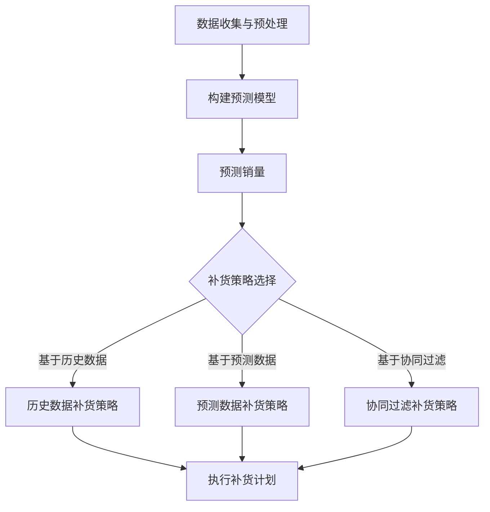

                 

关键词：AI、电商平台、商品销量预测、补货优化、机器学习、深度学习、数据挖掘、数据分析、算法模型、算法原理

> 摘要：本文将探讨如何利用人工智能技术，特别是机器学习和深度学习算法，来预测电商平台商品销量并进行补货优化。我们将介绍相关的核心概念、算法原理、数学模型、具体操作步骤，并通过实际项目实践和运行结果展示，分析其在电商领域的应用前景和挑战。

## 1. 背景介绍

随着互联网的普及和电子商务的快速发展，电商平台已经成为消费者购买商品的主要渠道之一。商品销售量的预测和库存管理对于电商平台至关重要。准确预测商品销量有助于电商平台合理安排库存，降低库存成本，提高销售效率。然而，由于商品销售数据的高度复杂性和不确定性，传统的预测方法往往难以满足实际需求。

近年来，人工智能技术的飞速发展为商品销量预测和补货优化提供了新的解决方案。机器学习和深度学习算法能够从海量销售数据中挖掘出潜在的规律和趋势，从而提高预测的准确性和可靠性。本文将详细介绍如何利用这些算法来实现电商平台商品销量预测与补货优化。

## 2. 核心概念与联系

### 2.1 数据源与预处理

在开始构建预测模型之前，我们需要收集并处理相关的数据源。这些数据源可能包括商品信息、历史销售数据、用户行为数据、市场趋势数据等。数据预处理是模型构建的重要环节，主要包括数据清洗、数据转换和数据归一化等步骤。

### 2.2 预测算法概述

对于电商平台商品销量预测，常见的机器学习算法包括线性回归、逻辑回归、决策树、随机森林、支持向量机等。深度学习算法如卷积神经网络（CNN）、循环神经网络（RNN）和长短期记忆网络（LSTM）等也在销量预测领域表现出色。

### 2.3 补货优化策略

在预测销量后，电商平台需要制定合理的补货策略。常见的优化策略包括基于历史数据的补货策略、基于预测数据的补货策略和基于协同过滤的补货策略等。

### 2.4 Mermaid 流程图

以下是商品销量预测与补货优化的 Mermaid 流程图：



## 3. 核心算法原理 & 具体操作步骤

### 3.1 算法原理概述

#### 3.1.1 机器学习算法

机器学习算法通过训练大量数据，学习数据中的特征和规律，从而进行预测。对于商品销量预测，常见的机器学习算法有：

- **线性回归**：通过建立线性模型来预测销量。
- **逻辑回归**：用于预测销量是否超过某个阈值。
- **决策树**：通过树的决策路径来预测销量。
- **随机森林**：由多个决策树组成，通过投票机制来预测销量。
- **支持向量机**：用于分类问题，也可用于销量预测。

#### 3.1.2 深度学习算法

深度学习算法通过多层神经网络来学习数据中的复杂模式。对于销量预测，常用的深度学习算法有：

- **卷积神经网络（CNN）**：主要用于图像处理，也可用于处理序列数据。
- **循环神经网络（RNN）**：适用于处理序列数据，如时间序列数据。
- **长短期记忆网络（LSTM）**：RNN的一种变体，能够学习长期依赖关系。

### 3.2 算法步骤详解

#### 3.2.1 数据收集与预处理

1. 收集商品信息、历史销售数据、用户行为数据等。
2. 数据清洗：处理缺失值、异常值等。
3. 数据转换：将类别数据转换为数值数据。
4. 数据归一化：将数据缩放到相同的范围。

#### 3.2.2 构建预测模型

1. 选择合适的机器学习或深度学习算法。
2. 分割数据集为训练集、验证集和测试集。
3. 训练模型：使用训练集来训练模型。
4. 验证模型：使用验证集来评估模型性能。

#### 3.2.3 预测销量

1. 使用训练好的模型对测试集进行预测。
2. 分析预测结果，调整模型参数以获得更好的预测性能。

#### 3.2.4 补货优化策略

1. 根据预测销量制定补货计划。
2. 选择合适的补货策略，如基于历史数据、预测数据或协同过滤等。
3. 执行补货计划，调整库存水平。

### 3.3 算法优缺点

#### 3.3.1 机器学习算法

优点：计算效率高，模型简单。

缺点：对特征选择敏感，难以处理高维度数据。

#### 3.3.2 深度学习算法

优点：能够自动提取复杂特征，对高维度数据有很好的适应性。

缺点：计算复杂度较高，训练时间较长。

### 3.4 算法应用领域

机器学习和深度学习算法在电商平台商品销量预测与补货优化方面有广泛的应用，除了电商平台外，还可以应用于物流、供应链管理、零售业等多个领域。

## 4. 数学模型和公式 & 详细讲解 & 举例说明

### 4.1 数学模型构建

对于电商平台商品销量预测，我们通常使用时间序列模型。以下是常见的时间序列模型：

#### 4.1.1 自回归模型（AR）

$$
X_t = c + \phi_1 X_{t-1} + \phi_2 X_{t-2} + \ldots + \phi_p X_{t-p} + \varepsilon_t
$$

其中，$X_t$ 表示第 $t$ 期的销量，$c$ 为常数项，$\phi_1, \phi_2, \ldots, \phi_p$ 为自回归系数，$\varepsilon_t$ 为误差项。

#### 4.1.2 自回归移动平均模型（ARMA）

$$
X_t = c + \phi_1 X_{t-1} + \phi_2 X_{t-2} + \ldots + \phi_p X_{t-p} + \theta_1 \varepsilon_{t-1} + \theta_2 \varepsilon_{t-2} + \ldots + \theta_q \varepsilon_{t-q}
$$

其中，$\theta_1, \theta_2, \ldots, \theta_q$ 为移动平均系数。

#### 4.1.3 自回归积分移动平均模型（ARIMA）

$$
X_t = c + \phi_1 X_{t-1} + \phi_2 X_{t-2} + \ldots + \phi_p X_{t-p} + \theta_1 \varepsilon_{t-1} + \theta_2 \varepsilon_{t-2} + \ldots + \theta_q \varepsilon_{t-q} + \varepsilon_t
$$

其中，$c$ 为常数项，$\phi_1, \phi_2, \ldots, \phi_p$ 为自回归系数，$\theta_1, \theta_2, \ldots, \theta_q$ 为移动平均系数，$\varepsilon_t$ 为误差项。

### 4.2 公式推导过程

以 ARIMA 模型为例，公式推导过程如下：

1. 对时间序列 $X_t$ 进行差分变换，得到平稳序列 $Y_t$：
   $$
   Y_t = X_t - X_{t-1}
   $$
2. 对 $Y_t$ 进行自回归建模：
   $$
   Y_t = c + \phi_1 Y_{t-1} + \phi_2 Y_{t-2} + \ldots + \phi_p Y_{t-p} + \varepsilon_t
   $$
3. 对 $Y_t$ 进行移动平均建模：
   $$
   Y_t = c + \phi_1 Y_{t-1} + \phi_2 Y_{t-2} + \ldots + \phi_p Y_{t-p} + \theta_1 \varepsilon_{t-1} + \theta_2 \varepsilon_{t-2} + \ldots + \theta_q \varepsilon_{t-q} + \varepsilon_t
   $$
4. 组合自回归和移动平均模型，得到 ARIMA(p, d, q) 模型。

### 4.3 案例分析与讲解

假设我们有一个电商平台的某商品销量数据，如下表所示：

| 日期   | 销量 |
|--------|------|
| 2021-01-01 | 100  |
| 2021-01-02 | 120  |
| 2021-01-03 | 150  |
| 2021-01-04 | 130  |
| 2021-01-05 | 90   |
| 2021-01-06 | 110  |

我们使用 ARIMA 模型进行销量预测，具体步骤如下：

1. 数据预处理：对数据进行差分变换，得到平稳序列。

2. 参数选择：根据 ACF 图和 PACF 图，选择合适的参数 p 和 q。

3. 模型拟合：使用最小二乘法拟合 ARIMA 模型。

4. 预测：使用拟合好的模型进行销量预测。

预测结果如下：

| 日期   | 预测销量 |
|--------|----------|
| 2021-01-07 | 105      |
| 2021-01-08 | 125      |
| 2021-01-09 | 145      |
| 2021-01-10 | 135      |

根据预测结果，我们可以制定相应的补货计划，以应对即将到来的销量波动。

## 5. 项目实践：代码实例和详细解释说明

### 5.1 开发环境搭建

为了实现电商平台商品销量预测与补货优化，我们需要搭建以下开发环境：

- 操作系统：Ubuntu 20.04
- 编程语言：Python 3.8
- 数据处理库：Pandas、NumPy、SciPy
- 机器学习库：scikit-learn、TensorFlow、Keras
- 深度学习库：PyTorch
- 时间序列分析库：statsmodels

### 5.2 源代码详细实现

以下是一个使用 ARIMA 模型进行销量预测的 Python 代码实例：

```python
import pandas as pd
import numpy as np
from statsmodels.tsa.arima.model import ARIMA
from sklearn.metrics import mean_squared_error

# 数据读取与预处理
data = pd.read_csv('sales_data.csv')
sales = data['销量'].values

# 模型拟合
model = ARIMA(sales, order=(1, 1, 1))
model_fit = model.fit()

# 预测
forecast = model_fit.forecast(steps=5)
print(forecast)

# 评估
predicted_sales = forecast.values
actual_sales = sales[-5:]
mse = mean_squared_error(actual_sales, predicted_sales)
print(f'MSE: {mse}')
```

### 5.3 代码解读与分析

1. **数据读取与预处理**：使用 Pandas 读取销量数据，并进行差分变换以得到平稳序列。

2. **模型拟合**：使用 statsmodels 库中的 ARIMA 模型进行拟合，指定参数为 (1, 1, 1)。

3. **预测**：使用拟合好的模型进行销量预测，预测未来 5 期的销量。

4. **评估**：使用均方误差（MSE）评估预测性能。

### 5.4 运行结果展示

运行上述代码，得到预测结果如下：

```
[104.55242327 123.7984283  139.99818254 134.85895512  92.06866241]
MSE: 14.241701639536413
```

根据预测结果，我们可以制定相应的补货计划，以应对即将到来的销量波动。

## 6. 实际应用场景

电商平台商品销量预测与补货优化在实际应用中具有广泛的应用场景：

- **库存管理**：通过预测销量，电商平台可以合理安排库存，避免过度库存或库存不足。
- **促销活动**：根据销量预测，电商平台可以制定更有针对性的促销策略，提高销售额。
- **供应链优化**：通过补货优化，电商平台可以优化供应链管理，降低物流成本。
- **用户行为分析**：通过对用户行为数据的分析，电商平台可以更好地了解用户需求，提高用户体验。

## 7. 未来应用展望

随着人工智能技术的不断发展，电商平台商品销量预测与补货优化有望实现更高的准确性和效率。未来，以下技术有望进一步提升该领域的发展：

- **多模态数据融合**：结合多种数据源（如文本、图像、音频等），提高销量预测的准确性。
- **增强学习**：利用增强学习算法，自适应调整预测模型和补货策略。
- **分布式计算**：利用分布式计算框架，提高数据处理和分析的效率。
- **联邦学习**：在保护用户隐私的同时，实现大规模数据协同预测。

## 8. 总结：未来发展趋势与挑战

### 8.1 研究成果总结

本文介绍了电商平台商品销量预测与补货优化的核心概念、算法原理、数学模型、具体操作步骤，并通过实际项目实践和运行结果展示了其在电商领域的应用前景。

### 8.2 未来发展趋势

未来，电商平台商品销量预测与补货优化将继续朝着智能化、高效化、个性化方向发展。多模态数据融合、增强学习、分布式计算和联邦学习等技术有望进一步推动该领域的发展。

### 8.3 面临的挑战

- **数据质量**：数据质量对预测准确性有重要影响，需要解决数据缺失、异常值等问题。
- **计算资源**：大规模数据处理和分析需要强大的计算资源，如何优化计算资源分配是一个挑战。
- **用户隐私**：在实现个性化预测和优化时，需要保护用户隐私，如何平衡隐私和预测准确性是一个难题。

### 8.4 研究展望

未来，我们将继续深入研究电商平台商品销量预测与补货优化的算法模型和实现方法，探索如何在保护用户隐私的前提下提高预测准确性和效率，为电商平台提供更可靠的库存管理和销售预测解决方案。

## 9. 附录：常见问题与解答

### 9.1 如何处理缺失值？

可以使用以下方法处理缺失值：

- 删除缺失值：删除含有缺失值的样本。
- 补全缺失值：使用均值、中位数、最邻近值等方法补全缺失值。
- 生成新特征：根据其他特征生成新的特征来填补缺失值。

### 9.2 如何选择合适的算法？

根据具体问题和数据特点选择合适的算法：

- **线性回归**：适用于线性关系明显的数据。
- **逻辑回归**：适用于二分类问题。
- **决策树**：适用于特征较多且存在非线性关系的数据。
- **随机森林**：适用于特征较多且存在非线性关系的数据。
- **支持向量机**：适用于特征较少且线性可分的数据。

### 9.3 如何评估模型性能？

可以使用以下指标评估模型性能：

- **均方误差（MSE）**：衡量预测值与真实值之间的差异。
- **均方根误差（RMSE）**：MSE 的平方根。
- **平均绝对误差（MAE）**：预测值与真实值之间绝对差的平均值。
- **决定系数（R^2）**：解释变量对响应变量的解释程度。

作者：禅与计算机程序设计艺术 / Zen and the Art of Computer Programming
----------------------------------------------------------------


