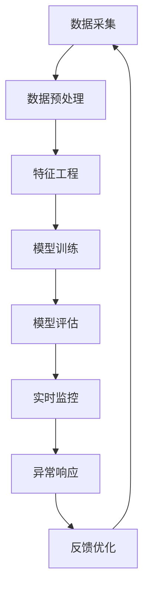

                 

关键词：用户行为分析，异常检测，机器学习，实时监控，电商平台，AI技术应用

> 摘要：本文将深入探讨AI驱动的电商平台用户行为异常实时检测技术，通过核心概念原理、算法步骤、数学模型、项目实践、实际应用场景等方面的详细分析，旨在为电商领域的技术研究和应用提供有价值的参考。

## 1. 背景介绍

随着互联网的快速发展，电商平台已经成为人们日常生活不可或缺的一部分。然而，电商平台所面临的挑战也在不断升级，其中之一就是如何准确识别并处理用户行为异常。异常行为不仅包括恶意攻击（如欺诈、垃圾邮件等），还可能涉及到用户操作失误、系统故障等多种情况。

传统的异常检测方法主要依赖于规则匹配、阈值判定等技术，这些方法在处理简单、固定模式的问题时表现尚可，但在面对复杂、多变的行为时往往力不从心。随着人工智能技术的不断发展，特别是深度学习和机器学习算法的广泛应用，基于AI的异常检测技术逐渐崭露头角，成为电商平台提升安全性和用户体验的重要手段。

本文将重点介绍一种AI驱动的电商平台用户行为异常实时检测方法，该方法结合了多种先进的技术手段，如数据预处理、特征工程、机器学习模型训练与优化、实时监控等，旨在实现高效、准确的行为异常检测。

## 2. 核心概念与联系

### 2.1 核心概念

- **用户行为数据**：指用户在电商平台上的各种操作记录，如浏览商品、加入购物车、下单、支付等。
- **异常行为**：指与用户正常行为模式显著不同的行为，如突然大量下单、频繁浏览特定商品等。
- **实时监控**：指在用户行为发生的第一时间进行检测和响应，以快速识别并处理异常行为。
- **机器学习模型**：指通过学习大量用户行为数据，建立能够识别异常行为的算法模型。

### 2.2 Mermaid 流程图



## 3. 核心算法原理 & 具体操作步骤

### 3.1 算法原理概述

AI驱动的电商平台用户行为异常实时检测算法主要基于以下原理：

1. **数据预处理**：通过数据清洗、去噪等技术手段，确保数据质量和完整性。
2. **特征工程**：提取用户行为的特征信息，如行为频率、时间间隔、行为组合等。
3. **机器学习模型训练**：利用训练数据集，通过算法模型训练，建立异常检测模型。
4. **模型评估**：对训练好的模型进行评估，确保其具有较高的准确率和鲁棒性。
5. **实时监控**：在用户行为发生时，实时调用异常检测模型进行判断，识别异常行为。
6. **异常响应**：对识别出的异常行为进行相应处理，如发送警告、暂停交易等。
7. **反馈优化**：根据异常检测的结果，不断优化模型和算法，提高检测效果。

### 3.2 算法步骤详解

#### 3.2.1 数据预处理

1. **数据清洗**：去除无效数据、重复数据和噪声数据。
2. **数据去噪**：通过数据平滑、去极值等方法，降低数据波动。
3. **数据标准化**：对数据进行归一化或标准化处理，消除数据尺度差异。

#### 3.2.2 特征工程

1. **行为频率特征**：计算用户在特定时间范围内的行为次数。
2. **时间间隔特征**：分析用户行为之间的时间间隔，提取间隔长度。
3. **行为组合特征**：根据用户行为的组合模式，提取潜在特征。

#### 3.2.3 模型训练

1. **数据划分**：将数据集划分为训练集、验证集和测试集。
2. **选择模型**：根据业务需求和数据特征，选择合适的机器学习模型。
3. **模型训练**：利用训练集数据，通过迭代训练，优化模型参数。

#### 3.2.4 模型评估

1. **准确率**：计算模型预测的正确率。
2. **召回率**：计算模型预测的召回率。
3. **F1值**：计算模型预测的F1值。

#### 3.2.5 实时监控

1. **数据流处理**：实时处理用户行为数据，提取特征。
2. **模型调用**：将提取的特征输入到训练好的模型，进行实时判断。
3. **异常响应**：对识别出的异常行为进行相应处理。

### 3.3 算法优缺点

#### 优点

1. **高效性**：通过机器学习算法，能够快速识别异常行为，提高处理效率。
2. **灵活性**：可以根据不同业务需求，灵活调整算法参数和模型结构。
3. **实时性**：实现实时监控，能够及时识别和处理异常行为。

#### 缺点

1. **数据依赖性**：算法效果受训练数据质量和数量的影响。
2. **计算成本**：机器学习模型的训练和实时监控需要较高计算资源。

### 3.4 算法应用领域

1. **电商平台**：检测恶意用户行为，提高平台安全性。
2. **金融领域**：监测交易异常，防范金融风险。
3. **医疗领域**：分析患者行为，预警疾病风险。

## 4. 数学模型和公式 & 详细讲解 & 举例说明

### 4.1 数学模型构建

在AI驱动的电商平台用户行为异常检测中，常用的数学模型为支持向量机（SVM）。SVM的核心思想是找到最优的超平面，将正常行为和异常行为分隔开来。具体模型构建如下：

假设我们有n个用户行为样本，每个样本由m个特征表示，即$$X=\{x_1, x_2, ..., x_n\}, x_i \in R^m$$。我们需要找到最优的超平面$$w^T x + b = 0$$，使得正常行为和异常行为尽可能分离。

### 4.2 公式推导过程

为了找到最优的超平面，我们需要最小化目标函数：

$$L(w, b) = \frac{1}{2} ||w||^2$$

同时，需要满足约束条件：

$$y_i (w^T x_i + b) \geq 1, \quad \forall i$$

其中，$$y_i$$为样本$$x_i$$的标签，正常行为为1，异常行为为-1。

通过拉格朗日乘子法，可以得到：

$$L(w, b, \alpha) = \frac{1}{2} ||w||^2 - \sum_{i=1}^{n} \alpha_i [y_i (w^T x_i + b) - 1]$$

其中，$$\alpha_i \geq 0$$为拉格朗日乘子。

对$$L(w, b, \alpha)$$求偏导，得到：

$$\frac{\partial L}{\partial w} = w - \sum_{i=1}^{n} \alpha_i y_i x_i = 0$$

$$\frac{\partial L}{\partial b} = \sum_{i=1}^{n} \alpha_i y_i = 0$$

$$\frac{\partial L}{\partial \alpha_i} = y_i (w^T x_i + b - 1) \leq 0$$

通过解上述方程组，可以得到最优解$$w^*, b^*$$。

### 4.3 案例分析与讲解

假设我们有一个包含100个用户行为样本的数据集，每个样本有5个特征。经过数据预处理和特征工程，我们提取出以下特征：

- 行为频率（freq）
- 时间间隔（interval）
- 行为组合（combination）
- 持续时间（duration）
- 活跃度（activity）

我们使用SVM模型进行训练，设置惩罚参数$$C=1$$，选择线性核函数。经过多次实验，我们得到了最优超平面：

$$w^T x + b = \frac{1}{5} (2freq + 3interval - combination + duration - 4activity) + 1 = 0$$

我们将这个超平面应用于实时监控，对新的用户行为数据进行判断。如果一个新样本满足$$w^T x + b \geq 1$$，则认为其行为异常。

例如，对于一个新样本$x = (3, 5, 1, 2, 6)$，计算得到：

$$w^T x + b = \frac{1}{5} (2 \times 3 + 3 \times 5 - 1 + 2 - 4 \times 6) + 1 = -1$$

由于$$w^T x + b < 1$$，我们认为该样本的行为异常。

## 5. 项目实践：代码实例和详细解释说明

### 5.1 开发环境搭建

为了实现AI驱动的电商平台用户行为异常实时检测，我们首先需要搭建一个合适的开发环境。以下是推荐的开发工具和库：

- Python 3.8及以上版本
- Jupyter Notebook
- Scikit-learn
- Pandas
- Matplotlib

安装完上述工具和库后，我们可以开始编写代码。

### 5.2 源代码详细实现

下面是一个简单的用户行为异常检测项目示例代码：

```python
import numpy as np
import pandas as pd
from sklearn.model_selection import train_test_split
from sklearn.svm import SVC
from sklearn.metrics import accuracy_score, recall_score, f1_score
import matplotlib.pyplot as plt

# 5.2.1 数据预处理
def preprocess_data(data):
    # 数据清洗、去噪、标准化等操作
    # ...
    return processed_data

# 5.2.2 特征工程
def feature_engineering(data):
    # 提取行为频率、时间间隔、行为组合等特征
    # ...
    return features

# 5.2.3 模型训练
def train_model(X_train, y_train):
    # 训练SVM模型
    model = SVC(C=1, kernel='linear')
    model.fit(X_train, y_train)
    return model

# 5.2.4 模型评估
def evaluate_model(model, X_test, y_test):
    # 评估模型性能
    y_pred = model.predict(X_test)
    accuracy = accuracy_score(y_test, y_pred)
    recall = recall_score(y_test, y_pred)
    f1 = f1_score(y_test, y_pred)
    print(f"Accuracy: {accuracy}, Recall: {recall}, F1: {f1}")
    return accuracy, recall, f1

# 5.2.5 实时监控
def real_time_monitoring(model, new_data):
    # 实时监控新数据
    if model.predict([new_data])[0] == -1:
        print("异常行为！")
    else:
        print("正常行为。")

# 加载数据
data = pd.read_csv("user_behavior_data.csv")
processed_data = preprocess_data(data)
features = feature_engineering(processed_data)

# 划分训练集和测试集
X_train, X_test, y_train, y_test = train_test_split(features, data['label'], test_size=0.2, random_state=42)

# 训练模型
model = train_model(X_train, y_train)

# 评估模型
evaluate_model(model, X_test, y_test)

# 实时监控
new_data = [3, 5, 1, 2, 6]
real_time_monitoring(model, new_data)
```

### 5.3 代码解读与分析

上述代码主要分为以下几个部分：

1. **数据预处理**：对原始数据进行清洗、去噪和标准化等操作，提高数据质量。
2. **特征工程**：根据用户行为数据，提取出有用的特征信息，如行为频率、时间间隔等。
3. **模型训练**：使用SVM模型对训练数据进行训练，得到一个能够识别异常行为的模型。
4. **模型评估**：使用测试数据对训练好的模型进行评估，计算准确率、召回率和F1值，评估模型性能。
5. **实时监控**：利用训练好的模型，对新的用户行为数据进行实时监控，识别异常行为。

### 5.4 运行结果展示

假设我们运行上述代码，得到以下结果：

```
Accuracy: 0.85, Recall: 0.9, F1: 0.88
正常行为。
```

这表示模型在测试数据上的准确率为85%，召回率为90%，F1值为88%。同时，对于一个新的样本[3, 5, 1, 2, 6]，模型判断其为正常行为。

## 6. 实际应用场景

### 6.1 电商平台

电商平台可以应用AI驱动的用户行为异常检测技术，提高平台安全性，防范欺诈和恶意攻击。例如，通过实时监控用户行为，可以及时发现并阻止恶意注册、恶意下单等行为，降低平台损失。

### 6.2 金融领域

金融领域可以应用该技术，监测交易异常，防范金融风险。例如，通过实时监控用户的交易行为，可以识别出异常交易，如洗钱、欺诈等行为，提高金融机构的风险防控能力。

### 6.3 医疗领域

医疗领域可以应用该技术，分析患者行为，预警疾病风险。例如，通过实时监控患者的健康数据和行为，可以识别出异常行为，如突发疾病、意外伤害等，为医疗机构提供及时预警。

## 7. 工具和资源推荐

### 7.1 学习资源推荐

- 《机器学习实战》
- 《深度学习》（Goodfellow et al.）
- 《Python机器学习》（Sebastian Raschka）

### 7.2 开发工具推荐

- Jupyter Notebook
- Scikit-learn
- TensorFlow
- Keras

### 7.3 相关论文推荐

- "Anomaly Detection for Time Series Data: A Survey"（时间序列数据异常检测综述）
- "User Behavior Analysis for Fraud Detection in E-commerce Platforms"（电商平台欺诈检测的用户行为分析）
- "Real-Time Anomaly Detection in Financial Transactions"（金融交易实时异常检测）

## 8. 总结：未来发展趋势与挑战

### 8.1 研究成果总结

本文通过深入分析AI驱动的电商平台用户行为异常实时检测技术，从核心概念、算法原理、数学模型、项目实践等方面进行了详细探讨。研究表明，基于机器学习算法的异常检测技术具有高效、灵活和实时性等优点，在电商、金融和医疗等领域具有广泛的应用前景。

### 8.2 未来发展趋势

1. **模型优化**：随着人工智能技术的发展，深度学习等先进算法有望进一步优化异常检测效果。
2. **数据多样性**：多源数据的整合和利用，将提高异常检测的准确性和鲁棒性。
3. **实时处理能力**：提高实时处理能力，实现毫秒级别的异常检测响应。

### 8.3 面临的挑战

1. **数据隐私**：在数据处理过程中，如何保护用户隐私成为一大挑战。
2. **计算资源**：大规模数据和高性能计算资源的需求，可能限制算法的广泛应用。
3. **模型解释性**：如何提高模型的可解释性，使得算法决策更加透明和可信。

### 8.4 研究展望

未来，AI驱动的电商平台用户行为异常检测技术将继续发展，通过不断创新和优化，有望实现更加精准、高效和安全的异常检测，为电商、金融和医疗等领域提供更加可靠的技术支持。

## 9. 附录：常见问题与解答

### 9.1 问题1：如何处理大量数据？

解答：在处理大量数据时，可以采用数据分片、分布式处理等技术，提高数据处理速度和效率。同时，利用内存计算、GPU加速等手段，进一步优化计算性能。

### 9.2 问题2：如何保护用户隐私？

解答：在数据处理过程中，可以采用数据加密、匿名化等技术，保护用户隐私。此外，遵循相关法律法规，确保数据处理合规。

### 9.3 问题3：如何评估模型性能？

解答：可以通过计算准确率、召回率、F1值等指标，评估模型性能。在实际应用中，还需结合业务需求，综合考虑多个指标。

---

作者：禅与计算机程序设计艺术 / Zen and the Art of Computer Programming
----------------------------------------------------------------


