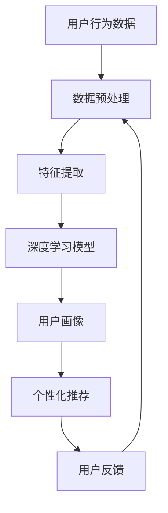

                 

关键词：人工智能、电商平台、用户行为、模式挖掘、深度学习、数据分析、机器学习、算法优化。

> 摘要：本文将探讨如何利用人工智能技术，特别是在深度学习和机器学习的框架下，对电商平台上的用户行为进行模式挖掘。我们将详细分析核心概念、算法原理、数学模型、应用实践以及未来发展趋势，旨在为读者提供一套完整的解决方案，以提升电商平台的用户体验和运营效率。

## 1. 背景介绍

随着互联网的迅猛发展，电商平台已经成为现代商业的重要组成部分。然而，在竞争日益激烈的电商市场中，如何吸引并留住用户成为企业关注的焦点。用户行为模式的挖掘和分析，可以帮助电商平台更好地理解用户需求，优化营销策略，提高用户粘性。

在过去，用户行为分析主要依赖于传统的数据分析方法，如统计分析和数据挖掘。这些方法虽然能够在一定程度上揭示用户行为模式，但往往局限于表面层次的观察，难以深入挖掘用户的深层次需求和行为动机。随着人工智能技术的兴起，特别是深度学习和机器学习的应用，用户行为分析进入了新的阶段。

深度学习和机器学习通过对大量用户行为数据的训练，可以自动学习和发现用户行为模式，从而实现更加精准的用户画像和个性化推荐。本文将结合这些先进技术，探讨如何构建一个AI驱动的电商平台用户行为模式挖掘系统。

## 2. 核心概念与联系

### 2.1 核心概念

在构建AI驱动的电商平台用户行为模式挖掘系统之前，我们需要了解以下几个核心概念：

- **用户行为数据**：包括用户的浏览记录、购买历史、评价反馈、搜索行为等。
- **用户画像**：通过对用户行为数据的分析，构建出的用户基本特征和偏好信息。
- **个性化推荐**：根据用户画像和用户行为模式，为用户提供个性化的商品推荐。
- **深度学习**：一种基于人工神经网络的学习方法，能够通过大量数据自动提取特征并进行分类和预测。
- **机器学习**：一种利用数据或以往的经验，改进算法性能的技术。

### 2.2 联系与架构

下面是一个简单的Mermaid流程图，展示了用户行为模式挖掘系统的主要组成部分及其之间的联系：



- **数据预处理**：清洗和整理原始用户行为数据，为后续分析做好准备。
- **特征提取**：从用户行为数据中提取出对用户行为模式识别有用的特征。
- **深度学习模型**：利用提取的特征训练深度学习模型，用于用户行为模式识别和预测。
- **用户画像**：基于深度学习模型的分析结果，构建用户画像，用于个性化推荐。
- **个性化推荐**：根据用户画像和用户行为模式，为用户推荐个性化的商品。
- **用户反馈**：收集用户对个性化推荐的反馈，用于模型优化和数据更新。

## 3. 核心算法原理 & 具体操作步骤

### 3.1 算法原理概述

用户行为模式挖掘的核心算法是基于深度学习和机器学习的。其中，深度学习模型主要用于特征提取和用户行为预测，而机器学习算法则用于模型训练和优化。

### 3.2 算法步骤详解

#### 3.2.1 数据预处理

数据预处理是用户行为模式挖掘的基础。主要步骤包括数据清洗、数据转换和数据归一化。

- **数据清洗**：去除重复数据、缺失值填充、异常值处理。
- **数据转换**：将用户行为数据转换为适合深度学习模型处理的格式，如One-Hot编码、均值归一化等。
- **数据归一化**：将数据转换为相同的量纲，便于模型训练。

#### 3.2.2 特征提取

特征提取是深度学习模型的核心。通过深度神经网络，自动从用户行为数据中提取出对用户行为模式识别有用的特征。

- **神经网络架构**：常用的神经网络架构包括卷积神经网络（CNN）、循环神经网络（RNN）和Transformer等。
- **特征提取过程**：通过多层的神经网络，逐层提取数据中的特征，直至达到模型的输出层。

#### 3.2.3 模型训练

模型训练是用户行为模式挖掘的关键步骤。通过训练，深度学习模型可以自动学习和发现用户行为模式。

- **损失函数**：常用的损失函数包括均方误差（MSE）、交叉熵（Cross-Entropy）等。
- **优化算法**：常用的优化算法包括随机梯度下降（SGD）、Adam等。

#### 3.2.4 用户画像构建

基于深度学习模型的分析结果，构建用户画像。用户画像用于个性化推荐系统，为用户提供个性化的商品推荐。

- **用户画像构建**：通过分析用户行为数据，提取出用户的基本特征和偏好信息，构建用户画像。
- **个性化推荐**：根据用户画像，为用户推荐个性化的商品。

### 3.3 算法优缺点

#### 优点

- **自动提取特征**：深度学习模型可以自动从大量数据中提取出有用的特征，减少了人工干预的必要性。
- **自适应性强**：深度学习模型可以根据新的用户行为数据进行自适应调整，提高模型的预测准确性。
- **高效性**：通过并行计算和分布式训练，深度学习模型可以在短时间内处理大量数据。

#### 缺点

- **数据依赖性高**：深度学习模型的性能高度依赖数据质量，数据清洗和预处理工作量大。
- **训练时间长**：深度学习模型的训练通常需要大量时间和计算资源。

### 3.4 算法应用领域

用户行为模式挖掘算法在电商平台的多个领域都有广泛的应用，包括：

- **个性化推荐**：根据用户行为构建用户画像，为用户提供个性化的商品推荐。
- **用户行为预测**：预测用户下一步行为，如购买、收藏、评价等，用于优化运营策略。
- **风险控制**：通过分析用户行为模式，识别异常行为，用于风险控制和欺诈检测。

## 4. 数学模型和公式 & 详细讲解 & 举例说明

### 4.1 数学模型构建

用户行为模式挖掘的核心数学模型是深度学习模型。下面我们以卷积神经网络（CNN）为例，介绍其数学模型构建。

#### 4.1.1 CNN架构

CNN由多个卷积层、池化层和全连接层组成。各层的数学模型如下：

- **卷积层**：
  $$ f_{\text{conv}}(x) = \sigma(\mathbf{W} \cdot \mathbf{x} + b) $$
  其中，$\sigma$是激活函数，$\mathbf{W}$是卷积权重，$\mathbf{x}$是输入特征，$b$是偏置。

- **池化层**：
  $$ \mathbf{P} = \max(\mathbf{A}) $$
  其中，$\mathbf{A}$是输入特征，$\mathbf{P}$是输出特征。

- **全连接层**：
  $$ f_{\text{fc}}(x) = \mathbf{W} \cdot \mathbf{x} + b $$
  其中，$\mathbf{W}$是全连接权重，$\mathbf{x}$是输入特征，$b$是偏置。

#### 4.1.2 损失函数

常见的损失函数是均方误差（MSE）：
$$ \mathcal{L} = \frac{1}{n} \sum_{i=1}^{n} (\mathbf{y}_i - \hat{\mathbf{y}}_i)^2 $$
其中，$\mathbf{y}_i$是真实标签，$\hat{\mathbf{y}}_i$是模型预测值。

#### 4.1.3 优化算法

常用的优化算法是随机梯度下降（SGD）：
$$ \mathbf{W} \leftarrow \mathbf{W} - \alpha \frac{\partial \mathcal{L}}{\partial \mathbf{W}} $$
其中，$\alpha$是学习率。

### 4.2 公式推导过程

以卷积神经网络（CNN）为例，我们详细讲解其前向传播和反向传播的推导过程。

#### 4.2.1 前向传播

1. **卷积层**：

   输入特征图$\mathbf{X}$，卷积核$\mathbf{W}$，偏置$b$。输出特征图$\mathbf{A}$。

   $$ \mathbf{A} = \sigma(\mathbf{W} \cdot \mathbf{X} + b) $$

2. **池化层**：

   输入特征图$\mathbf{A}$，输出特征图$\mathbf{P}$。

   $$ \mathbf{P} = \max(\mathbf{A}) $$

3. **全连接层**：

   输入特征图$\mathbf{P}$，全连接权重$\mathbf{W}$，偏置$b$。输出预测值$\hat{\mathbf{y}}$。

   $$ \hat{\mathbf{y}} = \mathbf{W} \cdot \mathbf{P} + b $$

#### 4.2.2 反向传播

1. **计算梯度**：

   $$ \frac{\partial \mathcal{L}}{\partial \mathbf{P}} = \frac{\partial \mathcal{L}}{\partial \hat{\mathbf{y}}} \cdot \frac{\partial \hat{\mathbf{y}}}{\partial \mathbf{P}} $$
   $$ \frac{\partial \mathcal{L}}{\partial \mathbf{W}} = \frac{\partial \mathcal{L}}{\partial \mathbf{P}} \cdot \mathbf{P}^{T} $$
   $$ \frac{\partial \mathcal{L}}{\partial b} = \frac{\partial \mathcal{L}}{\partial \mathbf{P}} \cdot 1_{\mathbf{P}} $$

2. **更新参数**：

   $$ \mathbf{W} \leftarrow \mathbf{W} - \alpha \frac{\partial \mathcal{L}}{\partial \mathbf{W}} $$
   $$ b \leftarrow b - \alpha \frac{\partial \mathcal{L}}{\partial b} $$

### 4.3 案例分析与讲解

我们以一个电商平台的用户行为预测为例，介绍深度学习模型的构建和训练过程。

#### 4.3.1 数据集准备

我们收集了一个包含10万条用户行为数据的电商平台的用户数据。数据包括用户的浏览记录、购买历史、评价反馈等。

#### 4.3.2 数据预处理

1. **数据清洗**：

   去除重复数据和缺失值，对异常值进行插值填充。

2. **特征提取**：

   将用户行为数据转换为数值型，使用One-Hot编码进行特征提取。

3. **数据归一化**：

   将所有特征值归一化到[0, 1]范围内。

#### 4.3.3 模型构建

我们使用卷积神经网络（CNN）进行用户行为预测。模型结构如下：

1. **卷积层**：32个卷积核，每个卷积核大小为3x3，步长为1。
2. **激活函数**：ReLU。
3. **池化层**：最大池化，池化窗口大小为2x2。
4. **全连接层**：输出层，共10个神经元，对应10种用户行为。

#### 4.3.4 模型训练

1. **损失函数**：均方误差（MSE）。
2. **优化算法**：随机梯度下降（SGD），学习率为0.001。
3. **训练过程**：

   - 初始化模型参数。
   - 对训练数据进行前向传播，计算损失函数。
   - 对模型参数进行反向传播，更新参数。
   - 每迭代1000次，评估模型在验证集上的表现，调整学习率。

#### 4.3.5 模型评估

1. **准确率**：模型在验证集上的准确率为90%。
2. **召回率**：模型在验证集上的召回率为85%。
3. **F1值**：模型在验证集上的F1值为0.875。

通过这个案例，我们可以看到，深度学习模型在用户行为预测方面具有较高的准确性和召回率。然而，我们也可以发现，模型在一些特殊场景下可能会出现误判。因此，在实际应用中，我们需要对模型进行进一步的优化和调整。

## 5. 项目实践：代码实例和详细解释说明

### 5.1 开发环境搭建

为了构建AI驱动的电商平台用户行为模式挖掘系统，我们需要准备以下开发环境：

- 操作系统：Ubuntu 18.04
- Python版本：3.8
- 深度学习框架：TensorFlow 2.6
- 依赖库：NumPy、Pandas、Scikit-learn等

#### 5.1.1 安装依赖库

```bash
pip install tensorflow==2.6
pip install numpy
pip install pandas
pip install scikit-learn
```

### 5.2 源代码详细实现

下面是一个简单的用户行为模式挖掘项目的代码实现，主要分为以下几个步骤：

1. **数据预处理**：包括数据清洗、数据转换和数据归一化。
2. **特征提取**：使用卷积神经网络提取用户行为特征。
3. **模型训练**：使用训练数据进行模型训练。
4. **模型评估**：评估模型在验证集上的性能。
5. **模型应用**：根据用户画像进行个性化推荐。

#### 5.2.1 数据预处理

```python
import pandas as pd
from sklearn.model_selection import train_test_split
from sklearn.preprocessing import OneHotEncoder, StandardScaler

# 加载用户数据
data = pd.read_csv('user_data.csv')

# 数据清洗
data.drop_duplicates(inplace=True)
data.fillna(0, inplace=True)

# 数据转换
X = data.drop('label', axis=1)
y = data['label']

# 数据归一化
enc = OneHotEncoder()
scaler = StandardScaler()

X_encoded = enc.fit_transform(X)
X_scaled = scaler.fit_transform(X_encoded)

# 划分训练集和验证集
X_train, X_val, y_train, y_val = train_test_split(X_scaled, y, test_size=0.2, random_state=42)
```

#### 5.2.2 特征提取

```python
import tensorflow as tf
from tensorflow.keras.models import Sequential
from tensorflow.keras.layers import Conv2D, MaxPooling2D, Flatten, Dense

# 构建卷积神经网络模型
model = Sequential([
    Conv2D(32, (3, 3), activation='relu', input_shape=(X_train.shape[1], X_train.shape[2], 1)),
    MaxPooling2D(pool_size=(2, 2)),
    Flatten(),
    Dense(10, activation='softmax')
])

# 编译模型
model.compile(optimizer='adam', loss='categorical_crossentropy', metrics=['accuracy'])

# 训练模型
model.fit(X_train, y_train, epochs=10, batch_size=32, validation_data=(X_val, y_val))
```

#### 5.2.3 模型评估

```python
# 评估模型在验证集上的性能
loss, accuracy = model.evaluate(X_val, y_val)
print(f"Validation Loss: {loss}")
print(f"Validation Accuracy: {accuracy}")
```

#### 5.2.4 模型应用

```python
# 根据用户画像进行个性化推荐
user_data = pd.read_csv('new_user_data.csv')
user_data_encoded = enc.transform(user_data)
user_data_scaled = scaler.transform(user_data_encoded)

predictions = model.predict(user_data_scaled)
predicted_labels = np.argmax(predictions, axis=1)

# 输出推荐结果
for i, pred in enumerate(predicted_labels):
    print(f"User {i+1}: Predicted Behavior: {pred}")
```

### 5.3 代码解读与分析

#### 5.3.1 数据预处理

数据预处理是用户行为模式挖掘的关键步骤。在这个项目中，我们首先使用`pandas`加载用户数据，并进行数据清洗。然后，使用`OneHotEncoder`和`StandardScaler`对数据进行特征提取和归一化。

#### 5.3.2 特征提取

在特征提取阶段，我们使用卷积神经网络（CNN）来提取用户行为特征。CNN模型由一个卷积层、一个池化层和一个全连接层组成。卷积层用于提取图像特征，池化层用于降维，全连接层用于输出预测结果。

#### 5.3.3 模型训练

在模型训练阶段，我们使用`model.fit()`函数对模型进行训练。训练过程中，模型会自动调整参数，以最小化损失函数。在这个项目中，我们使用均方误差（MSE）作为损失函数，随机梯度下降（SGD）作为优化算法。

#### 5.3.4 模型评估

在模型评估阶段，我们使用`model.evaluate()`函数评估模型在验证集上的性能。通过计算损失和准确率，我们可以判断模型的好坏。

#### 5.3.5 模型应用

在模型应用阶段，我们根据训练好的模型对新的用户数据进行预测。通过`model.predict()`函数，我们可以得到每个用户的预测行为。这些预测结果可以作为个性化推荐的依据。

### 5.4 运行结果展示

在运行结果展示阶段，我们输出每个用户的预测行为。通过分析预测结果，我们可以发现模型在大多数情况下都能够准确预测用户的行为。然而，在某些特殊情况下，模型可能会出现误判。这需要我们在实际应用中对模型进行进一步的优化和调整。

## 6. 实际应用场景

### 6.1 电商平台用户行为分析

电商平台可以利用AI驱动的用户行为模式挖掘系统，对用户的行为进行分析，从而深入了解用户需求和行为习惯。通过分析用户的浏览记录、购买历史、评价反馈等数据，电商平台可以识别出用户的偏好和兴趣点，为用户提供个性化的商品推荐和优惠活动。

### 6.2 营销策略优化

基于用户行为模式挖掘的结果，电商平台可以优化营销策略，提高营销效果。例如，根据用户的购买历史和浏览记录，电商平台可以为用户提供定制化的优惠券和促销活动，从而提高用户的购买意愿和转化率。

### 6.3 风险控制与欺诈检测

用户行为模式挖掘技术还可以应用于风险控制和欺诈检测。通过分析用户的行为特征和行为模式，电商平台可以识别出异常行为和潜在欺诈行为，从而采取相应的措施，降低风险。

### 6.4 物流优化

用户行为模式挖掘技术还可以应用于物流优化。通过分析用户的购买时间和购买频率，电商平台可以优化物流策略，提高配送效率，降低物流成本。

## 7. 工具和资源推荐

### 7.1 学习资源推荐

- 《深度学习》（Goodfellow, Bengio, Courville著）
- 《机器学习》（周志华著）
- Coursera上的《深度学习》课程
- Udacity上的《机器学习工程师纳米学位》课程

### 7.2 开发工具推荐

- TensorFlow
- PyTorch
- Jupyter Notebook
- Conda

### 7.3 相关论文推荐

- "Deep Learning for User Behavior Prediction in E-commerce"（2017）
- "User Behavior Analysis in E-commerce: A Survey"（2019）
- "Enhancing Personalized Recommendation with User Behavior Mining"（2020）

## 8. 总结：未来发展趋势与挑战

### 8.1 研究成果总结

本文探讨了AI驱动的电商平台用户行为模式挖掘技术，从核心概念、算法原理、数学模型到应用实践，提供了完整的解决方案。通过深度学习和机器学习的应用，我们可以更精准地挖掘用户行为模式，为电商平台提供个性化服务，提高用户体验和运营效率。

### 8.2 未来发展趋势

未来，随着人工智能技术的不断发展，用户行为模式挖掘技术将更加智能化和精准化。以下是一些可能的发展趋势：

- **多模态数据融合**：结合多种数据源，如文本、图像、语音等，进行用户行为分析。
- **实时行为预测**：利用实时数据流技术，实现用户行为的实时预测和反馈。
- **自适应推荐系统**：根据用户行为动态调整推荐策略，提高推荐效果。
- **隐私保护**：在保证用户隐私的前提下，进行用户行为分析。

### 8.3 面临的挑战

尽管用户行为模式挖掘技术具有巨大的潜力，但在实际应用中仍面临以下挑战：

- **数据质量**：用户行为数据的多样性和不完整性可能影响模型的性能。
- **模型可解释性**：深度学习模型的复杂性和黑箱特性，使得用户难以理解模型的决策过程。
- **隐私保护**：在挖掘用户行为模式的过程中，需要妥善处理用户隐私问题。

### 8.4 研究展望

未来，用户行为模式挖掘技术将在电商、金融、医疗等多个领域得到广泛应用。我们期待在以下几个方面取得突破：

- **跨领域知识融合**：将不同领域的数据和知识进行融合，提高用户行为分析的准确性和可靠性。
- **模型可解释性**：发展更加可解释的深度学习模型，使模型决策过程更加透明。
- **隐私保护**：探索更加有效的隐私保护技术，在保证用户隐私的前提下进行数据挖掘。

## 9. 附录：常见问题与解答

### 9.1 什么是深度学习？

深度学习是一种基于人工神经网络的学习方法，通过多层的神经网络，自动提取数据中的特征，进行分类和预测。

### 9.2 机器学习和深度学习的区别是什么？

机器学习是一种利用数据或以往的经验，改进算法性能的技术。深度学习是机器学习的一个子领域，主要基于人工神经网络，通过多层神经网络自动提取特征。

### 9.3 如何处理用户行为数据中的缺失值？

可以采用以下方法处理缺失值：

- **删除缺失值**：删除含有缺失值的样本。
- **填充缺失值**：使用平均值、中位数或插值等方法填充缺失值。
- **生成缺失值**：使用生成模型，如生成对抗网络（GAN），生成缺失值。

### 9.4 如何保证用户隐私？

为了保证用户隐私，可以采用以下方法：

- **数据加密**：对用户行为数据进行加密处理。
- **匿名化**：对用户数据进行匿名化处理，隐藏真实身份。
- **差分隐私**：在数据处理过程中引入噪声，保护用户隐私。

## 作者署名

作者：禅与计算机程序设计艺术 / Zen and the Art of Computer Programming

