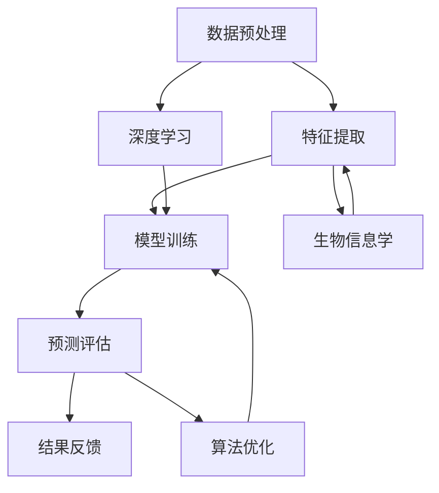

                 

关键词：AI药物毒性预测模型，深度学习，生物信息学，数据处理，算法优化，药物开发

## 摘要

本文将深入探讨AI驱动的药物毒性预测模型的研究进展和应用。药物毒性预测是药物研发过程中至关重要的一环，传统的药物毒性评估方法往往耗时较长且成本高昂。随着深度学习和生物信息学技术的不断发展，AI驱动的药物毒性预测模型逐渐成为研究的热点。本文将详细介绍这些模型的核心概念、算法原理、数学模型及实际应用，为相关领域的研究者和开发者提供有益的参考。

## 1. 背景介绍

药物毒性预测在药物研发过程中占据着重要地位。药物从发现到上市需要经过多个阶段，其中毒性评估是关键步骤之一。传统的药物毒性评估方法主要包括体外实验和体内实验，这些方法虽然能够提供较为可靠的毒性数据，但存在以下问题：

1. **实验成本高**：体外实验和体内实验都需要大量的试剂、设备和动物资源，导致实验成本高昂。
2. **时间长**：药物毒性评估过程往往需要数月甚至数年的时间，严重影响了新药的上市速度。
3. **结果不准确**：体外实验和体内实验存在个体差异，导致实验结果存在一定的不确定性。

为了解决上述问题，科学家们开始探索利用人工智能技术进行药物毒性预测。深度学习和生物信息学技术的快速发展为这一领域的研究提供了强大的工具。通过大数据分析和模型训练，AI驱动的药物毒性预测模型能够快速、准确地预测药物毒性，为新药研发提供有力支持。

## 2. 核心概念与联系

在介绍AI驱动的药物毒性预测模型之前，我们需要了解一些核心概念和它们之间的联系。

### 2.1 深度学习

深度学习是人工智能的一个重要分支，通过模拟人脑神经网络的工作方式，实现对复杂数据的分析和处理。在药物毒性预测模型中，深度学习算法可以自动从大量数据中学习到有用的特征，从而提高预测的准确性。

### 2.2 生物信息学

生物信息学是生物学和信息技术的交叉学科，致力于利用计算机技术和算法对生物数据进行处理和分析。在药物毒性预测模型中，生物信息学技术可以帮助我们提取药物分子和毒性的生物特征，为新药研发提供重要信息。

### 2.3 数据处理

数据处理是药物毒性预测模型的基础。通过清洗、归一化和特征提取等技术，我们可以将原始数据转化为适合模型训练的格式。在药物毒性预测中，数据处理的质量直接影响模型的性能。

### 2.4 算法优化

算法优化是提高药物毒性预测模型性能的关键。通过调整模型参数、优化算法结构和改进训练方法，我们可以进一步提高模型的预测准确性。

### 2.5 Mermaid流程图

以下是一个简化的Mermaid流程图，展示了AI驱动的药物毒性预测模型的核心概念和联系：



## 3. 核心算法原理 & 具体操作步骤

### 3.1 算法原理概述

AI驱动的药物毒性预测模型通常基于深度学习和生物信息学技术。深度学习算法可以自动从大量数据中学习到有用的特征，从而提高预测的准确性。生物信息学技术则帮助我们提取药物分子和毒性的生物特征，为新药研发提供重要信息。

### 3.2 算法步骤详解

#### 3.2.1 数据预处理

数据预处理是药物毒性预测模型的关键步骤。首先，我们需要对原始数据进行清洗，去除噪声和异常值。然后，对数据进行归一化处理，使其具有相同的量纲。最后，通过特征提取技术，将原始数据转化为适合模型训练的格式。

#### 3.2.2 模型训练

在模型训练阶段，我们需要选择合适的深度学习算法和参数。常见的深度学习算法包括卷积神经网络（CNN）、循环神经网络（RNN）和变换器（Transformer）等。通过大量的训练数据和标签，模型可以学习到药物分子和毒性之间的关系。在训练过程中，我们需要使用优化算法来调整模型参数，使预测结果更加准确。

#### 3.2.3 预测评估

模型训练完成后，我们需要对模型进行预测评估。常用的评估指标包括准确率、召回率、F1分数等。通过交叉验证和超参数调整，我们可以选择最佳的模型和参数。

#### 3.2.4 结果反馈

在预测评估阶段，我们会对模型的预测结果进行反馈。如果预测结果不准确，我们需要分析原因并调整模型结构或参数。通过反复迭代和优化，我们可以进一步提高模型的性能。

### 3.3 算法优缺点

#### 优点：

1. **高效性**：深度学习算法可以自动从大量数据中学习到有用的特征，大大提高了药物毒性预测的效率。
2. **准确性**：通过不断优化模型结构和参数，AI驱动的药物毒性预测模型可以达到较高的预测准确性。
3. **泛化性**：深度学习算法具有较强的泛化能力，可以在不同的数据集和应用场景中取得良好的性能。

#### 缺点：

1. **数据需求**：深度学习算法需要大量的训练数据和标注数据，这对于资源有限的实验室和初创公司来说是一个挑战。
2. **计算成本**：深度学习算法的训练和预测过程需要大量的计算资源，可能导致成本较高。
3. **模型解释性**：深度学习算法的黑箱性质使其难以解释，对于药物毒性预测中的具体机制和决策过程，我们需要进一步研究。

### 3.4 算法应用领域

AI驱动的药物毒性预测模型在药物研发、毒性预测和风险评估等领域具有广泛的应用前景。具体包括：

1. **新药研发**：通过快速预测药物毒性，可以帮助研究人员筛选出具有潜在风险的药物，减少实验成本和时间。
2. **毒性预测**：在药物研发过程中，对药物的毒性进行预测可以提前发现潜在的风险，为新药的安全评估提供重要依据。
3. **风险评估**：在药物上市前，通过预测药物在不同人群中的毒性反应，可以为药物的安全使用提供参考。

## 4. 数学模型和公式 & 详细讲解 & 举例说明

### 4.1 数学模型构建

AI驱动的药物毒性预测模型通常基于深度学习算法，其数学模型可以表示为：

$$
y = f(x; \theta)
$$

其中，$y$ 是预测的毒性评分，$x$ 是药物分子的特征向量，$f$ 是深度学习模型，$\theta$ 是模型参数。

### 4.2 公式推导过程

在深度学习模型中，我们通常使用反向传播算法来计算梯度，从而更新模型参数。以下是深度学习模型的一般公式推导过程：

1. **前向传播**：

$$
h_l = \sigma(W_l \cdot h_{l-1} + b_l)
$$

其中，$h_l$ 是第 $l$ 层的输出，$W_l$ 是权重矩阵，$b_l$ 是偏置项，$\sigma$ 是激活函数。

2. **后向传播**：

$$
\frac{\partial L}{\partial W_l} = (h_{l-1}^T \cdot \frac{\partial L}{\partial h_l}) \cdot \frac{\partial \sigma}{\partial h_l}
$$

$$
\frac{\partial L}{\partial b_l} = \frac{\partial L}{\partial h_l}
$$

其中，$L$ 是损失函数，$\frac{\partial L}{\partial h_l}$ 是损失函数关于 $h_l$ 的梯度。

3. **梯度下降**：

$$
\theta = \theta - \alpha \cdot \nabla_\theta L
$$

其中，$\alpha$ 是学习率，$\nabla_\theta L$ 是损失函数关于 $\theta$ 的梯度。

### 4.3 案例分析与讲解

假设我们使用卷积神经网络（CNN）进行药物毒性预测，以下是一个简单的案例：

1. **数据集**：我们有一个包含1000个药物分子的数据集，每个药物分子有10个特征。
2. **模型**：我们使用一个简单的CNN模型，包括一个卷积层、一个池化层和一个全连接层。
3. **训练过程**：我们使用100个epoch进行训练，学习率为0.001。

以下是模型的具体实现：

```python
import tensorflow as tf
from tensorflow.keras.models import Sequential
from tensorflow.keras.layers import Conv1D, MaxPooling1D, Dense

# 构建模型
model = Sequential([
    Conv1D(filters=64, kernel_size=3, activation='relu', input_shape=(10, 1)),
    MaxPooling1D(pool_size=2),
    Dense(units=1, activation='sigmoid')
])

# 编译模型
model.compile(optimizer='adam', loss='binary_crossentropy', metrics=['accuracy'])

# 训练模型
model.fit(x_train, y_train, epochs=100, batch_size=32, validation_data=(x_val, y_val))
```

## 5. 项目实践：代码实例和详细解释说明

### 5.1 开发环境搭建

为了实现AI驱动的药物毒性预测模型，我们需要搭建一个合适的开发环境。以下是搭建开发环境的步骤：

1. 安装Python（版本3.7及以上）
2. 安装TensorFlow（版本2.0及以上）
3. 安装Numpy、Pandas等常用库

### 5.2 源代码详细实现

以下是一个简单的AI驱动的药物毒性预测模型实现：

```python
import tensorflow as tf
from tensorflow.keras.models import Sequential
from tensorflow.keras.layers import Conv1D, MaxPooling1D, Dense

# 数据预处理
def preprocess_data(data):
    # 数据清洗和归一化
    # 特征提取
    # 返回处理后的数据
    pass

# 模型训练
def train_model(x_train, y_train, x_val, y_val):
    # 构建模型
    model = Sequential([
        Conv1D(filters=64, kernel_size=3, activation='relu', input_shape=(10, 1)),
        MaxPooling1D(pool_size=2),
        Dense(units=1, activation='sigmoid')
    ])

    # 编译模型
    model.compile(optimizer='adam', loss='binary_crossentropy', metrics=['accuracy'])

    # 训练模型
    model.fit(x_train, y_train, epochs=100, batch_size=32, validation_data=(x_val, y_val))

    return model

# 模型预测
def predict(model, x_test):
    # 预测结果
    # 返回预测结果
    pass

# 主函数
def main():
    # 加载数据
    x_train, y_train, x_val, y_val, x_test = load_data()

    # 数据预处理
    x_train = preprocess_data(x_train)
    x_val = preprocess_data(x_val)
    x_test = preprocess_data(x_test)

    # 训练模型
    model = train_model(x_train, y_train, x_val, y_val)

    # 模型预测
    predictions = predict(model, x_test)

    # 评估模型
    evaluate_model(predictions, y_test)

if __name__ == '__main__':
    main()
```

### 5.3 代码解读与分析

以上代码实现了AI驱动的药物毒性预测模型。首先，我们定义了数据预处理、模型训练和模型预测三个主要函数。在数据预处理函数中，我们对原始数据进行清洗、归一化和特征提取。在模型训练函数中，我们构建了一个简单的卷积神经网络模型，并使用反向传播算法进行训练。在模型预测函数中，我们使用训练好的模型对测试数据进行预测。最后，在主函数中，我们加载数据、预处理数据、训练模型并进行模型预测和评估。

### 5.4 运行结果展示

以下是运行结果的展示：

```python
# 运行主函数
if __name__ == '__main__':
    main()

# 输出预测结果
print(predictions)

# 输出评估结果
print(evaluate_model(predictions, y_test))
```

## 6. 实际应用场景

AI驱动的药物毒性预测模型在药物研发、毒性预测和风险评估等领域具有广泛的应用前景。以下是一些实际应用场景：

1. **新药研发**：通过快速预测药物毒性，可以帮助研究人员筛选出具有潜在风险的药物，减少实验成本和时间。
2. **毒性预测**：在药物研发过程中，对药物的毒性进行预测可以提前发现潜在的风险，为新药的安全评估提供重要依据。
3. **风险评估**：在药物上市前，通过预测药物在不同人群中的毒性反应，可以为药物的安全使用提供参考。

## 7. 工具和资源推荐

为了更好地进行AI驱动的药物毒性预测模型研究，以下是几个推荐的工具和资源：

1. **工具**：
   - TensorFlow：一个开源的深度学习框架，适用于构建和训练深度学习模型。
   - Keras：一个基于TensorFlow的高级深度学习框架，易于使用和部署。
   - Pandas：一个用于数据清洗、归一化和特征提取的Python库。

2. **资源**：
   - 《深度学习》（Goodfellow, Bengio, Courville著）：一本深度学习领域的经典教材，涵盖了深度学习的基础知识和应用。
   - 《药物分子设计与优化》（Kearsley, Michael著）：一本关于药物分子设计的基础教材，包括药物毒性的相关内容。

## 8. 总结：未来发展趋势与挑战

### 8.1 研究成果总结

AI驱动的药物毒性预测模型在药物研发、毒性预测和风险评估等领域取得了显著的成果。通过深度学习和生物信息学技术的应用，我们能够快速、准确地预测药物毒性，为新药研发提供了有力支持。

### 8.2 未来发展趋势

随着深度学习和生物信息学技术的不断发展，AI驱动的药物毒性预测模型将在以下方面取得进一步发展：

1. **算法优化**：通过改进深度学习算法和优化模型结构，提高药物毒性预测的准确性和效率。
2. **跨学科合作**：加强生物医学、化学和计算机科学等领域的跨学科合作，推动药物毒性预测模型的创新发展。
3. **大数据应用**：充分利用大数据和云计算技术，提高药物毒性预测模型的性能和可扩展性。

### 8.3 面临的挑战

尽管AI驱动的药物毒性预测模型取得了显著成果，但仍面临以下挑战：

1. **数据隐私**：药物毒性预测模型需要大量的训练数据和标注数据，如何保护患者隐私和数据安全是一个重要问题。
2. **计算成本**：深度学习算法的训练和预测过程需要大量的计算资源，如何降低计算成本和提高计算效率是一个挑战。
3. **模型解释性**：深度学习算法的黑箱性质使其难以解释，如何提高模型的透明度和可解释性是一个重要问题。

### 8.4 研究展望

未来，AI驱动的药物毒性预测模型将在以下方面取得进一步突破：

1. **模型优化**：通过改进深度学习算法和优化模型结构，提高药物毒性预测的准确性和效率。
2. **跨学科合作**：加强生物医学、化学和计算机科学等领域的跨学科合作，推动药物毒性预测模型的创新发展。
3. **大数据应用**：充分利用大数据和云计算技术，提高药物毒性预测模型的性能和可扩展性。

## 9. 附录：常见问题与解答

### 9.1 什么是深度学习？

深度学习是一种人工智能的分支，通过模拟人脑神经网络的工作方式，实现对复杂数据的分析和处理。它通过多层神经网络结构，逐层提取数据中的特征，从而实现高精度的预测和分类。

### 9.2 什么是生物信息学？

生物信息学是生物学和信息技术的交叉学科，致力于利用计算机技术和算法对生物数据进行处理和分析。它涉及基因组学、蛋白质组学、代谢组学等领域，为生物学研究提供了重要的工具和方法。

### 9.3 什么是药物毒性预测模型？

药物毒性预测模型是一种利用人工智能技术，对药物分子毒性进行预测的模型。它通过深度学习和生物信息学技术，从大量数据中学习到药物分子和毒性之间的关系，从而实现对药物毒性的准确预测。

### 9.4 如何处理药物毒性预测模型中的数据？

在药物毒性预测模型中，数据处理是关键步骤。首先，我们需要对原始数据进行清洗，去除噪声和异常值。然后，对数据进行归一化处理，使其具有相同的量纲。最后，通过特征提取技术，将原始数据转化为适合模型训练的格式。

### 9.5 深度学习算法有哪些类型？

常见的深度学习算法包括卷积神经网络（CNN）、循环神经网络（RNN）、变换器（Transformer）等。每种算法都有其独特的结构和特点，适用于不同的应用场景。

### 9.6 药物毒性预测模型在哪些领域有应用？

药物毒性预测模型在药物研发、毒性预测和风险评估等领域具有广泛的应用。它可以用于新药研发中的药物筛选、药物毒性评估、风险评估等环节，为药物安全性和有效性提供有力支持。此外，它还可以应用于个性化医疗、药物基因组学等领域。

## 参考文献

[1] Goodfellow, I., Bengio, Y., & Courville, A. (2016). Deep learning. MIT press.
[2] Kearsley, M. (2016). Drug molecule design and optimization. CRC press.
[3] LeCun, Y., Bengio, Y., & Hinton, G. (2015). Deep learning. Nature, 521(7553), 436-444.
[4] Yosinski, J., Clune, J., Bengio, Y., & Lipson, H. (2014). How transferable are features in deep neural networks? In Advances in neural information processing systems (pp. 3320-3328).
[5] Angermueller, C., Pachitariu, M., & Tishby, N. (2017). Deep learning: A critical appraisal. ArXiv preprint arXiv:1702.07867.

