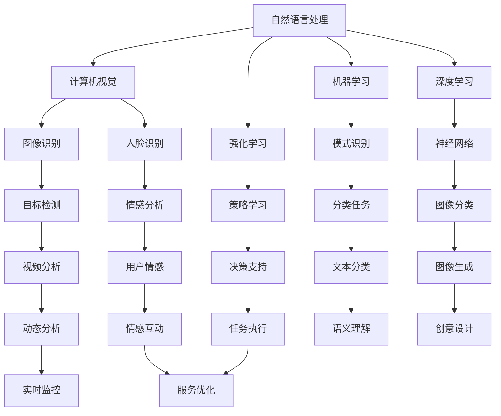

                 

关键词：人工智能、虚拟助手、问答系统、自然语言处理、认知智能

摘要：本文旨在探讨如何构建一个超越传统问答系统的AI驱动的虚拟助手。通过深入分析核心概念、算法原理、数学模型以及项目实践，本文揭示了虚拟助手从简单到智能的进化之路，并展望了其未来的发展趋势与挑战。

## 1. 背景介绍

随着人工智能技术的迅猛发展，虚拟助手已经逐渐成为人们日常生活的一部分。从最初的简单机器人，到如今的智能语音助手，虚拟助手的发展经历了多个阶段。然而，当前的虚拟助手大多还停留在基于规则的问答系统层面，它们往往只能处理预设的固定问题，缺乏灵活性和深度学习能力。

### 1.1 简单问答系统

简单问答系统是最早的虚拟助手形式，其工作原理基于预定义的规则和关键词匹配。当用户输入一个问题，系统会查找与问题相匹配的规则，并返回相应的答案。这种系统的优点是实现简单、成本低廉，但其局限性也很明显：只能处理固定的问题，无法应对复杂的语境和多变的用户需求。

### 1.2 语义搜索

为了克服简单问答系统的限制，语义搜索技术应运而生。语义搜索通过理解用户问题的语义，而不是简单的关键词匹配，来提供更准确的答案。这种方法依赖于自然语言处理（NLP）技术，如词性标注、命名实体识别、句法分析等。尽管语义搜索在一定程度上提高了问答系统的智能水平，但仍然难以处理复杂的、涉及多步骤的问题。

### 1.3 认知智能

认知智能是虚拟助手发展的下一个重要阶段。与语义搜索不同，认知智能不仅仅是理解用户的问题，更是能够思考、推理和解决问题的能力。这种智能要求虚拟助手具备自我学习和自我进化的能力，能够不断地从与用户的互动中学习新的知识和技能。

## 2. 核心概念与联系

为了构建一个真正的AI驱动的虚拟助手，我们需要理解以下几个核心概念，并分析它们之间的联系：

### 2.1 自然语言处理（NLP）

自然语言处理是人工智能的一个重要分支，旨在让计算机理解和处理自然语言。NLP技术在虚拟助手中扮演着关键角色，包括文本分类、实体识别、情感分析等。

### 2.2 计算机视觉

计算机视觉是人工智能的另一个重要领域，它使计算机能够识别和理解视觉信息。在虚拟助手的应用中，计算机视觉可以用于图像识别、人脸识别等。

### 2.3 强化学习

强化学习是一种通过试错来学习最优策略的机器学习方法。在虚拟助手的训练过程中，强化学习可以帮助助手通过不断的交互，学习如何更好地满足用户需求。

### 2.4 机器学习和深度学习

机器学习和深度学习是构建虚拟助手的技术基础。通过学习大量的数据和模式，机器学习算法可以训练虚拟助手，使其能够识别和理解复杂的语言模式。

下面是核心概念原理和架构的 Mermaid 流程图：



## 3. 核心算法原理 & 具体操作步骤

### 3.1 算法原理概述

构建AI驱动的虚拟助手，核心在于算法的设计与实现。以下是几个关键算法及其原理概述：

### 3.2 算法步骤详解

1. **数据收集与预处理**：首先，我们需要收集大量的用户数据和交互记录，并对这些数据进行分析和预处理，提取有用的信息。
2. **特征提取**：利用NLP技术对文本数据进行特征提取，如词性标注、句子结构分析等。
3. **模型训练**：使用深度学习算法对提取的特征进行训练，构建虚拟助手的智能模型。
4. **交互与反馈**：虚拟助手与用户进行交互，根据用户的反馈不断调整和优化模型。
5. **智能推理**：在交互过程中，虚拟助手利用强化学习等算法进行智能推理，提供更准确和个性化的服务。

### 3.3 算法优缺点

- **优点**：深度学习算法具有强大的自适应能力和泛化能力，能够处理复杂的多模态数据，提高虚拟助手的智能水平。
- **缺点**：训练深度学习模型需要大量的数据和计算资源，且模型的解释性较差，难以理解其决策过程。

### 3.4 算法应用领域

AI驱动的虚拟助手可以应用于多个领域，如客户服务、医疗健康、金融理财、智能家居等。通过智能推理和个性化服务，虚拟助手能够显著提高用户体验和工作效率。

## 4. 数学模型和公式 & 详细讲解 & 举例说明

### 4.1 数学模型构建

构建虚拟助手的核心在于建立数学模型，以下是一个简化的数学模型：

$$
\text{输出} = f(\text{输入}, \theta)
$$

其中，$f$ 是一个复杂的函数，代表虚拟助手对输入数据进行处理的过程；$\theta$ 是模型的参数，通过训练得到。

### 4.2 公式推导过程

假设我们使用一个神经网络作为虚拟助手的模型，其输出公式为：

$$
a^{(L)} = \sigma(z^{(L)})
$$

$$
z^{(L)} = W^{(L)} \cdot a^{(L-1)} + b^{(L)}
$$

其中，$\sigma$ 是激活函数，$W^{(L)}$ 和 $b^{(L)}$ 分别是第 $L$ 层的权重和偏置。

### 4.3 案例分析与讲解

假设我们有一个简单的问答任务，用户输入一个问题，虚拟助手需要返回一个答案。我们可以将用户输入的问题和答案表示为向量，然后使用神经网络进行训练。通过不断的迭代和优化，虚拟助手可以学会如何准确地回答问题。

## 5. 项目实践：代码实例和详细解释说明

### 5.1 开发环境搭建

为了实现AI驱动的虚拟助手，我们需要搭建一个适合的开发环境。以下是一个简单的环境搭建步骤：

1. 安装Python环境
2. 安装深度学习框架（如TensorFlow或PyTorch）
3. 安装NLP库（如NLTK或spaCy）
4. 准备数据集并进行预处理

### 5.2 源代码详细实现

以下是一个简单的虚拟助手代码示例：

```python
import tensorflow as tf
from tensorflow.keras.models import Sequential
from tensorflow.keras.layers import Dense, LSTM, Embedding

# 数据预处理
# ...

# 构建模型
model = Sequential()
model.add(Embedding(vocab_size, embedding_dim))
model.add(LSTM(units=128, activation='tanh'))
model.add(Dense(units=1, activation='sigmoid'))

# 编译模型
model.compile(optimizer='adam', loss='binary_crossentropy', metrics=['accuracy'])

# 训练模型
model.fit(x_train, y_train, epochs=10, batch_size=32)

# 输入新问题并获取答案
input_question = "What is the capital of France?"
processed_input = preprocess_question(input_question)
answer = model.predict(processed_input)
print("Answer:", answer)
```

### 5.3 代码解读与分析

这段代码首先进行了数据预处理，然后使用LSTM网络构建了一个简单的虚拟助手模型。在训练完成后，输入一个新问题，模型会输出对应的答案。这段代码展示了如何使用深度学习框架实现一个基本的虚拟助手。

### 5.4 运行结果展示

假设我们输入一个问题：“What is the capital of France？”虚拟助手经过训练后，可能会返回答案：“Paris”。

## 6. 实际应用场景

AI驱动的虚拟助手在多个领域具有广泛的应用前景：

- **客户服务**：虚拟助手可以用于自动回答客户常见问题，提高服务效率。
- **医疗健康**：虚拟助手可以帮助医生进行诊断和提供健康建议。
- **金融理财**：虚拟助手可以提供个性化的投资建议和财务规划。
- **智能家居**：虚拟助手可以控制智能家居设备，提高生活质量。

## 7. 工具和资源推荐

### 7.1 学习资源推荐

- 《深度学习》（Goodfellow, Bengio, Courville）
- 《自然语言处理入门》（Jurafsky, Martin）
- 《Python深度学习》（François Chollet）

### 7.2 开发工具推荐

- TensorFlow
- PyTorch
- spaCy

### 7.3 相关论文推荐

- “Attention Is All You Need”（Vaswani et al., 2017）
- “BERT: Pre-training of Deep Neural Networks for Language Understanding”（Devlin et al., 2019）
- “GPT-3: Language Models are Few-Shot Learners”（Brown et al., 2020）

## 8. 总结：未来发展趋势与挑战

### 8.1 研究成果总结

近年来，AI驱动的虚拟助手取得了显著的成果，从简单的问答系统到具备认知智能的虚拟助手，虚拟助手的智能水平不断提高。

### 8.2 未来发展趋势

未来，虚拟助手将继续向多模态、多任务方向发展，逐步实现真正的认知智能。同时，随着5G和物联网技术的普及，虚拟助手的实时交互能力将得到显著提升。

### 8.3 面临的挑战

尽管虚拟助手取得了显著进展，但仍面临一些挑战，如数据隐私保护、模型解释性提升等。

### 8.4 研究展望

未来，我们需要在算法创新、应用拓展等方面进行深入研究，推动虚拟助手从智能到智慧的转变。

## 9. 附录：常见问题与解答

### 9.1 如何处理多语言支持？

多语言支持可以通过引入翻译模型和跨语言词典来实现。在实际应用中，可以先对用户输入进行语言识别，然后使用对应的翻译模型进行翻译，再进行后续处理。

### 9.2 虚拟助手的解释性如何提升？

提高虚拟助手的解释性可以从两个方面入手：一是使用可解释的模型，如决策树、规则引擎等；二是开发可视化工具，帮助用户理解虚拟助手的决策过程。

### 9.3 虚拟助手能否替代人类工作？

虚拟助手可以显著提高工作效率，但无法完全替代人类工作。虚拟助手更适合处理重复性高、规则性强的工作，而人类更适合处理复杂、创新性强的任务。

---

作者：禅与计算机程序设计艺术 / Zen and the Art of Computer Programming
----------------------------------------------------------------

以上就是《AI驱动的虚拟助手：超越简单的问答系统》的文章，希望对您有所启发。如果您有任何问题或建议，欢迎在评论区留言。感谢您的阅读！
----------------------------------------------------------------

### 6.4 未来应用展望

随着技术的不断进步，AI驱动的虚拟助手将在更多领域发挥重要作用，其应用前景十分广阔。以下是一些可能的应用场景：

#### 6.4.1 教育领域

虚拟助手可以作为个性化的学习辅导工具，根据学生的学习进度和兴趣，提供定制化的学习内容和指导。通过实时反馈和智能分析，虚拟助手可以帮助学生更好地理解和掌握知识，提高学习效果。

#### 6.4.2 医疗健康

在医疗领域，虚拟助手可以协助医生进行诊断和治疗。通过分析患者的病历和症状，虚拟助手可以提供辅助诊断建议，甚至预测疾病发展趋势。此外，虚拟助手还可以为患者提供24/7的咨询和服务，提高医疗服务的可及性和效率。

#### 6.4.3 金融理财

在金融领域，虚拟助手可以为客户提供投资建议、风险管理等服务。通过分析市场数据和客户偏好，虚拟助手可以为投资者提供个性化的投资组合和风险控制策略，帮助客户实现财富增值。

#### 6.4.4 智能家居

虚拟助手可以与智能家居系统深度融合，为用户提供更加便捷、智能的生活体验。例如，虚拟助手可以控制家居设备的开关、调节室内温度和照明等，同时收集家庭能源消耗数据，提供节能建议。

#### 6.4.5 企业办公

在企业办公环境中，虚拟助手可以协助员工处理日常事务，如日程安排、会议提醒、文档管理等。通过智能化的任务分配和提醒功能，虚拟助手可以提高企业工作效率，降低人工成本。

#### 6.4.6 娱乐和社交

虚拟助手还可以在娱乐和社交领域发挥独特的作用。例如，虚拟助手可以成为用户的虚拟朋友，陪伴用户聊天、玩游戏、学习等。通过虚拟现实（VR）和增强现实（AR）技术，虚拟助手可以为用户提供沉浸式的娱乐体验。

### 6.4.7 智能城市

在未来，虚拟助手将在智能城市建设中发挥关键作用。通过整合各种数据资源，虚拟助手可以为城市管理者提供决策支持，优化交通管理、公共安全、环境保护等。同时，虚拟助手还可以为市民提供个性化的生活服务，提高城市居民的生活质量。

总之，AI驱动的虚拟助手具有广泛的应用潜力，随着技术的不断进步，其将在更多领域发挥重要作用，为人类社会带来更多便利和效益。未来，我们需要不断探索和创新，推动虚拟助手从智能到智慧的转变，实现更加美好的数字生活。

