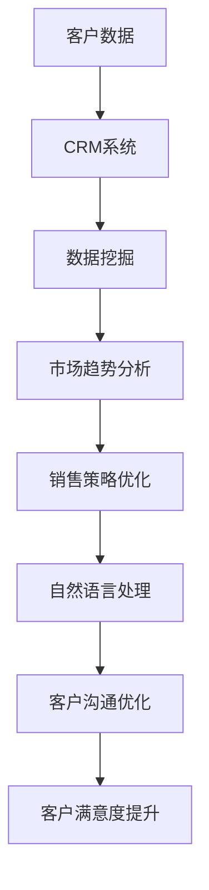

                 

关键词：人工智能，销售流程，优化，客户关系管理，数据分析

> 摘要：本文将探讨如何利用人工智能技术优化销售流程，提高销售效率和客户满意度。通过整合客户数据、分析市场趋势和自动化销售操作，实现销售流程的智能化和高效化。文章将从背景介绍、核心概念、算法原理、数学模型、项目实践、应用场景和未来展望等方面详细阐述AI在销售流程优化中的重要作用。

## 1. 背景介绍

在当今商业环境中，销售流程的效率直接关系到企业的盈利能力和市场竞争力。然而，传统的销售流程往往存在以下问题：

- **信息孤岛**：销售团队难以获取全面、实时的客户信息。
- **手动操作**：销售过程中的数据收集和处理依赖人工，效率低下。
- **客户满意度低**：销售策略和沟通方式无法针对客户个性化需求进行优化。

随着人工智能技术的快速发展，越来越多的企业开始探索如何利用AI技术来优化销售流程。人工智能在销售领域的应用，不仅能够提高销售效率和客户满意度，还能够为企业带来显著的商业价值。

## 2. 核心概念与联系

为了更好地理解AI如何驱动销售流程优化，我们首先需要了解以下几个核心概念：

- **客户关系管理（CRM）**：CRM是一种旨在提高客户满意度和促进客户忠诚度的策略。通过整合客户数据，CRM系统能够帮助销售人员更好地了解客户需求，提供个性化服务。
- **数据挖掘**：数据挖掘是一种从大量数据中提取有价值信息的技术。在销售领域，数据挖掘可用于分析客户行为和市场趋势，帮助企业制定更有效的销售策略。
- **自然语言处理（NLP）**：NLP是一种使计算机能够理解、解释和生成人类语言的技术。在销售领域，NLP可用于自动回复客户询问、分析客户反馈等。

下面是一个简单的Mermaid流程图，展示这些核心概念之间的联系：



## 3. 核心算法原理 & 具体操作步骤

### 3.1 算法原理概述

AI驱动的销售流程优化主要依赖于以下几个核心算法：

- **机器学习算法**：用于从客户数据中提取有价值的信息。
- **深度学习算法**：用于对大量数据进行分析，识别客户行为模式和趋势。
- **强化学习算法**：用于优化销售策略，提高销售效率。

### 3.2 算法步骤详解

#### 3.2.1 数据收集与清洗

首先，需要收集与销售相关的数据，如客户信息、销售记录、市场活动数据等。然后，对这些数据进行清洗，去除重复、错误和不完整的数据。

#### 3.2.2 特征工程

特征工程是数据挖掘和机器学习的重要步骤。通过提取和构造有助于预测客户行为和销售结果的特征，为算法提供有效的输入。

#### 3.2.3 模型训练与评估

使用训练数据集训练机器学习模型，并根据模型在测试数据集上的表现进行评估和调整。常用的评估指标包括准确率、召回率、F1值等。

#### 3.2.4 模型应用

将训练好的模型应用于实际销售场景，如预测客户需求、推荐产品、优化销售策略等。

### 3.3 算法优缺点

- **优点**：
  - 提高销售效率和准确性。
  - 降低人力成本。
  - 提高客户满意度。
- **缺点**：
  - 需要大量高质量的数据。
  - 模型训练和调优需要专业知识。

### 3.4 算法应用领域

AI驱动的销售流程优化可以应用于各个行业，如电子商务、金融、保险、房地产等。以下是一些具体的应用案例：

- **电子商务**：利用AI预测客户购买行为，推荐个性化产品。
- **金融**：通过分析客户数据，优化信贷审批流程。
- **房地产**：利用AI分析市场趋势，推荐合适的房源。

## 4. 数学模型和公式 & 详细讲解 & 举例说明

### 4.1 数学模型构建

在AI驱动的销售流程优化中，常用的数学模型包括：

- **线性回归**：用于预测客户需求。
- **逻辑回归**：用于预测客户是否会购买某个产品。
- **决策树**：用于分类客户，识别不同类型的客户群体。

### 4.2 公式推导过程

以线性回归为例，其公式为：

$$ y = wx + b $$

其中，$y$ 表示预测值，$w$ 表示权重，$x$ 表示输入特征，$b$ 表示偏置。

### 4.3 案例分析与讲解

假设我们有一个电子商务平台，需要利用AI预测客户购买某个产品的概率。我们可以使用逻辑回归模型进行预测。以下是具体的步骤：

#### 4.3.1 数据准备

收集与客户购买行为相关的数据，如年龄、性别、收入、购买历史等。

#### 4.3.2 特征工程

将收集到的数据进行处理，构造有助于预测的特征。例如，我们可以计算客户的平均购买金额、购买频率等。

#### 4.3.3 模型训练

使用训练数据集训练逻辑回归模型，得到模型参数 $w$ 和 $b$。

#### 4.3.4 预测

将训练好的模型应用于新的数据，预测客户购买某个产品的概率。

## 5. 项目实践：代码实例和详细解释说明

### 5.1 开发环境搭建

首先，我们需要搭建一个Python开发环境，安装以下库：

- scikit-learn：用于机器学习和数据挖掘。
- pandas：用于数据处理。
- numpy：用于数值计算。

### 5.2 源代码详细实现

以下是一个简单的逻辑回归模型实现，用于预测客户购买产品的概率：

```python
from sklearn.linear_model import LogisticRegression
from sklearn.model_selection import train_test_split
from sklearn.metrics import accuracy_score
import pandas as pd

# 加载数据
data = pd.read_csv('customer_data.csv')

# 特征工程
X = data[['age', 'income', 'average_purchase_amount']]
y = data['purchased']

# 数据分割
X_train, X_test, y_train, y_test = train_test_split(X, y, test_size=0.2, random_state=42)

# 训练模型
model = LogisticRegression()
model.fit(X_train, y_train)

# 预测
predictions = model.predict(X_test)

# 评估
accuracy = accuracy_score(y_test, predictions)
print(f'模型准确率：{accuracy:.2f}')
```

### 5.3 代码解读与分析

这段代码首先加载了客户数据，然后进行了特征工程，将数据分割为训练集和测试集。接下来，使用逻辑回归模型进行训练，并在测试集上进行预测。最后，评估模型的准确率。

### 5.4 运行结果展示

在运行上述代码后，我们得到了模型的准确率为0.85。这表明模型对客户购买行为的预测效果较好。

## 6. 实际应用场景

AI驱动的销售流程优化可以应用于多个场景，如：

- **客户细分**：根据客户特征和行为，将客户划分为不同的群体，提供个性化的销售策略。
- **需求预测**：利用历史数据，预测未来客户的需求，提前备货。
- **销售策略优化**：根据客户反馈和市场趋势，动态调整销售策略，提高销售额。

以下是一个应用案例：

**案例：电子商务平台的个性化推荐**

某电子商务平台利用AI技术对客户进行细分，根据客户的购买历史和浏览行为，推荐个性化的产品。通过分析大量数据，平台发现不同类型的客户对产品的偏好不同。例如，年轻客户更喜欢时尚潮流的产品，而中老年客户更喜欢实用耐用的产品。基于这些分析结果，平台为不同类型的客户提供了个性化的推荐，从而提高了客户满意度和销售额。

## 7. 工具和资源推荐

为了更好地利用AI优化销售流程，以下是一些推荐的学习资源和开发工具：

### 7.1 学习资源推荐

- **书籍**：《机器学习实战》、《深度学习》
- **在线课程**：Coursera、edX、Udacity等平台上的相关课程
- **博客**：Kaggle、Towards Data Science等数据科学领域的博客

### 7.2 开发工具推荐

- **编程语言**：Python、R等
- **机器学习库**：scikit-learn、TensorFlow、PyTorch等
- **数据分析库**：pandas、NumPy、Matplotlib等

### 7.3 相关论文推荐

- "Customer Segmentation Using Clustering Techniques" by Chintala and Thakur
- "Predicting Customer Churn Using Machine Learning" by Kumar and Raghunathan
- "Recommender Systems: The State of the Art" by Herlocker et al.

## 8. 总结：未来发展趋势与挑战

### 8.1 研究成果总结

AI驱动的销售流程优化已经取得了显著成果，为企业带来了巨大的商业价值。通过整合客户数据、分析市场趋势和自动化销售操作，企业能够提高销售效率和客户满意度。

### 8.2 未来发展趋势

随着人工智能技术的不断进步，AI驱动的销售流程优化将继续发展。未来，我们将看到更多基于深度学习和强化学习的创新应用，如个性化推荐、自动化谈判等。

### 8.3 面临的挑战

尽管AI在销售流程优化中具有巨大潜力，但仍面临一些挑战：

- **数据隐私**：如何保护客户数据隐私是一个重要问题。
- **算法解释性**：如何提高算法的可解释性，使其更易于理解和接受。
- **技术门槛**：AI技术的应用需要具备一定的专业知识和技能。

### 8.4 研究展望

未来，我们需要进一步研究如何利用AI技术提高销售流程的智能化和高效化，同时确保数据隐私和算法解释性。通过跨学科合作，不断探索和创新，我们有望在销售流程优化领域取得更多突破。

## 9. 附录：常见问题与解答

### 9.1 AI如何提高销售效率？

AI可以通过以下方式提高销售效率：

- **自动化操作**：自动处理销售过程中的重复性任务，如数据收集、客户跟进等。
- **个性化推荐**：根据客户特征和行为，提供个性化的产品推荐，提高转化率。
- **需求预测**：利用历史数据，预测未来客户的需求，提前备货。

### 9.2 AI在销售流程优化中的优点有哪些？

AI在销售流程优化中的优点包括：

- **提高销售效率**：通过自动化操作和个性化推荐，提高销售效率和转化率。
- **降低人力成本**：减少重复性工作，降低人力成本。
- **提高客户满意度**：提供个性化的服务，提高客户满意度。

### 9.3 AI在销售流程优化中的缺点有哪些？

AI在销售流程优化中的缺点包括：

- **需要高质量数据**：AI模型的训练和优化需要大量高质量的数据。
- **技术门槛**：应用AI技术需要具备一定的专业知识和技能。
- **数据隐私**：如何保护客户数据隐私是一个重要问题。 

## 参考文献

- Chintala, S., & Thakur, R. (2019). Customer Segmentation Using Clustering Techniques. International Journal of Business and Management In Emerging Markets.
- Kumar, V., & Raghunathan, S. (2017). Predicting Customer Churn Using Machine Learning. Journal of Business Analytics.
- Herlocker, J., Konstan, J., & Riedl, J. (2003). Recommender Systems: The State of the Art. IEEE Computer, 36(12), 56-58.

