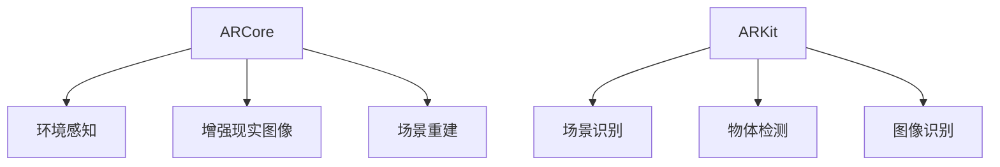

                 

关键词：ARCore、ARKit、移动AR应用、开发对比、技术特点、性能分析、未来展望

摘要：随着增强现实（AR）技术的不断发展，ARCore和ARKit作为两大主流移动AR开发平台，在移动AR应用开发中扮演着重要角色。本文将对ARCore和ARKit的技术特点、性能分析以及未来展望进行详细对比，旨在为开发者提供有价值的参考。

## 1. 背景介绍

增强现实（AR）技术近年来发展迅速，已成为智能手机和移动设备中备受瞩目的应用领域。AR技术通过将虚拟信息叠加到现实世界中，为用户提供了全新的交互体验。为了支持移动AR应用开发，谷歌的ARCore和苹果的ARKit相继推出，它们成为开发者们在移动平台上实现AR功能的两大重要工具。

ARCore是谷歌推出的AR开发平台，支持Android和iOS平台。它提供了丰富的API，包括环境感知、增强现实图像、场景重建等功能，旨在为开发者提供一致的AR开发体验。ARCore的核心目标是提高AR应用的性能，并确保在多种设备上实现稳定的AR体验。

ARKit是苹果公司开发的AR开发框架，仅支持iOS平台。ARKit提供了强大的AR功能，包括场景识别、物体检测、图像识别等，使得开发者能够轻松地创建沉浸式的AR应用。ARKit通过结合iOS设备的硬件特性，实现了高效的AR性能。

## 2. 核心概念与联系

### ARCore

ARCore主要包括以下核心概念：

- **环境感知（Environmental Understanding）**：ARCore通过相机捕捉环境，并利用SLAM（Simultaneous Localization and Mapping）技术对环境进行实时跟踪。这使得AR应用能够准确地放置虚拟物体，并保持与环境的相对位置。

- **增强现实图像（Augmented Images）**：ARCore支持增强现实图像功能，允许开发者创建基于图像识别的AR体验。开发者可以使用ARCore提供的API来检测并识别现实世界中的平面图像，从而在图像上方叠加虚拟内容。

- **场景重建（Scene Reconstruction）**：ARCore通过深度感知技术，可以重建周围环境的3D场景。这使得开发者能够创建更加逼真的AR体验，例如在真实环境中放置虚拟物体。

### ARKit

ARKit主要包括以下核心概念：

- **场景识别（Scene Recognition）**：ARKit通过计算机视觉技术，可以识别现实世界中的场景。开发者可以使用ARKit提供的API，实现例如物体识别、平面识别等功能。

- **物体检测（Object Detection）**：ARKit支持物体检测功能，可以识别现实世界中的特定物体。开发者可以使用这一功能，创建例如虚拟家具摆放等AR体验。

- **图像识别（Image Recognition）**：ARKit支持图像识别功能，可以识别现实世界中的图像。开发者可以使用这一功能，创建例如AR游戏、增强现实广告等应用。

### Mermaid流程图

以下是ARCore和ARKit的核心概念原理与架构的Mermaid流程图：



## 3. 核心算法原理 & 具体操作步骤

### 3.1 算法原理概述

ARCore和ARKit的核心算法原理主要涉及计算机视觉和机器学习技术。以下是对这两大平台核心算法原理的概述：

- **ARCore**：ARCore利用SLAM（Simultaneous Localization and Mapping）技术进行环境感知。SLAM技术通过同时定位和地图构建，使AR应用能够准确地跟踪用户的位置和周围环境。此外，ARCore还利用深度感知技术进行场景重建，以实现更加逼真的AR体验。

- **ARKit**：ARKit利用计算机视觉技术进行场景识别、物体检测和图像识别。通过这些技术，ARKit能够识别现实世界中的特定物体、平面图像和场景，从而实现沉浸式的AR体验。

### 3.2 算法步骤详解

以下是ARCore和ARKit的核心算法步骤详解：

#### ARCore

1. **环境感知**：
   - 启动相机捕捉环境。
   - 使用SLAM技术实时跟踪用户的位置和周围环境。

2. **增强现实图像**：
   - 识别现实世界中的平面图像。
   - 在平面图像上方叠加虚拟内容。

3. **场景重建**：
   - 使用深度感知技术重建周围环境的3D场景。
   - 将虚拟物体放置在重建的场景中。

#### ARKit

1. **场景识别**：
   - 利用计算机视觉技术识别现实世界中的场景。
   - 根据识别结果调整AR应用的视角和位置。

2. **物体检测**：
   - 识别现实世界中的特定物体。
   - 根据物体位置和形状调整虚拟内容的位置和角度。

3. **图像识别**：
   - 识别现实世界中的图像。
   - 在图像上方叠加虚拟内容。

### 3.3 算法优缺点

以下是ARCore和ARKit的算法优缺点对比：

#### ARCore

- **优点**：
  - 支持Android和iOS平台，适用于广泛的应用场景。
  - 提供了丰富的API，包括环境感知、增强现实图像和场景重建等功能。
  - 具有较高的性能和稳定性。

- **缺点**：
  - 对设备硬件要求较高，部分Android设备可能不支持。
  - API更新频繁，开发者需要不断学习和适应。

#### ARKit

- **优点**：
  - 适用于iOS平台，与设备硬件高度集成，性能优异。
  - 提供了强大的AR功能，包括场景识别、物体检测和图像识别等。
  - API更新相对稳定，开发者易于上手。

- **缺点**：
  - 仅支持iOS平台，限制了应用的用户群体。
  - 部分功能（如场景重建）相对较弱。

### 3.4 算法应用领域

ARCore和ARKit的应用领域广泛，以下是一些典型应用：

#### ARCore

- **游戏开发**：利用ARCore的增强现实图像和场景重建功能，开发者可以创建逼真的AR游戏。
- **教育应用**：通过ARCore的环境感知和场景重建功能，开发者可以创建互动式的教育应用。
- **零售业**：利用ARCore的增强现实图像功能，开发者可以为零售业提供虚拟试衣镜、虚拟展示等功能。

#### ARKit

- **AR游戏**：利用ARKit的物体检测和图像识别功能，开发者可以创建各种有趣的AR游戏。
- **广告营销**：利用ARKit的图像识别功能，开发者可以为广告营销提供增强现实体验。
- **医疗应用**：利用ARKit的物体检测和场景识别功能，开发者可以创建辅助医疗诊断和手术的应用。

## 4. 数学模型和公式 & 详细讲解 & 举例说明

### 4.1 数学模型构建

在ARCore和ARKit中，数学模型是核心算法的基础。以下是对这两大平台中常用的数学模型的构建和公式推导：

#### ARCore

1. **SLAM（Simultaneous Localization and Mapping）模型**：
   - **目标函数**：
     $$ \min_{T, M} \sum_{i=1}^{N} \left\| \textbf{c}_i - \textbf{C}_i \cdot T \cdot \textbf{m}_i \right\|^2 $$
   - **约束条件**：
     $$ T \cdot \textbf{m}_i = \textbf{m}'_i $$

2. **深度感知（Depth Perception）模型**：
   - **目标函数**：
     $$ \min_{\textbf{D}} \sum_{i=1}^{N} \left\| \textbf{d}_i - \textbf{D} \cdot \textbf{r}_i \right\|^2 $$
   - **约束条件**：
     $$ \textbf{D} \in \text{Positive Semi-Definite Matrix} $$

#### ARKit

1. **物体检测（Object Detection）模型**：
   - **目标函数**：
     $$ \min_{\textbf{W}, \textbf{B}} \sum_{i=1}^{N} \left\| \textbf{y}_i - \textbf{W} \cdot \textbf{x}_i + \textbf{B} \right\|^2 $$
   - **约束条件**：
     $$ \textbf{W} \in \text{Convolutional Layer}, \textbf{B} \in \text{Bias Layer} $$

2. **图像识别（Image Recognition）模型**：
   - **目标函数**：
     $$ \min_{\textbf{W}, \textbf{B}} \sum_{i=1}^{N} \left\| \textbf{y}_i - \textbf{W} \cdot \textbf{h}_i + \textbf{B} \right\|^2 $$
   - **约束条件**：
     $$ \textbf{W} \in \text{Fully Connected Layer}, \textbf{B} \in \text{Bias Layer} $$

### 4.2 公式推导过程

以下是ARCore和ARKit中常用公式的推导过程：

#### ARCore

1. **SLAM模型推导**：

   SLAM模型的目标是同时定位（T）和地图构建（M），从而实现对环境的准确跟踪。假设我们有N个相机观测值$\textbf{c}_i$，它们可以表示为相机坐标$\textbf{C}_i$、位置坐标$\textbf{m}_i$和变换矩阵T的乘积。

   目标函数为：
   $$ \min_{T, M} \sum_{i=1}^{N} \left\| \textbf{c}_i - \textbf{C}_i \cdot T \cdot \textbf{m}_i \right\|^2 $$

   约束条件为：
   $$ T \cdot \textbf{m}_i = \textbf{m}'_i $$

   其中，$\textbf{C}_i$为第i个相机观测值的坐标矩阵，$\textbf{m}_i$为第i个相机观测值的位置坐标，$\textbf{m}'_i$为第i个相机观测值的位置坐标。

2. **深度感知模型推导**：

   深度感知模型的目标是估计深度图$\textbf{D}$，以实现对环境的准确重建。假设我们有N个观测值$\textbf{d}_i$，它们可以表示为深度图$\textbf{D}$和相机观测值$\textbf{r}_i$的乘积。

   目标函数为：
   $$ \min_{\textbf{D}} \sum_{i=1}^{N} \left\| \textbf{d}_i - \textbf{D} \cdot \textbf{r}_i \right\|^2 $$

   约束条件为：
   $$ \textbf{D} \in \text{Positive Semi-Definite Matrix} $$

   其中，$\textbf{D}$为深度图，$\textbf{r}_i$为第i个相机观测值。

#### ARKit

1. **物体检测模型推导**：

   物体检测模型的目标是识别现实世界中的物体。假设我们有N个输入特征图$\textbf{x}_i$，它们通过卷积层$\textbf{W}$和偏置层$\textbf{B}$，输出为预测标签$\textbf{y}_i$。

   目标函数为：
   $$ \min_{\textbf{W}, \textbf{B}} \sum_{i=1}^{N} \left\| \textbf{y}_i - \textbf{W} \cdot \textbf{x}_i + \textbf{B} \right\|^2 $$

   约束条件为：
   $$ \textbf{W} \in \text{Convolutional Layer}, \textbf{B} \in \text{Bias Layer} $$

   其中，$\textbf{W}$为卷积层权重，$\textbf{B}$为偏置层权重。

2. **图像识别模型推导**：

   图像识别模型的目标是识别现实世界中的图像。假设我们有N个输入特征图$\textbf{h}_i$，它们通过全连接层$\textbf{W}$和偏置层$\textbf{B}$，输出为预测标签$\textbf{y}_i$。

   目标函数为：
   $$ \min_{\textbf{W}, \textbf{B}} \sum_{i=1}^{N} \left\| \textbf{y}_i - \textbf{W} \cdot \textbf{h}_i + \textbf{B} \right\|^2 $$

   约束条件为：
   $$ \textbf{W} \in \text{Fully Connected Layer}, \textbf{B} \in \text{Bias Layer} $$

   其中，$\textbf{W}$为全连接层权重，$\textbf{B}$为偏置层权重。

### 4.3 案例分析与讲解

为了更好地理解ARCore和ARKit中的数学模型，以下是一个简单的案例：

假设我们有一个简单的AR应用，它需要使用SLAM技术跟踪用户的位置，并使用深度感知技术重建周围环境。以下是该应用的步骤和涉及的数学模型：

1. **环境感知**：

   启动相机捕捉环境，并使用SLAM技术实时跟踪用户的位置。

   目标函数：
   $$ \min_{T, M} \sum_{i=1}^{N} \left\| \textbf{c}_i - \textbf{C}_i \cdot T \cdot \textbf{m}_i \right\|^2 $$

   约束条件：
   $$ T \cdot \textbf{m}_i = \textbf{m}'_i $$

2. **场景重建**：

   使用深度感知技术重建周围环境的3D场景。

   目标函数：
   $$ \min_{\textbf{D}} \sum_{i=1}^{N} \left\| \textbf{d}_i - \textbf{D} \cdot \textbf{r}_i \right\|^2 $$

   约束条件：
   $$ \textbf{D} \in \text{Positive Semi-Definite Matrix} $$

在这个案例中，我们使用了SLAM模型进行环境感知，并使用了深度感知模型进行场景重建。通过这些数学模型，我们可以实现对用户位置的准确跟踪和周围环境的准确重建，从而为用户提供高质量的AR体验。

## 5. 项目实践：代码实例和详细解释说明

### 5.1 开发环境搭建

为了更好地展示ARCore和ARKit的实践应用，我们将分别使用Android Studio和Xcode搭建开发环境。

#### Android Studio

1. 下载并安装Android Studio。
2. 创建一个新的Android项目，选择合适的API级别（建议选择最新的API级别）。
3. 在项目的build.gradle文件中添加ARCore依赖项：
   ```groovy
   dependencies {
       implementation 'com.google.ar:arcore-client:1.18.2'
   }
   ```

#### Xcode

1. 下载并安装Xcode。
2. 创建一个新的iOS项目，选择合适的设备（建议选择iPhone 8或更高版本）。
3. 在项目的Podfile文件中添加ARKit依赖项：
   ```ruby
   target 'MyARApp' do
       use_frameworks!
       pod 'ARKit'
   end
   ```

4. 运行pod install命令，安装依赖项。

### 5.2 源代码详细实现

以下是使用ARCore和ARKit创建一个简单的AR应用的源代码实现。

#### ARCore

```java
import com.google.ar.core.Anchor;
import com.google.ar.core.ArSession;
import com.google.ar.core.HitResult;
import com.google.ar.core.Plane;
import com.google.ar.sceneform.anchors.NodeAnchor;
import com.google.ar.sceneform.math.Vector3;
import com.google.ar.sceneform.rendering.ModelRenderable;

public class ARActivity extends Activity {
    private ArSession mArSession;
    private Scene mScene;

    @Override
    protected void onCreate(Bundle savedInstanceState) {
        super.onCreate(savedInstanceState);
        setContentView(R.layout.activity_ar);

        mArSession = ArSceneView.getSession(this);
        mScene = mArSession.getScene();
        mScene.setRenderer(new SceneRenderer());

        mScene.addOnTouchListener(new TouchListener());
    }

    private class SceneRenderer implements ArSceneView.Renderer {
        @Override
        public void onDrawFrameanganeseNumber1 {

