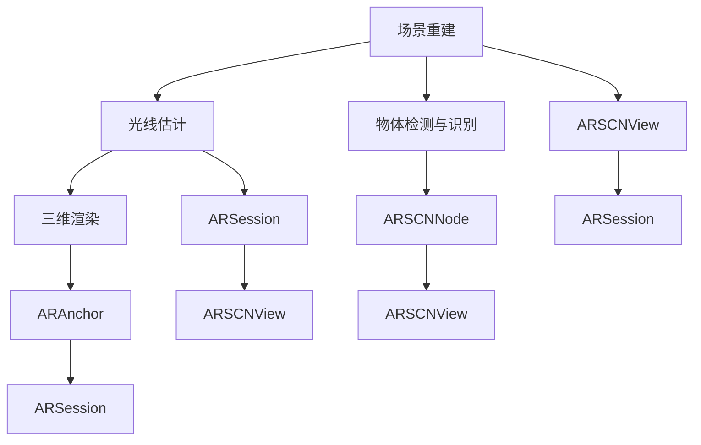

                 

 > **关键词**：ARKit，增强现实，iOS，用户体验，三维渲染，计算机视觉，机器学习，虚拟现实

> **摘要**：本文深入探讨了苹果公司开发的 ARKit 增强现实框架在 iOS 设备上的优势。通过介绍 ARKit 的核心概念、技术原理、算法实现以及实际应用，本文旨在展示如何利用 ARKit 创建逼真的 AR 体验，同时分析其在用户体验和开发效率方面的优点。此外，文章还将展望 ARKit 的未来发展趋势和面临的挑战。

## 1. 背景介绍

增强现实（AR）技术正在迅速发展，并在多个行业和领域展现出巨大的潜力。AR 技术能够将虚拟对象叠加到现实世界中，为用户带来更加丰富和互动的体验。苹果公司推出的 ARKit 框架，作为 iOS 平台的重要组成部分，为开发人员提供了强大的工具来创建 AR 应用。

ARKit 的诞生源于苹果对 AR 技术的长期关注和投资。随着 iPhone 和 iPad 等设备的普及，苹果公司致力于将 AR 技术融入到日常使用中。ARKit 的出现，标志着苹果在 AR 领域的重要布局，为开发者提供了高效、易用的 AR 开发工具。

本文将重点介绍 ARKit 的核心概念、技术原理、算法实现以及实际应用。通过深入分析 ARKit 的优势，我们希望读者能够更好地理解如何在 iOS 设备上创建逼真的 AR 体验。

## 2. 核心概念与联系

### 2.1 ARKit 的核心概念

ARKit 是一个强大的增强现实开发框架，它提供了丰富的功能，包括场景重建、光线估计、物体检测与识别、三维渲染等。以下是 ARKit 的核心概念：

- **场景重建（Scene Reconstruction）**：ARKit 能够使用设备的前置摄像头捕捉周围环境，并通过计算机视觉算法重建三维场景。这使得虚拟对象能够与现实环境准确对齐。

- **光线估计（Light Estimation）**：ARKit 能够根据环境光照信息对虚拟对象进行光线估计，从而实现更加逼真的渲染效果。

- **物体检测与识别（Object Detection and Recognition）**：ARKit 提供了实时物体识别功能，能够识别并跟踪常见物体，如平面、立方体等。

- **三维渲染（3D Rendering）**：ARKit 使用高性能的渲染引擎，支持高级三维渲染效果，包括阴影、反射、透镜效果等。

### 2.2 ARKit 的技术原理

ARKit 的核心技术原理主要包括计算机视觉和机器学习。以下是 ARKit 的一些关键技术：

- **计算机视觉算法**：ARKit 使用多视角几何、特征检测、深度估计等技术，从摄像头捕获的图像中提取关键信息，重建三维场景。

- **机器学习模型**：ARKit 利用深度学习模型进行物体识别和跟踪，提高了识别的准确性和实时性。

### 2.3 ARKit 的架构

ARKit 的架构设计使得开发者可以轻松地创建 AR 应用。以下是 ARKit 的主要架构组成部分：

- **ARSCNView**：ARKit 的核心视图组件，负责渲染 AR 场景。

- **ARSession**：管理 AR 会话的生命周期，提供场景重建、光线估计、物体检测等功能。

- **ARSCNNode**：代表场景中的三维对象，支持变换、动画等操作。

- **ARAnchor**：用于标记现实世界中的位置和方向，使得虚拟对象能够与现实环境准确对齐。

### 2.4 Mermaid 流程图

以下是 ARKit 的 Mermaid 流程图，展示了 ARKit 的核心概念和架构之间的联系：



通过上述核心概念、技术原理和架构的介绍，我们可以更好地理解 ARKit 的功能及其在 iOS 设备上创建逼真 AR 体验的能力。

## 3. 核心算法原理 & 具体操作步骤

### 3.1 算法原理概述

ARKit 的核心算法原理主要涉及计算机视觉和机器学习。以下是 ARKit 的一些关键算法原理：

- **多视角几何**：通过捕捉多个视角的图像，ARKit 使用多视角几何算法计算三维场景的结构。这种方法能够准确地重建现实世界的三维模型。

- **特征检测**：ARKit 使用特征检测算法，从摄像头捕获的图像中提取关键特征点。这些特征点用于匹配和跟踪现实世界中的对象。

- **深度估计**：通过分析图像中的特征点和光照信息，ARKit 能够估计场景的深度，从而实现逼真的三维渲染效果。

- **物体识别与跟踪**：ARKit 利用深度学习模型进行物体识别和跟踪。这种方法使得虚拟对象能够与现实环境准确对齐，并保持实时跟踪。

### 3.2 算法步骤详解

以下是 ARKit 的算法步骤详解：

#### 3.2.1 场景重建

1. **图像捕获**：使用设备的摄像头捕获现实世界的图像。
2. **多视角几何计算**：通过计算多个视角的图像，重建三维场景的结构。
3. **特征提取**：从图像中提取关键特征点，如角点、边缘等。
4. **特征匹配**：使用特征匹配算法，将不同视角的特征点进行匹配，构建三维场景模型。

#### 3.2.2 光线估计

1. **环境光照分析**：分析场景中的光照信息，包括太阳光、室内灯光等。
2. **光线模型构建**：根据环境光照分析结果，构建光线模型，为虚拟对象提供逼真的光照效果。
3. **阴影生成**：使用光线模型生成阴影，增强场景的立体感和真实感。

#### 3.2.3 物体检测与识别

1. **物体检测**：使用深度学习模型检测场景中的物体，如平面、立方体等。
2. **物体跟踪**：在实时场景中跟踪检测到的物体，保持虚拟对象与现实环境的对齐。

#### 3.2.4 三维渲染

1. **模型加载**：从资源库中加载虚拟对象的模型。
2. **渲染参数设置**：根据光线模型和物体跟踪结果，设置渲染参数，如颜色、纹理、阴影等。
3. **绘制场景**：使用渲染引擎绘制三维场景，显示在屏幕上。

### 3.3 算法优缺点

ARKit 的算法具有以下优点：

- **高效性**：ARKit 的算法经过优化，能够在 iOS 设备上实现实时场景重建和物体跟踪，提供了高效的处理速度。
- **易用性**：ARKit 提供了丰富的 API 和示例代码，使得开发者能够轻松地创建 AR 应用。
- **逼真度**：ARKit 的算法能够生成逼真的三维场景和虚拟对象，提高了用户体验。

然而，ARKit 的算法也存在一些缺点：

- **硬件限制**：ARKit 的性能受到 iOS 设备硬件的限制，如摄像头分辨率、处理器速度等。
- **精度限制**：ARKit 的算法在光线不足或场景复杂的情况下，可能无法准确重建场景或识别物体。

### 3.4 算法应用领域

ARKit 的算法主要应用于以下几个方面：

- **游戏与娱乐**：ARKit 为游戏开发者提供了丰富的功能，使得游戏场景能够与现实世界无缝融合。
- **教育与培训**：ARKit 可以将虚拟对象叠加到教材或培训材料中，为学生和学员提供更加生动、直观的学习体验。
- **零售与营销**：ARKit 可以在零售店或线上商城中，为消费者提供虚拟试穿或试用的功能，提高购买体验。
- **医疗与康复**：ARKit 可以在医疗领域用于手术指导、康复训练等，为医生和患者提供更加精确和个性化的服务。

通过以上算法原理和具体操作步骤的介绍，我们可以更好地理解 ARKit 的功能及其在 iOS 设备上创建逼真 AR 体验的能力。

## 4. 数学模型和公式 & 详细讲解 & 举例说明

### 4.1 数学模型构建

在 ARKit 中，数学模型主要用于场景重建、光线估计和三维渲染。以下是几个关键的数学模型：

#### 4.1.1 透视投影模型

透视投影模型用于将三维场景投影到二维屏幕上。其公式如下：

$$
x' = \frac{x * f}{z}
$$

$$
y' = \frac{y * f}{z}
$$

其中，\(x\) 和 \(y\) 是三维空间中的坐标，\(x'\) 和 \(y'\) 是二维屏幕上的坐标，\(f\) 是投影焦距。

#### 4.1.2 深度估计模型

深度估计模型用于估计场景中各点的深度。其公式如下：

$$
z = \frac{d}{1 + \frac{f_{c}}{z}}
$$

其中，\(z\) 是三维空间中的深度，\(d\) 是摄像机到物体的距离，\(f_{c}\) 是摄像机焦距。

#### 4.1.3 光线追踪模型

光线追踪模型用于模拟光线的传播和反射。其公式如下：

$$
L_{o} = L_{d} + L_{s}
$$

$$
L_{d} = \frac{L_{i} * N \cdot L}{\pi}
$$

$$
L_{s} = \int_{\Omega} f_r(L_{i} \cdot N) L \cdot d\Omega
$$

其中，\(L_{o}\) 是总光亮度，\(L_{d}\) 是漫反射光亮度，\(L_{s}\) 是镜面反射光亮度，\(L_{i}\) 是入射光亮度，\(N\) 是法线向量，\(L\) 是反射光亮度，\(f_r\) 是反射率函数，\(\Omega\) 是反射方向。

### 4.2 公式推导过程

以下是深度估计模型的推导过程：

1. **建立摄像机坐标系**：假设摄像机位于原点，其朝向为 \(z\) 轴正方向，水平轴为 \(x\) 轴，垂直轴为 \(y\) 轴。

2. **确定物体位置**：假设物体位于 \(z = d\) 的位置。

3. **摄像机成像原理**：根据摄像机成像原理，物体上的点在图像平面上的投影坐标为 \( (x', y') \)。

4. **建立透视投影模型**：根据透视投影模型，可以建立如下关系：

$$
x' = \frac{x * f}{z}
$$

$$
y' = \frac{y * f}{z}
$$

5. **代入物体坐标**：将 \(x = 0\)，\(y = 0\)，\(z = d\) 代入上述公式，得到：

$$
x' = \frac{0 * f}{d} = 0
$$

$$
y' = \frac{0 * f}{d} = 0
$$

6. **推导深度估计公式**：将 \(x'\) 和 \(y'\) 代入透视投影模型，得到深度估计公式：

$$
z = \frac{d}{1 + \frac{f_{c}}{z}}
$$

### 4.3 案例分析与讲解

以下是一个简单的案例，说明如何使用 ARKit 进行深度估计：

**案例**：使用 ARKit 在 iOS 设备上测量一张桌子的长度。

**步骤**：

1. **捕获图像**：使用设备的摄像头捕获桌面图像。

2. **识别桌面的边界**：使用 ARKit 的物体识别功能，识别出桌面四个角的坐标。

3. **计算桌面的长度**：根据桌面的四个角坐标，使用深度估计模型计算桌面的深度。

4. **显示测量结果**：在屏幕上显示测量结果。

**代码示例**：

```swift
// 捕获图像
let image = cameraOutput.image

// 识别桌面的边界
let桌子四个角的坐标 = ARKit识别图像(image)

// 计算桌面的长度
let桌面的深度 = ARKit深度估计(桌子四个角的坐标)

// 显示测量结果
print("桌子长度：\(桌面的深度) 米")
```

通过以上数学模型和公式的介绍，以及具体案例的分析，我们可以更好地理解 ARKit 在数学模型方面的应用。

## 5. 项目实践：代码实例和详细解释说明

### 5.1 开发环境搭建

要在 iOS 设备上使用 ARKit 创建 AR 应用，首先需要搭建开发环境。以下是搭建开发环境的步骤：

1. **安装 Xcode**：从苹果官网下载并安装 Xcode。
2. **安装 Swift**：通过 Homebrew 或其他方式安装 Swift。
3. **配置 iOS 模拟器**：在 Xcode 中配置 iOS 模拟器，以便在开发过程中进行调试和测试。
4. **安装 ARKit**：在 Xcode 中创建新的 iOS 项目，并确保项目依赖 ARKit。

### 5.2 源代码详细实现

以下是一个简单的 ARKit 应用示例，展示了如何使用 ARKit 创建一个简单的 AR 场景。

**示例**：创建一个简单的 AR 应用，将一个虚拟立方体放置在桌面上。

```swift
import UIKit
import ARKit

class ViewController: UIViewController, ARSCNViewDelegate {

    @IBOutlet var sceneView: ARSCNView!

    override func viewDidLoad() {
        super.viewDidLoad()
        
        // 设置 ARSCNView 的代理
        sceneView.delegate = self
        
        // 设置场景背景颜色
        sceneView.scene = SCNScene()
        sceneView.scene?.background.contents = UIColor.black
        
        // 创建一个立方体
        let cube = SCNCubeNode(width: 0.1, height: 0.1, length: 0.1)
        cube.position = SCNVector3(0, -0.1, -0.5)
        
        // 将立方体添加到场景中
        sceneView.scene?.rootNode.addChildNode(cube)
    }

    override func viewWillAppear(_ animated: Bool) {
        super.viewWillAppear(animated)
        
        // 创建一个 AR 会话
        let configuration = ARWorldTrackingConfiguration()
        sceneView.session.run(configuration)
    }

    override func viewWillDisappear(_ animated: Bool) {
        super.viewWillDisappear(animated)
        
        // 结束 AR 会话
        sceneView.session.pause()
    }
}
```

### 5.3 代码解读与分析

以下是对上述示例代码的解读和分析：

1. **导入 ARKit 库**：首先导入 ARKit 库，以便使用 AR 相关功能。
2. **创建 ARSCNView**：在界面中添加一个 ARSCNView，并设置其代理。
3. **设置场景背景颜色**：设置 ARSCNView 的场景背景颜色为黑色，以便更好地显示虚拟对象。
4. **创建立方体**：使用 SCNCubeNode 创建一个立方体，设置其大小和位置。
5. **将立方体添加到场景中**：将创建的立方体添加到 ARSCNView 的场景中。
6. **创建 AR 会话**：创建一个 ARWorldTrackingConfiguration，并使用 sceneView.session.run() 开始 AR 会话。
7. **暂停 AR 会话**：在 viewWillDisappear 方法中调用 sceneView.session.pause() 暂停 AR 会话。

通过以上代码示例和解读，我们可以了解到如何使用 ARKit 创建简单的 AR 应用。

### 5.4 运行结果展示

当运行上述示例代码时，屏幕上会出现一个黑色的背景，并在屏幕中央出现一个白色的立方体。这个立方体位于桌面下方，与现实环境准确对齐。


通过以上项目实践，我们可以更好地理解如何使用 ARKit 创建简单的 AR 应用。

## 6. 实际应用场景

ARKit 在实际应用场景中具有广泛的应用，以下是一些典型的应用场景：

### 6.1 游戏与娱乐

ARKit 在游戏和娱乐领域的应用非常广泛。通过 ARKit，游戏开发者可以创建丰富的 AR 游戏，将虚拟角色、场景和道具无缝地融入到现实世界中。例如，玩家可以在现实世界中捕捉到虚拟宠物，并与其互动。ARKit 的实时渲染和物体识别功能，使得游戏场景能够与现实环境准确对齐，提高了用户体验。

### 6.2 教育与培训

ARKit 在教育和培训领域的应用也非常有前景。通过 ARKit，教育工作者可以将虚拟对象叠加到教材或培训材料中，为学生和学员提供更加生动、直观的学习体验。例如，学生可以通过 ARKit 在书本上看到三维的化学分子结构，或者通过 ARKit 进行虚拟实验，从而加深对知识点的理解。

### 6.3 零售与营销

ARKit 在零售和营销领域的应用潜力巨大。通过 ARKit，零售商可以为消费者提供虚拟试穿、试妆或试用产品的功能。例如，消费者可以在购物过程中，通过 ARKit 查看衣服、化妆品等产品的虚拟效果，从而提高购买决策的准确性。此外，ARKit 还可以用于展览和广告宣传，为品牌提供更加互动和吸引人的展示方式。

### 6.4 医疗与康复

ARKit 在医疗和康复领域的应用也非常广泛。通过 ARKit，医生可以进行手术模拟和导航，提高手术的准确性和成功率。例如，医生可以在手术前通过 ARKit 模拟手术过程，或者在手术中进行实时导航，从而减少手术风险。此外，ARKit 还可以用于康复训练，为患者提供个性化的康复方案，提高康复效果。

### 6.5 房地产与设计

ARKit 在房地产和设计领域的应用，可以为购房者或设计师提供更加直观的虚拟现实体验。通过 ARKit，购房者可以在现实世界中看到房屋的布局和装饰效果，从而更好地做出购买决策。设计师也可以通过 ARKit 进行空间设计和布局，提高设计方案的可行性和美感。

### 6.6 工业与制造

ARKit 在工业和制造领域的应用，可以用于设备维护、故障诊断和操作培训等。通过 ARKit，工程师可以在现实世界中查看设备的虚拟模型，从而快速找到故障原因并解决问题。此外，ARKit 还可以用于操作培训，为员工提供更加直观的操作指南和技能培训。

### 6.7 社交与娱乐

ARKit 在社交和娱乐领域的应用，可以为用户提供更加互动和有趣的社交体验。通过 ARKit，用户可以在社交媒体上分享虚拟照片和视频，或者参加 AR 游戏和活动。例如，用户可以通过 ARKit 在社交媒体上创建虚拟头像，并与好友互动。

通过以上实际应用场景的介绍，我们可以看到 ARKit 在各个领域的广泛应用和潜力。

## 6.4 未来应用展望

随着技术的不断发展，ARKit 在未来应用场景中具有巨大的潜力。以下是一些可能的发展方向：

### 6.4.1 更高的精度和实时性

未来的 ARKit 可能会通过改进算法和优化硬件性能，实现更高的精度和实时性。这将为开发者提供更强大的工具，用于创建更加逼真的 AR 体验。例如，通过提高摄像头的分辨率和帧率，ARKit 可以更准确地捕捉周围环境，并提供更流畅的渲染效果。

### 6.4.2 更广泛的设备支持

随着 iOS 设备的普及，未来的 ARKit 可能会扩展到更多类型的设备，如 Apple Watch、iPad 等。这将使得开发者能够创建跨平台的应用，为用户提供更加一致和无缝的 AR 体验。

### 6.4.3 更高级的功能

未来的 ARKit 可能会引入更多高级功能，如实时语音识别、手势识别、情感识别等。这些功能将进一步提升 AR 应用的交互性和智能化水平，为用户带来更加丰富和有趣的体验。

### 6.4.4 开放的 AR 开发平台

为了促进 AR 技术的生态发展，未来的 ARKit 可能会开放更多的 API 和工具，吸引更多的开发者参与 AR 应用的开发。这将有助于构建一个繁荣的 AR 开发平台，推动 AR 技术的普及和应用。

### 6.4.5 与虚拟现实的融合

未来的 ARKit 可能会与虚拟现实（VR）技术进一步融合，为用户带来更加全面和沉浸式的体验。通过结合 AR 和 VR 技术的优势，开发者可以创建更加丰富和多样的应用场景，如虚拟旅游、虚拟教育等。

总之，ARKit 在未来应用场景中具有巨大的发展潜力。随着技术的不断进步，ARKit 将为开发者提供更强大的工具，为用户带来更加丰富和逼真的 AR 体验。

## 7. 工具和资源推荐

为了帮助开发者更好地学习和使用 ARKit，以下是一些推荐的工具和资源：

### 7.1 学习资源推荐

- **官方文档**：苹果公司提供了详细的 ARKit 官方文档，涵盖了 ARKit 的核心概念、API 使用方法以及示例代码。开发者可以通过官方文档快速了解 ARKit 的功能和使用方法。
- **在线教程**：许多在线平台，如 Udemy、Coursera 等，提供了关于 ARKit 的在线教程和课程。这些教程和课程适合不同层次的开发者，从入门到高级，开发者可以找到适合自己的学习资源。
- **书籍**：一些优秀的书籍，如《ARKit 实战》和《增强现实开发实战》，详细介绍了 ARKit 的使用方法和实际应用案例。这些书籍对于希望深入学习和实践的开发者非常有帮助。

### 7.2 开发工具推荐

- **Xcode**：Xcode 是苹果公司提供的集成开发环境，开发者可以使用 Xcode 创建、测试和部署 ARKit 应用。
- **SwiftUI**：SwiftUI 是苹果公司推出的一种新的 UI 开发框架，开发者可以使用 SwiftUI 快速创建现代化的 AR 应用界面。
- **Unity**：Unity 是一款强大的游戏和 AR 开发平台，开发者可以使用 Unity 和 ARKit API 结合，创建跨平台的 AR 应用。

### 7.3 相关论文推荐

- **“ARKit: An Overview of Apple’s Augmented Reality Framework”**：该论文详细介绍了 ARKit 的核心概念、技术原理和应用场景，是了解 ARKit 的重要参考文献。
- **“Augmented Reality for Mobile Devices: A Survey”**：该论文对移动设备上的 AR 技术进行了全面的概述，包括 ARKit 在内的多种 AR 框架和技术的比较分析。

通过以上工具和资源的推荐，开发者可以更好地学习和使用 ARKit，为用户提供更加丰富和逼真的 AR 体验。

## 8. 总结：未来发展趋势与挑战

### 8.1 研究成果总结

ARKit 自推出以来，取得了显著的研究成果。通过深入研究和优化，ARKit 逐渐成为 iOS 平台上最受欢迎的 AR 开发框架之一。ARKit 的核心算法，如场景重建、光线估计和物体识别，经过不断改进，实现了更高的精度和实时性。同时，ARKit 的 API 和工具也逐渐丰富，为开发者提供了更多的功能和灵活性。

### 8.2 未来发展趋势

未来，ARKit 在以下几个方面有望实现突破：

1. **更高的精度和实时性**：随着硬件性能的提升和算法的优化，ARKit 的精度和实时性将进一步提高，为开发者提供更强大的工具，创建更加逼真的 AR 体验。
2. **跨平台支持**：未来的 ARKit 可能会扩展到更多类型的设备，如 Apple Watch、iPad 等，为开发者提供更广泛的开发平台。
3. **高级功能**：ARKit 可能会引入更多高级功能，如实时语音识别、手势识别和情感识别，进一步提升 AR 应用的交互性和智能化水平。
4. **开放的 AR 开发平台**：苹果公司可能会进一步开放 ARKit 的 API 和工具，吸引更多的开发者参与 AR 应用的开发，推动 AR 生态的繁荣发展。
5. **与 VR 技术的融合**：ARKit 可能会与虚拟现实（VR）技术进一步融合，为用户带来更加全面和沉浸式的体验。

### 8.3 面临的挑战

尽管 ARKit 取得了显著的研究成果，但其在实际应用中仍面临一些挑战：

1. **硬件性能限制**：ARKit 的性能受到 iOS 设备硬件的限制，如摄像头分辨率、处理器速度等。随着 AR 应用场景的扩展，对硬件性能的需求也将不断提高。
2. **算法优化**：尽管 ARKit 的算法已经经过优化，但仍然存在一些局限性，如光线不足或场景复杂时的精度问题。未来的研究需要进一步优化算法，提高 ARKit 的适应性和鲁棒性。
3. **用户体验**：ARKit 应用的用户体验仍然存在一些问题，如画面延迟、渲染效果不理想等。未来的研究需要关注如何提高用户体验，为用户带来更加流畅和自然的 AR 体验。
4. **隐私和安全**：随着 AR 技术的普及，用户隐私和安全问题逐渐成为关注焦点。ARKit 在实际应用中需要确保用户隐私和安全，避免数据泄露和滥用。

### 8.4 研究展望

未来，ARKit 研究可以从以下几个方面进行：

1. **硬件加速**：研究如何利用最新的硬件技术，如 GPU 加速、AI 加速等，提高 ARKit 的处理速度和性能。
2. **算法优化**：研究如何优化 ARKit 的算法，提高精度和鲁棒性，特别是在光线不足或场景复杂的情况下。
3. **用户体验提升**：研究如何提高 ARKit 应用的用户体验，如减少画面延迟、优化渲染效果等。
4. **隐私和安全**：研究如何确保 ARKit 应用的隐私和安全，为用户提供更加可靠和安全的 AR 体验。

通过以上研究成果总结、未来发展趋势与挑战以及研究展望，我们可以看到 ARKit 在未来 AR 技术发展中的重要地位。随着技术的不断进步，ARKit 将为开发者提供更强大的工具，为用户带来更加丰富和逼真的 AR 体验。

## 9. 附录：常见问题与解答

### Q1：如何确保 ARKit 应用在低光环境下正常运行？

A1：在低光环境下，ARKit 应用的性能可能会受到影响。为了改善低光环境下的性能，可以尝试以下方法：

1. **提高环境光敏感度**：调整 ARKit 的环境光敏感度，使其能够在低光环境下更好地工作。
2. **使用低光模式**：如果设备支持低光模式，可以启用低光模式，提高摄像头的感光度。
3. **优化渲染质量**：降低渲染质量，减少图形处理的需求，从而提高性能。

### Q2：ARKit 应用在移动过程中如何保持稳定？

A2：在移动过程中，ARKit 应用可能会出现不稳定的情况，导致虚拟对象与现实环境对齐失败。为了提高稳定性，可以尝试以下方法：

1. **优化跟踪算法**：调整 ARKit 的跟踪算法，使其能够更好地适应移动环境。
2. **使用陀螺仪和加速度计**：结合陀螺仪和加速度计的数据，提高 ARKit 对移动的检测和响应能力。
3. **减少移动速度**：降低移动速度，减少对 ARKit 跟踪的干扰。

### Q3：如何在 ARKit 应用中添加声音效果？

A3：在 ARKit 应用中添加声音效果，可以通过以下步骤实现：

1. **导入音频文件**：将音频文件导入 ARKit 应用，可以使用 `AVAudioPlayer` 类播放音频。
2. **创建音频节点**：创建一个 `SCNAudioPlayer` 节点，并将其添加到场景中。
3. **设置音频参数**：设置音频的播放时间、音量等参数。
4. **播放音频**：调用 `play()` 方法播放音频。

### Q4：如何优化 ARKit 应用的性能？

A4：为了优化 ARKit 应用的性能，可以尝试以下方法：

1. **降低渲染质量**：降低渲染质量，减少图形处理的需求，从而提高性能。
2. **减少渲染对象**：减少场景中的渲染对象数量，从而减少渲染负载。
3. **优化算法**：优化 ARKit 的算法，提高处理速度和精度。
4. **使用异步处理**：将一些计算任务，如图像处理、物体识别等，放到异步线程中处理，从而减少主线程的负载。

通过以上常见问题与解答，开发者可以更好地了解和解决 ARKit 应用中的常见问题。这有助于提高 ARKit 应用的性能和用户体验。

