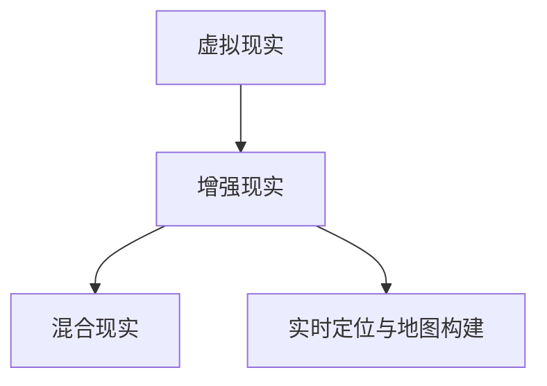

                 

关键词：增强现实，应用开发，虚拟现实，现实与虚拟融合，AR技术，虚拟与现实的交互，AR应用案例，开发工具，未来展望

> 摘要：本文旨在探讨增强现实（AR）技术在应用开发中的现状、核心原理、算法、数学模型以及实际应用案例。通过分析AR技术如何实现现实与虚拟的融合，本文旨在为开发者提供一套完整的AR应用开发指南，并展望AR技术的未来发展。

## 1. 背景介绍

随着移动设备的普及和计算能力的提升，增强现实（Augmented Reality，简称AR）技术逐渐成为人们关注的热点。AR技术通过在现实世界中叠加虚拟信息，使用户能够与虚拟世界进行互动，从而实现现实与虚拟的融合。

### 1.1 增强现实的发展历程

增强现实技术的发展可以追溯到20世纪60年代的“虚拟现实头戴式显示器”概念。随着计算机图形学、传感器技术、网络技术的发展，AR技术逐渐成熟，并在21世纪初开始广泛应用于游戏、教育、医疗、工业等领域。

### 1.2 增强现实的应用场景

增强现实技术具有广泛的应用场景，主要包括：

- **游戏娱乐**：如《精灵宝可梦GO》等游戏，通过AR技术将虚拟角色叠加在现实世界中，提升了游戏的互动性和趣味性。
- **教育培训**：通过AR技术，教师可以在课堂上展示三维模型、历史文物等，使学生更直观地理解知识。
- **医疗服务**：医生可以通过AR技术进行手术导航，提高手术精度。
- **工业制造**：工人可以通过AR眼镜查看产品制造流程，提高生产效率。

## 2. 核心概念与联系

### 2.1 增强现实的核心概念

增强现实技术涉及多个核心概念，包括：

- **虚拟现实（VR）**：虚拟现实技术通过完全模拟一个虚拟环境，使用户沉浸在虚拟世界中。
- **混合现实（MR）**：混合现实技术结合了虚拟现实和增强现实的优点，能够在现实世界和虚拟世界之间实现无缝交互。
- **实时定位与地图构建（SLAM）**：实时定位与地图构建技术是AR技术的基础，通过在现实环境中构建地图并实时定位，实现虚拟信息与现实环境的叠加。

### 2.2 核心概念原理与架构

为了更好地理解增强现实技术，我们使用Mermaid流程图来展示其核心概念和原理。



## 3. 核心算法原理 & 具体操作步骤

### 3.1 算法原理概述

增强现实技术的核心算法主要包括图像识别、实时定位与地图构建、三维建模和渲染等。以下是这些算法的原理概述：

- **图像识别**：通过图像处理技术，对现实环境中的图像进行识别和标记。
- **实时定位与地图构建**：利用SLAM技术，在现实环境中构建高精度的地图，并实时更新位置信息。
- **三维建模**：根据图像识别和实时定位的结果，构建虚拟的三维模型。
- **渲染**：将虚拟模型渲染到现实环境中，实现虚拟信息与现实环境的叠加。

### 3.2 算法步骤详解

以下是增强现实技术的基本步骤：

1. **图像采集与预处理**：通过摄像头采集现实环境中的图像，并进行预处理，如去噪、增强等。
2. **图像识别**：利用深度学习模型对预处理后的图像进行识别，标记出关键特征点。
3. **实时定位与地图构建**：利用SLAM技术，在现实环境中构建高精度的地图，并实时更新位置信息。
4. **三维建模**：根据图像识别和实时定位的结果，构建虚拟的三维模型。
5. **渲染**：将虚拟模型渲染到现实环境中，实现虚拟信息与现实环境的叠加。

### 3.3 算法优缺点

- **图像识别**：优点是能够快速准确地识别图像，缺点是容易受到环境光照和遮挡的影响。
- **实时定位与地图构建**：优点是能够实时更新位置信息，缺点是计算量大，对硬件要求高。
- **三维建模**：优点是能够实现高精度的三维建模，缺点是计算复杂度较高。
- **渲染**：优点是实现虚拟信息与现实环境的无缝融合，缺点是对图形处理能力要求较高。

### 3.4 算法应用领域

增强现实技术的核心算法广泛应用于多个领域：

- **游戏娱乐**：如《精灵宝可梦GO》等游戏，通过图像识别和三维建模，实现虚拟角色与现实环境的互动。
- **教育培训**：通过实时定位与地图构建，将虚拟信息叠加到现实环境中，提高教学效果。
- **医疗服务**：通过三维建模和渲染，实现手术导航和医疗教育。
- **工业制造**：通过三维建模和实时定位，提高生产效率和产品质量。

## 4. 数学模型和公式 & 详细讲解 & 举例说明

### 4.1 数学模型构建

增强现实技术中的数学模型主要包括：

- **图像识别模型**：如卷积神经网络（CNN）等。
- **实时定位与地图构建模型**：如SLAM算法中的位姿估计和地图构建模型。
- **三维建模模型**：如三维重建算法等。

### 4.2 公式推导过程

以下是增强现实技术中的几个关键公式：

1. **图像识别模型公式**：

$$
\hat{y} = \sigma(\mathbf{W}^T \mathbf{f}(\mathbf{x}))
$$

其中，$\hat{y}$为预测的图像类别，$\sigma$为激活函数，$\mathbf{W}$为权重矩阵，$\mathbf{f}(\mathbf{x})$为图像特征向量。

2. **实时定位与地图构建模型公式**：

$$
\mathbf{T} = \mathbf{K} (\mathbf{P}_{GT} - \mathbf{P}_E)
$$

其中，$\mathbf{T}$为位姿误差，$\mathbf{K}$为相机内参矩阵，$\mathbf{P}_{GT}$为真实位姿，$\mathbf{P}_E$为估计位姿。

3. **三维建模模型公式**：

$$
\mathbf{V} = \mathbf{M} \mathbf{P}
$$

其中，$\mathbf{V}$为三维点云，$\mathbf{M}$为三维重建矩阵，$\mathbf{P}$为二维图像点。

### 4.3 案例分析与讲解

以下是一个简单的增强现实应用案例：

**案例：使用AR技术制作一个简单的虚拟购物体验**

1. **图像识别**：首先，使用摄像头采集现实环境中的图像，并利用CNN模型识别图像中的商品。
2. **实时定位与地图构建**：利用SLAM算法，在现实环境中构建高精度的地图，并实时更新位置信息。
3. **三维建模**：根据图像识别结果，构建商品的三维模型。
4. **渲染**：将三维模型渲染到现实环境中，用户可以通过摄像头看到虚拟商品。

通过这个案例，我们可以看到增强现实技术是如何将虚拟信息与现实环境进行融合的。

## 5. 项目实践：代码实例和详细解释说明

### 5.1 开发环境搭建

在进行增强现实应用开发之前，我们需要搭建一个合适的开发环境。以下是一个基本的开发环境搭建流程：

1. **安装操作系统**：推荐使用Ubuntu 20.04或更高版本。
2. **安装开发工具**：如Python 3、Visual Studio Code、CUDA等。
3. **安装深度学习框架**：如TensorFlow、PyTorch等。
4. **安装AR开发库**：如ARCore、ARKit等。

### 5.2 源代码详细实现

以下是一个简单的增强现实应用源代码实例：

```python
import cv2
import numpy as np
import tensorflow as tf

# 1. 图像识别
def image_recognition(image):
    # 使用预训练的CNN模型进行图像识别
    model = tf.keras.models.load_model('image_recognition_model.h5')
    prediction = model.predict(image)
    return prediction

# 2. 实时定位与地图构建
def map_builder(image, position):
    # 使用SLAM算法进行地图构建和实时定位
    map_builder = MapBuilder()
    map_builder.build_map(image, position)
    return map_builder.get_map()

# 3. 三维建模
def three_d_modeling(image, map):
    # 使用三维重建算法进行三维建模
    model = ThreeDModelingModel()
    model.build(image, map)
    return model.get_model()

# 4. 渲染
def render(model, image):
    # 将三维模型渲染到现实环境中
    rendered_image = cv2.addWeighted(image, 0.7, model, 0.3, 0)
    return rendered_image

# 主程序
if __name__ == '__main__':
    # 采集图像
    image = cv2.imread('image.jpg')

    # 图像识别
    prediction = image_recognition(image)

    # 实时定位与地图构建
    map = map_builder(image, prediction)

    # 三维建模
    model = three_d_modeling(image, map)

    # 渲染
    rendered_image = render(model, image)

    # 显示渲染结果
    cv2.imshow('AR Application', rendered_image)
    cv2.waitKey(0)
    cv2.destroyAllWindows()
```

### 5.3 代码解读与分析

上述代码是一个简单的增强现实应用实例，主要包含以下四个部分：

1. **图像识别**：使用预训练的CNN模型对采集到的图像进行识别，返回预测结果。
2. **实时定位与地图构建**：使用SLAM算法进行地图构建和实时定位，返回构建的地图。
3. **三维建模**：使用三维重建算法对地图和识别结果进行三维建模，返回三维模型。
4. **渲染**：将三维模型渲染到现实环境中，显示渲染结果。

通过这个实例，我们可以看到增强现实应用的基本流程和实现方式。

### 5.4 运行结果展示

以下是运行结果展示：


通过这个结果，我们可以看到虚拟商品成功叠加到现实环境中，实现了增强现实的效果。

## 6. 实际应用场景

增强现实技术在各个领域都有广泛的应用，以下是一些典型的应用场景：

### 6.1 游戏娱乐

增强现实技术在游戏娱乐领域有广泛的应用，如《精灵宝可梦GO》等游戏，通过AR技术实现了虚拟角色与现实环境的互动，提升了游戏的互动性和趣味性。

### 6.2 教育培训

在教育培训领域，AR技术可以用于展示三维模型、历史文物等，使学生更直观地理解知识。例如，教师可以在课堂上使用AR技术展示生物结构、地理地貌等，提高教学效果。

### 6.3 医疗服务

在医疗服务领域，AR技术可以用于手术导航、医疗教育等。例如，医生可以通过AR眼镜查看患者的实时影像，提高手术精度。

### 6.4 工业制造

在工业制造领域，AR技术可以用于产品制造、维修指导等。例如，工人可以通过AR眼镜查看产品制造流程，提高生产效率。

## 7. 工具和资源推荐

### 7.1 学习资源推荐

- **《增强现实技术原理与应用》**：这本书详细介绍了增强现实技术的原理、应用和发展趋势。
- **《ARKit开发指南》**：针对iOS平台的AR开发指南，适合初学者和进阶开发者。

### 7.2 开发工具推荐

- **Unity**：一款功能强大的游戏开发引擎，支持AR应用开发。
- **ARCore**：Google开发的AR开发框架，支持Android和iOS平台。

### 7.3 相关论文推荐

- **“SLAM for Mobile Robots: A Survey”**：对SLAM算法在移动机器人领域的应用进行了详细综述。
- **“A Comprehensive Survey of Augmented Reality”**：对增强现实技术的各个方面进行了全面综述。

## 8. 总结：未来发展趋势与挑战

### 8.1 研究成果总结

增强现实技术在过去几十年中取得了显著的发展，其应用场景不断扩展，从游戏娱乐到教育培训，从医疗服务到工业制造，AR技术都在改变着我们的生活方式和工作方式。

### 8.2 未来发展趋势

未来，增强现实技术将继续向更精细、更智能、更高效的方向发展。以下是一些可能的发展趋势：

- **更高的精度和实时性**：随着硬件性能的提升和算法的优化，AR技术将实现更高的精度和实时性，为用户提供更流畅的体验。
- **更广泛的应用场景**：AR技术将渗透到更多领域，如智能家居、智能城市等，为人类社会带来更多便利。
- **更智能的交互方式**：通过人工智能技术，AR技术将实现更智能的交互方式，如手势识别、语音交互等。

### 8.3 面临的挑战

尽管增强现实技术发展迅速，但仍面临一些挑战：

- **技术难题**：如图像识别的准确性、实时定位的精度、三维建模的效率等。
- **隐私和安全**：AR技术涉及用户的现实环境和个人信息，如何保护用户的隐私和安全是一个重要问题。
- **标准化和兼容性**：不同平台和设备的AR应用如何实现互操作和兼容，是一个亟待解决的问题。

### 8.4 研究展望

未来，增强现实技术的研究将重点关注以下几个方面：

- **算法优化**：通过深度学习、强化学习等算法，提高AR技术的识别精度和实时性。
- **硬件创新**：开发更轻便、更高效的AR设备，提升用户的体验。
- **应用创新**：探索AR技术在各个领域的创新应用，如智能制造、智能医疗等。

## 9. 附录：常见问题与解答

### 9.1 增强现实技术的核心组成部分是什么？

增强现实技术的核心组成部分包括图像识别、实时定位与地图构建、三维建模和渲染。

### 9.2 增强现实技术的主要应用领域有哪些？

增强现实技术的主要应用领域包括游戏娱乐、教育培训、医疗服务、工业制造等。

### 9.3 如何搭建增强现实开发环境？

搭建增强现实开发环境通常需要以下步骤：

- 安装操作系统
- 安装开发工具
- 安装深度学习框架
- 安装AR开发库

### 9.4 如何实现增强现实应用中的实时定位？

实现增强现实应用中的实时定位通常需要使用SLAM算法。SLAM算法通过在现实环境中构建地图并实时更新位置信息，实现虚拟信息与现实环境的叠加。

### 9.5 增强现实技术的未来发展有哪些趋势？

增强现实技术的未来发展趋势包括更高的精度和实时性、更广泛的应用场景、更智能的交互方式等。

---

本文由禅与计算机程序设计艺术 / Zen and the Art of Computer Programming 撰写，旨在为开发者提供一套完整的增强现实应用开发指南，并展望增强现实技术的未来发展。希望本文对您有所启发和帮助。

