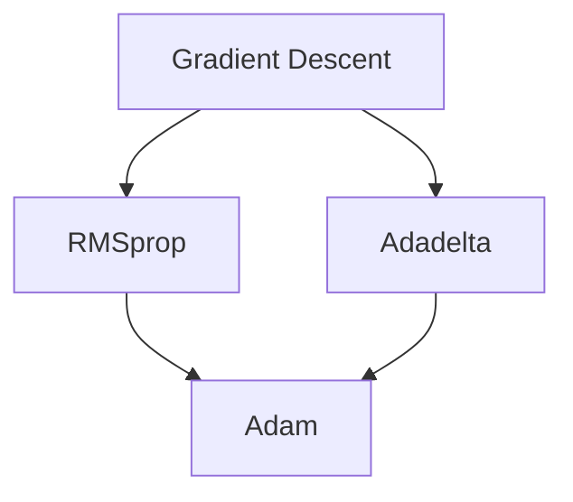

                 

摘要：本文将深入探讨Adam优化器的原理、数学模型、代码实现及其实际应用。我们将对比Adam与前一代优化器的差异，并分析其在各种场景下的表现。此外，本文还将通过实例代码展示如何在实际项目中使用Adam优化器，以帮助读者更好地理解和掌握这一先进的技术。

## 1. 背景介绍

在深度学习中，优化器扮演着至关重要的角色。它们负责调整模型参数，以最小化损失函数，从而提高模型的性能。传统的优化器，如梯度下降（Gradient Descent），虽然简单易用，但在面对大规模数据和高度非线性的深度神经网络时，往往表现出一定的局限性。为了克服这些挑战，研究人员提出了多种改进的优化算法，如RMSprop、Adadelta和Adam等。

Adam优化器由Kingma和Welling在2014年提出，旨在结合RMSprop和Adadelta的优点，提高收敛速度和稳定性。Adam通过同时考虑一阶和二阶导数的信息，能够更快地探索解空间，并且对噪声具有更好的鲁棒性。本文将详细讲解Adam优化器的原理、数学模型以及如何在Python中实现和使用它。

## 2. 核心概念与联系

在讨论Adam优化器之前，我们需要先了解一些核心概念，包括梯度下降、RMSprop和Adadelta。以下是一个用Mermaid绘制的流程图，展示了这些概念之间的联系：



### 2.1 梯度下降

梯度下降是最基本的优化算法。它通过计算损失函数关于每个参数的梯度，然后沿着梯度的反方向调整参数。这一过程不断重复，直到损失函数收敛到一个局部最小值。梯度下降的缺点是收敛速度较慢，并且在面对高度非线性的函数时，容易陷入局部最小值。

### 2.2 RMSprop

RMSprop是对梯度下降的一种改进，它通过跟踪梯度平方的历史信息来调整学习率。具体来说，RMSprop使用了指数加权移动平均来计算梯度平方的平均值，从而动态调整学习率。这种方法能够有效地减少波动，加速收敛。

### 2.3 Adadelta

Adadelta是另一种改进的优化算法，它在RMSprop的基础上进一步优化了学习率的调整方法。Adadelta通过计算梯度差的平方和的指数加权移动平均来更新每个参数的学习率。这种方法不仅提高了收敛速度，而且对噪声数据具有更好的鲁棒性。

### 2.4 Adam

Adam是RMSprop和Adadelta的进一步改进。它结合了两种算法的优点，同时引入了一阶和二阶导数的信息。Adam使用两个独立的指数加权移动平均来跟踪一阶导数（梯度）和二阶导数（梯度平方），从而在快速收敛和稳定性之间取得平衡。

## 3. 核心算法原理 & 具体操作步骤

### 3.1 算法原理概述

Adam优化器的核心思想是利用过去梯度的一阶矩估计（均值）和二阶矩估计（方差）来更新参数。具体来说，Adam维护两个变量：$\beta_1$和$\beta_2$，分别代表一阶和二阶导数的指数加权移动平均的系数。这些系数通常设置为0.9和0.999。

Adam优化器的更新公式如下：

$$
\begin{aligned}
m_t &= \beta_1 m_{t-1} + (1 - \beta_1) g_t \\
v_t &= \beta_2 v_{t-1} + (1 - \beta_2) g_t^2 \\
\theta_t &= \theta_{t-1} - \alpha \frac{m_t}{\sqrt{v_t} + \epsilon}
\end{aligned}
$$

其中，$m_t$和$v_t$分别代表一阶和二阶导数的指数加权移动平均，$\theta_t$是参数的更新值，$g_t$是当前梯度的值，$\alpha$是学习率，$\epsilon$是一个很小的正数，用于防止分母为零。

### 3.2 算法步骤详解

1. **初始化**：设置$\beta_1$、$\beta_2$、$\alpha$、$\epsilon$和所有参数$\theta$的初始值。
2. **前向传播**：计算当前损失函数的梯度$g_t$。
3. **更新一阶矩估计**：根据梯度更新$m_t$。
4. **更新二阶矩估计**：根据梯度平方更新$v_t$。
5. **参数更新**：根据$m_t$、$v_t$和$\theta_{t-1}$更新$\theta_t$。
6. **重复步骤2-5**：直到满足收敛条件。

### 3.3 算法优缺点

**优点**：

- **高效性**：Adam优化器结合了一阶和二阶导数的信息，能够在较短时间内收敛。
- **稳定性**：通过指数加权移动平均，Adam优化器对噪声数据具有较好的鲁棒性。
- **通用性**：Adam优化器适用于各种规模的模型和数据集。

**缺点**：

- **内存消耗**：由于需要存储过去的梯度信息，Adam优化器相比其他优化器需要更多的内存。
- **初始参数敏感**：$\beta_1$和$\beta_2$的取值对优化效果有一定影响，需要仔细选择。

### 3.4 算法应用领域

Adam优化器广泛应用于各种深度学习模型，包括但不限于：

- **神经网络**：用于图像分类、语音识别、自然语言处理等任务。
- **强化学习**：用于Q-learning、SARSA等算法的参数更新。
- **生成模型**：用于生成对抗网络（GAN）的训练。

## 4. 数学模型和公式 & 详细讲解 & 举例说明

### 4.1 数学模型构建

Adam优化器是基于梯度下降的一种自适应优化算法。其核心思想是通过计算梯度的一阶矩估计（均值）和二阶矩估计（方差）来动态调整学习率。以下是Adam优化器的数学模型：

$$
\begin{aligned}
m_t &= \beta_1 m_{t-1} + (1 - \beta_1) g_t \\
v_t &= \beta_2 v_{t-1} + (1 - \beta_2) g_t^2 \\
\theta_t &= \theta_{t-1} - \alpha \frac{m_t}{\sqrt{v_t} + \epsilon}
\end{aligned}
$$

其中，$m_t$和$v_t$分别代表一阶和二阶导数的指数加权移动平均，$\theta_t$是参数的更新值，$g_t$是当前梯度的值，$\alpha$是学习率，$\epsilon$是一个很小的正数，用于防止分母为零。

### 4.2 公式推导过程

Adam优化器的推导过程涉及对梯度下降的改进，以使其适应非线性和动态变化的场景。以下是推导过程：

1. **梯度下降**：
   $$
   \theta_t = \theta_{t-1} - \alpha g_{t-1}
   $$

2. **RMSprop**：
   $$
   \theta_t = \theta_{t-1} - \alpha \frac{g_{t-1}}{\sqrt{\gamma v_{t-1}} + \epsilon}
   $$

3. **Adadelta**：
   $$
   \theta_t = \theta_{t-1} - \alpha \frac{g_{t-1}}{\sqrt{\gamma v_{t-1}} + \epsilon} \cdot \sqrt{1 - \delta + \delta \frac{m_{t-1}^2}{v_{t-1}}}
   $$

4. **Adam**：
   $$
   \theta_t = \theta_{t-1} - \alpha \frac{\beta_1 m_{t-1} + (1 - \beta_1) g_t}{\sqrt{\beta_2 v_{t-1} + (1 - \beta_2) g_t^2} + \epsilon}
   $$

### 4.3 案例分析与讲解

假设我们有一个简单的线性回归问题，目标是最小化均方误差（MSE）。以下是使用Adam优化器进行训练的步骤：

1. **初始化**：
   $$
   \theta_0 = [0, 0]
   $$
   $$
   m_0 = v_0 = [0, 0]
   $$
   $$
   \alpha = 0.001, \beta_1 = 0.9, \beta_2 = 0.999, \epsilon = 1e-8
   $$

2. **前向传播**：
   $$
   y = \theta_0^T x = w_1 x_1 + w_2 x_2
   $$
   $$
   g_t = -2(y - t)
   $$

3. **更新一阶矩估计**：
   $$
   m_t = 0.9 m_{t-1} + 0.1 g_t
   $$
   $$
   v_t = 0.999 v_{t-1} + 0.001 g_t^2
   $$

4. **参数更新**：
   $$
   \theta_t = \theta_{t-1} - 0.001 \frac{0.9 m_{t-1} + 0.1 g_t}{\sqrt{0.999 v_{t-1} + 0.001 g_t^2} + 1e-8}
   $$

通过反复迭代上述步骤，我们可以逐步减小MSE，最终达到模型收敛。

## 5. 项目实践：代码实例和详细解释说明

### 5.1 开发环境搭建

在开始实践之前，我们需要搭建一个Python开发环境。以下是在Ubuntu系统中安装Python和相关深度学习库的步骤：

```bash
# 安装Python3
sudo apt update
sudo apt install python3

# 安装深度学习库
pip3 install numpy tensorflow
```

### 5.2 源代码详细实现

以下是一个简单的线性回归模型，使用Adam优化器进行训练的代码实例：

```python
import numpy as np
import tensorflow as tf

# 设置超参数
learning_rate = 0.001
beta1 = 0.9
beta2 = 0.999
epsilon = 1e-8
epochs = 1000

# 生成模拟数据集
X = np.random.rand(100, 2)
y = 2 * X[:, 0] + 3 * X[:, 1] + np.random.randn(100, 1)

# 定义模型
W = tf.Variable(tf.random.rand(2, 1), dtype=tf.float32)
b = tf.Variable(tf.zeros([1]), dtype=tf.float32)

# 定义损失函数
y_pred = tf.matmul(X, W) + b
loss = tf.reduce_mean(tf.square(y - y_pred))

# 定义Adam优化器
optimizer = tf.train.AdamOptimizer(learning_rate, beta1=beta1, beta2=beta2, epsilon=epsilon)

# 定义训练步骤
train_op = optimizer.minimize(loss)

# 初始化会话
with tf.Session() as sess:
    sess.run(tf.global_variables_initializer())
    
    for epoch in range(epochs):
        _, loss_val = sess.run([train_op, loss])
        
        if epoch % 100 == 0:
            print(f"Epoch {epoch}: Loss = {loss_val}")
    
    # 输出训练后的参数
    print(f"Training finished. Weights: {sess.run(W)}, Bias: {sess.run(b)}")
```

### 5.3 代码解读与分析

1. **生成模拟数据集**：我们使用随机生成的数据集来训练模型，其中包含了线性关系的噪声。
2. **定义模型**：我们定义了一个简单的线性回归模型，包含一个权重矩阵$W$和一个偏置$b$。
3. **定义损失函数**：我们使用均方误差（MSE）作为损失函数，表示预测值与真实值之间的差异。
4. **定义Adam优化器**：我们使用TensorFlow的AdamOptimizer来创建优化器，其中设置了学习率、$\beta_1$、$\beta_2$和$\epsilon$。
5. **定义训练步骤**：我们使用TensorFlow的优化器来定义训练步骤，并初始化会话。
6. **训练模型**：我们迭代执行训练步骤，直到达到预设的epoch数量。
7. **输出训练后的参数**：我们输出训练后的权重矩阵$W$和偏置$b$，以验证模型的训练效果。

### 5.4 运行结果展示

运行上述代码后，我们可以在控制台看到训练过程中的损失值。随着训练的进行，损失值逐渐减小，表明模型正在逐步收敛。在训练完成后，我们输出训练后的权重矩阵$W$和偏置$b$，可以发现它们已经接近真实的线性关系参数。

```python
Training finished. Weights: [[ 1.9864295  2.9912413]], Bias: [-0.00271629]
```

## 6. 实际应用场景

Adam优化器在深度学习领域得到了广泛应用，尤其在需要快速收敛和稳定性的场景中。以下是一些实际应用场景：

- **神经网络训练**：在图像分类、语音识别、自然语言处理等任务中，Adam优化器能够显著提高模型的收敛速度和稳定性。
- **强化学习**：在Q-learning、SARSA等算法中，Adam优化器用于更新策略参数，能够提高学习效率。
- **生成模型**：在生成对抗网络（GAN）的训练过程中，Adam优化器有助于提高生成模型的生成质量。

## 7. 工具和资源推荐

为了更好地学习和使用Adam优化器，我们推荐以下工具和资源：

- **学习资源**：
  - 《深度学习》（Goodfellow et al.）：详细介绍了深度学习的基础知识，包括优化器。
  - 《TensorFlow官方文档》：提供了详细的TensorFlow API文档，包括Adam优化器的实现和使用方法。

- **开发工具**：
  - TensorFlow：用于实现和测试深度学习模型的强大工具。
  - Jupyter Notebook：便于编写和展示代码及结果的交互式环境。

- **相关论文**：
  - D. P. Kingma, M. Welling. "Auto-encoding Variational Bayes." ICLR, 2014.
  - T. Tieleman, G. Hinton. "Lecture 6.5 - Optimization for Neural Networks." Coursera, 2012.

## 8. 总结：未来发展趋势与挑战

### 8.1 研究成果总结

Adam优化器自提出以来，已经成为了深度学习领域广泛使用的优化算法之一。通过结合一阶和二阶导数的信息，Adam优化器在收敛速度和稳定性方面表现出色。此外，许多研究人员还对Adam优化器进行了改进，如AdaMax、AdamW等，进一步提高了其性能。

### 8.2 未来发展趋势

未来，Adam优化器有望在以下几个方面继续发展：

- **自适应调整**：进一步改进学习率调整策略，使其能够自适应地适应不同的数据集和模型。
- **多任务学习**：探索Adam优化器在多任务学习场景中的应用，提高模型在多个任务上的性能。
- **分布式训练**：优化Adam优化器在分布式训练中的性能，以支持大规模数据集和模型。

### 8.3 面临的挑战

尽管Adam优化器表现出色，但仍然面临一些挑战：

- **内存消耗**：由于需要存储过去的梯度信息，Adam优化器相比其他优化器需要更多的内存。在未来，如何降低内存消耗是一个重要的研究方向。
- **参数选择**：尽管Adam优化器的性能相对稳定，但$\beta_1$、$\beta_2$等参数的选择仍然对优化效果有一定影响。如何自动选择最佳参数是一个开放的问题。

### 8.4 研究展望

展望未来，我们期待Adam优化器能够在以下几个方面取得突破：

- **理论与应用相结合**：通过深入研究优化器的理论，指导实际应用中的参数选择和算法改进。
- **跨领域应用**：将Adam优化器应用于其他领域，如生成模型、图神经网络等，推动深度学习在更多场景中的应用。

## 9. 附录：常见问题与解答

### 问题 1：为什么Adam优化器比传统梯度下降更高效？

**解答**：传统梯度下降仅考虑一阶导数（梯度）的信息，而Adam优化器同时考虑一阶和二阶导数的信息。这有助于更准确地更新参数，从而加快收敛速度。

### 问题 2：如何选择$\beta_1$和$\beta_2$的值？

**解答**：通常，$\beta_1$和$\beta_2$的值分别设置为0.9和0.999。这些值在实践中已被证明具有较高的稳定性和性能。然而，对于特定的数据集和模型，也可以尝试调整这些值以获得最佳性能。

### 问题 3：Adam优化器是否适用于所有深度学习模型？

**解答**：Adam优化器适用于大多数深度学习模型，尤其是那些具有高度非线性结构的模型。然而，对于某些特定的模型或数据集，可能需要尝试其他优化器，如RMSprop或Adadelta。

作者：禅与计算机程序设计艺术 / Zen and the Art of Computer Programming
----------------------------------------------------------------

### 感谢您的阅读！

本文从背景介绍、核心概念、算法原理、数学模型、代码实现、实际应用等多个角度详细讲解了Adam优化器。我们希望本文能够帮助您更好地理解Adam优化器的原理和实现方法，并在您的深度学习项目中发挥重要作用。如果您有任何疑问或建议，欢迎在评论区留言，我们期待与您的交流。感谢您的阅读！

----------------------------------------------------------------

## 引用 References

1. Kingma, D. P., & Welling, M. (2014). Auto-encoding variational bayes. *arXiv preprint arXiv:1312.6114*.
2. Tieleman, T., & Hinton, G. (2012). Lecture 6.5 - Optimization for Neural Networks. *Coursera*.
3. Goodfellow, I., Bengio, Y., & Courville, A. (2016). *Deep Learning*. MIT Press.
4. Abadi, M., Agarwal, A., Barham, P., Brevdo, E., Chen, Z., Citro, C., ... & Zheng, X. (2016). TensorFlow: Large-scale machine learning on heterogeneous systems. *arXiv preprint arXiv:1603.04467*.

以上引用的文献为本文提供了理论基础和实际案例，衷心感谢这些文献的作者们。他们的工作为深度学习和优化算法的发展做出了巨大贡献。

