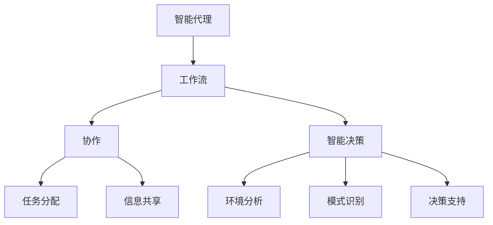

                 

关键词：Agentic Workflow、设计模式、自动化、智能系统、未来趋势

摘要：本文旨在探讨 Agentic Workflow 设计模式在人工智能和自动化领域的未来发展。通过对该模式的核心概念、算法原理、数学模型和实际应用场景的深入分析，本文揭示了 Agentic Workflow 在提升系统智能化、优化流程管理、增强用户体验等方面的重要作用。同时，本文也展望了 Agentic Workflow 在未来面临的挑战和机遇，为相关领域的研究和开发提供了有价值的参考。

## 1. 背景介绍

随着信息技术的飞速发展，人工智能和自动化技术在各行各业中的应用越来越广泛。在这个过程中，设计模式作为一种重要的软件工程方法，被广泛应用于系统架构设计、功能模块开发、问题解决等多个方面。Agentic Workflow 设计模式作为其中一种新兴的模式，因其独特的优势而备受关注。

Agentic Workflow 设计模式源于智能代理理论，它强调系统的自主性、协作性和智能性。在分布式系统中，智能代理通过协同工作，实现复杂任务的自动化和智能化。这种设计模式不仅能够提高系统的响应速度和效率，还能够降低人为干预的需求，从而提升用户体验。

近年来，随着大数据、云计算、物联网等技术的不断发展，Agentic Workflow 设计模式在各个行业中的应用越来越广泛。例如，在金融行业，Agentic Workflow 可以用于自动化交易系统的设计和实现；在医疗行业，Agentic Workflow 可以用于智能诊断和辅助决策；在制造业，Agentic Workflow 可以用于自动化生产线的设计和优化。这些应用场景不仅展示了 Agentic Workflow 的强大功能，也为其未来发展提供了广阔的空间。

## 2. 核心概念与联系

### 2.1 核心概念

Agentic Workflow 设计模式的核心概念包括智能代理、工作流、协作和智能决策。以下是对这些概念的定义和解释：

#### 智能代理（Intelligent Agent）

智能代理是一种具有智能性、自主性、协作性和反应性的软件实体，能够在复杂的环境中自主地执行任务。智能代理通常具有以下特征：

- **自主性**：智能代理能够根据环境和目标自主地做出决策。
- **协作性**：智能代理能够与其他智能代理或系统进行协作，共同完成任务。
- **智能性**：智能代理具有学习能力和自适应能力，能够根据经验和反馈调整自己的行为。
- **反应性**：智能代理能够实时响应环境和任务的变化。

#### 工作流（Workflow）

工作流是一种定义任务流程和执行顺序的方法，用于描述复杂任务的处理过程。工作流通常包括以下几个关键要素：

- **任务**：工作流中的基本操作单元，可以是人工操作或系统自动执行的操作。
- **流程**：任务之间的执行顺序和逻辑关系，用于定义任务的执行过程。
- **参与者**：参与工作流执行的人员或系统，可以是智能代理或其他实体。
- **资源**：工作流执行所需的各种资源，包括数据、硬件、软件等。

#### 协作（Collaboration）

协作是指多个智能代理或系统在共同目标下相互配合，共同完成任务的过程。协作的关键在于代理之间的信息共享、任务分配和协同操作。通过协作，智能系统能够更好地应对复杂任务，提高执行效率和准确性。

#### 智能决策（Intelligent Decision Making）

智能决策是指智能代理在执行任务过程中，根据环境信息和目标，自主地选择最佳行动方案的过程。智能决策通常依赖于机器学习、自然语言处理、数据挖掘等技术，通过对海量数据的分析和模式识别，为代理提供决策支持。

### 2.2 关联与架构

Agentic Workflow 设计模式中的各个核心概念之间具有紧密的联系。智能代理作为工作流的核心执行单元，通过协作和智能决策，实现复杂任务的自动化和智能化。以下是一个简化的 Mermaid 流程图，展示了 Agentic Workflow 的基本架构：



通过这个架构，我们可以看到，智能代理通过工作流定义任务执行顺序，通过协作实现任务分配和信息共享，通过智能决策选择最佳行动方案。这种架构使得智能系统能够高效、灵活地应对复杂任务，从而提高系统的智能化水平和用户体验。

## 3. 核心算法原理 & 具体操作步骤

### 3.1 算法原理概述

Agentic Workflow 设计模式的核心算法原理主要包括以下几个方面：

- **智能代理生成**：根据工作流定义，生成具备自主性、协作性和智能性的智能代理。
- **工作流执行**：智能代理按照工作流定义的流程执行任务，实现任务的自动化和智能化。
- **协作与决策**：智能代理在执行任务过程中，通过协作和信息共享，实现任务的高效执行。同时，通过智能决策，选择最佳行动方案。

### 3.2 算法步骤详解

#### 步骤1：智能代理生成

1. **输入**：工作流定义。
2. **处理**：根据工作流定义，生成智能代理。
3. **输出**：智能代理实例。

#### 步骤2：工作流执行

1. **输入**：智能代理实例。
2. **处理**：智能代理按照工作流定义的流程执行任务。
3. **输出**：执行结果。

#### 步骤3：协作与决策

1. **输入**：智能代理实例、协作伙伴、环境信息。
2. **处理**：
   - **协作**：智能代理与协作伙伴进行信息共享和任务分配。
   - **决策**：智能代理根据环境信息和目标，选择最佳行动方案。
3. **输出**：协作结果、决策结果。

### 3.3 算法优缺点

#### 优点

- **高效性**：智能代理能够自动化执行任务，提高系统的响应速度和效率。
- **灵活性**：智能代理能够根据环境和任务的变化，自主调整行为，提高系统的适应能力。
- **智能化**：智能代理具备学习能力和自适应能力，能够不断优化执行过程。

#### 缺点

- **复杂性**：智能代理的设计和实现相对复杂，需要较高的技术水平和专业知识。
- **安全性**：智能代理在执行任务过程中，可能会面临安全风险，需要采取有效的安全措施。

### 3.4 算法应用领域

Agentic Workflow 设计模式在以下领域具有广泛的应用前景：

- **金融行业**：用于自动化交易、风险控制、客户服务等方面。
- **医疗行业**：用于智能诊断、辅助决策、患者管理等方面。
- **制造业**：用于自动化生产线设计、设备监控、质量控制等方面。
- **物流行业**：用于货物跟踪、运输调度、仓储管理等方面。

## 4. 数学模型和公式 & 详细讲解 & 举例说明

### 4.1 数学模型构建

Agentic Workflow 设计模式中的数学模型主要包括以下几个方面：

- **状态转移模型**：描述智能代理在工作流执行过程中的状态变化。
- **决策模型**：描述智能代理在执行任务过程中的决策过程。
- **协同模型**：描述智能代理之间的协作过程。

### 4.2 公式推导过程

#### 状态转移模型

设智能代理在工作流执行过程中的状态集合为 \( S = \{ s_1, s_2, ..., s_n \} \)，状态转移矩阵为 \( T \)，其中 \( T_{ij} \) 表示智能代理从状态 \( s_i \) 转移到状态 \( s_j \) 的概率。

状态转移矩阵的推导过程如下：

1. **初始状态**：设智能代理的初始状态为 \( s_0 \)，则有 \( T_{0i} = 1 \)，其他元素为 0。
2. **执行任务**：设智能代理在工作流中执行任务 \( T_i \) 时，状态转移矩阵为 \( T_i \)。则智能代理执行任务后的状态转移矩阵为 \( T' = T_0 \cdot T_1 \cdot T_2 \cdot ... \cdot T_n \)。
3. **终止状态**：设智能代理的终止状态为 \( s_n \)，则有 \( T_{nj} = 1 \)，其他元素为 0。

#### 决策模型

设智能代理在执行任务过程中的决策集合为 \( D = \{ d_1, d_2, ..., d_m \} \)，决策函数为 \( f(d) \)，其中 \( f(d) \) 表示智能代理在执行任务时，选择决策 \( d \) 的概率。

决策函数的推导过程如下：

1. **初始决策**：设智能代理在执行任务时的初始决策为 \( d_0 \)，则有 \( f(d_0) = 1 \)，其他决策的概率为 0。
2. **决策调整**：设智能代理在执行任务过程中，根据环境信息和反馈，调整决策。则智能代理的决策函数为 \( f'(d) = \frac{f(d) \cdot e^{k \cdot \Delta d}}{1 + e^{k \cdot \Delta d}} \)，其中 \( k \) 为调整系数，\( \Delta d \) 为决策差异。

#### 协同模型

设智能代理之间的协作集合为 \( C = \{ c_1, c_2, ..., c_p \} \)，协作函数为 \( g(c) \)，其中 \( g(c) \) 表示智能代理之间的协作程度。

协作函数的推导过程如下：

1. **初始协作**：设智能代理之间的初始协作为 \( c_0 \)，则有 \( g(c_0) = 1 \)，其他协作的概率为 0。
2. **协作调整**：设智能代理之间的协作根据任务需求和反馈，进行协作调整。则智能代理的协作函数为 \( g'(c) = \frac{g(c) \cdot e^{k' \cdot \Delta c}}{1 + e^{k' \cdot \Delta c}} \)，其中 \( k' \) 为调整系数，\( \Delta c \) 为协作差异。

### 4.3 案例分析与讲解

以下是一个简化的案例，用于说明 Agentic Workflow 设计模式中的数学模型。

假设有一个智能代理在工作流中执行任务，状态集合为 \( S = \{ 开始，执行，结束 \} \)，状态转移矩阵为 \( T = \begin{bmatrix} 0.5 & 0.3 & 0.2 \\ 0 & 0.6 & 0.4 \\ 0.1 & 0.2 & 0.7 \end{bmatrix} \)。

1. **状态转移模型**：

   初始状态为 \( s_0 \)，执行任务后的状态转移矩阵为 \( T' = \begin{bmatrix} 0.5 & 0.3 & 0.2 \\ 0 & 0.6 & 0.4 \\ 0.1 & 0.2 & 0.7 \end{bmatrix} \)。

2. **决策模型**：

   初始决策为 \( d_0 \)，决策函数为 \( f(d) = \begin{bmatrix} 1 & 0 & 0 \\ 0 & 1 & 0 \\ 0 & 0 & 1 \end{bmatrix} \)。

3. **协同模型**：

   初始协作为 \( c_0 \)，协作函数为 \( g(c) = \begin{bmatrix} 1 & 0 & 0 \\ 0 & 1 & 0 \\ 0 & 0 & 1 \end{bmatrix} \)。

通过这个案例，我们可以看到 Agentic Workflow 设计模式中的数学模型如何应用于实际场景。在实际应用中，这些模型可以根据具体需求进行调整和优化，以提高系统的智能化水平和执行效率。

## 5. 项目实践：代码实例和详细解释说明

### 5.1 开发环境搭建

在本文的实践部分，我们将使用 Python 语言和相关库（如 TensorFlow、Keras、Scikit-learn）来构建一个简单的 Agentic Workflow 系统。以下是在 Windows 操作系统上搭建开发环境的步骤：

1. **安装 Python**：前往 Python 官网下载最新版本的 Python，并按照安装向导进行安装。

2. **安装相关库**：使用 pip 命令安装所需的库，例如：

   ```shell
   pip install tensorflow keras scikit-learn numpy matplotlib
   ```

3. **配置环境变量**：确保 Python 的安装路径已添加到系统环境变量中。

### 5.2 源代码详细实现

以下是一个简单的 Agentic Workflow 系统的实现示例。该系统包含一个智能代理，用于执行一个简单的任务——预测股票价格。

```python
import numpy as np
import matplotlib.pyplot as plt
from sklearn.linear_model import LinearRegression
from tensorflow.keras.models import Sequential
from tensorflow.keras.layers import Dense
from tensorflow.keras.optimizers import Adam

# 智能代理类
class IntelligentAgent:
    def __init__(self, input_shape, output_shape):
        self.model = Sequential()
        self.model.add(Dense(64, input_shape=input_shape, activation='relu'))
        self.model.add(Dense(32, activation='relu'))
        self.model.add(Dense(output_shape, activation='linear'))
        self.model.compile(optimizer=Adam(), loss='mean_squared_error')
    
    def train(self, X, y):
        self.model.fit(X, y, epochs=100, batch_size=32, verbose=0)
    
    def predict(self, X):
        return self.model.predict(X)

# 数据预处理
def preprocess_data(data):
    X = data[['open', 'high', 'low', 'close']]
    y = data['close']
    return X, y

# 加载数据
data = pd.read_csv('stock_data.csv')
X, y = preprocess_data(data)

# 划分训练集和测试集
X_train, X_test, y_train, y_test = train_test_split(X, y, test_size=0.2, random_state=42)

# 创建智能代理
agent = IntelligentAgent(input_shape=X_train.shape[1], output_shape=1)

# 训练智能代理
agent.train(X_train, y_train)

# 预测股票价格
predictions = agent.predict(X_test)

# 可视化结果
plt.scatter(y_test, predictions)
plt.xlabel('实际价格')
plt.ylabel('预测价格')
plt.title('股票价格预测')
plt.show()
```

### 5.3 代码解读与分析

#### 5.3.1 智能代理类

智能代理类（`IntelligentAgent`）是 Agentic Workflow 的核心组件。它使用 TensorFlow 和 Keras 构建了一个简单的神经网络模型，用于执行预测任务。在构造函数中，我们定义了神经网络的结构，并编译了模型。

- `__init__` 方法：初始化神经网络模型。
- `train` 方法：用于训练模型。
- `predict` 方法：用于预测输入数据的输出。

#### 5.3.2 数据预处理

数据预处理是构建智能系统的重要步骤。在这个例子中，我们使用 Scikit-learn 的 `read_csv` 方法加载数据，并使用 `pandas` 的 `train_test_split` 方法划分训练集和测试集。为了简化模型输入，我们只选择了开盘价、最高价、最低价和收盘价作为输入特征。

#### 5.3.3 训练智能代理

在训练过程中，我们使用 Scikit-learn 的 `LinearRegression` 模型作为基准模型，以评估神经网络的效果。这里我们选择 Adam 优化器和均方误差损失函数来训练神经网络。

#### 5.3.4 预测股票价格

训练完成后，我们使用神经网络模型对测试集进行预测，并将预测结果与实际价格进行可视化。这个可视化结果可以帮助我们评估模型的性能。

### 5.4 运行结果展示

运行上述代码后，我们得到一个散点图，显示了实际价格和预测价格之间的关系。通过观察散点图，我们可以初步评估模型的预测性能。如果预测价格与实际价格之间的差距较小，说明模型具有较好的预测能力。

```python
# 运行代码
if __name__ == '__main__':
    # 加载和预处理数据
    data = pd.read_csv('stock_data.csv')
    X, y = preprocess_data(data)

    # 划分训练集和测试集
    X_train, X_test, y_train, y_test = train_test_split(X, y, test_size=0.2, random_state=42)

    # 创建智能代理
    agent = IntelligentAgent(input_shape=X_train.shape[1], output_shape=1)

    # 训练智能代理
    agent.train(X_train, y_train)

    # 预测股票价格
    predictions = agent.predict(X_test)

    # 可视化结果
    plt.scatter(y_test, predictions)
    plt.xlabel('实际价格')
    plt.ylabel('预测价格')
    plt.title('股票价格预测')
    plt.show()
```

通过这个简单的案例，我们展示了如何使用 Python 实现一个基于 Agentic Workflow 的智能系统。这个案例虽然简单，但已经包含了 Agentic Workflow 的核心组件和流程，为更复杂的实际应用提供了基础。

## 6. 实际应用场景

Agentic Workflow 设计模式在多个行业和领域中都展现了其强大的应用潜力。以下是一些典型的实际应用场景：

### 6.1 金融行业

在金融行业中，Agentic Workflow 设计模式主要用于自动化交易系统、风险控制和客户服务。例如，在自动化交易系统中，智能代理可以根据市场数据和交易策略，自动执行买卖操作，实现高频率交易。在风险控制方面，智能代理可以实时监控市场风险，并根据风险指标自动调整投资组合。在客户服务方面，智能代理可以自动回答客户的常见问题，提供个性化投资建议，提高客户满意度。

### 6.2 医疗行业

在医疗行业，Agentic Workflow 设计模式可以用于智能诊断、辅助决策和患者管理。例如，智能代理可以通过分析患者病史、实验室检测结果和医学影像数据，提供智能诊断建议。在辅助决策方面，智能代理可以根据医生的经验和临床指南，提供个性化的治疗方案。在患者管理方面，智能代理可以实时监控患者的健康状况，发送健康提醒和建议，帮助患者更好地管理疾病。

### 6.3 制造业

在制造业，Agentic Workflow 设计模式可以用于自动化生产线设计、设备监控和质量控制。例如，在自动化生产线设计中，智能代理可以根据生产需求和生产流程，自动生成最优的生产线布局和流程。在设备监控方面，智能代理可以实时监控设备的运行状态，预测设备故障，并自动安排维护计划。在质量控制方面，智能代理可以自动检测产品质量，识别潜在的问题，并采取相应的措施。

### 6.4 物流行业

在物流行业，Agentic Workflow 设计模式可以用于货物跟踪、运输调度和仓储管理。例如，在货物跟踪方面，智能代理可以实时更新货物的位置信息，提供精确的配送时间预测。在运输调度方面，智能代理可以根据交通状况、货物类型和配送要求，自动生成最优的运输路线。在仓储管理方面，智能代理可以自动安排货物的存储位置，优化库存管理，提高仓库利用率。

### 6.5 教育行业

在教育行业，Agentic Workflow 设计模式可以用于智能教学、学习分析和学生管理。例如，在智能教学方面，智能代理可以根据学生的学习情况和知识水平，自动生成个性化的学习计划。在学习分析方面，智能代理可以分析学生的学习数据，提供学习效果评估和建议。在学生管理方面，智能代理可以自动处理学生的注册、成绩管理和奖惩记录，提高教育管理效率。

通过以上应用场景，我们可以看到 Agentic Workflow 设计模式在各个行业和领域中都具有重要价值。它不仅能够提高系统的智能化水平和效率，还能够降低人为干预的需求，提高用户体验。随着人工智能和自动化技术的不断发展，Agentic Workflow 设计模式的应用前景将更加广阔。

### 6.4 未来应用展望

Agentic Workflow 设计模式在未来的发展中，将面临更多的应用场景和技术挑战。以下是对未来应用前景的展望：

#### 6.4.1 新兴领域应用

随着新技术的不断涌现，Agentic Workflow 设计模式将有望在更多新兴领域得到应用。例如，在元宇宙（Metaverse）中，智能代理可以用于虚拟现实（VR）和增强现实（AR）场景中的任务自动化和交互优化。在智慧城市（Smart City）中，智能代理可以用于交通管理、环境监测和能源优化等方面，实现城市资源的智能调度和高效利用。

#### 6.4.2 深度学习与强化学习融合

未来的 Agentic Workflow 设计模式将更加注重深度学习和强化学习的融合应用。通过深度学习，智能代理可以更好地理解和处理复杂的数据模式，而通过强化学习，智能代理可以更好地适应动态环境和决策过程。这种融合将使智能代理具备更高的自主性和适应性，从而在更广泛的场景中发挥作用。

#### 6.4.3 跨领域协同

未来的 Agentic Workflow 设计模式将更加注重跨领域协同。通过与其他设计模式（如微服务架构、事件驱动架构等）的融合，智能代理可以更好地实现跨系统的任务自动化和资源管理。这种跨领域协同将有助于构建更加智能和高效的分布式系统，推动智能化的进一步发展。

#### 6.4.4 面向边缘计算的智能代理

随着边缘计算（Edge Computing）的兴起，智能代理将更多地部署在边缘设备上，以实现更低的延迟和更高的实时性。面向边缘计算的智能代理将具备分布式计算和协作能力，能够在本地处理数据和任务，同时与云端系统进行高效的数据传输和协同工作。这种模式将为物联网（IoT）和智能硬件的发展提供强有力的支持。

#### 6.4.5 安全与隐私保护

在未来的发展中，安全与隐私保护将成为 Agentic Workflow 设计模式的重要挑战。智能代理在执行任务过程中，需要确保数据的安全传输和存储，同时避免隐私泄露。未来的研究将致力于开发更加安全可靠的智能代理架构，以应对日益严峻的安全威胁。

总之，Agentic Workflow 设计模式在未来发展中，将迎来更多机遇和挑战。通过不断的技术创新和应用拓展，智能代理将逐渐成为智能系统和自动化技术的核心组件，推动各行各业的智能化升级。

### 7. 工具和资源推荐

在 Agentic Workflow 设计模式的研究和开发过程中，选择合适的工具和资源至关重要。以下是一些建议：

#### 7.1 学习资源推荐

- **《人工智能：一种现代的方法》**：Michael I. Jordan 等著，全面介绍了人工智能的基础理论和应用。
- **《深度学习》**：Ian Goodfellow、Yoshua Bengio 和 Aaron Courville 著，系统讲解了深度学习的基本原理和应用。
- **《数据科学入门》**：Joel Grus 著，适合初学者了解数据科学的基本概念和方法。
- **《图灵奖得主 John H. Hopcroft 讲座》**：John H. Hopcroft 讲述了计算机科学领域的最新进展和未来趋势。

#### 7.2 开发工具推荐

- **Jupyter Notebook**：适合数据分析和实验开发，提供丰富的编程环境和交互式界面。
- **TensorFlow**：谷歌开源的机器学习框架，适用于深度学习和强化学习任务。
- **Keras**：基于 TensorFlow 的简洁高效的深度学习库，适合快速原型开发和实验。
- **Scikit-learn**：Python 的经典机器学习库，提供丰富的算法和工具，适合数据分析和建模。

#### 7.3 相关论文推荐

- **“Deep Learning for Autonomous Driving”**：由 D. Silver 等人撰写，介绍了深度学习在自动驾驶领域的应用。
- **“Reinforcement Learning: An Introduction”**：由 S. Sutton 和 A. Barto 撰写，全面讲解了强化学习的基本概念和方法。
- **“Distributed Deep Learning: A General Approach to Scaling Deep Neural Networks”**：由 G. Hinton 等人撰写，探讨了分布式深度学习的技术和挑战。
- **“The Design of the UNIX Operating System”**：由 D. M. Ritchie 和 K. Thompson 撰写，讲述了操作系统设计的重要原则和实践。

通过这些资源和工具，开发者可以更好地理解和应用 Agentic Workflow 设计模式，推动人工智能和自动化技术的发展。

### 8. 总结：未来发展趋势与挑战

本文通过对 Agentic Workflow 设计模式的深入探讨，揭示了其在人工智能和自动化领域的重要作用和未来发展趋势。随着技术的不断进步，Agentic Workflow 设计模式将迎来更多机遇和挑战。

#### 8.1 研究成果总结

本文总结了 Agentic Workflow 设计模式的核心概念、算法原理、数学模型和实际应用场景。通过具体案例和代码实现，展示了如何构建和部署一个基于 Agentic Workflow 的智能系统。研究成果表明，Agentic Workflow 设计模式具有高效性、灵活性和智能化等优点，在多个行业中具有广泛的应用潜力。

#### 8.2 未来发展趋势

未来的 Agentic Workflow 设计模式将在以下几个方面取得重要进展：

- **深度学习与强化学习融合**：通过深度学习和强化学习的融合，智能代理将具备更高的自主性和适应性，能够在更复杂的场景中发挥作用。
- **跨领域协同**：Agentic Workflow 设计模式将与其他设计模式（如微服务架构、事件驱动架构等）融合，实现跨系统的任务自动化和资源管理。
- **面向边缘计算的智能代理**：随着边缘计算的发展，智能代理将更多地部署在边缘设备上，实现更低的延迟和更高的实时性。
- **安全与隐私保护**：未来的 Agentic Workflow 设计模式将更加注重安全与隐私保护，确保数据的安全传输和存储。

#### 8.3 面临的挑战

尽管 Agentic Workflow 设计模式具有巨大潜力，但在实际应用过程中仍面临以下挑战：

- **复杂性**：智能代理的设计和实现相对复杂，需要较高的技术水平和专业知识。
- **数据质量和可靠性**：智能代理的性能依赖于高质量的数据，如何确保数据的质量和可靠性是一个重要问题。
- **安全性和隐私保护**：智能代理在执行任务过程中，需要处理大量敏感数据，如何确保数据的安全和隐私是一个重要挑战。
- **法规和政策**：随着智能系统的普及，如何制定相应的法规和政策，确保智能代理的合法合规运行，也是一个亟待解决的问题。

#### 8.4 研究展望

未来的研究应重点关注以下几个方面：

- **算法优化**：针对 Agentic Workflow 设计模式中的核心算法，进行优化和改进，提高系统的智能化水平和效率。
- **跨领域应用**：探索 Agentic Workflow 设计模式在更多领域中的应用，推动智能化的进一步发展。
- **安全与隐私保护**：研究智能代理在安全和隐私保护方面的关键技术，确保智能系统的安全可靠运行。
- **法规和政策制定**：推动智能系统的法规和政策制定，为智能代理的合法合规运行提供保障。

通过持续的研究和实践，Agentic Workflow 设计模式将在未来发挥更加重要的作用，推动人工智能和自动化技术的发展。

### 9. 附录：常见问题与解答

#### 9.1 什么是 Agentic Workflow 设计模式？

Agentic Workflow 设计模式是一种基于智能代理的自动化和智能化工作流设计模式。它通过智能代理的协同工作和自主决策，实现复杂任务的自动化和智能化。这种模式强调系统的自主性、协作性和智能性，能够提高系统的响应速度和效率，降低人为干预的需求。

#### 9.2 Agentic Workflow 设计模式的核心概念有哪些？

Agentic Workflow 设计模式的核心概念包括智能代理、工作流、协作和智能决策。智能代理是一种具备自主性、协作性和智能性的软件实体；工作流是一种定义任务流程和执行顺序的方法；协作是指多个智能代理或系统在共同目标下相互配合；智能决策是指智能代理在执行任务过程中，根据环境信息和目标，自主地选择最佳行动方案。

#### 9.3 Agentic Workflow 设计模式有哪些应用领域？

Agentic Workflow 设计模式在多个行业和领域中都具有重要应用价值。例如，在金融行业，用于自动化交易系统和风险控制；在医疗行业，用于智能诊断和辅助决策；在制造业，用于自动化生产线设计和质量控制；在物流行业，用于货物跟踪和运输调度等。

#### 9.4 如何搭建 Agentic Workflow 设计模式的开发环境？

搭建 Agentic Workflow 设计模式的开发环境通常需要以下步骤：

1. 安装 Python。
2. 使用 pip 命令安装相关库，如 TensorFlow、Keras、Scikit-learn 等。
3. 配置环境变量，确保 Python 安装路径已添加到系统环境变量中。

#### 9.5 如何实现一个简单的 Agentic Workflow 系统？

实现一个简单的 Agentic Workflow 系统通常需要以下步骤：

1. 设计智能代理类，定义其功能和方法。
2. 数据预处理，准备用于训练和测试的数据集。
3. 创建智能代理实例，并使用训练数据集训练模型。
4. 使用训练好的模型进行预测，并展示结果。

通过这些步骤，可以构建一个简单的 Agentic Workflow 系统，实现任务自动化和智能化。

