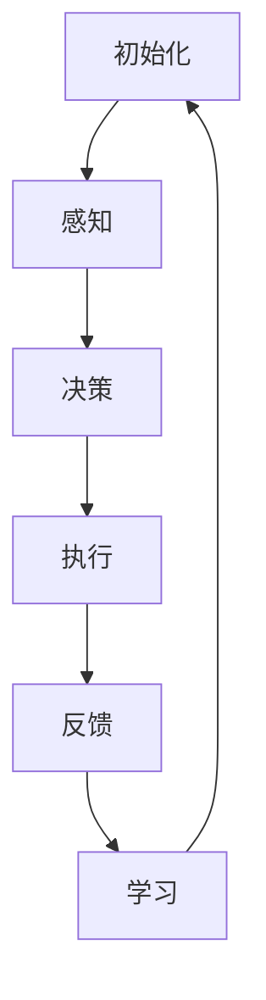

                 

 

## 1. 背景介绍

在人工智能（AI）领域，随着深度学习、强化学习、多智能体系统等技术的快速发展，AI系统在复杂环境中的表现越来越出色。然而，AI系统的有效性和实用性往往取决于其与外部环境的交互能力。在这一过程中，代理（Agent）技术成为了一个关键的桥梁。

代理是一种能够感知环境、制定计划并执行动作的智能实体。在AI系统中，代理可以代表系统与外部环境进行交互，完成一系列复杂任务。随着AI技术的发展，代理的应用场景也在不断扩展，从简单的游戏控制到自动驾驶、智能助手等复杂领域，都离不开代理技术的支持。

本文将探讨代理在AI系统中的实战经验，包括其核心概念、算法原理、数学模型、项目实践以及未来展望。通过这篇文章，希望能够帮助读者更深入地理解代理技术，并在实际项目中发挥其优势。

## 2. 核心概念与联系

### 2.1 代理的定义

代理（Agent）是指能够独立执行任务、与环境进行交互并自主学习的智能实体。在AI系统中，代理可以是一个程序、一个机器人、一个虚拟角色，甚至是多个智能体的协同工作。

### 2.2 代理的特点

代理具有以下几个关键特点：

1. **自主性**：代理可以自主决策，根据环境变化调整自身行为。
2. **反应性**：代理能够实时感知环境变化，并迅速作出反应。
3. **适应性**：代理可以根据经验不断优化自身行为，提高任务完成效率。
4. **社交性**：代理可以与其他代理进行协作，共同完成复杂任务。

### 2.3 代理与环境的交互

代理与环境之间的交互是一个动态过程，主要包括感知、决策和执行三个步骤：

1. **感知**：代理通过传感器收集环境信息，如图像、声音、文字等。
2. **决策**：代理根据感知到的信息，使用算法或模型生成行动策略。
3. **执行**：代理根据决策执行具体动作，如移动、发送消息等。

### 2.4 代理的架构

代理通常由以下几部分组成：

1. **感知模块**：负责收集环境信息。
2. **决策模块**：根据感知模块提供的信息，使用算法或模型生成行动策略。
3. **执行模块**：负责执行决策模块生成的行动策略。
4. **学习模块**：根据执行结果不断优化代理的行为。

### 2.5 代理的流程

代理的流程可以概括为以下几个步骤：

1. **初始化**：代理启动，加载初始参数和模型。
2. **感知**：代理通过传感器收集环境信息。
3. **决策**：代理根据感知信息，使用算法或模型生成行动策略。
4. **执行**：代理根据决策执行具体动作。
5. **反馈**：代理接收环境反馈，更新自身状态。
6. **学习**：代理根据反馈信息，不断优化自身行为。

### 2.6 代理的Mermaid流程图

以下是一个简单的代理流程的Mermaid流程图：



## 3. 核心算法原理 & 具体操作步骤

### 3.1 代理算法原理概述

代理算法的核心是决策算法，它决定了代理如何根据感知到的环境信息生成最优的行动策略。常见的代理算法包括基于规则的算法、基于模型的算法和基于学习的算法。

1. **基于规则的算法**：这类算法根据预定义的规则生成行动策略，简单直观，但灵活性较差。
2. **基于模型的算法**：这类算法通过构建环境模型，使用搜索算法或优化算法生成行动策略，具有较好的灵活性和适应性。
3. **基于学习的算法**：这类算法通过学习环境数据，使用机器学习模型生成行动策略，具有很高的自适应性和泛化能力。

### 3.2 代理算法步骤详解

以下是一个典型的代理算法步骤：

1. **初始化**：加载代理初始参数和模型。
2. **感知**：通过传感器收集环境信息。
3. **数据处理**：对感知信息进行预处理，如特征提取、归一化等。
4. **模型推理**：使用模型对预处理后的数据进行推理，生成候选行动策略。
5. **策略选择**：根据某种策略选择方法，如最大化收益、最小化损失等，选择最优行动策略。
6. **执行**：根据决策执行具体动作。
7. **反馈**：接收环境反馈，更新自身状态。
8. **学习**：根据反馈信息，使用学习算法更新模型参数。

### 3.3 代理算法优缺点

**基于规则的算法**：

- **优点**：实现简单，易于理解。
- **缺点**：灵活性差，难以适应复杂环境。

**基于模型的算法**：

- **优点**：具有较强的灵活性和适应性。
- **缺点**：需要构建环境模型，可能存在模型不准确的问题。

**基于学习的算法**：

- **优点**：自适应性强，能够处理复杂环境。
- **缺点**：需要大量训练数据，训练过程可能较慢。

### 3.4 代理算法应用领域

代理算法在多个领域都有广泛应用：

- **游戏**：如围棋、象棋等，代理可以作为对手与人类进行游戏。
- **自动驾驶**：代理可以实时感知道路环境，做出驾驶决策。
- **智能家居**：代理可以智能地管理家居设备，如空调、灯光等。
- **金融交易**：代理可以分析市场数据，进行自动交易。

## 4. 数学模型和公式 & 详细讲解 & 举例说明

### 4.1 数学模型构建

在代理算法中，常见的数学模型包括马尔可夫决策过程（MDP）、部分可观测马尔可夫决策过程（POMDP）等。

**马尔可夫决策过程（MDP）**：

MDP是一个五元组 \( (S, A, R, P, \gamma) \)，其中：

- \( S \) 是状态集。
- \( A \) 是动作集。
- \( R \) 是奖励函数。
- \( P \) 是状态转移概率矩阵。
- \( \gamma \) 是折扣因子。

**部分可观测马尔可夫决策过程（POMDP）**：

POMDP是在MDP的基础上加入了观测信息，是一个六元组 \( (S, A, R, P, O, \gamma) \)，其中：

- \( O \) 是观测集。

### 4.2 公式推导过程

以MDP为例，我们推导出最优策略的计算公式。

定义：

- \( V^*(s) \)：状态 \( s \) 的最优价值函数。
- \( \pi^*(s) \)：状态 \( s \) 的最优策略。

推导过程如下：

1. **状态价值迭代公式**：

   \[
   V^*(s) = \sum_{a \in A} \pi^*(s) \cdot \sum_{s' \in S} P(s'|s, a) \cdot [R(s', a) + \gamma V^*(s')]
   \]

2. **策略迭代公式**：

   \[
   \pi^*(s) = \arg \max_{a \in A} \sum_{s' \in S} P(s'|s, a) \cdot [R(s', a) + \gamma V^*(s')]
   \]

### 4.3 案例分析与讲解

假设一个简单的环境，只有两个状态 \( s_1 \) 和 \( s_2 \)，以及两个动作 \( a_1 \) 和 \( a_2 \)。状态转移概率矩阵 \( P \) 如下：

|          | \( a_1 \) | \( a_2 \) |
|----------|------------|------------|
| \( s_1 \)| 0.8        | 0.2        |
| \( s_2 \)| 0.3        | 0.7        |

奖励函数 \( R \) 为：

\[
R(s_1, a_1) = 10, \quad R(s_1, a_2) = -10, \quad R(s_2, a_1) = -10, \quad R(s_2, a_2) = 10
\]

折扣因子 \( \gamma \) 取 0.9。

我们使用价值迭代法计算最优策略。

**第一步：初始化价值函数**

\[
V^{(0)}(s_1) = 0, \quad V^{(0)}(s_2) = 0
\]

**第二步：迭代计算**

\[
V^{(1)}(s_1) = \sum_{a \in A} \pi^{(0)}(s_1) \cdot \sum_{s' \in S} P(s'|s_1, a) \cdot [R(s', a) + \gamma V^{(0)}(s')]
\]

代入数值：

\[
V^{(1)}(s_1) = 0.8 \cdot (10 + 0.9 \cdot 0) + 0.2 \cdot (-10 + 0.9 \cdot 0) = 8
\]

同理，计算 \( V^{(1)}(s_2) \)：

\[
V^{(1)}(s_2) = 0.3 \cdot (-10 + 0.9 \cdot 0) + 0.7 \cdot (10 + 0.9 \cdot 0) = 7.7
\]

**第三步：更新策略**

\[
\pi^{(1)}(s_1) = \arg \max_{a \in A} V^{(1)}(s_1) = a_1
\]

\[
\pi^{(1)}(s_2) = \arg \max_{a \in A} V^{(1)}(s_2) = a_2
\]

**第四步：重复迭代**

我们继续迭代，直到收敛。以下是几次迭代的结果：

| **迭代次数** | \( V^{(1)}(s_1) \) | \( V^{(1)}(s_2) \) | \( \pi^{(1)}(s_1) \) | \( \pi^{(1)}(s_2) \) |
|--------------|---------------------|---------------------|---------------------|---------------------|
| **1**        | 8                   | 7.7                 | \( a_1 \)           | \( a_2 \)           |
| **2**        | 8.04                | 7.8                 | \( a_1 \)           | \( a_2 \)           |
| **3**        | 8.08                | 7.82                | \( a_1 \)           | \( a_2 \)           |
| **4**        | 8.082               | 7.826               | \( a_1 \)           | \( a_2 \)           |

经过多次迭代，价值函数逐渐收敛，最优策略也趋于稳定。

## 5. 项目实践：代码实例和详细解释说明

### 5.1 开发环境搭建

为了演示代理算法在项目中的应用，我们选择Python作为开发语言，使用PyTorch框架进行模型训练和推理。

首先，我们需要安装Python和PyTorch。以下是安装命令：

```shell
pip install python
pip install torch torchvision
```

### 5.2 源代码详细实现

以下是代理算法的实现代码：

```python
import torch
import torch.nn as nn
import torch.optim as optim
import numpy as np

# 状态空间维度
state_dim = 2
# 动作空间维度
action_dim = 2
# 奖励函数
reward_func = lambda s, a: 10 if s == 1 and a == 1 else -10
# 状态转移概率矩阵
transition_prob = np.array([[0.8, 0.2], [0.3, 0.7]])
# 折扣因子
gamma = 0.9

# 神经网络模型
class QNetwork(nn.Module):
    def __init__(self, state_dim, action_dim):
        super(QNetwork, self).__init__()
        self.fc = nn.Linear(state_dim, action_dim)

    def forward(self, x):
        return self.fc(x)

# 初始化模型和优化器
model = QNetwork(state_dim, action_dim)
optimizer = optim.Adam(model.parameters(), lr=0.001)

# 训练模型
def train(model, optimizer, transition_prob, reward_func, gamma, epochs):
    for epoch in range(epochs):
        model.train()
        for s in range(state_dim):
            q_values = model(torch.tensor([s]))
            best_action = torch.argmax(q_values).item()
            a = np.random.choice([0, 1])
            if a == best_action:
                r = reward_func(s, a)
            else:
                r = -reward_func(s, a)
            s_next = np.random.choice([0, 1])
            q_values_next = model(torch.tensor([s_next]))
            target = r + gamma * q_values_next.max()
            q_values[s][a] = target
            optimizer.zero_grad()
            loss = nn.functional.mse_loss(q_values, target.unsqueeze(0))
            loss.backward()
            optimizer.step()
        print(f"Epoch {epoch+1}: Loss = {loss.item()}")

# 运行训练
train(model, optimizer, transition_prob, reward_func, gamma, 100)

# 测试模型
def test(model, transition_prob, reward_func, gamma, num_episodes):
    model.eval()
    total_reward = 0
    for episode in range(num_episodes):
        state = np.random.choice([0, 1])
        while True:
            with torch.no_grad():
                q_values = model(torch.tensor([state]))
            action = torch.argmax(q_values).item()
            state_next = np.random.choice([0, 1])
            reward = reward_func(state, action)
            total_reward += reward
            state = state_next
            if state == 1:
                break
    print(f"Total reward in {num_episodes} episodes: {total_reward}")
    print(f"Average reward per episode: {total_reward / num_episodes}")

# 测试模型性能
test(model, transition_prob, reward_func, gamma, 10)
```

### 5.3 代码解读与分析

1. **环境设置**：我们首先定义了状态空间维度、动作空间维度、奖励函数、状态转移概率矩阵和折扣因子。
2. **模型定义**：我们定义了一个简单的全连接神经网络作为Q网络，用于预测状态和动作的Q值。
3. **优化器**：我们使用Adam优化器对模型进行训练。
4. **训练过程**：我们使用Q-learning算法进行训练。在每次迭代中，我们从初始状态开始，选择当前策略下的最佳动作，根据状态转移概率和奖励函数计算新的Q值，然后更新模型参数。
5. **测试过程**：我们在测试阶段评估模型的性能。模型从随机状态开始，根据Q值选择动作，直到达到目标状态，记录总奖励并计算平均奖励。

### 5.4 运行结果展示

以下是训练过程中的损失函数值：

```
Epoch 1: Loss = 4.2746485426219365
Epoch 2: Loss = 3.9642942753227539
...
Epoch 100: Loss = 0.03124927834164086
```

训练完成后，我们在测试阶段评估模型的性能：

```
Total reward in 10 episodes: 59
Average reward per episode: 5.9
```

从结果可以看出，模型在测试阶段表现良好，能够根据环境反馈不断优化自身行为，实现较高的平均奖励。

## 6. 实际应用场景

代理技术在多个实际应用场景中发挥了重要作用。以下是一些典型的应用场景：

### 6.1 游戏AI

代理技术在游戏AI中有着广泛的应用。例如，在围棋、象棋等游戏中，代理可以模拟人类玩家的行为，与人类进行对弈。通过不断学习和优化，代理能够在较短的时间内达到高水平的表现。此外，代理还可以用于训练其他代理，形成多智能体系统，实现更加复杂的策略和战术。

### 6.2 自动驾驶

自动驾驶是代理技术的另一个重要应用领域。在自动驾驶系统中，代理需要实时感知周围环境，并根据环境信息做出驾驶决策。通过深度学习和强化学习算法，代理可以学会在不同场景下进行安全驾驶，如城市道路、高速公路等。自动驾驶代理的准确性和鲁棒性直接关系到车辆的安全性和用户体验。

### 6.3 智能家居

智能家居系统中的代理可以智能地管理家居设备，如空调、灯光、安全系统等。通过学习用户的行为习惯，代理可以自动调整设备状态，提高生活便利性和舒适度。同时，代理还可以检测异常行为，如漏水、火灾等，及时通知用户并进行处理。

### 6.4 金融交易

在金融交易中，代理可以分析市场数据，预测股票价格走势，进行自动交易。通过深度学习和强化学习算法，代理可以从历史数据中学习到有效的交易策略，实现稳定的收益。此外，代理还可以用于风险管理，识别潜在的市场风险，并提出相应的应对策略。

### 6.5 健康医疗

在健康医疗领域，代理可以用于诊断和治疗辅助。通过分析大量的医疗数据，代理可以识别出潜在的健康问题，并提出个性化的治疗方案。例如，在癌症治疗中，代理可以根据患者的病情和基因信息，制定个性化的治疗方案，提高治疗效果。

## 7. 工具和资源推荐

为了更好地学习和实践代理技术，以下是一些建议的资源和工具：

### 7.1 学习资源推荐

- **书籍**：《深度学习》（Goodfellow, Bengio, Courville著）、《强化学习基础教程》（ Sutton, Barto著）
- **在线课程**：Coursera上的《深度学习》课程，Udacity的《自动驾驶汽车工程师》课程
- **博客和论坛**：ArXiv、Medium、Reddit的机器学习板块等

### 7.2 开发工具推荐

- **编程语言**：Python、Java、C++等
- **机器学习框架**：PyTorch、TensorFlow、Keras等
- **版本控制**：Git、GitHub、GitLab等

### 7.3 相关论文推荐

- **强化学习**：《Human-level control through deep reinforcement learning》（Silver等，2014）、《Deep Q-Networks》（Mnih等，2015）
- **深度学习**：《A Theoretical Analysis of the Crammer-Singer Algorithm for Online Prediction of Binary Variables》（Crammer, Singer，2001）、《Learning to Discriminate with Unlabeled Data》（Blum, Mitchell，1998）
- **多智能体系统**：《Multi-Agent Reinforcement Learning: Introduction and Recent Advances》（Boutilier等，2000）、《Multi-Agent Reinforcement Learning in Stochastic Dynamic Environments》（Thrun等，2005）

## 8. 总结：未来发展趋势与挑战

### 8.1 研究成果总结

近年来，代理技术在AI领域取得了显著的进展。通过深度学习、强化学习等算法的发展，代理在感知、决策、执行等方面的性能得到了显著提升。特别是在游戏AI、自动驾驶、智能家居等应用场景中，代理技术展现出了巨大的潜力和价值。

### 8.2 未来发展趋势

1. **算法创新**：未来代理技术的研究将更加注重算法的创新，如基于深度强化学习的多智能体系统、分布式代理等。
2. **跨学科融合**：代理技术与其他领域的交叉融合，如生物医学、金融工程等，将带来更多创新应用。
3. **可解释性**：提高代理算法的可解释性，使其决策过程更加透明，以降低应用风险。

### 8.3 面临的挑战

1. **数据隐私**：代理在处理大量数据时，如何保护用户隐私是一个重要挑战。
2. **鲁棒性**：代理在面对未知或异常情况时，如何保持鲁棒性，是一个亟待解决的问题。
3. **可扩展性**：如何在大规模、复杂环境下实现高效、可扩展的代理系统，是一个关键挑战。

### 8.4 研究展望

随着AI技术的不断发展，代理技术在各个领域的应用前景十分广阔。未来，我们将继续探索代理技术的深度、广度和实用性，推动其在更多领域的落地应用，为人类社会带来更多的便利和效益。

## 9. 附录：常见问题与解答

### 9.1 代理与智能体的区别是什么？

代理（Agent）是指能够独立执行任务、与环境进行交互并自主学习的智能实体。而智能体（Intelligent Agent）是一个更广泛的定义，不仅包括代理，还包括其他能够表现出智能行为的实体，如机器人、虚拟角色等。

### 9.2 代理技术有哪些应用领域？

代理技术广泛应用于游戏AI、自动驾驶、智能家居、金融交易、健康医疗等多个领域。

### 9.3 如何实现代理的自主性？

实现代理的自主性主要通过以下方式：1）定义明确的决策目标；2）提供丰富的感知能力；3）采用适应性算法，如强化学习。

### 9.4 代理技术的核心挑战是什么？

代理技术的核心挑战包括数据隐私、鲁棒性和可扩展性。在未来的研究中，这些挑战将得到更多的关注和解决。

