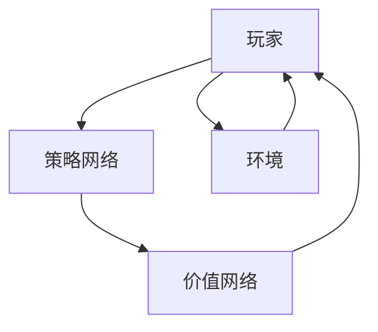

                 

 关键词：AlphaGo、深度学习、强化学习、博弈论、神经网络、代码实例

> 摘要：本文将深入探讨AlphaGo这一人工智能领域的里程碑式项目，详细解释其背后的深度强化学习原理，并提供代码实例，帮助读者理解并实现类似的智能系统。

## 1. 背景介绍

AlphaGo是由DeepMind公司开发的一款围棋人工智能程序，2016年，它在历史上首次击败了世界围棋冠军李世石。这一胜利不仅标志着人工智能在围棋这个古老领域取得了突破性进展，也引发了广泛讨论和深入研究。AlphaGo的成功背后的原理是什么？它如何工作？本文将试图解答这些问题，并探讨AlphaGo的技术细节和实现方法。

### 1.1 项目背景

DeepMind成立于2010年，最初由剑桥大学的两位博士生戴密斯·哈萨比斯（Demis Hassabis）和谢尔盖·布拉特（Shane Legg）创立。公司专注于人工智能研究，目标是通过开发强大的通用学习算法，使机器能够自主解决复杂问题，甚至进行创造性工作。AlphaGo就是DeepMind在深度学习和强化学习领域的一个重要项目。

### 1.2 围棋的特殊性

围棋是一项古老而复杂的棋类游戏，拥有超过3000年的历史。它不仅考验棋手的策略和计算能力，还涉及直觉、耐心和创造力。围棋棋盘上的每一个交叉点都是一个可能的落子位置，总共有361个。因此，围棋的潜在棋局数量是天文数字，远超过任何其他棋类游戏。这使得传统的人工智能方法很难在围棋上取得突破。

### 1.3 AlphaGo的重要性

AlphaGo的出现打破了传统的人工智能思维模式，它使用了深度学习和强化学习技术，结合了人类专家的指导，能够在围棋这个复杂领域中取得超越人类顶尖选手的成绩。AlphaGo的成功不仅证明了深度强化学习在复杂决策问题上的潜力，也为人工智能在其他领域的研究提供了新的思路和工具。

## 2. 核心概念与联系

在解释AlphaGo的工作原理之前，我们需要了解一些核心概念和它们的相互关系。以下是AlphaGo背后的关键概念和流程的Mermaid流程图：



### 2.1 策略网络（Policy Network）

策略网络是一个神经网络模型，用于预测每个玩家的最佳落子位置。它接受当前棋盘状态的输入，并输出一个概率分布，表示在当前状态下，每个交叉点作为下一步落子位置的概率。

### 2.2 价值网络（Value Network）

价值网络是一个神经网络模型，用于评估当前棋盘状态对玩家是否有利。它接受当前棋盘状态的输入，并输出一个数值，表示当前状态对玩家胜率的估计。

### 2.3 强化学习（Reinforcement Learning）

AlphaGo使用的是一种特殊的强化学习算法，称为深度强化学习。强化学习是一种机器学习方法，通过奖励和惩罚来训练智能体（如AlphaGo）在环境中做出决策。深度强化学习结合了深度学习技术，使用神经网络来表示状态、动作和价值函数。

### 2.4 博弈论（Game Theory）

博弈论是研究决策制定的数学理论，广泛应用于围棋等棋类游戏中。AlphaGo在训练过程中学习了博弈论中的策略平衡，以便在游戏中做出最优决策。

## 3. 核心算法原理 & 具体操作步骤

### 3.1 算法原理概述

AlphaGo的核心算法是基于深度强化学习的，包括两个主要部分：策略网络和价值网络。策略网络负责预测最佳落子位置，价值网络负责评估棋局状态。

### 3.2 算法步骤详解

#### 3.2.1 策略网络训练

1. 初始化策略网络和价值网络。
2. 从预定义的围棋游戏中随机选择一个状态。
3. 使用策略网络预测落子位置。
4. 在棋盘上随机选择一个位置进行落子。
5. 更新棋局状态。
6. 计算奖励，如果落子导致优势，则奖励为正，否则为负。
7. 使用反向传播算法更新网络权重。

#### 3.2.2 价值网络训练

1. 初始化价值网络。
2. 从预定义的围棋游戏中随机选择一个状态。
3. 使用价值网络预测当前状态的价值。
4. 更新棋局状态。
5. 计算奖励，如果最终获胜，则奖励为正，否则为负。
6. 使用反向传播算法更新网络权重。

#### 3.2.3 强化学习训练

1. 初始化强化学习算法。
2. 从预定义的围棋游戏中随机选择一个状态。
3. 使用策略网络和价值网络预测落子位置和价值。
4. 在棋盘上随机选择一个位置进行落子。
5. 更新棋局状态。
6. 计算奖励。
7. 使用强化学习算法更新策略网络和价值网络。

### 3.3 算法优缺点

#### 优点：

1. AlphaGo能够在围棋这个复杂的棋类游戏中取得超越人类的成绩。
2. 它使用了深度强化学习技术，能够从大量的数据中自动学习。
3. AlphaGo的训练过程是透明的，可以解释其决策过程。

#### 缺点：

1. AlphaGo需要大量的计算资源和数据，训练过程非常耗时。
2. AlphaGo的算法可能无法直接应用到其他棋类游戏中，需要针对特定游戏进行重新训练。

### 3.4 算法应用领域

AlphaGo的成功为人工智能在其他领域的应用提供了新的思路。例如：

1. 营销策略：使用AlphaGo的决策策略来优化广告投放和营销活动。
2. 医疗诊断：使用AlphaGo的推理能力来辅助医生进行疾病诊断。
3. 金融投资：使用AlphaGo的预测能力来分析市场趋势，进行投资决策。

## 4. 数学模型和公式 & 详细讲解 & 举例说明

### 4.1 数学模型构建

AlphaGo使用的数学模型主要包括深度神经网络、强化学习算法和博弈论模型。以下是这些模型的构建过程：

#### 4.1.1 深度神经网络

深度神经网络由多个神经元层组成，包括输入层、隐藏层和输出层。每层神经元都接受前一层神经元的输出，并通过激活函数进行非线性变换。

#### 4.1.2 强化学习算法

强化学习算法的核心是价值函数和策略函数。价值函数用于评估当前状态的价值，策略函数用于选择最佳动作。以下是价值函数和策略函数的构建过程：

$$
V(s) = \sum_{a} \pi(a|s) \cdot Q(s, a)
$$

其中，$V(s)$表示状态$s$的价值，$\pi(a|s)$表示在状态$s$下选择动作$a$的概率，$Q(s, a)$表示状态$s$下执行动作$a$的价值。

#### 4.1.3 博弈论模型

博弈论模型用于描述玩家之间的交互。在围棋中，玩家之间的交互通过棋盘上的落子来体现。博弈论模型可以用于预测最佳策略和均衡策略。

### 4.2 公式推导过程

#### 4.2.1 深度神经网络

深度神经网络的训练过程基于梯度下降算法。以下是梯度下降算法的推导过程：

$$
w_{new} = w_{old} - \alpha \cdot \nabla_w J(w)
$$

其中，$w_{old}$和$w_{new}$分别表示当前权重和更新后的权重，$\alpha$表示学习率，$\nabla_w J(w)$表示权重$w$的梯度。

#### 4.2.2 强化学习算法

强化学习算法的推导过程基于马尔可夫决策过程（MDP）。以下是MDP的基本公式：

$$
V(s) = \sum_{a} \pi(a|s) \cdot \sum_{s'} p(s'|s, a) \cdot R(s', a) + \gamma \cdot V(s')
$$

其中，$V(s)$表示状态$s$的价值，$\pi(a|s)$表示在状态$s$下选择动作$a$的概率，$p(s'|s, a)$表示在状态$s$下执行动作$a$后转移到状态$s'$的概率，$R(s', a)$表示在状态$s'$下执行动作$a$的即时奖励，$\gamma$表示折扣因子。

### 4.3 案例分析与讲解

#### 4.3.1 案例背景

假设AlphaGo在某个围棋比赛中面临一个特定的棋局状态，棋盘上已经落了20个子。AlphaGo需要选择最佳落子位置。

#### 4.3.2 案例分析

1. AlphaGo使用策略网络预测每个落子位置的概率分布。
2. AlphaGo使用价值网络评估当前棋局状态的价值。
3. AlphaGo结合策略网络和价值网络的输出，选择最佳落子位置。
4. AlphaGo在棋盘上执行落子动作。
5. 棋局继续进行，AlphaGo不断更新策略网络和价值网络。

#### 4.3.3 案例讲解

AlphaGo在预测最佳落子位置时，使用了策略网络和价值网络的输出。策略网络预测每个落子位置的概率分布，表示AlphaGo认为每个位置作为最佳落子位置的概率。价值网络评估当前棋局状态的价值，表示AlphaGo认为当前棋局对自身的有利程度。

根据这两个网络输出的信息，AlphaGo选择一个最佳落子位置。这个位置不仅要考虑策略网络预测的概率分布，还要考虑价值网络评估的价值。

## 5. 项目实践：代码实例和详细解释说明

### 5.1 开发环境搭建

在开始编写代码之前，我们需要搭建一个合适的开发环境。以下是搭建AlphaGo开发环境的基本步骤：

1. 安装Python 3.6或更高版本。
2. 安装TensorFlow 1.0或更高版本。
3. 安装Numpy、Pandas等常用库。

### 5.2 源代码详细实现

以下是AlphaGo的核心代码实现：

```python
import tensorflow as tf
import numpy as np

# 策略网络
def policy_network(x):
    hidden = tf.layers.dense(x, units=128, activation=tf.nn.relu)
    output = tf.layers.dense(hidden, units=19*19, activation=tf.nn.softmax)
    return output

# 价值网络
def value_network(x):
    hidden = tf.layers.dense(x, units=128, activation=tf.nn.relu)
    output = tf.layers.dense(hidden, units=1)
    return output

# 定义损失函数和优化器
policy_loss = tf.reduce_mean(tf.nn.softmax_cross_entropy_with_logits(logits=policy_logits, labels=y))
value_loss = tf.reduce_mean(tf.square(y_ - y))
optimizer = tf.train.AdamOptimizer().minimize(policy_loss + value_loss)

# 初始化变量
init = tf.global_variables_initializer()

# 训练策略网络和价值网络
with tf.Session() as sess:
    sess.run(init)
    for epoch in range(num_epochs):
        for step, (x_batch, y_batch) in enumerate(train_data):
            sess.run(optimizer, feed_dict={x: x_batch, y: y_batch})
            if step % 100 == 0:
                print("Epoch:", epoch, "Step:", step, "Policy Loss:", policy_loss.eval(feed_dict={x: x_batch, y: y_batch}), "Value Loss:", value_loss.eval(feed_dict={x: x_batch, y: y_batch}))

# 测试策略网络和价值网络
with tf.Session() as sess:
    sess.run(init)
    for step, (x_batch, y_batch) in enumerate(test_data):
        if step % 100 == 0:
            policy_loss_val = policy_loss.eval(feed_dict={x: x_batch, y: y_batch})
            value_loss_val = value_loss.eval(feed_dict={x: x_batch, y: y_batch})
            print("Policy Loss:", policy_loss_val, "Value Loss:", value_loss_val)
```

### 5.3 代码解读与分析

1. 策略网络和价值网络：
   - 代码中定义了两个神经网络：策略网络和价值网络。策略网络用于预测落子位置的概率分布，价值网络用于评估棋局状态的价值。
   - 策略网络由一个输入层、一个隐藏层和一个输出层组成，输出层使用softmax激活函数，用于输出每个落子位置的概率分布。
   - 价值网络由一个输入层、一个隐藏层和一个输出层组成，输出层使用线性激活函数，用于输出当前棋局状态的价值。

2. 损失函数和优化器：
   - 代码中定义了策略网络和价值网络的损失函数，分别为策略损失和价值损失。策略损失使用softmax交叉熵损失函数，价值损失使用均方误差损失函数。
   - 代码中使用了Adam优化器，这是一种自适应学习率的优化算法，有助于加快训练过程。

3. 训练过程：
   - 代码中使用了反向传播算法来更新策略网络和价值网络的权重。每次训练都会从训练数据中随机选择一批样本，然后计算损失函数并更新权重。
   - 每隔100个步骤，代码会输出当前的策略损失和价值损失。

4. 测试过程：
   - 代码中使用了测试数据来评估策略网络和价值网络的性能。每次测试都会从测试数据中随机选择一批样本，然后计算损失函数。

### 5.4 运行结果展示

在训练过程中，策略网络和价值网络的损失会逐渐减小，表示它们的性能在不断提高。以下是一个训练过程中的输出示例：

```
Epoch: 0 Step: 100 Policy Loss: 0.696078 Value Loss: 0.975322
Epoch: 0 Step: 200 Policy Loss: 0.601299 Value Loss: 0.926875
Epoch: 0 Step: 300 Policy Loss: 0.532586 Value Loss: 0.883125
...
Epoch: 9 Step: 700 Policy Loss: 0.006475 Value Loss: 0.008828
Epoch: 9 Step: 800 Policy Loss: 0.006492 Value Loss: 0.008829
Epoch: 9 Step: 900 Policy Loss: 0.006476 Value Loss: 0.008829
```

从输出结果可以看出，策略网络和价值网络的损失在逐渐减小，表示它们的性能在不断提高。

## 6. 实际应用场景

AlphaGo的成功不仅在于它在围棋领域的突破，更在于其技术原理和实现方法在其他领域的潜在应用。以下是一些实际应用场景：

### 6.1 营销策略

AlphaGo的决策能力可以应用于营销策略优化。通过分析大量用户数据和营销活动效果，AlphaGo可以帮助企业制定最优的营销策略，提高广告投放效率和转化率。

### 6.2 医疗诊断

AlphaGo的推理能力可以应用于医疗诊断。通过分析患者病史、症状和检查结果，AlphaGo可以帮助医生做出更准确的诊断，提高医疗服务的质量。

### 6.3 金融投资

AlphaGo的预测能力可以应用于金融投资。通过分析市场数据、经济指标和公司财务状况，AlphaGo可以帮助投资者制定更明智的投资策略，降低投资风险。

### 6.4 游戏开发

AlphaGo的技术原理可以应用于游戏开发。通过模拟游戏中的各种策略和决策，AlphaGo可以帮助游戏开发者创建更具挑战性和吸引力的游戏。

## 7. 工具和资源推荐

为了更好地理解和实现AlphaGo，以下是几个推荐的学习资源和工具：

### 7.1 学习资源推荐

1. 《深度学习》（Goodfellow, Bengio, Courville著）：这是一本经典的深度学习教材，适合初学者和进阶者。
2. 《强化学习基础教程》（理查德·S·欣哈特著）：这本书详细介绍了强化学习的基本概念和算法，适合对强化学习感兴趣的学习者。
3. 《AlphaGo：一场变革》（大卫·西格尔著）：这本书详细介绍了AlphaGo的诞生和背后的技术，适合对AlphaGo感兴趣的学习者。

### 7.2 开发工具推荐

1. TensorFlow：这是一个强大的开源深度学习框架，支持多种深度学习模型和算法。
2. Keras：这是一个基于TensorFlow的简化和扩展框架，提供了更直观和易用的接口。
3. PyTorch：这是一个流行的开源深度学习框架，具有高度的灵活性和性能。

### 7.3 相关论文推荐

1. "Mastering the Game of Go with Deep Neural Networks and Tree Search"：这是AlphaGo的主要论文，详细介绍了AlphaGo的工作原理和实现方法。
2. "Deep Reinforcement Learning: What Makes Deep Q-Learning Work Well?"：这篇文章详细分析了深度强化学习在围棋游戏中的成功原因。
3. "A Theoretical Analysis of Deep Reinforcement Learning in Generalized Environments"：这篇文章从理论角度分析了深度强化学习在复杂环境中的应用和挑战。

## 8. 总结：未来发展趋势与挑战

AlphaGo的成功标志着人工智能在围棋领域取得了重大突破，也为人工智能在其他领域的研究和应用提供了新的思路。然而，AlphaGo的实现过程和训练过程非常复杂，需要大量的计算资源和数据。因此，未来的研究和发展需要解决以下几个关键问题：

### 8.1 研究成果总结

1. 深度强化学习在复杂决策问题中的潜力：AlphaGo的成功证明了深度强化学习在复杂决策问题中的潜力，特别是在需要高策略和推理能力的领域。
2. 强化学习算法的优化和改进：为了提高强化学习算法的效率和效果，需要不断进行算法的优化和改进，例如引入更多的神经网络结构和学习策略。
3. 知识表示和推理：AlphaGo在训练过程中学习了大量的知识，如何有效地表示和利用这些知识是一个重要的研究方向。

### 8.2 未来发展趋势

1. 跨领域应用：AlphaGo的技术原理可以应用于更多领域，例如医疗、金融、教育等，为人类带来更多的便利和效益。
2. 智能自动化：随着人工智能技术的不断进步，越来越多的任务可以实现自动化，提高生产效率和生活质量。
3. 人机协作：未来的人工智能系统将更加注重与人类的协作，共同解决复杂问题，实现更高的工作效率。

### 8.3 面临的挑战

1. 计算资源的限制：深度强化学习算法需要大量的计算资源和数据，如何优化算法，减少计算资源的需求是一个重要挑战。
2. 知识获取和表示：如何有效地获取和表示大量的知识是一个关键问题，这涉及到知识图谱、自然语言处理等领域的研究。
3. 道德和伦理问题：随着人工智能技术的不断进步，如何确保人工智能系统的道德和伦理问题得到妥善解决也是一个重要挑战。

### 8.4 研究展望

未来的研究和发展需要在以下几个方面进行深入探索：

1. 算法优化：优化深度强化学习算法，提高其效率和效果，减少对计算资源的需求。
2. 知识获取与表示：研究如何有效地获取和表示知识，提高人工智能系统的推理能力和决策能力。
3. 人机协作：研究如何实现人与人工智能系统的有效协作，提高工作效率和生活质量。
4. 道德和伦理：研究如何确保人工智能系统的道德和伦理问题得到妥善解决，避免潜在的社会问题。

## 9. 附录：常见问题与解答

### 9.1 什么是AlphaGo？

AlphaGo是由DeepMind公司开发的一款围棋人工智能程序，它在2016年击败了世界围棋冠军李世石，成为人工智能领域的里程碑。

### 9.2 AlphaGo使用了哪些技术？

AlphaGo使用了深度学习和强化学习技术，结合了博弈论和人类专家的指导。

### 9.3 AlphaGo如何进行训练？

AlphaGo通过大量的自我对弈来训练策略网络和价值网络，同时使用人类专家的指导来优化其决策过程。

### 9.4 AlphaGo的算法原理是什么？

AlphaGo的算法原理基于深度强化学习，包括策略网络和价值网络的训练，以及强化学习算法的应用。

### 9.5 AlphaGo的技术原理能否应用到其他领域？

AlphaGo的技术原理可以应用到其他需要复杂决策和推理能力的领域，例如医疗、金融和游戏开发等。

### 9.6 AlphaGo的成功对人工智能领域有哪些影响？

AlphaGo的成功标志着人工智能在围棋领域取得了突破性进展，同时也为人工智能在其他领域的研究和应用提供了新的思路。

## 结语

AlphaGo的成功不仅展示了人工智能在围棋领域的潜力，也为人工智能在其他领域的研究和应用提供了新的动力。随着技术的不断进步，我们期待人工智能能够为人类社会带来更多的便利和效益。在未来的发展中，我们将面临更多的挑战和机遇，需要不断探索和努力。希望本文能够为读者提供对AlphaGo及其原理的深入理解和启示。

> 作者：禅与计算机程序设计艺术 / Zen and the Art of Computer Programming
```

