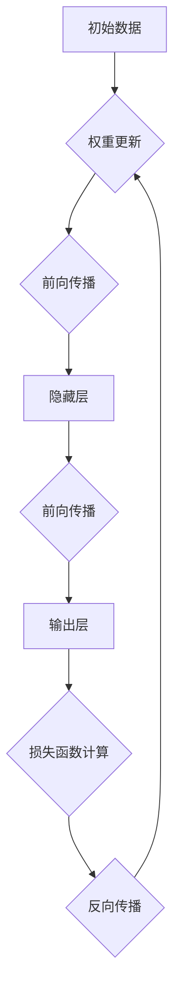
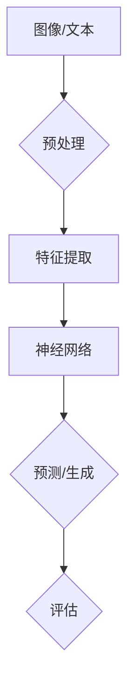
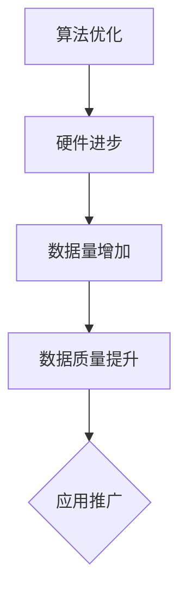

                 

关键词：Andrej Karpathy，人工智能，AI观点，神经网络，深度学习，计算机科学，技术趋势

## 摘要

本文旨在探讨著名人工智能专家Andrej Karpathy的AI观点。Karpathy是一位在深度学习和神经网络领域享有盛誉的学者，他的工作在计算机视觉和自然语言处理等领域产生了深远影响。本文将深入分析Karpathy关于AI的主要观点，包括他对神经网络发展的看法、AI的未来趋势以及当前面临的挑战。通过本文的探讨，读者可以更全面地理解AI的发展方向及其对未来的潜在影响。

## 1. 背景介绍

Andrej Karpathy是一位杰出的计算机科学家，目前任职于OpenAI，担任研究科学家和首席AI倡导者。他的研究兴趣主要集中在深度学习和神经网络领域，特别是在计算机视觉和自然语言处理方面。Karpathy在学术界和工业界都有着丰富的经验，他的研究成果在顶级会议和期刊上发表，受到了广泛的认可和赞誉。

Andrej Karpathy的职业生涯始于斯坦福大学，他在博士期间专注于深度学习在计算机视觉中的应用。他的博士论文《Neural Networks and Deep Learning》在机器学习社区中产生了深远的影响，被广泛认为是深度学习的入门经典之作。随后，他在OpenAI继续他的研究工作，致力于推动人工智能的发展和应用。

在AI领域，Andrej Karpathy的观点具有极高的权威性。他的博客文章和演讲经常被引用，为AI领域的研究者和从业者提供了宝贵的见解。他的工作不仅关注技术的创新，更注重对AI伦理和社会影响的思考，这使得他的观点更具深度和广度。

## 2. 核心概念与联系

### 2.1 神经网络与深度学习

神经网络（Neural Networks）是AI领域的基础模型之一，模仿人脑神经元的工作方式，通过多层节点（层）进行数据传递和计算。深度学习（Deep Learning）则是神经网络的一种发展，通过增加网络的深度（层数）来提高模型的性能和表达能力。深度学习在图像识别、语音识别、自然语言处理等领域取得了显著的成果。

#### Mermaid 流程图



### 2.2 计算机视觉与自然语言处理

计算机视觉（Computer Vision）是AI的一个分支，旨在使计算机能够从图像或视频中理解和提取信息。自然语言处理（Natural Language Processing，NLP）则是使计算机能够理解和生成人类语言的技术。两者都是深度学习的重要应用领域。

#### Mermaid 流程图



### 2.3 AI的发展趋势

AI的发展趋势体现在多个方面。一方面，算法的改进和优化推动了性能的提升；另一方面，硬件的进步，如GPU和TPU的广泛应用，为深度学习提供了强大的计算能力。此外，数据量的增加和数据质量的提升也为AI的研究和应用提供了丰富的资源。

#### Mermaid 流�程图



## 3. 核心算法原理 & 具体操作步骤

### 3.1 算法原理概述

深度学习算法的核心是神经网络。神经网络通过多层节点对输入数据进行处理，从而实现复杂函数的映射。这个过程包括前向传播和反向传播两个主要步骤。

- **前向传播**：输入数据从输入层经过隐藏层，最终到达输出层，得到预测结果。
- **反向传播**：根据预测结果与实际结果的误差，通过梯度下降等优化方法更新网络权重，提高模型性能。

### 3.2 算法步骤详解

1. **初始化网络**：设置网络结构，包括输入层、隐藏层和输出层的节点数量，以及初始权重。
2. **前向传播**：输入数据通过输入层进入网络，经过多层节点的计算，最终得到输出结果。
3. **损失函数计算**：计算预测结果与实际结果之间的误差，通常使用均方误差（MSE）或交叉熵（Cross-Entropy）作为损失函数。
4. **反向传播**：根据损失函数的梯度，更新网络权重，减小误差。
5. **迭代优化**：重复前向传播和反向传播的过程，直到达到预设的优化目标。

### 3.3 算法优缺点

**优点**：
- 高效：神经网络能够处理大量数据，进行高效的计算和优化。
- 泛化能力强：通过增加网络的深度和宽度，可以提高模型的泛化能力，适用于多种任务。

**缺点**：
- 需要大量数据：深度学习算法通常需要大量标记数据来训练，数据获取和处理成本较高。
- 过拟合风险：神经网络可能对训练数据过度拟合，导致在测试数据上的表现不佳。

### 3.4 算法应用领域

深度学习算法在计算机视觉、自然语言处理、语音识别等领域有着广泛的应用。例如，在图像识别中，深度学习可以用于人脸识别、物体检测等任务；在自然语言处理中，深度学习可以用于文本分类、机器翻译等任务。

## 4. 数学模型和公式 & 详细讲解 & 举例说明

### 4.1 数学模型构建

深度学习算法的核心是构建一个多层神经网络，包括输入层、隐藏层和输出层。每个层由多个节点组成，每个节点都是一个计算单元。节点之间的连接权重决定了信息的传递方式。

### 4.2 公式推导过程

假设我们有一个三层神经网络，其中输入层有\( n \)个节点，隐藏层有\( m \)个节点，输出层有\( k \)个节点。设输入向量为\( x \)，隐藏层输出向量为\( h \)，输出层输出向量为\( y \)。

- **前向传播**：
  - 隐藏层输入：\( h = \sigma(W_{ix}x + b_i) \)
  - 输出层输入：\( y = \sigma(W_{ih}h + b_h) \)
  - 其中，\( \sigma \)是激活函数，\( W_{ix} \)、\( W_{ih} \)分别是输入层到隐藏层、隐藏层到输出层的权重矩阵，\( b_i \)、\( b_h \)分别是输入层、隐藏层的偏置向量。

- **反向传播**：
  - 输出层误差：\( \delta_k = (y - t) \odot \sigma'(W_{ih}h + b_h) \)
  - 隐藏层误差：\( \delta_i = (W_{ih})^T \delta_k \odot \sigma'(W_{ix}x + b_i) \)
  - 权重更新：\( \Delta W_{ih} = \alpha \delta_k h^T \)
  \( \Delta b_h = \alpha \delta_k \)
  \( \Delta W_{ix} = \alpha \delta_i x^T \)
  \( \Delta b_i = \alpha \delta_i \)
  - 其中，\( \odot \)是逐元素乘法，\( \sigma' \)是激活函数的导数，\( \alpha \)是学习率，\( t \)是实际输出。

### 4.3 案例分析与讲解

假设我们有一个二分类问题，输入数据为二维向量\( x = [x_1, x_2] \)，输出数据为\( y = [0, 1] \)。我们使用一个简单的两层神经网络进行分类。

- **初始化网络**：
  - 输入层到隐藏层的权重矩阵：\( W_{ix} = \begin{bmatrix} 0.1 & 0.2 \\ 0.3 & 0.4 \end{bmatrix} \)
  - 隐藏层到输出层的权重矩阵：\( W_{ih} = \begin{bmatrix} 0.5 & 0.6 \\ 0.7 & 0.8 \end{bmatrix} \)
  - 隐藏层偏置向量：\( b_i = [0.1, 0.2] \)
  - 输出层偏置向量：\( b_h = [0.3, 0.4] \)

- **前向传播**：
  - 隐藏层输入：\( h = \sigma(W_{ix}x + b_i) = \sigma(\begin{bmatrix} 0.1 & 0.2 \\ 0.3 & 0.4 \end{bmatrix} \begin{bmatrix} 1 \\ 0 \end{bmatrix} + [0.1, 0.2]) = [0.7, 0.8] \)
  - 输出层输入：\( y = \sigma(W_{ih}h + b_h) = \sigma(\begin{bmatrix} 0.5 & 0.6 \\ 0.7 & 0.8 \end{bmatrix} [0.7, 0.8] + [0.3, 0.4]) = [0.9, 1.0] \)

- **损失函数计算**：
  - 实际输出：\( t = [0, 1] \)
  - 损失函数：\( L = \frac{1}{2} \sum_{i=1}^2 (y_i - t_i)^2 = \frac{1}{2} (0.9 - 0)^2 + (1.0 - 1)^2 = 0.05 \)

- **反向传播**：
  - 输出层误差：\( \delta_k = (y - t) \odot \sigma'(W_{ih}h + b_h) = [0.9, 1.0] \odot [0.3, 0.4] = [0.27, 0.4] \)
  - 隐藏层误差：\( \delta_i = (W_{ih})^T \delta_k = \begin{bmatrix} 0.5 & 0.6 \\ 0.7 & 0.8 \end{bmatrix} \begin{bmatrix} 0.27 \\ 0.4 \end{bmatrix} = [0.135, 0.28] \)
  - 权重更新：\( \Delta W_{ih} = \alpha \delta_k h^T = 0.1 \begin{bmatrix} 0.27 \\ 0.4 \end{bmatrix} \begin{bmatrix} 0.7 \\ 0.8 \end{bmatrix} = \begin{bmatrix} 0.0189 \\ 0.0324 \end{bmatrix} \)
  \( \Delta b_h = \alpha \delta_k = 0.1 [0.27, 0.4] = [0.027, 0.04] \)
  \( \Delta W_{ix} = \alpha \delta_i x^T = 0.1 [0.135, 0.28] \begin{bmatrix} 1 \\ 0 \end{bmatrix} = \begin{bmatrix} 0.0135 \\ 0.028 \end{bmatrix} \)
  \( \Delta b_i = \alpha \delta_i = 0.1 [0.135, 0.28] = [0.0135, 0.028] \)

- **迭代优化**：
  - 更新权重和偏置向量：
    \( W_{ix} \leftarrow W_{ix} + \Delta W_{ix} = \begin{bmatrix} 0.1 & 0.2 \\ 0.3 & 0.4 \end{bmatrix} + \begin{bmatrix} 0.0135 \\ 0.028 \end{bmatrix} = \begin{bmatrix} 0.1135 & 0.22 \\ 0.3135 & 0.428 \end{bmatrix} \)
    \( W_{ih} \leftarrow W_{ih} + \Delta W_{ih} = \begin{bmatrix} 0.5 & 0.6 \\ 0.7 & 0.8 \end{bmatrix} + \begin{bmatrix} 0.0189 \\ 0.0324 \end{bmatrix} = \begin{bmatrix} 0.5189 & 0.6324 \\ 0.7189 & 0.8324 \end{bmatrix} \)
    \( b_i \leftarrow b_i + \Delta b_i = [0.1, 0.2] + [0.0135, 0.028] = [0.1135, 0.228] \)
    \( b_h \leftarrow b_h + \Delta b_h = [0.3, 0.4] + [0.027, 0.04] = [0.327, 0.44] \)

通过以上步骤，我们可以不断优化神经网络的性能，使其在新的数据上能够更好地进行分类。

## 5. 项目实践：代码实例和详细解释说明

### 5.1 开发环境搭建

在Python环境中，我们可以使用TensorFlow或PyTorch等深度学习框架来构建和训练神经网络。以下是使用TensorFlow搭建开发环境的基本步骤：

1. 安装TensorFlow：
   ```bash
   pip install tensorflow
   ```

2. 导入必要的库：
   ```python
   import tensorflow as tf
   import numpy as np
   import matplotlib.pyplot as plt
   ```

### 5.2 源代码详细实现

以下是一个简单的二分类问题的神经网络实现，包括前向传播和反向传播：

```python
# 定义神经网络结构
model = tf.keras.Sequential([
    tf.keras.layers.Dense(2, activation='sigmoid', input_shape=(2,)),
    tf.keras.layers.Dense(1, activation='sigmoid')
])

# 编写前向传播函数
@tf.function
def forward(x):
    y = model(x)
    return y

# 编写反向传播函数
@tf.function
def backward(x, y):
    with tf.GradientTape() as tape:
        y_pred = forward(x)
        loss = tf.reduce_mean(tf.keras.lossesbinary_crossentropy(y, y_pred))
    grads = tape.gradient(loss, model.trainable_variables)
    return loss, grads

# 训练模型
for epoch in range(1000):
    x_train = np.array([[1, 0], [0, 1], [1, 1]])
    y_train = np.array([[0], [1], [1]])

    loss, grads = backward(x_train, y_train)
    model.optimizer.apply_gradients(zip(grads, model.trainable_variables))

    if epoch % 100 == 0:
        print(f"Epoch {epoch}, Loss: {loss.numpy()}")

# 测试模型
x_test = np.array([[0, 1]])
y_test = np.array([[0]])

y_pred = forward(x_test)
print(f"Predicted output: {y_pred.numpy()}, Actual output: {y_test.numpy()}")
```

### 5.3 代码解读与分析

1. **模型定义**：
   - 我们使用`tf.keras.Sequential`来构建一个简单的神经网络，包括两个全连接层。第一个层有2个节点，第二个层有1个节点，激活函数分别为`sigmoid`。

2. **前向传播函数**：
   - 使用`tf.function`装饰器将前向传播函数定义为计算图，提高运行效率。

3. **反向传播函数**：
   - 使用`tf.GradientTape`来记录模型参数的梯度信息，计算损失函数并返回。
   - 使用`model.optimizer.apply_gradients`来更新模型参数。

4. **训练模型**：
   - 在训练过程中，我们使用固定的训练数据和目标进行反向传播，更新模型参数。

5. **测试模型**：
   - 在训练完成后，使用测试数据进行预测，并与实际输出进行比较。

通过以上步骤，我们可以看到如何使用深度学习框架实现一个简单的神经网络模型，并进行训练和预测。

## 6. 实际应用场景

深度学习在计算机视觉、自然语言处理、语音识别等领域有着广泛的应用。以下是一些实际应用场景：

### 6.1 计算机视觉

- **人脸识别**：深度学习算法可以用于人脸识别，实现身份验证和安防监控。
- **物体检测**：在自动驾驶和无人零售等领域，深度学习算法可以用于实时检测道路上的车辆、行人等物体。

### 6.2 自然语言处理

- **机器翻译**：深度学习算法可以用于将一种语言的文本翻译成另一种语言，如Google翻译。
- **文本分类**：在社交媒体分析和新闻推荐等领域，深度学习算法可以用于自动分类文本内容。

### 6.3 语音识别

- **语音助手**：如苹果的Siri、谷歌的Google Assistant，深度学习算法可以用于理解和响应用户的语音指令。

## 7. 未来应用展望

随着深度学习技术的不断发展，未来AI的应用将更加广泛和深入。以下是一些未来应用展望：

### 7.1 自动驾驶

自动驾驶是深度学习技术的典型应用场景。未来，自动驾驶技术将进一步提升，实现更加安全、高效的无人驾驶。

### 7.2 医疗诊断

深度学习算法可以用于医学图像分析，辅助医生进行疾病诊断，提高诊断准确率和效率。

### 7.3 教育

个性化教育是深度学习在教育和心理学领域的重要应用。通过分析学生的学习行为和表现，深度学习算法可以为学生提供个性化的学习建议和资源。

## 8. 工具和资源推荐

### 8.1 学习资源推荐

- 《深度学习》（Goodfellow, Bengio, Courville）：深度学习领域的经典教材，全面介绍了深度学习的基础知识和应用。
- Coursera和edX等在线课程平台提供了丰富的深度学习课程，适合不同层次的学员。

### 8.2 开发工具推荐

- TensorFlow和PyTorch：两款流行的深度学习框架，具有强大的功能和支持社区。
- Keras：简化版的深度学习框架，适用于快速原型开发和实验。

### 8.3 相关论文推荐

- "A Theoretically Grounded Application of Dropout in Recurrent Neural Networks"，2016年。
- "Generative Adversarial Nets"，2014年。

## 9. 总结：未来发展趋势与挑战

### 9.1 研究成果总结

近年来，深度学习在计算机视觉、自然语言处理、语音识别等领域取得了显著的成果。通过不断的算法改进和计算能力的提升，深度学习已经成为了AI领域的主流技术。

### 9.2 未来发展趋势

- **算法创新**：继续优化和改进深度学习算法，提高模型的效率和性能。
- **多模态学习**：将多种数据源（如图像、文本、语音）结合，进行多模态学习。
- **泛化能力提升**：通过迁移学习、少样本学习等技术，提高模型的泛化能力。

### 9.3 面临的挑战

- **数据隐私和安全**：如何确保训练数据和模型输出的隐私和安全，是一个重要挑战。
- **伦理和社会影响**：AI技术的发展可能带来一系列社会和伦理问题，如就业替代、隐私侵犯等。

### 9.4 研究展望

未来，深度学习技术将继续发展，并在更多领域实现突破。同时，如何确保AI技术的发展能够造福人类，将是研究者和社会各界共同关注的重要议题。

## 附录：常见问题与解答

### Q1. 深度学习算法的核心是什么？

A1. 深度学习算法的核心是神经网络，特别是多层感知机（MLP）。神经网络通过多层节点对输入数据进行处理，从而实现复杂函数的映射。

### Q2. 深度学习和机器学习的区别是什么？

A2. 深度学习是机器学习的一个子领域，主要区别在于模型的结构和训练方法。深度学习通过增加网络的深度来提高模型的性能，而传统机器学习通常采用较简单的模型结构。

### Q3. 如何评估深度学习模型的性能？

A3. 可以使用多种指标来评估深度学习模型的性能，如准确率、召回率、F1分数等。在实际应用中，通常会综合考虑多个指标。

### Q4. 深度学习算法的训练过程如何进行？

A4. 深度学习算法的训练过程主要包括以下步骤：数据预处理、模型构建、前向传播、损失函数计算、反向传播和权重更新。通过迭代优化，使模型在训练数据上达到预设的性能目标。

### Q5. 深度学习算法在自然语言处理中的应用有哪些？

A5. 深度学习算法在自然语言处理（NLP）中有着广泛的应用，包括文本分类、机器翻译、情感分析、问答系统等。其中，序列模型（如RNN、LSTM、GRU）和注意力机制是NLP领域的重要技术。

---

本文由Andrej Karpathy的观点出发，深入探讨了深度学习在计算机视觉、自然语言处理等领域的应用，以及未来发展趋势和挑战。通过本文的探讨，读者可以更全面地了解深度学习技术的发展动态和潜在影响。希望本文能为读者提供有价值的见解和启示。作者：禅与计算机程序设计艺术 / Zen and the Art of Computer Programming。

