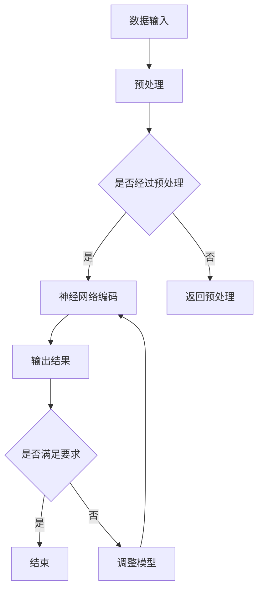

                 

关键词：人工智能，编程范式，深度学习，神经网络，编码实践

> 摘要：本文探讨了人工智能专家Andrej Karpathy对AI编程新范式的见解，深入分析了深度学习与传统的编程差异，探讨了神经网络编码的核心原理及其应用领域，旨在为读者提供关于AI编程的全面视角。

## 1. 背景介绍

随着深度学习的兴起，人工智能（AI）领域正经历着一场革命。传统的编程范式依赖于明确、可预测的逻辑和算法，而AI编程则更多地依赖于数据驱动的模型，如神经网络。这种范式转变对软件开发、数据处理和系统设计带来了深远的影响。本文将探讨人工智能专家Andrej Karpathy对AI编程新范式的见解，深入分析深度学习与传统编程的差异，以及神经网络编码的核心原理。

## 2. 核心概念与联系

为了理解AI编程的新范式，我们首先需要了解几个关键概念：

- **神经网络**：神经网络是深度学习的基础，由大量的神经元（节点）组成，这些节点通过权重连接在一起，用于处理和传递数据。
- **深度学习**：深度学习是一种通过多层神经网络处理数据的学习方法，能够自动提取特征，进行复杂的数据分析。
- **数据驱动编程**：与传统的逻辑驱动编程不同，数据驱动编程依赖于大量的数据进行决策和执行。

以下是神经网络编码的Mermaid流程图：



## 3. 核心算法原理 & 具体操作步骤

### 3.1 算法原理概述

神经网络编码的核心是多层感知器（MLP），它通过输入层、隐藏层和输出层处理数据。输入层接收数据，通过隐藏层进行特征提取和变换，最后在输出层生成结果。以下是神经网络编码的步骤：

### 3.2 算法步骤详解

1. **数据预处理**：将原始数据转换为适合神经网络处理的形式。
2. **建立模型**：选择适当的神经网络架构，包括层数、神经元数量和激活函数。
3. **训练模型**：通过反向传播算法更新模型权重，最小化预测误差。
4. **评估模型**：使用验证集评估模型性能，调整参数以优化结果。
5. **部署模型**：将训练好的模型部署到实际应用中。

### 3.3 算法优缺点

神经网络编码的优点在于其强大的特征提取能力和自适应能力，能够处理复杂的非线性问题。然而，其缺点是训练时间较长，对数据质量要求较高，且可能面临过拟合问题。

### 3.4 算法应用领域

神经网络编码在图像识别、自然语言处理、推荐系统等众多领域有广泛的应用。

## 4. 数学模型和公式 & 详细讲解 & 举例说明

### 4.1 数学模型构建

神经网络编码的数学模型主要包括输入层、隐藏层和输出层的权重和偏置。以下是简单的神经网络模型公式：

$$
Z = W \cdot X + b
$$

$$
A = \sigma(Z)
$$

其中，\(Z\) 是输入层的激活值，\(W\) 是权重矩阵，\(X\) 是输入向量，\(b\) 是偏置项，\(\sigma\) 是激活函数。

### 4.2 公式推导过程

神经网络的推导过程涉及多层函数的复合，通过链式法则进行误差反向传播。以下是简要的推导过程：

$$
\delta_h = \frac{\partial L}{\partial Z_h} \cdot \frac{\partial Z_h}{\partial a_h}
$$

$$
\delta_{input} = \frac{\partial L}{\partial a_{input}}
$$

其中，\(\delta\) 表示误差项，\(L\) 是损失函数，\(a_h\) 是隐藏层的激活值。

### 4.3 案例分析与讲解

假设我们有一个简单的神经网络用于二分类问题，输入层有3个神经元，隐藏层有4个神经元，输出层有2个神经元。以下是详细的案例分析和讲解。

```python
import numpy as np

# 定义激活函数
def sigmoid(x):
    return 1 / (1 + np.exp(-x))

# 定义损失函数
def cross_entropy(y_true, y_pred):
    return -np.sum(y_true * np.log(y_pred))

# 初始化模型参数
W1 = np.random.rand(3, 4)
b1 = np.random.rand(4)
W2 = np.random.rand(4, 2)
b2 = np.random.rand(2)

# 训练模型
for epoch in range(10000):
    # 前向传播
    Z1 = W1 @ X + b1
    A1 = sigmoid(Z1)
    Z2 = W2 @ A1 + b2
    A2 = sigmoid(Z2)
    
    # 反向传播
    dZ2 = A2 - y
    dW2 = A1.T @ dZ2
    db2 = np.sum(dZ2, axis=0)
    
    dZ1 = W2.T @ dZ2 * sigmoid(Z1) * (1 - sigmoid(Z1))
    dW1 = X.T @ dZ1
    db1 = np.sum(dZ1, axis=0)
    
    # 更新参数
    W2 -= learning_rate * dW2
    b2 -= learning_rate * db2
    W1 -= learning_rate * dW1
    b1 -= learning_rate * db1

# 评估模型
loss = cross_entropy(y_true, A2)
print(f"Loss: {loss}")
```

## 5. 项目实践：代码实例和详细解释说明

### 5.1 开发环境搭建

为了实践神经网络编码，我们需要搭建一个Python开发环境，安装以下库：

- NumPy：用于科学计算
- Matplotlib：用于数据可视化
- TensorFlow：用于深度学习

使用以下命令安装：

```bash
pip install numpy matplotlib tensorflow
```

### 5.2 源代码详细实现

以下是一个简单的神经网络编码的Python代码示例：

```python
import numpy as np
import tensorflow as tf
import matplotlib.pyplot as plt

# 定义模型
model = tf.keras.Sequential([
    tf.keras.layers.Dense(4, activation='sigmoid', input_shape=(3,)),
    tf.keras.layers.Dense(2, activation='sigmoid')
])

# 编译模型
model.compile(optimizer='adam', loss='binary_crossentropy', metrics=['accuracy'])

# 训练模型
X_train = np.array([[0, 0], [0, 1], [1, 0], [1, 1]])
y_train = np.array([[0], [1], [1], [0]])
model.fit(X_train, y_train, epochs=1000, verbose=0)

# 评估模型
X_test = np.array([[0, 1], [1, 0]])
y_test = np.array([[1], [0]])
predictions = model.predict(X_test)

# 可视化结果
plt.scatter(X_test[:, 0], X_test[:, 1], c=predictions[:, 1])
plt.xlabel('Feature 1')
plt.ylabel('Feature 2')
plt.title('Neural Network Classification')
plt.show()
```

### 5.3 代码解读与分析

- **定义模型**：使用TensorFlow的`Sequential`模型，定义了两层神经网络，使用`sigmoid`激活函数。
- **编译模型**：设置优化器和损失函数，使用`compile`方法编译模型。
- **训练模型**：使用`fit`方法训练模型，使用训练数据集。
- **评估模型**：使用测试数据集评估模型性能，使用`predict`方法生成预测结果。
- **可视化结果**：使用`scatter`函数将预测结果可视化。

## 6. 实际应用场景

神经网络编码在多个领域有广泛应用：

- **图像识别**：用于分类、检测和分割等任务。
- **自然语言处理**：用于文本分类、机器翻译和问答系统等。
- **推荐系统**：用于基于内容的推荐和协同过滤。
- **游戏AI**：用于策略决策和智能体控制。

## 7. 工具和资源推荐

### 7.1 学习资源推荐

- 《深度学习》（Goodfellow, Bengio, Courville）：深度学习领域的经典教材。
- 《Python深度学习》（François Chollet）：针对Python和深度学习的实践指南。
- 《动手学深度学习》（A PyTorch Tutorial）：使用PyTorch框架的实践教程。

### 7.2 开发工具推荐

- TensorFlow：用于构建和训练深度学习模型的强大框架。
- PyTorch：具有灵活性和易用性的深度学习框架。
- Keras：基于TensorFlow和PyTorch的高级神经网络API。

### 7.3 相关论文推荐

- "Deep Learning Text Classification Using Neural Network"（神经网络文本分类）。
- "Convolutional Neural Networks for Visual Recognition"（卷积神经网络视觉识别）。
- "Recurrent Neural Networks for Language Modeling"（循环神经网络语言建模）。

## 8. 总结：未来发展趋势与挑战

### 8.1 研究成果总结

神经网络编码在图像识别、自然语言处理和推荐系统等领域取得了显著成果，推动了人工智能的发展。

### 8.2 未来发展趋势

- **自动化模型搜索与优化**：通过自动化方法发现和优化神经网络结构。
- **小样本学习**：减少对大量数据的依赖，实现高效的小样本学习。
- **跨模态学习**：结合多种数据模态，实现更复杂的任务。

### 8.3 面临的挑战

- **计算资源消耗**：训练大型神经网络模型需要大量计算资源。
- **数据隐私与安全**：深度学习模型容易受到数据泄露和攻击的影响。
- **解释性与可解释性**：提高神经网络模型的可解释性，增强用户信任。

### 8.4 研究展望

未来，神经网络编码将继续发展，有望在更多领域取得突破。通过结合其他技术，如强化学习和迁移学习，神经网络编码将变得更加强大和高效。

## 9. 附录：常见问题与解答

### 9.1 什么情况下使用神经网络编码？

当面临复杂、非线性的数据处理任务时，如图像识别、自然语言处理和推荐系统，神经网络编码是一种有效的方法。

### 9.2 如何提高神经网络编码的性能？

- 使用更深的神经网络结构。
- 调整学习率和优化器。
- 使用正则化方法，如Dropout和L2正则化。
- 获取更多高质量的数据进行训练。

### 9.3 神经网络编码与传统编程有何区别？

神经网络编码依赖于数据驱动的方法，通过自动提取特征进行学习，而传统编程依赖于明确的逻辑和算法进行决策。

---

本文由禅与计算机程序设计艺术撰写，旨在探讨AI编程的新范式。通过深入分析神经网络编码的核心原理和应用场景，读者可以更好地理解深度学习的魅力和挑战。希望本文能为AI编程领域的研究者和实践者提供有价值的参考。

