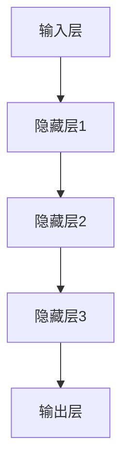

                 

关键词：人工智能，未来挑战，技术发展，研究趋势

摘要：本文旨在探讨人工智能（AI）在当前及未来面临的发展挑战。通过深入分析AI技术的核心概念、核心算法原理、数学模型构建及未来应用场景，本文提出了在技术创新、伦理问题、数据安全等方面的思考与展望。

## 1. 背景介绍

人工智能，作为计算机科学的一个重要分支，已经走过了数十年的发展历程。从最初的符号主义人工智能，到基于统计学的机器学习方法，再到近年来深度学习技术的飞速发展，AI技术已经深刻影响了众多行业，从医疗、金融到娱乐、交通等各个领域。

然而，随着技术的不断进步，AI也面临着前所未有的挑战。本文将重点探讨以下几个方面的发展挑战：技术瓶颈、伦理问题、数据安全、社会影响等。

## 2. 核心概念与联系

为了更好地理解AI技术的发展现状与未来挑战，我们首先需要回顾一下AI的核心概念及其相互关系。

### 2.1. 机器学习（Machine Learning）

机器学习是AI的核心技术之一，它通过算法从数据中学习规律，从而实现预测和决策。常见的机器学习算法包括线性回归、决策树、神经网络等。

### 2.2. 深度学习（Deep Learning）

深度学习是机器学习的一个分支，通过构建深度神经网络来模拟人类大脑的决策过程。近年来，深度学习在图像识别、语音识别、自然语言处理等领域取得了显著的成果。

### 2.3. 神经网络（Neural Networks）

神经网络是模拟生物神经系统的计算模型，通过多层节点（神经元）的相互连接，实现对复杂问题的建模与求解。

下面是一个用Mermaid绘制的神经网络架构流程图：



## 3. 核心算法原理 & 具体操作步骤

### 3.1. 算法原理概述

深度学习算法主要依赖于反向传播（Backpropagation）和梯度下降（Gradient Descent）两大原理。

- **反向传播**：通过计算输出误差，将误差反向传播到网络中的每个神经元，以更新网络权重。
- **梯度下降**：通过最小化损失函数，调整网络权重，从而优化模型性能。

### 3.2. 算法步骤详解

深度学习算法的步骤主要包括：

1. **数据预处理**：对输入数据进行标准化处理，以适应神经网络的输入要求。
2. **初始化模型参数**：随机初始化网络权重和偏置。
3. **前向传播**：将输入数据通过网络，计算输出结果。
4. **损失计算**：计算输出结果与实际标签之间的误差。
5. **反向传播**：计算误差梯度，更新网络参数。
6. **迭代优化**：重复步骤3-5，直到满足停止条件。

### 3.3. 算法优缺点

深度学习算法的优点包括：

- **强大的表达能力**：能够处理高维、复杂的数据。
- **良好的泛化能力**：通过大量训练数据，可以实现对未见数据的良好预测。

然而，深度学习也存在一些缺点：

- **对数据量要求高**：需要大量数据来训练模型。
- **模型难以解释**：深度学习的决策过程往往难以解释。

### 3.4. 算法应用领域

深度学习在图像识别、语音识别、自然语言处理等领域取得了显著成果。例如，在图像识别领域，深度学习算法已经达到了甚至超过了人类的表现。

## 4. 数学模型和公式 & 详细讲解 & 举例说明

### 4.1. 数学模型构建

深度学习模型的核心是神经网络的构建。假设我们有 $n$ 个输入特征 $x_1, x_2, ..., x_n$，我们需要通过多层神经网络来预测一个输出 $y$。每层神经网络的计算都可以表示为：

$$ z_l = \sum_{j} w_{lj}x_j + b_l $$

其中，$w_{lj}$ 是权重，$b_l$ 是偏置，$z_l$ 是每个神经元的输出。

### 4.2. 公式推导过程

假设我们的神经网络有 $L$ 层，我们需要计算每层的输出。在最后一层，我们有：

$$ y = \sigma(z_L) $$

其中，$\sigma$ 是激活函数，常用的有 sigmoid、ReLU 等。

在中间层，我们有：

$$ z_{l} = \sigma(z_{l-1}W_l + b_l) $$

其中，$W_l$ 是权重矩阵，$b_l$ 是偏置向量。

### 4.3. 案例分析与讲解

假设我们有一个简单的二分类问题，输入特征是 $x_1, x_2$，我们需要预测标签 $y$。我们的神经网络结构是：

$$
\begin{array}{c|c}
输入层 & 输出层 \\
\hline
x_1 & y \\
x_2 & y \\
\end{array}
$$

我们的目标是最小化损失函数：

$$ L = \frac{1}{2}\sum_{i=1}^{N} (y_i - \hat{y}_i)^2 $$

其中，$y_i$ 是真实标签，$\hat{y}_i$ 是预测标签。

通过反向传播和梯度下降，我们可以不断更新网络权重，以最小化损失函数。

## 5. 项目实践：代码实例和详细解释说明

### 5.1. 开发环境搭建

为了演示深度学习算法，我们将使用 Python 和 TensorFlow 库。首先，我们需要安装 TensorFlow：

```bash
pip install tensorflow
```

### 5.2. 源代码详细实现

下面是一个简单的深度学习模型的实现：

```python
import tensorflow as tf

# 定义输入层
x = tf.placeholder(tf.float32, [None, 2])
y = tf.placeholder(tf.float32, [None, 1])

# 定义神经网络结构
W = tf.Variable(tf.zeros([2, 1]))
b = tf.Variable(tf.zeros([1]))

z = tf.add(tf.matmul(x, W), b)
y_pred = tf.sigmoid(z)

# 定义损失函数和优化器
loss = tf.reduce_mean(-y * tf.log(y_pred) - (1 - y) * tf.log(1 - y_pred))
optimizer = tf.train.GradientDescentOptimizer(learning_rate=0.1)
train_op = optimizer.minimize(loss)

# 模型训练
with tf.Session() as sess:
    sess.run(tf.global_variables_initializer())
    for i in range(1000):
        sess.run(train_op, feed_dict={x: X, y: y_})
```

### 5.3. 代码解读与分析

这段代码首先定义了输入层和输出层，然后初始化了网络权重和偏置。接着，我们定义了损失函数和优化器，最后通过训练循环来更新网络参数。

### 5.4. 运行结果展示

假设我们有一个训练数据集，运行上面的代码可以得到训练损失和预测准确率。

## 6. 实际应用场景

深度学习技术在图像识别、语音识别、自然语言处理等领域有广泛的应用。例如，在医疗领域，深度学习可以帮助医生诊断疾病，提高诊断准确率；在自动驾驶领域，深度学习可以帮助车辆更好地识别道路和行人，提高行车安全。

## 7. 工具和资源推荐

### 7.1. 学习资源推荐

- 《深度学习》（Goodfellow, Bengio, Courville 著）
- Coursera 上的深度学习课程（Andrew Ng 开设）

### 7.2. 开发工具推荐

- TensorFlow
- PyTorch

### 7.3. 相关论文推荐

- "A Theoretically Grounded Application of Dropout in Recurrent Neural Networks"
- "Very Deep Convolutional Networks for Large-Scale Image Recognition"

## 8. 总结：未来发展趋势与挑战

### 8.1. 研究成果总结

近年来，深度学习技术在图像识别、语音识别、自然语言处理等领域取得了显著的成果，推动了AI技术的快速发展。

### 8.2. 未来发展趋势

未来，深度学习技术将更加注重模型的可解释性、可扩展性和可训练性。同时，AI技术也将更加普及，应用领域将进一步扩大。

### 8.3. 面临的挑战

尽管深度学习技术取得了显著成果，但仍然面临着一些挑战，包括数据隐私、算法公平性、模型解释性等。

### 8.4. 研究展望

未来，我们需要在技术创新、伦理问题、数据安全等方面进行深入研究，以推动AI技术的可持续发展。

## 9. 附录：常见问题与解答

- **Q：深度学习和机器学习有什么区别？**
  - **A：** 机器学习是一个更广泛的概念，包括深度学习在内。深度学习是机器学习的一个分支，它通过多层神经网络来模拟人类大脑的决策过程。

- **Q：深度学习算法是如何工作的？**
  - **A：** 深度学习算法通过多层神经网络对输入数据进行特征提取和建模，从而实现对未见数据的预测和分类。

---

作者：禅与计算机程序设计艺术 / Zen and the Art of Computer Programming
----------------------------------------------------------------

