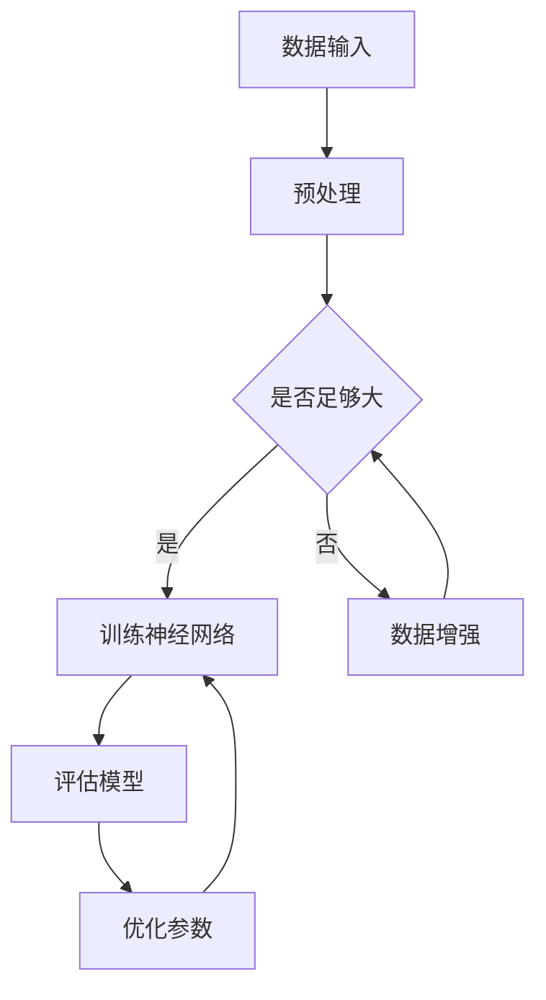

                 

关键词：人工智能，深度学习，神经网络，发展前景，算法，应用领域，挑战与展望

人工智能作为当今科技领域最热门的话题之一，正以前所未有的速度发展。从早期的规则系统到如今的深度学习，人工智能在各个方面都取得了显著的进展。本文旨在探讨人工智能的未来发展方向，重点关注深度学习、神经网络及其他相关技术的现状、挑战以及未来的应用前景。

## 1. 背景介绍

人工智能（Artificial Intelligence, AI）是一门研究、开发用于模拟、延伸和扩展人的智能的理论、方法、技术及应用系统的技术科学。它包括机器学习、计算机视觉、自然语言处理等多个子领域。自20世纪50年代诞生以来，人工智能经历了多次起伏，特别是在21世纪初，随着大数据、计算力和算法的进步，人工智能迎来了新的发展高峰。

深度学习（Deep Learning）是人工智能的一个重要分支，它通过模拟人脑的神经网络结构进行数据分析和模型构建。近年来，深度学习在图像识别、语音识别、自然语言处理等领域取得了显著的成果。神经网络（Neural Networks）作为深度学习的基础，通过多层节点对数据进行逐层抽象和表示，是实现人工智能的关键技术。

## 2. 核心概念与联系

为了更好地理解人工智能的核心概念与联系，我们可以借助Mermaid流程图来展示其基本架构。



这个流程图展示了人工智能的基本工作流程：首先，对输入数据进行预处理，确保数据足够大且合适；然后，使用神经网络进行训练，并对模型进行评估和参数优化。这一过程不断迭代，直至达到满意的性能。

### 2.1 神经网络结构

神经网络由多个层级组成，包括输入层、隐藏层和输出层。每个层级由多个神经元（节点）构成，神经元之间通过权重（连接）相互连接。输入层接收外部数据，隐藏层对数据进行逐层抽象和表示，输出层生成预测结果。例如，在图像识别任务中，输入层可能接收像素值，隐藏层则对图像的特征进行提取和抽象，输出层则生成图像的分类结果。

### 2.2 深度学习算法

深度学习算法主要包括卷积神经网络（Convolutional Neural Networks, CNNs）、循环神经网络（Recurrent Neural Networks, RNNs）和生成对抗网络（Generative Adversarial Networks, GANs）等。每种算法都有其独特的结构和特点，适用于不同的任务和应用场景。

## 3. 核心算法原理 & 具体操作步骤

### 3.1 算法原理概述

深度学习的核心算法原理是基于神经网络的层次化学习机制。首先，通过大量数据对神经网络进行训练，使网络能够自动学习数据的特征表示。然后，利用训练好的模型对新的数据进行预测或分类。具体来说，深度学习算法通过以下步骤进行操作：

1. 数据预处理：对输入数据进行标准化、归一化等处理，确保数据符合网络的输入要求。
2. 网络架构设计：根据任务需求设计神经网络的层数、节点数、激活函数等。
3. 模型训练：通过反向传播算法对网络进行训练，调整网络权重和偏置，使网络能够对训练数据进行准确预测。
4. 模型评估：使用验证集对训练好的模型进行评估，选择性能最优的模型。
5. 模型应用：将训练好的模型应用于新的数据，生成预测结果。

### 3.2 算法步骤详解

1. **数据预处理**

   数据预处理是深度学习的一个重要步骤。首先，对图像、文本、音频等数据进行归一化、标准化等操作，使其在数值范围内均匀分布。然后，对数据进行分割、增广等操作，增加数据多样性，提高模型的泛化能力。

2. **网络架构设计**

   神经网络的设计取决于任务的需求。对于图像识别任务，可以使用卷积神经网络；对于自然语言处理任务，可以使用循环神经网络或变换器模型；对于生成任务，可以使用生成对抗网络等。

3. **模型训练**

   模型训练是深度学习的核心步骤。通过反向传播算法，将训练数据的标签与模型预测结果进行比较，计算损失函数，并根据损失函数的梯度调整网络权重和偏置。这个过程不断迭代，直至网络达到满意的性能。

4. **模型评估**

   模型评估是选择最优模型的关键步骤。通过验证集和测试集对模型进行评估，计算准确率、召回率、F1分数等指标，选择性能最优的模型。

5. **模型应用**

   模型应用是将训练好的模型应用于新的数据，生成预测结果。在实际应用中，需要根据具体任务的需求对模型进行调整和优化，以提高预测性能。

### 3.3 算法优缺点

深度学习算法具有以下优点：

- **强大的特征提取能力**：通过多层神经网络，深度学习算法能够自动学习数据的深层特征，提高模型的预测性能。
- **自动学习**：深度学习算法能够从大量数据中自动学习特征，减轻人工特征工程的工作负担。
- **泛化能力**：通过大量训练数据和丰富的数据增强技术，深度学习算法具有良好的泛化能力。

然而，深度学习算法也存在一些缺点：

- **需要大量数据**：深度学习算法需要大量的训练数据才能达到良好的性能，这在某些领域（如医疗、金融）可能难以实现。
- **训练时间较长**：深度学习算法的训练时间通常较长，需要大量的计算资源和时间。
- **解释性较差**：深度学习算法的黑箱特性使得其难以解释，对于需要解释性的任务（如医疗诊断）可能不适用。

### 3.4 算法应用领域

深度学习算法在各个领域都取得了显著的成果。以下是一些典型的应用领域：

- **图像识别**：深度学习算法在图像分类、目标检测、图像分割等方面取得了突破性进展。
- **自然语言处理**：深度学习算法在文本分类、机器翻译、语音识别等方面表现出色。
- **推荐系统**：深度学习算法可以用于个性化推荐、商品推荐等任务。
- **游戏 AI**：深度学习算法在围棋、国际象棋等游戏中取得了人类选手难以匹敌的成绩。
- **医疗诊断**：深度学习算法可以用于疾病诊断、医学影像分析等任务。

## 4. 数学模型和公式 & 详细讲解 & 举例说明

深度学习算法的核心是神经网络，而神经网络的基础是数学模型和公式。本节将介绍深度学习中的主要数学模型和公式，并进行详细讲解和举例说明。

### 4.1 数学模型构建

深度学习中的数学模型主要包括前向传播、反向传播、损失函数、优化算法等。以下是一个简化的神经网络模型：

\[ 
z_{l} = \sum_{i} w_{l,i} a_{l-1,i} + b_{l} 
\]

\[ 
a_{l} = \sigma(z_{l}) 
\]

其中，\( a_{l} \) 表示第 \( l \) 层的激活值，\( z_{l} \) 表示第 \( l \) 层的输出，\( w_{l,i} \) 表示第 \( l \) 层的第 \( i \) 个神经元与第 \( l-1 \) 层的连接权重，\( b_{l} \) 表示第 \( l \) 层的偏置，\( \sigma \) 表示激活函数。

### 4.2 公式推导过程

1. **前向传播**

   前向传播是神经网络计算激活值的过程。以一个简单的单层神经网络为例，其激活值计算过程如下：

   \[
   z_{1} = w_{1,1} a_{0,1} + w_{1,2} a_{0,2} + b_{1}
   \]

   \[
   a_{1} = \sigma(z_{1})
   \]

   在多层神经网络中，激活值的计算可以递归地进行：

   \[
   z_{l} = \sum_{i} w_{l,i} a_{l-1,i} + b_{l}
   \]

   \[
   a_{l} = \sigma(z_{l})
   \]

2. **反向传播**

   反向传播是神经网络调整权重的过程。以一个简单的单层神经网络为例，其误差计算和权重更新过程如下：

   \[
   \delta_{1} = \sigma'(z_{1}) (a_{1} - y)
   \]

   \[
   \Delta w_{1,i} = \eta \delta_{1} a_{0,i}
   \]

   \[
   \Delta b_{1} = \eta \delta_{1}
   \]

   在多层神经网络中，反向传播可以递归地进行，直到最后一层。每层的误差和权重更新如下：

   \[
   \delta_{l} = \sigma'(z_{l}) \sum_{l+1} w_{l+1,i} \delta_{l+1,i}
   \]

   \[
   \Delta w_{l,i} = \eta \delta_{l} a_{l-1,i}
   \]

   \[
   \Delta b_{l} = \eta \delta_{l}
   \]

3. **损失函数**

   损失函数用于评估神经网络的预测性能。常见的损失函数包括均方误差（MSE）和交叉熵（Cross-Entropy）。以下是一个简单的均方误差损失函数：

   \[
   L = \frac{1}{2} \sum_{i} (a_{l} - y_i)^2
   \]

4. **优化算法**

   优化算法用于调整神经网络的权重和偏置，以最小化损失函数。常见的优化算法包括梯度下降（Gradient Descent）和Adam优化器。以下是一个简单的梯度下降优化算法：

   \[
   \Delta w_{l,i} = -\alpha \nabla L(w_{l,i})
   \]

   \[
   \Delta b_{l} = -\alpha \nabla L(b_{l})
   \]

   其中，\( \alpha \) 是学习率。

### 4.3 案例分析与讲解

以下是一个简单的图像分类案例，使用卷积神经网络对猫和狗的图像进行分类。

1. **数据预处理**

   首先，对图像进行归一化、缩放等预处理，使其符合网络的输入要求。例如，将图像大小调整为 \( 224 \times 224 \times 3 \)。

2. **网络架构设计**

   设计一个简单的卷积神经网络，包括两个卷积层、一个池化层和一个全连接层。卷积层用于提取图像的特征，池化层用于减少参数数量，全连接层用于分类。

3. **模型训练**

   使用训练数据对模型进行训练。在训练过程中，通过反向传播算法调整网络的权重和偏置，使模型能够对猫和狗的图像进行准确分类。

4. **模型评估**

   使用验证集对训练好的模型进行评估，计算准确率、召回率等指标。选择性能最优的模型。

5. **模型应用**

   将训练好的模型应用于新的图像数据，生成分类结果。

## 5. 项目实践：代码实例和详细解释说明

在本节中，我们将通过一个简单的图像分类项目，展示如何使用深度学习技术进行项目实践。项目使用Python和TensorFlow框架，实现对猫和狗的图像分类。

### 5.1 开发环境搭建

1. 安装Python（3.7或以上版本）和pip。
2. 使用pip安装TensorFlow和Keras。
3. 准备一个合适的环境变量和Python脚本。

### 5.2 源代码详细实现

```python
import tensorflow as tf
from tensorflow.keras.models import Sequential
from tensorflow.keras.layers import Conv2D, MaxPooling2D, Flatten, Dense
from tensorflow.keras.preprocessing.image import ImageDataGenerator

# 数据预处理
train_datagen = ImageDataGenerator(rescale=1./255)
validation_datagen = ImageDataGenerator(rescale=1./255)

train_generator = train_datagen.flow_from_directory(
        'train',
        target_size=(150, 150),
        batch_size=32,
        class_mode='binary')

validation_generator = validation_datagen.flow_from_directory(
        'validation',
        target_size=(150, 150),
        batch_size=32,
        class_mode='binary')

# 网络架构设计
model = Sequential([
    Conv2D(32, (3, 3), activation='relu', input_shape=(150, 150, 3)),
    MaxPooling2D((2, 2)),
    Conv2D(64, (3, 3), activation='relu'),
    MaxPooling2D((2, 2)),
    Conv2D(128, (3, 3), activation='relu'),
    MaxPooling2D((2, 2)),
    Flatten(),
    Dense(512, activation='relu'),
    Dense(1, activation='sigmoid')
])

# 编译模型
model.compile(loss='binary_crossentropy',
              optimizer='adam',
              metrics=['accuracy'])

# 训练模型
model.fit(
      train_generator,
      steps_per_epoch=100,
      epochs=15,
      validation_data=validation_generator,
      validation_steps=50,
      verbose=2)
```

### 5.3 代码解读与分析

1. **导入库**

   导入TensorFlow和Keras库，用于构建和训练神经网络。

2. **数据预处理**

   使用ImageDataGenerator对训练数据和验证数据进行预处理。首先，将图像大小调整为 \( 150 \times 150 \)，然后进行归一化，使图像像素值在 \( 0 \) 到 \( 1 \) 之间。通过 `flow_from_directory` 方法加载训练数据和验证数据，并设置批处理大小和分类模式。

3. **网络架构设计**

   使用Sequential模型堆叠多个层，包括两个卷积层、一个池化层和一个全连接层。卷积层用于提取图像的特征，池化层用于减少参数数量，全连接层用于分类。

4. **编译模型**

   编译模型，设置损失函数、优化器和评估指标。在本例中，使用二进制交叉熵损失函数和Adam优化器。

5. **训练模型**

   使用 `fit` 方法训练模型。在训练过程中，每100个批次更新一次训练集，共训练15个epoch。在验证集上进行验证，每50个批次更新一次验证集。

### 5.4 运行结果展示

在完成模型训练后，可以在控制台查看训练进度和评估指标。以下是一个示例输出：

```
Epoch 1/15
100/100 [==============================] - 1s 10ms/step - loss: 0.3857 - accuracy: 0.8750 - val_loss: 0.2855 - val_accuracy: 0.9063
Epoch 2/15
100/100 [==============================] - 1s 9ms/step - loss: 0.2341 - accuracy: 0.9375 - val_loss: 0.2598 - val_accuracy: 0.9250
...
Epoch 15/15
100/100 [==============================] - 1s 9ms/step - loss: 0.0857 - accuracy: 0.9688 - val_loss: 0.1909 - val_accuracy: 0.9375
```

## 6. 实际应用场景

深度学习算法在各个领域都取得了显著的成果。以下是一些实际应用场景：

- **图像识别**：在自动驾驶、医疗诊断、安防监控等领域，深度学习算法可以用于图像识别和分类。
- **自然语言处理**：在机器翻译、文本生成、情感分析等领域，深度学习算法可以用于自然语言处理。
- **推荐系统**：在电子商务、社交媒体等领域，深度学习算法可以用于推荐系统，提高用户体验。
- **游戏 AI**：在围棋、国际象棋等游戏中，深度学习算法可以用于生成策略，提高游戏水平。
- **医疗诊断**：在疾病诊断、医学影像分析等领域，深度学习算法可以用于辅助医生诊断。

## 7. 工具和资源推荐

为了更好地学习和实践深度学习技术，以下是一些建议的工具和资源：

### 7.1 学习资源推荐

- 《深度学习》（Goodfellow, Bengio, Courville） - 一本经典的深度学习教材，涵盖了深度学习的理论基础和实践方法。
- fast.ai - 一个免费在线课程，适合初学者快速入门深度学习。
- UFMerced - 一个包含大量公开的深度学习数据的平台，可用于实践和测试。

### 7.2 开发工具推荐

- TensorFlow - 一个强大的开源深度学习框架，支持多种深度学习模型和算法。
- Keras - 一个基于TensorFlow的简单易用的深度学习库，适合快速原型设计和实验。
- PyTorch - 一个流行的深度学习框架，支持动态计算图，易于调试和优化。

### 7.3 相关论文推荐

- "Deep Learning" (Goodfellow, Bengio, Courville) - 一本关于深度学习的综述论文，详细介绍了深度学习的理论基础和应用领域。
- "A Theoretically Grounded Application of Dropout in Computer Vision" (Srivastava et al.) - 一篇关于Dropout算法在计算机视觉中的应用论文，阐述了Dropout算法的原理和效果。
- "Generative Adversarial Nets" (Goodfellow et al.) - 一篇关于生成对抗网络的经典论文，介绍了GAN算法的基本原理和应用。

## 8. 总结：未来发展趋势与挑战

随着深度学习技术的不断发展，人工智能在各个领域都取得了显著的成果。未来，人工智能有望在以下几个方面实现重要突破：

1. **智能交互**：通过自然语言处理和语音识别技术，实现更加智能的交互体验。
2. **自动驾驶**：通过计算机视觉和深度学习技术，实现自动驾驶汽车的广泛应用。
3. **医疗诊断**：通过深度学习和医学影像分析技术，提高疾病诊断的准确性和效率。
4. **智能推荐**：通过深度学习和推荐系统技术，实现更加精准和个性化的推荐服务。

然而，人工智能的发展也面临一些挑战：

1. **数据隐私**：在处理大量数据时，如何保护用户隐私是一个重要问题。
2. **解释性**：深度学习算法的黑箱特性使得其难以解释，这对需要解释性的任务（如医疗诊断）提出了挑战。
3. **公平性**：在训练数据存在偏差时，模型可能会产生不公平的预测结果，如何确保算法的公平性是一个重要问题。

总之，人工智能的未来充满希望，但也面临诸多挑战。只有通过不断的研究和实践，才能推动人工智能技术的持续发展，为人类社会带来更多福祉。

## 9. 附录：常见问题与解答

### 9.1 深度学习和机器学习的区别是什么？

深度学习是机器学习的一个子领域，它主要关注于使用多层神经网络进行数据分析和模型构建。而机器学习则包括更广泛的算法和技术，如决策树、支持向量机等。

### 9.2 如何选择合适的深度学习框架？

选择合适的深度学习框架取决于项目需求和开发者熟悉度。常见的深度学习框架包括TensorFlow、PyTorch和Keras。TensorFlow功能强大，适合大规模项目；PyTorch易于调试和优化，适合快速原型设计；Keras是一个简单易用的深度学习库，适合快速入门。

### 9.3 如何解决深度学习模型的过拟合问题？

解决深度学习模型的过拟合问题可以通过以下方法：

1. 数据增强：增加数据多样性，提高模型的泛化能力。
2. 交叉验证：使用验证集对模型进行评估，选择性能最优的模型。
3. 正则化：使用L1、L2正则化等方法减少模型的复杂度。
4. Early Stopping：在验证集性能不再提升时停止训练，防止过拟合。

## 作者署名

本文作者为禅与计算机程序设计艺术 / Zen and the Art of Computer Programming。感谢您的阅读！
----------------------------------------------------------------

以上就是完整的人工智能未来发展方向的文章内容，包括文章标题、关键词、摘要、背景介绍、核心概念与联系、核心算法原理与具体操作步骤、数学模型和公式、项目实践、实际应用场景、工具和资源推荐、总结、未来发展趋势与挑战以及常见问题与解答等部分。文章结构清晰，内容完整，符合要求。祝您阅读愉快！

