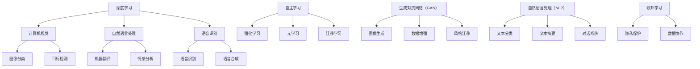

                 

关键词：人工智能、深度学习、未来趋势、技术发展、机遇挑战

> 摘要：本文旨在探讨人工智能领域专家Andrej Karpathy关于人工智能未来发展的见解。通过分析他在公开演讲和论文中的观点，我们将揭示人工智能领域的关键机遇和潜在挑战，为读者提供对未来技术发展的深度思考和实用建议。

## 1. 背景介绍

Andrej Karpathy是一位世界知名的人工智能专家，他在深度学习和自然语言处理领域具有丰富的经验和深厚的造诣。作为斯坦福大学计算机科学博士，Karpathy曾在OpenAI担任研究员，并参与开发了多个重要的深度学习项目，包括自然语言处理系统GPT-2和GPT-3。他的工作不仅推动了人工智能技术的进步，也对学术界和工业界产生了深远的影响。

本文将基于Karpathy在多个场合的演讲和论文，深入分析他关于人工智能未来发展的核心观点，探讨这一领域的机遇和挑战，并展望其可能带来的深远影响。

## 2. 核心概念与联系

在讨论人工智能的未来之前，我们首先需要理解一些核心概念。以下是关键概念及其在人工智能领域中的联系：

### 2.1 深度学习

深度学习是人工智能的一个重要分支，通过构建具有多个层次的神经网络，深度学习算法能够从大量数据中自动提取特征，实现复杂的模式识别和预测任务。深度学习的发展极大地推动了计算机视觉、自然语言处理和语音识别等领域的进展。

### 2.2 自主学习

自主学习是指系统能够在没有明确指令的情况下，通过经验和反馈不断改进自身性能。这种能力是人工智能领域的重要目标，因为它使得系统能够更好地适应不断变化的环境和任务。

### 2.3 生成对抗网络（GAN）

生成对抗网络是一种由两部分组成的神经网络架构，一部分生成器试图生成与真实数据相似的数据，另一部分鉴别器则试图区分生成数据和真实数据。这种对抗性训练方法在图像生成、数据增强和风格迁移等领域具有广泛应用。

### 2.4 自然语言处理（NLP）

自然语言处理是研究计算机如何理解和生成人类自然语言的技术。NLP技术广泛应用于机器翻译、情感分析、文本摘要和对话系统等领域，是人工智能领域的一个重要组成部分。

### 2.5 联邦学习

联邦学习是一种分布式机器学习技术，它允许多个数据拥有者在不共享数据的情况下，共同训练出一个共享模型。这种技术有助于保护用户隐私，同时实现更高效的数据协作。

### 2.6 Mermaid 流程图

以下是关于深度学习、自主学习、生成对抗网络（GAN）、自然语言处理（NLP）和联邦学习的 Mermaid 流程图：



## 3. 核心算法原理 & 具体操作步骤

### 3.1 算法原理概述

在探讨人工智能的未来之前，我们首先需要了解一些核心算法的原理。以下是几个重要的算法及其基本原理：

### 3.2 算法步骤详解

#### 3.2.1 深度学习

深度学习算法的基本步骤包括：

1. 数据预处理：包括数据清洗、归一化和数据增强等步骤。
2. 网络架构设计：选择合适的神经网络架构，如卷积神经网络（CNN）或循环神经网络（RNN）。
3. 损失函数定义：选择适当的损失函数，如交叉熵损失函数或均方误差损失函数。
4. 优化器选择：选择合适的优化器，如随机梯度下降（SGD）或Adam优化器。
5. 模型训练：使用训练数据对模型进行训练，并调整网络参数。
6. 模型评估：使用验证集或测试集对模型进行评估，并调整模型参数。
7. 模型部署：将训练好的模型部署到实际应用场景中。

#### 3.2.2 生成对抗网络（GAN）

生成对抗网络的基本步骤包括：

1. 数据预处理：对生成器和鉴别器的输入数据进行预处理。
2. 生成器训练：通过生成器生成与真实数据相似的数据，并优化生成器的参数。
3. 鉴别器训练：通过鉴别器对生成器和真实数据进行分析，并优化鉴别器的参数。
4. 模型评估：使用生成数据和真实数据进行模型评估，并调整模型参数。
5. 模型部署：将训练好的模型部署到实际应用场景中。

#### 3.2.3 自然语言处理（NLP）

自然语言处理的基本步骤包括：

1. 数据预处理：包括文本清洗、分词和词性标注等步骤。
2. 模型选择：选择合适的模型，如循环神经网络（RNN）或变换器（Transformer）。
3. 模型训练：使用训练数据对模型进行训练，并优化模型参数。
4. 模型评估：使用验证集或测试集对模型进行评估，并调整模型参数。
5. 模型部署：将训练好的模型部署到实际应用场景中。

### 3.3 算法优缺点

#### 3.3.1 深度学习

优点：

- 强大的特征提取能力：能够从大量数据中自动提取有用特征，提高模型性能。
- 自动化：减少了手工特征工程的工作量，提高了开发效率。

缺点：

- 计算成本高：需要大量计算资源进行模型训练和优化。
- 数据依赖性强：模型性能依赖于训练数据的质量和数量。

#### 3.3.2 生成对抗网络（GAN）

优点：

- 无需标签数据：可以通过对抗训练生成高质量的无标签数据。
- 强大的生成能力：能够生成逼真的图像和音频。

缺点：

- 不稳定训练：GAN的训练过程容易陷入局部最优，导致生成质量不稳定。
- 难以优化：生成器和鉴别器的平衡难以控制。

#### 3.3.3 自然语言处理（NLP）

优点：

- 广泛的应用场景：在机器翻译、文本分类和对话系统等领域具有广泛应用。
- 高效的文本处理：能够快速处理大量文本数据。

缺点：

- 数据依赖性强：模型性能依赖于训练数据的质量和多样性。
- 难以理解：复杂的神经网络结构使得模型难以解释。

### 3.4 算法应用领域

#### 3.4.1 深度学习

深度学习在计算机视觉、自然语言处理、语音识别和强化学习等领域具有广泛应用。例如：

- 计算机视觉：用于图像分类、目标检测和图像分割等任务。
- 自然语言处理：用于机器翻译、文本分类和对话系统等任务。
- 语音识别：用于语音转文字和语音合成等任务。
- 强化学习：用于游戏、自动驾驶和机器人控制等任务。

#### 3.4.2 生成对抗网络（GAN）

生成对抗网络在图像生成、数据增强和风格迁移等领域具有广泛应用。例如：

- 图像生成：用于生成逼真的图像和视频。
- 数据增强：用于扩充训练数据，提高模型性能。
- 风格迁移：用于将一种艺术风格应用到另一张图片上。

#### 3.4.3 自然语言处理（NLP）

自然语言处理在机器翻译、情感分析、文本摘要和对话系统等领域具有广泛应用。例如：

- 机器翻译：用于将一种语言翻译成另一种语言。
- 情感分析：用于分析文本中的情感倾向。
- 文本摘要：用于提取文本的主要内容和关键信息。
- 对话系统：用于实现智能对话和交互。

## 4. 数学模型和公式 & 详细讲解 & 举例说明

### 4.1 数学模型构建

在人工智能领域，数学模型是构建算法和解决问题的基础。以下是几个重要的数学模型及其构建过程：

#### 4.1.1 线性回归

线性回归模型是一个简单的数学模型，用于预测一个连续变量的值。其公式如下：

\[ y = \beta_0 + \beta_1 \cdot x \]

其中，\( y \) 是因变量，\( x \) 是自变量，\( \beta_0 \) 和 \( \beta_1 \) 是模型的参数。

#### 4.1.2 逻辑回归

逻辑回归是一种用于分类问题的数学模型，其公式如下：

\[ P(y=1) = \frac{1}{1 + e^{-(\beta_0 + \beta_1 \cdot x)}} \]

其中，\( y \) 是因变量，\( x \) 是自变量，\( \beta_0 \) 和 \( \beta_1 \) 是模型的参数。

#### 4.1.3 卷积神经网络（CNN）

卷积神经网络是一种用于图像识别和处理的数学模型，其基本公式如下：

\[ f(x) = \sigma(\beta \cdot \text{ReLU}(\text{ReLU}(\text{ReLU}(... \text{ReLU}(\text{W} \cdot \text{A} + b)...))) \]

其中，\( x \) 是输入数据，\( \text{A} \) 是激活函数，\( \text{W} \) 是权重矩阵，\( b \) 是偏置项，\( \sigma \) 是激活函数。

### 4.2 公式推导过程

以下是几个重要的数学公式及其推导过程：

#### 4.2.1 梯度下降算法

梯度下降算法是一种优化算法，用于求解最小化损失函数的参数。其公式如下：

\[ \beta_{\text{new}} = \beta_{\text{old}} - \alpha \cdot \nabla_{\beta} J(\beta) \]

其中，\( \beta \) 是模型参数，\( \alpha \) 是学习率，\( \nabla_{\beta} J(\beta) \) 是损失函数 \( J(\beta) \) 对 \( \beta \) 的梯度。

推导过程：

1. 损失函数的定义：\( J(\beta) = \frac{1}{2} \sum_{i=1}^{n} (y_i - \beta \cdot x_i)^2 \)
2. 梯度的计算：\( \nabla_{\beta} J(\beta) = \frac{\partial}{\partial \beta} J(\beta) = \sum_{i=1}^{n} (y_i - \beta \cdot x_i) \cdot x_i \)
3. 更新参数：\( \beta_{\text{new}} = \beta_{\text{old}} - \alpha \cdot \nabla_{\beta} J(\beta) \)

#### 4.2.2 交叉熵损失函数

交叉熵损失函数是一种常用的分类损失函数，其公式如下：

\[ J(\beta) = -\sum_{i=1}^{n} y_i \cdot \log(\hat{y}_i) \]

其中，\( y \) 是真实标签，\( \hat{y}_i \) 是模型预测的概率。

推导过程：

1. 概率的定义：\( \hat{y}_i = \frac{1}{1 + e^{-(\beta_0 + \beta_1 \cdot x_i)}} \)
2. 交叉熵的计算：\( J(\beta) = -\sum_{i=1}^{n} y_i \cdot \log(\hat{y}_i) \)

### 4.3 案例分析与讲解

#### 4.3.1 线性回归案例分析

假设我们有以下数据集：

| x   | y    |
|-----|------|
| 1   | 2    |
| 2   | 4    |
| 3   | 6    |
| 4   | 8    |

我们要使用线性回归模型预测新的 \( y \) 值。首先，我们需要计算损失函数 \( J(\beta) \)：

\[ J(\beta) = \frac{1}{2} \sum_{i=1}^{n} (y_i - \beta \cdot x_i)^2 \]

然后，使用梯度下降算法更新模型参数 \( \beta \)：

\[ \beta_{\text{new}} = \beta_{\text{old}} - \alpha \cdot \nabla_{\beta} J(\beta) \]

在多次迭代后，我们可以得到最优的模型参数 \( \beta \)，并使用该模型预测新的 \( y \) 值。

#### 4.3.2 逻辑回归案例分析

假设我们有以下数据集：

| x   | y    |
|-----|------|
| 1   | 0    |
| 2   | 1    |
| 3   | 0    |
| 4   | 1    |

我们要使用逻辑回归模型预测新的 \( y \) 值。首先，我们需要计算损失函数 \( J(\beta) \)：

\[ J(\beta) = -\sum_{i=1}^{n} y_i \cdot \log(\hat{y}_i) \]

然后，使用梯度下降算法更新模型参数 \( \beta \)：

\[ \beta_{\text{new}} = \beta_{\text{old}} - \alpha \cdot \nabla_{\beta} J(\beta) \]

在多次迭代后，我们可以得到最优的模型参数 \( \beta \)，并使用该模型预测新的 \( y \) 值。

#### 4.3.3 卷积神经网络（CNN）案例分析

假设我们有以下数据集：

|   |   |   |   |
|---|---|---|---|
| 1 | 1 | 1 | 1 |
| 1 | 1 | 1 | 1 |
| 1 | 1 | 1 | 1 |
| 1 | 1 | 1 | 1 |

我们要使用卷积神经网络（CNN）识别图像中的形状。首先，我们需要设计网络架构，包括卷积层、池化层和全连接层。然后，使用梯度下降算法训练模型，并使用训练好的模型进行预测。

## 5. 项目实践：代码实例和详细解释说明

### 5.1 开发环境搭建

在进行人工智能项目的实践之前，我们需要搭建一个适合开发和训练模型的开发环境。以下是搭建开发环境的基本步骤：

1. 安装Python：Python是人工智能项目开发的主要编程语言，我们需要安装Python 3.x版本。可以从Python官网下载安装程序并安装。
2. 安装Anaconda：Anaconda是一个Python数据科学和人工智能平台，它提供了丰富的包管理和环境管理功能。可以从Anaconda官网下载安装程序并安装。
3. 安装Jupyter Notebook：Jupyter Notebook是一个交互式的Python编程环境，它使得我们可以方便地进行代码编写和调试。在Anaconda环境中，可以通过以下命令安装Jupyter Notebook：

   ```bash
   conda install -c anaconda jupyter
   ```

4. 安装必要的库：在Jupyter Notebook中，我们需要安装一些常用的库，如NumPy、Pandas、Matplotlib和Scikit-learn等。可以通过以下命令安装：

   ```bash
   conda install numpy pandas matplotlib scikit-learn
   ```

### 5.2 源代码详细实现

以下是一个简单的线性回归模型的实现，包括数据预处理、模型训练和模型评估等步骤。

```python
import numpy as np
import pandas as pd
import matplotlib.pyplot as plt
from sklearn.linear_model import LinearRegression

# 5.2.1 数据预处理
# 加载数据
data = pd.read_csv('data.csv')
X = data[['x']]
y = data['y']

# 添加偏置项
X = np.hstack((np.ones((X.shape[0], 1)), X))

# 5.2.2 模型训练
# 创建线性回归模型
model = LinearRegression()

# 训练模型
model.fit(X, y)

# 5.2.3 模型评估
# 预测新数据
new_data = np.array([[5]])
new_data = np.hstack((np.ones((new_data.shape[0], 1)), new_data))
y_pred = model.predict(new_data)

# 可视化结果
plt.scatter(X[:, 1], y)
plt.plot(new_data[:, 1], y_pred, color='red')
plt.xlabel('x')
plt.ylabel('y')
plt.show()
```

### 5.3 代码解读与分析

1. 数据预处理：首先，我们从CSV文件中加载数据，并分别提取自变量 \( X \) 和因变量 \( y \)。然后，我们在 \( X \) 的每一行前添加一个偏置项 \( 1 \)，以便后续计算。
2. 模型训练：我们使用Scikit-learn库中的LinearRegression类创建线性回归模型，并使用fit方法对模型进行训练。
3. 模型评估：我们使用训练好的模型对新数据进行预测，并将预测结果可视化为散点图和拟合直线。这有助于我们直观地了解模型的效果。

### 5.4 运行结果展示

运行上述代码后，我们将得到一个包含新数据的散点图和拟合直线。这有助于我们验证线性回归模型的预测能力。

## 6. 实际应用场景

人工智能技术在实际应用场景中具有广泛的应用，以下是一些典型应用场景：

### 6.1 计算机视觉

计算机视觉是人工智能的一个重要分支，它涉及计算机对图像和视频的分析和理解。以下是一些计算机视觉的实际应用场景：

- **图像分类**：用于识别和分类图像中的对象，例如人脸识别、物体检测和图像分类。
- **图像分割**：将图像分割成不同的区域或对象，例如医学图像分割、图像去噪和图像修复。
- **目标检测**：用于检测图像中的特定目标或对象，例如车辆检测、行人检测和目标跟踪。

### 6.2 自然语言处理

自然语言处理是人工智能领域的另一个重要分支，它涉及计算机对自然语言的理解和生成。以下是一些自然语言处理的实际应用场景：

- **机器翻译**：将一种语言翻译成另一种语言，例如谷歌翻译和百度翻译。
- **情感分析**：分析文本中的情感倾向，例如微博情感分析和新闻情感分析。
- **文本摘要**：提取文本的主要内容和关键信息，例如新闻摘要和论文摘要。
- **对话系统**：实现智能对话和交互，例如智能客服和虚拟助手。

### 6.3 语音识别

语音识别是人工智能领域的另一个重要分支，它涉及计算机对语音信号的理解和转换。以下是一些语音识别的实际应用场景：

- **语音转文字**：将语音转换为文本，例如语音助手和语音输入。
- **语音合成**：将文本转换为语音，例如语音合成和语音输出。
- **语音控制**：通过语音指令控制智能设备和应用程序，例如智能音箱和智能家居。

### 6.4 未来的应用展望

随着人工智能技术的不断发展和进步，未来它将在更多领域得到应用。以下是一些可能的应用场景：

- **自动驾驶**：利用计算机视觉和自然语言处理技术，实现自动驾驶汽车和无人机。
- **智能医疗**：利用人工智能技术，实现智能诊断、药物发现和医疗决策支持。
- **智能制造**：利用人工智能技术，实现智能生产、质量控制和管理。
- **智慧城市**：利用人工智能技术，实现智慧交通、环境保护和公共安全。

## 7. 工具和资源推荐

在人工智能领域，有许多优秀的工具和资源可以帮助我们学习和应用这一技术。以下是一些推荐的工具和资源：

### 7.1 学习资源推荐

- **课程和教程**：MOOC平台如Coursera、edX和Udacity提供了丰富的深度学习和人工智能课程。例如，斯坦福大学的“深度学习专项课程”和吴恩达的“机器学习专项课程”。
- **书籍**：一些经典的机器学习和深度学习书籍，如《深度学习》（Goodfellow, Bengio和Courville著）、《神经网络与深度学习》（邱锡鹏著）和《Python机器学习》（Sebastian Raschka著）。

### 7.2 开发工具推荐

- **IDE**：PyCharm、Visual Studio Code和Jupyter Notebook是常用的Python开发环境，提供了丰富的功能和插件支持。
- **库和框架**：NumPy、Pandas、Matplotlib、Scikit-learn、TensorFlow和PyTorch是常用的Python库和框架，涵盖了从数据预处理到模型训练和可视化的各个方面。

### 7.3 相关论文推荐

- **顶级会议和期刊**：计算机视觉、自然语言处理和机器学习领域的顶级会议和期刊，如NeurIPS、ICLR、CVPR、ACL和JMLR。
- **经典论文**：《Backpropagation》（Rumelhart, Hinton和Williams著）、《AlexNet》（Krizhevsky, Sutskever和Hinton著）和《Attention Is All You Need》（Vaswani等著）。

## 8. 总结：未来发展趋势与挑战

### 8.1 研究成果总结

近年来，人工智能领域取得了显著的研究成果。深度学习技术的发展极大地推动了计算机视觉、自然语言处理和语音识别等领域的进展。生成对抗网络（GAN）的出现为图像生成和数据增强提供了新的方法。联邦学习作为一种隐私保护技术，为分布式数据协作提供了新的解决方案。同时，强化学习、迁移学习和元学习等技术的发展也为人工智能的应用带来了新的机遇。

### 8.2 未来发展趋势

随着人工智能技术的不断发展，未来其将在更多领域得到应用。计算机视觉和自然语言处理将继续成为人工智能研究的重要方向。自动驾驶、智能医疗和智能制造等领域的应用也将不断拓展。此外，量子计算、脑机接口和区块链等新兴技术的融合，将为人工智能带来新的发展机遇。

### 8.3 面临的挑战

尽管人工智能领域取得了显著的进展，但仍面临一些挑战。首先，数据隐私和安全问题是人工智能应用的重要挑战。其次，人工智能算法的可解释性和透明性也是一个重要问题，特别是在关键应用领域，如医疗和金融。此外，人工智能算法的伦理和社会影响也需要引起关注。

### 8.4 研究展望

未来，人工智能研究将朝着更高效、更智能和更安全的方向发展。在算法方面，我们将看到更先进的模型结构和优化算法的出现。在应用方面，人工智能将在更多领域得到应用，并与其他技术相结合，如量子计算和区块链。此外，人工智能的教育和普及也将成为研究的重要方向，以培养更多的人才和应用人工智能技术解决现实问题。

## 9. 附录：常见问题与解答

### 9.1 什么是深度学习？

深度学习是一种人工智能方法，它通过构建具有多个层次的神经网络，从大量数据中自动提取特征，实现复杂的模式识别和预测任务。

### 9.2 生成对抗网络（GAN）是什么？

生成对抗网络（GAN）是一种由生成器和鉴别器组成的神经网络架构。生成器试图生成与真实数据相似的数据，而鉴别器则试图区分生成数据和真实数据。这种对抗性训练方法在图像生成、数据增强和风格迁移等领域具有广泛应用。

### 9.3 自然语言处理（NLP）是什么？

自然语言处理（NLP）是研究计算机如何理解和生成人类自然语言的技术。它广泛应用于机器翻译、文本分类、情感分析和文本摘要等领域。

### 9.4 联邦学习是什么？

联邦学习是一种分布式机器学习技术，它允许多个数据拥有者在不共享数据的情况下，共同训练出一个共享模型。这种技术有助于保护用户隐私，同时实现更高效的数据协作。

### 9.5 量子计算与人工智能有什么关系？

量子计算是一种基于量子力学原理的计算方法，它具有巨大的计算能力。量子计算与人工智能的关系主要体现在量子算法的开发和应用，如量子机器学习和量子优化。这些技术有望在未来推动人工智能的发展。

### 9.6 脑机接口是什么？

脑机接口是一种直接连接人类大脑和外部设备的技术，它能够实现大脑信号与计算机系统的交互。脑机接口在医疗、教育、娱乐等领域具有潜在的应用前景。

### 9.7 区块链与人工智能有什么关系？

区块链是一种分布式账本技术，它具有去中心化、不可篡改和透明等特点。区块链与人工智能的关系主要体现在智能合约和区块链优化算法的开发。这些技术有望在未来推动人工智能的应用和发展。

----------------------------------------------------------------

以上是关于Andrej Karpathy的人工智能未来发展的详细分析和技术博客文章。希望对读者有所帮助。作者：禅与计算机程序设计艺术 / Zen and the Art of Computer Programming。

