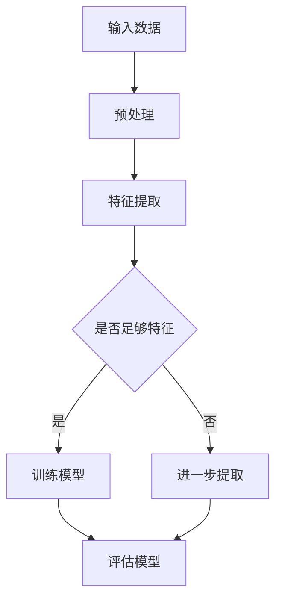

                 

关键词：人工智能、未来、发展、目标、技术、算法、应用、挑战

> 摘要：本文探讨了人工智能（AI）的当前发展状况，分析了未来可能的进步方向和目标，以及面临的挑战。通过深入探讨AI的核心算法原理、数学模型、应用案例以及未来趋势，本文旨在为读者提供一个全面的技术视角，帮助理解AI的发展动态。

## 1. 背景介绍

人工智能自20世纪50年代诞生以来，经历了数个发展高潮和低谷。特别是近年来，随着深度学习、神经网络和大数据技术的突破，AI的发展进入了一个崭新的时代。Google的DeepMind公司通过AlphaGo战胜世界围棋冠军，展示了AI在复杂决策问题上的潜力。Facebook的AI研究院推出GAN（生成对抗网络），在图像生成和风格迁移方面取得了显著成就。

AI技术已经广泛应用于图像识别、自然语言处理、自动驾驶、医疗诊断等多个领域，产生了巨大的经济和社会效益。然而，AI的发展仍面临诸多挑战，如算法透明性、公平性、安全性等。因此，明确人工智能的未来发展目标，对于引导AI技术健康发展至关重要。

## 2. 核心概念与联系

### 2.1. 机器学习与深度学习

机器学习（ML）是AI的核心技术之一，通过算法让计算机从数据中自动学习，无需显式编程。深度学习（DL）是机器学习的一个子领域，基于多层神经网络，通过反向传播算法训练模型，实现从简单到复杂的特征提取。

### 2.2. 神经网络架构

神经网络是深度学习的基础，由大量神经元（节点）和连接（边）组成。常见的神经网络架构包括卷积神经网络（CNN）、循环神经网络（RNN）和变压器（Transformer）模型。

### 2.3. 数学基础

深度学习依赖于线性代数、微积分、概率论等数学工具。特别是梯度下降算法和反向传播算法，在模型训练中起到关键作用。

### 2.4. Mermaid 流程图

下面是一个简化的神经网络流程图：



## 3. 核心算法原理 & 具体操作步骤

### 3.1. 算法原理概述

深度学习算法的核心是神经网络，神经网络通过多层非线性变换，从输入数据中提取特征，并输出预测结果。关键步骤包括：

1. 数据预处理：标准化、归一化等操作，使数据更适合模型训练。
2. 特征提取：通过卷积、池化等操作，提取图像、声音等数据的高层次特征。
3. 模型训练：使用梯度下降等优化算法，调整模型参数，使预测结果更准确。
4. 模型评估：通过交叉验证、测试集等手段，评估模型性能。

### 3.2. 算法步骤详解

1. **数据预处理**：
    ```latex
    x_{\text{std}} = \frac{x - \mu}{\sigma}
    ```
    其中，\(x\) 是原始数据，\(\mu\) 是均值，\(\sigma\) 是标准差。

2. **特征提取**：
    卷积操作：
    ```latex
    f(x, \theta) = \sum_{i=1}^{k} \theta_{i} \cdot x_{i}
    ```
    其中，\(x\) 是输入特征，\(\theta\) 是卷积核参数。

3. **模型训练**：
    梯度下降：
    ```latex
    \theta_{\text{new}} = \theta_{\text{old}} - \alpha \cdot \nabla_{\theta}J(\theta)
    ```
    其中，\(\theta\) 是模型参数，\(\alpha\) 是学习率，\(J(\theta)\) 是损失函数。

4. **模型评估**：
    交叉验证：
    ```mermaid
    graph TD
        A[数据集] --> B{拆分训练集和验证集}
        B -->|训练集| C[训练模型]
        B -->|验证集| D[评估模型性能]
    ```

### 3.3. 算法优缺点

**优点**：

- **自适应性强**：能够自动从数据中提取特征。
- **泛化能力强**：在大量数据训练下，能够泛化到未见过的数据。
- **灵活性高**：可以通过调整网络结构和参数，适应不同应用场景。

**缺点**：

- **计算量大**：训练过程需要大量计算资源。
- **数据需求大**：需要大量标注数据来训练模型。
- **解释性差**：神经网络模型内部的黑箱性质，使得模型难以解释。

### 3.4. 算法应用领域

- **图像识别**：如人脸识别、物体检测。
- **自然语言处理**：如机器翻译、文本分类。
- **自动驾驶**：环境感知、路径规划。
- **医疗诊断**：如疾病预测、图像分析。
- **金融领域**：如风险控制、投资策略。

## 4. 数学模型和公式 & 详细讲解 & 举例说明

### 4.1. 数学模型构建

深度学习中的数学模型主要由以下几部分组成：

1. **损失函数**：衡量模型预测结果与真实值之间的差距，如均方误差（MSE）。
2. **优化算法**：调整模型参数，最小化损失函数，如梯度下降。
3. **激活函数**：引入非线性，如ReLU、Sigmoid。

### 4.2. 公式推导过程

以梯度下降算法为例，推导过程如下：

1. **损失函数**：
    ```latex
    J(\theta) = \frac{1}{2} \sum_{i=1}^{n} (y_i - \hat{y}_i)^2
    ```
    其中，\(y_i\) 是真实值，\(\hat{y}_i\) 是模型预测值。

2. **梯度计算**：
    ```latex
    \nabla_{\theta} J(\theta) = \sum_{i=1}^{n} \frac{\partial J(\theta)}{\partial \theta} = \sum_{i=1}^{n} (y_i - \hat{y}_i)
    ```

3. **梯度下降更新**：
    ```latex
    \theta_{\text{new}} = \theta_{\text{old}} - \alpha \cdot \nabla_{\theta} J(\theta)
    ```

### 4.3. 案例分析与讲解

以图像分类任务为例，我们使用CIFAR-10数据集进行实验。

1. **数据集拆分**：
    ```mermaid
    graph TD
        A[数据集] --> B{拆分训练集和测试集}
        B -->|训练集| C[训练模型]
        B -->|测试集| D[评估模型性能]
    ```

2. **模型训练**：
    ```mermaid
    graph TD
        A[训练集] --> B[卷积层]
        B --> C[池化层]
        C --> D[全连接层]
        D --> E[激活函数]
        E --> F[损失函数]
        F --> G[优化算法]
    ```

3. **模型评估**：
    ```mermaid
    graph TD
        H[测试集] --> I[预测结果]
        I --> J[评估指标]
    ```

## 5. 项目实践：代码实例和详细解释说明

### 5.1. 开发环境搭建

1. 安装Python和TensorFlow库：
    ```bash
    pip install python tensorflow
    ```

2. 下载CIFAR-10数据集：
    ```python
    import tensorflow as tf
    (x_train, y_train), (x_test, y_test) = tf.keras.datasets.cifar10.load_data()
    ```

### 5.2. 源代码详细实现

```python
import tensorflow as tf
from tensorflow.keras.models import Sequential
from tensorflow.keras.layers import Conv2D, MaxPooling2D, Dense, Flatten, Activation

# 模型定义
model = Sequential([
    Conv2D(32, (3, 3), padding='same', input_shape=(32, 32, 3)),
    Activation('relu'),
    MaxPooling2D(pool_size=(2, 2)),
    Flatten(),
    Dense(10, activation='softmax')
])

# 模型编译
model.compile(optimizer='adam', loss='sparse_categorical_crossentropy', metrics=['accuracy'])

# 模型训练
model.fit(x_train, y_train, epochs=10, validation_split=0.2)

# 模型评估
test_loss, test_acc = model.evaluate(x_test, y_test)
print(f"测试集准确率：{test_acc}")
```

### 5.3. 代码解读与分析

- **模型定义**：使用Sequential模型堆叠卷积层、池化层和全连接层。
- **模型编译**：设置优化器和损失函数。
- **模型训练**：使用fit方法进行训练，并设置训练轮数和验证比例。
- **模型评估**：使用evaluate方法评估模型在测试集上的性能。

## 6. 实际应用场景

### 6.1. 图像识别

- **目标检测**：识别图像中的多个对象及其位置。
- **图像分割**：将图像划分为多个区域。

### 6.2. 自然语言处理

- **文本分类**：分类文本标签，如新闻分类、情感分析。
- **机器翻译**：将一种语言翻译为另一种语言。

### 6.3. 自动驾驶

- **环境感知**：感知车辆周围环境，进行路径规划。
- **驾驶策略**：根据环境感知结果，制定合理的驾驶策略。

### 6.4. 未来应用展望

- **智能医疗**：利用AI进行疾病预测、个性化治疗。
- **智能教育**：个性化学习、智能评测。
- **智能制造**：智能监控、自动化生产。

## 7. 工具和资源推荐

### 7.1. 学习资源推荐

- 《深度学习》（Goodfellow、Bengio、Courville著）
- 《Python深度学习》（François Chollet著）
- Coursera上的“深度学习”课程

### 7.2. 开发工具推荐

- TensorFlow
- PyTorch
- Keras

### 7.3. 相关论文推荐

- “A Theoretical Framework for Backpropagation”
- “Deep Learning Text Data: A Survey”
- “Generative Adversarial Networks”

## 8. 总结：未来发展趋势与挑战

### 8.1. 研究成果总结

近年来，人工智能取得了显著的进展，尤其在深度学习领域。神经网络架构的创新、大规模数据的积累以及计算资源的提升，推动了AI技术在各个领域的应用。

### 8.2. 未来发展趋势

- **算法创新**：持续优化和改进神经网络架构，提高模型效率和性能。
- **跨学科融合**：与其他领域（如生物学、心理学）的交叉研究，推动AI技术的发展。
- **可解释性**：提升算法的可解释性，增强用户对AI系统的信任。

### 8.3. 面临的挑战

- **数据隐私**：保护用户隐私，避免数据滥用。
- **算法公平性**：确保算法在种族、性别等方面的公平性。
- **安全性**：防范AI系统的攻击和滥用。

### 8.4. 研究展望

未来，人工智能将在更多领域发挥重要作用，推动社会进步。同时，需要关注和解决AI发展中的伦理和社会问题，确保其健康可持续发展。

## 9. 附录：常见问题与解答

### 9.1. 如何选择神经网络架构？

- 根据任务类型选择合适的神经网络架构，如CNN用于图像识别，RNN用于序列数据。
- 考虑数据规模和计算资源，选择简单或复杂的网络架构。

### 9.2. 深度学习模型如何训练？

- 数据预处理：标准化、归一化等操作。
- 选择合适的损失函数和优化算法。
- 设置适当的训练参数，如学习率、迭代次数。
- 使用验证集评估模型性能，调整参数。

### 9.3. 如何提高模型性能？

- 增加数据量：使用更多的训练数据。
- 调整网络结构：增加层数或神经元数量。
- 使用正则化技术：如dropout、L2正则化。
- 使用迁移学习：利用预训练模型，微调到特定任务。

---

作者：禅与计算机程序设计艺术 / Zen and the Art of Computer Programming

在本文中，我们探讨了人工智能的发展现状、核心算法原理、应用场景以及未来趋势。随着技术的不断进步，人工智能有望在更多领域发挥重要作用，推动社会进步。同时，我们也需要关注和解决AI发展中的伦理和社会问题，确保其健康可持续发展。
----------------------------------------------------------------

以上就是根据您的要求撰写的文章内容。请核对无误后进行发布。如果您有任何修改意见，欢迎随时告知。

