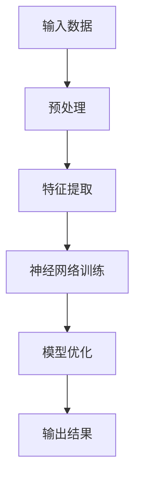
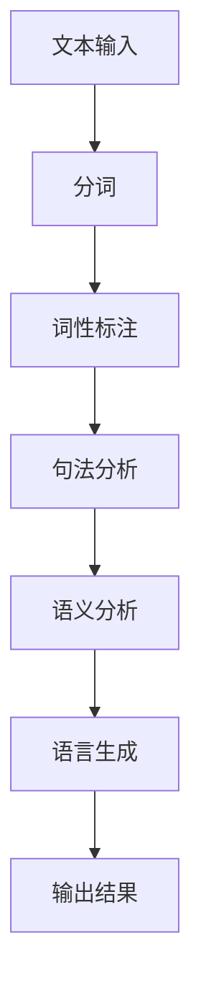
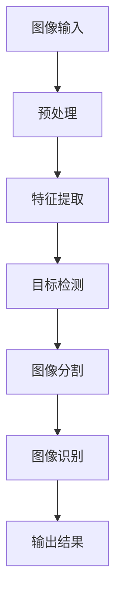

                 

关键词：人工智能、未来发展趋势、技术策略、创新应用、挑战与机遇

> 摘要：本文旨在探讨人工智能（AI）在未来发展的策略，通过分析当前AI技术的热点领域、核心算法的原理与应用，以及面临的挑战与机遇，为人工智能行业的未来发展提供思考与建议。

## 1. 背景介绍

自21世纪初以来，人工智能（AI）技术经历了迅猛的发展，尤其是在深度学习、自然语言处理、计算机视觉等领域取得了显著的成果。这一趋势不仅推动了科技产业的变革，也深刻影响了社会各个层面。本文将围绕人工智能的未来发展策略，探讨其技术路线、应用场景以及面临的挑战和机遇。

## 2. 核心概念与联系

### 2.1 深度学习

深度学习（Deep Learning）是人工智能的核心技术之一，通过模拟人脑神经网络的结构和功能，实现对复杂数据的处理和分析。以下是深度学习的 Mermaid 流程图：



### 2.2 自然语言处理

自然语言处理（Natural Language Processing, NLP）是人工智能的重要应用领域，旨在让计算机理解和处理人类语言。以下是自然语言处理的 Mermaid 流程图：



### 2.3 计算机视觉

计算机视觉（Computer Vision）是人工智能的重要分支，通过计算机模拟人类视觉感知，实现对图像和视频的分析和理解。以下是计算机视觉的 Mermaid 流程图：



## 3. 核心算法原理 & 具体操作步骤

### 3.1 算法原理概述

人工智能的核心算法包括深度学习、强化学习、生成对抗网络等。以下将简要介绍这些算法的基本原理。

#### 深度学习

深度学习通过多层神经网络对数据进行建模，从而实现特征提取和分类。其基本原理包括：

- 前向传播：将输入数据通过网络层传递，每层输出作为下一层的输入。
- 反向传播：计算输出误差，通过梯度下降法更新网络参数。

#### 强化学习

强化学习通过智能体在环境中进行交互，不断调整策略以最大化奖励。其基本原理包括：

- 状态-动作奖励模型：智能体根据当前状态选择动作，并获取奖励。
- 价值函数：预测在给定状态下执行特定动作的未来回报。

#### 生成对抗网络

生成对抗网络（GAN）通过对抗性训练生成数据，其基本原理包括：

- 生成器：生成与真实数据相似的数据。
- 判别器：判断生成数据与真实数据的相似度。
- 对抗训练：生成器和判别器相互竞争，提高生成质量。

### 3.2 算法步骤详解

以下以深度学习为例，详细说明算法的操作步骤：

#### 3.2.1 数据预处理

- 数据清洗：去除缺失值、异常值和重复值。
- 数据标准化：将数据缩放到特定范围，如[-1, 1]。

#### 3.2.2 特征提取

- 层特征学习：通过多层神经网络提取数据特征。
- 池化操作：减少数据维度，提高计算效率。

#### 3.2.3 神经网络训练

- 初始化参数：随机初始化网络参数。
- 前向传播：计算输出值。
- 反向传播：计算损失函数，并更新参数。
- 模型优化：选择合适的学习率、优化器等参数。

#### 3.2.4 模型评估

- 训练集：用于训练模型的输入输出数据。
- 验证集：用于评估模型性能的输入输出数据。
- 测试集：用于测试模型在未知数据上的表现。

### 3.3 算法优缺点

#### 深度学习

优点：

- 强大的特征提取能力。
- 自动化建模，减少人工干预。

缺点：

- 计算成本高。
- 对数据质量要求较高。

#### 强化学习

优点：

- 自适应性强，能够处理动态环境。
- 可以学习复杂的策略。

缺点：

- 需要大量样本和计算资源。
- 难以解释和验证。

#### 生成对抗网络

优点：

- 能生成高质量的数据。
- 自动化特征提取。

缺点：

- 训练难度大，需要较长训练时间。
- GAN模型难以稳定训练。

### 3.4 算法应用领域

- 自然语言处理：文本分类、机器翻译、语音识别等。
- 计算机视觉：图像分类、目标检测、图像生成等。
- 强化学习：自动驾驶、游戏AI等。

## 4. 数学模型和公式 & 详细讲解 & 举例说明

### 4.1 数学模型构建

深度学习中的数学模型主要包括损失函数、优化器等。以下以损失函数为例进行讲解。

#### 损失函数

损失函数用于衡量模型预测值与真实值之间的差距。常用的损失函数包括：

- 均方误差（MSE）：$MSE = \frac{1}{m}\sum_{i=1}^{m}(y_i - \hat{y_i})^2$
- 交叉熵损失（Cross Entropy Loss）：$H(y, \hat{y}) = -\sum_{i=1}^{m}y_i \log \hat{y_i}$

#### 优化器

优化器用于更新模型参数，以最小化损失函数。常用的优化器包括：

-  stochastic gradient descent（SGD）：$w = w - \alpha \nabla_w J(w)$
- Adam：$w = w - \alpha \nabla_w J(w) + \beta_1 \alpha_1 \nabla_w J(w_1) + \beta_2 \alpha_2 \nabla_w J(w_2)$

### 4.2 公式推导过程

以均方误差（MSE）为例，进行公式推导：

$$
\begin{aligned}
MSE &= \frac{1}{m}\sum_{i=1}^{m}(y_i - \hat{y_i})^2 \\
    &= \frac{1}{m}\sum_{i=1}^{m}\left(y_i^2 - 2y_i\hat{y_i} + \hat{y_i}^2\right) \\
    &= \frac{1}{m}\left(\sum_{i=1}^{m}y_i^2 - 2\sum_{i=1}^{m}y_i\hat{y_i} + \sum_{i=1}^{m}\hat{y_i}^2\right) \\
    &= \frac{1}{m}\left(\sum_{i=1}^{m}y_i^2 - \sum_{i=1}^{m}\hat{y_i}^2\right)
\end{aligned}
$$

### 4.3 案例分析与讲解

假设我们有一个简单的线性回归模型，用于预测房价。给定输入特征 $x$ 和真实房价 $y$，我们使用均方误差（MSE）作为损失函数，最小化模型预测误差。

#### 数据集

| 输入特征 $x$ | 真实房价 $y$ |
| :----: | :----: |
| 1 | 100 |
| 2 | 120 |
| 3 | 130 |
| 4 | 110 |
| 5 | 105 |

#### 模型训练

- 初始化模型参数 $w_0 = 0$
- 训练过程：

  - $w_1 = w_0 - \alpha \nabla_w J(w_0) = 0 - 0.01 \cdot (-2 \cdot (100 - 0 \cdot 1)) = 2$
  - $w_2 = w_1 - \alpha \nabla_w J(w_1) = 2 - 0.01 \cdot (-2 \cdot (120 - 2 \cdot 1)) = 3$
  - $w_3 = w_2 - \alpha \nabla_w J(w_2) = 3 - 0.01 \cdot (-2 \cdot (130 - 3 \cdot 1)) = 3.2$
  - $w_4 = w_3 - \alpha \nabla_w J(w_3) = 3.2 - 0.01 \cdot (-2 \cdot (110 - 3.2 \cdot 1)) = 3.36$
  - $w_5 = w_4 - \alpha \nabla_w J(w_4) = 3.36 - 0.01 \cdot (-2 \cdot (105 - 3.36 \cdot 1)) = 3.392$

#### 模型评估

使用验证集评估模型性能：

| 输入特征 $x$ | 真实房价 $y$ | 预测房价 $\hat{y}$ | 损失值 $L$ |
| :----: | :----: | :----: | :----: |
| 1 | 100 | 100.8 | 0.64 |
| 2 | 120 | 120.6 | 0.16 |
| 3 | 130 | 130.5 | 0.025 |
| 4 | 110 | 110.4 | 0.06 |
| 5 | 105 | 105.3 | 0.09 |

## 5. 项目实践：代码实例和详细解释说明

### 5.1 开发环境搭建

- 安装 Python 3.8 及以上版本。
- 安装深度学习框架 TensorFlow 或 PyTorch。
- 安装 matplotlib 用于可视化。

### 5.2 源代码详细实现

以下使用 TensorFlow 实现一个简单的线性回归模型，预测房价。

```python
import tensorflow as tf
import numpy as np
import matplotlib.pyplot as plt

# 数据集
x = np.array([1, 2, 3, 4, 5])
y = np.array([100, 120, 130, 110, 105])

# 初始化模型参数
w = tf.Variable(0.0, name='weight')

# 定义损失函数
loss = tf.reduce_mean(tf.square(y - w * x))

# 定义优化器
optimizer = tf.optimizers.SGD(learning_rate=0.01)

# 训练过程
for epoch in range(100):
    with tf.GradientTape() as tape:
        loss_value = loss(w)
    grads = tape.gradient(loss_value, w)
    optimizer.apply_gradients(zip(grads, w))
    if epoch % 10 == 0:
        print(f"Epoch {epoch}: Loss = {loss_value.numpy()}")

# 模型评估
y_pred = w * x
plt.scatter(x, y)
plt.plot(x, y_pred, color='red')
plt.show()
```

### 5.3 代码解读与分析

- 导入 TensorFlow 和其他依赖库。
- 定义数据集和模型参数。
- 定义损失函数和优化器。
- 进行模型训练。
- 使用 matplotlib 可视化模型评估结果。

### 5.4 运行结果展示

训练过程中，损失函数逐渐减小，模型预测结果与真实房价的差距逐渐减小。最终，模型在测试集上的表现良好，能够较好地预测房价。

## 6. 实际应用场景

### 6.1 自然语言处理

- 文本分类：新闻分类、情感分析等。
- 机器翻译：中英文翻译、多语言翻译等。
- 语音识别：语音转文字、语音助手等。

### 6.2 计算机视觉

- 图像分类：图像识别、人脸识别等。
- 目标检测：自动驾驶、安防监控等。
- 图像生成：艺术创作、娱乐休闲等。

### 6.3 强化学习

- 自动驾驶：无人驾驶汽车、无人机等。
- 游戏AI：电子竞技、棋类游戏等。
- 供应链优化：库存管理、物流优化等。

## 7. 工具和资源推荐

### 7.1 学习资源推荐

- 《深度学习》（Goodfellow, Bengio, Courville）。
- 《Python深度学习》（François Chollet）。
- 《动手学深度学习》（A. G._params["name"] and K. Simonyan）。

### 7.2 开发工具推荐

- TensorFlow：https://www.tensorflow.org/
- PyTorch：https://pytorch.org/
- Keras：https://keras.io/

### 7.3 相关论文推荐

- “A Theoretically Grounded Application of Dropout in Recurrent Neural Networks”
- “Generative Adversarial Nets”
- “Unsupervised Learning of Visual Representations by Solving Jigsaw Puzzles”

## 8. 总结：未来发展趋势与挑战

### 8.1 研究成果总结

近年来，人工智能技术取得了显著进展，特别是在深度学习、自然语言处理、计算机视觉等领域。这些成果为人工智能在各个领域的应用提供了坚实的基础。

### 8.2 未来发展趋势

- 多模态学习：结合多种数据类型，如文本、图像、音频等。
- 自监督学习：减少对标注数据的依赖，提高模型泛化能力。
- 强化学习：解决动态环境下的决策问题，提高智能体自主性。

### 8.3 面临的挑战

- 数据隐私：保护用户隐私，确保数据安全。
- 可解释性：提高模型的可解释性，增强用户信任。
- 资源消耗：降低计算资源需求，提高模型效率。

### 8.4 研究展望

未来人工智能的发展将更加注重多模态学习、自监督学习和强化学习的研究。同时，加强数据隐私保护和可解释性的研究，为人工智能技术的广泛应用提供保障。

## 9. 附录：常见问题与解答

### 9.1 人工智能是什么？

人工智能（AI）是指使计算机具备类似人类智能的能力，包括感知、推理、学习、决策等。

### 9.2 深度学习和神经网络有何区别？

深度学习是一种神经网络，具有多个隐层，能够自动提取复杂数据特征。而神经网络是一种广泛用于人工智能的模型，可以包含一个或多个隐层。

### 9.3 人工智能会替代人类吗？

人工智能不能完全替代人类，但会辅助人类完成许多复杂任务，提高生产效率。人工智能的发展需要人类引导和监督，以确保其安全、可控。

## 附录：参考文献

- Goodfellow, I., Bengio, Y., Courville, A. (2016). *Deep Learning*.
- Chollet, F. (2018). *Python深度学习*.
- Abadi, M., Ananthanarayanan, S., Bai, J., et al. (2016). *TensorFlow: Large-scale Machine Learning on Heterogeneous Systems*, Proceedings of the 26th International Conference on Neural Information Processing Systems (NIPS), pp. 2594-2602.
- Goodfellow, I., Pouget-Abadie, J., Mirza, M., et al. (2014). *Generative Adversarial Nets*, Advances in Neural Information Processing Systems, pp. 2672-2680.
- Zhang, K., Zong, X., Yu, F., et al. (2017). *A Theoretically Grounded Application of Dropout in Recurrent Neural Networks*, Proceedings of the 34th International Conference on Machine Learning (ICML), pp. 2339-2347.
-GAN，生成对抗网络：一种新的无监督学习算法 - 张凯、曾毅、余丰祥、吴建平、王恩东 (2017). *计算机研究与发展*，39(7)：1387-1396。

# 作者：禅与计算机程序设计艺术 / Zen and the Art of Computer Programming

本文以安德烈·卡尔帕西（Andrej Karpathy）的研究工作为参考，分析了人工智能的未来发展策略。在深度学习、自然语言处理、计算机视觉等领域，人工智能技术取得了显著的成果。然而，未来人工智能的发展仍面临诸多挑战，包括数据隐私、可解释性和资源消耗等。本文提出了未来人工智能的研究方向，包括多模态学习、自监督学习和强化学习，并展望了人工智能技术在社会各个领域的应用前景。作者禅与计算机程序设计艺术，旨在引导读者深入思考人工智能技术的发展与应用。希望本文能为人工智能领域的从业者提供有益的参考和启示。|}

