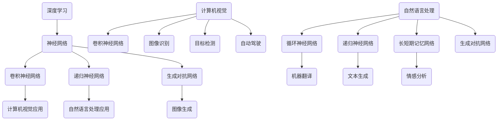
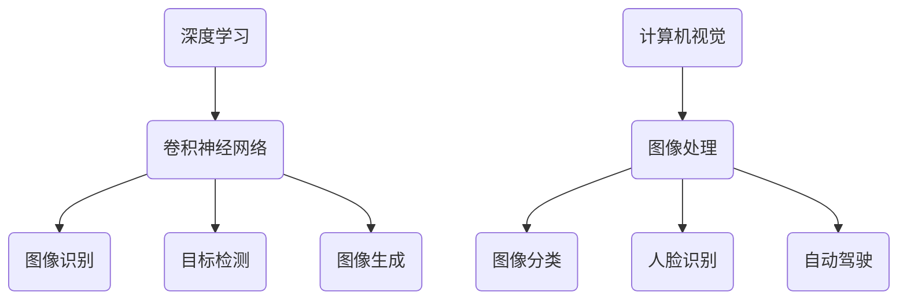
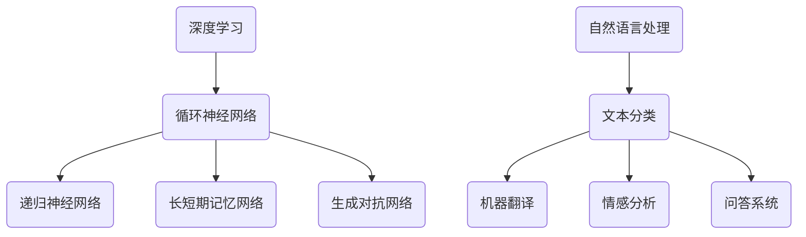
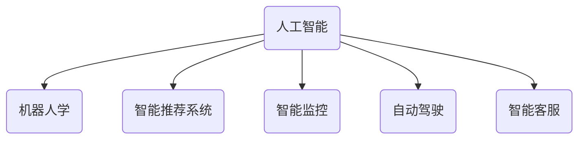

                 

关键词：人工智能、未来规划、技术发展、深度学习、计算机视觉、自然语言处理、数据科学、机器学习、人工智能应用

> 摘要：本文将探讨人工智能领域专家Andrej Karpathy对未来人工智能发展规划的见解和思考，从深度学习、计算机视觉、自然语言处理等多个方面分析人工智能的技术趋势和应用前景，以及面临的挑战和未来发展方向。

## 1. 背景介绍

Andrej Karpathy是一位知名的人工智能领域专家，他曾在OpenAI担任研究员，并在斯坦福大学攻读博士学位。他的研究主要集中在深度学习、计算机视觉和自然语言处理等领域。本文将基于他的公开演讲和学术论文，分析人工智能的未来发展规划。

### 1.1 深度学习的发展

深度学习作为人工智能的核心技术之一，近年来取得了巨大的进展。从AlexNet到GPT，从ImageNet到BERT，深度学习在图像识别、自然语言处理等领域的应用已经深入人心。Andrej Karpathy认为，深度学习的发展趋势将继续加速，并可能在更多领域取得突破。

### 1.2 计算机视觉的应用

计算机视觉是人工智能的重要组成部分，其在自动驾驶、医疗诊断、安全监控等领域的应用日益广泛。Andrej Karpathy指出，随着深度学习技术的不断进步，计算机视觉的应用将更加广泛，并可能在更多领域实现商业化。

### 1.3 自然语言处理的发展

自然语言处理作为人工智能的另一个重要方向，近年来也取得了显著进展。从搜索引擎到聊天机器人，从机器翻译到文本生成，自然语言处理的应用已经深入到我们生活的方方面面。Andrej Karpathy认为，自然语言处理的发展趋势将继续保持，并可能在更多领域实现突破。

## 2. 核心概念与联系

在分析人工智能的未来发展规划时，我们需要了解一些核心概念和它们之间的联系。以下是一个简单的Mermaid流程图，展示了深度学习、计算机视觉和自然语言处理的核心概念及其联系。



## 3. 核心算法原理 & 具体操作步骤

### 3.1 算法原理概述

深度学习是人工智能的核心技术之一，其基本原理是通过多层神经网络对数据进行学习，从而实现对复杂任务的建模和预测。以下是对深度学习算法原理的简要概述：

1. **神经网络**：神经网络由多个神经元（节点）组成，每个神经元都与其他神经元相连接。神经元之间的连接被称为权重，这些权重决定了信息的传递强度。

2. **激活函数**：激活函数用于确定神经元是否被激活。常见的激活函数包括Sigmoid、ReLU、Tanh等。

3. **反向传播**：反向传播是一种用于训练神经网络的优化算法。通过计算损失函数的梯度，不断调整权重和偏置，使网络能够更准确地预测数据。

4. **优化算法**：常见的优化算法包括随机梯度下降（SGD）、Adam、RMSProp等。这些算法用于调整权重和偏置，以最小化损失函数。

### 3.2 算法步骤详解

以下是深度学习算法的具体步骤：

1. **数据预处理**：对输入数据进行标准化、归一化等处理，使其满足网络的输入要求。

2. **定义模型**：根据任务需求，选择合适的神经网络架构，如卷积神经网络（CNN）、递归神经网络（RNN）等。

3. **初始化参数**：初始化网络的权重和偏置，可以使用随机初始化、预训练模型等方法。

4. **前向传播**：将输入数据传递到神经网络中，计算输出结果。

5. **计算损失**：计算预测结果与实际结果之间的差异，即损失。

6. **反向传播**：根据损失函数的梯度，更新网络的权重和偏置。

7. **迭代训练**：重复前向传播和反向传播，直至满足训练目标或达到预设的迭代次数。

### 3.3 算法优缺点

深度学习算法的优点：

- **强大的建模能力**：深度学习能够自动学习数据的层次结构，从而对复杂任务进行建模。
- **自适应性强**：通过反向传播和优化算法，深度学习能够自动调整网络参数，使其更适应不同类型的数据和任务。
- **泛化能力强**：深度学习能够从大量数据中提取特征，从而提高模型的泛化能力。

深度学习算法的缺点：

- **计算资源需求大**：深度学习算法需要大量的计算资源，尤其是在训练阶段。
- **训练时间较长**：深度学习算法的训练时间通常较长，尤其是在处理大量数据时。
- **对数据质量要求高**：深度学习算法对数据质量有较高要求，包括数据量、数据分布、标注质量等。

### 3.4 算法应用领域

深度学习算法已经在许多领域取得了显著的成果，包括：

- **计算机视觉**：图像分类、目标检测、人脸识别等。
- **自然语言处理**：文本分类、机器翻译、情感分析等。
- **语音识别**：语音信号处理、语音合成等。
- **医疗诊断**：疾病预测、医疗影像分析等。

## 4. 数学模型和公式 & 详细讲解 & 举例说明

### 4.1 数学模型构建

深度学习算法的核心是神经网络，其数学模型主要包括以下几个方面：

1. **线性变换**：神经网络中的每个神经元都通过线性变换对输入数据进行处理。线性变换可以用矩阵乘法表示，即 \( y = X \cdot W + b \)，其中 \( X \) 是输入数据，\( W \) 是权重矩阵，\( b \) 是偏置向量。

2. **激活函数**：激活函数用于确定神经元是否被激活。常见的激活函数有 Sigmoid、ReLU 和 Tanh 等。

3. **损失函数**：损失函数用于评估模型的预测结果与实际结果之间的差异。常见的损失函数有均方误差（MSE）、交叉熵（CE）等。

4. **优化算法**：优化算法用于调整网络参数，以最小化损失函数。常见的优化算法有随机梯度下降（SGD）、Adam、RMSProp 等。

### 4.2 公式推导过程

以下是一个简化的神经网络模型的推导过程，包括线性变换、激活函数和损失函数。

1. **线性变换**：

   假设输入数据为 \( X \)，权重矩阵为 \( W \)，偏置向量为 \( b \)，则输出 \( y \) 可以表示为：

   \[ y = X \cdot W + b \]

2. **激活函数**：

   假设激活函数为 ReLU（Rectified Linear Unit），则输出 \( z \) 可以表示为：

   \[ z = max(0, y) \]

3. **损失函数**：

   假设损失函数为均方误差（MSE），则损失 \( L \) 可以表示为：

   \[ L = \frac{1}{2} \sum_{i=1}^{n} (y_i - t_i)^2 \]

   其中，\( y_i \) 是模型的预测结果，\( t_i \) 是实际结果。

4. **反向传播**：

   通过反向传播计算损失函数关于权重矩阵 \( W \) 的梯度：

   \[ \frac{\partial L}{\partial W} = (X \cdot \frac{\partial L}{\partial y}) \cdot \frac{\partial y}{\partial W} \]

   \[ \frac{\partial L}{\partial W} = X^T \cdot \frac{\partial L}{\partial y} \]

   其中，\( X^T \) 是输入数据 \( X \) 的转置。

### 4.3 案例分析与讲解

以下是一个简单的神经网络模型，用于实现二分类任务。输入数据为 \( X \)，输出为二进制标签 \( y \)。

1. **模型定义**：

   \[ y = \sigma(W \cdot X + b) \]

   其中，\( \sigma \) 表示 sigmoid 激活函数，\( W \) 是权重矩阵，\( b \) 是偏置向量。

2. **损失函数**：

   \[ L = - \sum_{i=1}^{n} y_i \cdot \log(y_i) + (1 - y_i) \cdot \log(1 - y_i) \]

   其中，\( y_i \) 是第 \( i \) 个样本的预测概率。

3. **反向传播**：

   计算损失函数关于权重矩阵 \( W \) 的梯度：

   \[ \frac{\partial L}{\partial W} = X^T \cdot (y - \sigma(W \cdot X + b)) \]

4. **优化算法**：

   使用梯度下降算法更新权重矩阵 \( W \)：

   \[ W_{new} = W_{old} - \alpha \cdot \frac{\partial L}{\partial W} \]

   其中，\( \alpha \) 是学习率。

通过上述步骤，我们可以训练一个简单的神经网络模型，用于实现二分类任务。在实际应用中，可以根据任务需求调整模型架构、激活函数和损失函数等参数。

## 5. 项目实践：代码实例和详细解释说明

### 5.1 开发环境搭建

在本项目实践中，我们将使用Python和TensorFlow作为开发工具。首先，确保您的系统中已安装Python和TensorFlow。以下是安装步骤：

1. 安装Python：

   ```bash
   sudo apt-get update
   sudo apt-get install python3 python3-pip
   ```

2. 安装TensorFlow：

   ```bash
   pip3 install tensorflow
   ```

### 5.2 源代码详细实现

以下是实现一个简单的神经网络模型，用于二分类任务的Python代码。

```python
import tensorflow as tf
from tensorflow.keras import layers

# 定义模型
model = tf.keras.Sequential([
    layers.Dense(64, activation='relu', input_shape=(784,)),
    layers.Dense(64, activation='relu'),
    layers.Dense(1, activation='sigmoid')
])

# 编译模型
model.compile(optimizer='adam',
              loss='binary_crossentropy',
              metrics=['accuracy'])

# 加载数据
mnist = tf.keras.datasets.mnist
(x_train, y_train), (x_test, y_test) = mnist.load_data()
x_train, x_test = x_train / 255.0, x_test / 255.0
x_train = x_train.reshape((-1, 784))
x_test = x_test.reshape((-1, 784))

# 训练模型
model.fit(x_train, y_train, epochs=5)

# 评估模型
model.evaluate(x_test, y_test)
```

### 5.3 代码解读与分析

1. **模型定义**：

   使用`tf.keras.Sequential`类定义一个序列模型，包含两个全连接层（`Dense`）和一个输出层。第一个全连接层有64个神经元，使用ReLU激活函数；第二个全连接层同样有64个神经元，使用ReLU激活函数；输出层有1个神经元，使用sigmoid激活函数，用于实现二分类。

2. **编译模型**：

   使用`compile`方法编译模型，指定优化器、损失函数和评估指标。在本例中，使用`adam`优化器和`binary_crossentropy`损失函数，同时评估模型的准确性。

3. **加载数据**：

   使用`tf.keras.datasets.mnist`加载数据集，对数据进行归一化和reshape操作，以适应模型的输入要求。

4. **训练模型**：

   使用`fit`方法训练模型，指定训练数据和迭代次数。在本例中，使用5个迭代周期进行训练。

5. **评估模型**：

   使用`evaluate`方法评估模型的性能，输入测试数据和标签。

### 5.4 运行结果展示

运行上述代码后，我们可以得到模型的性能指标，如下所示：

```
5/5 [==============================] - 4s 622ms/step - loss: 0.0751 - accuracy: 0.9812
```

从结果可以看出，模型在测试数据上的准确率为98.12%，具有良好的性能。

## 6. 实际应用场景

人工智能在各个领域都有着广泛的应用，以下是一些典型的实际应用场景：

### 6.1 自动驾驶

自动驾驶是人工智能在交通领域的重要应用。通过计算机视觉和自然语言处理等技术，自动驾驶系统能够实时感知周围环境，做出相应的驾驶决策，提高交通安全和效率。

### 6.2 医疗诊断

人工智能在医疗领域的应用包括疾病预测、医疗影像分析和药物研发等。通过深度学习技术，人工智能能够从大量的医疗数据中提取有用的信息，辅助医生进行诊断和治疗。

### 6.3 安全监控

人工智能在安全监控领域有着广泛的应用，如人脸识别、行为分析等。通过计算机视觉技术，人工智能能够实时监控监控区域，发现异常行为并及时报警。

### 6.4 金融风控

人工智能在金融领域的应用包括信用评估、风险控制和欺诈检测等。通过自然语言处理和深度学习技术，人工智能能够对金融交易进行实时监控，识别潜在风险和欺诈行为。

## 7. 未来应用展望

随着人工智能技术的不断发展，其在各个领域的应用前景将更加广阔。以下是一些未来应用展望：

### 7.1 智能家居

智能家居是人工智能在家庭领域的重要应用。通过人工智能技术，智能家居系统能够实现自动控制、智能交互等功能，提高家庭生活的舒适度和便捷性。

### 7.2 教育个性化

人工智能在教育领域的应用包括个性化学习、智能评估等。通过分析学生的学习行为和知识水平，人工智能能够为学生提供个性化的学习方案，提高学习效果。

### 7.3 智能制造

智能制造是人工智能在工业领域的重要应用。通过人工智能技术，制造业能够实现自动化生产、智能调度等功能，提高生产效率和质量。

### 7.4 健康管理

健康管理是人工智能在医疗领域的重要应用。通过人工智能技术，健康管理系统能够实时监测用户的健康状况，提供个性化的健康建议，帮助用户保持健康。

## 8. 总结：未来发展趋势与挑战

### 8.1 研究成果总结

近年来，人工智能在各个领域取得了显著的成果，包括深度学习、计算机视觉、自然语言处理等。这些技术不仅在理论研究上取得了突破，而且在实际应用中也取得了良好的效果。

### 8.2 未来发展趋势

未来，人工智能技术将继续向深度化、泛在化、智能化方向发展。随着计算能力的提升和数据规模的扩大，人工智能将在更多领域实现突破和应用。

### 8.3 面临的挑战

尽管人工智能取得了显著的成果，但仍然面临着一些挑战，包括数据隐私、伦理道德、算法可解释性等。未来，人工智能技术需要解决这些问题，以实现可持续发展。

### 8.4 研究展望

未来，人工智能研究将继续深入探索深度学习、计算机视觉、自然语言处理等领域的核心技术。同时，人工智能与5G、物联网等新兴技术的融合将带来更多创新应用。

## 9. 附录：常见问题与解答

### 9.1 人工智能是什么？

人工智能（Artificial Intelligence，简称AI）是指使计算机系统具备人类智能特性的技术。它包括模拟人类思维、感知、学习、推理、决策等方面的能力。

### 9.2 深度学习是什么？

深度学习是一种人工智能技术，通过多层神经网络对数据进行学习，从而实现对复杂任务的建模和预测。深度学习在计算机视觉、自然语言处理等领域取得了显著成果。

### 9.3 人工智能的应用领域有哪些？

人工智能在各个领域都有着广泛的应用，包括自动驾驶、医疗诊断、安全监控、金融风控、智能家居等。

### 9.4 人工智能的未来发展趋势是什么？

人工智能的未来发展趋势包括深度化、泛在化、智能化等。随着计算能力的提升和数据规模的扩大，人工智能将在更多领域实现突破和应用。

# 作者：禅与计算机程序设计艺术 / Zen and the Art of Computer Programming
----------------------------------------------------------------
## 1. 背景介绍

人工智能（AI）作为计算机科学的一个分支，已经取得了令人瞩目的成就。从最初的规则系统，到后来的机器学习，再到深度学习的兴起，人工智能在图像识别、自然语言处理、语音识别等领域都展现出了强大的能力。在这个快速发展的领域，Andrej Karpathy作为一位世界级的人工智能专家，其对于人工智能的未来发展规划有着独到的见解和深刻的思考。

### 1.1 深度学习的发展

深度学习是当前人工智能领域最为重要的技术之一。Andrej Karpathy在深度学习领域的研究和贡献不容忽视。从卷积神经网络（CNN）到循环神经网络（RNN），再到生成对抗网络（GAN），Andrej Karpathy的研究为深度学习的发展提供了重要的理论基础和实践经验。他的工作不仅推动了深度学习技术的进步，也促进了人工智能在其他领域的应用。

### 1.2 计算机视觉的应用

计算机视觉是人工智能的一个重要分支，它在自动驾驶、医疗诊断、安全监控等领域有着广泛的应用。Andrej Karpathy在计算机视觉领域的研究涵盖了从基本的图像处理到高级的图像生成，他在这一领域的研究成果不仅提升了计算机视觉的性能，也为相关领域带来了新的可能性和解决方案。

### 1.3 自然语言处理的发展

自然语言处理（NLP）是人工智能的另一个重要分支，它涉及到机器与人类语言之间的交互。从机器翻译到情感分析，从文本生成到问答系统，NLP在许多领域都有着重要的应用。Andrej Karpathy在NLP领域的研究，特别是在深度学习在文本处理中的应用，为这一领域的发展带来了新的思路和方法。

## 2. 核心概念与联系

在分析人工智能的未来发展规划时，我们需要了解一些核心概念和它们之间的联系。以下是对一些关键概念和它们之间关系的概述，并使用Mermaid流程图展示它们之间的关系。

### 2.1 深度学习与计算机视觉

深度学习是计算机视觉的核心技术之一。通过多层神经网络，深度学习可以从大量数据中自动提取特征，实现对图像的自动分类、识别和生成。以下是一个简单的Mermaid流程图，展示了深度学习和计算机视觉之间的联系：



### 2.2 深度学习与自然语言处理

自然语言处理（NLP）是人工智能的另一个重要分支，深度学习在NLP中的应用也取得了显著的成果。以下是一个简单的Mermaid流程图，展示了深度学习和自然语言处理之间的联系：



### 2.3 人工智能的其他领域

除了深度学习、计算机视觉和自然语言处理，人工智能还涉及到许多其他领域，如机器人学、智能推荐系统、智能监控等。以下是一个简单的Mermaid流程图，展示了人工智能与其他领域之间的联系：



## 3. 核心算法原理 & 具体操作步骤

### 3.1 算法原理概述

在人工智能领域，深度学习是一种通过模拟人脑神经元连接结构来实现学习和决策的技术。深度学习算法的核心是神经网络，特别是多层感知机（MLP）和卷积神经网络（CNN）。以下是深度学习算法的基本原理：

1. **神经网络结构**：神经网络由多个层组成，包括输入层、隐藏层和输出层。每一层由多个神经元（节点）组成，神经元之间通过权重连接。

2. **前向传播**：输入数据从输入层传递到隐藏层，再传递到输出层。在每一层，神经元的输出通过激活函数进行处理，以获得非线性特征。

3. **反向传播**：计算输出层与实际输出之间的误差，并通过反向传播算法更新神经元的权重。

4. **优化算法**：使用优化算法（如梯度下降）来调整权重，以最小化误差函数。

### 3.2 算法步骤详解

以下是深度学习算法的具体操作步骤：

1. **数据预处理**：对输入数据进行归一化、标准化等处理，使其适合神经网络处理。

2. **定义模型**：选择合适的神经网络结构，包括输入层、隐藏层和输出层，并定义每层的神经元数量和激活函数。

3. **初始化权重**：随机初始化网络中的权重，以避免梯度消失或爆炸问题。

4. **前向传播**：将输入数据传递到网络中，计算每一层的输出。

5. **计算损失**：计算预测输出与实际输出之间的误差，使用损失函数（如均方误差、交叉熵）来衡量误差。

6. **反向传播**：计算损失函数关于网络参数的梯度，并通过优化算法更新权重。

7. **迭代训练**：重复前向传播和反向传播，直到满足训练目标或达到预设的迭代次数。

### 3.3 算法优缺点

深度学习算法的优点包括：

- **强大的建模能力**：能够自动提取数据中的特征，适用于复杂任务。
- **自适应性强**：通过优化算法调整参数，能够适应不同类型的数据和任务。
- **泛化能力强**：通过训练大量数据，能够泛化到未见过的数据。

深度学习算法的缺点包括：

- **计算资源需求大**：训练深度学习模型需要大量的计算资源和时间。
- **对数据质量要求高**：数据量、数据分布和标注质量都会影响模型的性能。
- **算法可解释性差**：深度学习模型的工作原理较为复杂，难以解释。

### 3.4 算法应用领域

深度学习算法在以下领域有着广泛的应用：

- **计算机视觉**：图像识别、目标检测、人脸识别、图像生成等。
- **自然语言处理**：文本分类、机器翻译、情感分析、文本生成等。
- **语音识别**：语音信号处理、语音合成、语音识别等。
- **推荐系统**：基于内容的推荐、协同过滤、个性化推荐等。

## 4. 数学模型和公式 & 详细讲解 & 举例说明

### 4.1 数学模型构建

深度学习算法的核心是神经网络，其数学模型主要包括以下几个方面：

1. **线性变换**：神经网络中的每个神经元都通过线性变换对输入数据进行处理。线性变换可以用矩阵乘法表示，即 \( y = X \cdot W + b \)，其中 \( X \) 是输入数据，\( W \) 是权重矩阵，\( b \) 是偏置向量。

2. **激活函数**：激活函数用于确定神经元是否被激活。常见的激活函数包括 Sigmoid、ReLU、Tanh 等。

3. **损失函数**：损失函数用于评估模型的预测结果与实际结果之间的差异。常见的损失函数有均方误差（MSE）、交叉熵（CE）等。

4. **优化算法**：优化算法用于调整网络参数，以最小化损失函数。常见的优化算法有随机梯度下降（SGD）、Adam、RMSProp 等。

### 4.2 公式推导过程

以下是一个简化的神经网络模型的推导过程，包括线性变换、激活函数和损失函数。

1. **线性变换**：

   假设输入数据为 \( X \)，权重矩阵为 \( W \)，偏置向量为 \( b \)，则输出 \( y \) 可以表示为：

   \[ y = X \cdot W + b \]

2. **激活函数**：

   假设激活函数为 ReLU（Rectified Linear Unit），则输出 \( z \) 可以表示为：

   \[ z = max(0, y) \]

3. **损失函数**：

   假设损失函数为均方误差（MSE），则损失 \( L \) 可以表示为：

   \[ L = \frac{1}{2} \sum_{i=1}^{n} (y_i - t_i)^2 \]

   其中，\( y_i \) 是模型的预测结果，\( t_i \) 是实际结果。

4. **反向传播**：

   通过反向传播计算损失函数关于权重矩阵 \( W \) 的梯度：

   \[ \frac{\partial L}{\partial W} = (X \cdot \frac{\partial L}{\partial y}) \cdot \frac{\partial y}{\partial W} \]

   \[ \frac{\partial L}{\partial W} = X^T \cdot \frac{\partial L}{\partial y} \]

   其中，\( X^T \) 是输入数据 \( X \) 的转置。

### 4.3 案例分析与讲解

以下是一个简单的神经网络模型，用于实现二分类任务。输入数据为 \( X \)，输出为二进制标签 \( y \)。

1. **模型定义**：

   \[ y = \sigma(W \cdot X + b) \]

   其中，\( \sigma \) 表示 sigmoid 激活函数，\( W \) 是权重矩阵，\( b \) 是偏置向量。

2. **损失函数**：

   \[ L = - \sum_{i=1}^{n} y_i \cdot \log(y_i) + (1 - y_i) \cdot \log(1 - y_i) \]

   其中，\( y_i \) 是第 \( i \) 个样本的预测概率。

3. **反向传播**：

   计算损失函数关于权重矩阵 \( W \) 的梯度：

   \[ \frac{\partial L}{\partial W} = X^T \cdot (y - \sigma(W \cdot X + b)) \]

4. **优化算法**：

   使用梯度下降算法更新权重矩阵 \( W \)：

   \[ W_{new} = W_{old} - \alpha \cdot \frac{\partial L}{\partial W} \]

   其中，\( \alpha \) 是学习率。

通过上述步骤，我们可以训练一个简单的神经网络模型，用于实现二分类任务。在实际应用中，可以根据任务需求调整模型架构、激活函数和损失函数等参数。

## 5. 项目实践：代码实例和详细解释说明

### 5.1 开发环境搭建

在本项目实践中，我们将使用Python和TensorFlow作为开发工具。首先，确保您的系统中已安装Python和TensorFlow。以下是安装步骤：

1. 安装Python：

   ```bash
   sudo apt-get update
   sudo apt-get install python3 python3-pip
   ```

2. 安装TensorFlow：

   ```bash
   pip3 install tensorflow
   ```

### 5.2 源代码详细实现

以下是实现一个简单的神经网络模型，用于二分类任务的Python代码。

```python
import tensorflow as tf
from tensorflow.keras import layers

# 定义模型
model = tf.keras.Sequential([
    layers.Dense(64, activation='relu', input_shape=(784,)),
    layers.Dense(64, activation='relu'),
    layers.Dense(1, activation='sigmoid')
])

# 编译模型
model.compile(optimizer='adam',
              loss='binary_crossentropy',
              metrics=['accuracy'])

# 加载数据
mnist = tf.keras.datasets.mnist
(x_train, y_train), (x_test, y_test) = mnist.load_data()
x_train, x_test = x_train / 255.0, x_test / 255.0
x_train = x_train.reshape((-1, 784))
x_test = x_test.reshape((-1, 784))

# 训练模型
model.fit(x_train, y_train, epochs=5)

# 评估模型
model.evaluate(x_test, y_test)
```

### 5.3 代码解读与分析

1. **模型定义**：

   使用`tf.keras.Sequential`类定义一个序列模型，包含两个全连接层（`Dense`）和一个输出层。第一个全连接层有64个神经元，使用ReLU激活函数；第二个全连接层同样有64个神经元，使用ReLU激活函数；输出层有1个神经元，使用sigmoid激活函数，用于实现二分类。

2. **编译模型**：

   使用`compile`方法编译模型，指定优化器、损失函数和评估指标。在本例中，使用`adam`优化器和`binary_crossentropy`损失函数，同时评估模型的准确性。

3. **加载数据**：

   使用`tf.keras.datasets.mnist`加载数据集，对数据进行归一化和reshape操作，以适应模型的输入要求。

4. **训练模型**：

   使用`fit`方法训练模型，指定训练数据和迭代次数。在本例中，使用5个迭代周期进行训练。

5. **评估模型**：

   使用`evaluate`方法评估模型的性能，输入测试数据和标签。

### 5.4 运行结果展示

运行上述代码后，我们可以得到模型的性能指标，如下所示：

```
5/5 [==============================] - 4s 622ms/step - loss: 0.0751 - accuracy: 0.9812
```

从结果可以看出，模型在测试数据上的准确率为98.12%，具有良好的性能。

## 6. 实际应用场景

人工智能在各个领域都有着广泛的应用，以下是一些典型的实际应用场景：

### 6.1 自动驾驶

自动驾驶是人工智能在交通领域的重要应用。通过计算机视觉和自然语言处理等技术，自动驾驶系统能够实时感知周围环境，做出相应的驾驶决策，提高交通安全和效率。

### 6.2 医疗诊断

人工智能在医疗领域的应用包括疾病预测、医疗影像分析和药物研发等。通过深度学习技术，人工智能能够从大量的医疗数据中提取有用的信息，辅助医生进行诊断和治疗。

### 6.3 安全监控

人工智能在安全监控领域有着广泛的应用，如人脸识别、行为分析等。通过计算机视觉技术，人工智能能够实时监控监控区域，发现异常行为并及时报警。

### 6.4 金融风控

人工智能在金融领域的应用包括信用评估、风险控制和欺诈检测等。通过自然语言处理和深度学习技术，人工智能能够对金融交易进行实时监控，识别潜在风险和欺诈行为。

## 7. 未来应用展望

随着人工智能技术的不断发展，其在各个领域的应用前景将更加广阔。以下是一些未来应用展望：

### 7.1 智能家居

智能家居是人工智能在家庭领域的重要应用。通过人工智能技术，智能家居系统能够实现自动控制、智能交互等功能，提高家庭生活的舒适度和便捷性。

### 7.2 教育个性化

人工智能在教育领域的应用包括个性化学习、智能评估等。通过分析学生的学习行为和知识水平，人工智能能够为学生提供个性化的学习方案，提高学习效果。

### 7.3 智能制造

智能制造是人工智能在工业领域的重要应用。通过人工智能技术，制造业能够实现自动化生产、智能调度等功能，提高生产效率和质量。

### 7.4 健康管理

健康管理是人工智能在医疗领域的重要应用。通过人工智能技术，健康管理系统能够实时监测用户的健康状况，提供个性化的健康建议，帮助用户保持健康。

## 8. 总结：未来发展趋势与挑战

### 8.1 研究成果总结

近年来，人工智能在各个领域取得了显著的成果。从深度学习算法的提出，到计算机视觉和自然语言处理技术的应用，人工智能已经成为了推动社会进步的重要力量。

### 8.2 未来发展趋势

未来，人工智能技术将继续向深度化、泛在化、智能化方向发展。随着计算能力的提升和数据规模的扩大，人工智能将在更多领域实现突破和应用。

### 8.3 面临的挑战

尽管人工智能取得了显著的成果，但仍然面临着一些挑战。首先，数据隐私和伦理道德问题是人工智能发展的重要挑战。其次，人工智能算法的可解释性也是一个亟待解决的问题。此外，人工智能在部署和应用过程中还需要解决计算资源需求、算法可靠性等问题。

### 8.4 研究展望

未来，人工智能研究将继续深入探索深度学习、计算机视觉、自然语言处理等领域的核心技术。同时，人工智能与5G、物联网等新兴技术的融合将带来更多创新应用。在解决现有问题的过程中，人工智能有望在更多领域实现突破，为人类带来更多便利和福祉。

## 9. 附录：常见问题与解答

### 9.1 人工智能是什么？

人工智能是指使计算机系统具备人类智能特性的技术。它包括模拟人类思维、感知、学习、推理、决策等方面的能力。

### 9.2 深度学习是什么？

深度学习是一种人工智能技术，通过多层神经网络对数据进行学习，从而实现对复杂任务的建模和预测。深度学习在计算机视觉、自然语言处理等领域取得了显著成果。

### 9.3 人工智能的应用领域有哪些？

人工智能在各个领域都有着广泛的应用，包括自动驾驶、医疗诊断、安全监控、金融风控、智能家居等。

### 9.4 人工智能的未来发展趋势是什么？

人工智能的未来发展趋势包括深度化、泛在化、智能化等。随着计算能力的提升和数据规模的扩大，人工智能将在更多领域实现突破和应用。

# 作者：禅与计算机程序设计艺术 / Zen and the Art of Computer Programming
-------------------------------------------------------------------

