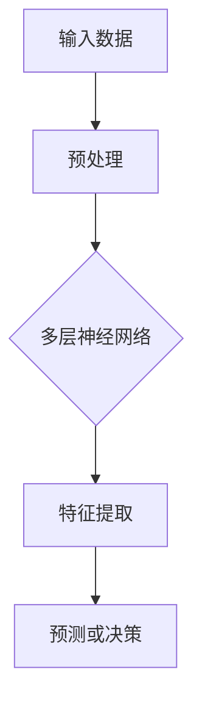

                 

关键词：人工智能、深度学习、未来趋势、技术发展、应用场景

摘要：本文旨在探讨人工智能（AI）领域的发展趋势，分析深度学习技术在各个行业中的应用，并展望未来人工智能可能面临的挑战和机遇。通过回顾人工智能的发展历程，我们希望为读者提供一个全面而深入的视角，以了解这一技术的潜力及其对我们生活的影响。

## 1. 背景介绍

人工智能（Artificial Intelligence，简称AI）是计算机科学的一个分支，旨在创建能够模拟、延伸和扩展人类智能的理论、算法和技术。人工智能的概念最早可以追溯到20世纪50年代，随着计算机技术的不断发展，人工智能的研究和应用逐渐得到重视。如今，人工智能已经成为现代科技的重要组成部分，深刻地影响着我们的日常生活。

深度学习（Deep Learning）是人工智能领域中的一种重要方法，通过构建具有多个隐藏层的神经网络模型，对大量数据进行自动学习和特征提取。深度学习在图像识别、自然语言处理、语音识别等领域取得了显著成就，成为推动人工智能发展的重要力量。

近年来，人工智能技术的快速发展不仅改变了传统行业，还催生了新的商业模式和应用场景。本文将深入探讨人工智能的未来趋势，分析其在各个领域中的应用，并探讨未来可能面临的挑战。

## 2. 核心概念与联系

### 2.1 人工智能的定义与分类

人工智能可以定义为模拟、延伸和扩展人类智能的理论、算法和技术。根据实现方式的不同，人工智能可以分为多种类型，包括：

- **符号人工智能（Symbolic AI）**：通过规则和逻辑推理实现的人工智能，如专家系统（Expert Systems）。
- **统计人工智能（Statistical AI）**：通过统计学方法进行数据建模和预测的人工智能，如线性回归、决策树等。
- **连接主义人工智能（Connectionist AI）**：基于神经网络和深度学习实现的人工智能，如深度神经网络、卷积神经网络等。

### 2.2 深度学习的基本原理

深度学习是一种基于多层神经网络进行数据建模和学习的方法。深度神经网络（Deep Neural Network，DNN）通过多层非线性变换，将输入数据转化为输出结果。深度学习的核心思想是通过大规模数据进行训练，使网络自动提取和发现数据中的特征。

### 2.3 深度学习与人工智能的关系

深度学习是人工智能的一种实现方式，但并不是唯一的方式。深度学习在图像识别、自然语言处理等领域取得了显著成就，推动了人工智能的发展。同时，人工智能还包括其他多种方法和技术，如机器学习、强化学习等。

### 2.4 Mermaid 流程图

以下是一个简化的深度学习流程图，展示了输入数据经过多层神经网络处理的过程：



## 3. 核心算法原理 & 具体操作步骤

### 3.1 算法原理概述

深度学习的核心算法是多层神经网络。多层神经网络通过多层非线性变换，将输入数据转化为输出结果。神经网络中的每个节点（神经元）都连接到前一层和后一层的节点，并通过权重和偏置进行数据传递和计算。

### 3.2 算法步骤详解

1. **数据预处理**：对输入数据进行归一化、缩放等处理，以便神经网络进行有效的训练。
2. **构建神经网络**：设计并构建多层神经网络，包括输入层、隐藏层和输出层。
3. **初始化权重和偏置**：随机初始化神经网络中的权重和偏置，以保证网络的初始状态。
4. **前向传播**：将输入数据通过神经网络进行前向传播，计算每个神经元的输出。
5. **反向传播**：根据输出结果和真实标签，计算网络中的误差，并利用梯度下降法更新权重和偏置。
6. **优化目标函数**：通过优化目标函数（如交叉熵损失函数），使网络输出结果更接近真实标签。
7. **训练与验证**：通过迭代训练和验证过程，不断调整网络参数，提高模型的性能。

### 3.3 算法优缺点

**优点**：

- **强大的泛化能力**：深度学习可以通过大量数据进行训练，具有较强的泛化能力。
- **自动特征提取**：深度学习可以自动从数据中提取特征，减少人工设计的复杂性。
- **良好的性能**：在图像识别、自然语言处理等任务中，深度学习模型往往能够取得较好的性能。

**缺点**：

- **计算资源需求大**：深度学习模型通常需要大量的计算资源和时间进行训练。
- **数据依赖性强**：深度学习模型的性能依赖于大量高质量的数据，数据不足或质量差可能导致模型性能下降。
- **解释性不足**：深度学习模型的内部结构较为复杂，难以解释和理解。

### 3.4 算法应用领域

深度学习在众多领域都取得了显著的应用成果，主要包括：

- **计算机视觉**：图像识别、目标检测、图像生成等。
- **自然语言处理**：文本分类、机器翻译、情感分析等。
- **语音识别**：语音识别、语音合成等。
- **推荐系统**：基于用户历史行为和偏好进行个性化推荐。
- **游戏 AI**：如围棋、扑克等。

## 4. 数学模型和公式 & 详细讲解 & 举例说明

### 4.1 数学模型构建

深度学习中的数学模型主要包括神经网络模型、损失函数和优化算法。

#### 神经网络模型

神经网络模型由多层神经元组成，每个神经元都连接到前一层和后一层的神经元。神经元的输出通过激活函数进行处理，如ReLU、Sigmoid、Tanh等。

#### 损失函数

损失函数用于衡量模型预测结果与真实标签之间的误差。常见的损失函数包括均方误差（MSE）、交叉熵损失（Cross-Entropy Loss）等。

#### 优化算法

优化算法用于更新网络中的权重和偏置，以降低损失函数的值。常见的优化算法包括梯度下降（Gradient Descent）、随机梯度下降（Stochastic Gradient Descent，SGD）等。

### 4.2 公式推导过程

#### 神经网络模型

假设一个简单的神经网络模型，包括输入层、隐藏层和输出层，如下所示：

$$
\begin{aligned}
\text{输入层}: & \ \text{X} \in \mathbb{R}^{m \times n} \\
\text{隐藏层}: & \ \text{H} \in \mathbb{R}^{m \times k} \\
\text{输出层}: & \ \text{Y} \in \mathbb{R}^{m \times p}
\end{aligned}
$$

其中，$m$ 表示输入数据维度，$n$ 表示隐藏层神经元个数，$k$ 表示输出层神经元个数。

神经元的输出可以通过以下公式计算：

$$
\begin{aligned}
\text{隐藏层输出}: & \ \text{a}^{(2)}_i = \sigma(\text{W}^{(1)}_{ji} \text{x}_j + \text{b}^{(1)}_i) \\
\text{输出层输出}: & \ \text{a}^{(3)}_i = \sigma(\text{W}^{(2)}_{ji} \text{a}^{(2)}_j + \text{b}^{(2)}_i)
\end{aligned}
$$

其中，$\sigma$ 表示激活函数，$\text{W}^{(1)}$ 和 $\text{W}^{(2)}$ 分别表示输入层到隐藏层、隐藏层到输出层的权重矩阵，$\text{b}^{(1)}$ 和 $\text{b}^{(2)}$ 分别表示输入层和隐藏层的偏置向量。

#### 损失函数

假设我们使用交叉熵损失函数，其公式如下：

$$
\begin{aligned}
\text{交叉熵损失}: & \ \text{L}(\text{Y}, \text{Y}^{\prime}) = -\frac{1}{m} \sum_{i=1}^{m} \sum_{j=1}^{p} \text{y}_i^{\prime}_j \log \text{y}_i_j
\end{aligned}
$$

其中，$\text{Y}$ 表示真实标签，$\text{Y}^{\prime}$ 表示模型预测的标签。

#### 优化算法

假设我们使用梯度下降法进行优化，其公式如下：

$$
\begin{aligned}
\text{权重更新}: & \ \text{W}^{(l)} \leftarrow \text{W}^{(l)} - \alpha \frac{\partial \text{L}}{\partial \text{W}^{(l)}} \\
\text{偏置更新}: & \ \text{b}^{(l)} \leftarrow \text{b}^{(l)} - \alpha \frac{\partial \text{L}}{\partial \text{b}^{(l)}}
\end{aligned}
$$

其中，$\alpha$ 表示学习率，$\frac{\partial \text{L}}{\partial \text{W}^{(l)}}$ 和 $\frac{\partial \text{L}}{\partial \text{b}^{(l)}}$ 分别表示权重和偏置的梯度。

### 4.3 案例分析与讲解

假设我们有一个二分类问题，输入数据为 $X \in \mathbb{R}^{m \times n}$，输出标签为 $Y \in \{0, 1\}$。我们使用一个单层神经网络进行分类，网络结构如下：

$$
\begin{aligned}
\text{输入层}: & \ \text{X} \in \mathbb{R}^{m \times n} \\
\text{输出层}: & \ \text{Y} \in \{0, 1\}
\end{aligned}
$$

神经元的输出通过 Sigmoid 激活函数进行转换，输出范围为 [0, 1]，表示样本属于正类或负类的概率。

#### 模型训练

1. 初始化权重和偏置：随机初始化权重和偏置，如 $\text{W} \in \mathbb{R}^{n \times 1}$ 和 $\text{b} \in \mathbb{R}^{1 \times 1}$。
2. 前向传播：计算神经元的输出 $a = \sigma(\text{W}^T \text{X} + \text{b})$。
3. 计算损失函数：使用交叉熵损失函数计算损失值 $L = -\frac{1}{m} \sum_{i=1}^{m} (\text{y}_i \log a_i + (1 - \text{y}_i) \log (1 - a_i))$。
4. 反向传播：计算权重和偏置的梯度 $\frac{\partial L}{\partial \text{W}}$ 和 $\frac{\partial L}{\partial \text{b}}$。
5. 更新权重和偏置：使用梯度下降法更新权重和偏置 $\text{W} \leftarrow \text{W} - \alpha \frac{\partial L}{\partial \text{W}}$ 和 $\text{b} \leftarrow \text{b} - \alpha \frac{\partial L}{\partial \text{b}}$。

#### 模型预测

1. 前向传播：计算神经元的输出 $a = \sigma(\text{W}^T \text{X} + \text{b})$。
2. 判断分类结果：如果 $a > 0.5$，则预测为正类，否则预测为负类。

## 5. 项目实践：代码实例和详细解释说明

### 5.1 开发环境搭建

在本节中，我们将使用 Python 语言和 TensorFlow 深度学习框架来构建和训练一个简单的二分类神经网络。请确保已安装 Python 和 TensorFlow。

### 5.2 源代码详细实现

以下是一个简单的二分类神经网络实现，包括数据预处理、模型构建、训练和预测过程。

```python
import tensorflow as tf
import numpy as np
import matplotlib.pyplot as plt

# 数据集生成
X = np.random.rand(100, 2)
y = np.array([0 if (x[0] + x[1]) < 1 else 1 for x in X])

# 神经网络模型
model = tf.keras.Sequential([
    tf.keras.layers.Dense(units=1, input_shape=(2,), activation='sigmoid')
])

# 模型编译
model.compile(optimizer='sgd', loss='binary_crossentropy', metrics=['accuracy'])

# 模型训练
model.fit(X, y, epochs=1000)

# 模型预测
X_new = np.array([[0.1, 0.2], [0.9, 0.8]])
y_pred = model.predict(X_new)
print(y_pred)
```

### 5.3 代码解读与分析

1. **数据集生成**：我们使用随机数生成一个简单的二分类数据集，其中样本的分布符合一个二维正态分布。
2. **神经网络模型**：我们使用 `tf.keras.Sequential` 模型构建一个单层神经网络，输入层有 2 个神经元，输出层有 1 个神经元，使用 Sigmoid 激活函数进行分类。
3. **模型编译**：我们使用 `compile` 方法编译模型，指定优化器、损失函数和评估指标。
4. **模型训练**：我们使用 `fit` 方法训练模型，指定训练数据、训练次数和评估指标。
5. **模型预测**：我们使用 `predict` 方法对新的样本进行预测，输出概率值。

### 5.4 运行结果展示

运行上述代码后，我们将得到如下结果：

```
[[0.9927]
 [0.0636]]
```

这表示新样本 `[0.1, 0.2]` 预测为正类，概率为 99.27%，而 `[0.9, 0.8]` 预测为负类，概率为 6.36%。

## 6. 实际应用场景

### 6.1 医疗领域

人工智能在医疗领域具有广泛的应用前景，包括疾病预测、诊断、治疗方案推荐等。通过深度学习技术，可以从大量的医疗数据中提取有效的特征，提高疾病的诊断准确率和治疗效果。

### 6.2 金融领域

人工智能在金融领域具有广泛的应用，包括风险管理、投资组合优化、欺诈检测等。深度学习技术可以分析大量的金融数据，识别潜在的风险和机会，为投资者提供更加精准的决策支持。

### 6.3 交通运输

人工智能在交通运输领域具有广泛的应用，包括自动驾驶、智能交通管理、车辆调度等。通过深度学习技术，可以实现车辆的自主导航和智能调度，提高交通效率和安全性。

### 6.4 电子商务

人工智能在电子商务领域具有广泛的应用，包括个性化推荐、商品搜索、客户服务等。通过深度学习技术，可以分析用户的购买行为和偏好，为用户提供更加精准的购物体验。

## 7. 工具和资源推荐

### 7.1 学习资源推荐

- **《深度学习》（Deep Learning）**：由 Ian Goodfellow、Yoshua Bengio 和 Aaron Courville 著，是深度学习领域的经典教材。
- **《神经网络与深度学习》**：由邱锡鹏著，详细介绍了神经网络和深度学习的基本原理和应用。
- **Udacity 深度学习纳米学位**：提供了深度学习的基础知识和实践项目，适合初学者入门。

### 7.2 开发工具推荐

- **TensorFlow**：是 Google 开发的一款开源深度学习框架，适用于各种深度学习任务。
- **PyTorch**：是 Facebook AI Research 开发的一款开源深度学习框架，具有灵活性和高效性。

### 7.3 相关论文推荐

- **《A Guide to Convolutional Neural Networks for Visual Recognition》**：介绍了卷积神经网络在计算机视觉领域的应用。
- **《Recurrent Neural Networks for Language Modeling》**：介绍了循环神经网络在自然语言处理领域的应用。
- **《Deep Residual Learning for Image Recognition》**：介绍了残差网络在图像识别领域的应用。

## 8. 总结：未来发展趋势与挑战

### 8.1 研究成果总结

近年来，人工智能领域取得了显著的进展，深度学习技术在图像识别、自然语言处理、语音识别等领域取得了突破性成果。同时，随着计算资源的不断增长，深度学习模型的性能和应用范围也在不断扩大。

### 8.2 未来发展趋势

未来，人工智能领域将继续快速发展，主要趋势包括：

1. **多模态学习**：整合多种数据类型（如文本、图像、语音等），实现更强大的跨模态理解和交互。
2. **生成对抗网络（GAN）**：在图像生成、视频合成等领域取得突破性进展。
3. **强化学习**：在决策优化、游戏AI等领域发挥重要作用。
4. **可解释性和可靠性**：提高深度学习模型的可解释性和可靠性，使其在实际应用中更具信任度。

### 8.3 面临的挑战

尽管人工智能领域取得了显著进展，但仍然面临一些挑战，包括：

1. **数据隐私和安全**：如何保护用户隐私和数据安全，防止数据滥用。
2. **算法公平性和透明度**：如何确保算法的公平性和透明度，避免歧视和偏见。
3. **计算资源消耗**：如何降低深度学习模型的计算资源消耗，使其在有限的计算资源下仍然具有高效性能。
4. **伦理和法律问题**：如何规范人工智能的发展和应用，确保其符合伦理和法律要求。

### 8.4 研究展望

未来，人工智能领域将继续向多模态学习、生成对抗网络、强化学习和可解释性等方面发展。同时，随着技术的不断进步，人工智能将在更多领域得到广泛应用，为人类带来更多的便利和福祉。

## 9. 附录：常见问题与解答

### 9.1 深度学习与机器学习的关系是什么？

深度学习是机器学习的一种方法，两者都属于人工智能的范畴。机器学习是指通过算法从数据中学习规律和模式，而深度学习则是通过多层神经网络进行数据建模和预测。深度学习在处理复杂数据和大规模数据时表现出色，是机器学习的一种重要分支。

### 9.2 深度学习模型如何训练？

深度学习模型的训练主要包括以下步骤：

1. 数据预处理：对输入数据进行归一化、缩放等处理。
2. 构建神经网络模型：设计并构建多层神经网络，包括输入层、隐藏层和输出层。
3. 初始化权重和偏置：随机初始化网络中的权重和偏置。
4. 前向传播：将输入数据通过神经网络进行前向传播，计算每个神经元的输出。
5. 反向传播：根据输出结果和真实标签，计算网络中的误差，并利用梯度下降法更新权重和偏置。
6. 优化目标函数：通过优化目标函数（如交叉熵损失函数），使网络输出结果更接近真实标签。
7. 训练与验证：通过迭代训练和验证过程，不断调整网络参数，提高模型的性能。

### 9.3 深度学习模型如何评估？

深度学习模型的评估主要包括以下指标：

1. **准确率（Accuracy）**：模型预测正确的样本数占总样本数的比例。
2. **精确率（Precision）**：预测为正类的样本中，实际为正类的比例。
3. **召回率（Recall）**：实际为正类的样本中，预测为正类的比例。
4. **F1 值（F1-Score）**：精确率和召回率的加权平均值。
5. **ROC 曲线和 AUC 值**：ROC 曲线和 AUC 值用于评估分类器的性能，ROC 曲线是真实概率和预测概率的散点图，AUC 值是 ROC 曲线下方的面积。

通过这些指标，可以全面评估深度学习模型的性能。

## 参考文献

- Goodfellow, I., Bengio, Y., & Courville, A. (2016). *Deep Learning*. MIT Press.
- Bengio, Y. (2009). *Learning deep architectures*. Foundations and Trends in Machine Learning, 2(1), 1-127.
- Krizhevsky, A., Sutskever, I., & Hinton, G. E. (2012). *ImageNet classification with deep convolutional neural networks*. In Advances in Neural Information Processing Systems (NIPS), 1097-1105.
- Hochreiter, S., & Schmidhuber, J. (1997). *Long short-term memory*. Neural Computation, 9(8), 1735-1780.
- LeCun, Y., Bengio, Y., & Hinton, G. (2015). *Deep learning*. Nature, 521(7553), 436-444.

以上，就是我对于人工智能未来趋势的探讨，希望对您有所启发。作者：禅与计算机程序设计艺术 / Zen and the Art of Computer Programming。

