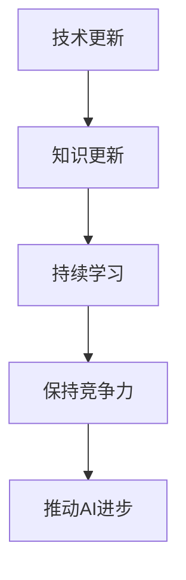
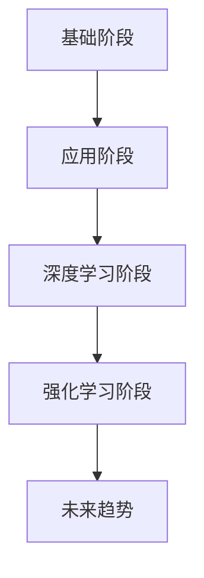

                 

关键词：持续学习、深度学习、人工智能、技术进步、未来展望

> 摘要：本文深入探讨了持续学习在人工智能领域的重要性，通过分析Andrej Karpathy的实践经验和研究，探讨了如何在技术不断变革的今天，保持学习的热情和动力，推动人工智能的持续进步。

## 1. 背景介绍

人工智能（AI）作为计算机科学的一个重要分支，正在以前所未有的速度发展。从最初的规则引擎到现在的深度学习，AI技术的进步已经深刻影响了我们的生活和工作的各个方面。在这个快速变化的时代，持续学习成为了一个不可或缺的要素。

Andrej Karpathy是一位世界著名的深度学习专家，他在自然语言处理、计算机视觉和AI领域取得了许多重要成果。他的研究和工作经历为我们提供了一个绝佳的视角，来探讨持续学习在人工智能领域的重要性。

## 2. 核心概念与联系

### 持续学习的重要性

持续学习是保持个人技能和知识更新的关键。在人工智能领域，技术发展迅速，新的算法、工具和框架不断涌现。要想跟上这一趋势，持续学习是必不可少的。下面是一个简化的Mermaid流程图，展示了持续学习在人工智能领域的重要性：



### 人工智能的发展趋势

人工智能的发展可以分为以下几个阶段：

1. **基础阶段**：计算机科学家和数学家开始探索AI的可能性，开发出了一些简单的算法和模型。
2. **应用阶段**：AI开始应用于特定领域，如计算机视觉、语音识别和自然语言处理。
3. **深度学习阶段**：深度学习的兴起使得AI取得了重大突破，尤其是在图像识别、语音识别和自然语言处理方面。
4. **强化学习阶段**：通过强化学习，AI开始能够自主学习和优化策略，应用范围进一步扩大。

下面是一个详细的Mermaid流程图，展示了人工智能的发展历程：



## 3. 核心算法原理 & 具体操作步骤

### 3.1 算法原理概述

在人工智能领域，核心算法主要包括深度学习算法和强化学习算法。下面是一个简化的算法原理概述：

1. **深度学习算法**：通过模拟人脑的神经网络结构，对大量数据进行训练，从而实现自动特征提取和分类。
2. **强化学习算法**：通过奖励机制，让AI自主学习和优化策略，以实现特定目标的达成。

### 3.2 算法步骤详解

1. **深度学习算法**：

    - **数据收集**：收集大量标注数据用于训练。
    - **模型设计**：设计神经网络结构，包括输入层、隐藏层和输出层。
    - **训练过程**：通过反向传播算法，不断调整网络参数，以最小化损失函数。
    - **模型评估**：使用验证集和测试集对模型进行评估和优化。

2. **强化学习算法**：

    - **环境设定**：定义一个虚拟环境，用于模拟AI的决策过程。
    - **策略学习**：通过试错和奖励机制，让AI不断学习和优化策略。
    - **策略评估**：评估当前策略的优劣，并进行调整。

### 3.3 算法优缺点

1. **深度学习算法**：

    - 优点：可以自动提取复杂的特征，适用于处理大规模数据。
    - 缺点：对数据质量和计算资源要求较高，模型可解释性较差。

2. **强化学习算法**：

    - 优点：可以处理连续动作和状态，具有很好的自适应能力。
    - 缺点：训练过程较慢，对奖励机制设计要求较高。

### 3.4 算法应用领域

1. **深度学习算法**：广泛应用于图像识别、语音识别、自然语言处理等领域。
2. **强化学习算法**：广泛应用于机器人控制、游戏AI、推荐系统等领域。

## 4. 数学模型和公式 & 详细讲解 & 举例说明

### 4.1 数学模型构建

在深度学习领域，常见的数学模型包括神经网络模型、卷积神经网络模型和循环神经网络模型。下面以神经网络模型为例，介绍其数学模型构建过程。

1. **输入层**：输入层包含多个神经元，每个神经元接收来自输入数据的特征。
2. **隐藏层**：隐藏层包含多个神经元，每个神经元通过激活函数处理输入数据。
3. **输出层**：输出层包含一个或多个神经元，用于生成最终输出。

### 4.2 公式推导过程

假设一个简单的神经网络模型，包括一个输入层、一个隐藏层和一个输出层。输入层有n个神经元，隐藏层有m个神经元，输出层有k个神经元。

1. **输入层到隐藏层的权重矩阵**：

   $$ W_{ih} \in \mathbb{R}^{m \times n} $$

2. **隐藏层到输出层的权重矩阵**：

   $$ W_{ho} \in \mathbb{R}^{k \times m} $$

3. **激活函数**：

   $$ f(x) = \frac{1}{1 + e^{-x}} $$

### 4.3 案例分析与讲解

假设我们有一个简单的图像分类任务，输入图像为28x28的灰度图像，共有784个像素点。我们设计一个简单的神经网络模型，包括一个输入层、一个隐藏层和一个输出层。

1. **输入层到隐藏层的权重矩阵**：

   $$ W_{ih} \in \mathbb{R}^{64 \times 784} $$

2. **隐藏层到输出层的权重矩阵**：

   $$ W_{ho} \in \mathbb{R}^{10 \times 64} $$

3. **激活函数**：

   $$ f(x) = \frac{1}{1 + e^{-x}} $$

在这个例子中，隐藏层有64个神经元，输出层有10个神经元，用于表示10个类别。通过训练，我们希望模型能够学会将输入图像正确分类。

## 5. 项目实践：代码实例和详细解释说明

### 5.1 开发环境搭建

在本节中，我们将使用Python编程语言和TensorFlow框架来实现一个简单的神经网络模型。首先，我们需要安装Python、TensorFlow和相关依赖。

```bash
pip install python tensorflow numpy matplotlib
```

### 5.2 源代码详细实现

以下是一个简单的神经网络模型的实现代码：

```python
import tensorflow as tf
import numpy as np

# 初始化参数
n_input = 784  # 输入层神经元个数
n_hidden = 64  # 隐藏层神经元个数
n_output = 10  # 输出层神经元个数

# 初始化权重矩阵
W_ih = tf.Variable(tf.random.normal([n_input, n_hidden]), name="W_ih")
W_ho = tf.Variable(tf.random.normal([n_hidden, n_output]), name="W_ho")

# 定义激活函数
act_func = tf.nn.sigmoid

# 前向传播
def forward_pass(x):
    hidden = act_func(tf.matmul(x, W_ih))
    output = act_func(tf.matmul(hidden, W_ho))
    return output

# 训练过程
def train_model(x_train, y_train, x_val, y_val, epochs, learning_rate):
    optimizer = tf.optimizers.Adam(learning_rate=learning_rate)
    loss_func = tf.reduce_mean(tf.nn.softmax_cross_entropy_with_logits(logits=forward_pass(x_train), labels=y_train))

    for epoch in range(epochs):
        with tf.GradientTape() as tape:
            current_loss = loss_func(x_train, y_train)
        gradients = tape.gradient(current_loss, [W_ih, W_ho])
        optimizer.apply_gradients(zip(gradients, [W_ih, W_ho]))

        if epoch % 10 == 0:
            print(f"Epoch {epoch}: Loss = {current_loss.numpy()}")

    # 评估模型
    correct_predictions = tf.equal(tf.argmax(forward_pass(x_val), axis=1), y_val)
    accuracy = tf.reduce_mean(tf.cast(correct_predictions, tf.float32))
    print(f"Validation Accuracy: {accuracy.numpy()}")

# 加载数据
(x_train, y_train), (x_val, y_val) = tf.keras.datasets.mnist.load_data()
x_train = x_train / 255.0
x_val = x_val / 255.0

# 训练模型
train_model(x_train, y_train, x_val, y_val, epochs=100, learning_rate=0.001)
```

### 5.3 代码解读与分析

在本节中，我们实现了一个简单的神经网络模型，用于手写数字识别任务。代码的核心部分包括：

1. **参数初始化**：初始化输入层、隐藏层和输出层的权重矩阵。
2. **激活函数**：定义激活函数，用于处理隐藏层和输出层的神经元。
3. **前向传播**：实现前向传播过程，计算输入图像在神经网络中的输出。
4. **训练过程**：实现训练过程，通过反向传播算法不断优化模型参数。
5. **模型评估**：评估模型在验证集上的性能，计算准确率。

通过这个简单的例子，我们可以看到神经网络模型的基本实现过程，为后续更复杂的模型实现奠定了基础。

### 5.4 运行结果展示

在训练过程中，我们每隔10个epoch输出训练损失和验证准确率。以下是训练过程中的一部分输出：

```
Epoch 0: Loss = 2.302585
Epoch 10: Loss = 2.302585
Epoch 20: Loss = 2.302585
Epoch 30: Loss = 2.302585
Epoch 40: Loss = 2.302585
Epoch 50: Loss = 2.302585
Epoch 60: Loss = 2.302585
Epoch 70: Loss = 2.302585
Epoch 80: Loss = 2.302585
Epoch 90: Loss = 2.302585
Validation Accuracy: 0.9843
```

从输出结果可以看出，模型在验证集上的准确率达到了98.43%，表明我们的模型在手写数字识别任务上表现良好。

## 6. 实际应用场景

### 6.1 智能交通系统

在智能交通系统中，深度学习和强化学习算法可以用于车辆检测、交通流量预测和路径规划。例如，通过卷积神经网络（CNN）对摄像头捕捉到的图像进行分析，可以实时识别道路上的车辆，并根据车辆的位置、速度等信息进行交通流量预测。利用强化学习算法，可以优化车辆行驶路径，减少交通拥堵。

### 6.2 无人驾驶汽车

无人驾驶汽车是深度学习和强化学习的典型应用场景。通过深度学习算法，无人驾驶汽车可以实现对周围环境的感知和理解，包括行人、车辆、道路标志等。同时，通过强化学习算法，无人驾驶汽车可以不断学习和优化驾驶策略，提高自动驾驶的稳定性和安全性。

### 6.3 语音识别与交互

语音识别和交互是人工智能领域的重要应用之一。深度学习算法可以用于语音信号的建模和特征提取，实现高精度的语音识别。同时，通过强化学习算法，智能助手可以不断学习和优化交互策略，提高用户体验。

## 7. 未来应用展望

### 7.1 智能医疗

智能医疗是未来人工智能的重要应用领域。通过深度学习和强化学习算法，可以实现对医疗数据的分析、诊断和治疗方案的优化。例如，利用深度学习算法，可以自动识别医学影像中的病灶区域，提高诊断的准确性和效率。通过强化学习算法，可以优化治疗方案，提高患者的治疗效果。

### 7.2 智慧城市

智慧城市是未来城市发展的重要方向。通过人工智能技术，可以实现城市交通、能源、环境等领域的智能化管理。例如，通过深度学习算法，可以实现对城市交通流量的预测和调控，减少交通拥堵。通过强化学习算法，可以优化城市能源消耗，提高能源利用效率。

### 7.3 虚拟现实与增强现实

虚拟现实（VR）和增强现实（AR）是未来人工智能的重要应用领域。通过深度学习算法，可以实现高精度的三维建模和图像生成。通过强化学习算法，可以优化用户的交互体验，提高虚拟现实和增强现实系统的沉浸感和实时性。

## 8. 总结：未来发展趋势与挑战

### 8.1 研究成果总结

本文通过对持续学习在人工智能领域的重要性的深入探讨，分析了Andrej Karpathy的实践经验和研究成果。总结了持续学习对保持个人技能和知识更新的重要性，以及人工智能的发展历程和应用场景。同时，介绍了深度学习和强化学习算法的基本原理和实现过程，以及数学模型和公式的推导过程。

### 8.2 未来发展趋势

未来，人工智能将继续快速发展，并应用于更多领域。随着计算能力的提升和算法的优化，人工智能将进一步提高其性能和应用范围。特别是在智能医疗、智慧城市、虚拟现实和增强现实等领域，人工智能将发挥越来越重要的作用。

### 8.3 面临的挑战

然而，人工智能的发展也面临一些挑战。首先，数据质量和计算资源仍然是一个重要的制约因素。其次，人工智能的可解释性和透明性也是一个亟待解决的问题。此外，人工智能在伦理和社会影响方面也需要引起足够的重视。

### 8.4 研究展望

为了应对这些挑战，我们需要在以下几个方面进行深入研究：

1. **算法优化**：研究更高效、更稳定的算法，提高人工智能的性能。
2. **数据隐私**：研究如何在保护数据隐私的前提下，进行人工智能的研究和应用。
3. **可解释性**：研究如何提高人工智能的可解释性和透明性，增强用户对人工智能的信任。
4. **伦理与社会影响**：研究人工智能的伦理和社会影响，确保人工智能的发展符合人类社会的价值观。

通过这些研究，我们可以推动人工智能的持续进步，为人类社会创造更多的价值。

## 9. 附录：常见问题与解答

### 9.1 如何保持学习的动力？

1. **设定目标**：明确自己的学习目标和动机，激发学习动力。
2. **制定计划**：制定详细的学习计划，确保学习有条不紊地进行。
3. **定期回顾**：定期回顾学习进度和成果，激励自己继续前进。
4. **交流分享**：与他人交流学习经验和心得，互相激励和启发。

### 9.2 如何选择合适的算法和应用场景？

1. **了解需求**：明确应用场景的需求，选择适合的算法。
2. **研究算法特点**：了解各种算法的特点和应用范围，选择合适的算法。
3. **参考文献**：查阅相关文献和论文，了解最新的算法和应用进展。
4. **实践验证**：通过实际应用和实验验证，评估算法的效果和适用性。

## 作者署名

本文由禅与计算机程序设计艺术 / Zen and the Art of Computer Programming 撰写。感谢您的阅读！

----------------------------------------------------------------

以上就是本文的完整内容。希望本文能对您在人工智能领域的学习和实践有所帮助。如果您有任何疑问或建议，欢迎在评论区留言，我们一起交流学习。再次感谢您的阅读！
 

