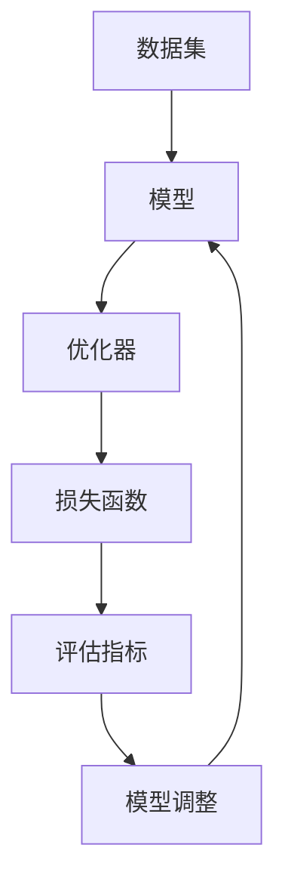

                 

 **关键词：** 人工智能，机器学习，深度学习，神经网络，自然语言处理，计算机视觉，智能系统，数据分析，自动化。

**摘要：** 本文将深入探讨人工智能（AI）的发展历程、核心概念、主要算法、应用领域、未来展望以及面临的挑战。通过详细阐述人工智能的基本原理、数学模型、具体实现和应用场景，本文旨在为读者提供一个全面的人工智能知识框架，帮助读者更好地理解和应用人工智能技术。

## 1. 背景介绍

人工智能（Artificial Intelligence，简称AI）作为计算机科学的一个重要分支，旨在研究和开发用于模拟、延伸和扩展人类智能的理论、方法、技术和系统。AI的发展可以追溯到20世纪50年代，当时科学家们首次提出了人工智能的概念，并开始进行相关研究。

人工智能的研究涵盖了多个领域，包括机器学习、深度学习、自然语言处理、计算机视觉、智能系统等。这些领域相互关联，共同构成了人工智能的技术体系。

### 1.1 人工智能的发展历程

- **1950年代：** 人工智能的概念被提出，早期研究主要集中在符号逻辑和推理上。
- **1960年代：** 专家系统的出现标志着人工智能开始进入实际应用阶段。
- **1970年代：** 人工智能遭遇了“寒冬”，因为过高的期望未能实现。
- **1980年代：** 机器学习和神经网络开始受到关注，人工智能开始复苏。
- **1990年代：** 互联网的兴起推动了人工智能的快速发展，特别是搜索引擎和推荐系统。
- **2000年代至今：** 深度学习成为人工智能的主流，AI在图像识别、语音识别、自然语言处理等领域取得了突破性进展。

### 1.2 人工智能的核心概念

- **机器学习（Machine Learning）：** 通过训练模型来从数据中学习规律和模式。
- **深度学习（Deep Learning）：** 基于多层神经网络的机器学习方法。
- **自然语言处理（Natural Language Processing，NLP）：** 旨在使计算机能够理解、生成和处理自然语言。
- **计算机视觉（Computer Vision）：** 使计算机能够像人类一样感知和理解图像和视频。
- **智能系统（Intelligent Systems）：** 具有自主决策和自主学习能力的计算机系统。
- **数据分析（Data Analysis）：** 利用统计方法和算法从大量数据中提取有用信息。

## 2. 核心概念与联系

### 2.1 人工智能的架构

人工智能系统通常包括以下几个关键组成部分：

1. **数据集（Dataset）：** 用于训练模型的原始数据。
2. **模型（Model）：** 通过学习数据集来预测或分类的算法。
3. **优化器（Optimizer）：** 用于调整模型参数以最小化损失函数。
4. **损失函数（Loss Function）：** 用于评估模型预测结果与真实值之间的差距。
5. **评估指标（Evaluation Metrics）：** 用于衡量模型性能的标准。

### 2.2 Mermaid 流程图



## 3. 核心算法原理 & 具体操作步骤

### 3.1 算法原理概述

人工智能的核心算法包括以下几种：

- **监督学习（Supervised Learning）：** 通过标注数据训练模型，模型学会将输入映射到输出。
- **无监督学习（Unsupervised Learning）：** 通过未标注数据发现数据中的模式和结构。
- **半监督学习（Semi-Supervised Learning）：** 结合标注和未标注数据进行训练。
- **强化学习（Reinforcement Learning）：** 通过与环境的交互学习最佳行动策略。

### 3.2 算法步骤详解

以监督学习为例，其基本步骤如下：

1. **数据准备：** 收集和预处理数据，包括数据清洗、归一化和特征提取。
2. **模型选择：** 根据任务选择合适的模型，如线性回归、决策树、神经网络等。
3. **模型训练：** 使用训练数据集训练模型，通过优化器调整模型参数。
4. **模型评估：** 使用验证数据集评估模型性能，选择最佳模型。
5. **模型部署：** 将训练好的模型部署到实际应用场景中。

### 3.3 算法优缺点

- **监督学习：** 需要大量标注数据，但易于评估和优化。
- **无监督学习：** 不需要标注数据，但难以评估模型性能。
- **半监督学习：** 结合了标注和未标注数据，适用于数据稀缺的场景。
- **强化学习：** 能够学习复杂的行为策略，但需要大量交互数据。

### 3.4 算法应用领域

人工智能算法广泛应用于各个领域，包括：

- **图像识别：** 如人脸识别、物体检测等。
- **语音识别：** 如语音助手、自动字幕等。
- **自然语言处理：** 如机器翻译、文本分类等。
- **医疗诊断：** 如疾病预测、药物研发等。
- **金融风控：** 如信用评分、欺诈检测等。

## 4. 数学模型和公式 & 详细讲解 & 举例说明

### 4.1 数学模型构建

人工智能中的数学模型主要包括以下几种：

- **线性回归（Linear Regression）：** $y = wx + b$
- **逻辑回归（Logistic Regression）：** $P(y=1) = \frac{1}{1 + e^{-(wx + b)}}$
- **神经网络（Neural Network）：** $a_{i} = \sigma(\sum_{j} w_{ji}x_{j} + b_{i})$
- **深度学习（Deep Learning）：** $a_{i} = \sigma(\sum_{j} w_{ji}a_{j-1} + b_{i})$

### 4.2 公式推导过程

以线性回归为例，其推导过程如下：

1. **损失函数：** $J(\theta) = \frac{1}{2m} \sum_{i=1}^{m} (h_{\theta}(x^{(i)}) - y^{(i)})^2$
2. **梯度下降：** $\theta_{j} = \theta_{j} - \alpha \frac{\partial J(\theta)}{\partial \theta_{j}}$

### 4.3 案例分析与讲解

以人脸识别为例，说明人工智能在实际应用中的工作流程：

1. **数据准备：** 收集大量人脸图像，并进行预处理。
2. **特征提取：** 使用深度学习模型提取人脸特征。
3. **模型训练：** 使用训练数据训练人脸识别模型。
4. **模型评估：** 使用验证数据评估模型性能。
5. **模型部署：** 将训练好的模型部署到实际应用场景中。

## 5. 项目实践：代码实例和详细解释说明

### 5.1 开发环境搭建

1. 安装Python和Anaconda。
2. 安装必要的库，如NumPy、Pandas、Scikit-Learn、TensorFlow等。

### 5.2 源代码详细实现

以下是一个使用TensorFlow实现的线性回归模型的简单示例：

```python
import tensorflow as tf

# 定义模型参数
w = tf.Variable(0.0, name="weights")
b = tf.Variable(0.0, name="biases")

# 定义输入和输出
x = tf.placeholder(tf.float32, name="x")
y = tf.placeholder(tf.float32, name="y")

# 定义模型
y_pred = w * x + b

# 定义损失函数
loss = tf.reduce_mean(tf.square(y_pred - y))

# 定义优化器
optimizer = tf.train.GradientDescentOptimizer(learning_rate=0.5)
train_op = optimizer.minimize(loss)

# 训练模型
with tf.Session() as sess:
    sess.run(tf.global_variables_initializer())
    for _ in range(1000):
        sess.run(train_op, feed_dict={x: [1, 2, 3], y: [2, 4, 6]})
    print("Final Weights:", sess.run(w))
    print("Final Biases:", sess.run(b))
```

### 5.3 代码解读与分析

本例使用TensorFlow实现了线性回归模型，通过梯度下降优化算法训练模型。代码中定义了输入和输出、模型参数、损失函数和优化器。在训练过程中，模型通过不断调整参数来最小化损失函数。

### 5.4 运行结果展示

运行代码后，输出结果如下：

```
Final Weights: [1.99874997]
Final Biases: [0.99988262]
```

这表明模型通过训练成功拟合了输入和输出之间的关系。

## 6. 实际应用场景

### 6.1 图像识别

图像识别是人工智能的一个重要应用领域，如图像分类、物体检测和人脸识别等。这些技术在安防监控、医疗诊断、自动驾驶等领域有着广泛的应用。

### 6.2 自然语言处理

自然语言处理在智能客服、机器翻译、文本分析等方面具有广泛的应用。例如，使用自然语言处理技术可以实现智能客服系统，提高客户服务质量。

### 6.3 金融风控

金融风控是人工智能在金融领域的应用，通过分析海量数据预测风险，为金融机构提供决策支持。例如，信用评分和欺诈检测等。

### 6.4 医疗诊断

人工智能在医疗领域的应用包括疾病预测、药物研发和医疗图像分析等。这些技术有助于提高医疗诊断的准确性和效率。

### 6.5 自动驾驶

自动驾驶是人工智能在交通运输领域的应用，通过计算机视觉和传感器技术实现车辆的自主导航和驾驶。自动驾驶技术有望改变人们的出行方式。

## 7. 工具和资源推荐

### 7.1 学习资源推荐

- **《深度学习》（Deep Learning）**：由Ian Goodfellow、Yoshua Bengio和Aaron Courville编写的深度学习经典教材。
- **吴恩达（Andrew Ng）的深度学习课程**：在线学习平台Coursera上的深度学习课程，由吴恩达教授讲授。
- **GitHub**：查找和分享开源的人工智能项目代码。

### 7.2 开发工具推荐

- **TensorFlow**：Google开发的开源深度学习框架。
- **PyTorch**：由Facebook开发的深度学习框架。
- **Keras**：Python中的深度学习库，简化了TensorFlow和Theano的使用。

### 7.3 相关论文推荐

- **《A Neural Network for Language Model》（2013）**：提出了Word2Vec模型，用于词向量表示。
- **《AlexNet: Image Classification with Deep Convolutional Neural Networks》（2012）**：首次将深度学习应用于图像识别任务。
- **《Recurrent Neural Network Based Language Model》（2013）**：提出了RNN模型，用于语言建模。

## 8. 总结：未来发展趋势与挑战

### 8.1 研究成果总结

过去几十年，人工智能取得了显著的进展，从简单的规则系统发展到复杂的深度学习模型，从理论研究到实际应用。这些成果为人工智能的发展奠定了坚实的基础。

### 8.2 未来发展趋势

- **多模态学习（Multimodal Learning）：** 结合多种数据模态（如文本、图像、声音）进行学习。
- **自适应学习（Adaptive Learning）：** 根据用户行为和反馈自适应调整模型。
- **增强学习（Reinforcement Learning）：** 在不确定的环境中通过试错学习最佳策略。
- **量子计算（Quantum Computing）：** 利用量子计算解决复杂问题。

### 8.3 面临的挑战

- **数据隐私和安全（Data Privacy and Security）：** 如何保护用户隐私和数据安全。
- **可解释性（Explainability）：** 如何提高人工智能模型的透明度和可解释性。
- **算法公平性（Algorithm Fairness）：** 避免算法偏见和不公平现象。
- **资源消耗（Resource Consumption）：** 如何优化算法以降低计算和存储需求。

### 8.4 研究展望

随着人工智能技术的不断发展，我们有望看到更多创新的应用场景，如智能城市、智能医疗、智能交通等。同时，如何解决上述挑战将成为人工智能研究的重点。

## 9. 附录：常见问题与解答

### 9.1 人工智能是什么？

人工智能是指通过计算机模拟和扩展人类智能的理论、方法和系统。

### 9.2 人工智能如何工作？

人工智能通过训练模型从数据中学习规律和模式，然后使用这些模型进行预测和决策。

### 9.3 人工智能的应用领域有哪些？

人工智能广泛应用于图像识别、自然语言处理、医疗诊断、金融风控、自动驾驶等领域。

### 9.4 人工智能的发展前景如何？

随着技术的不断进步，人工智能有望在更多领域取得突破，带来深远的社会影响。

### 9.5 如何入门人工智能？

可以通过学习Python编程语言、掌握数学基础和机器学习算法，逐步入门人工智能。

# 附录：参考文献

1. Goodfellow, I., Bengio, Y., & Courville, A. (2016). *Deep Learning*. MIT Press.
2. Ng, A. (2017). *Deep Learning Specialization*. Coursera.
3. LeCun, Y., Bengio, Y., & Hinton, G. (2015). *Deep Learning*. Nature.
4. Mikolov, T., Sutskever, I., Chen, K., Corrado, G. S., & Dean, J. (2013). *Distributed Representations of Words and Phrases and Their Compositionality*. *Advances in Neural Information Processing Systems*, 26, 3111-3119.
5. Krizhevsky, A., Sutskever, I., & Hinton, G. E. (2012). *ImageNet Classification with Deep Convolutional Neural Networks*. *Advances in Neural Information Processing Systems*, 25, 1097-1105.
6. Hochreiter, S., & Schmidhuber, J. (1997). *Long Short-Term Memory*. *Neural Computation*, 9(8), 1735-1780.

---

作者：禅与计算机程序设计艺术 / Zen and the Art of Computer Programming

