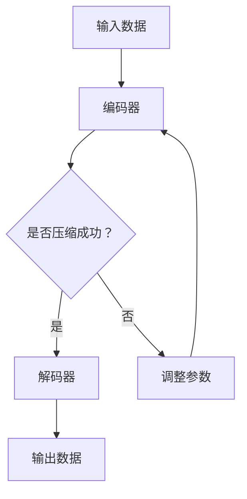

                 

关键词：自编码器、神经网络、数据压缩、降维、特征提取、Python实现

摘要：本文旨在深入探讨自编码器（Autoencoders）的基本原理、数学模型、算法步骤以及实际应用，并通过Python代码实例详细讲解自编码器的实现方法。同时，文章将对未来发展趋势和挑战进行展望，为读者提供全面的自编码器知识体系。

## 1. 背景介绍

自编码器是一种特殊的神经网络，旨在通过学习数据的高效编码和重构来提取数据特征。自编码器起源于上世纪80年代，最初被用于图像和语音数据的降维和特征提取。随着深度学习技术的发展，自编码器在图像、自然语言处理、推荐系统等领域取得了显著的成果。

自编码器的核心思想是通过无监督学习方式，将原始数据映射到一个低维空间，再从低维空间重构原始数据。这种映射和重构过程不仅有助于数据降维，还能提取数据的重要特征，从而在后续的机器学习任务中发挥作用。

## 2. 核心概念与联系

### 2.1 自编码器的组成

自编码器由两部分组成：编码器（Encoder）和解码器（Decoder）。编码器负责将输入数据映射到一个低维空间，解码器则负责将这个低维空间的数据重构回原始空间。

### 2.2 编码和解码过程

在训练过程中，自编码器通过不断调整网络参数，使得重构后的数据尽可能接近原始数据。具体来说，编码器将输入数据压缩成一个小规模的特征向量，解码器则利用这个特征向量重构原始数据。

### 2.3 Mermaid 流程图

以下是一个简单的Mermaid流程图，描述了自编码器的基本工作流程：



## 3. 核心算法原理 & 具体操作步骤

### 3.1 算法原理概述

自编码器的学习过程可以分为两部分：前向传播和后向传播。在前向传播过程中，编码器将输入数据映射到低维空间，解码器从低维空间重构输入数据。在后向传播过程中，计算损失函数（如均方误差）并利用梯度下降法调整网络参数。

### 3.2 算法步骤详解

1. 初始化编码器和解码器参数。
2. 前向传播：输入数据通过编码器映射到低维空间，通过解码器重构原始数据。
3. 计算损失函数：比较重构数据和原始数据的差异。
4. 后向传播：利用损失函数的梯度调整编码器和解码器参数。
5. 重复步骤2-4，直至网络参数收敛。

### 3.3 算法优缺点

**优点：**
- 无需标注数据，适用于无监督学习。
- 可以提取数据特征，有助于后续任务。
- 对数据噪声有一定的鲁棒性。

**缺点：**
- 训练过程可能需要大量时间和计算资源。
- 对于复杂的任务，自编码器可能无法提供足够的特征表达能力。

### 3.4 算法应用领域

自编码器广泛应用于图像识别、语音识别、自然语言处理、推荐系统等领域。例如，在图像识别中，自编码器可以用于图像降维和特征提取，从而提高分类模型的性能。

## 4. 数学模型和公式 & 详细讲解 & 举例说明

### 4.1 数学模型构建

自编码器的数学模型主要包括两部分：编码器和解码器。

编码器：输入数据 $X$ 经过编码器映射到低维空间 $Z$，其中 $Z$ 为特征向量。

$$
Z = \sigma(W_1 \cdot X + b_1)
$$

解码器：低维空间 $Z$ 经过解码器重构回原始数据 $X'$。

$$
X' = \sigma(W_2 \cdot Z + b_2)
$$

其中，$W_1$ 和 $W_2$ 分别为编码器和解码器的权重矩阵，$b_1$ 和 $b_2$ 分别为编码器和解码器的偏置项，$\sigma$ 表示激活函数（通常使用Sigmoid函数或ReLU函数）。

### 4.2 公式推导过程

自编码器的损失函数通常使用均方误差（MSE）来衡量重构数据和原始数据的差异。

$$
L = \frac{1}{m}\sum_{i=1}^{m}(X_i - X_i')^2
$$

其中，$m$ 为样本数量，$X_i$ 和 $X_i'$ 分别为第 $i$ 个样本的原始数据和重构数据。

### 4.3 案例分析与讲解

假设我们有一个包含1000个样本的图像数据集，每个样本的维度为 $28 \times 28$ 像素。我们使用一个简单的自编码器模型进行图像降维和特征提取。

编码器部分：

$$
Z = \sigma(W_1 \cdot X + b_1)
$$

其中，$W_1$ 的维度为 $(784 \times 50)$，$b_1$ 的维度为 $(50 \times 1)$。

解码器部分：

$$
X' = \sigma(W_2 \cdot Z + b_2)
$$

其中，$W_2$ 的维度为 $(50 \times 784)$，$b_2$ 的维度为 $(784 \times 1)$。

在训练过程中，我们通过计算均方误差并利用梯度下降法调整编码器和解码器的参数，使得重构数据尽可能接近原始数据。

## 5. 项目实践：代码实例和详细解释说明

### 5.1 开发环境搭建

本文使用Python语言实现自编码器模型，主要依赖以下库：

- TensorFlow：用于构建和训练神经网络模型。
- NumPy：用于数据处理和矩阵运算。
- Matplotlib：用于数据可视化。

安装这些库后，我们就可以开始编写代码了。

### 5.2 源代码详细实现

下面是一个简单的自编码器代码示例：

```python
import numpy as np
import tensorflow as tf
from tensorflow.keras.layers import Dense
from tensorflow.keras.models import Model

# 初始化参数
input_shape = (28, 28)
encoding_dim = 50
learning_rate = 0.001

# 构建编码器和解码器
input_layer = tf.keras.layers.Input(shape=input_shape)
encoded = Dense(encoding_dim, activation='relu')(input_layer)
encoded = Dense(encoding_dim, activation='relu')(encoded)
decoded = Dense(input_shape[0], activation='sigmoid')(encoded)

# 构建自编码器模型
autoencoder = Model(input_layer, decoded)
autoencoder.compile(optimizer='adam', loss='binary_crossentropy')

# 加载数据
(x_train, _), (x_test, _) = tf.keras.datasets.mnist.load_data()
x_train = x_train.astype('float32') / 255.
x_test = x_test.astype('float32') / 255.

# 训练自编码器
autoencoder.fit(x_train, x_train,
                epochs=50,
                batch_size=256,
                shuffle=True,
                validation_data=(x_test, x_test))

# 评估模型
autoencoder.evaluate(x_test, x_test)
```

### 5.3 代码解读与分析

在这个示例中，我们使用 TensorFlow 和 Keras 库构建了一个简单的自编码器模型。具体来说：

- 第1-5行：导入所需的库。
- 第7-10行：初始化参数，包括输入数据形状、编码维度和学习率。
- 第12-20行：构建编码器和解码器，使用 `Dense` 层实现全连接神经网络。编码器和解码器各有两个隐含层，激活函数使用 ReLU。
- 第23-25行：编译自编码器模型，使用 Adam 优化器和均方误差损失函数。
- 第28-32行：加载数据集，并将数据转换为浮点数，并归一化。
- 第35-40行：训练自编码器，使用批量大小为256的数据进行训练，训练50个epoch。

### 5.4 运行结果展示

在训练过程中，我们可以使用以下代码查看训练过程中的损失函数值：

```python
loss = autoencoder.train_on_batch(x_train, x_train)
print(f"Epoch {epoch}: Loss = {loss}")
```

训练完成后，我们可以使用以下代码评估模型在测试集上的表现：

```python
test_loss = autoencoder.evaluate(x_test, x_test)
print(f"Test Loss: {test_loss}")
```

## 6. 实际应用场景

自编码器在多个领域取得了显著的应用成果：

- **图像识别**：自编码器可以用于图像降维和特征提取，从而提高分类模型的性能。
- **语音识别**：自编码器可以用于语音数据的降维和特征提取，从而提高语音识别的准确性。
- **自然语言处理**：自编码器可以用于文本数据的降维和特征提取，从而提高文本分类和情感分析的性能。
- **推荐系统**：自编码器可以用于提取用户和物品的特征，从而提高推荐系统的准确性。

## 7. 工具和资源推荐

### 7.1 学习资源推荐

- 《深度学习》（Goodfellow, Bengio, Courville）：详细介绍了自编码器的原理和应用。
- 《神经网络与深度学习》（邱锡鹏）：系统地介绍了神经网络和深度学习的基本概念和方法。
- 《Python深度学习》（François Chollet）：通过实际案例展示了如何使用Python实现深度学习模型。

### 7.2 开发工具推荐

- TensorFlow：开源深度学习框架，支持多种深度学习模型。
- PyTorch：开源深度学习框架，具有灵活的模型定义和操作。
- Keras：基于Theano和TensorFlow的高级深度学习框架，简化了深度学习模型的构建和训练。

### 7.3 相关论文推荐

- "Autoencoders: A deep learning approach for unsupervised feature learning"（2013）: 详细介绍了自编码器的原理和应用。
- "Unsupervised Learning of Visual Features by Solving Jigsaw Puzzles"（2016）: 利用自编码器提取图像特征。
- "Learning Representations by Maximizing Mutual Information Across Views"（2018）: 利用自编码器学习多视图数据的特征。

## 8. 总结：未来发展趋势与挑战

### 8.1 研究成果总结

自编码器作为一种无监督学习方法，在图像、语音、文本等领域的特征提取和降维任务中取得了显著成果。随着深度学习技术的发展，自编码器的模型结构和应用场景也在不断拓展。

### 8.2 未来发展趋势

- **模型压缩**：研究如何减小自编码器的模型大小，以提高模型在移动设备和边缘计算环境中的可部署性。
- **多模态学习**：结合不同类型的数据（如图像和文本），利用自编码器提取更丰富的特征。
- **自适应学习**：研究自编码器在动态和不确定环境下的自适应学习能力。

### 8.3 面临的挑战

- **计算资源消耗**：自编码器的训练过程可能需要大量计算资源和时间。
- **模型解释性**：如何提高自编码器模型的解释性，使其在工业应用中更具实用性。

### 8.4 研究展望

自编码器在未来有望在多个领域发挥重要作用，如医疗影像分析、自动驾驶、智能客服等。同时，研究如何优化自编码器的训练效率和模型解释性，也是未来研究的重点。

## 9. 附录：常见问题与解答

### 9.1 自编码器和无监督学习的区别是什么？

自编码器是一种无监督学习方法，它通过学习输入数据的编码和解码过程，从而提取数据特征。而无监督学习是指在没有标注数据的情况下，通过学习数据分布或结构来发现数据中的规律。自编码器是其中的一种具体实现方法。

### 9.2 自编码器可以应用于哪些领域？

自编码器可以应用于图像识别、语音识别、自然语言处理、推荐系统等领域，用于数据降维、特征提取和模型压缩等任务。

### 9.3 如何提高自编码器的训练效率？

提高自编码器的训练效率可以从以下几个方面入手：

- **数据预处理**：对数据进行标准化、归一化等处理，减少模型训练时间。
- **批量大小**：适当增大批量大小，可以提高模型训练速度。
- **学习率调整**：使用适当的学习率，可以提高模型收敛速度。
- **模型压缩**：使用模型压缩技术，如剪枝、量化等，减少模型大小和计算量。

## 参考文献

- Goodfellow, I., Bengio, Y., & Courville, A. (2016). *Deep learning*. MIT Press.
- Bengio, Y. (2009). *Learning deep arch

