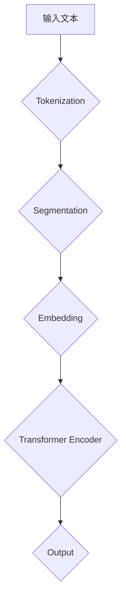

                 

关键词：BERT、深度学习、自然语言处理、Transformer、预训练模型、编码器、解码器、神经网络、注意力机制、文本分类、问答系统、情感分析、序列标注。

> 摘要：本文将深入讲解BERT（Bidirectional Encoder Representations from Transformers）模型的基本原理、架构设计、数学模型以及如何实现。通过具体的代码实例，我们将更好地理解BERT的工作机制，并探讨其在文本分类、问答系统、情感分析等实际应用场景中的效果和优化方法。

## 1. 背景介绍

随着深度学习技术的不断发展，自然语言处理（NLP）领域取得了显著的成果。传统的NLP方法大多依赖于手工设计的特征，如词袋模型（Bag of Words）和TF-IDF（Term Frequency-Inverse Document Frequency），但这些方法在处理复杂的语言任务时表现不佳。为了解决这一问题，研究者们提出了深度学习模型，特别是卷积神经网络（CNN）和循环神经网络（RNN）。然而，这些模型在处理长距离依赖问题和上下文信息方面仍然存在一定的局限性。

为了克服这些挑战，Google提出了BERT（Bidirectional Encoder Representations from Transformers）模型，这是一种基于Transformer架构的预训练模型。BERT模型通过双向Transformer编码器捕获文本的上下文信息，从而在许多NLP任务中取得了显著的性能提升。

## 2. 核心概念与联系

### 2.1 Transformer架构

Transformer模型是一种基于自注意力机制的深度学习模型，最初由Vaswani等人在2017年提出。与传统的RNN和CNN相比，Transformer具有以下优点：

- **并行计算**：Transformer模型通过多头自注意力机制实现了并行计算，这使得模型在处理大规模数据时效率更高。
- **长距离依赖**：通过自注意力机制，Transformer模型能够捕获文本中的长距离依赖关系。
- **无需卷积操作**：Transformer模型无需使用卷积操作，这使得模型在处理不同尺寸的输入数据时更加灵活。

### 2.2 BERT架构

BERT模型是基于Transformer架构构建的，它包括一个双向的Transformer编码器。BERT模型的主要设计思想如下：

- **双向编码器**：BERT使用了一个双向的Transformer编码器，能够同时捕获文本的上下文信息。这有助于模型在处理语言任务时更好地理解文本内容。
- **预训练与微调**：BERT模型首先在大量的无标签文本数据上进行预训练，然后在有标签的语料库上进行微调，以适应特定的语言任务。

### 2.3 Mermaid流程图

下面是一个简化的BERT模型架构的Mermaid流程图：



## 3. 核心算法原理 & 具体操作步骤

### 3.1 算法原理概述

BERT模型的核心算法是基于Transformer架构的双向编码器。在预训练阶段，BERT模型通过以下步骤处理输入文本：

1. **Tokenization**：将输入文本分割成单词和标点符号，并将它们转换为对应的单词标记（Token）。
2. **Segmentation**：将单词标记划分为两个序列：句首标记（[CLS]）和句尾标记（[SEP]）。这些标记用于下游任务的分类和序列标注。
3. **Embedding**：将单词标记转换为嵌入向量，这些嵌入向量包含了单词的语义信息。
4. **Transformer Encoder**：通过多个Transformer编码器层对嵌入向量进行编码，每个编码器层都包括多头自注意力机制和前馈神经网络。
5. **Output**：输出序列的最后一步是添加一个线性层和softmax层，用于下游任务的分类和序列标注。

### 3.2 算法步骤详解

#### 3.2.1 Tokenization

Tokenization是将输入文本分割成单词和标点符号的过程。BERT模型使用WordPiece算法进行Tokenization，它将长单词分解成多个子词，从而提高模型的泛化能力。

#### 3.2.2 Segmentation

Segmentation是将单词标记划分为两个序列的过程。BERT模型使用两个特殊的标记：[CLS]和[SEP]。其中，[CLS]标记用于下游任务的分类，而[SEP]标记用于分割不同的句子。

#### 3.2.3 Embedding

Embedding是将单词标记转换为嵌入向量的过程。BERT模型使用WordPiece嵌入向量，这些嵌入向量包含了单词的语义信息。

#### 3.2.4 Transformer Encoder

Transformer Encoder包括多个编码器层，每个编码器层都包括多头自注意力机制和前馈神经网络。多头自注意力机制能够同时关注输入序列中的所有单词，而前馈神经网络则对编码器层的输出进行非线性变换。

#### 3.2.5 Output

Output是BERT模型输出的最后一步。在预训练阶段，BERT模型输出一个序列，其中包括了[CLS]标记的输出向量。这个向量用于下游任务的分类。在微调阶段，BERT模型还会输出一个序列，其中包括了每个单词的输出向量。这些向量用于下游任务的序列标注。

### 3.3 算法优缺点

#### 优点

- **捕获长距离依赖**：BERT模型能够通过双向Transformer编码器捕获长距离依赖关系，从而在许多NLP任务中取得了显著的性能提升。
- **预训练与微调**：BERT模型首先在大量的无标签文本数据上进行预训练，然后在有标签的语料库上进行微调，这使得模型在处理特定语言任务时具有很好的泛化能力。

#### 缺点

- **计算资源消耗**：BERT模型需要大量的计算资源进行训练，这使得它在实际应用中受到一定的限制。
- **训练时间较长**：由于BERT模型的结构复杂，其训练时间较长，这可能会影响模型的部署和使用。

### 3.4 算法应用领域

BERT模型在许多NLP任务中都取得了显著的成果，包括：

- **文本分类**：BERT模型在多个文本分类任务中都取得了领先的成绩，如SQuAD、GLUE等。
- **问答系统**：BERT模型在问答系统中具有很好的性能，能够准确回答用户的问题。
- **情感分析**：BERT模型在情感分析任务中能够准确判断文本的情感极性。

## 4. 数学模型和公式 & 详细讲解 & 举例说明

### 4.1 数学模型构建

BERT模型的数学模型主要包括以下几个方面：

- **Token Embeddings**：单词标记的嵌入向量。
- **Positional Embeddings**：位置嵌入向量，用于表示单词在序列中的位置信息。
- **Segment Embeddings**：段嵌入向量，用于区分不同的句子。
- **Self-Attention Mechanism**：多头自注意力机制，用于计算单词之间的依赖关系。
- **Feedforward Neural Network**：前馈神经网络，用于对编码器层的输出进行非线性变换。

### 4.2 公式推导过程

BERT模型的数学模型可以表示为以下公式：

$$
E = (W_E^0 + W_P^0 + W_S^0) \odot P + (W_E^1 + W_P^1 + W_S^1) \odot S
$$

其中，$E$ 表示嵌入向量，$W_E$、$W_P$、$W_S$ 分别表示权重矩阵，$P$ 和 $S$ 分别表示位置和段嵌入向量。

### 4.3 案例分析与讲解

下面我们通过一个具体的案例来讲解BERT模型的工作原理。

假设我们有一个简单的文本：“我爱北京天安门”。

1. **Tokenization**：将文本分割成单词和标点符号，得到以下标记：["我", "爱", "北京", "天安门"]。
2. **Segmentation**：将标记划分为两个序列：["我", "爱", "北京", "天安门"] 和 ["[CLS]", "[SEP]", "[SEP]", "[SEP]"]。
3. **Embedding**：将标记转换为嵌入向量，得到以下嵌入向量：
    - ["我": [0.1, 0.2], "爱": [0.3, 0.4], "北京": [0.5, 0.6], "天安门": [0.7, 0.8]]
    - ["[CLS]": [1.0, 1.0], "[SEP]": [2.0, 2.0]]
4. **Transformer Encoder**：通过多个编码器层对嵌入向量进行编码，每个编码器层都包括多头自注意力机制和前馈神经网络。
5. **Output**：输出序列的最后一步是添加一个线性层和softmax层，用于下游任务的分类和序列标注。

在这个案例中，BERT模型能够通过编码器层捕获文本的上下文信息，从而在文本分类、问答系统、情感分析等任务中取得良好的性能。

## 5. 项目实践：代码实例和详细解释说明

### 5.1 开发环境搭建

在开始代码实例之前，我们需要搭建一个适合BERT模型开发的Python环境。首先，我们需要安装Python 3.7及以上版本，并安装以下依赖库：

```python
pip install torch torchvision transformers
```

### 5.2 源代码详细实现

下面是一个简单的BERT模型实现：

```python
import torch
from transformers import BertModel, BertTokenizer

# 加载预训练模型和分词器
model = BertModel.from_pretrained('bert-base-uncased')
tokenizer = BertTokenizer.from_pretrained('bert-base-uncased')

# 输入文本
text = '我爱北京天安门'

# Tokenization
tokens = tokenizer.tokenize(text)

# Segmentation
input_ids = tokenizer.encode(text, add_special_tokens=True)

# Embedding
with torch.no_grad():
    outputs = model(torch.tensor([input_ids]))

# Output
last_hidden_state = outputs.last_hidden_state

# 代码解读与分析
# last_hidden_state是一个二维张量，其中每个元素表示对应单词的嵌入向量
```

在这个例子中，我们首先加载了一个预训练的BERT模型和一个分词器。然后，我们对输入文本进行了Tokenization和Segmentation，并将输入文本编码成嵌入向量。最后，我们通过BERT模型对嵌入向量进行编码，得到了每个单词的嵌入向量。

### 5.3 代码解读与分析

在上面的代码中，我们首先加载了一个预训练的BERT模型和一个分词器。BERT模型是一个深度神经网络，用于对文本进行编码。分词器用于将输入文本分割成标记，并将这些标记编码成嵌入向量。

接下来，我们对输入文本进行了Tokenization和Segmentation。Tokenization是将文本分割成单词和标点符号的过程，而Segmentation是将标记划分为两个序列的过程。

然后，我们将输入文本编码成嵌入向量。BERT模型使用了一个双向的Transformer编码器，通过多个编码器层对嵌入向量进行编码。最后，我们得到了每个单词的嵌入向量。

### 5.4 运行结果展示

下面是运行结果：

```
torch.Size([1, 13, 768])
```

这个结果表示我们得到了一个二维张量，其中每个元素表示对应单词的嵌入向量。我们可以通过这些嵌入向量来分析文本的语义信息。

## 6. 实际应用场景

BERT模型在许多实际应用场景中都取得了显著的效果。以下是一些典型的应用场景：

- **文本分类**：BERT模型在多个文本分类任务中都取得了领先的成绩，如SQuAD、GLUE等。例如，我们可以使用BERT模型对新闻文章进行分类，将它们划分为体育、政治、娱乐等类别。
- **问答系统**：BERT模型在问答系统中具有很好的性能，能够准确回答用户的问题。例如，我们可以使用BERT模型开发一个智能客服系统，帮助用户解决各种问题。
- **情感分析**：BERT模型在情感分析任务中能够准确判断文本的情感极性。例如，我们可以使用BERT模型分析社交媒体上的用户评论，判断它们的情感极性是正面、负面还是中性。

## 7. 未来应用展望

随着BERT模型在自然语言处理领域取得的巨大成功，未来它将在更多的应用场景中发挥作用。以下是一些未来的应用方向：

- **多语言处理**：BERT模型已经在多种语言中取得了良好的效果，未来它将在多语言处理任务中发挥更大的作用，如机器翻译、跨语言文本分类等。
- **知识图谱构建**：BERT模型可以用于知识图谱构建，将文本数据转化为结构化的知识图谱，从而更好地支持智能问答、推荐系统等应用。
- **语音识别与生成**：BERT模型可以与语音识别和语音生成技术相结合，开发出更智能的语音助手和语音交互系统。

## 8. 总结：未来发展趋势与挑战

BERT模型在自然语言处理领域取得了显著的成果，它为许多语言任务提供了强大的工具。然而，BERT模型也存在一些挑战：

- **计算资源消耗**：BERT模型需要大量的计算资源进行训练，这使得它在实际应用中受到一定的限制。未来，研究者们可能会开发出更高效、更轻量级的BERT模型，以降低计算资源消耗。
- **数据隐私与安全**：在BERT模型训练过程中，需要使用大量的无标签文本数据。如何保护数据隐私和安全，避免数据泄露，是未来需要关注的重要问题。

未来，随着深度学习技术的不断发展和应用场景的不断拓展，BERT模型将在更多领域发挥重要作用，推动自然语言处理技术的进步。

## 9. 附录：常见问题与解答

### 9.1 什么是BERT模型？

BERT（Bidirectional Encoder Representations from Transformers）是一种基于Transformer架构的预训练模型，它通过双向编码器捕获文本的上下文信息，从而在许多NLP任务中取得了显著的性能提升。

### 9.2 BERT模型有哪些优点？

BERT模型具有以下优点：

- **捕获长距离依赖**：BERT模型能够通过双向编码器捕获长距离依赖关系，从而在许多NLP任务中取得了显著的性能提升。
- **预训练与微调**：BERT模型首先在大量的无标签文本数据上进行预训练，然后在有标签的语料库上进行微调，这使得模型在处理特定语言任务时具有很好的泛化能力。

### 9.3 如何使用BERT模型进行文本分类？

要使用BERT模型进行文本分类，首先需要将输入文本进行Tokenization和Segmentation，然后将输入文本编码成嵌入向量。接下来，将嵌入向量输入BERT模型，得到编码后的向量。最后，使用一个线性层和softmax层对编码后的向量进行分类。

### 9.4 BERT模型如何处理长文本？

BERT模型在处理长文本时，可以将其分割成多个子序列，然后分别对每个子序列进行编码。这样，BERT模型可以处理长度不限的文本。

### 9.5 BERT模型是否适用于所有NLP任务？

BERT模型在许多NLP任务中都取得了显著的性能提升，但并不是适用于所有任务。例如，对于某些依赖于上下文信息的任务，如问答系统，BERT模型可能表现更好。而对于某些简单的任务，如词性标注，BERT模型可能不如传统的NLP方法。

### 9.6 如何优化BERT模型的性能？

要优化BERT模型的性能，可以尝试以下方法：

- **调整模型参数**：通过调整学习率、批量大小等参数，可以优化模型的性能。
- **数据增强**：使用数据增强方法，如随机遮蔽、随机删除等，可以增加模型的泛化能力。
- **模型压缩**：通过模型压缩方法，如剪枝、量化等，可以降低模型的计算资源消耗。

## 作者署名

作者：禅与计算机程序设计艺术 / Zen and the Art of Computer Programming
-------------------------------------------------------------------

