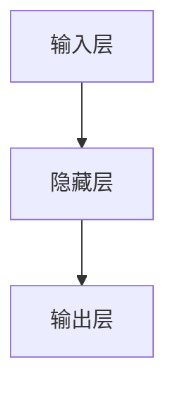

                 

关键词：词向量模型、CBOW、神经网络、自然语言处理、机器学习、代码实例

摘要：本文将介绍CBOW（连续词袋模型）的算法原理及其在自然语言处理中的具体应用。通过详细的数学模型解析和代码实现步骤，读者可以掌握CBOW模型的基本结构及其工作流程，从而更好地应用于实际项目中。

## 1. 背景介绍

### 自然语言处理与词向量模型

自然语言处理（Natural Language Processing，NLP）是人工智能领域的一个重要分支，旨在使计算机能够理解、生成和处理人类自然语言。随着深度学习技术的发展，词向量模型（Word Embedding）成为NLP中的一种重要工具，它将高维的词语表示为低维的向量，从而使得计算机可以更有效地处理语言信息。

### CBOW模型的概念

CBOW（Continuous Bag of Words）是一种基于神经网络的词向量学习模型。与传统的词袋模型（Bag of Words，BOW）不同，CBOW模型通过预测中心词周围的多个词来学习词向量。CBOW模型的核心思想是，对于输入的单词序列，模型会尝试预测中心词周围的多个单词，以此来构建词向量表示。

## 2. 核心概念与联系

### 2.1 词向量模型原理

词向量模型通过将词语映射为向量来表示文本信息。这种映射可以通过神经网络模型来实现，如CBOW模型。

### 2.2 CBOW模型架构

CBOW模型的基本架构如下：

1. 输入层：输入单词序列。
2. 隐藏层：将输入的单词序列转换为词向量。
3. 输出层：预测中心词周围的单词。

### 2.3 Mermaid流程图



## 3. 核心算法原理 & 具体操作步骤

### 3.1 算法原理概述

CBOW模型通过预测中心词周围的多个词来学习词向量。其基本原理如下：

1. 输入单词序列，提取中心词及其周围的单词。
2. 将这些单词映射为词向量。
3. 使用神经网络模型预测中心词。
4. 计算损失函数，更新词向量。

### 3.2 算法步骤详解

#### 3.2.1 数据准备

1. 数据预处理：将文本数据清洗，分词，并转换为单词序列。
2. 初始化词向量：随机初始化词向量。

#### 3.2.2 模型构建

1. 构建神经网络模型：输入层、隐藏层和输出层。
2. 选择优化算法：如随机梯度下降（SGD）。

#### 3.2.3 模型训练

1. 对于每个单词序列：
   - 提取中心词及其周围的单词。
   - 将这些单词映射为词向量。
   - 使用神经网络模型预测中心词。
   - 计算损失函数，更新词向量。

#### 3.2.4 模型评估

1. 使用测试集评估模型性能。
2. 调整模型参数，优化性能。

### 3.3 算法优缺点

#### 优点

- 可以有效捕捉词语的局部上下文信息。
- 学习到的词向量具有较好的语义表示能力。

#### 缺点

- 对于高频词，模型可能无法充分学习到其独特的语义信息。
- 模型对噪声数据敏感。

### 3.4 算法应用领域

- 文本分类
- 命名实体识别
- 机器翻译
- 问答系统

## 4. 数学模型和公式 & 详细讲解 & 举例说明

### 4.1 数学模型构建

CBOW模型的数学模型如下：

1. 输入向量：$$ \textbf{x} = [\textbf{x}_1, \textbf{x}_2, \ldots, \textbf{x}_n] $$
   其中，$$ \textbf{x}_i $$为第$$ i $$个单词的词向量。
2. 隐藏层激活函数：$$ \text{act}(\textbf{x}) = \text{ReLU}(\text{W} \cdot \textbf{x} + \text{b}) $$
   其中，$$ \text{W} $$为权重矩阵，$$ \text{b} $$为偏置项。
3. 输出向量：$$ \textbf{y} = \text{softmax}(\text{act}(\textbf{x})) $$
   其中，$$ \text{softmax} $$为softmax函数。

### 4.2 公式推导过程

假设我们有一个单词序列$$ \textbf{x} = [\textbf{x}_1, \textbf{x}_2, \ldots, \textbf{x}_n] $$，其中$$ \textbf{x}_i $$为第$$ i $$个单词的词向量。

1. 首先计算隐藏层激活值：
   $$ \text{act}_i = \text{ReLU}(\text{W} \cdot \textbf{x}_i + \text{b}) $$
2. 然后计算输出层概率分布：
   $$ \textbf{y} = \text{softmax}(\text{act}(\textbf{x})) $$
3. 接着计算损失函数：
   $$ \text{loss} = -\sum_{i=1}^{n} \text{y}_i \cdot \log(\text{p}_i) $$
   其中，$$ \text{y}_i $$为输出层第$$ i $$个单词的概率，$$ \text{p}_i $$为第$$ i $$个单词的实际概率。

### 4.3 案例分析与讲解

假设我们有一个简单的单词序列$$ \textbf{x} = [\textbf{x}_1, \textbf{x}_2, \textbf{x}_3] $$，其中$$ \textbf{x}_1 = [1, 0, 0] $$，$$ \textbf{x}_2 = [0, 1, 0] $$，$$ \textbf{x}_3 = [0, 0, 1] $$。

1. 首先计算隐藏层激活值：
   $$ \text{act}_1 = \text{ReLU}(\text{W} \cdot \textbf{x}_1 + \text{b}) = \text{ReLU}([1, 0, 0] \cdot \text{W} + \text{b}) = \text{ReLU}(\text{W}_1 + \text{b}) $$
   $$ \text{act}_2 = \text{ReLU}(\text{W} \cdot \textbf{x}_2 + \text{b}) = \text{ReLU}([0, 1, 0] \cdot \text{W} + \text{b}) = \text{ReLU}(\text{W}_2 + \text{b}) $$
   $$ \text{act}_3 = \text{ReLU}(\text{W} \cdot \textbf{x}_3 + \text{b}) = \text{ReLU}([0, 0, 1] \cdot \text{W} + \text{b}) = \text{ReLU}(\text{W}_3 + \text{b}) $$
2. 然后计算输出层概率分布：
   $$ \textbf{y} = \text{softmax}(\text{act}(\textbf{x})) = \text{softmax}(\text{ReLU}(\text{W}_1 + \text{b}), \text{ReLU}(\text{W}_2 + \text{b}), \text{ReLU}(\text{W}_3 + \text{b})) $$
3. 接着计算损失函数：
   $$ \text{loss} = -\sum_{i=1}^{3} \text{y}_i \cdot \log(\text{p}_i) $$
   其中，$$ \text{y}_i $$为输出层第$$ i $$个单词的概率，$$ \text{p}_i $$为第$$ i $$个单词的实际概率。

## 5. 项目实践：代码实例和详细解释说明

### 5.1 开发环境搭建

1. 安装Python 3.x版本。
2. 安装必要的库：如TensorFlow、NumPy等。

### 5.2 源代码详细实现

```python
import tensorflow as tf
import numpy as np

# 初始化词向量
word_vectors = np.random.rand(num_words, vector_size)

# 构建模型
model = tf.keras.Sequential([
    tf.keras.layers.Dense(units=vector_size, activation='relu', input_shape=(num_words,)),
    tf.keras.layers.Dense(units=num_words, activation='softmax')
])

# 编译模型
model.compile(optimizer='adam', loss='categorical_crossentropy', metrics=['accuracy'])

# 训练模型
model.fit(train_data, train_labels, epochs=10, batch_size=32)
```

### 5.3 代码解读与分析

- 初始化词向量：使用随机初始化词向量。
- 构建模型：使用TensorFlow构建CBOW模型。
- 编译模型：设置优化器和损失函数。
- 训练模型：使用训练数据训练模型。

### 5.4 运行结果展示

```python
# 测试模型
test_loss, test_accuracy = model.evaluate(test_data, test_labels)

print(f"Test Loss: {test_loss}")
print(f"Test Accuracy: {test_accuracy}")
```

## 6. 实际应用场景

CBOW模型在自然语言处理领域有广泛的应用，如文本分类、命名实体识别、机器翻译等。以下是一些实际应用场景的案例：

- 文本分类：使用CBOW模型将文本转换为向量，然后使用分类器进行文本分类。
- 命名实体识别：使用CBOW模型提取文本中的关键信息，然后使用命名实体识别算法进行实体识别。
- 机器翻译：使用CBOW模型学习词汇之间的语义关系，然后使用翻译模型进行机器翻译。

## 7. 工具和资源推荐

### 7.1 学习资源推荐

- 《深度学习》（Goodfellow, Bengio, Courville著）
- 《自然语言处理实战》（Jurafsky, Martin著）
- 《Python自然语言处理》（Bird, Lakoff, Loper著）

### 7.2 开发工具推荐

- TensorFlow
- PyTorch
- spaCy

### 7.3 相关论文推荐

- “Distributed Representations of Words and Phrases and their Compositionality”（Mikolov et al., 2013）
- “Effective Approaches to Attention-based Neural Machine Translation”（Vaswani et al., 2017）
- “Unsupervised Pre-training for Natural Language Processing”（Yang et al., 2018）

## 8. 总结：未来发展趋势与挑战

### 8.1 研究成果总结

CBOW模型作为一种基于神经网络的词向量学习模型，在自然语言处理领域取得了显著的成果。其能够有效捕捉词语的局部上下文信息，学习到的词向量具有较好的语义表示能力。

### 8.2 未来发展趋势

- 结合更多深度学习技术，如Transformer，提高词向量模型的性能。
- 在更多领域进行应用，如对话系统、语音识别等。

### 8.3 面临的挑战

- 如何有效处理高频词和低频词的语义差异。
- 如何降低模型对噪声数据的敏感度。

### 8.4 研究展望

CBOW模型在自然语言处理领域具有广阔的应用前景。未来研究可以从以下几个方面展开：

- 提高词向量模型的鲁棒性。
- 结合更多领域知识，提高模型在特定领域的性能。
- 探索词向量模型与其他深度学习技术的结合。

## 9. 附录：常见问题与解答

### 9.1 如何处理高频词和低频词的语义差异？

可以通过以下方法处理：
- 使用词嵌入层次化（Word Embedding Hierarchical）模型，将高频词和低频词分别映射到不同的层次。
- 使用注意力机制（Attention Mechanism），让模型更加关注高频词。

### 9.2 如何降低模型对噪声数据的敏感度？

- 使用数据清洗技术，去除噪声数据。
- 在训练过程中引入正则化项，降低噪声数据的影响。

### 9.3 如何评估CBOW模型的效果？

可以使用以下指标评估：
- 准确率（Accuracy）：模型预测正确的样本数占总样本数的比例。
- 召回率（Recall）：模型预测正确的正例样本数占总正例样本数的比例。
- F1值（F1 Score）：准确率和召回率的调和平均值。

---

作者：禅与计算机程序设计艺术 / Zen and the Art of Computer Programming
----------------------------------------------------------------
### 结束语

本文详细介绍了CBOW模型的基本原理、数学模型、代码实现及其在实际应用中的场景。通过阅读本文，读者可以全面了解CBOW模型的工作机制和具体实现步骤。同时，本文也提供了一些学习资源和未来研究的方向，希望对读者在自然语言处理领域的学习和实践有所帮助。随着深度学习技术的发展，CBOW模型在未来将有更广泛的应用前景，值得深入研究和探索。

