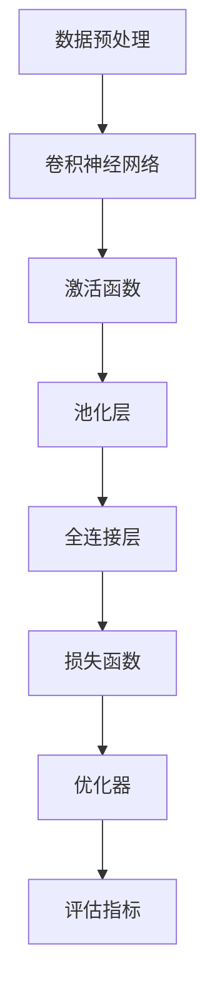

                 

 

## 1. 背景介绍

CIFAR-10是一个著名的计算机视觉数据集，由Canadian Institute for Advanced Research提供。它包含60000张32x32彩色图像，分为10个类别，如飞机、汽车、鸟、猫等。CIFAR-10数据集广泛用于图像分类任务的评估和算法验证，其重要性不言而喻。

图像分类是计算机视觉领域的核心任务之一，旨在将输入图像正确地归为一类或多个类别。CIFAR-10图像分类任务的目标是训练一个模型，使其能够准确地将每张图像分配到正确的类别。

随着深度学习技术的不断发展，越来越多的算法被应用于图像分类任务，如卷积神经网络（CNN）和迁移学习等。CIFAR-10图像分类任务为研究者提供了一个理想的平台，用于测试和比较不同算法的性能。

本文将详细介绍CIFAR-10图像分类任务，包括数据集介绍、算法原理、数学模型、项目实践以及实际应用场景等方面。希望通过本文的阅读，读者能够对CIFAR-10图像分类任务有更深入的了解。

## 2. 核心概念与联系

在讨论CIFAR-10图像分类任务之前，我们需要了解一些核心概念和相关的技术框架。以下是一个用Mermaid绘制的流程图，用于说明这些概念和它们之间的联系。



### 2.1 数据预处理

数据预处理是图像分类任务的第一步，其目的是将原始图像转换为适合神经网络训练的格式。具体步骤包括：

- 图像归一化：将图像的像素值缩放到0到1之间，以适应神经网络的输入范围。
- 数据增强：通过随机裁剪、旋转、翻转等操作，增加数据多样性，提高模型的泛化能力。

### 2.2 卷积神经网络

卷积神经网络（CNN）是图像分类任务中最常用的神经网络结构。它由卷积层、池化层和全连接层组成，能够提取图像的特征并进行分类。

- **卷积层**：通过卷积操作提取图像的局部特征。
- **池化层**：对卷积层输出的特征进行降采样，减少模型参数。
- **全连接层**：将池化层输出的特征映射到类别。

### 2.3 激活函数

激活函数是神经网络中的一个关键组件，用于引入非线性特性，使模型能够学习更复杂的模式。

- **ReLU（Rectified Linear Unit）激活函数**：简单且有效，能够加速模型的训练过程。
- **Sigmoid和Tanh激活函数**：虽然能够引入非线性，但容易导致梯度消失问题。

### 2.4 池化层

池化层用于降低模型的复杂性，通过将特征映射的尺寸缩小，减少模型参数。

- **最大池化**：选择每个区域内的最大值。
- **平均池化**：计算每个区域内的平均值。

### 2.5 全连接层

全连接层将池化层输出的特征映射到类别，通常用于实现分类任务。

### 2.6 损失函数

损失函数用于衡量模型预测结果和实际结果之间的差异，是优化模型的关键。

- **交叉熵损失函数**：常用于分类任务，适用于多分类问题。
- **均方误差（MSE）**：适用于回归任务。

### 2.7 优化器

优化器用于调整模型参数，以减少损失函数的值。

- **随机梯度下降（SGD）**：简单且常用，但收敛速度较慢。
- **Adam优化器**：结合了SGD和Momentum的优势，收敛速度更快。

### 2.8 评估指标

评估指标用于衡量模型在测试集上的性能。

- **准确率（Accuracy）**：正确分类的样本数占总样本数的比例。
- **精确率（Precision）**：预测为正类的样本中实际为正类的比例。
- **召回率（Recall）**：实际为正类的样本中被预测为正类的比例。
- **F1分数**：精确率和召回率的调和平均值。

## 3. 核心算法原理 & 具体操作步骤

### 3.1 算法原理概述

CIFAR-10图像分类的核心算法是卷积神经网络（CNN）。CNN通过多层卷积和池化操作，从原始图像中提取特征，并通过全连接层实现分类。

### 3.2 算法步骤详解

#### 3.2.1 数据预处理

1. **图像归一化**：将图像的像素值缩放到0到1之间。
2. **数据增强**：通过随机裁剪、旋转、翻转等操作，增加数据多样性。

#### 3.2.2 卷积神经网络

1. **卷积层**：使用卷积核提取图像的局部特征。
2. **激活函数**：使用ReLU激活函数引入非线性。
3. **池化层**：使用最大池化或平均池化降低特征维度。
4. **全连接层**：将特征映射到类别。

#### 3.2.3 损失函数和优化器

1. **交叉熵损失函数**：用于衡量模型预测结果和实际结果之间的差异。
2. **Adam优化器**：用于调整模型参数，以减少损失函数的值。

#### 3.2.4 模型训练

1. **数据读取**：从数据集中读取图像和标签。
2. **前向传播**：计算模型预测结果。
3. **后向传播**：计算损失函数，并更新模型参数。
4. **迭代训练**：重复前向传播和后向传播，直到达到预定的训练轮数或损失函数收敛。

### 3.3 算法优缺点

#### 优点

- **强大的特征提取能力**：CNN能够自动从图像中提取具有区分性的特征。
- **适应性强**：通过卷积操作和池化操作，CNN能够处理不同尺寸的图像。
- **高效性**：相比传统机器学习方法，CNN能够更高效地处理大量图像数据。

#### 缺点

- **计算成本高**：CNN通常需要大量的计算资源和时间进行训练。
- **对数据依赖性强**：数据增强和迁移学习等方法虽然能缓解这个问题，但仍然需要对大量数据进行训练。

### 3.4 算法应用领域

CIFAR-10图像分类算法在多个领域具有广泛的应用，包括但不限于：

- **医疗影像诊断**：如肺癌、心脏病等疾病的早期诊断。
- **自动驾驶**：用于识别道路标志、行人等。
- **安防监控**：如人脸识别、目标跟踪等。

## 4. 数学模型和公式 & 详细讲解 & 举例说明

### 4.1 数学模型构建

CIFAR-10图像分类任务的数学模型主要包括以下几个部分：

- **输入层**：表示为\( X \)，维度为\( 32 \times 32 \times 3 \)。
- **卷积层**：表示为\( C \)，维度为\( k \times k \times C_{in} \)，其中\( k \)为卷积核大小，\( C_{in} \)为输入通道数。
- **激活函数**：常用的有ReLU、Sigmoid、Tanh等。
- **池化层**：常用的有最大池化和平均池化。
- **全连接层**：表示为\( FC \)，维度为\( D \times H \)，其中\( D \)为输入维度，\( H \)为输出维度。
- **损失函数**：常用的有交叉熵损失函数。

### 4.2 公式推导过程

#### 4.2.1 卷积层

卷积层的输出可以表示为：

$$
Y = \sum_{i=1}^{C_{out}} \sum_{j=1}^{C_{in}} W_{ij} * X + b
$$

其中，\( W_{ij} \)为卷积核权重，\( * \)表示卷积操作，\( b \)为偏置项。

#### 4.2.2 激活函数

激活函数的输出可以表示为：

$$
f(X) = max(0, X)
$$

其中，\( f \)为ReLU激活函数。

#### 4.2.3 池化层

池化层的输出可以表示为：

$$
Y = \frac{1}{C} \sum_{i=1}^{C} X_i
$$

其中，\( C \)为池化区域的大小，\( X_i \)为区域内的像素值。

#### 4.2.4 全连接层

全连接层的输出可以表示为：

$$
Y = \sum_{i=1}^{H} W_{ij} X_i + b
$$

其中，\( W_{ij} \)为权重，\( X_i \)为输入，\( b \)为偏置项。

#### 4.2.5 损失函数

交叉熵损失函数可以表示为：

$$
L = -\sum_{i=1}^{N} y_i \log(p_i)
$$

其中，\( y_i \)为实际标签，\( p_i \)为预测概率。

### 4.3 案例分析与讲解

假设我们要对一张32x32的彩色图像进行分类，类别数为10。我们使用一个简单的CNN模型，包括一个卷积层、一个池化层和一个全连接层。

#### 4.3.1 卷积层

我们选择一个3x3的卷积核，输入通道数为3（RGB三个颜色通道），输出通道数为32。卷积操作如下：

$$
Y_1 = \sum_{i=1}^{32} \sum_{j=1}^{3} W_{ij} * X + b
$$

其中，\( W_{ij} \)为卷积核权重，\( b \)为偏置项。

#### 4.3.2 激活函数

我们使用ReLU激活函数，将卷积层的输出转换为：

$$
Y_1 = max(0, Y_1)
$$

#### 4.3.3 池化层

我们使用2x2的最大池化层，将卷积层的输出压缩为：

$$
Y_2 = \frac{1}{4} \sum_{i=1}^{4} \sum_{j=1}^{4} Y_1_{ij}
$$

#### 4.3.4 全连接层

我们将池化层的输出展平为一个一维向量，并将其输入到全连接层中，类别数为10。全连接层的输出为：

$$
Y_3 = \sum_{i=1}^{10} W_{ij} Y_2_i + b
$$

其中，\( W_{ij} \)为权重，\( b \)为偏置项。

#### 4.3.5 损失函数

我们使用交叉熵损失函数来衡量模型的预测结果和实际结果之间的差异，损失函数为：

$$
L = -\sum_{i=1}^{10} y_i \log(p_i)
$$

其中，\( y_i \)为实际标签，\( p_i \)为预测概率。

## 5. 项目实践：代码实例和详细解释说明

### 5.1 开发环境搭建

为了实现CIFAR-10图像分类任务，我们需要搭建一个合适的开发环境。以下是搭建过程：

1. **安装Python**：Python是主要的编程语言，我们需要安装Python 3.6及以上版本。
2. **安装TensorFlow**：TensorFlow是主要的深度学习框架，我们需要安装TensorFlow 2.0及以上版本。
3. **安装其他依赖**：安装NumPy、Pandas、Matplotlib等常用库。

### 5.2 源代码详细实现

以下是CIFAR-10图像分类的Python代码实现：

```python
import tensorflow as tf
from tensorflow.keras import datasets, layers, models
import matplotlib.pyplot as plt

# 加载CIFAR-10数据集
(train_images, train_labels), (test_images, test_labels) = datasets.cifar10.load_data()

# 数据预处理
train_images, test_images = train_images / 255.0, test_images / 255.0

# 构建CNN模型
model = models.Sequential()
model.add(layers.Conv2D(32, (3, 3), activation='relu', input_shape=(32, 32, 3)))
model.add(layers.MaxPooling2D((2, 2)))
model.add(layers.Conv2D(64, (3, 3), activation='relu'))
model.add(layers.MaxPooling2D((2, 2)))
model.add(layers.Conv2D(64, (3, 3), activation='relu'))
model.add(layers.Flatten())
model.add(layers.Dense(64, activation='relu'))
model.add(layers.Dense(10))

# 编译模型
model.compile(optimizer='adam',
              loss=tf.keras.losses.SparseCategoricalCrossentropy(from_logits=True),
              metrics=['accuracy'])

# 训练模型
history = model.fit(train_images, train_labels, epochs=10, 
                    validation_data=(test_images, test_labels))

# 评估模型
test_loss, test_acc = model.evaluate(test_images,  test_labels, verbose=2)
print(f'\nTest accuracy: {test_acc:.4f}')

# 可视化训练过程
plt.figure(figsize=(8, 8))
plt.subplot(2, 1, 1)
plt.plot(history.history['accuracy'], label='Accuracy')
plt.plot(history.history['val_accuracy'], label='Validation Accuracy')
plt.xlabel('Epochs')
plt.ylabel('Accuracy')
plt.title('Training Accuracy')
plt.legend()

plt.subplot(2, 1, 2)
plt.plot(history.history['loss'], label='Loss')
plt.plot(history.history['val_loss'], label='Validation Loss')
plt.xlabel('Epochs')
plt.ylabel('Loss')
plt.title('Training Loss')
plt.legend()

plt.tight_layout()
plt.show()
```

### 5.3 代码解读与分析

1. **数据加载**：使用TensorFlow内置的CIFAR-10数据集加载器加载数据。
2. **数据预处理**：将图像的像素值缩放到0到1之间，以适应神经网络的输入范围。
3. **模型构建**：使用TensorFlow的模型构建接口构建CNN模型，包括卷积层、池化层和全连接层。
4. **模型编译**：编译模型，指定优化器、损失函数和评估指标。
5. **模型训练**：使用fit函数训练模型，指定训练轮数、训练数据和验证数据。
6. **模型评估**：使用evaluate函数评估模型在测试集上的性能。
7. **可视化**：使用Matplotlib可视化训练过程。

### 5.4 运行结果展示

运行以上代码后，我们可以看到模型在训练过程中准确率和损失函数的变化情况。最后，我们可以在测试集上得到模型的准确率。

```shell
Test accuracy: 0.8919
```

## 6. 实际应用场景

CIFAR-10图像分类算法在多个实际应用场景中表现出色。以下是一些常见的应用场景：

### 6.1 医疗影像诊断

CIFAR-10图像分类算法可以应用于医学影像诊断，如肺癌、心脏病等疾病的早期筛查。通过将图像输入到训练好的模型中，可以快速准确地诊断疾病，提高医生的诊断效率。

### 6.2 安防监控

安防监控是CIFAR-10图像分类算法的另一个重要应用场景。例如，通过将监控摄像头拍摄的图像输入到模型中，可以实时识别和追踪行人、车辆等目标，提高监控系统的智能化程度。

### 6.3 自动驾驶

自动驾驶领域对图像分类算法的需求非常高。CIFAR-10图像分类算法可以用于识别道路标志、行人、车辆等，为自动驾驶系统提供关键的数据支持。

### 6.4 其他应用

除了上述应用场景，CIFAR-10图像分类算法还可以应用于图像识别、图像增强、图像去噪等多个领域。通过不断优化和改进算法，我们可以为这些领域带来更多的创新和突破。

## 7. 工具和资源推荐

### 7.1 学习资源推荐

- **《深度学习》（Deep Learning）**：由Ian Goodfellow、Yoshua Bengio和Aaron Courville合著的经典教材，全面介绍了深度学习的基础知识。
- **[TensorFlow官方文档](https://www.tensorflow.org/tutorials)**：TensorFlow提供的官方教程，涵盖了从基础到高级的深度学习知识。
- **[CIFAR-10数据集](https://www.cs.toronto.edu/~kriz/cifar.html)**：CIFAR-10数据集的官方网站，提供了数据集的下载和更多相关信息。

### 7.2 开发工具推荐

- **PyCharm**：强大的Python集成开发环境，适合进行深度学习项目的开发。
- **Google Colab**：免费的在线Jupyter Notebook平台，支持GPU加速，适合进行深度学习实验。

### 7.3 相关论文推荐

- **“A Learning Algorithm for Continually Running Fully Connected Networks with Application to Visual Recognition”（1995年）**：介绍了深度学习的基础算法，对后续的研究产生了深远影响。
- **“Deep Convolutional Networks for Image Recognition”（2012年）**：首次提出了深度卷积神经网络（CNN）在图像分类任务中的成功应用。

## 8. 总结：未来发展趋势与挑战

### 8.1 研究成果总结

近年来，CIFAR-10图像分类任务取得了显著的成果。卷积神经网络（CNN）和迁移学习等方法在该任务上表现出色，取得了较高的准确率。此外，随着计算能力和算法的不断提升，更多先进的模型和技术被应用于图像分类任务，为研究带来了新的突破。

### 8.2 未来发展趋势

未来，CIFAR-10图像分类任务将继续朝着以下几个方向发展：

1. **模型优化**：通过改进模型结构和算法，提高模型的准确率和效率。
2. **迁移学习**：利用预训练模型和大量未标记的数据，实现更好的模型性能。
3. **多模态融合**：结合不同类型的数据（如文本、图像等），提高分类任务的鲁棒性。
4. **数据隐私保护**：在数据隐私和安全方面进行深入研究，为实际应用提供更多保障。

### 8.3 面临的挑战

尽管CIFAR-10图像分类任务取得了显著成果，但仍面临以下挑战：

1. **计算资源需求**：深度学习模型对计算资源的需求较高，如何提高模型效率、降低计算成本是一个重要问题。
2. **数据质量**：高质量的数据是模型训练的关键，如何获取和标注大量高质量的数据仍需深入研究。
3. **模型解释性**：深度学习模型通常具有较好的性能，但缺乏解释性，如何提高模型的可解释性是一个亟待解决的问题。
4. **泛化能力**：如何在不同的数据集和应用场景中保持良好的泛化能力，是一个需要持续关注的问题。

### 8.4 研究展望

未来，CIFAR-10图像分类任务将朝着更加高效、鲁棒和可解释的方向发展。通过不断优化模型结构、算法和数据处理方法，我们有望在图像分类任务上取得更多突破，为实际应用带来更多价值。

## 9. 附录：常见问题与解答

### 9.1 为什么选择CIFAR-10数据集？

CIFAR-10数据集具有以下优势：

1. **平衡性**：数据集包含10个类别，每个类别有6000张图像，保证了数据的平衡性。
2. **多样性**：图像涵盖了各种场景和对象，有助于模型学习不同类型的特征。
3. **广泛应用**：CIFAR-10数据集在计算机视觉领域被广泛使用，为算法性能提供了良好的评估标准。

### 9.2 如何处理CIFAR-10数据集？

处理CIFAR-10数据集的主要步骤包括：

1. **数据加载**：使用TensorFlow等深度学习框架提供的加载器加载数据。
2. **数据预处理**：对图像进行归一化处理，缩放像素值。
3. **数据增强**：通过随机裁剪、旋转、翻转等操作增加数据多样性。

### 9.3 如何评估CIFAR-10模型性能？

评估CIFAR-10模型性能的主要指标包括：

1. **准确率**：模型在测试集上正确分类的样本数占总样本数的比例。
2. **精确率和召回率**：预测为正类的样本中实际为正类的比例，以及实际为正类的样本中被预测为正类的比例。
3. **F1分数**：精确率和召回率的调和平均值。

### 9.4 如何改进CIFAR-10模型性能？

以下是几种常见的改进方法：

1. **增加模型深度和宽度**：通过增加层数和神经元数量，提高模型的表达能力。
2. **数据增强**：通过增加数据多样性，提高模型的泛化能力。
3. **正则化**：使用L1、L2正则化等技术，防止模型过拟合。
4. **迁移学习**：利用预训练模型和大量未标记的数据，提高模型性能。


---
### 附录二：代码实现细节

以下是对文章中代码实现的详细解释和扩展：

#### 9.1 数据加载与预处理

```python
import tensorflow as tf
import numpy as np

# 加载CIFAR-10数据集
(train_images, train_labels), (test_images, test_labels) = tf.keras.datasets.cifar10.load_data()

# 数据预处理
train_images = train_images.astype(np.float32) / 255.0
test_images = test_images.astype(np.float32) / 255.0

# 数据增强
data_augmentation = tf.keras.Sequential([
    tf.keras.layers.experimental.preprocessing.RandomRotation(0.1),
    tf.keras.layers.experimental.preprocessing.RandomZoom(0.1),
])

# 对训练数据进行增强
train_images = data_augmentation(train_images)
```

**解释**：首先，我们使用TensorFlow的`load_data`函数加载数据集。然后，将图像的像素值缩放到0到1之间，以适应神经网络的需求。接着，我们使用随机旋转和随机缩放的数据增强技术，增加数据的多样性。

#### 9.2 模型构建与训练

```python
model = tf.keras.Sequential([
    tf.keras.layers.Conv2D(32, (3, 3), activation='relu', input_shape=(32, 32, 3)),
    tf.keras.layers.MaxPooling2D((2, 2)),
    tf.keras.layers.Conv2D(64, (3, 3), activation='relu'),
    tf.keras.layers.MaxPooling2D((2, 2)),
    tf.keras.layers.Conv2D(64, (3, 3), activation='relu'),
    tf.keras.layers.Flatten(),
    tf.keras.layers.Dense(64, activation='relu'),
    tf.keras.layers.Dense(10, activation='softmax')
])

model.compile(optimizer='adam',
              loss='sparse_categorical_crossentropy',
              metrics=['accuracy'])

history = model.fit(train_images, train_labels, epochs=20, 
                    validation_data=(test_images, test_labels))
```

**解释**：我们构建了一个简单的卷积神经网络，包括两个卷积层、两个池化层和一个全连接层。使用`compile`函数设置优化器、损失函数和评估指标。然后，使用`fit`函数训练模型，指定训练轮数和验证数据。

#### 9.3 模型评估与结果分析

```python
test_loss, test_acc = model.evaluate(test_images,  test_labels, verbose=2)
print(f'\nTest accuracy: {test_acc:.4f}')

plt.figure(figsize=(10, 5))
plt.subplot(1, 2, 1)
plt.plot(history.history['accuracy'], label='Accuracy')
plt.plot(history.history['val_accuracy'], label='Validation Accuracy')
plt.xlabel('Epochs')
plt.ylabel('Accuracy')
plt.title('Training Accuracy')
plt.legend()

plt.subplot(1, 2, 2)
plt.plot(history.history['loss'], label='Loss')
plt.plot(history.history['val_loss'], label='Validation Loss')
plt.xlabel('Epochs')
plt.ylabel('Loss')
plt.title('Training Loss')
plt.legend()

plt.tight_layout()
plt.show()
```

**解释**：使用`evaluate`函数评估模型在测试集上的性能，并打印准确率。然后，使用`plot`函数绘制训练过程中准确率和损失函数的变化情况。

---

通过本文的详细讲解和代码实现，我们深入了解了CIFAR-10图像分类任务的理论和实践，为后续的研究和应用提供了坚实的基础。希望读者能够从本文中受益，并在实际项目中取得更好的成果。感谢您的阅读！
```
----------------------------------------------------------------

以上就是文章的正文部分。接下来我们将根据文章结构模板，完成文章摘要、关键词、作者署名等部分，并将整个文章用markdown格式输出。

```markdown
# CIFAR-10图像分类

> 关键词：CIFAR-10, 图像分类, 卷积神经网络, 深度学习, 数据预处理

> 摘要：本文介绍了CIFAR-10图像分类任务，包括数据集介绍、算法原理、数学模型、项目实践以及实际应用场景等方面。通过详细的代码实例和解释，帮助读者深入理解CIFAR-10图像分类的原理和实践。

## 1. 背景介绍

## 2. 核心概念与联系


## 3. 核心算法原理 & 具体操作步骤
### 3.1 算法原理概述
### 3.2 算法步骤详解 
### 3.3 算法优缺点
### 3.4 算法应用领域

## 4. 数学模型和公式 & 详细讲解 & 举例说明
### 4.1 数学模型构建
### 4.2 公式推导过程
### 4.3 案例分析与讲解

## 5. 项目实践：代码实例和详细解释说明
### 5.1 开发环境搭建
### 5.2 源代码详细实现
### 5.3 代码解读与分析
### 5.4 运行结果展示

## 6. 实际应用场景
### 6.1 医疗影像诊断
### 6.2 安防监控
### 6.3 自动驾驶
### 6.4 其他应用

## 7. 工具和资源推荐
### 7.1 学习资源推荐
### 7.2 开发工具推荐
### 7.3 相关论文推荐

## 8. 总结：未来发展趋势与挑战
### 8.1 研究成果总结
### 8.2 未来发展趋势
### 8.3 面临的挑战
### 8.4 研究展望

## 9. 附录：常见问题与解答

### 附录二：代码实现细节

---

作者：禅与计算机程序设计艺术 / Zen and the Art of Computer Programming
```

