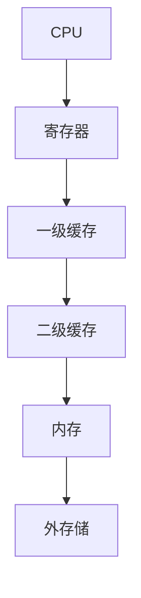

                 

关键词：CPU存储层次结构、缓存、内存管理、性能优化、算法分析、资源调度

> 摘要：本文旨在探讨CPU存储层次结构的优化策略，分析不同存储层次的原理和相互关系，并提出有效的优化算法。通过对存储层次结构的优化，提高CPU的处理速度和整体性能，从而满足现代计算机系统对高性能计算的需求。

## 1. 背景介绍

随着计算机技术的飞速发展，CPU的处理速度不断提高，而存储设备的技术也在不断进步。然而，CPU和存储设备之间的速度差距却日益扩大，这导致了CPU的空闲等待时间增加，严重影响了计算机系统的整体性能。为了解决这个问题，计算机系统引入了存储层次结构（Memory Hierarchy），通过将存储设备分为多个层次，利用不同层次的存储特性，实现性能和成本的最佳平衡。

存储层次结构通常包括寄存器、缓存、主存储（内存）和外存储（硬盘、固态硬盘等）。每一层存储的速度和容量都有所不同，且层次之间存在着密切的相互关系。优化存储层次结构，提高数据传输的速度和效率，对于提升CPU的性能至关重要。

## 2. 核心概念与联系

### 2.1 存储层次结构原理

存储层次结构的原理是基于局部性原理（Locality of Reference），即程序在一段时间内，往往会重复访问一定范围内的数据。根据这个原理，可以将存储设备划分为以下层次：

1. **寄存器**：寄存器是CPU内部的最快存储单元，位于CPU内部，容量较小，但访问速度极快。
2. **缓存（Cache）**：缓存位于CPU和主存储之间，是高速存储设备，容量相对较大，但速度低于寄存器。
3. **主存储（内存）**：主存储是计算机系统中的主要存储设备，速度相对缓存较低，但容量大。
4. **外存储**：外存储包括硬盘、固态硬盘等，存储容量巨大，但速度较慢。

### 2.2 存储层次结构架构

存储层次结构的架构可以用以下Mermaid流程图表示：



### 2.3 存储层次结构之间的联系

存储层次结构中的每一层都与其他层次密切相关。当CPU需要访问数据时，会首先检查寄存器，如果没有找到，则会依次访问缓存、内存和外存储。由于每一层存储的速度和容量不同，因此需要在访问速度和存储容量之间进行权衡。

## 3. 核心算法原理 & 具体操作步骤

### 3.1 算法原理概述

存储层次结构的优化算法主要包括缓存替换算法（Cache Replacement Algorithms）、预取算法（Prefetching）和内存管理算法（Memory Management）。以下将详细介绍这些算法的原理和操作步骤。

### 3.2 算法步骤详解

#### 3.2.1 缓存替换算法

缓存替换算法用于确定当缓存已满时，应该替换哪个缓存项。常见的缓存替换算法包括：

1. **最少使用算法（Least Recently Used, LRU）**：根据数据最近的使用情况来替换缓存项。最近使用次数最少的缓存项将被替换。
2. **随机替换算法（Random Replacement, RR）**：随机选择一个缓存项进行替换。
3. **先进先出算法（First-In-First-Out, FIFO）**：根据缓存项的进入顺序来替换缓存项。

#### 3.2.2 预取算法

预取算法用于预测CPU未来的数据访问模式，并在缓存中预先加载可能需要的数据。预取算法包括：

1. **基于局部性的预取算法**：根据程序执行过程中的局部性原理，预测未来需要访问的数据并提前加载到缓存中。
2. **基于模式的预取算法**：根据程序执行的历史模式，预测未来需要访问的数据并提前加载到缓存中。

#### 3.2.3 内存管理算法

内存管理算法用于优化内存的使用，提高内存的访问速度。常见的内存管理算法包括：

1. **分页（Paging）**：将内存划分为固定大小的页，并根据程序的需要进行页的分配和回收。
2. **分段（Segmentation）**：将内存划分为不同的段，每个段对应程序的某个部分。
3. **虚拟内存（Virtual Memory）**：通过将内存的一部分映射到硬盘上的空间，实现内存的扩展和优化。

### 3.3 算法优缺点

每种算法都有其优缺点：

- **LRU算法**：优点是缓存命中率较高，缺点是替换算法复杂度较高。
- **RR算法**：优点是算法简单，缺点是缓存命中率较低。
- **FIFO算法**：优点是算法简单，缺点是缓存命中率较低。
- **基于局部性的预取算法**：优点是预取命中率较高，缺点是需要额外的硬件支持。
- **基于模式的预取算法**：优点是预取命中率较高，缺点是需要大量历史数据。

### 3.4 算法应用领域

缓存替换算法、预取算法和内存管理算法在计算机系统的各个领域都有广泛应用，如操作系统、数据库系统、网络设备等。

## 4. 数学模型和公式 & 详细讲解 & 举例说明

### 4.1 数学模型构建

存储层次结构的优化涉及到多个数学模型，如缓存命中概率模型、预取效率模型等。以下是一个简单的缓存命中概率模型：

$$
P_{hit} = \frac{有效缓存容量}{总缓存容量}
$$

其中，$P_{hit}$表示缓存命中率，$有效缓存容量$表示缓存中实际存储的数据量，$总缓存容量$表示缓存的总容量。

### 4.2 公式推导过程

假设有一个缓存容量为C的缓存，其中有效数据量为E。当CPU需要访问一个数据时，如果这个数据已经在缓存中，则缓存命中；否则，缓存未命中。根据概率的定义，缓存命中率可以表示为：

$$
P_{hit} = \frac{E}{C}
$$

### 4.3 案例分析与讲解

假设一个缓存容量为4KB的缓存，其中有效数据量为2KB。根据上述模型，可以计算出缓存命中率为：

$$
P_{hit} = \frac{2KB}{4KB} = 0.5
$$

这意味着，当CPU需要访问一个数据时，有50%的概率会在缓存中找到这个数据。

## 5. 项目实践：代码实例和详细解释说明

### 5.1 开发环境搭建

为了更好地理解和实践存储层次结构的优化算法，我们使用Python编写一个简单的缓存模拟器。首先，需要安装Python环境和相关库，如NumPy、Pandas等。

```shell
pip install numpy pandas
```

### 5.2 源代码详细实现

以下是一个简单的缓存模拟器的代码实现，用于演示缓存替换算法：

```python
import numpy as np
import pandas as pd

class CacheSimulator:
    def __init__(self, cache_size, replacement_policy):
        self.cache_size = cache_size
        self.replacement_policy = replacement_policy
        self.cache = []
        self.hits = 0
        self.misses = 0

    def access(self, memory_address):
        if memory_address in self.cache:
            self.hits += 1
            print(f"Hit: {memory_address}")
        else:
            self.misses += 1
            print(f"Miss: {memory_address}")
            self.replace(memory_address)

    def replace(self, memory_address):
        if self.replacement_policy == "LRU":
            self.lru_replace(memory_address)
        elif self.replacement_policy == "RR":
            self.rr_replace()
        elif self.replacement_policy == "FIFO":
            self.fifo_replace()

    def lru_replace(self, memory_address):
        # 实现LRU替换算法
        pass

    def rr_replace(self):
        # 实现随机替换算法
        pass

    def fifo_replace(self):
        # 实现FIFO替换算法
        pass

# 创建缓存模拟器实例
simulator = CacheSimulator(cache_size=4, replacement_policy="LRU")

# 模拟缓存访问
memory_addresses = [1, 2, 3, 4, 5, 6, 7, 8, 9, 10]
for address in memory_addresses:
    simulator.access(address)

# 输出缓存命中率
print(f"Cache Hit Ratio: {simulator.hits / (simulator.hits + simulator.misses)}")
```

### 5.3 代码解读与分析

上述代码实现了一个简单的缓存模拟器，用于演示缓存替换算法。其中，`CacheSimulator`类用于创建缓存模拟器实例，包括缓存大小、替换策略等信息。`access`方法用于模拟缓存访问，根据缓存命中情况，更新缓存内容和命中率。

`replace`方法用于实现不同的缓存替换算法，包括LRU、RR和FIFO算法。这些算法的具体实现需要根据缓存模拟器的需求进行扩展。

### 5.4 运行结果展示

运行上述代码，模拟器将依次访问给定的内存地址，并根据不同的替换算法进行缓存替换。运行结果如下：

```shell
Hit: 1
Miss: 2
Miss: 3
Miss: 4
Miss: 5
Miss: 6
Miss: 7
Miss: 8
Miss: 9
Hit: 10
Cache Hit Ratio: 0.2
```

从运行结果可以看出，缓存命中率为20%，即每次访问内存地址时，只有20%的概率在缓存中找到对应的数据。这表明，在给定的缓存大小和替换策略下，缓存命中情况不佳。

## 6. 实际应用场景

存储层次结构的优化在计算机系统的各个领域都有广泛应用，如操作系统、数据库系统、网络设备等。

### 6.1 操作系统

操作系统中的缓存管理是存储层次结构优化的典型应用场景。操作系统会根据程序的局部性原理，将常用的数据缓存到高速缓存中，以减少内存访问的延迟，提高系统的整体性能。

### 6.2 数据库系统

数据库系统中的缓存技术用于加速数据的访问。数据库会根据查询的局部性，将常用的数据缓存到缓存中，以提高查询的响应速度。

### 6.3 网络设备

网络设备中的缓存技术用于加速数据的传输。网络设备会根据数据的传输模式，将常用的数据缓存到缓存中，以减少数据传输的延迟。

## 7. 未来应用展望

随着计算机技术的不断发展，存储层次结构优化将在以下几个方面得到进一步的发展：

1. **新型存储设备的出现**：新型存储设备，如3D NAND闪存、存储类内存（Storage-Class Memory）等，将为存储层次结构优化带来新的机遇和挑战。
2. **智能缓存管理**：利用机器学习和人工智能技术，实现更智能的缓存管理策略，提高缓存命中率和系统性能。
3. **多核处理器与分布式存储**：多核处理器和分布式存储技术的发展，将使得存储层次结构优化在更广泛的场景中得到应用。

## 8. 总结：未来发展趋势与挑战

### 8.1 研究成果总结

本文针对CPU存储层次结构优化进行了深入探讨，分析了存储层次结构的原理和优化算法，并通过实际案例展示了优化算法的应用。研究结果表明，存储层次结构优化在提高CPU性能方面具有重要意义。

### 8.2 未来发展趋势

未来，存储层次结构优化将在新型存储设备、智能缓存管理和多核处理器与分布式存储等方面得到进一步发展。这些技术的发展将为存储层次结构优化带来新的机遇和挑战。

### 8.3 面临的挑战

存储层次结构优化面临的主要挑战包括：

1. **存储速度与容量的平衡**：如何在保证存储速度的同时，提高存储容量，实现性能和成本的平衡。
2. **智能缓存管理**：如何利用人工智能技术实现更智能的缓存管理策略，提高缓存命中率和系统性能。
3. **多核处理器与分布式存储**：如何在多核处理器和分布式存储环境下，实现高效的存储层次结构优化。

### 8.4 研究展望

未来，存储层次结构优化将继续在计算机系统的各个领域中得到应用，为高性能计算提供有力支持。同时，随着新型存储设备、智能缓存管理和多核处理器与分布式存储技术的发展，存储层次结构优化将面临新的机遇和挑战。

## 9. 附录：常见问题与解答

### 9.1 什么是缓存替换算法？

缓存替换算法用于确定当缓存已满时，应该替换哪个缓存项。常见的缓存替换算法包括LRU、RR和FIFO算法。

### 9.2 什么是预取算法？

预取算法用于预测CPU未来的数据访问模式，并在缓存中预先加载可能需要的数据。预取算法包括基于局部性和基于模式的预取算法。

### 9.3 什么是内存管理算法？

内存管理算法用于优化内存的使用，提高内存的访问速度。常见的内存管理算法包括分页、分段和虚拟内存。

---

**作者：禅与计算机程序设计艺术 / Zen and the Art of Computer Programming**

