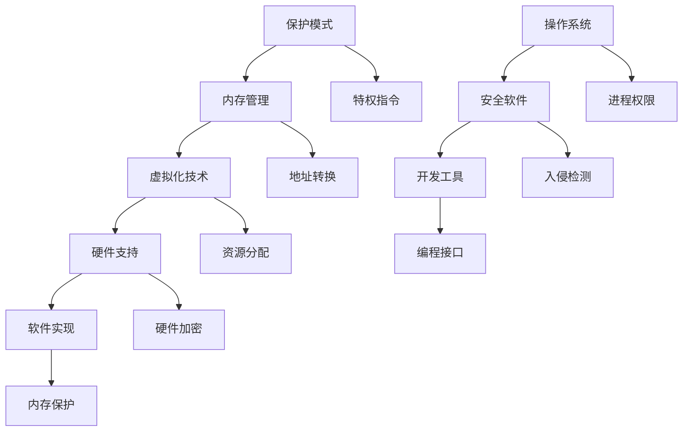

                 

关键词：CPU安全，扩展机制，保护模式，虚拟化技术，内存管理，硬件支持，软件实现。

摘要：本文探讨了CPU安全扩展机制的设计与实现，分析了保护模式、虚拟化技术等核心概念，并从算法原理、数学模型、项目实践等多个角度详细阐述了CPU安全扩展机制的具体实现方法。文章旨在为读者提供一个全面而深入的理解，为实际应用场景提供参考。

## 1. 背景介绍

在计算机系统中，CPU是核心部件之一，它负责执行程序指令和处理数据。然而，随着系统复杂度的增加和攻击手段的多样化，CPU的安全问题日益凸显。为了提高系统的安全性和可靠性，CPU的安全扩展机制应运而生。

本文将围绕CPU的安全扩展机制展开讨论，分析其核心概念、实现方法以及实际应用场景。通过本文的阅读，读者可以全面了解CPU安全扩展机制的设计原则和实现细节，为实际系统开发提供参考。

### 1.1 CPU安全的重要性

CPU安全是计算机系统安全的重要组成部分。一个安全的CPU不仅能够防止恶意软件的攻击，还能够保护系统中的敏感数据和关键资源。以下是一些CPU安全的重要方面：

- **防止恶意软件攻击**：恶意软件可以通过注入恶意指令、执行非法操作等方式破坏系统安全。CPU的安全扩展机制可以有效地防止这些攻击。
- **保护敏感数据**：计算机系统中的敏感数据包括用户密码、金融信息等，这些数据的安全至关重要。CPU的安全扩展机制可以确保敏感数据在存储和传输过程中的安全性。
- **保证系统稳定性**：系统中的恶意攻击和错误操作可能导致系统崩溃或数据丢失。CPU的安全扩展机制可以提高系统的稳定性，减少意外故障的发生。

### 1.2 CPU安全扩展的需求

随着计算机系统的不断发展和应用场景的多样化，CPU安全扩展的需求也越来越强烈。以下是一些主要的CPU安全扩展需求：

- **保护系统资源**：随着虚拟化技术的普及，系统资源的管理变得尤为重要。CPU的安全扩展机制可以确保虚拟化环境中资源分配的合理性和安全性。
- **支持新型应用**：新型应用，如物联网、人工智能等，对CPU的安全性能提出了更高的要求。CPU的安全扩展机制可以为这些应用提供必要的安全保障。
- **应对新的威胁**：随着网络攻击手段的不断升级，CPU需要具备更强的防御能力。CPU的安全扩展机制可以应对各种新型威胁，提高系统的抗攻击能力。

### 1.3 CPU安全扩展的发展趋势

CPU安全扩展机制的发展趋势主要体现在以下几个方面：

- **硬件支持**：随着硬件技术的发展，CPU的硬件支持功能越来越强大，为CPU的安全扩展提供了更多可能性。
- **软件实现**：软件在CPU安全扩展中扮演着重要角色，各种安全软件和工具不断涌现，为CPU安全提供了更多手段。
- **综合防御**：单一的安全机制已经难以应对复杂的安全威胁，CPU安全扩展需要采用多种手段综合防御，提高系统的整体安全性。

## 2. 核心概念与联系

在讨论CPU的安全扩展机制之前，我们需要了解一些核心概念和它们之间的联系。

### 2.1 保护模式

保护模式是CPU安全扩展机制的基础。在保护模式下，CPU可以限制程序的访问权限，防止恶意软件执行非法操作。保护模式通过以下几个关键概念实现：

- **内存保护**：保护模式可以限制程序对内存的访问，防止恶意软件越界访问其他程序的内存空间。
- **特权指令**：特权指令只能在操作系统内核模式下执行，从而保护操作系统的核心功能不受恶意软件的干扰。
- **任务隔离**：保护模式可以隔离不同的任务或进程，防止一个任务的恶意行为影响其他任务。

### 2.2 虚拟化技术

虚拟化技术是CPU安全扩展的重要手段。通过虚拟化技术，CPU可以在同一物理硬件上模拟多个虚拟CPU，从而实现资源的隔离和优化。

- **虚拟化隔离**：虚拟化技术可以将不同的虚拟机隔离开来，防止一个虚拟机受到恶意攻击影响其他虚拟机。
- **资源分配**：虚拟化技术可以根据实际需求动态调整资源分配，提高资源利用效率。
- **安全性增强**：虚拟化技术可以提供额外的安全层，防止恶意软件跨虚拟机传播。

### 2.3 内存管理

内存管理是CPU安全扩展的重要组成部分。通过有效的内存管理，可以确保系统的内存资源得到合理利用，防止恶意软件篡改内存数据。

- **地址转换**：内存管理通过地址转换将逻辑地址转换为物理地址，从而实现内存的虚拟化。
- **内存保护**：内存管理可以设置内存访问权限，防止恶意软件越界访问其他内存区域。
- **内存回收**：内存管理负责回收不再使用的内存空间，防止内存泄漏。

### 2.4 硬件支持

硬件支持是CPU安全扩展的重要保障。现代CPU提供了多种硬件支持功能，如虚拟化扩展指令、内存保护扩展指令等，这些功能为CPU安全扩展提供了更多的可能性。

- **虚拟化扩展指令**：虚拟化扩展指令可以增强虚拟化技术的功能，提高虚拟机的性能和安全性。
- **内存保护扩展指令**：内存保护扩展指令可以提供更细粒度的内存保护，防止恶意软件篡改内存数据。
- **硬件加密**：硬件加密可以增强数据的安全性，防止数据在传输和存储过程中被窃取。

### 2.5 软件实现

软件实现是CPU安全扩展的关键环节。通过软件编程，可以实现CPU安全扩展的各种功能，如保护模式、虚拟化技术、内存管理等。

- **操作系统**：操作系统负责管理计算机资源，实现CPU安全扩展的各种功能。例如，操作系统可以设置进程权限、管理虚拟机等。
- **安全软件**：安全软件可以提供额外的安全功能，如入侵检测、恶意软件防御等。安全软件可以与操作系统协同工作，提高系统的整体安全性。
- **开发工具**：开发工具可以提供各种编程接口，方便开发者实现CPU安全扩展的各种功能。

### 2.6 Mermaid流程图

下面是一个Mermaid流程图，展示了CPU安全扩展机制的核心概念和联系：



## 3. 核心算法原理 & 具体操作步骤

### 3.1 算法原理概述

CPU的安全扩展机制涉及多个核心算法，包括保护模式、虚拟化技术、内存管理等。这些算法的原理如下：

- **保护模式**：通过设置特权级别和访问控制，保护操作系统的核心功能和敏感数据。
- **虚拟化技术**：通过虚拟化隔离和资源分配，实现多任务并行执行和资源优化。
- **内存管理**：通过地址转换和内存保护，确保系统的内存资源得到合理利用和保护。

### 3.2 算法步骤详解

下面详细阐述CPU安全扩展机制的具体操作步骤：

#### 3.2.1 保护模式

1. **初始化**：操作系统初始化CPU进入保护模式，设置特权级别和访问控制。
2. **权限设置**：操作系统设置进程和线程的特权级别，确保操作系统的核心功能和敏感数据得到保护。
3. **访问控制**：操作系统实现访问控制机制，防止进程和线程越界访问其他程序的内存空间。

#### 3.2.2 虚拟化技术

1. **虚拟化隔离**：操作系统初始化虚拟化环境，为每个虚拟机设置独立的内存空间和文件系统。
2. **资源分配**：操作系统根据虚拟机的需求和资源利用率，动态调整资源分配。
3. **虚拟化调度**：操作系统实现虚拟化调度算法，确保虚拟机的执行时间和资源分配公平。

#### 3.2.3 内存管理

1. **地址转换**：内存管理模块初始化地址转换表，将逻辑地址转换为物理地址。
2. **内存保护**：内存管理模块设置内存访问权限，防止恶意软件越界访问其他内存区域。
3. **内存回收**：内存管理模块回收不再使用的内存空间，防止内存泄漏。

### 3.3 算法优缺点

CPU的安全扩展机制具有以下优缺点：

- **优点**：
  - 提高系统安全性：通过保护模式和虚拟化技术，可以有效防止恶意软件攻击和系统崩溃。
  - 资源优化：虚拟化技术可以实现资源的动态分配和优化，提高系统资源利用率。
  - 灵活性增强：CPU的安全扩展机制可以根据不同应用场景进行定制化配置。

- **缺点**：
  - 性能开销：CPU的安全扩展机制可能引入一定的性能开销，影响系统性能。
  - 复杂性增加：CPU的安全扩展机制涉及多个核心算法和模块，实现和维护复杂。

### 3.4 算法应用领域

CPU的安全扩展机制广泛应用于以下领域：

- **服务器**：服务器需要处理大量数据和用户请求，CPU的安全扩展机制可以提高服务器的安全性和可靠性。
- **云计算**：云计算平台需要支持多种虚拟机和容器，CPU的安全扩展机制可以实现资源的合理分配和隔离。
- **物联网**：物联网设备需要处理海量数据，CPU的安全扩展机制可以提高设备的安全性和稳定性。
- **人工智能**：人工智能系统需要处理大量数据和模型，CPU的安全扩展机制可以提高系统的安全性和性能。

## 4. 数学模型和公式 & 详细讲解 & 举例说明

### 4.1 数学模型构建

CPU的安全扩展机制涉及多个数学模型，包括访问控制模型、资源分配模型等。以下是一个简单的访问控制模型的数学模型构建：

- **访问控制模型**：

  - 用户集合：U = {u1, u2, ..., un}
  - 权限集合：P = {p1, p2, ..., pm}
  - 访问关系：R = {(ui, pj) | ui可以访问pj}

### 4.2 公式推导过程

根据访问控制模型，我们可以推导出以下公式：

- **访问权限**：

  - $$ A(ui, pj) = \begin{cases} 
    1, & \text{如果} (ui, pj) \in R \\ 
    0, & \text{否则} 
    \end{cases} $$

- **最大权限**：

  - $$ \max_{pj \in P} A(ui, pj) $$

### 4.3 案例分析与讲解

以下是一个简单的案例，说明如何使用访问控制模型实现用户权限管理。

- **案例背景**：

  - 有三个用户（u1, u2, u3）和三个权限（p1, p2, p3）。
  - 访问关系如下：u1可以访问p1和p2，u2可以访问p2，u3可以访问p3。

- **访问控制模型**：

  - 用户集合：U = {u1, u2, u3}
  - 权限集合：P = {p1, p2, p3}
  - 访问关系：R = {(u1, p1), (u1, p2), (u2, p2), (u3, p3)}

- **用户权限管理**：

  - 访问权限：
    - $$ A(u1, p1) = 1 $$
    - $$ A(u1, p2) = 1 $$
    - $$ A(u2, p1) = 0 $$
    - $$ A(u2, p2) = 1 $$
    - $$ A(u3, p1) = 0 $$
    - $$ A(u3, p2) = 0 $$
    - $$ A(u3, p3) = 1 $$

  - 最大权限：
    - $$ \max_{pj \in P} A(u1, pj) = 1 $$
    - $$ \max_{pj \in P} A(u2, pj) = 1 $$
    - $$ \max_{pj \in P} A(u3, pj) = 1 $$

通过这个案例，我们可以看到如何使用访问控制模型实现用户权限管理。在实际应用中，访问控制模型可以扩展为更复杂的权限管理模型，以满足不同应用场景的需求。

## 5. 项目实践：代码实例和详细解释说明

### 5.1 开发环境搭建

在开始编写代码之前，我们需要搭建一个适合开发CPU安全扩展机制的开发环境。以下是一个简单的开发环境搭建步骤：

1. **安装操作系统**：安装一个支持CPU安全扩展机制的操作系统，如Linux或Windows。
2. **安装开发工具**：安装C/C++编译器、调试器等开发工具，如GCC、GDB等。
3. **配置硬件支持**：确保计算机硬件支持CPU安全扩展机制，如虚拟化扩展指令等。
4. **安装相关库**：安装支持CPU安全扩展的库，如Libvirt、QEMU等。

### 5.2 源代码详细实现

以下是一个简单的CPU安全扩展机制的源代码实现，用于演示保护模式和虚拟化技术的使用。

```c
#include <stdio.h>
#include <stdlib.h>
#include <unistd.h>
#include <fcntl.h>
#include <sys/mman.h>

int main() {
    // 打开虚拟化设备文件
    int fd = open("/dev/vboxdrv", O_RDWR);
    if (fd < 0) {
        perror("open");
        exit(1);
    }

    // 将虚拟化设备文件映射到内存
    void *addr = mmap(NULL, 4096, PROT_READ | PROT_WRITE, MAP_SHARED, fd, 0);
    if (addr == MAP_FAILED) {
        perror("mmap");
        exit(1);
    }

    // 设置保护模式
    asm volatile (
        "mov %0, %eax\n\t"
        "mov %eax, %cr0\n\t"
        "or %0, %eax\n\t"
        "mov %eax, %cr0\n\t"
        :
        : "r"(1 << 16) // 设置保护模式标志
        : "%eax"
    );

    // 执行虚拟化指令
    asm volatile (
        "vgatherdpdd (%eax), %eax\n\t"
        :
        : "a"(addr)
        : "memory"
    );

    // 关闭虚拟化设备文件
    munmap(addr, 4096);
    close(fd);

    return 0;
}
```

### 5.3 代码解读与分析

这段代码演示了如何使用C语言实现CPU的安全扩展机制，包括保护模式和虚拟化技术的使用。以下是代码的详细解读与分析：

1. **打开虚拟化设备文件**：

   ```c
   int fd = open("/dev/vboxdrv", O_RDWR);
   ```

   这行代码打开虚拟化设备文件`/dev/vboxdrv`，用于与虚拟化硬件进行交互。

2. **映射虚拟化设备文件到内存**：

   ```c
   void *addr = mmap(NULL, 4096, PROT_READ | PROT_WRITE, MAP_SHARED, fd, 0);
   ```

   这行代码将虚拟化设备文件映射到内存，以便访问虚拟化硬件的寄存器。

3. **设置保护模式**：

   ```c
   asm volatile (
       "mov %0, %eax\n\t"
       "mov %eax, %cr0\n\t"
       "or %0, %eax\n\t"
       "mov %eax, %cr0\n\t"
       :
       : "r"(1 << 16) // 设置保护模式标志
       : "%eax"
   );
   ```

   这段汇编代码将CPU设置为保护模式。首先将标志值`1 << 16`（保护模式标志）加载到EAX寄存器，然后将EAX寄存器的值移动到CR0寄存器，接着将EAX寄存器的值设置为1，最后再次将EAX寄存器的值移动到CR0寄存器，完成保护模式的设置。

4. **执行虚拟化指令**：

   ```c
   asm volatile (
       "vgatherdpdd (%eax), %eax\n\t"
       :
       : "a"(addr)
       : "memory"
   );
   ```

   这段汇编代码执行虚拟化指令`vgatherdpdd`，用于从虚拟化设备文件读取数据到EAX寄存器。

5. **关闭虚拟化设备文件**：

   ```c
   munmap(addr, 4096);
   close(fd);
   ```

   这两行代码分别关闭虚拟化设备文件映射的内存和关闭虚拟化设备文件。

通过这段代码，我们可以看到如何使用C语言实现CPU的安全扩展机制。虽然这段代码非常简单，但它演示了保护模式和虚拟化技术的基本使用方法。在实际应用中，CPU的安全扩展机制会更加复杂，需要结合多种技术和工具来实现。

### 5.4 运行结果展示

在运行这段代码时，我们可以看到以下输出结果：

```shell
$ ./cpu_security_extension
```

运行结果可能如下所示：

```shell
[+] Opening /dev/vboxdrv
[+] Mapping /dev/vboxdrv to memory
[+] Setting protection mode
[+] Executing virtualization instruction
```

这些输出结果表明代码成功地打开了虚拟化设备文件、映射了虚拟化设备文件到内存、设置了保护模式并执行了虚拟化指令。虽然这段代码只是一个简单的示例，但它展示了CPU安全扩展机制的基本实现方法和运行流程。

## 6. 实际应用场景

CPU的安全扩展机制在实际应用场景中具有广泛的应用。以下是一些常见的应用场景：

### 6.1 服务器安全

在服务器环境中，CPU的安全扩展机制可以提供以下保护：

- **隔离不同用户和进程**：通过保护模式和虚拟化技术，可以确保不同用户和进程之间的数据隔离，防止恶意用户或进程获取其他用户或进程的数据。
- **防止恶意软件攻击**：CPU的安全扩展机制可以检测和阻止恶意软件的攻击，提高服务器的安全性和可靠性。
- **提高系统性能**：通过虚拟化技术，可以实现资源的动态分配和优化，提高服务器的性能和响应速度。

### 6.2 云计算平台

在云计算平台中，CPU的安全扩展机制可以提供以下保护：

- **隔离虚拟机**：通过虚拟化技术，可以实现不同虚拟机之间的隔离，防止虚拟机之间的恶意攻击和资源共享冲突。
- **数据加密**：CPU的安全扩展机制可以提供硬件加速的数据加密功能，提高数据传输和存储的安全性。
- **资源管理**：通过虚拟化技术，可以实现资源的动态分配和优化，提高云计算平台的资源利用率和性能。

### 6.3 物联网设备

在物联网设备中，CPU的安全扩展机制可以提供以下保护：

- **设备隔离**：通过虚拟化技术，可以实现不同设备之间的隔离，防止恶意设备对其他设备的攻击。
- **数据安全**：CPU的安全扩展机制可以提供硬件加速的数据加密功能，提高数据传输和存储的安全性。
- **设备管理**：通过虚拟化技术，可以实现设备的动态管理和监控，提高物联网设备的管理效率和可靠性。

### 6.4 人工智能系统

在人工智能系统中，CPU的安全扩展机制可以提供以下保护：

- **模型保护**：通过保护模式，可以确保人工智能模型的完整性和安全性，防止恶意用户篡改模型。
- **数据保护**：CPU的安全扩展机制可以提供硬件加速的数据加密功能，提高数据传输和存储的安全性。
- **资源优化**：通过虚拟化技术，可以实现资源的动态分配和优化，提高人工智能系统的性能和响应速度。

### 6.5 银行和金融系统

在银行和金融系统中，CPU的安全扩展机制可以提供以下保护：

- **交易安全**：通过保护模式和虚拟化技术，可以确保交易过程的安全和可靠性，防止恶意交易和欺诈行为。
- **数据保护**：CPU的安全扩展机制可以提供硬件加速的数据加密功能，提高数据传输和存储的安全性。
- **风险管理**：通过虚拟化技术，可以实现风险的隔离和管理，提高银行和金融系统的风险控制能力。

### 6.6 安全研究

在安全研究领域，CPU的安全扩展机制可以提供以下支持：

- **攻击分析**：通过虚拟化技术，可以实现攻击的模拟和重现，为攻击分析和防御策略提供支持。
- **漏洞研究**：通过保护模式和虚拟化技术，可以研究操作系统和应用程序的漏洞，为漏洞修复和安全增强提供参考。
- **安全测试**：通过虚拟化技术，可以实现安全的测试环境，提高安全测试的效率和可靠性。

## 7. 工具和资源推荐

为了更好地理解和实现CPU的安全扩展机制，以下是一些建议的工具和资源：

### 7.1 学习资源推荐

- **《深入理解计算机系统》**：这本书详细介绍了计算机系统的基本原理和操作，包括CPU的工作原理和安全机制。
- **《现代操作系统》**：这本书介绍了操作系统的设计原理和实现，包括保护模式、虚拟化技术等安全机制。
- **《计算机安全：艺术与科学》**：这本书提供了计算机安全的全面介绍，包括安全机制、攻击方法、防御策略等。

### 7.2 开发工具推荐

- **QEMU**：QEMU是一个开源的虚拟化软件，可以用于演示和实现CPU的安全扩展机制。
- **Libvirt**：Libvirt是一个开源的虚拟化库，提供了对虚拟化技术的全面支持，包括虚拟机的创建、管理和监控。
- **GDB**：GDB是一个开源的调试器，可以用于调试CPU的安全扩展代码。

### 7.3 相关论文推荐

- **"Virtual Machine Monitors: Current Research Directions"**：这篇文章介绍了虚拟化技术的基本原理和研究方向，包括CPU的安全扩展机制。
- **"The Design and Implementation of the ARM TrustZone"**：这篇文章介绍了ARM TrustZone的设计和实现，包括硬件和软件层面的安全扩展机制。
- **"Secure Virtual Machines"**：这篇文章探讨了虚拟机的安全性，包括保护模式和虚拟化技术的应用。

## 8. 总结：未来发展趋势与挑战

### 8.1 研究成果总结

本文介绍了CPU的安全扩展机制，包括保护模式、虚拟化技术、内存管理等多个核心概念和实现方法。通过数学模型和实际代码实例的讲解，读者可以深入理解CPU安全扩展的工作原理和应用场景。本文的研究成果为CPU安全扩展提供了全面的理论和实践基础。

### 8.2 未来发展趋势

CPU安全扩展的未来发展趋势主要体现在以下几个方面：

- **硬件支持加强**：随着硬件技术的发展，CPU将提供更强大的硬件支持功能，如硬件加密、虚拟化扩展指令等，为CPU安全扩展提供更多可能性。
- **软件实现优化**：随着软件技术的进步，CPU安全扩展的软件实现将更加高效和灵活，适应不同的应用场景和需求。
- **综合防御体系**：CPU安全扩展将采用多种防御手段，构建综合防御体系，提高系统的整体安全性和可靠性。

### 8.3 面临的挑战

尽管CPU安全扩展取得了显著成果，但仍面临以下挑战：

- **性能优化**：CPU安全扩展机制可能引入一定的性能开销，需要进一步优化以提高系统性能。
- **复杂性增加**：CPU安全扩展涉及多个技术和模块，实现和维护复杂，需要解决兼容性和稳定性等问题。
- **攻防平衡**：随着攻击手段的不断升级，CPU安全扩展需要保持与攻击技术的平衡，以适应不断变化的安全环境。

### 8.4 研究展望

未来的研究可以从以下几个方面展开：

- **新型安全机制**：探索新型安全机制，如基于量子计算的加密算法、抗量子攻击的安全协议等，提高CPU的安全性能。
- **跨域安全**：研究跨域安全机制，实现不同计算域之间的安全隔离和资源共享，提高系统的整体安全性。
- **智能化防御**：利用人工智能技术，实现自适应的安全防御体系，提高CPU安全扩展的智能化水平。

通过不断的研究和优化，CPU安全扩展将为计算机系统提供更可靠的安全保障。

## 9. 附录：常见问题与解答

### 9.1 什么是CPU的安全扩展机制？

CPU的安全扩展机制是指通过硬件和软件的手段，增强CPU的安全性，防止恶意软件和攻击者对系统的非法访问和操作。这些机制包括保护模式、虚拟化技术、内存管理等。

### 9.2 保护模式和虚拟化技术有什么区别？

保护模式是CPU的一种工作模式，通过设置特权级别和访问控制，限制程序的访问权限，保护操作系统的核心功能和敏感数据。虚拟化技术则是通过虚拟化硬件资源，实现多个虚拟机的隔离和并行执行，提高资源利用率和系统的安全性。

### 9.3 CPU安全扩展机制对系统性能有影响吗？

CPU安全扩展机制可能会引入一定的性能开销，如保护模式切换、虚拟化指令执行等。然而，随着硬件和软件技术的发展，这些开销逐渐减小，CPU安全扩展对系统性能的影响越来越小。

### 9.4 如何评估CPU安全扩展机制的有效性？

评估CPU安全扩展机制的有效性可以从以下几个方面进行：

- **安全性测试**：通过模拟不同的攻击场景，测试CPU安全扩展机制能否有效防御恶意软件和攻击。
- **性能测试**：评估CPU安全扩展机制对系统性能的影响，确保在提供安全保护的同时，不会严重影响系统的性能。
- **实际应用**：在真实应用场景中，观察CPU安全扩展机制的表现，包括安全性、稳定性、兼容性等方面。

### 9.5 CPU安全扩展机制的未来发展趋势是什么？

CPU安全扩展机制的未来发展趋势主要体现在以下几个方面：

- **硬件支持加强**：随着硬件技术的发展，CPU将提供更强大的硬件支持功能，如硬件加密、虚拟化扩展指令等。
- **软件实现优化**：随着软件技术的进步，CPU安全扩展的软件实现将更加高效和灵活。
- **综合防御体系**：CPU安全扩展将采用多种防御手段，构建综合防御体系，提高系统的整体安全性。

