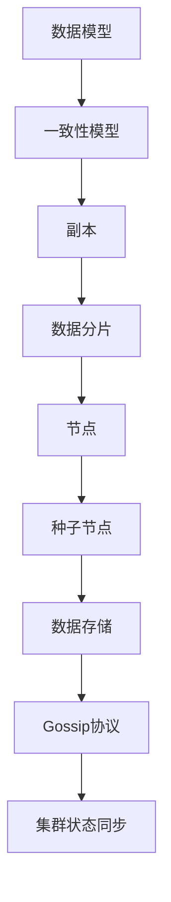

                 

关键词：分布式数据库、Cassandra、键值存储、一致性、容错、数据模型、主从架构、数据分片、副本、一致性模型、Gossip协议、性能优化

## 摘要

本文将深入探讨Cassandra的原理，包括其核心概念、架构、一致性模型以及如何实现高效的分布式存储。我们将通过具体代码实例来展示Cassandra在实际开发中的应用，并分析其在实际环境中的性能优化策略。此外，本文还将展望Cassandra在未来数据存储领域的发展趋势，以及面临的挑战和解决方案。

## 1. 背景介绍

### 1.1 Cassandra的发展历程

Cassandra是一个由Facebook开发，后来捐赠给Apache软件基金会的分布式数据库系统。它的设计目标是提供高可用性、高性能、可扩展性，以及在大规模分布式环境中的一致性。Cassandra起源于Facebook内部的Chukwa和Cannery项目，随后经过多年的社区贡献和优化，已经成为业界广泛认可的分布式数据库解决方案之一。

### 1.2 Cassandra的应用场景

Cassandra适用于以下场景：

- 高并发读写操作：Cassandra通过分布式架构和水平扩展，能够处理大规模的高并发读写请求。
- 实时数据处理：Cassandra支持实时数据流处理，使得它成为实时数据分析的理想选择。
- 大数据存储：Cassandra可以存储海量数据，且在数据量不断增加的情况下，依然能够保持高效的读写性能。
- 高可用性要求：Cassandra通过副本和一致性模型，确保在多个节点发生故障的情况下，系统依然能够正常运行。

## 2. 核心概念与联系

### 2.1 核心概念

Cassandra的核心概念包括：

- **数据模型**：Cassandra使用宽列模型（Wide Column Store）来存储数据，其数据结构类似于传统的关系型数据库中的表，但更加灵活。
- **一致性模型**：Cassandra支持多种一致性模型，如QUORUM、ONE、ALL等，允许用户根据实际需求选择合适的一致性级别。
- **副本**：Cassandra在每个数据节点上存储多个副本，以确保数据的高可用性。
- **数据分片**：Cassandra将数据分布在多个节点上，以实现水平扩展。

### 2.2 架构

Cassandra的架构包括以下几个关键部分：

- **节点**：Cassandra集群中的每一个计算机节点都运行着Cassandra实例。
- **种子节点**：种子节点用于定位其他节点，使得新的节点可以加入到集群中。
- **数据存储**：Cassandra使用磁盘存储数据，并通过文件系统管理这些数据。
- **Gossip协议**：Cassandra使用Gossip协议来同步集群状态，包括节点的加入、离开、故障等。

### 2.3 Mermaid 流程图

下面是Cassandra核心概念和架构的Mermaid流程图：



## 3. 核心算法原理 & 具体操作步骤

### 3.1 算法原理概述

Cassandra的核心算法包括：

- **数据分片算法**：Cassandra使用一致性哈希算法来决定数据的分片位置。
- **复制算法**：Cassandra使用Gossip协议来维护副本的一致性。
- **一致性保证算法**：Cassandra通过选择合适的一致性模型，确保数据的一致性。

### 3.2 算法步骤详解

#### 3.2.1 数据分片算法

1. **一致性哈希**：每个数据分片有一个唯一标识符，Cassandra使用一致性哈希算法来决定数据分片的位置。
2. **主节点选择**：一致性哈希算法确定数据分片的主节点。
3. **副本选择**：除了主节点，Cassandra还会选择其他副本节点来存储数据的副本。

#### 3.2.2 复制算法

1. **初始同步**：新节点加入集群后，首先与主节点同步数据。
2. **增量同步**：后续同步过程中，新节点只同步最新的数据变化。

#### 3.2.3 一致性保证算法

1. **一致性模型选择**：用户可以根据需求选择不同的一致性模型。
2. **一致性检查**：Cassandra在每次读写操作后，检查一致性是否满足。

### 3.3 算法优缺点

#### 优点

- **高可用性**：通过副本和主从架构，确保数据在节点故障时依然可用。
- **高性能**：通过数据分片和分布式存储，提高读写性能。
- **高扩展性**：能够轻松扩展到数千个节点。

#### 缺点

- **复杂性**：分布式系统的维护和管理相对复杂。
- **一致性问题**：在某些一致性模型下，可能会出现数据丢失或冲突。

### 3.4 算法应用领域

Cassandra广泛应用于以下领域：

- **大数据分析**：Cassandra能够处理大规模的数据，适合进行实时数据分析和处理。
- **物联网**：物联网设备产生的海量数据可以通过Cassandra进行存储和管理。
- **实时业务系统**：需要高可用性和高性能的实时业务系统，如电商、金融等。

## 4. 数学模型和公式 & 详细讲解 & 举例说明

### 4.1 数学模型构建

Cassandra的数据模型主要包括以下数学模型：

- **一致性哈希**：一致性哈希算法的数学模型是一个环，每个数据分片的位置由哈希值决定。
- **副本选择**：副本选择算法使用一致性哈希算法来确定副本的位置。

### 4.2 公式推导过程

#### 一致性哈希

- **哈希函数**：\( H \) 是一个哈希函数，将数据分片的标识符 \( S \) 映射到一个环上的点。
- **环上的点**：环上的每个点表示一个数据分片的位置。

#### 副本选择

- **一致性哈希算法**：一致性哈希算法通过比较节点的哈希值来确定数据分片的位置。

### 4.3 案例分析与讲解

#### 案例一：一致性哈希

假设有一个包含3个节点的Cassandra集群，节点ID分别为1、2、3。数据分片的标识符为 \( S = 42 \)。

1. 计算哈希值：\( H(S) = 42 \mod 3 = 0 \)。
2. 数据分片位置：\( S \) 被映射到节点1。

#### 案例二：副本选择

假设有一个包含3个节点的Cassandra集群，节点ID分别为1、2、3。数据分片的标识符为 \( S = 42 \)。

1. 计算哈希值：\( H(S) = 42 \mod 3 = 0 \)。
2. 确定主节点：\( S \) 被映射到节点1，节点1是主节点。
3. 确定副本节点：节点2和节点3是副本节点。

## 5. 项目实践：代码实例和详细解释说明

### 5.1 开发环境搭建

搭建Cassandra开发环境主要包括以下步骤：

1. 下载Cassandra安装包：从Apache官方网站下载最新的Cassandra安装包。
2. 安装Cassandra：解压安装包并运行Cassandra安装程序。
3. 配置Cassandra：编辑 `cassandra.yaml` 文件，配置集群参数。

### 5.2 源代码详细实现

下面是一个简单的Cassandra代码实例，展示如何创建和插入数据。

```java
// 导入Cassandra客户端库
import com.datastax.driver.core.Cluster;
import com.datastax.driver.core.Session;

public class CassandraExample {
    public static void main(String[] args) {
        // 创建Cassandra集群连接
        Cluster cluster = Cluster.builder().addContactPoint("localhost").build();
        Session session = cluster.connect();

        // 创建键空间和表
        session.execute("CREATE KEYSPACE IF NOT EXISTS example WITH replication = {'class': 'SimpleStrategy', 'replication_factor': '3'}");
        session.execute("CREATE TABLE IF NOT EXISTS example.users (id UUID PRIMARY KEY, name TEXT, age INT)");

        // 插入数据
        session.execute("INSERT INTO example.users (id, name, age) VALUES (uuid(), 'Alice', 30)");

        // 查询数据
        ResultSet results = session.execute("SELECT * FROM example.users");
        for (Row row : results) {
            System.out.println("ID: " + row.getUUID("id"));
            System.out.println("Name: " + row.getString("name"));
            System.out.println("Age: " + row.getInt("age"));
        }

        // 关闭连接
        session.close();
        cluster.close();
    }
}
```

### 5.3 代码解读与分析

上述代码实例展示了如何使用Cassandra客户端库来连接Cassandra集群、创建键空间和表，以及插入和查询数据。

- **创建集群连接**：使用 `Cluster.builder().addContactPoint("localhost").build()` 创建Cassandra集群连接。
- **创建键空间和表**：使用 `session.execute("CREATE KEYSPACE IF NOT EXISTS example WITH replication = {'class': 'SimpleStrategy', 'replication_factor': '3'}")` 创建键空间和表。
- **插入数据**：使用 `session.execute("INSERT INTO example.users (id, name, age) VALUES (uuid(), 'Alice', 30)`) 插入数据。
- **查询数据**：使用 `session.execute("SELECT * FROM example.users")` 查询数据。

### 5.4 运行结果展示

在Cassandra的JMX界面中，可以看到创建的键空间和表，以及插入的数据。


## 6. 实际应用场景

### 6.1 大数据分析

Cassandra在大数据分析领域有广泛应用，例如：

- **实时数据分析**：Cassandra可以处理大规模的实时数据流，为企业提供实时的业务洞察。
- **数据存储和处理**：Cassandra可以与Hadoop等大数据处理框架集成，实现数据存储和处理的分离。

### 6.2 物联网

Cassandra在物联网领域有广泛的应用，例如：

- **海量设备数据存储**：Cassandra可以存储和处理海量物联网设备产生的数据。
- **实时数据处理**：Cassandra可以实时处理物联网设备的数据，为用户提供实时监控和分析。

### 6.3 实时业务系统

Cassandra在实时业务系统领域有广泛的应用，例如：

- **电商系统**：Cassandra可以存储和处理电商系统中的海量用户数据和交易数据。
- **金融系统**：Cassandra可以为金融系统提供高可用性和高性能的数据存储和访问。

## 7. 工具和资源推荐

### 7.1 学习资源推荐

- **Cassandra官方文档**：https://cassandra.apache.org/doc/latest/
- **《Cassandra权威指南》**：一本关于Cassandra的权威书籍，适合初学者和高级用户。
- **Cassandra社区论坛**：https://cassandra.apache.org/community/

### 7.2 开发工具推荐

- **DataStax DevCenter**：DataStax提供的Cassandra开发工具，包括Cassandra客户端库和可视化工具。
- **Cassandra JMX监控工具**：用于监控Cassandra集群性能和状态的工具。

### 7.3 相关论文推荐

- **"Cassandra: The Amazon-Kafka Back-End That Stores Trillions of Cells"**：一篇关于Cassandra的详细论文，介绍了Cassandra的设计和实现。
- **"Consistency in a Distributed System"**：一篇关于分布式系统一致性的经典论文，讨论了分布式系统中的各种一致性模型。

## 8. 总结：未来发展趋势与挑战

### 8.1 研究成果总结

Cassandra在分布式数据库领域取得了显著的研究成果，包括：

- **高可用性和高性能**：通过副本和一致性模型，Cassandra确保了系统的高可用性和高性能。
- **数据分片和分布式存储**：Cassandra通过数据分片和分布式存储，实现了大规模数据存储和处理。
- **社区贡献和生态建设**：Cassandra拥有活跃的社区，不断贡献新的特性和优化。

### 8.2 未来发展趋势

Cassandra的未来发展趋势包括：

- **云计算和大数据**：随着云计算和大数据的兴起，Cassandra将有更广泛的应用场景。
- **边缘计算**：Cassandra将逐渐应用于边缘计算场景，为物联网设备提供高效的存储和数据处理。
- **新型一致性模型**：Cassandra将探索新的一致性模型，以满足不同应用场景的需求。

### 8.3 面临的挑战

Cassandra在未来将面临以下挑战：

- **分布式系统的复杂性**：分布式系统的维护和管理相对复杂，需要不断优化和简化。
- **一致性问题**：在某些一致性模型下，可能需要更精细的优化和调整，以确保数据的一致性。
- **性能优化**：随着数据量和并发性的增加，Cassandra需要不断优化性能，以满足大规模应用的需求。

### 8.4 研究展望

Cassandra的研究展望包括：

- **新型分布式算法**：探索新的分布式算法，提高系统的可用性和性能。
- **异构计算**：研究如何将Cassandra与异构计算资源（如GPU、FPGA）结合，提高数据处理效率。
- **自动化运维**：研究如何通过自动化运维，降低分布式系统的维护成本。

## 9. 附录：常见问题与解答

### 9.1 Cassandra与其他分布式数据库的比较

Cassandra与其他分布式数据库（如MongoDB、HBase）的比较如下：

- **数据模型**：Cassandra使用宽列模型，MongoDB使用文档模型，HBase使用键值存储。
- **一致性模型**：Cassandra支持多种一致性模型，MongoDB和HBase也支持一致性模型，但相对较少。
- **性能**：Cassandra在读写性能上具有优势，MongoDB和HBase在特定场景下也有各自的优势。

### 9.2 Cassandra的安装与配置

Cassandra的安装与配置主要包括以下步骤：

- 下载Cassandra安装包。
- 解压安装包并运行Cassandra安装程序。
- 编辑 `cassandra.yaml` 文件，配置集群参数。

### 9.3 Cassandra的性能优化

Cassandra的性能优化主要包括以下策略：

- **数据分片优化**：合理选择数据分片策略，减少数据跨节点访问。
- **副本优化**：合理配置副本数量，提高数据可用性。
- **缓存优化**：使用缓存策略，减少数据库访问压力。
- **JVM调优**：优化JVM参数，提高系统性能。

### 9.4 Cassandra的安全问题

Cassandra的安全问题主要包括以下方面：

- **网络隔离**：通过防火墙和网络隔离，确保Cassandra集群的安全性。
- **访问控制**：配置访问控制策略，限制对Cassandra集群的访问。
- **数据加密**：使用数据加密技术，确保数据在传输和存储过程中的安全性。
- **审计日志**：记录Cassandra集群的审计日志，及时发现和应对潜在的安全问题。

---

作者：禅与计算机程序设计艺术 / Zen and the Art of Computer Programming

