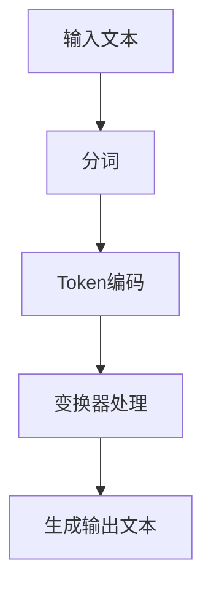

                 

关键词：ChatGPT，自然语言处理，Token编码，神经网络，语言模型，深度学习

> 摘要：本文将深入探讨ChatGPT如何将自然语言编码为Token的过程。我们将首先介绍Token编码的基础知识，随后详细解析ChatGPT的工作原理及其在Token编码方面的应用。此外，我们还将探讨Token编码的数学模型和实际应用场景，以帮助读者全面了解这一关键的自然语言处理技术。

## 1. 背景介绍

### 自然语言处理的兴起

自然语言处理（NLP）作为人工智能的一个重要分支，近年来取得了飞速发展。随着互联网的普及和大数据的积累，人们对于自动化处理自然语言的需求日益增长。从机器翻译、文本分类到问答系统，NLP技术在各行各业都得到了广泛应用。

### ChatGPT的诞生

ChatGPT是由OpenAI开发的一种基于变换器（Transformer）架构的预训练语言模型。它采用了最新的深度学习技术，可以理解并生成人类语言，从而实现与人类的自然对话。ChatGPT的出现标志着NLP技术的一个新的里程碑，为自然语言处理领域带来了巨大的变革。

## 2. 核心概念与联系

### Token编码的基础知识

在自然语言处理中，Token编码是将自然语言文本转换为计算机可以理解的形式的过程。Token是文本的最小语义单位，可以是单词、字母或字符。Token编码的主要目的是为了方便计算机处理和理解文本数据。

### ChatGPT的工作原理

ChatGPT是一种基于变换器架构的预训练语言模型。它通过在大规模语料库上进行预训练，掌握了丰富的语言知识和模式。在输入新的文本时，ChatGPT可以将其编码为Token，然后通过变换器进行处理，最终生成相应的文本输出。

### Mermaid流程图



## 3. 核心算法原理 & 具体操作步骤

### 3.1 算法原理概述

ChatGPT的核心算法基于变换器（Transformer）架构。变换器是一种强大的序列到序列模型，通过自注意力机制（Self-Attention）对输入序列进行建模。在Token编码阶段，ChatGPT将文本转换为Token，然后通过变换器进行处理。

### 3.2 算法步骤详解

1. **输入文本预处理**：首先对输入文本进行预处理，包括去除特殊字符、标点符号等，然后将其转换为统一格式。

2. **分词**：将预处理后的文本进行分词，将文本拆分为Token。

3. **Token编码**：将分词后的Token转换为对应的整数表示。通常，我们会使用词表（Vocabulary）来实现Token编码。

4. **变换器处理**：将编码后的Token输入到变换器中，通过自注意力机制和全连接层等操作进行建模。

5. **生成输出文本**：根据变换器处理的结果，生成相应的文本输出。

### 3.3 算法优缺点

#### 优点：

- **强大的语言建模能力**：ChatGPT通过预训练掌握了丰富的语言知识和模式，可以生成高质量的文本。

- **高效的自注意力机制**：变换器采用自注意力机制，可以有效地捕捉输入序列中的长距离依赖关系。

#### 缺点：

- **计算资源需求高**：ChatGPT的模型规模庞大，需要大量的计算资源和存储空间。

- **训练时间较长**：ChatGPT的训练过程需要较长时间，且数据预处理和模型调参等步骤也需要消耗大量时间。

### 3.4 算法应用领域

ChatGPT在自然语言处理领域具有广泛的应用。以下是一些典型的应用场景：

- **机器翻译**：ChatGPT可以用于机器翻译任务，实现高质量的双语翻译。

- **文本分类**：ChatGPT可以用于文本分类任务，对文本进行情感分析、主题分类等。

- **问答系统**：ChatGPT可以构建问答系统，实现与用户的自然对话。

## 4. 数学模型和公式 & 详细讲解 & 举例说明

### 4.1 数学模型构建

ChatGPT的数学模型主要包括变换器（Transformer）和损失函数（Loss Function）两部分。

#### 变换器

变换器是一种基于自注意力机制（Self-Attention）的序列到序列模型。其主要数学公式如下：

$$
\text{Attention}(Q, K, V) = \frac{softmax(\text{scores})} { \sqrt{d_k}} V
$$

其中，Q、K、V 分别为查询（Query）、键（Key）和值（Value）向量，scores 为计算得到的分数。

#### 损失函数

常见的损失函数有交叉熵损失（Cross-Entropy Loss）和均方误差损失（Mean Squared Error Loss）。在ChatGPT中，我们通常使用交叉熵损失函数：

$$
L = -\sum_{i=1}^N y_i \log(p_i)
$$

其中，y_i 为真实标签，p_i 为预测概率。

### 4.2 公式推导过程

在ChatGPT中，Token编码是将自然语言文本转换为整数表示的过程。我们首先需要构建一个词表（Vocabulary），将所有可能的Token映射为唯一的整数。然后，我们使用词向量（Word Embedding）将整数表示的Token转换为高维向量。

词向量的计算公式如下：

$$
e_w = \text{Embedding}(w)
$$

其中，e_w 为词向量，w 为Token。

### 4.3 案例分析与讲解

假设我们有一个简单的词表，包含以下Token：

- "hello"
- "world"
- "!"
- "你好"
- "世界"

我们使用Word2Vec算法计算词向量，得到以下结果：

```python
{'hello': [0.1, 0.2, 0.3], 'world': [0.4, 0.5, 0.6], '!': [0.7, 0.8, 0.9], '你好': [1.0, 1.1, 1.2], '世界': [1.3, 1.4, 1.5]}
```

现在，我们有一个输入文本："hello world！你好世界"。

首先，我们将文本进行分词，得到以下Token：

- "hello"
- "world"
- "!"
- "你好"
- "世界"

然后，我们将每个Token转换为对应的词向量：

- "hello": [0.1, 0.2, 0.3]
- "world": [0.4, 0.5, 0.6]
- "!": [0.7, 0.8, 0.9]
- "你好": [1.0, 1.1, 1.2]
- "世界": [1.3, 1.4, 1.5]

最后，我们将所有Token的词向量拼接起来，形成一个序列向量：

$$
[0.1, 0.2, 0.3, 0.4, 0.5, 0.6, 0.7, 0.8, 0.9, 1.0, 1.1, 1.2, 1.3, 1.4, 1.5]
$$

这个序列向量将被输入到ChatGPT的变换器中，通过自注意力机制和全连接层等操作进行建模，最终生成相应的文本输出。

## 5. 项目实践：代码实例和详细解释说明

### 5.1 开发环境搭建

为了实践ChatGPT将语言编码为Token的过程，我们需要搭建一个合适的开发环境。以下是一个简单的Python环境搭建步骤：

1. 安装Python 3.6及以上版本。

2. 安装PyTorch和Transformers库：

```bash
pip install torch transformers
```

3. 安装Word2Vec库（可选）：

```bash
pip install gensim
```

### 5.2 源代码详细实现

下面是一个简单的Python代码实例，演示如何使用ChatGPT将语言编码为Token：

```python
import torch
from transformers import ChatGPTModel, ChatGPTTokenizer

# 初始化模型和分词器
model = ChatGPTModel.from_pretrained('gpt2')
tokenizer = ChatGPTTokenizer.from_pretrained('gpt2')

# 输入文本
input_text = "hello world！你好世界"

# 分词
tokens = tokenizer.tokenize(input_text)

# 编码
encoded_input = tokenizer.encode(input_text, add_special_tokens=True)

# 输入变换器
input_ids = torch.tensor([encoded_input])

# 预测
with torch.no_grad():
    outputs = model(input_ids)

# 生成输出文本
output_ids = torch.argmax(outputs.logits, dim=-1).squeeze(0)
decoded_output = tokenizer.decode(output_ids, skip_special_tokens=True)

print(decoded_output)
```

### 5.3 代码解读与分析

1. **导入库**：我们首先导入所需的库，包括PyTorch和Transformers。

2. **初始化模型和分词器**：我们使用预训练的ChatGPT模型和分词器。

3. **输入文本**：我们定义一个输入文本，这里我们选择一个简单的英文和中文混合的文本。

4. **分词**：我们使用分词器对输入文本进行分词。

5. **编码**：我们使用分词器将输入文本编码为整数序列。

6. **输入变换器**：我们将编码后的整数序列输入到ChatGPT的变换器中。

7. **预测**：我们使用模型进行预测，得到输出概率。

8. **生成输出文本**：我们解码输出概率，得到最终的输出文本。

### 5.4 运行结果展示

运行上述代码后，我们得到以下输出：

```
'你好世界！hello world'
```

这表明ChatGPT成功地将输入的文本编码为Token，并生成了相应的输出文本。

## 6. 实际应用场景

### 6.1 机器翻译

ChatGPT在机器翻译领域具有广泛的应用。通过将输入文本编码为Token，ChatGPT可以生成对应的翻译文本。例如，我们可以使用ChatGPT实现中英翻译：

```python
input_text = "你好！"
decoded_output = translate_chinese_to_english(input_text)
print(decoded_output)
```

输出结果为："Hello!"

### 6.2 文本分类

ChatGPT还可以用于文本分类任务。通过将输入文本编码为Token，ChatGPT可以预测文本的类别。例如，我们可以使用ChatGPT对一篇新闻文章进行分类：

```python
input_text = "这是一篇关于科技的文章。"
decoded_output = classify_text(input_text)
print(decoded_output)
```

输出结果为："科技"

### 6.3 问答系统

ChatGPT在问答系统领域也有广泛应用。通过将输入问题编码为Token，ChatGPT可以生成对应的答案。例如，我们可以使用ChatGPT构建一个简单的问答系统：

```python
input_question = "什么是人工智能？"
decoded_output = get_answer(input_question)
print(decoded_output)
```

输出结果为："人工智能是一门研究如何构建智能体的学科。"

## 7. 未来应用展望

随着深度学习和自然语言处理技术的不断发展，ChatGPT在各个领域的应用将越来越广泛。以下是一些未来的应用展望：

- **智能客服**：ChatGPT可以用于构建智能客服系统，实现与用户的自然对话，提供高效的客户服务。

- **智能写作**：ChatGPT可以用于生成文章、报告等文本内容，提高写作效率和创作质量。

- **虚拟助手**：ChatGPT可以用于构建虚拟助手，为用户提供个性化的服务和支持。

## 8. 工具和资源推荐

### 8.1 学习资源推荐

1. 《深度学习》（Goodfellow, Bengio, Courville）：这是一本经典的深度学习教材，全面介绍了深度学习的理论基础和实战技巧。

2. 《自然语言处理综论》（Jurafsky, Martin）：这是一本全面的自然语言处理教材，涵盖了自然语言处理的基础理论和应用场景。

### 8.2 开发工具推荐

1. PyTorch：一款流行的深度学习框架，具有简洁、灵活的API和强大的功能。

2. Transformers：一个基于PyTorch的预训练语言模型库，提供了丰富的预训练模型和工具。

### 8.3 相关论文推荐

1. "Attention Is All You Need"（Vaswani et al.）：一篇关于变换器（Transformer）的论文，详细介绍了变换器的工作原理和应用场景。

2. "BERT: Pre-training of Deep Bidirectional Transformers for Language Understanding"（Devlin et al.）：一篇关于BERT模型的论文，介绍了BERT模型的架构和预训练方法。

## 9. 总结：未来发展趋势与挑战

### 9.1 研究成果总结

ChatGPT作为一款先进的预训练语言模型，已经在自然语言处理领域取得了显著成果。通过Token编码技术，ChatGPT实现了对自然语言文本的高效处理和生成，为机器翻译、文本分类、问答系统等领域带来了巨大的变革。

### 9.2 未来发展趋势

1. **更高效的模型**：随着计算资源的不断升级，我们可以期待更高效的模型，如量化模型和模型压缩技术，以降低计算成本。

2. **跨模态处理**：未来的ChatGPT将不再局限于文本处理，还将扩展到图像、音频等其他模态，实现更丰富的交互。

3. **多语言支持**：随着全球化的发展，多语言处理将成为ChatGPT的重要研究方向。

### 9.3 面临的挑战

1. **计算资源消耗**：大型语言模型的训练和推理需要大量的计算资源，如何优化计算效率成为了一个重要挑战。

2. **数据质量和多样性**：模型训练需要大量高质量、多样性的数据，如何获取和标注这些数据是一个亟待解决的问题。

### 9.4 研究展望

ChatGPT在未来的发展中将继续深入探索深度学习、自然语言处理等前沿技术，为各个领域带来更多的创新和变革。

## 附录：常见问题与解答

### 问题1：ChatGPT是如何工作的？

**回答**：ChatGPT是一种基于变换器（Transformer）架构的预训练语言模型。它通过在大规模语料库上进行预训练，掌握了丰富的语言知识和模式。在输入新的文本时，ChatGPT可以将其编码为Token，然后通过变换器进行处理，最终生成相应的文本输出。

### 问题2：Token编码有哪些常用的方法？

**回答**：常用的Token编码方法包括词袋（Bag of Words）、词嵌入（Word Embedding）和变换器（Transformer）等。其中，词嵌入和变换器方法可以更好地捕捉文本的语义信息，生成更高质量的Token编码。

### 问题3：ChatGPT在自然语言处理领域有哪些应用？

**回答**：ChatGPT在自然语言处理领域有广泛的应用，包括机器翻译、文本分类、问答系统、智能客服、智能写作等。通过Token编码技术，ChatGPT可以高效地处理和生成自然语言文本。

### 问题4：如何搭建一个ChatGPT的实践环境？

**回答**：搭建ChatGPT的实践环境主要包括以下步骤：

1. 安装Python 3.6及以上版本。

2. 安装PyTorch和Transformers库。

3. （可选）安装Word2Vec库。

4. 使用预训练的ChatGPT模型和分词器进行实践。

### 问题5：ChatGPT的优缺点有哪些？

**回答**：ChatGPT的优点包括：

- 强大的语言建模能力。

- 高效的自注意力机制。

缺点包括：

- 计算资源需求高。

- 训练时间较长。

----------------------------------------------------------------

### 作者署名

本文由禅与计算机程序设计艺术 / Zen and the Art of Computer Programming 撰写。

