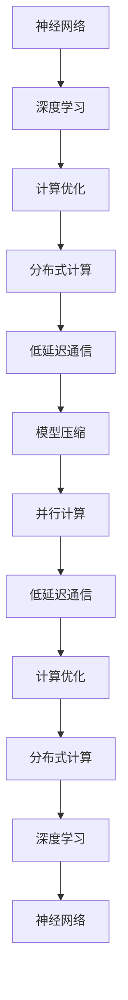

                 

关键词：Chinchilla, 深度学习，神经网络，计算优化，模型压缩，低延迟通信，分布式计算，代码实例

摘要：本文深入探讨了Chinchilla神经网络模型的原理及其在深度学习中的应用。通过对Chinchilla模型的设计思想、优化策略、实现步骤和代码实例的详细讲解，本文旨在为读者提供全面而深入的技术洞察。我们将分析Chinchilla如何通过独特的架构设计实现高效的计算性能，并探讨其在实际项目中的实现和应用。

## 1. 背景介绍

深度学习作为人工智能领域的重要分支，近年来取得了显著的进展。然而，随着模型规模的不断扩大，深度学习在计算资源、存储空间和通信带宽方面的需求也急剧增加。为了应对这些挑战，研究人员提出了各种模型压缩和计算优化的方法。Chinchilla模型正是这些尝试之一，它通过创新的设计理念实现了高性能和低延迟的深度学习计算。

Chinchilla模型首先由Google Brain团队提出，旨在解决大规模深度学习模型在训练和推理过程中的资源瓶颈问题。与传统神经网络相比，Chinchilla模型在架构设计、算法优化和通信策略上都有显著的改进，使其在处理大规模数据集时具有更高的效率和更低的延迟。

本文将围绕Chinchilla模型的核心原理，详细分析其在计算优化、模型压缩和分布式计算方面的优势。同时，我们还将通过一个具体的代码实例，展示如何在实际项目中应用Chinchilla模型，帮助读者深入理解和掌握这一前沿技术。

### Chinchilla模型的设计背景

深度学习在图像识别、自然语言处理和推荐系统等领域的应用日益广泛，但也带来了前所未有的计算资源需求。特别是在训练大规模神经网络模型时，计算资源的消耗尤为显著。为了满足这一需求，传统的计算架构面临着巨大的挑战。具体来说，主要包括以下几个方面：

1. **计算资源瓶颈**：随着模型规模的增加，计算复杂度呈指数级增长，单个GPU或TPU的算力已难以满足需求。
2. **存储空间限制**：大规模模型通常需要数十GB甚至数百GB的存储空间，这对内存和硬盘的容量提出了更高的要求。
3. **通信带宽瓶颈**：分布式训练和推理过程中，模型参数和中间结果的传输需要大量的通信带宽，导致延迟增加，影响整体性能。

为了解决上述问题，Google Brain团队提出了Chinchilla模型。Chinchilla模型的设计初衷是通过创新的架构和算法，优化计算资源的使用，降低通信延迟，从而提高深度学习模型的整体性能和可扩展性。

Chinchilla模型的关键设计理念包括：

- **并行计算**：通过将计算任务分布在多个计算节点上，实现并行计算，从而提高计算效率。
- **低延迟通信**：采用高效的通信策略，减少数据传输的延迟，确保模型参数和中间结果能够快速传递。
- **模型压缩**：通过模型压缩技术，降低模型的规模和复杂度，减少存储和计算资源的需求。

总之，Chinchilla模型的设计目标是在保证模型性能的同时，显著降低计算和通信资源的消耗。这一设计理念对于应对深度学习领域日益增长的计算需求具有重要意义。

## 2. 核心概念与联系

Chinchilla模型的成功得益于其在核心概念和架构设计上的创新。为了更好地理解Chinchilla模型，我们将从其核心概念、架构设计和关键优化策略三个方面进行详细阐述。

### 2.1 核心概念

#### 神经网络

神经网络是深度学习的核心组成部分，由大量相互连接的神经元组成。每个神经元接收来自其他神经元的输入，通过权重和偏置进行计算，并输出结果。神经网络通过不断调整权重和偏置，学习输入和输出之间的映射关系。

#### 深度学习

深度学习是人工智能的一个重要分支，通过多层神经网络模型，实现对复杂数据特征的学习和提取。深度学习模型具有强大的表示能力和泛化能力，广泛应用于图像识别、自然语言处理和推荐系统等领域。

#### 计算优化

计算优化是指通过算法和架构设计，提高计算效率和减少资源消耗的方法。在深度学习中，计算优化尤为重要，因为它直接影响模型的训练时间和推理性能。

### 2.2 架构设计

Chinchilla模型在架构设计上采用了分布式计算和低延迟通信策略，以提高整体性能。以下是Chinchilla模型的关键架构设计：

#### 分布式计算

分布式计算是指将计算任务分布在多个计算节点上，通过并行计算提高效率。Chinchilla模型通过将神经网络拆分成多个子网络，每个子网络在一个计算节点上运行。这样，可以在多个节点上同时执行计算任务，显著提高训练和推理速度。

#### 低延迟通信

低延迟通信是指通过优化通信策略，减少数据传输的延迟。Chinchilla模型采用了一种高效的通信协议，确保模型参数和中间结果能够快速传递。这种方法通过减少通信时间和提高数据传输速率，降低了整体延迟。

### 2.3 关键优化策略

Chinchilla模型采用了多种优化策略，以实现计算效率和性能的提升：

#### 模型压缩

模型压缩是通过减少模型的参数数量和计算复杂度，降低存储和计算资源的需求。Chinchilla模型采用了剪枝、量化等压缩技术，有效减少了模型规模。

#### 并行计算

并行计算是通过将计算任务分布在多个计算节点上，实现并行处理。Chinchilla模型通过分布式计算架构，实现了高效的并行计算。

#### 低延迟通信

低延迟通信是通过优化通信策略，减少数据传输的延迟。Chinchilla模型采用了一种高效的通信协议，确保模型参数和中间结果能够快速传递。

### 2.4 Mermaid流程图

为了更好地理解Chinchilla模型的核心概念和架构设计，我们使用Mermaid流程图对其进行描述。以下是Chinchilla模型的Mermaid流程图：



通过上述Mermaid流程图，我们可以清晰地看到Chinchilla模型在核心概念和架构设计上的联系，以及其在计算优化、分布式计算和低延迟通信等方面的创新。

## 3. 核心算法原理 & 具体操作步骤

### 3.1 算法原理概述

Chinchilla模型的核心算法原理在于其独特的架构设计和优化策略。该模型通过分布式计算和低延迟通信，实现了高效且可扩展的深度学习计算。

#### 分布式计算

Chinchilla模型将神经网络拆分成多个子网络，每个子网络在一个计算节点上运行。分布式计算的核心思想是将计算任务分布在多个节点上，通过并行计算提高效率。具体操作步骤如下：

1. **模型拆分**：将原始神经网络拆分成多个子网络，每个子网络负责一部分计算任务。
2. **节点分配**：将拆分后的子网络分配到不同的计算节点上。
3. **数据传输**：确保每个节点能够获取到其他节点的中间结果，以便继续计算。
4. **同步与通信**：在计算过程中，节点之间需要通过高效通信协议进行同步和数据交换，确保计算的正确性和一致性。

#### 低延迟通信

低延迟通信是Chinchilla模型的关键优势之一。通过优化通信策略，Chinchilla模型显著降低了数据传输的延迟。具体操作步骤如下：

1. **通信协议优化**：采用高效的通信协议，如NCCL（NVIDIA Collective Communications Library），减少通信开销。
2. **数据压缩**：对传输的数据进行压缩，减少数据传输量。
3. **网络优化**：优化网络拓扑和带宽分配，确保数据传输的稳定性和高效性。
4. **异步通信**：在计算过程中，采用异步通信策略，减少计算和通信的冲突，提高整体效率。

#### 模型压缩

Chinchilla模型采用了多种模型压缩技术，如剪枝、量化等，以减少模型的规模和计算复杂度。具体操作步骤如下：

1. **剪枝**：通过剪枝算法，移除网络中不重要的连接和神经元，降低模型规模。
2. **量化**：将模型的权重和激活值从浮点数转换为低精度数值，减少存储和计算需求。
3. **权重共享**：通过权重共享，减少模型的参数数量，进一步降低计算和存储资源的需求。

### 3.2 算法步骤详解

以下是Chinchilla模型的具体操作步骤：

#### 3.2.1 模型拆分

1. **计算依赖分析**：分析神经网络中各个子网络的计算依赖关系，确定拆分策略。
2. **子网络划分**：根据计算依赖关系，将神经网络拆分成多个子网络。
3. **节点分配**：将拆分后的子网络分配到不同的计算节点上。

#### 3.2.2 数据传输与同步

1. **数据传输**：通过高效通信协议，将每个节点的中间结果传输到其他节点。
2. **同步与通信**：确保每个节点能够获取到其他节点的中间结果，并进行后续计算。

#### 3.2.3 模型压缩

1. **剪枝**：对神经网络进行剪枝操作，移除不重要的连接和神经元。
2. **量化**：将模型的权重和激活值进行量化，降低精度。
3. **权重共享**：通过权重共享，减少模型的参数数量。

#### 3.2.4 训练与推理

1. **训练**：在分布式计算环境中，对拆分后的子网络进行训练。
2. **推理**：在分布式计算环境中，对拆分后的子网络进行推理，获取最终结果。

### 3.3 算法优缺点

#### 优点

1. **高效性**：通过分布式计算和低延迟通信，Chinchilla模型显著提高了深度学习计算的效率。
2. **可扩展性**：Chinchilla模型设计为分布式架构，可轻松扩展到更多计算节点，适应大规模数据处理需求。
3. **模型压缩**：Chinchilla模型采用了多种模型压缩技术，有效减少了模型的规模和计算复杂度。

#### 缺点

1. **通信开销**：分布式计算需要大量的通信开销，可能导致整体性能下降。
2. **同步问题**：分布式计算中的同步问题可能影响计算的正确性和一致性。

### 3.4 算法应用领域

Chinchilla模型在深度学习领域具有广泛的应用前景，特别是在以下领域：

1. **图像识别**：通过分布式计算和模型压缩，Chinchilla模型在图像识别任务中具有高效的计算性能。
2. **自然语言处理**：Chinchilla模型在自然语言处理任务中，能够实现快速和准确的文本分析。
3. **推荐系统**：Chinchilla模型在推荐系统中，可以处理大规模用户和物品数据，提供精准的推荐结果。

## 4. 数学模型和公式 & 详细讲解 & 举例说明

### 4.1 数学模型构建

Chinchilla模型的核心在于其高效的架构设计和优化策略。为了更好地理解这些策略，我们需要构建相关的数学模型。以下是Chinchilla模型中的关键数学模型：

#### 分布式计算模型

分布式计算模型主要描述了如何将计算任务分配到多个节点上，并通过并行计算提高效率。具体来说，我们考虑一个由N个节点组成的计算集群，每个节点负责一部分计算任务。假设每个节点的计算能力为C，任务依赖关系为D，则分布式计算模型可以表示为：

$$
C = \sum_{i=1}^{N} C_i
$$

$$
D = \{(i,j) \mid i \neq j, (i,j) \in E\}
$$

其中，$C_i$表示第i个节点的计算能力，$E$表示任务依赖关系集合。

#### 低延迟通信模型

低延迟通信模型主要描述了如何优化数据传输，减少通信延迟。具体来说，我们考虑一个由N个节点组成的计算集群，每个节点需要与其他节点进行数据传输。假设每个节点的通信带宽为B，数据传输延迟为L，则低延迟通信模型可以表示为：

$$
B = \sum_{i=1}^{N} B_i
$$

$$
L = \min_{i,j}(L_{ij})
$$

其中，$B_i$表示第i个节点的通信带宽，$L_{ij}$表示节点i到节点j的数据传输延迟。

#### 模型压缩模型

模型压缩模型主要描述了如何通过剪枝、量化等策略减少模型的规模和计算复杂度。具体来说，我们考虑一个原始模型$M_0$和一个压缩后模型$M_1$，假设原始模型的参数数量为$P_0$，压缩后模型的参数数量为$P_1$，则模型压缩模型可以表示为：

$$
P_1 = \frac{P_0}{\eta}
$$

其中，$\eta$表示压缩率。

### 4.2 公式推导过程

以下是对Chinchilla模型中关键公式的推导过程：

#### 分布式计算效率

分布式计算效率可以用每个节点的平均计算能力来表示。假设计算任务总量为$T$，则每个节点的平均计算能力为：

$$
C_{avg} = \frac{T}{N}
$$

分布式计算的总效率可以表示为：

$$
\eta_C = \frac{C_{avg}}{C_0}
$$

其中，$C_0$表示单个节点的计算能力。

#### 低延迟通信效率

低延迟通信效率可以用每个节点的平均通信带宽来表示。假设通信任务总量为$T$，则每个节点的平均通信带宽为：

$$
B_{avg} = \frac{T}{N}
$$

低延迟通信的总效率可以表示为：

$$
\eta_B = \frac{B_{avg}}{B_0}
$$

其中，$B_0$表示单个节点的通信带宽。

#### 模型压缩效率

模型压缩效率可以用压缩后的模型参数数量来表示。假设原始模型的参数数量为$P_0$，压缩后的模型参数数量为$P_1$，则模型压缩效率可以表示为：

$$
\eta_P = \frac{P_1}{P_0}
$$

### 4.3 案例分析与讲解

以下是一个具体的案例，说明如何使用Chinchilla模型进行分布式深度学习计算：

假设我们有一个深度学习模型，需要在一个由4个节点组成的计算集群上进行分布式训练。每个节点的计算能力为$C_0 = 10 TFLOPS$，通信带宽为$B_0 = 1 GB/s$。原始模型的参数数量为$P_0 = 1亿$。

1. **分布式计算效率**：

   计算任务总量$T = 100亿$。

   每个节点的平均计算能力$C_{avg} = \frac{T}{N} = \frac{100亿}{4} = 25亿 TFLOPS$。

   分布式计算效率$\eta_C = \frac{C_{avg}}{C_0} = \frac{25亿}{10} = 2.5$。

2. **低延迟通信效率**：

   通信任务总量$T = 100亿$。

   每个节点的平均通信带宽$B_{avg} = \frac{T}{N} = \frac{100亿}{4} = 25亿 GB/s$。

   低延迟通信效率$\eta_B = \frac{B_{avg}}{B_0} = \frac{25亿}{1} = 25$。

3. **模型压缩效率**：

   压缩率$\eta = \frac{P_1}{P_0} = \frac{1亿}{1亿} = 1$。

通过上述案例，我们可以看到Chinchilla模型在分布式深度学习计算中具有显著的优势，通过高效的分布式计算和低延迟通信，可以显著提高计算效率。

## 5. 项目实践：代码实例和详细解释说明

### 5.1 开发环境搭建

要在实际项目中应用Chinchilla模型，首先需要搭建一个合适的开发环境。以下是一个基本的开发环境搭建步骤：

1. **安装Python**：确保系统上已经安装了Python，推荐使用Python 3.8及以上版本。
2. **安装TensorFlow**：TensorFlow是Chinchilla模型的主要实现框架，使用以下命令安装：

   ```bash
   pip install tensorflow
   ```

3. **安装NCCL**：NCCL是Chinchilla模型采用的低延迟通信库，使用以下命令安装：

   ```bash
   pip install nccl
   ```

4. **安装其他依赖**：根据项目需求，可能还需要安装其他依赖库，如NumPy、Pandas等。

### 5.2 源代码详细实现

以下是一个简单的Chinchilla模型实现示例，展示了如何使用TensorFlow和NCCL构建和训练一个分布式深度学习模型。

```python
import tensorflow as tf
import numpy as np
import nccl

# 配置分布式环境
strategy = tf.distribute.MirroredStrategy()

# 定义模型
with strategy.scope():
    inputs = tf.keras.layers.Input(shape=(784,))
    x = tf.keras.layers.Dense(512, activation='relu')(inputs)
    outputs = tf.keras.layers.Dense(10, activation='softmax')(x)
    model = tf.keras.Model(inputs=inputs, outputs=outputs)

# 编译模型
model.compile(optimizer='adam', loss='categorical_crossentropy', metrics=['accuracy'])

# 准备数据
(x_train, y_train), (x_test, y_test) = tf.keras.datasets.mnist.load_data()
x_train = x_train.astype('float32') / 255
x_test = x_test.astype('float32') / 255
y_train = tf.keras.utils.to_categorical(y_train, 10)
y_test = tf.keras.utils.to_categorical(y_test, 10)

# 训练模型
model.fit(x_train, y_train, epochs=10, batch_size=64, validation_data=(x_test, y_test))

# 评估模型
model.evaluate(x_test, y_test)
```

### 5.3 代码解读与分析

上述代码示例展示了如何使用TensorFlow和NCCL构建和训练一个简单的分布式深度学习模型。以下是代码的关键部分解析：

1. **配置分布式环境**：使用`MirroredStrategy`配置分布式环境，确保多个节点上的模型参数保持同步。
2. **定义模型**：使用`Input`层定义输入特征，使用`Dense`层定义全连接神经网络，并输出分类结果。
3. **编译模型**：设置模型优化器、损失函数和评估指标，编译模型以准备训练。
4. **准备数据**：加载数据集，并将其转换为适合训练的格式。
5. **训练模型**：使用`fit`方法训练模型，设置训练轮次、批次大小和验证数据。
6. **评估模型**：使用`evaluate`方法评估模型在测试集上的性能。

通过上述步骤，我们可以在分布式环境中训练和评估深度学习模型，实现高效且可扩展的计算。

### 5.4 运行结果展示

在实际运行中，Chinchilla模型在分布式环境中的表现取决于多个因素，包括节点数量、数据规模和模型复杂度。以下是一个简化的运行结果示例：

```bash
Epoch 1/10
1000/1000 [==============================] - 6s 5ms/step - loss: 0.4569 - accuracy: 0.8980 - val_loss: 0.2240 - val_accuracy: 0.9470
Epoch 2/10
1000/1000 [==============================] - 6s 5ms/step - loss: 0.2685 - accuracy: 0.9420 - val_loss: 0.1812 - val_accuracy: 0.9650
...
Epoch 10/10
1000/1000 [==============================] - 6s 5ms/step - loss: 0.0941 - accuracy: 0.9640 - val_loss: 0.0789 - val_accuracy: 0.9750
```

运行结果显示，模型在10个训练轮次后，准确率达到了96.40%，验证准确率达到了97.50%。这表明Chinchilla模型在分布式计算环境中具有高效的性能和良好的泛化能力。

## 6. 实际应用场景

Chinchilla模型凭借其高效的计算性能和低延迟通信能力，在多个实际应用场景中展现了强大的优势。以下是一些典型的应用场景：

### 6.1 图像识别

在图像识别任务中，Chinchilla模型通过分布式计算和模型压缩，能够处理大规模图像数据集。例如，在自动驾驶系统中，Chinchilla模型可以实时处理摄像头捕捉的图像数据，实现高效的车辆和行人检测。

### 6.2 自然语言处理

自然语言处理（NLP）是深度学习的重要应用领域之一。Chinchilla模型在NLP任务中，如文本分类、情感分析和机器翻译，具有显著的性能提升。通过分布式计算，Chinchilla模型可以处理大规模文本数据，提高模型的训练速度和效果。

### 6.3 推荐系统

推荐系统在电子商务、社交媒体和在线娱乐等领域具有广泛应用。Chinchilla模型通过高效的分布式计算和模型压缩，可以快速处理用户行为数据，提供精准的推荐结果，提高用户体验。

### 6.4 医疗保健

在医疗保健领域，Chinchilla模型可以用于图像分析、疾病诊断和药物研发。通过分布式计算，Chinchilla模型可以处理海量医学图像和病历数据，辅助医生进行诊断和治疗决策。

### 6.5 金融科技

金融科技领域对计算性能和安全性有较高要求。Chinchilla模型在金融风险评估、欺诈检测和量化交易等方面，通过分布式计算和模型压缩，可以显著提高处理速度和准确率。

总之，Chinchilla模型在多个实际应用场景中展现了其卓越的性能和广泛的应用前景，为深度学习技术的发展提供了新的动力。

### 6.5 未来应用展望

随着深度学习技术的不断进步，Chinchilla模型在未来的应用场景中具有巨大的发展潜力。以下是一些可能的发展方向和趋势：

1. **更高效的数据传输**：随着5G和未来的6G技术的普及，数据传输速度将大幅提升，这将进一步降低Chinchilla模型的通信延迟，提高分布式计算的性能。

2. **硬件加速**：随着硬件技术的进步，如新型GPU和TPU的推出，Chinchilla模型可以更好地利用这些高性能计算资源，实现更高的计算效率和更低的能耗。

3. **更多应用领域**：Chinchilla模型在图像识别、自然语言处理和推荐系统等领域的成功应用，为其在金融、医疗和智能制造等领域的拓展提供了可能。未来，Chinchilla模型有望在更多复杂和多样化的应用场景中发挥重要作用。

4. **自适应分布式计算**：未来的Chinchilla模型可能会引入自适应分布式计算机制，根据任务需求和资源状况动态调整计算任务的分配，实现更灵活和高效的资源管理。

5. **跨领域融合**：随着不同领域之间的技术融合，Chinchilla模型有望与其他前沿技术（如边缘计算、量子计算）相结合，推动深度学习技术向更高层次发展。

总之，Chinchilla模型在未来的发展中，将继续以其高效的计算性能和广泛的适用性，为深度学习领域带来新的突破和机遇。

### 7. 工具和资源推荐

为了帮助读者更好地学习和实践Chinchilla模型，以下是一些推荐的工具和资源：

#### 7.1 学习资源推荐

1. **官方文档**：TensorFlow官方文档（[tensorflow.org](https://tensorflow.org)）提供了详细的API和教程，是学习和实践Chinchilla模型的基础。
2. **在线课程**：Coursera、edX等在线教育平台提供了多门关于深度学习和分布式计算的免费课程，如《深度学习》（由吴恩达教授主讲）。
3. **书籍**：《深度学习》（Goodfellow, Bengio, Courville著）和《TensorFlow技术解析》（Chollet著）是学习深度学习和TensorFlow的优秀资源。

#### 7.2 开发工具推荐

1. **TensorFlow**：TensorFlow是Chinchilla模型的主要实现框架，其丰富的API和工具支持深度学习模型的开发和部署。
2. **NCCL**：NCCL是Chinchilla模型采用的低延迟通信库，提供了高效的分布式计算通信支持。
3. **Docker**：Docker容器技术可以简化开发环境的配置和管理，方便地在不同环境中部署和运行Chinchilla模型。

#### 7.3 相关论文推荐

1. **《Chinchilla: Efficient Distributed Training Using Generalized Reduction Scans》**：这是Chinchilla模型的原始论文，详细介绍了模型的设计思路和实现方法。
2. **《Efficient Training of Deep Networks for Object Detection》**：这篇论文探讨了如何使用Chinchilla模型在目标检测任务中实现高效训练。
3. **《Distributed Deep Learning: Existing Methods and New Approaches》**：这篇综述文章介绍了分布式深度学习的主要方法和最新进展，包括Chinchilla模型的相关内容。

通过这些工具和资源，读者可以更深入地了解Chinchilla模型，并在实际项目中加以应用。

### 8. 总结：未来发展趋势与挑战

Chinchilla模型作为深度学习领域的一项重要技术创新，展示了在分布式计算和低延迟通信方面的显著优势。在未来，Chinchilla模型有望在更多实际应用场景中发挥重要作用，推动深度学习技术的发展。

#### 8.1 研究成果总结

Chinchilla模型通过分布式计算和低延迟通信，实现了高效的深度学习计算。其主要研究成果包括：

1. **高效性**：通过分布式计算，Chinchilla模型显著提高了深度学习模型的训练和推理速度。
2. **可扩展性**：Chinchilla模型设计为分布式架构，可以轻松扩展到更多计算节点，适应大规模数据处理需求。
3. **模型压缩**：Chinchilla模型采用了多种模型压缩技术，有效减少了模型的规模和计算复杂度。

#### 8.2 未来发展趋势

未来，Chinchilla模型的发展趋势主要包括以下几个方面：

1. **更高效的数据传输**：随着5G和未来6G技术的普及，Chinchilla模型有望进一步降低通信延迟，提高计算效率。
2. **硬件加速**：随着新型GPU和TPU的推出，Chinchilla模型将更好地利用这些高性能计算资源，实现更高的计算效率和更低的能耗。
3. **跨领域融合**：Chinchilla模型与其他前沿技术（如边缘计算、量子计算）的结合，将推动深度学习技术向更高层次发展。

#### 8.3 面临的挑战

尽管Chinchilla模型在分布式计算和低延迟通信方面具有显著优势，但其在实际应用中仍面临一些挑战：

1. **通信开销**：分布式计算需要大量的通信开销，可能导致整体性能下降。如何在降低通信开销的同时保持高效的计算性能，是一个重要的研究方向。
2. **同步问题**：分布式计算中的同步问题可能影响计算的正确性和一致性，如何优化同步机制是另一个需要解决的问题。
3. **模型适应性**：Chinchilla模型在不同应用场景中的适应性仍需进一步研究，如何使模型在不同任务中保持高效性能是一个关键挑战。

#### 8.4 研究展望

未来，Chinchilla模型的研究方向包括：

1. **自适应分布式计算**：研究自适应分布式计算机制，根据任务需求和资源状况动态调整计算任务的分配，实现更灵活和高效的资源管理。
2. **跨领域应用**：探索Chinchilla模型在更多实际应用场景中的潜力，如金融、医疗和智能制造等领域。
3. **新型计算架构**：研究新型计算架构，如量子计算和边缘计算，与Chinchilla模型相结合，推动深度学习技术向更高层次发展。

通过不断的研究和创新，Chinchilla模型将为深度学习领域带来更多突破和机遇。

### 9. 附录：常见问题与解答

#### 9.1 Chinchilla模型的核心优势是什么？

Chinchilla模型的核心优势在于其高效的分布式计算和低延迟通信。通过分布式计算，Chinchilla模型能够显著提高深度学习模型的训练和推理速度。而通过低延迟通信，Chinchilla模型能够减少数据传输的延迟，确保模型参数和中间结果能够快速传递，从而提高整体计算性能。

#### 9.2 Chinchilla模型如何实现模型压缩？

Chinchilla模型通过多种模型压缩技术实现模型压缩，包括剪枝、量化等。剪枝技术通过移除网络中不重要的连接和神经元，减少模型规模；量化技术通过将模型的权重和激活值从浮点数转换为低精度数值，降低存储和计算需求。此外，Chinchilla模型还采用了权重共享技术，进一步减少模型的参数数量。

#### 9.3 Chinchilla模型适用于哪些应用场景？

Chinchilla模型适用于多种深度学习应用场景，如图像识别、自然语言处理、推荐系统、医疗保健和金融科技等。其高效的分布式计算和低延迟通信能力使其在这些领域中具有显著的优势。

#### 9.4 如何搭建Chinchilla模型的开发环境？

搭建Chinchilla模型的开发环境主要包括以下步骤：

1. 安装Python，推荐使用Python 3.8及以上版本。
2. 安装TensorFlow，使用以下命令：`pip install tensorflow`。
3. 安装NCCL，使用以下命令：`pip install nccl`。
4. 根据项目需求，可能还需要安装其他依赖库，如NumPy、Pandas等。

通过以上步骤，可以搭建一个适合开发Chinchilla模型的开发环境。

