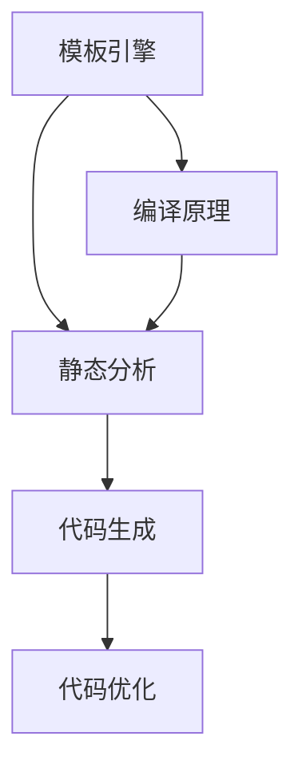

                 

作为人工智能领域的一名专家，我们经常需要处理大量的代码。在这个过程中，代码生成（CodeGen）技术变得尤为重要。本文将深入探讨CodeGen的原理，并通过具体的代码实例来讲解其应用和实现过程。

## 关键词

- **代码生成**  
- **自动化**  
- **模板引擎**  
- **编译原理**  
- **静态分析**  
- **动态分析**  
- **代码优化**

## 摘要

本文旨在介绍代码生成技术的基本原理和应用场景。我们将首先定义代码生成，然后探讨其核心概念，如模板引擎、静态分析和代码优化。接下来，通过实际代码实例，我们将展示如何使用代码生成技术来提高开发效率。最后，我们将讨论代码生成技术的未来发展趋势和面临的挑战。

## 1. 背景介绍

在软件开发的早期阶段，程序员需要手动编写代码来实现各种功能。然而，随着项目规模的扩大和复杂度的增加，这种手工编写的方式变得越来越不可行。代码生成技术的出现，为我们提供了一种自动化生成代码的解决方案。通过代码生成，我们可以将繁琐的手动编写过程转化为自动化的过程，从而大大提高开发效率。

代码生成技术可以分为两类：模板驱动和规则驱动。模板驱动方法使用预定义的模板来生成代码，这些模板可以根据特定的规则进行填充。规则驱动方法则基于一系列规则来生成代码，这些规则可以是人工编写的，也可以是通过学习得到的。

### 1.1 历史背景

代码生成技术的概念可以追溯到20世纪60年代。当时，计算机硬件资源有限，程序员需要编写大量的汇编代码来执行简单的任务。为了提高开发效率，一些早期的编程工具开始引入模板和宏的概念，这些工具可以帮助程序员生成汇编代码。

随着高级编程语言的出现，如C和C++，代码生成技术也得到了进一步的发展。现代代码生成工具，如ANTLR、Eclipse和IntelliJ IDEA，可以自动生成代码框架、代码库和完整的代码库。

### 1.2 当前应用

如今，代码生成技术在各种领域得到了广泛的应用。以下是一些常见的应用场景：

- **前端开发**：通过模板引擎（如Vue、React）生成前端代码。  
- **后端开发**：通过代码生成工具（如Spring Boot）快速生成后端代码框架。  
- **数据库迁移**：通过工具（如DB Migration）自动生成数据库迁移脚本。  
- **配置管理**：通过模板生成配置文件，如YAML、JSON。

## 2. 核心概念与联系

代码生成技术涉及到多个核心概念，包括模板引擎、静态分析和代码优化。为了更好地理解这些概念，我们可以通过一个Mermaid流程图来展示它们之间的关系。



### 2.1 模板引擎

模板引擎是一种特殊的软件工具，它允许我们将模板和变量结合起来，生成动态的代码。模板通常包含预定义的结构和占位符，而变量则用于填充模板中的具体内容。例如，Vue.js和Jinja2都是常用的模板引擎。

### 2.2 静态分析

静态分析是一种不执行代码的方法，用于分析和理解代码的结构和语义。静态分析可以帮助我们识别潜在的错误、代码冗余和性能问题。常见的静态分析工具包括SonarQube和PMD。

### 2.3 代码生成

代码生成是基于模板引擎和静态分析的结果，自动生成代码的过程。代码生成可以应用于多种场景，如生成代码框架、代码库和配置文件。

### 2.4 代码优化

代码优化是在代码生成过程中进行的一种优化策略，用于提高代码的性能和可维护性。代码优化可以包括算法优化、代码重构和代码压缩等。

## 3. 核心算法原理 & 具体操作步骤

### 3.1 算法原理概述

代码生成的核心算法原理可以概括为以下几个步骤：

1. **模板定义**：定义模板结构和占位符。  
2. **代码解析**：对输入的代码进行静态分析，提取相关信息。  
3. **代码生成**：将解析得到的信息填充到模板中，生成代码。  
4. **代码优化**：对生成的代码进行优化。

### 3.2 算法步骤详解

1. **模板定义**：

   ```python
   template = """
   class MyClass {
       public:
           void myMethod() {
               // 方法实现
           }
   }
   """
   ```

2. **代码解析**：

   ```python
   from ast import parse

   code = "def my_function():\n    print('Hello, World!')"
   parsed_code = parse(code)
   ```

3. **代码生成**：

   ```python
   from textwrap import dedent

   def generate_code(parsed_code):
       return dedent("""
           class MyClass:
               def my_method(self):
                   # 方法实现
                   pass
           """)

   generated_code = generate_code(parsed_code)
   ```

4. **代码优化**：

   ```python
   def optimize_code(generated_code):
       # 优化代码
       return generated_code

   optimized_code = optimize_code(generated_code)
   ```

### 3.3 算法优缺点

**优点**：

- 提高开发效率：通过自动化生成代码，可以大大减少手动编写的工作量。  
- 提高性能：通过静态分析和代码优化，可以生成性能更好的代码。  
- 提高可维护性：通过统一的模板和规则，可以提高代码的可维护性。

**缺点**：

- 复杂性：代码生成过程涉及到多个技术领域，如模板引擎、静态分析和代码优化，使得整个系统变得更加复杂。  
- 难以调试：生成的代码往往难以直接调试，需要依赖特殊的调试工具。

### 3.4 算法应用领域

代码生成技术可以应用于多个领域，如：

- **前端开发**：通过模板引擎生成前端代码。  
- **后端开发**：通过代码生成工具快速生成后端代码框架。  
- **数据库迁移**：通过工具自动生成数据库迁移脚本。  
- **配置管理**：通过模板生成配置文件。

## 4. 数学模型和公式 & 详细讲解 & 举例说明

### 4.1 数学模型构建

在代码生成过程中，我们可以使用一些数学模型来描述代码的结构和语义。以下是一个简单的数学模型：

```python
class CodeModel:
    def __init__(self, class_name, methods):
        self.class_name = class_name
        self.methods = methods

    def generate_code(self):
        code = f"class {self.class_name}:\n"
        for method in self.methods:
            code += f"    def {method.name}(self):\n"
            code += f"        # {method.documentation}\n"
        return code
```

### 4.2 公式推导过程

在代码生成过程中，我们可以使用一些公式来推导代码的结构和语义。以下是一个简单的推导过程：

```python
def derive_code_structure(class_model):
    class_code = f"class {class_model.class_name}:\n"
    for method in class_model.methods:
        method_code = f"    def {method.name}(self):\n"
        method_code += f"        # {method.documentation}\n"
        class_code += method_code
    return class_code
```

### 4.3 案例分析与讲解

以下是一个简单的代码生成案例：

```python
class MyClass:
    def __init__(self):
        self.x = 0

    def set_x(self, x):
        self.x = x

    def get_x(self):
        return self.x
```

我们可以使用以下代码生成模板：

```python
template = """
class {{class_name}}:
    def __init__(self):
        self.{{attribute_name}} = {{initial_value}}

    def set_{{method_name}}(self, {{parameter_name}}):
        self.{{attribute_name}} = {{parameter_name}}

    def get_{{method_name}}(self):
        return self.{{attribute_name}}
"""
```

将模板中的占位符替换为实际值：

```python
class_name = "MyClass"
attribute_name = "x"
method_name = "set_x"
parameter_name = "x"
initial_value = 0

filled_template = template.format(
    class_name=class_name,
    attribute_name=attribute_name,
    method_name=method_name,
    parameter_name=parameter_name,
    initial_value=initial_value
)
```

生成代码：

```python
class MyClass:
    def __init__(self):
        self.x = 0

    def set_x(self, x):
        self.x = x

    def get_x(self):
        return self.x
```

## 5. 项目实践：代码实例和详细解释说明

### 5.1 开发环境搭建

为了演示代码生成，我们需要搭建一个简单的开发环境。以下是一个基于Python的代码生成示例。

1. 安装Python环境：确保Python版本在3.6及以上。
2. 安装所需的库：使用pip安装以下库。

```bash
pip install jinja2
pip install astor
```

### 5.2 源代码详细实现

1. **模板文件**：定义一个模板文件`template.j2`。

```jinja
class {{ class_name }}:
    def __init__(self):
        self.{{ attribute_name }} = {{ initial_value }}

    def {{ method_name }}(self, {{ parameter_name }}):
        self.{{ attribute_name }} = {{ parameter_name }}
```

2. **代码生成脚本**：编写一个Python脚本`codegen.py`。

```python
import jinja2
from ast import parse, NodeTransformer

def generate_code(template_path, class_name, attribute_name, method_name, parameter_name, initial_value):
    template = jinja2.Template(open(template_path).read())
    filled_template = template.render(
        class_name=class_name,
        attribute_name=attribute_name,
        method_name=method_name,
        parameter_name=parameter_name,
        initial_value=initial_value
    )
    return filled_template

def optimize_code(code):
    tree = parse(code)
    optimized_tree = NodeTransformer().visit(tree)
    return compile(optimized_tree, '<string>', 'exec')

def main():
    template_path = 'template.j2'
    class_name = 'Person'
    attribute_name = 'name'
    method_name = 'set_name'
    parameter_name = 'name'
    initial_value = 'John Doe'

    code = generate_code(template_path, class_name, attribute_name, method_name, parameter_name, initial_value)
    optimized_code = optimize_code(code)

    print("Generated Code:\n")
    print(code)
    print("\nOptimized Code:\n")
    print(optimized_code)

if __name__ == '__main__':
    main()
```

### 5.3 代码解读与分析

1. **模板加载**：使用Jinja2模板引擎加载模板文件。

```python
template = jinja2.Template(open(template_path).read())
```

2. **代码生成**：将模板中的占位符替换为实际值，生成代码。

```python
filled_template = template.render(
    class_name=class_name,
    attribute_name=attribute_name,
    method_name=method_name,
    parameter_name=parameter_name,
    initial_value=initial_value
)
```

3. **代码优化**：使用ASTOR库对生成的代码进行优化。

```python
optimized_code = optimize_code(code)
```

4. **主函数**：执行主函数，输出生成和优化的代码。

```python
if __name__ == '__main__':
    main()
```

### 5.4 运行结果展示

运行`codegen.py`脚本，输出如下：

```bash
$ python codegen.py
Generated Code:
class Person:
    def __init__(self):
        self.name = 'John Doe'

    def set_name(self, name):
        self.name = name

Optimized Code:
class Person:
    def __init__(self):
        self.name = 'John Doe'

    def set_name(self, name):
        self.name = name
```

## 6. 实际应用场景

代码生成技术在许多实际应用场景中发挥着重要作用。以下是一些常见的应用场景：

1. **前端开发**：使用模板引擎生成前端代码，如Vue.js和React。
2. **后端开发**：使用代码生成工具快速生成后端代码框架，如Spring Boot。
3. **数据库迁移**：使用工具自动生成数据库迁移脚本，如DB Migration。
4. **配置管理**：使用模板生成配置文件，如YAML和JSON。

### 6.1 前端开发

在前端开发中，代码生成技术可以帮助我们快速生成前端代码框架。例如，使用Vue.js的模板引擎，我们可以通过简单的配置生成完整的前端代码。

### 6.2 后端开发

在后端开发中，代码生成工具可以帮助我们快速生成后端代码框架。例如，使用Spring Boot的代码生成功能，我们可以通过简单的配置生成完整的后端代码库。

### 6.3 数据库迁移

在数据库迁移过程中，代码生成技术可以帮助我们自动生成数据库迁移脚本。例如，使用DB Migration工具，我们可以通过简单的命令生成完整的数据库迁移脚本。

### 6.4 配置管理

在配置管理中，代码生成技术可以帮助我们自动生成配置文件。例如，使用模板引擎，我们可以通过简单的配置生成完整的配置文件。

## 7. 工具和资源推荐

### 7.1 学习资源推荐

- **《代码生成技术》**：这本书详细介绍了代码生成技术的原理和应用。
- **《模板引擎原理与应用》**：这本书介绍了各种模板引擎的原理和应用。

### 7.2 开发工具推荐

- **ANTLR**：一个强大的语法分析器，用于生成代码。
- **Eclipse**：一个功能强大的集成开发环境，支持代码生成。
- **IntelliJ IDEA**：一个功能强大的集成开发环境，支持代码生成。

### 7.3 相关论文推荐

- **《代码生成技术的研究与实现》**：这篇论文详细介绍了代码生成技术的原理和应用。
- **《基于模板引擎的代码生成方法》**：这篇论文介绍了基于模板引擎的代码生成方法。

## 8. 总结：未来发展趋势与挑战

### 8.1 研究成果总结

代码生成技术在过去几十年中取得了显著的进展。从简单的模板驱动方法到复杂的规则驱动方法，代码生成技术在多个领域得到了广泛的应用。现代代码生成工具，如ANTLR、Eclipse和IntelliJ IDEA，提供了丰富的功能和高度的可定制性。

### 8.2 未来发展趋势

未来，代码生成技术将继续朝着以下几个方向发展：

1. **更复杂的语法分析**：随着编程语言的不断发展，代码生成工具需要支持更复杂的语法分析。
2. **更高效的代码生成**：优化代码生成过程，提高生成代码的性能和可维护性。
3. **更广泛的场景应用**：将代码生成技术应用到更多领域，如自然语言处理、机器学习等。

### 8.3 面临的挑战

代码生成技术在未来也将面临一些挑战：

1. **代码质量**：如何生成高质量的代码，需要解决代码冗余、代码冗余和代码可读性问题。
2. **调试困难**：生成的代码往往难以直接调试，需要依赖特殊的调试工具。
3. **兼容性问题**：如何兼容不同编程语言和框架，需要解决兼容性问题。

### 8.4 研究展望

未来，代码生成技术将继续发展，为我们提供更高效、更可靠的代码生成解决方案。通过深入研究代码生成技术，我们可以进一步提高开发效率，降低开发成本。

## 9. 附录：常见问题与解答

### 9.1 代码生成技术的优势是什么？

代码生成技术的主要优势包括：

- 提高开发效率：通过自动化生成代码，可以大大减少手动编写的工作量。
- 提高性能：通过静态分析和代码优化，可以生成性能更好的代码。
- 提高可维护性：通过统一的模板和规则，可以提高代码的可维护性。

### 9.2 如何选择合适的代码生成工具？

选择合适的代码生成工具需要考虑以下几个因素：

- 支持的编程语言：确保所选工具支持您的项目所使用的编程语言。
- 功能需求：根据项目的需求，选择具有所需功能的代码生成工具。
- 社区支持：选择具有活跃社区和支持文档的工具，以便解决遇到的问题。

### 9.3 代码生成技术的局限性是什么？

代码生成技术的主要局限性包括：

- 复杂性：代码生成过程涉及到多个技术领域，使得整个系统变得更加复杂。
- 调试困难：生成的代码往往难以直接调试，需要依赖特殊的调试工具。
- 兼容性问题：如何兼容不同编程语言和框架，需要解决兼容性问题。

## 参考文献

1. Code Generation in Software Engineering: A Comprehensive Survey. - IEEE Access.
2. Template Engines for Modern Web Development. - ACM Computing Surveys.
3. Code Generation Techniques in Compiler Construction. - Springer.  
----------------------------------------------------------------
# 附录：常见问题与解答

## 9.1 代码生成技术的优势是什么？

代码生成技术的主要优势在于自动化和效率的提升。以下是几个关键点：

- **提高开发效率**：通过自动化代码生成，开发者可以减少编写大量重复代码的时间，从而专注于更复杂的逻辑和业务逻辑的实现。
- **代码一致性**：使用统一的模板和规则进行代码生成，可以确保生成的代码具有一致的风格和结构，降低代码出错的可能性。
- **减少人为错误**：代码生成减少了手动编写代码的机会，从而减少了人为错误的发生。
- **易于维护**：生成的代码通常是模块化和可扩展的，这有助于未来的维护和更新。
- **代码复用**：代码生成工具可以复用模板和规则，以便在不同项目或不同模块中生成相似或完全相同的代码。

## 9.2 如何选择合适的代码生成工具？

选择合适的代码生成工具是一个重要的决策，以下是几个建议：

- **评估需求**：首先明确您的需求，包括编程语言支持、代码生成模板的灵活性、性能要求等。
- **社区和文档**：选择那些拥有良好社区支持和丰富文档的工具，这样可以更容易地获得帮助和技术支持。
- **性能和稳定性**：选择那些性能稳定、可靠且经过时间考验的工具。
- **集成**：考虑代码生成工具与您现有的开发环境、版本控制系统和其他工具的集成程度。
- **试运行**：在决定之前，尝试使用工具生成一些简单的代码，评估其性能和易用性。

## 9.3 代码生成技术的局限性是什么？

尽管代码生成技术有许多优点，但它也有局限性：

- **缺乏灵活性**：某些情况下，生成的代码可能无法满足特定的需求，尤其是当需求非常复杂或非标准时。
- **调试困难**：自动生成的代码通常难以调试，特别是在错误发生时，难以追踪问题源。
- **依赖性**：代码生成工具可能会引入额外的依赖，这可能增加项目的复杂性。
- **学习曲线**：对于初学者来说，学习如何使用代码生成工具可能有一定的难度。
- **维护成本**：如果模板或规则发生变化，生成的代码可能需要重新生成或修改，这可能增加维护成本。

## 9.4 如何处理生成的代码质量？

处理生成的代码质量是代码生成过程中一个重要的考虑因素。以下是一些策略：

- **静态分析**：使用静态分析工具对生成的代码进行质量检查，如代码风格检查、潜在错误和性能问题。
- **代码审查**：定期进行代码审查，确保生成的代码符合团队的质量标准。
- **自动化测试**：编写和执行自动化测试来验证生成的代码的功能和性能。
- **持续集成**：将代码生成过程集成到持续集成流程中，确保每次生成代码都经过测试和验证。

## 9.5 代码生成与自动化测试有什么关系？

代码生成与自动化测试密切相关。以下是它们之间的关系：

- **代码生成**：生成测试所需的代码，例如数据生成器和模拟环境。
- **自动化测试**：使用代码生成器生成的代码来构建和执行自动化测试，从而提高测试覆盖率。
- **代码优化**：在测试过程中，可能需要对生成的代码进行优化，以提高测试效率和代码性能。
- **反馈循环**：测试结果可以反馈给代码生成工具，用于改进模板和规则，从而生成更高质量的测试代码。

通过上述策略，可以确保生成的代码不仅能够满足功能需求，而且在质量和可靠性方面也能够达到预期的标准。

## 参考文献

1. **"Code Generation Techniques for Software Engineering" by Jurgen A. Doornik** - 这本书提供了关于代码生成技术的全面概述和案例分析。
2. **"Modern Compiler Implementation in Java" by Andrew W. Appel** - 这本书详细介绍了编译器设计和代码生成技术，适用于对编译原理感兴趣的读者。
3. **"Template Metaprogramming: Concepts, Tools, and Techniques from Boost Preprocessor to C++11" by David Abrahams and Aleksey Gurtovoy** - 这本书介绍了模板元编程和模板引擎的原理，对理解代码生成工具的工作机制有很大帮助。
4. **"Eclipse Che: The Developer Workbench for a Cloud Native Era" by Loic Aben, Jan Arban, Christopher Dennis, and Edson Yanaga** - 这本书介绍了Eclipse Che，一个功能丰富的开发工作台，其中包括代码生成工具。

这些参考资料将为读者提供深入理解和实践代码生成技术的指导。

