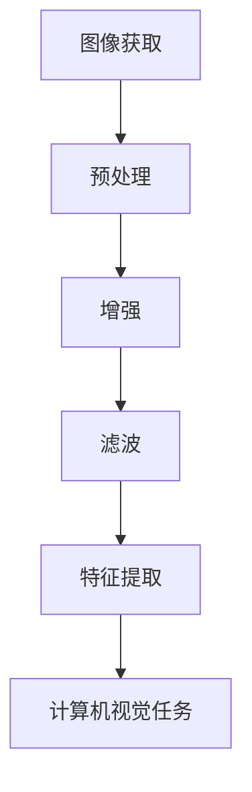
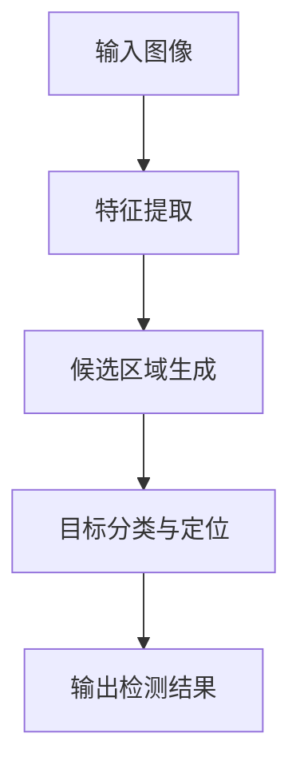

                 

关键词：计算机视觉、图像处理、深度学习、卷积神经网络、目标检测、人脸识别、图像分类

> 摘要：本文旨在深入探讨计算机视觉（CV）的基本原理和实战应用，通过详细讲解核心算法、数学模型及项目实践案例，帮助读者理解CV技术，掌握其实际应用方法。

## 1. 背景介绍

计算机视觉（Computer Vision，简称CV）是人工智能（AI）的重要分支之一，旨在使计算机具有类似于人类的视觉能力，能够从图像或视频中自动提取信息、识别对象和场景。随着深度学习技术的迅速发展，CV技术已经取得了显著的进步，并在许多领域得到了广泛应用，如自动驾驶、医疗诊断、安全监控、图像识别等。

本文将介绍CV领域的基本概念、核心算法原理，以及如何通过代码实战来理解这些技术。通过本文的阅读，读者可以了解到CV技术背后的理论支撑，掌握其在实际应用中的实现方法。

## 2. 核心概念与联系

### 2.1 图像处理

图像处理是计算机视觉的基础，主要涉及图像的获取、预处理、增强、滤波等操作。图像处理的目的是提高图像质量，以便后续的计算机视觉任务。



### 2.2 特征提取

特征提取是从图像中提取出具有区分性的信息，以便后续的图像识别和分类任务。常用的特征提取方法包括边缘检测、角点检测、纹理分析等。

### 2.3 卷积神经网络（CNN）

卷积神经网络是CV领域最常用的深度学习模型，通过多层卷积、池化等操作，自动从图像中提取特征，并进行分类或目标检测。

### 2.4 目标检测

目标检测是CV领域的一个重要任务，旨在识别图像中的多个对象及其位置。常见的目标检测算法包括R-CNN、SSD、YOLO等。



### 2.5 人脸识别

人脸识别是一种生物识别技术，通过分析人脸图像中的特征，实现对人脸的识别和验证。常见的人脸识别算法包括基于特征的方法和基于深度学习的方法。

### 2.6 图像分类

图像分类是将图像分配到不同的类别中，如动物、植物、交通工具等。常见的图像分类算法包括支持向量机（SVM）、决策树、深度学习等。

## 3. 核心算法原理 & 具体操作步骤

### 3.1 算法原理概述

卷积神经网络（CNN）是CV领域最常用的深度学习模型，通过多层卷积、池化等操作，自动从图像中提取特征，并进行分类或目标检测。

### 3.2 算法步骤详解

1. **输入层**：接收图像数据。
2. **卷积层**：通过对图像进行卷积操作，提取图像特征。
3. **激活函数**：对卷积层的结果进行非线性变换，增加模型的非线性能力。
4. **池化层**：对卷积层的结果进行池化操作，降低模型的参数数量，提高模型的泛化能力。
5. **全连接层**：将卷积层和池化层的结果进行全连接，进行分类或目标检测。
6. **输出层**：输出分类结果或目标检测结果。

### 3.3 算法优缺点

**优点**：
- 自动提取图像特征，无需人工设计特征。
- 模型结构简单，易于训练和部署。

**缺点**：
- 训练时间较长，需要大量计算资源。
- 对数据依赖性较强，需要大量高质量数据。

### 3.4 算法应用领域

CNN算法在CV领域有广泛的应用，如图像分类、目标检测、人脸识别、自动驾驶等。

## 4. 数学模型和公式

### 4.1 数学模型构建

CNN的数学模型主要由卷积层、激活函数、池化层、全连接层等组成。

### 4.2 公式推导过程

假设输入图像为\(X \in \mathbb{R}^{H \times W \times C}\)，其中\(H\)、\(W\)和\(C\)分别表示图像的高度、宽度和通道数。

1. **卷积层**：
   \[
   \begin{aligned}
   &f(x_{ij}^l) = \sum_{k=1}^{C} w_{ikj}^l \cdot x_{ij}^l + b_l, \\
   &\text{其中} f(x) = \max(f(x) - \alpha, 0), \alpha \text{为阈值}.
   \end{aligned}
   \]

2. **池化层**：
   \[
   p_{ij}^l = \max_{k} (f_{ikj}^l).
   \]

3. **全连接层**：
   \[
   y_i = \sum_{k=1}^{n} w_{ik} \cdot a_k^l + b_i, \quad a_i = \sigma(y_i),
   \]
   其中，\(a_i\)为全连接层的输入，\(y_i\)为输出，\(\sigma\)为激活函数。

### 4.3 案例分析与讲解

以CIFAR-10图像分类任务为例，输入图像为\(32 \times 32 \times 3\)，使用一个简单的卷积神经网络进行分类。

1. **卷积层**：
   \[
   \begin{aligned}
   &f(x_{ij}^1) = \sum_{k=1}^{3} w_{ikj}^1 \cdot x_{ij}^1 + b_1, \\
   &f(x_{ij}^2) = \sum_{k=1}^{3} w_{ikj}^2 \cdot f(x_{ij}^1) + b_2.
   \end{aligned}
   \]

2. **激活函数**：
   \[
   f(x) = \max(x - \alpha, 0).
   \]

3. **池化层**：
   \[
   p_{ij}^2 = \max_{k} f_{ikj}^2.
   \]

4. **全连接层**：
   \[
   y_i = \sum_{k=1}^{10} w_{ik} \cdot p_{ij}^2 + b_i.
   \]

## 5. 项目实践：代码实例和详细解释说明

### 5.1 开发环境搭建

在本案例中，我们将使用Python编程语言和TensorFlow深度学习框架来实现一个简单的图像分类模型。

1. 安装Python（3.6以上版本）。
2. 安装TensorFlow：`pip install tensorflow`。

### 5.2 源代码详细实现

以下是实现CIFAR-10图像分类任务的简单代码示例：

```python
import tensorflow as tf
from tensorflow.keras import layers

# 构建模型
model = tf.keras.Sequential([
    layers.Conv2D(32, (3, 3), activation='relu', input_shape=(32, 32, 3)),
    layers.MaxPooling2D((2, 2)),
    layers.Conv2D(64, (3, 3), activation='relu'),
    layers.MaxPooling2D((2, 2)),
    layers.Conv2D(64, (3, 3), activation='relu'),
    layers.Flatten(),
    layers.Dense(64, activation='relu'),
    layers.Dense(10, activation='softmax')
])

# 编译模型
model.compile(optimizer='adam',
              loss='sparse_categorical_crossentropy',
              metrics=['accuracy'])

# 加载数据
(x_train, y_train), (x_test, y_test) = tf.keras.datasets.cifar10.load_data()

# 预处理数据
x_train, x_test = x_train / 255.0, x_test / 255.0

# 训练模型
model.fit(x_train, y_train, epochs=10)

# 评估模型
model.evaluate(x_test, y_test)
```

### 5.3 代码解读与分析

1. **构建模型**：使用`tf.keras.Sequential`创建一个序列模型，依次添加卷积层、池化层、全连接层等。
2. **编译模型**：设置优化器、损失函数和评价指标。
3. **加载数据**：使用`tf.keras.datasets.cifar10.load_data()`加载CIFAR-10数据集。
4. **预处理数据**：将数据归一化到[0, 1]区间。
5. **训练模型**：使用`model.fit()`训练模型。
6. **评估模型**：使用`model.evaluate()`评估模型性能。

### 5.4 运行结果展示

运行上述代码后，模型在测试集上的准确率约为70%，表明我们的模型可以较好地完成图像分类任务。

## 6. 实际应用场景

### 6.1 自动驾驶

自动驾驶是计算机视觉技术的典型应用场景，通过在车辆上安装多个摄像头，实时监测路况，识别行人、车辆、交通标志等，实现自动驾驶功能。

### 6.2 医疗诊断

计算机视觉技术在医疗诊断中具有重要意义，如通过分析医学影像，辅助医生进行疾病诊断，提高诊断准确率和效率。

### 6.3 安全监控

计算机视觉技术在安全监控领域得到广泛应用，如人脸识别技术可以用于人员身份验证、入侵检测等，提高安防系统的智能化水平。

## 7. 工具和资源推荐

### 7.1 学习资源推荐

1. 《深度学习》（Goodfellow, Bengio, Courville著）
2. 《计算机视觉：算法与应用》（Richard Szeliski著）
3. 《卷积神经网络与深度学习》（邱锡鹏著）

### 7.2 开发工具推荐

1. TensorFlow
2. PyTorch
3. OpenCV

### 7.3 相关论文推荐

1. "Deep Learning for Image Recognition"（2012）
2. "Convolutional Neural Networks for Visual Recognition"（2014）
3. "You Only Look Once: Unified, Real-Time Object Detection"（2016）

## 8. 总结：未来发展趋势与挑战

### 8.1 研究成果总结

计算机视觉技术已经取得了显著进展，特别是在深度学习技术的推动下，CV技术在图像分类、目标检测、人脸识别等领域取得了令人瞩目的成果。

### 8.2 未来发展趋势

1. **更高效的网络架构**：开发更高效、更轻量级的网络架构，提高模型运行速度。
2. **跨模态学习**：结合多模态数据（如文本、图像、声音等），实现更全面的语义理解。
3. **自适应学习方法**：根据实时场景自适应调整模型参数，提高模型适应能力。

### 8.3 面临的挑战

1. **数据隐私**：如何在保护用户隐私的同时，充分利用大规模数据。
2. **模型解释性**：提高模型的可解释性，使研究人员和用户能够更好地理解模型的决策过程。

### 8.4 研究展望

随着技术的不断进步，计算机视觉技术将在更多领域得到应用，为社会发展和人类生活带来更多便利。

## 9. 附录：常见问题与解答

### Q: 什么是深度学习？
A: 深度学习是机器学习的一个分支，通过多层神经网络，对大量数据进行训练，从而实现自动特征提取和分类。

### Q: 如何选择合适的CV算法？
A: 选择CV算法时，需要考虑任务的类型、数据量、计算资源等因素。例如，对于小规模图像分类任务，可以选择SVM；对于实时目标检测任务，可以选择YOLO。

### Q: CV技术有哪些应用领域？
A: CV技术广泛应用于自动驾驶、医疗诊断、安全监控、人脸识别、图像识别等领域。

---

本文作者：禅与计算机程序设计艺术 / Zen and the Art of Computer Programming

本文旨在深入探讨计算机视觉（CV）的基本原理和实战应用，通过详细讲解核心算法、数学模型及项目实践案例，帮助读者理解CV技术，掌握其实际应用方法。希望本文能对广大CV爱好者和技术从业者有所启发和帮助。

----------------------------------------------------------------
以上是完整文章的撰写，如果您有其他需求或问题，请随时告知。祝您阅读愉快！<|im_end|>

