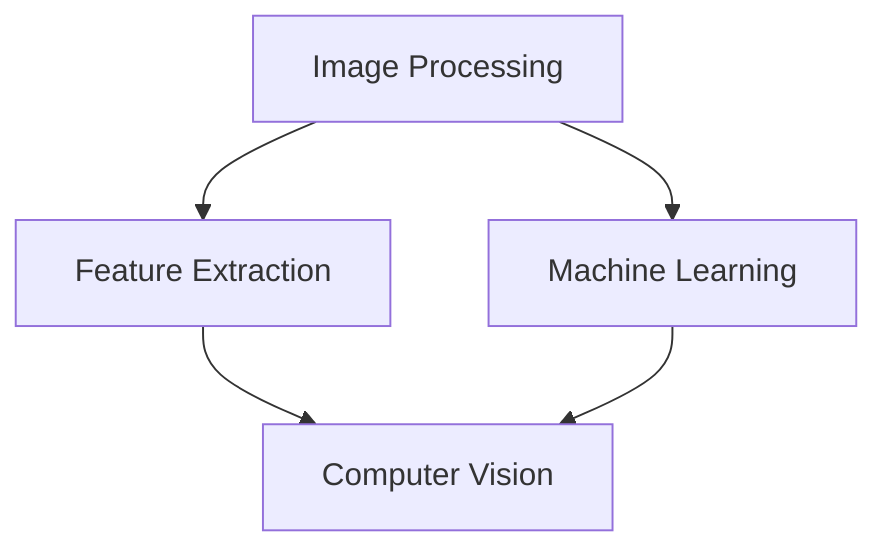

                 

关键词：计算机视觉，图像处理，算法原理，代码实战，深度学习，卷积神经网络，目标检测，图像分类

摘要：本文将深入探讨计算机视觉技术的基本原理和实际应用，通过详细的算法原理讲解、代码实例和实战案例分析，帮助读者全面理解计算机视觉技术的工作机制和应用场景。本文还将对未来的发展趋势和面临的挑战进行展望，为读者提供有价值的指导和建议。

## 1. 背景介绍

计算机视觉（Computer Vision）是人工智能领域的一个重要分支，它致力于使计算机具备人类视觉系统的某些功能，如理解、识别和解释图像或视频中的内容。计算机视觉技术已在诸多领域得到广泛应用，包括医疗影像分析、自动驾驶、智能监控、图像识别和增强现实等。

随着深度学习技术的兴起，计算机视觉领域取得了显著的进展。卷积神经网络（Convolutional Neural Networks，CNN）作为深度学习的一种重要模型，在图像分类、目标检测、人脸识别等任务中表现出了强大的能力。本文将围绕这些核心技术和应用场景，深入讲解计算机视觉的基本原理和实践方法。

## 2. 核心概念与联系

为了更好地理解计算机视觉技术，我们需要先了解以下几个核心概念：

- **图像处理（Image Processing）**：图像处理是对图像进行一系列操作的过程，如滤波、边缘检测、图像增强等。它是计算机视觉的基础。
- **特征提取（Feature Extraction）**：特征提取是从图像中提取出具有区分性的特征，以便后续的分类或识别任务。
- **机器学习（Machine Learning）**：机器学习是一种通过数据驱动的方法来使计算机从经验中学习的工具，它在计算机视觉中起着核心作用。

下面是一个使用Mermaid绘制的流程图，展示了这些核心概念之间的联系：



### 2.1 图像处理

图像处理是计算机视觉的基础。它包括以下主要任务：

- **滤波（Filtering）**：用于消除图像噪声，增强图像的某些特征。
- **边缘检测（Edge Detection）**：用于检测图像中的边缘，提取图像的轮廓。
- **图像增强（Image Enhancement）**：用于改善图像的视觉效果，使其更易于分析。

### 2.2 特征提取

特征提取是从图像中提取出具有区分性的特征的过程。这些特征可以是颜色、纹理、形状等。特征提取对于后续的分类或识别任务至关重要。

### 2.3 机器学习

机器学习是一种通过数据驱动的方法来使计算机从经验中学习的工具。它包括监督学习、无监督学习和强化学习等类型。在计算机视觉中，机器学习主要用于分类、识别和预测等任务。

## 3. 核心算法原理 & 具体操作步骤

### 3.1 算法原理概述

计算机视觉的核心算法主要包括卷积神经网络（CNN）、支持向量机（SVM）、决策树等。下面我们将重点介绍CNN的基本原理和具体操作步骤。

### 3.2 算法步骤详解

#### 3.2.1 卷积操作

卷积神经网络的核心操作是卷积。卷积是一种将一个小的可训练滤波器（卷积核）与图像进行点积的过程。这个过程可以理解为将滤波器在图像上滑动，并对每个位置的像素进行加权求和。

#### 3.2.2 池化操作

池化操作通常在卷积操作之后进行，用于减小特征图的尺寸，降低模型的参数数量。常见的池化操作有最大池化和平均池化。

#### 3.2.3 全连接层

全连接层将卷积层和池化层输出的特征图展平为一维向量，然后通过一个全连接层进行分类或回归。

### 3.3 算法优缺点

#### 优点：

- **强大的特征学习能力**：CNN能够自动学习图像的层次特征，适用于各种复杂的图像任务。
- **参数共享**：卷积操作中的权重是共享的，这有助于减少模型参数数量，提高训练效率。

#### 缺点：

- **计算量较大**：由于卷积操作需要大量的计算资源，CNN的训练过程可能非常耗时。
- **数据需求较高**：CNN需要大量的数据来训练，否则容易过拟合。

### 3.4 算法应用领域

CNN在计算机视觉领域有着广泛的应用，如：

- **图像分类**：如ImageNet比赛。
- **目标检测**：如Faster R-CNN。
- **人脸识别**：如DeepFace。
- **图像分割**：如FCN。

## 4. 数学模型和公式 & 详细讲解 & 举例说明

### 4.1 数学模型构建

卷积神经网络中的数学模型主要包括以下几个部分：

- **卷积层**：卷积层的输出可以通过以下公式表示：

  $$h_{ij} = \sum_{k=1}^{n} w_{ik} \cdot a_{kj} + b_j$$

  其中，$h_{ij}$是卷积层的输出，$w_{ik}$是卷积核的权重，$a_{kj}$是输入特征图的像素值，$b_j$是偏置项。

- **激活函数**：常用的激活函数有ReLU、Sigmoid和Tanh等。

  $$\text{ReLU}(x) = \max(0, x)$$

  $$\text{Sigmoid}(x) = \frac{1}{1 + e^{-x}}$$

  $$\text{Tanh}(x) = \frac{e^x - e^{-x}}{e^x + e^{-x}}$$

- **全连接层**：全连接层的输出可以通过以下公式表示：

  $$y_j = \sum_{k=1}^{n} w_{jk} \cdot h_{k} + b$$

  其中，$y_j$是全连接层的输出，$w_{jk}$是全连接层的权重，$h_{k}$是卷积层输出的像素值，$b$是偏置项。

### 4.2 公式推导过程

这里以ReLU激活函数为例，解释卷积神经网络中的前向传播过程。假设输入特征图的大小为$w \times h$，卷积核的大小为$k \times k$，输出特征图的大小为$p \times q$，则有：

$$p = \frac{w - k + 2p}{s}$$

$$q = \frac{h - k + 2q}{s}$$

其中，$s$是步长（stride）。

对于每个位置$(i, j)$的输出：

$$h_{ij} = \sum_{k=1}^{n} w_{ik} \cdot a_{kj} + b_j$$

$$a_{kj} = \max(0, \sum_{l=1}^{m} w_{il} \cdot x_{lj} + b_l)$$

其中，$w_{ik}$是卷积核的权重，$a_{kj}$是输入特征图的像素值，$b_j$是偏置项，$w_{il}$是全连接层的权重，$x_{lj}$是卷积层的输出。

### 4.3 案例分析与讲解

假设我们有一个输入特征图大小为$32 \times 32$，卷积核大小为$3 \times 3$，步长为1，偏置项为0。经过卷积操作后，输出特征图的大小为$30 \times 30$。我们选择ReLU作为激活函数。

#### 4.3.1 卷积操作

对于输出特征图的每个位置$(i, j)$，计算卷积核在输入特征图上滑动时每个位置的点积：

$$h_{ij} = \sum_{k=1}^{3} w_{ik} \cdot a_{kj} + b_j$$

例如，对于位置$(10, 10)$，卷积核在滑动时与输入特征图的9个位置进行点积：

$$h_{10,10} = \sum_{k=1}^{3} w_{1k} \cdot a_{k,10} + b_1$$

$$h_{10,10} = w_{11,10} \cdot a_{1,10} + w_{12,10} \cdot a_{2,10} + w_{13,10} \cdot a_{3,10} + b_1$$

假设卷积核的权重和输入特征图的像素值如下：

| $a_{1,10}$ | $a_{2,10}$ | $a_{3,10}$ |
| --- | --- | --- |
| 1 | 2 | 3 |
| 4 | 5 | 6 |
| 7 | 8 | 9 |

卷积核的权重：

| $w_{1,10}$ | $w_{2,10}$ | $w_{3,10}$ |
| --- | --- | --- |
| 1 | 0 | -1 |
| 0 | 1 | 0 |
| -1 | 0 | 1 |

计算结果：

$$h_{10,10} = (1 \cdot 1 + 0 \cdot 2 - 1 \cdot 3) + (0 \cdot 4 + 1 \cdot 5 + 0 \cdot 6) + (-1 \cdot 7 + 0 \cdot 8 + 1 \cdot 9) + 0$$

$$h_{10,10} = 1 + 5 - 3 - 7 + 9 = 5$$

#### 4.3.2 激活函数

对于ReLU激活函数，我们只需将计算得到的卷积结果与0进行比较，取其中的最大值：

$$h_{10,10}^{\text{ReLU}} = \max(0, h_{10,10}) = \max(0, 5) = 5$$

#### 4.3.3 展平与全连接层

将输出特征图展平为一维向量：

$$h_{\text{flattened}} = [h_{10,10}, h_{10,11}, \ldots, h_{29,29}]$$

经过全连接层，输出为：

$$y_j = \sum_{k=1}^{30} w_{jk} \cdot h_{k} + b$$

假设全连接层的权重和偏置项如下：

| $w_{j1}$ | $w_{j2}$ | $\ldots$ | $w_{j30}$ |
| --- | --- | --- | --- |
| 1 | 2 | $\ldots$ | 1 |
| 0 | 1 | $\ldots$ | 0 |
| $\ldots$ | $\ldots$ | $\ldots$ | $\ldots$ |
| 1 | 0 | $\ldots$ | 1 |

计算结果：

$$y_1 = \sum_{k=1}^{30} w_{j1} \cdot h_{k} + b_1 = 1 \cdot 5 + 0 \cdot 6 + \ldots + 1 \cdot 5 + b_1 = 5 + b_1$$

$$y_2 = \sum_{k=1}^{30} w_{j2} \cdot h_{k} + b_2 = 2 \cdot 5 + 0 \cdot 6 + \ldots + 0 \cdot 5 + b_2 = 10 + b_2$$

以此类推。

## 5. 项目实践：代码实例和详细解释说明

### 5.1 开发环境搭建

在开始编写代码之前，我们需要搭建一个合适的开发环境。这里我们使用Python作为主要编程语言，并使用TensorFlow作为深度学习框架。以下是搭建开发环境的步骤：

1. 安装Python：在官方网站[https://www.python.org/](https://www.python.org/)下载并安装Python 3.x版本。
2. 安装TensorFlow：打开终端或命令提示符，运行以下命令安装TensorFlow：

   ```bash
   pip install tensorflow
   ```

3. 安装其他依赖库：根据项目需求，我们可能需要安装其他依赖库，如NumPy、Pandas等。可以使用pip命令逐个安装。

### 5.2 源代码详细实现

下面是一个简单的卷积神经网络实现，用于对图像进行分类。代码主要分为以下几个部分：

1. **数据预处理**：读取图像数据，并将其缩放到相同的大小。
2. **模型定义**：定义卷积神经网络结构，包括卷积层、池化层和全连接层。
3. **训练**：使用训练数据训练模型，并保存训练结果。
4. **测试**：使用测试数据评估模型性能。

```python
import tensorflow as tf
from tensorflow.keras import layers, models
import numpy as np
import matplotlib.pyplot as plt

# 1. 数据预处理
# 读取图像数据，这里以 CIFAR-10 数据集为例
(x_train, y_train), (x_test, y_test) = tf.keras.datasets.cifar10.load_data()

# 缩放图像数据
x_train = x_train.astype("float32") / 255
x_test = x_test.astype("float32") / 255

# 2. 模型定义
model = models.Sequential()
model.add(layers.Conv2D(32, (3, 3), activation='relu', input_shape=(32, 32, 3)))
model.add(layers.MaxPooling2D((2, 2)))
model.add(layers.Conv2D(64, (3, 3), activation='relu'))
model.add(layers.MaxPooling2D((2, 2)))
model.add(layers.Conv2D(64, (3, 3), activation='relu'))
model.add(layers.Flatten())
model.add(layers.Dense(64, activation='relu'))
model.add(layers.Dense(10, activation='softmax'))

# 3. 训练
model.compile(optimizer='adam', loss='sparse_categorical_crossentropy', metrics=['accuracy'])
model.fit(x_train, y_train, epochs=10, validation_split=0.1)

# 4. 测试
test_loss, test_acc = model.evaluate(x_test, y_test, verbose=2)
print(f"Test accuracy: {test_acc:.4f}")

# 5. 可视化
# 显示模型的层次结构
model.summary()

# 显示训练过程中的准确率和损失函数
history = model.fit(x_train, y_train, epochs=10, validation_split=0.1)
plt.plot(history.history['accuracy'], label='accuracy')
plt.plot(history.history['val_accuracy'], label='val_accuracy')
plt.xlabel('Epoch')
plt.ylabel('Accuracy')
plt.ylim([0, 1])
plt.legend(loc='lower right')
plt.show()
```

### 5.3 代码解读与分析

#### 5.3.1 数据预处理

```python
(x_train, y_train), (x_test, y_test) = tf.keras.datasets.cifar10.load_data()

x_train = x_train.astype("float32") / 255
x_test = x_test.astype("float32") / 255
```

这段代码首先加载CIFAR-10数据集，然后将其缩放到[0, 1]的范围内，便于后续处理。

#### 5.3.2 模型定义

```python
model = models.Sequential()
model.add(layers.Conv2D(32, (3, 3), activation='relu', input_shape=(32, 32, 3)))
model.add(layers.MaxPooling2D((2, 2)))
model.add(layers.Conv2D(64, (3, 3), activation='relu'))
model.add(layers.MaxPooling2D((2, 2)))
model.add(layers.Conv2D(64, (3, 3), activation='relu'))
model.add(layers.Flatten())
model.add(layers.Dense(64, activation='relu'))
model.add(layers.Dense(10, activation='softmax'))
```

这段代码定义了一个简单的卷积神经网络，包括两个卷积层、两个池化层和一个全连接层。输入图像的大小为$32 \times 32 \times 3$，输出为10个类别。

#### 5.3.3 训练

```python
model.compile(optimizer='adam', loss='sparse_categorical_crossentropy', metrics=['accuracy'])
model.fit(x_train, y_train, epochs=10, validation_split=0.1)
```

这段代码使用CIFAR-10数据集训练模型，训练过程持续10个周期。在每次训练周期中，模型将在训练数据集上迭代训练，并在验证数据集上进行性能评估。

#### 5.3.4 测试

```python
test_loss, test_acc = model.evaluate(x_test, y_test, verbose=2)
print(f"Test accuracy: {test_acc:.4f}")
```

这段代码使用测试数据集评估模型的性能，输出测试准确率。

#### 5.3.5 可视化

```python
model.summary()
history = model.fit(x_train, y_train, epochs=10, validation_split=0.1)
plt.plot(history.history['accuracy'], label='accuracy')
plt.plot(history.history['val_accuracy'], label='val_accuracy')
plt.xlabel('Epoch')
plt.ylabel('Accuracy')
plt.ylim([0, 1])
plt.legend(loc='lower right')
plt.show()
```

这段代码展示了模型的层次结构以及训练过程中的准确率和损失函数。通过可视化，我们可以直观地了解模型的训练过程和性能。

## 6. 实际应用场景

计算机视觉技术在各个领域都有广泛的应用，以下是一些实际应用场景：

### 6.1 医疗影像分析

计算机视觉技术在医疗影像分析中发挥着重要作用，如肿瘤检测、疾病诊断等。通过深度学习模型，计算机可以自动识别和分类医学图像中的病变区域，帮助医生提高诊断的准确性和效率。

### 6.2 自动驾驶

自动驾驶是计算机视觉技术的一个重要应用领域。通过使用计算机视觉算法，自动驾驶车辆可以实时识别道路上的各种对象，如行人、车辆、交通标志等，从而实现安全驾驶。

### 6.3 智能监控

计算机视觉技术可用于智能监控，如人脸识别、行为分析等。通过实时分析视频流，计算机可以自动识别和跟踪特定目标，提高监控的效率和准确性。

### 6.4 图像识别

图像识别是计算机视觉技术的一个基础应用，如物体识别、图像分类等。通过训练深度学习模型，计算机可以自动识别图像中的各种对象，从而实现自动化处理。

## 7. 工具和资源推荐

### 7.1 学习资源推荐

1. **《Deep Learning》**：这是一本经典的深度学习教材，涵盖了深度学习的理论基础和应用实例。
2. **《Computer Vision: Algorithms and Applications》**：这本书详细介绍了计算机视觉的基本算法和应用。
3. **《TensorFlow 官方文档》**：TensorFlow 是一个强大的深度学习框架，其官方文档提供了丰富的教程和示例。

### 7.2 开发工具推荐

1. **TensorFlow**：一个广泛使用的深度学习框架，适用于各种计算机视觉任务。
2. **PyTorch**：一个灵活的深度学习框架，适用于研究和工业应用。
3. **OpenCV**：一个开源的计算机视觉库，提供了丰富的图像处理和机器学习功能。

### 7.3 相关论文推荐

1. **"A Comprehensive Survey on Deep Learning for Image Classification"**：这篇综述详细介绍了深度学习在图像分类中的应用。
2. **"Faster R-CNN: Towards Real-Time Object Detection with Region Proposal Networks"**：这篇论文提出了一种高效的目标检测算法Faster R-CNN。
3. **"Unsupervised Representation Learning with Deep Convolutional Nets"**：这篇论文探讨了无监督的深度学习表示学习。

## 8. 总结：未来发展趋势与挑战

计算机视觉技术在过去几十年中取得了显著的进展，但在未来仍面临许多挑战和机遇。以下是未来发展趋势与挑战：

### 8.1 研究成果总结

1. **深度学习技术的进步**：随着深度学习技术的不断发展，计算机视觉模型的表现和效率不断提升。
2. **多模态数据融合**：结合图像、视频、音频等多种数据模态，可以提高计算机视觉系统的整体性能。

### 8.2 未来发展趋势

1. **实时性**：随着计算能力的提升，计算机视觉算法将越来越注重实时性，以满足实际应用需求。
2. **泛化能力**：提高计算机视觉系统的泛化能力，使其能够适应更多复杂和变化的环境。

### 8.3 面临的挑战

1. **数据隐私**：随着计算机视觉技术在各个领域的应用，数据隐私保护成为了一个重要的挑战。
2. **算法可解释性**：提高算法的可解释性，使其能够更好地理解计算机视觉系统的决策过程。

### 8.4 研究展望

1. **跨领域应用**：探索计算机视觉技术在各个领域的应用，如医疗、金融、农业等。
2. **新算法研究**：不断探索和开发新的计算机视觉算法，提高系统的性能和效率。

## 9. 附录：常见问题与解答

### 9.1 如何选择合适的计算机视觉算法？

选择合适的计算机视觉算法取决于具体应用场景和需求。以下是一些常见算法的选择建议：

1. **图像分类**：卷积神经网络（CNN）是图像分类任务的首选算法，特别是深度卷积神经网络（Deep CNN）。
2. **目标检测**：目标检测算法如Faster R-CNN、YOLO等适用于实时检测场景。
3. **图像分割**：图像分割算法如FCN、U-Net等适用于需要精确分割的场景。

### 9.2 如何处理图像数据集？

处理图像数据集的步骤包括：

1. **数据收集**：收集足够多的图像数据，确保数据集的多样性和代表性。
2. **数据预处理**：对图像进行缩放、裁剪、翻转等操作，以提高模型的泛化能力。
3. **数据增强**：通过数据增强技术（如随机旋转、缩放、剪切等）增加数据集的多样性。

### 9.3 如何评估计算机视觉模型的性能？

评估计算机视觉模型性能的方法包括：

1. **准确率（Accuracy）**：模型预测正确的样本数占总样本数的比例。
2. **精确率（Precision）**：模型预测正确的正样本数占预测为正样本的总数的比例。
3. **召回率（Recall）**：模型预测正确的正样本数占实际正样本数的比例。
4. **F1分数（F1 Score）**：精确率和召回率的加权平均值。

---

作者：禅与计算机程序设计艺术 / Zen and the Art of Computer Programming

