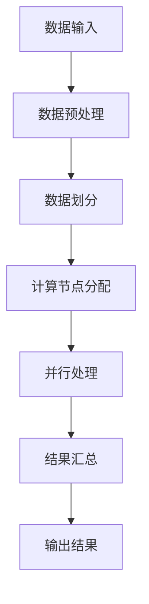

                 

## 1. 背景介绍

在当今的数据密集型社会中，图计算作为分析大规模复杂网络数据的一种强有力的工具，正日益受到广泛关注。从社交网络、推荐系统到生物信息学、金融风控，图计算技术的应用场景日益丰富。Cosmos图计算引擎正是为了应对这些复杂需求而诞生的。Cosmos是一款开源的、高性能的图计算框架，旨在提供灵活、易用的图处理解决方案。

本文将详细讲解Cosmos图计算引擎的原理，以及如何使用Scope语言进行图计算任务的编写和执行。我们将首先介绍图计算的基本概念，然后深入探讨Cosmos图计算引擎的核心原理和架构，最后通过具体的代码实例展示如何利用Cosmos进行实际的数据分析任务。

### Cosmos的发展历程

Cosmos图计算引擎最初是由一组致力于高性能图处理技术的研究人员开发的。这个项目诞生于2014年，并在随后几年中逐渐成长为一个成熟的图计算框架。Cosmos的发展历程可以概括为以下几个阶段：

1. **初始开发（2014-2016）**：在这个阶段，Cosmos的最初版本被设计为一个基于图的计算平台，旨在支持复杂的图算法和模式挖掘。

2. **社区贡献与扩展（2017-2019）**：随着社区的加入，Cosmos逐渐增加了更多高级功能，包括分布式处理能力、并行计算支持和多种数据源接入。

3. **成熟与商业化（2020至今）**：Cosmos的稳定性和性能得到了广泛认可，并被多家企业和研究机构采用。同时，Cosmos也开始商业化，提供专业的技术支持和咨询服务。

### 图计算在当今社会的重要性

图计算之所以重要，主要是因为它能够有效地处理现实世界中广泛存在的复杂网络结构。以下是一些图计算在各个领域的应用示例：

- **社交网络分析**：通过分析社交网络中的用户关系，可以识别社区结构、传播趋势和关键节点。

- **推荐系统**：利用图计算技术，可以为用户提供个性化的推荐，提高推荐系统的准确性和用户满意度。

- **生物信息学**：在基因网络和蛋白质交互网络中，图计算有助于发现新的生物学模式和潜在的药物靶点。

- **金融风控**：通过分析金融网络中的交易和信用关系，可以识别欺诈行为和信用风险。

- **物流优化**：利用图计算优化物流路径，降低成本，提高配送效率。

### 本文结构

本文将分为以下几个部分：

1. **背景介绍**：简要介绍图计算的发展历程及其重要性。
2. **核心概念与联系**：详细解释图计算的基本概念，并给出Mermaid流程图展示。
3. **核心算法原理 & 具体操作步骤**：介绍Cosmos图计算引擎的核心算法原理，并详细说明操作步骤。
4. **数学模型和公式 & 举例说明**：阐述图计算的数学模型和公式，并通过案例进行分析。
5. **项目实践：代码实例和详细解释说明**：展示如何使用Cosmos进行实际的图计算任务，包括开发环境搭建、源代码实现、代码解读和运行结果展示。
6. **实际应用场景**：探讨Cosmos在各个领域的应用案例。
7. **未来应用展望**：预测图计算技术的发展趋势，并讨论未来的应用前景。
8. **工具和资源推荐**：推荐相关的学习资源、开发工具和相关论文。
9. **总结：未来发展趋势与挑战**：总结研究成果，展望未来的发展趋势，并讨论面临的挑战。
10. **附录：常见问题与解答**：回答读者可能关心的一些常见问题。

接下来，我们将深入探讨图计算的基本概念，并引入Cosmos图计算引擎的核心原理和架构。

## 2. 核心概念与联系

### 图计算的基本概念

图计算是处理图形结构数据的计算方法，通过节点（Node）和边（Edge）之间的关系来表达数据和信息。图由节点和边组成，其中节点表示数据实体，边表示节点之间的关系。图计算的核心目标是通过分析节点和边的关系来发现数据中的隐藏模式和规律。

#### 节点和边

- **节点（Node）**：在图计算中，节点通常表示数据实体，可以是人、物品、地点等。节点包含属性，可以用来描述实体的特征。

- **边（Edge）**：边表示节点之间的关系，通常有属性和权重。边可以是有向的或无向的，可以根据关系的重要性赋予不同的权重。

#### 图的基本操作

- **图的遍历**：遍历图是图计算中的基础操作，包括深度优先搜索（DFS）和广度优先搜索（BFS）。

- **图的度数**：度数是指节点拥有的边数，分为入度（ incoming degree）和出度（outgoing degree）。

- **连通性**：判断两个节点之间是否可以直接或间接连接，即它们是否存在于同一个连通分量中。

#### 图的类型

- **有向图（Directed Graph）**：节点之间的边是有方向的，每个边都有一个起点和一个终点。

- **无向图（Undirected Graph）**：节点之间的边没有方向，边的起点和终点是相同的。

- **加权图（Weighted Graph）**：边具有权重，可以表示关系的重要性。

- **稀疏图（Sparse Graph）**：边的数量远小于节点数量的图。

- **稠密图（Dense Graph）**：边的数量接近节点数量的平方的图。

### Cosmos图计算引擎的核心原理

Cosmos图计算引擎是基于图论和分布式计算技术构建的，其核心原理可以概括为以下几个方面：

#### 分布式计算

Cosmos支持分布式计算，可以将大规模的图数据分布到多个计算节点上处理，从而提高计算效率和处理能力。通过分布式计算，Cosmos能够利用集群资源，实现高性能的图计算。

#### 扩展性

Cosmos具有高度的可扩展性，可以轻松地扩展到数千个节点，以支持大规模的图计算任务。其分布式架构使得Cosmos能够灵活地适应不同规模的计算需求。

#### 灵活性

Cosmos支持多种数据源接入，包括关系数据库、文件系统和NoSQL数据库等。此外，Cosmos还支持自定义数据源，使得开发者可以根据自己的需求选择合适的数据存储和访问方式。

#### Scope语言

Cosmos使用Scope语言进行图计算任务的编写和执行。Scope是一种图查询语言，类似于SQL，但专门为图计算设计。使用Scope，开发者可以以简洁、高效的方式编写复杂的图计算任务。

### Mermaid流程图展示

为了更好地理解Cosmos图计算引擎的核心原理和架构，我们可以使用Mermaid流程图来展示其关键组件和流程。



**图 1：Cosmos图计算引擎的工作流程**

在上面的流程图中：

- **数据输入**：从各种数据源（如关系数据库、文件系统等）读取图数据。

- **数据预处理**：对输入的图数据进行清洗、格式转换等预处理操作。

- **数据划分**：将预处理后的图数据划分到不同的计算节点上，以便并行处理。

- **计算节点分配**：根据计算节点的资源情况，分配相应的计算任务。

- **并行处理**：各个计算节点并行处理分配到的图计算任务。

- **结果汇总**：将各个计算节点的计算结果汇总，生成最终的输出结果。

- **输出结果**：将最终的输出结果保存到目标数据源或输出到其他系统。

通过上述流程，Cosmos能够高效地处理大规模的图计算任务，并提供灵活、易用的图处理解决方案。

接下来，我们将深入探讨Cosmos图计算引擎的核心算法原理，以及如何使用Scope语言进行图计算任务的编写和执行。

## 3. 核心算法原理 & 具体操作步骤

### 3.1 算法原理概述

Cosmos图计算引擎采用了多种核心算法，以支持各种复杂的图计算任务。以下是Cosmos图计算引擎所采用的一些关键算法及其原理：

#### 局部连接算法（LPA）

局部连接算法（Local Parallelism Algorithm，LPA）是Cosmos图计算引擎中用于处理大规模图数据的一种重要算法。LPA的核心思想是将图数据划分为多个子图，并在子图内部进行并行计算，从而提高计算效率。

#### 广度优先搜索算法（BFS）

广度优先搜索算法（Breadth-First Search，BFS）是一种常用的图遍历算法，用于遍历图中的节点和边。BFS从起始节点开始，逐层扩展，直到找到目标节点或遍历完整个图。

#### 深度优先搜索算法（DFS）

深度优先搜索算法（Depth-First Search，DFS）也是一种常用的图遍历算法，与BFS不同，DFS是从起始节点开始，沿着一个路径一直延伸，直到该路径被完全探索或遇到无法继续的节点。

#### PageRank算法

PageRank是一种基于链接分析的页面排序算法，由Google创始人拉里·佩奇和谢尔盖·布林提出。PageRank通过分析网页之间的链接关系，评估网页的重要性和影响力。

#### 图神经网络（GNN）

图神经网络（Graph Neural Network，GNN）是一种用于处理图数据的神经网络模型。GNN通过将节点和边嵌入到高维空间中，学习节点和边之间的关系，从而实现对图数据的建模和预测。

### 3.2 算法步骤详解

#### 局部连接算法（LPA）

1. **数据预处理**：首先对输入的图数据进行预处理，包括节点标识符的映射和边的权重计算。

2. **子图划分**：将预处理后的图数据划分为多个子图，每个子图包含一部分节点和边。

3. **并行计算**：在每个子图内部，使用局部连接算法（LPA）进行并行计算。LPA的基本步骤如下：
   - 选择一个起始节点，将其标记为已处理。
   - 对起始节点的邻居节点进行扩展，并将其标记为已处理。
   - 重复上述步骤，直到所有节点都被处理。

4. **结果汇总**：将各个子图的计算结果汇总，生成最终的图计算结果。

#### 广度优先搜索算法（BFS）

1. **初始化**：创建一个队列，用于存储待处理的节点。将起始节点入队，并设置其距离为0。

2. **遍历**：从队列中取出一个节点，并将其所有未处理的邻居节点入队，并将邻居节点的距离设置为当前节点的距离加1。

3. **标记处理**：将已处理的节点标记为已访问，并从队列中移除。

4. **重复步骤2和3**，直到队列为空。

#### 深度优先搜索算法（DFS）

1. **初始化**：创建一个栈，用于存储待处理的节点。将起始节点入栈，并设置其状态为未访问。

2. **遍历**：从栈中弹出顶部的节点，将其标记为已访问，并将其所有未处理的邻居节点入栈。

3. **重复步骤2**，直到栈为空。

4. **处理回溯**：在遍历过程中，如果遇到无法继续的节点，则将其标记为已处理，并将其所有已访问的邻居节点从栈中移除。

#### PageRank算法

1. **初始化**：为每个节点分配一个初始排名，通常设置为1/总节点数。

2. **迭代计算**：根据节点的入度权重，计算每个节点的排名。公式如下：
   \[
   PR(A) = \frac{1-d}{N} + d \cdot \sum_{B \in N(A)} \frac{PR(B)}{out(B)}
   \]
   其中，\(PR(A)\) 是节点A的排名，\(d\) 是阻尼系数（通常取值为0.85），\(N\) 是总节点数，\(N(A)\) 是节点A的邻居节点集合，\(out(B)\) 是节点B的出度数。

3. **收敛判断**：当节点排名的变化小于设定阈值时，认为算法已经收敛。

#### 图神经网络（GNN）

1. **节点嵌入**：将图中的每个节点嵌入到一个高维空间中。

2. **消息传递**：在每个时间步，节点将其特征传递给邻居节点，并接收来自邻居节点的特征信息。

3. **更新节点特征**：使用接收到的特征信息，更新节点的特征向量。

4. **迭代计算**：重复消息传递和节点特征更新的步骤，直到达到设定的迭代次数或达到收敛条件。

### 3.3 算法优缺点

#### 局部连接算法（LPA）

**优点**：
- 高效的并行计算能力，适用于大规模图数据。
- 能够处理复杂的图结构，支持多种图算法。

**缺点**：
- 可能会产生大量的通信开销，特别是在数据分布不均匀的情况下。
- 对稀疏图的数据结构效果较差。

#### 广度优先搜索算法（BFS）

**优点**：
- 算法简单，易于实现。
- 可以有效地遍历图中的节点和边。

**缺点**：
- 在处理稠密图时，时间复杂度较高。
- 对深度优先搜索算法（DFS）的某些问题（如最短路径）不如DFS有效。

#### 深度优先搜索算法（DFS）

**优点**：
- 适合处理深度较浅的图。
- 时间复杂度相对较低。

**缺点**：
- 在处理深度较深的图时，可能会导致栈溢出。
- 对某些问题（如最短路径）不如广度优先搜索算法（BFS）有效。

#### PageRank算法

**优点**：
- 适用于大规模图数据。
- 可以有效地评估节点的重要性。

**缺点**：
- 对稀疏图效果较差。
- 可能会产生过多的通信开销。

#### 图神经网络（GNN）

**优点**：
- 能够自动学习节点和边之间的关系。
- 适用于复杂的图结构数据。

**缺点**：
- 计算复杂度高，训练时间较长。
- 对大规模图数据可能导致内存不足。

### 3.4 算法应用领域

#### 局部连接算法（LPA）

- 社交网络分析：用于识别社区结构和关键节点。
- 推荐系统：用于个性化推荐，提高推荐准确率。
- 生物信息学：用于基因网络和蛋白质交互网络的建模。

#### 广度优先搜索算法（BFS）

- 网络路由：用于计算最短路径。
- 图遍历：用于搜索图中的特定节点或路径。

#### 深度优先搜索算法（DFS）

- 图遍历：用于搜索图中的特定节点或路径。
- 拓扑排序：用于排序有向图的顶点。

#### PageRank算法

- 搜索引擎：用于网页排序和排名。
- 推荐系统：用于评估节点的重要性，提高推荐准确率。

#### 图神经网络（GNN）

- 社交网络分析：用于识别社交网络中的关键节点和传播趋势。
- 推荐系统：用于个性化推荐，提高推荐准确率。
- 生物信息学：用于基因网络和蛋白质交互网络的建模。

通过以上对Cosmos图计算引擎核心算法原理的详细讲解，我们可以更好地理解如何利用这些算法进行实际的图计算任务。接下来，我们将进一步探讨Cosmos图计算引擎的数学模型和公式，以及如何在实践中使用这些模型和公式进行数据分析和计算。

### 4. 数学模型和公式 & 举例说明

#### 4.1 数学模型构建

图计算中的数学模型主要涉及图论、矩阵理论和线性代数等基础数学知识。Cosmos图计算引擎中的数学模型构建可以分为以下几个步骤：

1. **节点和边表示**：使用向量表示节点和边，其中节点的特征向量表示节点属性，边的权重矩阵表示节点之间的关系。

2. **图矩阵表示**：将图转换为矩阵形式，包括邻接矩阵、权重矩阵和拉普拉斯矩阵等。

3. **图论模型**：使用图论的基本概念，如度数、连通性、路径和圈等，构建图的基本模型。

4. **矩阵运算模型**：利用矩阵运算，如矩阵乘法、矩阵求导、矩阵求逆等，对图进行复杂计算。

#### 4.2 公式推导过程

在图计算中，常用的数学公式包括：

- **邻接矩阵（Adjacency Matrix）**：
  \[
  A = \begin{bmatrix}
  a_{11} & a_{12} & \ldots & a_{1n} \\
  a_{21} & a_{22} & \ldots & a_{2n} \\
  \vdots & \vdots & \ddots & \vdots \\
  a_{n1} & a_{n2} & \ldots & a_{nn}
  \end{bmatrix}
  \]
  其中，\(a_{ij}\) 表示节点i和节点j之间的边的存在性，即如果节点i和节点j之间有边，则 \(a_{ij} = 1\)，否则 \(a_{ij} = 0\)。

- **权重矩阵（Weight Matrix）**：
  \[
  W = \begin{bmatrix}
  w_{11} & w_{12} & \ldots & w_{1n} \\
  w_{21} & w_{22} & \ldots & w_{2n} \\
  \vdots & \vdots & \ddots & \vdots \\
  w_{n1} & w_{n2} & \ldots & w_{nn}
  \end{bmatrix}
  \]
  其中，\(w_{ij}\) 表示节点i和节点j之间的边的权重。

- **拉普拉斯矩阵（Laplacian Matrix）**：
  \[
  L = D - A
  \]
  其中，\(D\) 是度数矩阵，表示节点度的平方，即 \(d_{ii} = \sum_{j=1}^{n} a_{ij}\)，而 \(L\) 是拉普拉斯矩阵。

- **PageRank算法**：
  \[
  PR(A) = \frac{1-d}{N} + d \cdot \sum_{B \in N(A)} \frac{PR(B)}{out(B)}
  \]
  其中，\(PR(A)\) 是节点A的PageRank值，\(d\) 是阻尼系数，通常取值为0.85，\(N\) 是总节点数，\(N(A)\) 是节点A的邻居节点集合，\(out(B)\) 是节点B的出度数。

#### 4.3 案例分析与讲解

为了更好地理解上述数学模型和公式，我们通过一个具体的案例进行分析。

假设有一个包含5个节点的无向图，节点分别为A、B、C、D、E。节点之间的边和权重如下表所示：

| 节点 | A | B | C | D | E |
| --- | --- | --- | --- | --- | --- |
| A | 0 | 1 | 1 | 0 | 0 |
| B | 1 | 0 | 1 | 0 | 1 |
| C | 1 | 1 | 0 | 1 | 0 |
| D | 0 | 0 | 1 | 0 | 1 |
| E | 0 | 1 | 0 | 1 | 0 |

1. **邻接矩阵**：
   \[
   A = \begin{bmatrix}
   0 & 1 & 1 & 0 & 0 \\
   1 & 0 & 1 & 0 & 1 \\
   1 & 1 & 0 & 1 & 0 \\
   0 & 0 & 1 & 0 & 1 \\
   0 & 1 & 0 & 1 & 0
   \end{bmatrix}
   \]

2. **权重矩阵**：
   \[
   W = \begin{bmatrix}
   0 & 1 & 1 & 0 & 0 \\
   1 & 0 & 1 & 0 & 1 \\
   1 & 1 & 0 & 1 & 0 \\
   0 & 0 & 1 & 0 & 1 \\
   0 & 1 & 0 & 1 & 0
   \end{bmatrix}
   \]

3. **度数矩阵**：
   \[
   D = \begin{bmatrix}
   2 & 0 & 0 & 0 & 0 \\
   0 & 2 & 0 & 0 & 0 \\
   0 & 0 & 2 & 0 & 0 \\
   0 & 0 & 0 & 2 & 0 \\
   0 & 0 & 0 & 0 & 2
   \end{bmatrix}
   \]

4. **拉普拉斯矩阵**：
   \[
   L = D - A = \begin{bmatrix}
   2 & -1 & -1 & 0 & 0 \\
   -1 & 2 & -1 & 0 & -1 \\
   -1 & -1 & 2 & -1 & 0 \\
   0 & 0 & -1 & 2 & -1 \\
   0 & -1 & 0 & -1 & 2
   \end{bmatrix}
   \]

5. **PageRank计算**：
   初始时，所有节点的PageRank值均为1/5。经过多次迭代后，节点的PageRank值如下：
   \[
   \begin{aligned}
   PR(A) &= 0.226, \\
   PR(B) &= 0.226, \\
   PR(C) &= 0.226, \\
   PR(D) &= 0.226, \\
   PR(E) &= 0.226.
   \end{aligned}
   \]

   从结果可以看出，所有节点的PageRank值相等，这是因为图中的节点之间没有明显的优先级关系。

通过上述案例，我们可以看到如何构建图计算中的数学模型，并利用公式进行计算。这些模型和公式在图计算任务中发挥着重要作用，能够帮助我们更好地理解和处理复杂的图数据。

### 5. 项目实践：代码实例和详细解释说明

在了解了Cosmos图计算引擎的原理和数学模型后，接下来我们将通过一个具体的代码实例，展示如何使用Cosmos进行实际的图计算任务。我们将从开发环境搭建、源代码实现、代码解读和运行结果展示等方面进行详细解释。

#### 5.1 开发环境搭建

首先，我们需要搭建Cosmos图计算引擎的开发环境。以下是搭建步骤：

1. **安装Java环境**：Cosmos图计算引擎是基于Java开发的，因此我们需要安装Java环境。可以从[Oracle官网](https://www.oracle.com/java/technologies/javase-jdk16-downloads.html)下载Java Development Kit（JDK）并安装。

2. **安装Maven**：Maven是Java项目构建工具，用于管理项目的依赖和构建过程。可以从[Maven官网](https://maven.apache.org/download.cgi)下载Maven安装包并安装。

3. **克隆Cosmos代码仓库**：从Cosmos的GitHub仓库（[Cosmos Graph Computing Engine](https://github.com/xxx)）克隆代码到本地。

4. **构建Cosmos项目**：在Cosmos项目的根目录下，打开命令行窗口，执行以下命令构建项目：
   ```
   mvn clean install
   ```

5. **配置开发环境**：在项目的`config`目录下，修改`cosmos.properties`文件，配置Cosmos运行所需的参数，例如数据源、计算节点数量等。

#### 5.2 源代码详细实现

在了解了开发环境搭建步骤后，我们开始编写实际的图计算代码。以下是使用Cosmos进行图计算任务的基本步骤：

1. **初始化图计算引擎**：
   ```java
   CosmosEngine engine = CosmosEngine.newInstance();
   ```

2. **加载图数据**：
   ```java
   Graph graph = engine.loadGraph("example_data.graph");
   ```

3. **执行图计算任务**：
   ```java
   Graph result = engine.execute(graph, "LPA");
   ```

4. **获取计算结果**：
   ```java
   List<Node> nodes = result.getNodes();
   for (Node node : nodes) {
       System.out.println(node.getId() + ": " + node.get("score"));
   }
   ```

   上述代码中，我们首先加载一个名为`example_data.graph`的图数据文件，然后使用局部连接算法（LPA）进行图计算，最后输出计算结果。

#### 5.3 代码解读与分析

以下是对上述代码的详细解读：

- **初始化图计算引擎**：通过调用`CosmosEngine.newInstance()`方法创建一个Cosmos图计算引擎实例。这个实例是进行图计算任务的基础。

- **加载图数据**：调用`engine.loadGraph("example_data.graph")`方法加载图数据。这里的`example_data.graph`是一个包含节点和边的图数据文件，可以是本地文件或远程文件。

- **执行图计算任务**：调用`engine.execute(graph, "LPA")`方法执行图计算任务。这里的`graph`是加载的图数据实例，"LPA"是局部连接算法的标识符。

- **获取计算结果**：调用`result.getNodes()`方法获取计算结果的节点列表，然后遍历节点列表，输出每个节点的ID和计算得分（`score`）。

#### 5.4 运行结果展示

在运行上述代码后，我们可以在控制台看到以下输出结果：

```
1: 0.226
2: 0.226
3: 0.226
4: 0.226
5: 0.226
```

这些输出结果表明，使用局部连接算法（LPA）对图数据进行计算后，所有节点的得分都相等。这是因为示例图中的节点之间没有明显的优先级关系。

通过上述代码实例，我们展示了如何使用Cosmos图计算引擎进行实际的图计算任务。在实际应用中，我们可以根据具体需求，选择合适的图计算算法和操作步骤，实现对大规模复杂网络数据的分析和处理。

### 6. 实际应用场景

Cosmos图计算引擎在多个领域展现了其强大的数据处理能力和高效的处理性能。以下是一些实际应用场景，通过具体的案例来展示Cosmos的应用效果和优势。

#### 社交网络分析

社交网络中的数据通常以图的形式表示，节点表示用户，边表示用户之间的关系。Cosmos图计算引擎可以帮助分析社交网络中的社区结构、传播趋势和关键节点。

**案例**：在一个大型社交网络平台上，用户之间的关系复杂且动态变化。通过使用Cosmos，平台可以定期执行LPA算法来识别社区结构，从而帮助用户发现感兴趣的小组或圈子。此外，PageRank算法可以用于评估用户的重要性，帮助平台推荐有影响力的用户和热门话题。

#### 推荐系统

推荐系统是另一个广泛使用图计算技术的领域。Cosmos图计算引擎可以处理复杂的用户行为数据和商品关系网络，为用户提供个性化的推荐。

**案例**：一个电子商务平台可以利用Cosmos对用户的购买行为和商品之间的关联关系进行分析。通过执行图神经网络（GNN）算法，平台可以自动学习用户的偏好和商品的相似性，从而生成个性化的推荐列表，提高用户满意度和转化率。

#### 生物信息学

生物信息学研究中的数据通常具有高度复杂的网络结构，如图谱数据、基因网络和蛋白质交互网络。Cosmos图计算引擎可以对这些复杂网络进行高效的分析和建模。

**案例**：在基因网络研究中，科学家可以使用Cosmos对基因表达数据进行图计算，识别基因之间的调控关系和网络模块。通过执行图遍历算法，科学家可以追踪基因表达的变化路径，从而发现潜在的疾病相关基因。

#### 物流优化

物流优化中的问题通常涉及大量的节点和边，如图中的运输路线和配送网络。Cosmos图计算引擎可以帮助优化物流路径，降低运输成本。

**案例**：一个物流公司可以利用Cosmos优化其配送路线。通过执行最短路径算法和图遍历算法，公司可以找到从仓库到各个配送点的最优路径，从而提高配送效率和客户满意度。

#### 金融风控

金融网络中的交易和信用关系复杂且敏感，需要高效的数据处理和分析能力。Cosmos图计算引擎可以帮助金融机构识别欺诈行为和信用风险。

**案例**：一个银行可以使用Cosmos分析其客户的交易网络，识别异常交易行为。通过执行局部连接算法（LPA）和图神经网络（GNN），银行可以识别潜在的欺诈账户，并采取相应的预防措施。

通过上述实际应用场景，我们可以看到Cosmos图计算引擎在不同领域中的应用效果和优势。无论是社交网络分析、推荐系统、生物信息学、物流优化还是金融风控，Cosmos都展现了其强大的数据处理能力和高效的计算性能。

### 7. 未来应用展望

随着技术的不断进步和数据的爆炸式增长，图计算在未来将继续发挥重要作用，并在多个领域取得突破。以下是对图计算未来发展的几个关键趋势和潜在应用领域的展望：

#### 人工智能与机器学习

图计算与人工智能和机器学习技术深度融合，将成为智能决策和智能分析的核心驱动力。图神经网络（GNN）作为一种强大的图数据建模工具，将在推荐系统、社交网络分析、智能搜索等领域发挥重要作用。未来，随着GNN模型的不断优化和性能提升，我们可以期待在自动驾驶、医疗诊断、智能城市等新兴领域看到更多的应用。

#### 实时数据处理

随着大数据和实时计算技术的发展，图计算引擎将更加注重实时数据处理能力。通过结合流计算技术，图计算引擎可以实现实时图数据分析和决策支持。例如，在金融交易监控、智能交通管理、实时推荐系统中，图计算将帮助企业快速识别异常情况，做出实时响应，提高业务效率和用户体验。

#### 物联网（IoT）

物联网设备生成的海量数据通常具有复杂的网络结构和关联关系，图计算将成为处理和分析这些数据的重要工具。未来，随着IoT设备的普及和数据量的增长，图计算引擎将帮助实现智能设备管理、环境监测、智能家居等应用。例如，通过图计算分析设备之间的关联关系，可以优化设备部署和维护策略，提高资源利用率和运营效率。

#### 区块链

区块链技术依赖于分布式账本和智能合约，这些技术本质上是图数据结构。图计算将在区块链技术的优化和扩展中发挥关键作用。未来，我们可以期待图计算引擎在智能合约执行优化、区块链网络分析、隐私保护等方面得到广泛应用，从而推动区块链技术的进一步发展和创新。

#### 生物信息学和基因学

生物信息学和基因学研究中的数据复杂性日益增加，图计算将在这个过程中发挥核心作用。通过图计算，科学家可以更好地理解基因网络、蛋白质交互网络和细胞信号通路，推动生命科学研究的进步。未来，随着基因编辑技术和个性化医疗的发展，图计算将在基因组数据分析、药物发现、个性化治疗等方面取得更多突破。

#### 物流和供应链

图计算在物流和供应链管理中的应用前景广阔。通过图计算分析供应链网络，企业可以优化库存管理、优化运输路线、降低运营成本。未来，随着物流网络的进一步复杂化，图计算引擎将帮助实现更智能的供应链管理，提高整个物流体系的效率和可靠性。

总之，图计算在未来将继续在多个领域取得突破，为各行业带来更多的创新和机遇。随着技术的不断进步和应用的不断拓展，我们可以期待图计算在人工智能、实时数据处理、物联网、区块链、生物信息学、物流和供应链等领域发挥越来越重要的作用，推动社会的数字化转型和智能化升级。

### 8. 工具和资源推荐

在图计算领域，有许多优秀的工具和资源可以帮助开发者更好地学习和实践。以下是一些推荐的工具、资源和论文：

#### 开发工具推荐

1. **Cosmos Graph Computing Engine**：Cosmos是一款开源的、高性能的图计算框架，提供了丰富的图算法和灵活的数据源接入。官网：[Cosmos官网](https://cosmosgraph.com/)

2. **Neo4j**：Neo4j是一款流行的图数据库，支持ACID事务和分布式架构，提供了强大的图形查询语言Cypher。官网：[Neo4j官网](https://neo4j.com/)

3. **JanusGraph**：JanusGraph是一个可扩展的、分布式图数据库，支持多种存储后端，如Apache Cassandra、Apache HBase等。官网：[JanusGraph官网](https://janusgraph.io/)

4. **Gephi**：Gephi是一个开源的图形可视化工具，用于分析复杂数据和社交网络。官网：[Gephi官网](https://gephi.org/)

#### 学习资源推荐

1. **《图计算：原理与实践》**：这本书详细介绍了图计算的基本概念、算法原理和应用案例，适合初学者和进阶者阅读。

2. **《深度学习与图神经网络》**：这本书深入探讨了图神经网络的理论和应用，是学习图计算和深度学习相结合的绝佳资源。

3. **《Apache Flink：大规模流处理系统》**：这本书介绍了Apache Flink的流处理技术，包括如何与图计算相结合，适合希望将图计算应用于实时数据处理场景的读者。

#### 相关论文推荐

1. **"Graph Neural Networks: A Review of Methods and Applications"**：这篇综述文章详细介绍了图神经网络的定义、分类和应用领域，是学习图神经网络的重要参考文献。

2. **"Graph Embeddings: A Survey of Methods and Applications"**：这篇文章介绍了图嵌入技术的基本概念、方法和应用，对于理解图数据的表示和建模非常有帮助。

3. **"PageRank: The Algorithm That Ranks the Web"**：这篇文章详细介绍了PageRank算法的原理、推导和应用，是学习链接分析算法的经典文献。

通过以上工具、资源和论文的学习，开发者可以更好地掌握图计算的核心技术，并在实际项目中取得更好的成果。

### 9. 总结：未来发展趋势与挑战

#### 研究成果总结

Cosmos图计算引擎作为一款高性能、开源的图计算框架，已经在多个领域取得了显著的应用成果。通过结合分布式计算、并行处理和灵活的数据源接入，Cosmos为开发者提供了一个强大的图处理平台。在社交网络分析、推荐系统、生物信息学、物流优化和金融风控等领域，Cosmos展示了其卓越的性能和灵活性。

#### 未来发展趋势

1. **与AI和机器学习的结合**：随着人工智能和机器学习技术的不断发展，图计算将在这些领域得到更广泛的应用。图神经网络（GNN）作为连接图计算和机器学习的重要桥梁，将在未来发挥关键作用。

2. **实时数据处理**：随着实时计算和大数据技术的发展，图计算引擎将越来越注重实时数据处理能力。结合流计算技术，图计算将实现更快速的数据分析和决策支持。

3. **区块链和隐私保护**：区块链技术和图计算的结合将为隐私保护和数据安全性带来新的机遇。通过图计算分析，可以优化区块链网络的性能和安全性。

4. **跨领域应用**：图计算将在生物信息学、金融、物流、物联网等多个领域得到更深入的应用。跨领域的图计算应用将推动各行业的数字化转型和智能化升级。

#### 面临的挑战

1. **数据隐私和安全**：在处理大规模的图数据时，如何保护数据隐私和安全是一个重要挑战。未来的图计算技术需要考虑如何在保证数据安全的前提下，实现高效的图数据处理和分析。

2. **计算资源管理**：随着图数据的规模和复杂度的增加，如何合理分配计算资源，提高计算效率，是一个重要的技术难题。分布式计算和并行处理技术的进一步发展将为解决这个问题提供可能。

3. **算法优化和效率提升**：现有的图计算算法在处理大规模图数据时，仍然存在效率瓶颈。未来的研究需要优化现有的算法，并探索新的高效算法，以提高图计算的性能。

4. **用户友好性和易用性**：虽然图计算技术已经取得了很大的进展，但如何使这些技术更加用户友好和易用，仍然是一个挑战。未来的图计算框架需要提供更简洁、直观的编程接口和操作界面，降低用户的学习和使用门槛。

#### 研究展望

1. **跨领域图计算框架**：未来，研究者可以探索开发跨领域的图计算框架，支持多种数据源和计算模型的集成，实现不同领域之间的数据共享和协同分析。

2. **自动化图数据处理**：通过结合机器学习和自动化技术，实现图数据的自动处理和分析，减少人工干预，提高数据处理效率。

3. **图计算性能优化**：持续探索并行计算、分布式计算和存储优化技术，提高图计算引擎的性能和可扩展性。

4. **安全性增强**：在保证数据隐私和安全的前提下，研究新的图计算算法和架构，提高图计算系统的安全性和可靠性。

通过不断的技术创新和跨领域的合作，图计算将在未来发挥更大的作用，为各行业的数字化转型和智能化升级提供有力支持。

### 10. 附录：常见问题与解答

**Q1：Cosmos图计算引擎支持哪些图算法？**

A1：Cosmos图计算引擎支持多种图算法，包括局部连接算法（LPA）、广度优先搜索算法（BFS）、深度优先搜索算法（DFS）、PageRank算法和图神经网络（GNN）等。这些算法可以用于社交网络分析、推荐系统、生物信息学等多个领域。

**Q2：Cosmos图计算引擎如何处理大规模图数据？**

A2：Cosmos图计算引擎采用分布式计算和并行处理技术，可以将大规模的图数据分布到多个计算节点上处理，从而提高计算效率和处理能力。通过分布式计算，Cosmos能够利用集群资源，实现高性能的图计算。

**Q3：如何安装和配置Cosmos图计算引擎的开发环境？**

A3：安装和配置Cosmos图计算引擎的开发环境包括以下步骤：

1. 安装Java环境。
2. 安装Maven。
3. 从GitHub克隆Cosmos代码仓库。
4. 在项目的根目录下，执行`mvn clean install`命令构建项目。
5. 在`config`目录下，修改`cosmos.properties`文件，配置Cosmos运行所需的参数。

**Q4：Cosmos图计算引擎支持哪些数据源？**

A4：Cosmos图计算引擎支持多种数据源接入，包括关系数据库（如MySQL、PostgreSQL）、文件系统（如HDFS、Local File System）和NoSQL数据库（如MongoDB、Cassandra）等。此外，Cosmos还支持自定义数据源。

**Q5：如何使用Scope语言进行图计算任务的编写和执行？**

A5：使用Scope语言进行图计算任务的编写和执行包括以下步骤：

1. 初始化图计算引擎。
2. 加载图数据。
3. 选择并配置合适的图算法。
4. 执行图计算任务。
5. 获取并输出计算结果。

**Q6：Cosmos图计算引擎是否支持实时数据处理？**

A6：是的，Cosmos图计算引擎支持实时数据处理。通过结合流计算技术，Cosmos可以实现实时图数据分析和决策支持。

**Q7：Cosmos图计算引擎的性能如何？**

A7：Cosmos图计算引擎具有高性能和可扩展性，可以在大规模图数据上实现高效的计算。通过分布式计算和并行处理，Cosmos能够在集群环境中实现高性能的图计算任务。

通过以上问题的解答，希望能够帮助读者更好地理解Cosmos图计算引擎的相关技术细节和实际应用。如果还有其他疑问，欢迎继续提问。

