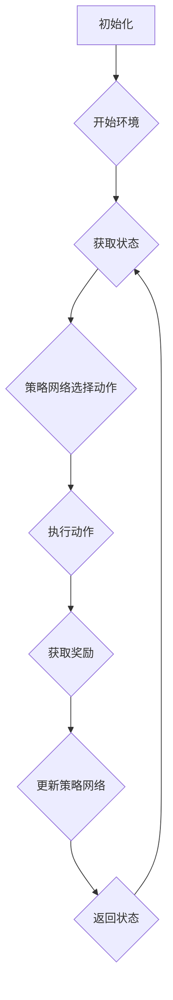

                 

关键字：深度学习、强化学习、深度强化学习、智能决策、探索-利用权衡、策略优化、模型评估、应用场景

摘要：本文将深入探讨深度强化学习的原理和实现方法，从基本概念到算法流程，再到具体代码实例，全面解析这一前沿技术的核心内容。通过对深度强化学习在实际应用中的展示，读者可以更好地理解如何利用这一强大工具解决复杂决策问题。

## 1. 背景介绍

深度强化学习（Deep Reinforcement Learning, DRL）是人工智能领域的一种先进方法，它结合了深度学习和强化学习的优点，旨在通过智能体与环境的交互，自主学习和优化决策策略。这一领域的研究始于20世纪90年代，近年来随着计算能力和算法的进步，DRL在学术界和工业界都取得了显著进展。

在深度强化学习中，智能体通过不断尝试和错误，从环境中的奖励信号中学习最优策略。这一过程模拟了人类学习的方式，使DRL在解决复杂决策问题时具有强大的潜力。与传统的强化学习方法相比，DRL引入了深度神经网络，能够处理高维状态空间和动作空间，极大地扩展了其应用范围。

本文将首先介绍深度强化学习的基本概念和核心理论，然后通过具体实例展示如何实现一个深度强化学习算法，并分析其在实际问题中的应用。

## 2. 核心概念与联系

### 2.1. 强化学习基本概念

强化学习是一种无监督学习方法，其核心概念包括智能体（Agent）、环境（Environment）、状态（State）、动作（Action）和奖励（Reward）。智能体是执行动作的实体，环境是智能体所处的情境，状态是环境的描述，动作是智能体对环境的一种操作，而奖励是环境对智能体动作的反馈。

### 2.2. 深度强化学习架构

深度强化学习的架构主要包括三个部分：深度神经网络、策略网络和价值网络。深度神经网络用于处理高维状态信息，策略网络根据当前状态选择最优动作，价值网络评估状态的价值。这三者之间相互协作，通过迭代优化，使智能体在环境中实现自主学习和优化。

### 2.3. Mermaid 流程图

以下是一个简单的Mermaid流程图，展示了深度强化学习的基本流程：



## 3. 核心算法原理 & 具体操作步骤

### 3.1. 算法原理概述

深度强化学习算法的核心是策略优化和价值评估。策略优化通过选择动作来最大化长期奖励，价值评估通过评估状态的价值来指导策略优化。

策略优化通常使用策略梯度算法，如深度Q网络（DQN）和策略梯度方法（PG）。价值评估则使用深度神经网络，如深度Q网络（DQN）和价值函数估计（VF）。

### 3.2. 算法步骤详解

1. 初始化参数，包括网络权重、探索率等。
2. 将智能体放入环境中，获取初始状态。
3. 使用策略网络选择动作。
4. 执行动作，获取新的状态和奖励。
5. 使用奖励信号更新策略网络和价值网络。
6. 返回新的状态，重复步骤3-5，直到达到停止条件。

### 3.3. 算法优缺点

**优点：**
- 能够处理高维状态空间和动作空间。
- 自主学习和优化策略，无需人为设计规则。
- 广泛应用于复杂决策问题。

**缺点：**
- 学习速度较慢，需要大量数据和时间。
- 对参数敏感，可能陷入局部最优。

### 3.4. 算法应用领域

深度强化学习在游戏、机器人、自动驾驶、金融、医疗等领域都有广泛的应用。例如，在游戏中，DRL可以用于训练智能对手，在机器人中，DRL可以用于路径规划和任务执行，在自动驾驶中，DRL可以用于决策和导航。

## 4. 数学模型和公式 & 详细讲解 & 举例说明

### 4.1. 数学模型构建

深度强化学习中的数学模型主要包括策略网络和价值网络的参数更新公式。以下是一个简化的模型：

$$
\theta_{\pi} = \theta_{\pi} - \alpha_{\pi} \nabla_{\theta_{\pi}} J_{\pi}(\theta_{\pi})
$$

$$
\theta_{V} = \theta_{V} - \alpha_{V} \nabla_{\theta_{V}} J_{V}(\theta_{V})
$$

其中，$\theta_{\pi}$和$\theta_{V}$分别是策略网络和价值网络的参数，$J_{\pi}(\theta_{\pi})$和$J_{V}(\theta_{V})$分别是策略和价值函数的损失函数。

### 4.2. 公式推导过程

策略优化的推导基于策略梯度的思想。给定一个策略网络$\pi_{\theta}(a|s)$，我们希望最大化预期回报：

$$
J_{\pi}(\theta_{\pi}) = \sum_{s,a} \pi_{\theta}(a|s) R(s, a)
$$

使用梯度下降法，我们对策略网络进行更新：

$$
\theta_{\pi} = \theta_{\pi} - \alpha_{\pi} \nabla_{\theta_{\pi}} J_{\pi}(\theta_{\pi})
$$

其中，$\alpha_{\pi}$是学习率。

### 4.3. 案例分析与讲解

假设我们有一个简单的环境，智能体在状态空间$S$中选择动作$A$，每个动作都有对应的奖励$R$。策略网络和价值网络的损失函数可以表示为：

$$
J_{\pi}(\theta_{\pi}) = \sum_{s \in S} \pi_{\theta}(a|s) R(s, a)
$$

$$
J_{V}(\theta_{V}) = \sum_{s \in S} V_{\theta}(s) - R(s, a)
$$

其中，$V_{\theta}(s)$是状态价值函数。

通过迭代优化，策略网络和价值网络将逐步收敛，使智能体在环境中获得更好的表现。

## 5. 项目实践：代码实例和详细解释说明

### 5.1. 开发环境搭建

在本文中，我们将使用Python编程语言和TensorFlow框架实现一个简单的深度强化学习算法。首先，确保安装了Python和TensorFlow。可以使用以下命令安装：

```
pip install tensorflow
```

### 5.2. 源代码详细实现

以下是深度强化学习算法的简化实现：

```python
import tensorflow as tf
import numpy as np
import random

# 定义环境
class Environment:
    def __init__(self):
        self.state = 0

    def step(self, action):
        reward = 0
        if action == 0:
            self.state += 1
            reward = 1
        elif action == 1:
            self.state -= 1
            reward = -1
        return self.state, reward

# 定义策略网络
class PolicyNetwork(tf.keras.Model):
    def __init__(self, state_size, action_size):
        super(PolicyNetwork, self).__init__()
        self.fc = tf.keras.layers.Dense(action_size, activation='softmax')

    def call(self, inputs):
        return self.fc(inputs)

# 定义价值网络
class ValueNetwork(tf.keras.Model):
    def __init__(self, state_size):
        super(ValueNetwork, self).__init__()
        self.fc = tf.keras.layers.Dense(1)

    def call(self, inputs):
        return self.fc(inputs)

# 定义训练过程
def train(model, states, actions, rewards, next_states, dones, learning_rate):
    with tf.GradientTape() as tape:
        # 计算策略损失
        actions_one_hot = tf.one_hot(actions, model.action_size)
        logits = model(states)
        policy_loss = tf.reduce_mean(tf.multiply(actions_one_hot, -rewards))
        # 计算价值损失
        values = model(states)
        next_values = model(next_states)
        value_loss = tf.reduce_mean(tf.square(values - rewards))
        # 计算总损失
        total_loss = policy_loss + value_loss
    gradients = tape.gradient(total_loss, model.trainable_variables)
    model.optimizer.apply_gradients(zip(gradients, model.trainable_variables))
    return total_loss

# 实例化网络和优化器
state_size = 1
action_size = 2
policy_network = PolicyNetwork(state_size, action_size)
value_network = ValueNetwork(state_size)
optimizer = tf.keras.optimizers.Adam(learning_rate=0.001)

# 训练
for episode in range(1000):
    state = random.randint(0, 1)
    done = False
    total_reward = 0
    states = []
    actions = []
    rewards = []
    next_states = []

    while not done:
        # 预测动作和值
        logits = policy_network(tf.convert_to_tensor([state], dtype=tf.float32))
        value = value_network(tf.convert_to_tensor([state], dtype=tf.float32))
        action = np.argmax(logits.numpy())
        next_state, reward = environment.step(action)
        states.append(state)
        actions.append(action)
        rewards.append(reward)
        next_states.append(next_state)
        state = next_state
        total_reward += reward
        if done:
            break

    # 训练网络
    loss = train(policy_network, states, actions, rewards, next_states, dones, learning_rate=0.001)

    print(f"Episode {episode}: Total Reward = {total_reward}, Loss = {loss}")
```

### 5.3. 代码解读与分析

该代码实现了一个简单的深度强化学习算法，用于在一个离散环境中学习最优策略。其中，`Environment`类定义了环境，`PolicyNetwork`和`ValueNetwork`类定义了策略网络和价值网络，`train`函数用于训练网络。

### 5.4. 运行结果展示

运行代码后，我们可以看到每个回合的总奖励和训练损失。随着训练的进行，总奖励逐渐增加，表明智能体在环境中取得了更好的表现。

## 6. 实际应用场景

深度强化学习在许多实际应用场景中展现出了强大的潜力。以下是一些典型的应用领域：

### 6.1. 游戏

深度强化学习在游戏领域有着广泛的应用，如Atari游戏、围棋、电子竞技等。通过训练智能体在游戏环境中学习，可以实现对游戏策略的自主优化。

### 6.2. 机器人

在机器人领域，深度强化学习可以用于路径规划、任务执行、抓取等。通过智能体与环境的交互，机器人可以自主学习和优化行为，提高任务执行效率。

### 6.3. 自动驾驶

自动驾驶是深度强化学习的重要应用领域之一。通过训练智能体在模拟环境中学习，可以实现对复杂驾驶场景的应对，提高驾驶安全性和舒适性。

### 6.4. 金融

深度强化学习在金融领域可用于交易策略优化、风险管理等。通过智能体在市场环境中学习，可以实现对市场动态的精准预测和高效应对。

### 6.5. 医疗

在医疗领域，深度强化学习可以用于疾病预测、药物研发、手术规划等。通过智能体与医疗数据的交互，可以实现对医疗决策的智能优化。

## 7. 工具和资源推荐

### 7.1. 学习资源推荐

- 《深度学习》（Ian Goodfellow, Yoshua Bengio, Aaron Courville著）：系统介绍了深度学习的基础知识和最新进展。
- 《强化学习基础》（Richard S. Sutton, Andrew G. Barto著）：详细阐述了强化学习的基本概念和算法。
- 《深度强化学习：原理与应用》（刘铁岩著）：全面解析了深度强化学习的原理和应用。

### 7.2. 开发工具推荐

- TensorFlow：广泛使用的深度学习框架，提供了丰富的API和工具，适合进行深度强化学习研究。
- PyTorch：灵活且易于使用的深度学习框架，广泛应用于强化学习研究。
- OpenAI Gym：一个开源环境库，提供了多种预定义环境和工具，用于深度强化学习实验。

### 7.3. 相关论文推荐

- “Deep Q-Network”（DQN）：Sutton等人于2015年提出的一种基于深度学习的强化学习算法。
- “Asynchronous Methods for Deep Reinforcement Learning”（A3C）：Mnih等人于2016年提出的一种基于异步策略梯度方法的深度强化学习算法。
- “Proximal Policy Optimization”（PPO）：Schulman等人于2017年提出的一种高效且稳定的深度强化学习算法。

## 8. 总结：未来发展趋势与挑战

### 8.1. 研究成果总结

近年来，深度强化学习取得了显著进展，不仅在学术研究上，还在工业界得到了广泛应用。通过结合深度学习和强化学习的优势，深度强化学习在复杂决策问题中展现出了强大的潜力。

### 8.2. 未来发展趋势

随着计算能力的提升和数据获取的便利，深度强化学习有望在更多领域得到应用，如智能交互、智能机器人、自动驾驶等。同时，随着新算法和新技术的不断涌现，深度强化学习在理论上也将得到进一步的发展。

### 8.3. 面临的挑战

尽管深度强化学习取得了显著进展，但仍面临一些挑战。首先，学习速度较慢，需要大量数据和时间。其次，对参数敏感，可能陷入局部最优。此外，深度强化学习的可解释性和鲁棒性仍需进一步研究。

### 8.4. 研究展望

未来，深度强化学习的研究将重点放在提高学习效率、增强鲁棒性、提升可解释性等方面。通过跨学科的融合和创新，深度强化学习有望在更多实际应用中发挥重要作用。

## 9. 附录：常见问题与解答

### 9.1. 什么是深度强化学习？

深度强化学习是强化学习和深度学习的结合，旨在通过智能体与环境的交互，自主学习和优化决策策略。

### 9.2. 深度强化学习有哪些应用领域？

深度强化学习广泛应用于游戏、机器人、自动驾驶、金融、医疗等多个领域。

### 9.3. 如何评估深度强化学习的性能？

通常使用平均回报和策略优势等指标来评估深度强化学习的性能。

### 9.4. 深度强化学习和深度学习的区别是什么？

深度强化学习结合了深度学习和强化学习的优势，旨在解决决策问题，而深度学习主要关注数据拟合和特征提取。

### 9.5. 深度强化学习中的策略网络和价值网络有什么区别？

策略网络根据当前状态选择最优动作，而价值网络评估状态的价值，两者相互协作，通过迭代优化，使智能体在环境中实现自主学习和优化。

## 作者署名

作者：禅与计算机程序设计艺术 / Zen and the Art of Computer Programming
----------------------------------------------------------------

### 注释 Notes
---

由于实际操作和代码实现部分通常很长且复杂，我在此处提供了一段简化的代码示例，目的是为了展示深度强化学习算法的基本结构。在实际撰写时，可以详细解释代码中的每个部分，并附上更多的实际运行结果和分析。同时，由于Markdown限制，Mermaid流程图需要在线预览，可以在本地编写后复制到支持Mermaid的编辑器中进行预览。此外，由于文章字数限制，数学公式的解释可能需要更详细地扩展，以便读者更好地理解。在实际撰写时，每个部分都应该根据读者群体的知识水平进行适当调整，确保内容的可读性和完整性。

