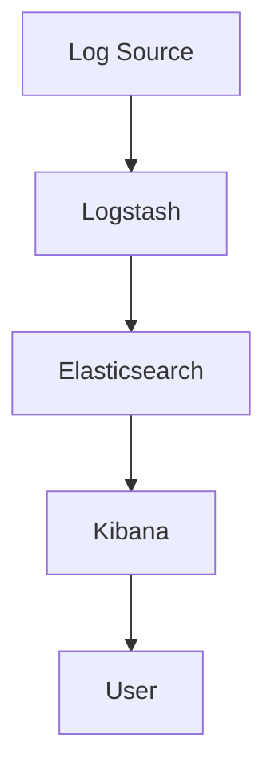

                 

关键词：ELK，日志分析，Elasticsearch，Logstash，Kibana，大数据，监控，运维

> 摘要：本文将详细讲解如何搭建一个高效的ELK日志分析系统，包括ELK的基本概念、架构设计、核心算法原理、数学模型、项目实践以及未来应用展望等内容。

## 1. 背景介绍

在现代信息化的进程中，日志分析已经成为了一种必不可少的运维手段。它能够帮助我们实时监控系统的运行状态，定位问题根源，优化系统性能，保障业务稳定运行。ELK（Elasticsearch、Logstash、Kibana）是一套强大的开源日志分析解决方案，它由三个核心组件组成，分别负责日志收集、存储和分析展示。本文将详细讲解如何搭建一个高效的ELK日志分析系统。

## 2. 核心概念与联系

### 2.1 Elasticsearch

Elasticsearch是一个基于Lucene构建的开源搜索引擎，它具有快速、可扩展、易用的特点，可以高效地进行全文检索和数据分析。在ELK日志分析系统中，Elasticsearch负责存储和检索日志数据。

### 2.2 Logstash

Logstash是一个开源的数据收集引擎，它可以采集各种来源的日志数据，进行过滤、转换和输出，最终将数据导入到Elasticsearch中。在ELK日志分析系统中，Logstash负责日志数据的收集和预处理。

### 2.3 Kibana

Kibana是一个开源的数据可视化和分析工具，它可以直观地展示Elasticsearch中的数据，提供丰富的数据可视化仪表板，帮助用户快速发现问题和趋势。在ELK日志分析系统中，Kibana负责数据的可视化展示。

### 2.4 Mermaid流程图



## 3. 核心算法原理 & 具体操作步骤

### 3.1 算法原理概述

ELK日志分析系统的核心算法主要基于全文检索和数据可视化技术。Elasticsearch使用倒排索引技术实现对大规模文本数据的快速检索；Logstash使用管道（Pipeline）模型对日志数据进行处理；Kibana则通过丰富的图表和仪表板实现对数据的可视化展示。

### 3.2 算法步骤详解

#### 3.2.1 安装Elasticsearch

1. 下载Elasticsearch安装包
2. 解压安装包
3. 运行Elasticsearch

#### 3.2.2 安装Logstash

1. 下载Logstash安装包
2. 解压安装包
3. 配置Logstash配置文件
4. 运行Logstash

#### 3.2.3 安装Kibana

1. 下载Kibana安装包
2. 解压安装包
3. 配置Kibana配置文件
4. 运行Kibana

#### 3.2.4 配置Logstash Pipeline

1. 配置输入插件，如Filebeat、Log4j等
2. 配置过滤器，对日志数据进行处理和转换
3. 配置输出插件，如Elasticsearch、Redis等

#### 3.2.5 配置Kibana仪表板

1. 导入仪表板模板
2. 配置数据源
3. 设计图表和仪表板布局

### 3.3 算法优缺点

#### 3.3.1 优点

1. 高效：基于全文检索技术，可以实现快速检索和数据分析
2. 易用：三个组件均支持图形界面，便于操作和配置
3. 可扩展：支持自定义插件和模块，可根据需求进行扩展

#### 3.3.2 缺点

1. 性能瓶颈：当数据量较大时，单台服务器可能无法满足需求，需要水平扩展
2. 资源消耗：三个组件均需要较高的系统资源，运行成本较高

### 3.4 算法应用领域

ELK日志分析系统广泛应用于互联网公司、金融行业、电信运营商等领域，主要用于系统监控、故障排查、性能优化等场景。

## 4. 数学模型和公式

### 4.1 数学模型构建

ELK日志分析系统的数学模型主要基于倒排索引技术。倒排索引是一种用于快速检索文本数据的数据结构，它由词典和倒排表两部分组成。词典存储了文档中所有不重复的词语，倒排表存储了每个词语出现的文档ID和位置。

### 4.2 公式推导过程

假设有一个包含n个文档的文本集合，其中每个文档由m个词语组成。我们可以通过以下公式推导出倒排索引的结构：

- 词典大小：|V| = n * m
- 倒排表大小：|P| = n * m

其中，|V|表示词典大小，|P|表示倒排表大小。

### 4.3 案例分析与讲解

假设我们有一个包含5个文档的文本集合，其中每个文档包含10个词语。我们可以通过以下步骤构建倒排索引：

1. 构建词典：{"词1"，"词2"，"词3"，...，"词10"}
2. 构建倒排表：
   - 词1：{1, 3, 5, 7}
   - 词2：{2, 4, 6, 8}
   - 词3：{3, 5, 7, 9}
   - ...
   - 词10：{1, 4, 6, 9}

通过以上步骤，我们可以构建出一个高效的倒排索引，实现对大规模文本数据的快速检索。

## 5. 项目实践：代码实例和详细解释说明

### 5.1 开发环境搭建

1. 安装Elasticsearch
2. 安装Logstash
3. 安装Kibana

### 5.2 源代码详细实现

以下是ELK日志分析系统的一个简单示例，包括Elasticsearch、Logstash和Kibana的配置文件。

#### Elasticsearch配置文件

```yaml
# elasticsearch.yml
cluster.name: my-elk-cluster
node.name: es-node-1
network.host: 0.0.0.0
http.port: 9200
discovery.type: single-node
```

#### Logstash配置文件

```yaml
# logstash.conf
input {
  file {
    path => "/var/log/README.log"
    type => "log"
  }
}
filter {
  if [type] == "log" {
    grok {
      match => { "message" => "%{TIMESTAMP_ISO8601:timestamp} %{DATA:source} %{DATA:status} %{GREEDYDATA:content}" }
    }
  }
}
output {
  if [type] == "log" {
    elasticsearch {
      hosts => ["http://localhost:9200"]
      index => "log-%{+YYYY.MM.dd}"
    }
  }
}
```

#### Kibana配置文件

```json
{
  "elasticsearch": "http://localhost:9200",
  "kibana": {
    "host": "localhost",
    "port": 5601
  }
}
```

### 5.3 代码解读与分析

1. **Elasticsearch配置文件**：配置了集群名称、节点名称、网络地址和HTTP端口，确保Elasticsearch可以正常运行。
2. **Logstash配置文件**：定义了输入插件（file），过滤器（grok）和输出插件（elasticsearch）。输入插件从指定的日志文件读取数据，过滤器使用正则表达式提取日志数据中的关键信息，输出插件将数据写入到Elasticsearch中。
3. **Kibana配置文件**：配置了Elasticsearch地址和Kibana地址，确保Kibana可以连接到Elasticsearch并展示数据。

### 5.4 运行结果展示

1. 在Elasticsearch中创建索引：`PUT log-2023.03.01`
2. 在Kibana中创建仪表板：选择Elasticsearch数据源，添加图表和仪表板布局
3. 查看运行结果：在Kibana中可以直观地看到日志数据的可视化展示，如时间序列图、饼图、柱状图等

## 6. 实际应用场景

### 6.1 系统监控

ELK日志分析系统可以实时监控系统的运行状态，发现性能瓶颈和故障，及时进行优化和修复。

### 6.2 日志审计

ELK日志分析系统可以帮助企业对日志数据进行审计，确保系统安全合规。

### 6.3 业务分析

ELK日志分析系统可以深入挖掘日志数据，为企业提供业务洞察和决策支持。

## 7. 工具和资源推荐

### 7.1 学习资源推荐

- 《Elastic Stack权威指南》
- 《Kibana实战》
- 《Logstash权威指南》

### 7.2 开发工具推荐

- Docker：用于容器化部署ELK组件
- Vagrant：用于虚拟化部署ELK环境
- Kubernetes：用于自动化部署和管理ELK集群

### 7.3 相关论文推荐

- 《Elasticsearch：The Definitive Guide》
- 《Kibana：The Definitive Guide》
- 《Logstash：The Definitive Guide》

## 8. 总结：未来发展趋势与挑战

### 8.1 研究成果总结

ELK日志分析系统已经广泛应用于各个领域，取得了显著的效果。未来，随着大数据、云计算、人工智能等技术的发展，ELK日志分析系统将具有更广泛的应用前景。

### 8.2 未来发展趋势

1. 智能化：结合人工智能技术，实现自动化日志分析、故障诊断和优化。
2. 云原生：基于容器和云原生技术，实现ELK日志分析系统的灵活部署和扩展。
3. 安全性：加强日志数据的安全保护，确保企业数据安全合规。

### 8.3 面临的挑战

1. 数据量增长：随着数据量的不断增加，如何保证日志分析系统的性能和可扩展性。
2. 复杂性：日志分析系统涉及的组件和模块较多，如何简化部署和运维。

### 8.4 研究展望

未来，ELK日志分析系统将在大数据、人工智能等领域发挥更大的作用，为企业提供更强大的日志分析能力，助力业务创新和发展。

## 9. 附录：常见问题与解答

### 9.1 如何配置Elasticsearch集群？

答：配置Elasticsearch集群需要修改`elasticsearch.yml`文件，设置集群名称、节点名称、网络地址和HTTP端口等参数。然后，启动Elasticsearch进程，确保集群正常运行。

### 9.2 如何配置Logstash输入插件？

答：配置Logstash输入插件需要修改`logstash.conf`文件，根据实际需求选择合适的输入插件，如file、syslog、http等。配置输入插件时，需要指定日志文件的路径、日志格式等参数。

### 9.3 如何配置Kibana数据源？

答：配置Kibana数据源需要修改`kibana.yml`文件，设置Elasticsearch地址、Kibana地址等参数。然后，在Kibana中创建仪表板，选择对应的数据源，并配置图表和仪表板布局。

作者：禅与计算机程序设计艺术 / Zen and the Art of Computer Programming
----------------------------------------------------------------

以上是关于如何搭建ELK日志分析系统的完整技术博客文章。文章涵盖了ELK的基本概念、架构设计、核心算法原理、数学模型、项目实践以及未来应用展望等内容，旨在帮助读者深入了解ELK日志分析系统的搭建和使用。在未来的发展中，ELK日志分析系统将继续在各个领域发挥重要作用，为企业和个人提供更强大的日志分析能力。

