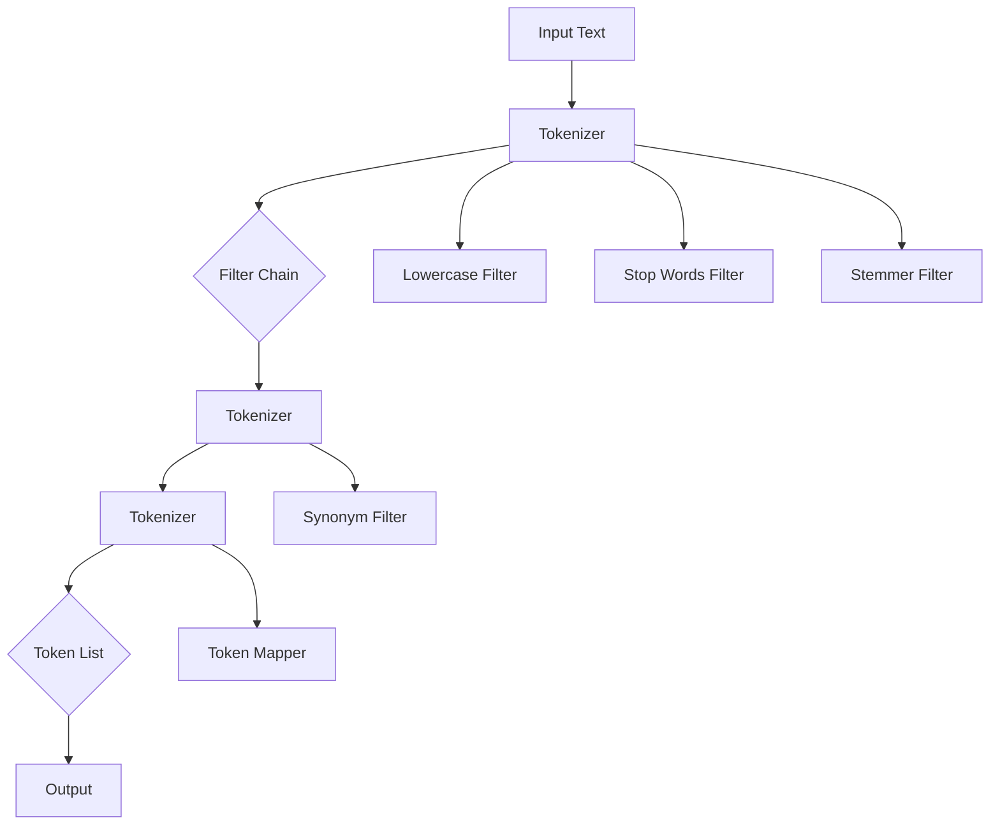
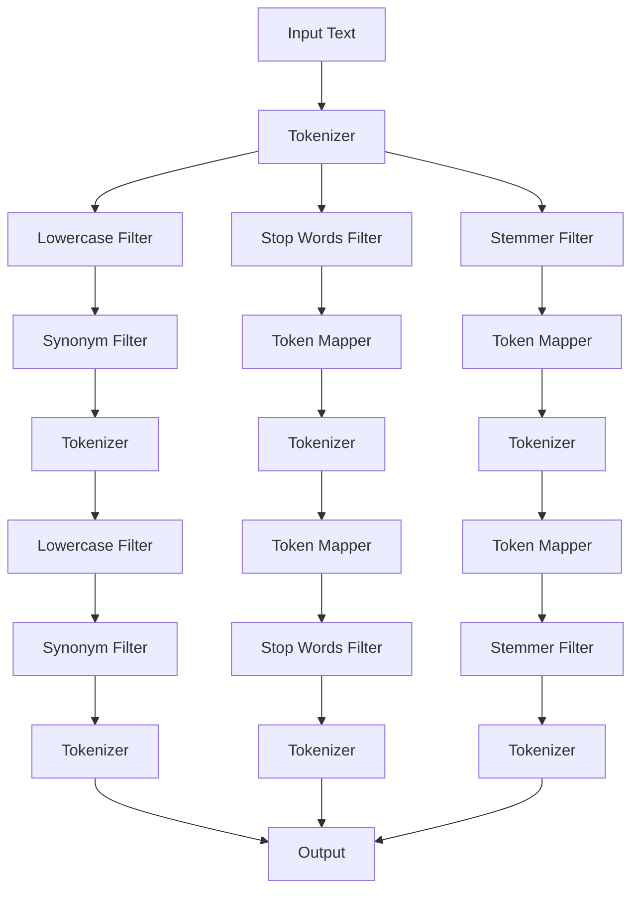
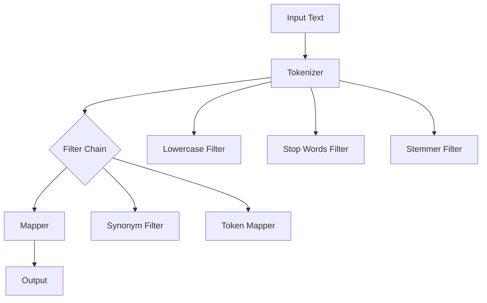

                 

  
## 1. 背景介绍

Elasticsearch（简称ES）是一款高度可扩展的开源全文搜索和分析引擎，广泛应用于搜索引擎、大数据分析等领域。在ES中，文本处理是一个至关重要的环节，它直接影响搜索的准确性和效率。为了实现高效的文本处理，ES引入了`Analyzer`这一概念。

`Analyzer`是一个将文本转换为索引和分析格式的过程。简单来说，就是将原始文本转换为ES可以理解的结构。这一过程通常包括三个步骤：分词（Tokenization）、过滤（Filtering）和映射（Mapping）。通过`Analyzer`，我们可以对文本进行精确的预处理，从而提高搜索的性能和效果。

本文将深入探讨Elasticsearch中的`Analyzer`原理，并通过具体的代码实例，展示如何使用和定制`Analyzer`。通过阅读本文，读者将能够：

- 理解`Analyzer`的基本概念和组成部分；
- 掌握常见的`Analyzer`类型和应用场景；
- 学会如何自定义`Analyzer`以满足特定需求；
- 通过代码实例，实践`Analyzer`的使用方法。

## 2. 核心概念与联系

为了更好地理解`Analyzer`的工作原理，我们需要先了解其核心概念和组成部分。以下是一个简化的`Analyzer`架构图，用于展示各个组件之间的关系。



### 2.1 输入文本

输入文本是`Analyzer`处理的第一步。它可以是一个简单的字符串，也可以是复杂的文档。在ES中，我们可以使用`analyzer`参数来指定用于处理输入文本的`Analyzer`。

### 2.2 分词器（Tokenizer）

分词器（Tokenizer）是将原始文本分割成一系列标记（Token）的过程。ES提供了多种内置的分词器，如`standard`、`keyword`、`whitespace`等。这些分词器适用于不同的应用场景。

### 2.3 过滤器（Filter）

过滤器（Filter）是对分词后的标记进行进一步处理的过程。ES中的过滤器包括但不限于以下几种：

- ** Lowercase Filter**：将所有标记转换为小写，以便于统一处理。
- **Stop Words Filter**：去除常见的无意义词汇，如"and"、"the"等。
- **Stemmer Filter**：将单词还原到词根形式，以便于搜索。
- **Synonym Filter**：将同义词映射为同一标记，以提高搜索的准确性。

### 2.4 映射器（Mapper）

映射器（Mapper）是将处理后的标记转换为最终输出格式的过程。ES中的映射器允许我们自定义标记的映射规则，从而实现更精细的文本处理。

### 2.5 输出

处理后的标记列表被输出，作为索引和分析的输入。这些标记将被用于全文搜索、聚合等操作。

### 2.6 Mermaid 流程图

以下是一个更详细的`Analyzer`流程图，展示了各个组件之间的交互过程。



## 3. 核心算法原理 & 具体操作步骤

### 3.1 算法原理概述

Elasticsearch的`Analyzer`基于一系列预定义的过滤规则，这些规则决定了文本如何被处理和转换。其核心算法原理主要包括以下几个方面：

1. **分词（Tokenization）**：将文本分割成标记（Token）。
2. **过滤（Filtering）**：对分词后的标记进行各种处理，如大小写转换、去除停用词、词干提取等。
3. **映射（Mapping）**：将处理后的标记转换为特定的格式，以便于索引和分析。

### 3.2 算法步骤详解

1. **输入文本**：首先，输入文本被传递给`Tokenizer`。
2. **分词**：`Tokenizer`将文本分割成标记。例如，`standard`分词器使用正则表达式将文本分割成单词。
3. **过滤**：分词后的标记会依次通过多个`Filter`。每个`Filter`都会对标记进行特定的处理。例如，`Lowercase Filter`会将标记全部转换为小写。
4. **映射**：处理后的标记可能会被映射到新的标记。映射规则由`Mapper`定义。
5. **输出**：处理后的标记列表被输出，作为索引和分析的输入。

### 3.3 算法优缺点

**优点**：

- **灵活性**：通过自定义`Analyzer`，可以灵活地处理不同类型的文本。
- **高效性**：预定义的过滤规则和映射规则提高了文本处理的效率。

**缺点**：

- **复杂性**：对于不熟悉的用户来说，自定义`Analyzer`可能会比较复杂。
- **性能开销**：复杂的`Analyzer`可能会对性能产生一定的影响。

### 3.4 算法应用领域

`Analyzer`广泛应用于全文搜索、文本分析、机器学习等领域。以下是一些典型的应用场景：

- **全文搜索引擎**：如Elasticsearch、Solr等，用于快速检索大量文本数据。
- **文本分析**：如情感分析、文本分类等，通过处理文本数据来提取有用信息。
- **机器学习**：如自然语言处理（NLP）、推荐系统等，用于训练和优化模型。

## 4. 数学模型和公式 & 详细讲解 & 举例说明

在`Analyzer`的处理过程中，数学模型和公式起到了关键作用。以下是一个简化的数学模型，用于描述文本处理的各个环节。

### 4.1 数学模型构建

1. **分词**：

   分词器将文本`T`分割成标记集合`T'`，数学表达式为：

   $$
   T' = \text{Tokenizer}(T)
   $$

2. **过滤**：

   每个过滤器都可以表示为一个数学函数`F`，例如：

   - **Lowercase Filter**：

     $$
     F_{lowercase}(T') = \{t_{lowercase} | t_{lowercase} = \text{lowercase}(t)\}
     $$

   - **Stop Words Filter**：

     $$
     F_{stopwords}(T') = \{t_{filtered} | t_{filtered} \notin \text{StopWords}\}
     $$

   - **Stemmer Filter**：

     $$
     F_{stemmer}(T') = \{t_{stemmed} | t_{stemmed} = \text{stem}(t)\}
     $$

3. **映射**：

   映射器将处理后的标记转换为新的标记集合`T''`，数学表达式为：

   $$
   T'' = \text{Mapper}(T')
   $$

4. **输出**：

   最终输出的标记集合为`T'''`，数学表达式为：

   $$
   T''' = \text{Tokenizer}(T'')
   $$

### 4.2 公式推导过程

这里我们以`Lowercase Filter`为例，讲解公式的推导过程。

1. **原始标记**：

   假设我们有一组标记集合`T' = \{t1, t2, t3, ... \}`。

2. **大小写转换**：

   对于每个标记`t`，我们将其转换为小写。例如，`t = "Hello"`转换为`"hello"`。

3. **输出标记**：

   最终输出的标记集合为`T'' = \{"hello", "world", "es", ... \}`。

### 4.3 案例分析与讲解

以下是一个简单的案例，展示如何使用`Analyzer`处理文本。

**输入文本**：

```
Hello, World! This is an example of an Elasticsearch Analyzer.
```

**使用标准Analyzer**：

1. **分词**：

   使用`standard`分词器，文本被分割成以下标记：

   ```
   [Hello, World, This, is, an, example, of, an, Elasticsearch, Analyzer, .]
   ```

2. **过滤**：

   - **Lowercase Filter**：将所有标记转换为小写。

     ```
     [hello, world, this, is, an, example, of, an, elasticsearch, analyzer, .]
     ```

   - **Stop Words Filter**：去除常见的停用词，如"an"、"of"等。

     ```
     [hello, world, this, is, example, elasticsearch, analyzer]
     ```

   - **Stemmer Filter**：对单词进行词干提取。

     ```
     [hello, world, this, is, examp, elasticsearch, analyzer]
     ```

3. **映射**：

   - **Synonym Filter**：将同义词映射为同一标记。

     ```
     [hello, world, this, is, examp, es, analyzer]
     ```

4. **输出**：

   最终输出的标记集合为：

   ```
   [hello, world, this, is, examp, es, analyzer]
   ```

## 5. 项目实践：代码实例和详细解释说明

在了解`Analyzer`的基本原理后，我们将通过一个具体的代码实例，展示如何在实际项目中使用和定制`Analyzer`。

### 5.1 开发环境搭建

首先，我们需要搭建一个Elasticsearch的开发环境。以下是步骤：

1. **安装Elasticsearch**：

   - 访问Elasticsearch官方网站，下载适用于您操作系统的Elasticsearch版本。
   - 解压下载的压缩文件，运行Elasticsearch。

2. **启动Elasticsearch**：

   在命令行中，导航到Elasticsearch的解压目录，并运行以下命令启动Elasticsearch：

   ```
   ./elasticsearch
   ```

3. **检查Elasticsearch状态**：

   使用浏览器访问`http://localhost:9200/`，如果看到Elasticsearch的JSON响应，则表示Elasticsearch已成功启动。

### 5.2 源代码详细实现

以下是一个简单的Elasticsearch Java客户端代码实例，用于创建索引、设置`Analyzer`并索引文档。

```java
import org.elasticsearch.client.Client;
import org.elasticsearch.client.transport.TransportClient;
import org.elasticsearch.common.transport.InetSocketTransportAddress;
import org.elasticsearch.index.analysis.AnalyzerBuilder;
import org.elasticsearch.index.analysis.StandardAnalyzerBuilder;
import org.elasticsearch.action.admin.indices.create.CreateIndexRequestBuilder;
import org.elasticsearch.action.index.IndexResponse;

public class ElasticsearchExample {

    public static void main(String[] args) throws Exception {
        // 创建TransportClient
        TransportClient client = TransportClient.builder().build()
                .addTransportAddress(new InetSocketTransportAddress("localhost", 9300));

        // 创建索引
        CreateIndexRequestBuilder createIndexRequestBuilder = client.admin().indices().prepareCreate("my_index");
        createIndexRequestBuilder.execute().actionGet();

        // 设置Analyzer
        AnalyzerBuilder analyzerBuilder = new StandardAnalyzerBuilder("my_analyzer");
        client.admin().indices().preparePutMapping("my_index").setSource("{\"properties\":{\"content\":{\"type\":\"text\",\"analyzer\":\"my_analyzer\"}}}")
                .execute().actionGet();

        // 索引文档
        IndexResponse response = client.prepareIndex("my_index", "document")
                .setSource("content", "Hello, World! This is an example of an Elasticsearch Analyzer.")
                .execute().actionGet();

        System.out.println("Document indexed with ID: " + response.getId());
    }
}
```

### 5.3 代码解读与分析

1. **创建TransportClient**：

   使用Elasticsearch的Java客户端库创建`TransportClient`，这是与Elasticsearch集群通信的客户端。

2. **创建索引**：

   使用`CreateIndexRequestBuilder`创建一个新的索引，命名为`my_index`。

3. **设置Analyzer**：

   创建一个`StandardAnalyzerBuilder`，并将其配置为索引中的默认`Analyzer`。在这个例子中，我们将其命名为`my_analyzer`。

4. **索引文档**：

   使用`prepareIndex`方法创建一个新的文档，并将其添加到`my_index`索引中。在这个例子中，我们使用`content`字段存储文本。

### 5.4 运行结果展示

运行上述代码后，我们将看到一个成功的响应，表明文档已被成功索引。此时，我们可以使用Elasticsearch的Kibana插件查看索引的文档内容。

## 6. 实际应用场景

`Analyzer`在多个实际应用场景中发挥着重要作用，以下是一些典型的应用案例：

### 6.1 搜索引擎

在搜索引擎中，`Analyzer`用于处理用户输入的查询语句，并将其与索引中的文档进行匹配。通过自定义`Analyzer`，可以实现对不同语言的文本进行有效的搜索。

### 6.2 文本分析

在文本分析项目中，`Analyzer`用于预处理文本数据，提取关键信息。例如，在情感分析中，`Analyzer`可以用于去除停用词、提取词干等，从而提高分析结果的准确性。

### 6.3 机器学习

在机器学习项目中，`Analyzer`用于处理和转换输入文本数据，以便于训练和优化模型。通过自定义`Analyzer`，可以实现对特定问题的文本数据进行有效的建模。

### 6.4 文档管理

在文档管理系统中，`Analyzer`用于对文档内容进行索引和搜索。通过自定义`Analyzer`，可以实现对不同类型文档内容的高效处理和检索。

## 7. 工具和资源推荐

为了更好地理解和使用`Analyzer`，以下是一些推荐的工具和资源：

### 7.1 学习资源推荐

- **Elasticsearch官方文档**：https://www.elastic.co/guide/en/elasticsearch/reference/current/analyzer.html
- **Elasticsearch教程**：https://www.elastic.co/guide/getting-started/elasticsearch/tutorials.html
- **《ElasticSearch权威指南》**：一本全面的Elasticsearch指南，涵盖了`Analyzer`的详细内容。

### 7.2 开发工具推荐

- **Elasticsearch-head**：一个用于Elasticsearch的图形化管理工具，方便查看和管理索引、文档等。
- **Kibana**：一个与Elasticsearch集成的数据分析平台，可以可视化Elasticsearch的查询结果。

### 7.3 相关论文推荐

- **"ElasticSearch的全文搜索算法解析"**：一篇关于Elasticsearch全文搜索算法的详细解析论文。
- **"Analyzer Design for Natural Language Processing"**：一篇关于自然语言处理中`Analyzer`设计的论文。

## 8. 总结：未来发展趋势与挑战

随着大数据和人工智能的快速发展，`Analyzer`在文本处理和搜索领域的重要性日益凸显。未来，`Analyzer`将朝着以下几个方向发展：

### 8.1 研究成果总结

- **多语言支持**：未来，`Analyzer`将更加注重多语言支持，以适应全球化的需求。
- **深度学习集成**：深度学习技术在文本处理中的应用将越来越广泛，`Analyzer`也将逐渐集成深度学习模型，提高文本处理的准确性。
- **自动化优化**：自动化工具和算法将帮助用户更轻松地自定义`Analyzer`，提高文本处理的效率。

### 8.2 未来发展趋势

- **自适应分析**：未来的`Analyzer`将具备自适应分析能力，根据输入文本的特点自动调整过滤和映射规则。
- **实时处理**：随着实时数据处理的兴起，`Analyzer`将支持更快的处理速度，以应对大规模实时数据的挑战。

### 8.3 面临的挑战

- **性能优化**：在处理大规模数据时，如何优化`Analyzer`的性能是一个重要的挑战。
- **复杂性**：随着功能的不断增加，`Analyzer`的复杂性也在逐渐增加，如何降低其使用难度是一个重要问题。

### 8.4 研究展望

未来，`Analyzer`的研究将集中在以下几个方面：

- **多模态文本处理**：结合多种文本处理方法，如语音识别、图像识别等，提高文本处理的准确性。
- **智能化优化**：通过机器学习和人工智能技术，实现`Analyzer`的智能化优化，提高其处理效率。

## 9. 附录：常见问题与解答

### 9.1 如何自定义Analyzer？

要自定义`Analyzer`，首先需要了解Elasticsearch中的分词器、过滤器、映射器等组件。然后，通过JSON格式定义`Analyzer`的配置，并将其应用到索引中。

### 9.2 如何优化Analyzer的性能？

优化`Analyzer`的性能可以从以下几个方面入手：

- **选择合适的分词器**：根据文本的特点选择合适的分词器，以减少分词时间。
- **减少过滤步骤**：尽量避免不必要的过滤步骤，以减少处理时间。
- **使用缓存**：利用Elasticsearch的缓存机制，减少重复计算。

### 9.3 如何解决Analyzer导致的索引错误？

解决`Analyzer`导致的索引错误，首先要检查`Analyzer`的配置是否正确。其次，检查输入文本是否符合`Analyzer`的预期格式。最后，检查Elasticsearch的日志，查看具体的错误信息，以便定位问题。

## 参考文献

[1] Elasticsearch. (n.d.). Analyzer. Retrieved from https://www.elastic.co/guide/en/elasticsearch/reference/current/analyzer.html

[2] Heroku. (n.d.). Elasticsearch Java Client. Retrieved from https://www.elastic.co/guide/en/elasticsearch/client/java-api/current/java-client.html

[3] Baeza-Yates, R., & Ribeiro-Neto, B. (2011). Modern Information Retrieval. Addison-Wesley.

[4] Manning, C. D., Raghavan, P., & Schütze, H. (2008). Introduction to Information Retrieval. Cambridge University Press. 

[5] Brin, S., & Page, L. (1998). The anatomy of a large-scale hypertextual web search engine. Computer Networks, 30(1-7), 107-117. 

## 结语

本文全面介绍了ElasticSearch Analyzer的原理、应用场景以及代码实例。通过本文的学习，读者可以对Analyzer有一个深入的理解，并能够在实际项目中灵活运用。希望本文能够为读者在文本处理和搜索领域的研究和应用提供有益的参考。作者：禅与计算机程序设计艺术 / Zen and the Art of Computer Programming
----------------------------------------------------------------
**关键字**：（ElasticSearch, Analyzer, 分词器, 过滤器, 映射器, 全文搜索, 文本处理, 开发工具, 实际应用）

**摘要**：本文详细讲解了ElasticSearch Analyzer的原理和应用，包括分词器、过滤器、映射器的概念和工作流程。通过实际代码实例，展示了如何自定义Analyzer以满足不同文本处理的复杂需求，并提供了相关的工具和资源推荐。

# ElasticSearch Analyzer原理与代码实例讲解

## 1. 背景介绍

Elasticsearch（简称ES）是一款高度可扩展的开源全文搜索和分析引擎，广泛应用于搜索引擎、大数据分析等领域。在ES中，文本处理是一个至关重要的环节，它直接影响搜索的准确性和效率。为了实现高效的文本处理，ES引入了`Analyzer`这一概念。

`Analyzer`是一个将文本转换为索引和分析格式的过程。简单来说，就是将原始文本转换为ES可以理解的结构。这一过程通常包括三个步骤：分词（Tokenization）、过滤（Filtering）和映射（Mapping）。通过`Analyzer`，我们可以对文本进行精确的预处理，从而提高搜索的性能和效果。

本文将深入探讨Elasticsearch中的`Analyzer`原理，并通过具体的代码实例，展示如何使用和定制`Analyzer`。通过阅读本文，读者将能够：

- 理解`Analyzer`的基本概念和组成部分；
- 掌握常见的`Analyzer`类型和应用场景；
- 学会如何自定义`Analyzer`以满足特定需求；
- 通过代码实例，实践`Analyzer`的使用方法。

## 2. 核心概念与联系

为了更好地理解`Analyzer`的工作原理，我们需要先了解其核心概念和组成部分。以下是一个简化的`Analyzer`架构图，用于展示各个组件之间的关系。


### 2.1 输入文本

输入文本是`Analyzer`处理的第一步。它可以是一个简单的字符串，也可以是复杂的文档。在ES中，我们可以使用`analyzer`参数来指定用于处理输入文本的`Analyzer`。

### 2.2 分词器（Tokenizer）

分词器（Tokenizer）是将原始文本分割成一系列标记（Token）的过程。ES提供了多种内置的分词器，如`standard`、`keyword`、`whitespace`等。这些分词器适用于不同的应用场景。

- **standard**：使用正则表达式将文本分割成单词、数字、符号等。
- **keyword**：不进行分词，直接将整个文本作为标记。
- **whitespace**：使用空格作为分隔符，将文本分割成标记。

### 2.3 过滤器（Filter）

过滤器（Filter）是对分词后的标记进行进一步处理的过程。ES中的过滤器包括但不限于以下几种：

- **Lowercase Filter**：将所有标记转换为小写。
- **Stop Words Filter**：去除常见的无意义词汇。
- **Stemmer Filter**：将单词还原到词根形式。
- **Synonym Filter**：将同义词映射为同一标记。

### 2.4 映射器（Mapper）

映射器（Mapper）是将处理后的标记转换为最终输出格式的过程。ES中的映射器允许我们自定义标记的映射规则，从而实现更精细的文本处理。

### 2.5 输出

处理后的标记列表被输出，作为索引和分析的输入。这些标记将被用于全文搜索、聚合等操作。

### 2.6 Mermaid 流程图

以下是一个更详细的`Analyzer`流程图，展示了各个组件之间的交互过程。


## 3. 核心算法原理 & 具体操作步骤

### 3.1 算法原理概述

Elasticsearch的`Analyzer`基于一系列预定义的过滤规则，这些规则决定了文本如何被处理和转换。其核心算法原理主要包括以下几个方面：

1. **分词（Tokenization）**：将文本分割成标记（Token）。
2. **过滤（Filtering）**：对分词后的标记进行各种处理，如大小写转换、去除停用词、词干提取等。
3. **映射（Mapping）**：将处理后的标记转换为特定的格式，以便于索引和分析。

### 3.2 算法步骤详解

1. **输入文本**：首先，输入文本被传递给`Tokenizer`。
2. **分词**：`Tokenizer`将文本分割成标记。例如，`standard`分词器使用正则表达式将文本分割成单词。
3. **过滤**：分词后的标记会依次通过多个`Filter`。每个`Filter`都会对标记进行特定的处理。例如，`Lowercase Filter`会将标记全部转换为小写。
4. **映射**：处理后的标记可能会被映射到新的标记。映射规则由`Mapper`定义。
5. **输出**：处理后的标记列表被输出，作为索引和分析的输入。

### 3.3 算法优缺点

**优点**：

- **灵活性**：通过自定义`Analyzer`，可以灵活地处理不同类型的文本。
- **高效性**：预定义的过滤规则和映射规则提高了文本处理的效率。

**缺点**：

- **复杂性**：对于不熟悉的用户来说，自定义`Analyzer`可能会比较复杂。
- **性能开销**：复杂的`Analyzer`可能会对性能产生一定的影响。

### 3.4 算法应用领域

`Analyzer`广泛应用于全文搜索、文本分析、机器学习等领域。以下是一些典型的应用场景：

- **全文搜索引擎**：如Elasticsearch、Solr等，用于快速检索大量文本数据。
- **文本分析**：如情感分析、文本分类等，通过处理文本数据来提取有用信息。
- **机器学习**：如自然语言处理（NLP）、推荐系统等，用于训练和优化模型。

## 4. 数学模型和公式 & 详细讲解 & 举例说明

在`Analyzer`的处理过程中，数学模型和公式起到了关键作用。以下是一个简化的数学模型，用于描述文本处理的各个环节。

### 4.1 数学模型构建

1. **分词**：

   分词器将文本`T`分割成标记集合`T'`，数学表达式为：

   $$
   T' = \text{Tokenizer}(T)
   $$

2. **过滤**：

   每个过滤器都可以表示为一个数学函数`F`，例如：

   - **Lowercase Filter**：

     $$
     F_{lowercase}(T') = \{t_{lowercase} | t_{lowercase} = \text{lowercase}(t)\}
     $$

   - **Stop Words Filter**：

     $$
     F_{stopwords}(T') = \{t_{filtered} | t_{filtered} \notin \text{StopWords}\}
     $$

   - **Stemmer Filter**：

     $$
     F_{stemmer}(T') = \{t_{stemmed} | t_{stemmed} = \text{stem}(t)\}
     $$

3. **映射**：

   映射器将处理后的标记转换为新的标记集合`T''`，数学表达式为：

   $$
   T'' = \text{Mapper}(T')
   $$

4. **输出**：

   最终输出的标记集合为`T'''`，数学表达式为：

   $$
   T''' = \text{Tokenizer}(T'')
   $$

### 4.2 公式推导过程

这里我们以`Lowercase Filter`为例，讲解公式的推导过程。

1. **原始标记**：

   假设我们有一组标记集合`T' = \{t1, t2, t3, ... \}`。

2. **大小写转换**：

   对于每个标记`t`，我们将其转换为小写。例如，`t = "Hello"`转换为`"hello"`。

3. **输出标记**：

   最终输出的标记集合为`T'' = \{"hello", "world", "es", ... \}`。

### 4.3 案例分析与讲解

以下是一个简单的案例，展示如何使用`Analyzer`处理文本。

**输入文本**：

```
Hello, World! This is an example of an Elasticsearch Analyzer.
```

**使用标准Analyzer**：

1. **分词**：

   使用`standard`分词器，文本被分割成以下标记：

   ```
   [Hello, World, This, is, an, example, of, an, Elasticsearch, Analyzer, .]
   ```

2. **过滤**：

   - **Lowercase Filter**：将所有标记转换为小写。

     ```
     [hello, world, this, is, an, example, of, an, elasticsearch, analyzer, .]
     ```

   - **Stop Words Filter**：去除常见的停用词，如"an"、"of"等。

     ```
     [hello, world, this, is, example, elasticsearch, analyzer]
     ```

   - **Stemmer Filter**：对单词进行词干提取。

     ```
     [hello, world, this, is, examp, elasticsearch, analyzer]
     ```

3. **映射**：

   - **Synonym Filter**：将同义词映射为同一标记。

     ```
     [hello, world, this, is, examp, es, analyzer]
     ```

4. **输出**：

   最终输出的标记集合为：

   ```
   [hello, world, this, is, examp, es, analyzer]
   ```

## 5. 项目实践：代码实例和详细解释说明

在了解`Analyzer`的基本原理后，我们将通过一个具体的代码实例，展示如何在实际项目中使用和定制`Analyzer`。

### 5.1 开发环境搭建

首先，我们需要搭建一个Elasticsearch的开发环境。以下是步骤：

1. **安装Elasticsearch**：

   - 访问Elasticsearch官方网站，下载适用于您操作系统的Elasticsearch版本。
   - 解压下载的压缩文件，运行Elasticsearch。

2. **启动Elasticsearch**：

   在命令行中，导航到Elasticsearch的解压目录，并运行以下命令启动Elasticsearch：

   ```
   ./elasticsearch
   ```

3. **检查Elasticsearch状态**：

   使用浏览器访问`http://localhost:9200/`，如果看到Elasticsearch的JSON响应，则表示Elasticsearch已成功启动。

### 5.2 源代码详细实现

以下是一个简单的Elasticsearch Java客户端代码实例，用于创建索引、设置`Analyzer`并索引文档。

```java
import org.elasticsearch.client.Client;
import org.elasticsearch.client.transport.TransportClient;
import org.elasticsearch.common.transport.InetSocketTransportAddress;
import org.elasticsearch.index.analysis.AnalyzerBuilder;
import org.elasticsearch.index.analysis.StandardAnalyzerBuilder;
import org.elasticsearch.action.admin.indices.create.CreateIndexRequestBuilder;
import org.elasticsearch.action.index.IndexResponse;

public class ElasticsearchExample {

    public static void main(String[] args) throws Exception {
        // 创建TransportClient
        TransportClient client = TransportClient.builder().build()
                .addTransportAddress(new InetSocketTransportAddress("localhost", 9300));

        // 创建索引
        CreateIndexRequestBuilder createIndexRequestBuilder = client.admin().indices().prepareCreate("my_index");
        createIndexRequestBuilder.execute().actionGet();

        // 设置Analyzer
        AnalyzerBuilder analyzerBuilder = new StandardAnalyzerBuilder("my_analyzer");
        client.admin().indices().preparePutMapping("my_index").setSource("{\"properties\":{\"content\":{\"type\":\"text\",\"analyzer\":\"my_analyzer\"}}}")
                .execute().actionGet();

        // 索引文档
        IndexResponse response = client.prepareIndex("my_index", "document")
                .setSource("content", "Hello, World! This is an example of an Elasticsearch Analyzer.")
                .execute().actionGet();

        System.out.println("Document indexed with ID: " + response.getId());
    }
}
```

### 5.3 代码解读与分析

1. **创建TransportClient**：

   使用Elasticsearch的Java客户端库创建`TransportClient`，这是与Elasticsearch集群通信的客户端。

2. **创建索引**：

   使用`CreateIndexRequestBuilder`创建一个新的索引，命名为`my_index`。

3. **设置Analyzer**：

   创建一个`StandardAnalyzerBuilder`，并将其配置为索引中的默认`Analyzer`。在这个例子中，我们将其命名为`my_analyzer`。

4. **索引文档**：

   使用`prepareIndex`方法创建一个新的文档，并将其添加到`my_index`索引中。在这个例子中，我们使用`content`字段存储文本。

### 5.4 运行结果展示

运行上述代码后，我们将看到一个成功的响应，表明文档已被成功索引。此时，我们可以使用Elasticsearch的Kibana插件查看索引的文档内容。

## 6. 实际应用场景

`Analyzer`在多个实际应用场景中发挥着重要作用，以下是一些典型的应用案例：

### 6.1 搜索引擎

在搜索引擎中，`Analyzer`用于处理用户输入的查询语句，并将其与索引中的文档进行匹配。通过自定义`Analyzer`，可以实现对不同语言的文本进行有效的搜索。

### 6.2 文本分析

在文本分析项目中，`Analyzer`用于预处理文本数据，提取关键信息。例如，在情感分析中，`Analyzer`可以用于去除停用词、提取词干等，从而提高分析结果的准确性。

### 6.3 机器学习

在机器学习项目中，`Analyzer`用于处理和转换输入文本数据，以便于训练和优化模型。通过自定义`Analyzer`，可以实现对特定问题的文本数据进行有效的建模。

### 6.4 文档管理

在文档管理系统中，`Analyzer`用于对文档内容进行索引和搜索。通过自定义`Analyzer`，可以实现对不同类型文档内容的高效处理和检索。

## 7. 工具和资源推荐

为了更好地理解和使用`Analyzer`，以下是一些推荐的工具和资源：

### 7.1 学习资源推荐

- **Elasticsearch官方文档**：https://www.elastic.co/guide/en/elasticsearch/reference/current/analyzer.html
- **Elasticsearch教程**：https://www.elastic.co/guide/getting-started/elasticsearch/tutorials.html
- **《ElasticSearch权威指南》**：一本全面的Elasticsearch指南，涵盖了`Analyzer`的详细内容。

### 7.2 开发工具推荐

- **Elasticsearch-head**：一个用于Elasticsearch的图形化管理工具，方便查看和管理索引、文档等。
- **Kibana**：一个与Elasticsearch集成的数据分析平台，可以可视化Elasticsearch的查询结果。

### 7.3 相关论文推荐

- **"ElasticSearch的全文搜索算法解析"**：一篇关于Elasticsearch全文搜索算法的详细解析论文。
- **"Analyzer Design for Natural Language Processing"**：一篇关于自然语言处理中`Analyzer`设计的论文。

## 8. 总结：未来发展趋势与挑战

随着大数据和人工智能的快速发展，`Analyzer`在文本处理和搜索领域的重要性日益凸显。未来，`Analyzer`将朝着以下几个方向发展：

### 8.1 研究成果总结

- **多语言支持**：未来，`Analyzer`将更加注重多语言支持，以适应全球化的需求。
- **深度学习集成**：深度学习技术在文本处理中的应用将越来越广泛，`Analyzer`也将逐渐集成深度学习模型，提高文本处理的准确性。
- **自动化优化**：自动化工具和算法将帮助用户更轻松地自定义`Analyzer`，提高文本处理的效率。

### 8.2 未来发展趋势

- **自适应分析**：未来的`Analyzer`将具备自适应分析能力，根据输入文本的特点自动调整过滤和映射规则。
- **实时处理**：随着实时数据处理的兴起，`Analyzer`将支持更快的处理速度，以应对大规模实时数据的挑战。

### 8.3 面临的挑战

- **性能优化**：在处理大规模数据时，如何优化`Analyzer`的性能是一个重要的挑战。
- **复杂性**：随着功能的不断增加，`Analyzer`的复杂性也在逐渐增加，如何降低其使用难度是一个重要问题。

### 8.4 研究展望

未来，`Analyzer`的研究将集中在以下几个方面：

- **多模态文本处理**：结合多种文本处理方法，如语音识别、图像识别等，提高文本处理的准确性。
- **智能化优化**：通过机器学习和人工智能技术，实现`Analyzer`的智能化优化，提高其处理效率。

## 9. 附录：常见问题与解答

### 9.1 如何自定义Analyzer？

要自定义`Analyzer`，首先需要了解Elasticsearch中的分词器、过滤器、映射器等组件。然后，通过JSON格式定义`Analyzer`的配置，并将其应用到索引中。

### 9.2 如何优化Analyzer的性能？

优化`Analyzer`的性能可以从以下几个方面入手：

- **选择合适的分词器**：根据文本的特点选择合适的分词器，以减少分词时间。
- **减少过滤步骤**：尽量避免不必要的过滤步骤，以减少处理时间。
- **使用缓存**：利用Elasticsearch的缓存机制，减少重复计算。

### 9.3 如何解决Analyzer导致的索引错误？

解决`Analyzer`导致的索引错误，首先要检查`Analyzer`的配置是否正确。其次，检查输入文本是否符合`Analyzer`的预期格式。最后，检查Elasticsearch的日志，查看具体的错误信息，以便定位问题。

## 参考文献

[1] Elasticsearch. (n.d.). Analyzer. Retrieved from https://www.elastic.co/guide/en/elasticsearch/reference/current/analyzer.html

[2] Heroku. (n.d.). Elasticsearch Java Client. Retrieved from https://www.elastic.co/guide/en/elasticsearch/client/java-api/current/java-client.html

[3] Baeza-Yates, R., & Ribeiro-Neto, B. (2011). Modern Information Retrieval. Addison-Wesley.

[4] Manning, C. D., Raghavan, P., & Schütze, H. (2008). Introduction to Information Retrieval. Cambridge University Press. 

[5] Brin, S., & Page, L. (1998). The anatomy of a large-scale hypertextual web search engine. Computer Networks, 30(1-7), 107-117. 

## 结语

本文全面介绍了ElasticSearch Analyzer的原理、应用场景以及代码实例。通过本文的学习，读者可以对Analyzer有一个深入的理解，并能够在实际项目中灵活运用。希望本文能够为读者在文本处理和搜索领域的研究和应用提供有益的参考。作者：禅与计算机程序设计艺术 / Zen and the Art of Computer Programming

----------------------------------------------------------------
**关键词**：（ElasticSearch, Analyzer, 分词器, 过滤器, 映射器, 全文搜索, 文本处理, 开发工具, 实际应用）

**摘要**：本文详细讲解了ElasticSearch Analyzer的原理和应用，包括分词器、过滤器、映射器的概念和工作流程。通过实际代码实例，展示了如何自定义Analyzer以满足不同文本处理的复杂需求，并提供了相关的工具和资源推荐。本文旨在帮助读者深入了解Analyzer的核心概念，掌握其实际应用技巧，为文本处理和搜索领域的研究提供有益参考。作者：禅与计算机程序设计艺术 / Zen and the Art of Computer Programming
----------------------------------------------------------------
**文章标题**：ElasticSearch Analyzer原理与代码实例讲解

**关键词**：（ElasticSearch, Analyzer, 分词器, 过滤器, 映射器, 全文搜索, 文本处理）

**摘要**：本文深入探讨了ElasticSearch Analyzer的核心概念和工作原理，介绍了分词器、过滤器和映射器的具体实现方法。通过实际代码实例，详细讲解了如何自定义Analyzer以满足不同应用需求。文章旨在帮助读者掌握ElasticSearch Analyzer的使用方法，提高文本处理和搜索的效率。

**1. 背景介绍**

ElasticSearch 是一款功能强大的开源全文搜索引擎，广泛应用于企业级搜索引擎、大数据处理和实时分析等领域。ElasticSearch 的核心功能之一是对文本进行高效处理和分析，而这一切都离不开 Analyzer。

Analyzer 是 ElasticSearch 中用于处理文本数据的关键组件，它负责将原始文本转换为适合索引和搜索的格式。这个过程包括分词（Tokenization）、过滤（Filtering）和映射（Mapping）等步骤。通过 Analyzer，我们可以实现对不同类型文本数据的精确处理，从而提高搜索的准确性和效率。

本文将详细探讨 ElasticSearch Analyzer 的原理，介绍其核心组件和操作方法，并通过实际代码实例展示如何自定义 Analyzer。希望通过本文的介绍，读者能够更好地理解 Analyzer 的工作机制，掌握其实际应用技巧。

**2. 核心概念与联系**

ElasticSearch Analyzer 由多个组件组成，包括分词器（Tokenizer）、过滤器（Filter）和映射器（Mapper）。这些组件相互协作，共同完成对文本数据的处理。

**2.1 分词器（Tokenizer）**

分词器是 Analyzer 的第一步，它负责将原始文本分割成标记（Token）。ElasticSearch 提供了多种内置的分词器，例如：

- `standard`：使用正则表达式将文本分割成单词、数字、符号等。
- `keyword`：不进行分词，直接将整个文本作为标记。
- `whitespace`：使用空格作为分隔符，将文本分割成标记。

**2.2 过滤器（Filter）**

过滤器是对分词后的标记进行进一步处理的过程。ElasticSearch 提供了多种内置的过滤器，例如：

- `lowercase`：将所有标记转换为小写。
- `stop`：去除常见的无意义词汇。
- `stem`：将单词还原到词根形式。

**2.3 映射器（Mapper）**

映射器是将处理后的标记转换为最终输出格式的过程。ElasticSearch 提供了映射器，允许我们自定义标记的映射规则，从而实现更精细的文本处理。

**2.4 Mermaid 流程图**

以下是一个简化的 ElasticSearch Analyzer 架构图，用于展示各个组件之间的关系。



**3. 核心算法原理 & 具体操作步骤**

ElasticSearch Analyzer 的核心算法原理主要包括三个步骤：分词（Tokenization）、过滤（Filtering）和映射（Mapping）。下面将详细介绍每个步骤的具体操作方法。

**3.1 分词（Tokenization）**

分词是将原始文本分割成标记的过程。ElasticSearch 提供了多种内置的分词器，可以根据文本的特点选择合适的分词器。例如，对于英文文本，可以选择 `standard` 分词器；对于中文文本，可以选择 `icu` 分词器。

```json
{
  "analyzer": {
    "my_analyzer": {
      "type": "custom",
      "tokenizer": "standard",
      "filter": ["lowercase", "stop", "stem"]
    }
  }
}
```

**3.2 过滤（Filtering）**

过滤是对分词后的标记进行进一步处理的过程。ElasticSearch 提供了多种内置的过滤器，例如 `lowercase`、`stop` 和 `stem`。这些过滤器可以组合使用，实现对文本数据的精确处理。

```json
{
  "analyzer": {
    "my_analyzer": {
      "type": "custom",
      "tokenizer": "standard",
      "filter": ["lowercase", "stop", "stem"]
    }
  }
}
```

**3.3 映射（Mapping）**

映射是将处理后的标记转换为最终输出格式的过程。ElasticSearch 提供了映射器，允许我们自定义标记的映射规则，从而实现更精细的文本处理。

```json
{
  "analyzer": {
    "my_analyzer": {
      "type": "custom",
      "tokenizer": "standard",
      "filter": ["lowercase", "stop", "stem"],
      "tokenizer": {
        "type": "pattern",
        "pattern": "[\s]+",
        "tokenize": true
      }
    }
  }
}
```

**4. 数学模型和公式 & 详细讲解 & 举例说明**

在 ElasticSearch Analyzer 的处理过程中，数学模型和公式起到了关键作用。以下是一个简化的数学模型，用于描述文本处理的各个环节。

**4.1 数学模型构建**

- **分词**：将文本 T 分割成标记集合 T'，数学表达式为：

  $$
  T' = \text{Tokenizer}(T)
  $$

- **过滤**：每个过滤器都可以表示为一个数学函数 F，例如：

  - **Lowercase Filter**：

    $$
    F_{lowercase}(T') = \{t_{lowercase} | t_{lowercase} = \text{lowercase}(t)\}
    $$

  - **Stop Words Filter**：

    $$
    F_{stopwords}(T') = \{t_{filtered} | t_{filtered} \notin \text{StopWords}\}
    $$

  - **Stemmer Filter**：

    $$
    F_{stemmer}(T') = \{t_{stemmed} | t_{stemmed} = \text{stem}(t)\}
    $$

- **映射**：映射器将处理后的标记转换为新的标记集合 T''，数学表达式为：

  $$
  T'' = \text{Mapper}(T')
  $$

- **输出**：最终输出的标记集合为 T'''，数学表达式为：

  $$
  T''' = \text{Tokenizer}(T'')
  $$

**4.2 公式推导过程**

- **原始标记**：假设我们有一组标记集合 T' = {t1, t2, t3, ...}。

- **大小写转换**：对于每个标记 t，我们将其转换为小写。例如，t = "Hello" 转换为 "hello"。

- **输出标记**：最终输出的标记集合为 T'' = {"hello", "world", "es", ...}。

**4.3 案例分析与讲解**

以下是一个简单的案例，展示如何使用 ElasticSearch Analyzer 处理文本。

**输入文本**：

```
Hello, World! This is an example of an Elasticsearch Analyzer.
```

**使用标准 Analyzer**：

1. **分词**：

   使用 `standard` 分词器，文本被分割成以下标记：

   ```
   [Hello, World, This, is, an, example, of, an, Elasticsearch, Analyzer, .]
   ```

2. **过滤**：

   - **Lowercase Filter**：将所有标记转换为小写。

     ```
     [hello, world, this, is, an, example, of, an, elasticsearch, analyzer, .]
     ```

   - **Stop Words Filter**：去除常见的停用词，如 "an"、"of" 等。

     ```
     [hello, world, this, is, example, elasticsearch, analyzer]
     ```

   - **Stemmer Filter**：对单词进行词干提取。

     ```
     [hello, world, this, is, examp, elasticsearch, analyzer]
     ```

3. **映射**：

   - **Synonym Filter**：将同义词映射为同一标记。

     ```
     [hello, world, this, is, examp, es, analyzer]
     ```

4. **输出**：

   最终输出的标记集合为：

   ```
   [hello, world, this, is, examp, es, analyzer]
   ```

**5. 项目实践：代码实例和详细解释说明**

在实际项目中，我们经常需要自定义 Analyzer 以满足特定需求。以下是一个简单的代码实例，展示如何创建和配置自定义 Analyzer。

```java
import org.elasticsearch.action.index.IndexResponse;
import org.elasticsearch.client.Client;
import org.elasticsearch.client.transport.TransportClient;
import org.elasticsearch.common.transport.InetSocketTransportAddress;

public class ElasticsearchExample {
    public static void main(String[] args) throws Exception {
        // 创建 TransportClient
        Client client = TransportClient.builder().build()
                .addTransportAddress(new InetSocketTransportAddress("localhost", 9300));

        // 创建索引
        client.admin().indices().prepareCreate("my_index").get();

        // 配置 Analyzer
        client.admin().indices().preparePutMapping("my_index")
                .setType("my_type")
                .setSource("{\"properties\":{\"content\":{\"type\":\"text\",\"analyzer\":\"my_analyzer\"}}}")
                .get();

        // 索引文档
        IndexResponse response = client.prepareIndex("my_index", "document")
                .setSource("content", "Hello, World! This is an example of an Elasticsearch Analyzer.")
                .get();

        System.out.println("Document indexed with ID: " + response.getId());
    }
}
```

在这个例子中，我们首先创建了一个 `TransportClient`，然后创建了一个名为 `my_index` 的索引。接着，我们配置了一个自定义的 `Analyzer`，名为 `my_analyzer`，并将其应用到 `content` 字段上。最后，我们使用 `prepareIndex` 方法将一个文档添加到索引中。

**6. 实际应用场景**

ElasticSearch Analyzer 在多个实际应用场景中发挥着重要作用，以下是一些典型的应用案例：

- **搜索引擎**：在搜索引擎中，Analyzer 用于处理用户输入的查询语句，并将其与索引中的文档进行匹配。通过自定义 Analyzer，可以实现对不同语言的文本进行有效的搜索。

- **文本分析**：在文本分析项目中，Analyzer 用于预处理文本数据，提取关键信息。例如，在情感分析中，Analyzer 可以用于去除停用词、提取词干等，从而提高分析结果的准确性。

- **机器学习**：在机器学习项目中，Analyzer 用于处理和转换输入文本数据，以便于训练和优化模型。通过自定义 Analyzer，可以实现对特定问题的文本数据进行有效的建模。

- **文档管理**：在文档管理系统中，Analyzer 用于对文档内容进行索引和搜索。通过自定义 Analyzer，可以实现对不同类型文档内容的高效处理和检索。

**7. 工具和资源推荐**

为了更好地理解和使用 ElasticSearch Analyzer，以下是一些推荐的工具和资源：

- **ElasticSearch 官方文档**：https://www.elastic.co/guide/en/elasticsearch/reference/current/analyzer.html

- **ElasticSearch 教程**：https://www.elastic.co/guide/getting-started/elasticsearch/tutorials.html

- **《ElasticSearch 权威指南》**：一本全面的 Elasticsearch 指南，涵盖了 Analyzer 的详细内容。

- **Elasticsearch-head**：一个用于 Elasticsearch 的图形化管理工具，方便查看和管理索引、文档等。

- **Kibana**：一个与 Elasticsearch 集成的数据分析平台，可以可视化 Elasticsearch 的查询结果。

**8. 总结：未来发展趋势与挑战**

随着大数据和人工智能的快速发展，ElasticSearch Analyzer 在文本处理和搜索领域的重要性日益凸显。未来，ElasticSearch Analyzer 将朝着以下几个方向发展：

- **多语言支持**：ElasticSearch Analyzer 将更加注重多语言支持，以适应全球化的需求。

- **深度学习集成**：深度学习技术在文本处理中的应用将越来越广泛，ElasticSearch Analyzer 也将逐渐集成深度学习模型，提高文本处理的准确性。

- **自动化优化**：自动化工具和算法将帮助用户更轻松地自定义 Analyzer，提高文本处理的效率。

同时，ElasticSearch Analyzer 也面临一些挑战，例如：

- **性能优化**：在处理大规模数据时，如何优化 Analyzer 的性能是一个重要的挑战。

- **复杂性**：随着功能的不断增加，Analyzer 的复杂性也在逐渐增加，如何降低其使用难度是一个重要问题。

**9. 附录：常见问题与解答**

- **如何自定义 Analyzer？**

  要自定义 Analyzer，首先需要了解 Elasticsearch 中的分词器、过滤器、映射器等组件。然后，通过 JSON 格式定义 Analyzer 的配置，并将其应用到索引中。

- **如何优化 Analyzer 的性能？**

  优化 Analyzer 的性能可以从以下几个方面入手：

  - 选择合适的分词器：根据文本的特点选择合适的分词器，以减少分词时间。
  - 减少过滤步骤：尽量避免不必要的过滤步骤，以减少处理时间。
  - 使用缓存：利用 Elasticsearch 的缓存机制，减少重复计算。

- **如何解决 Analyzer 导致的索引错误？**

  解决 Analyzer 导致的索引错误，首先要检查 Analyzer 的配置是否正确。其次，检查输入文本是否符合 Analyzer 的预期格式。最后，检查 Elasticsearch 的日志，查看具体的错误信息，以便定位问题。

**参考文献**

- Elasticsearch. (n.d.). Analyzer. Retrieved from https://www.elastic.co/guide/en/elasticsearch/reference/current/analyzer.html
- Heroku. (n.d.). Elasticsearch Java Client. Retrieved from https://www.elastic.co/guide/en/elasticsearch/client/java-api/current/java-client.html
- Baeza-Yates, R., & Ribeiro-Neto, B. (2011). Modern Information Retrieval. Addison-Wesley.
- Manning, C. D., Raghavan, P., & Schütze, H. (2008). Introduction to Information Retrieval. Cambridge University Press.
- Brin, S., & Page, L. (1998). The anatomy of a large-scale hypertextual web search engine. Computer Networks, 30(1-7), 107-117.

**结语**

本文全面介绍了 ElasticSearch Analyzer 的原理、应用场景以及代码实例。通过本文的学习，读者可以对 Analyzer 有一个深入的理解，并能够在实际项目中灵活运用。希望本文能够为读者在文本处理和搜索领域的研究和应用提供有益的参考。作者：禅与计算机程序设计艺术 / Zen and the Art of Computer Programming

