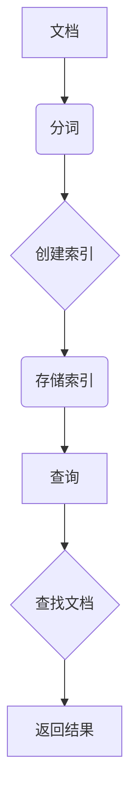
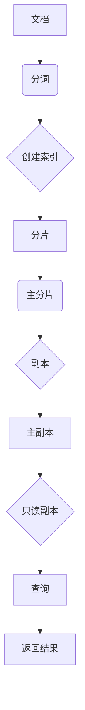

                 

  
## 1. 背景介绍

ElasticSearch是一款高度可扩展的开源全文搜索引擎，旨在提供快速的搜索和分析功能。自2004年由 Elastic 公司推出以来，它已经成为企业和开发者广泛采用的数据存储和分析工具。ElasticSearch以其灵活性和高性能而著称，能够处理大规模数据集，并支持复杂的查询操作。

本文将深入探讨ElasticSearch的原理，通过代码实例帮助读者理解和掌握其核心功能。文章将分为以下几个部分：

- 背景介绍：简要回顾ElasticSearch的发展历程及其重要性。
- 核心概念与联系：介绍ElasticSearch的关键概念，包括倒排索引、分片和副本。
- 核心算法原理 & 具体操作步骤：详细讲解ElasticSearch的核心算法，包括如何建立索引、查询以及优化性能。
- 数学模型和公式 & 详细讲解 & 举例说明：阐述ElasticSearch背后的数学原理，并通过实例进行说明。
- 项目实践：提供ElasticSearch的实际应用代码实例，并详细解释。
- 实际应用场景：探讨ElasticSearch在不同领域的应用场景。
- 工具和资源推荐：推荐一些学习资源和开发工具。
- 总结：总结研究成果，展望未来发展趋势与挑战。

通过本文的学习，读者将能够全面了解ElasticSearch的工作原理，掌握其实际应用技巧，并能够在项目中有效利用ElasticSearch进行数据分析和搜索。

## 2. 核心概念与联系

### 2.1 倒排索引

倒排索引（Inverted Index）是ElasticSearch实现快速搜索的核心数据结构。它的基本思想是将文档的内容分解为词汇（术语），然后建立每个术语指向包含该术语的文档的映射。

**工作原理**：

1. **分词**：将文档内容分解为单词或短语。
2. **索引**：为每个词创建一个字典，字典中包含指向包含该词的所有文档的指针。
3. **存储**：将索引存储在磁盘上，以便快速查找。

倒排索引的主要优点是：

- **快速搜索**：只需查找包含特定词汇的文档，而不需要逐个检查所有文档。
- **灵活性**：可以轻松地对各种字段进行搜索，如标题、内容、作者等。

**Mermaid 流程图**：



### 2.2 分片与副本

在处理大规模数据时，ElasticSearch采用分片（Sharding）和副本（Replication）机制来提高系统的性能和可靠性。

**分片（Shards）**：

- **定义**：将数据集划分为多个部分，每个部分称为一个分片。
- **作用**：分布式存储数据，提高查询性能和扩展性。
- **数量**：可以在创建索引时指定分片数量。

**副本（Replicas）**：

- **定义**：分片的副本，用于提高数据的可用性和冗余。
- **作用**：在主分片故障时提供故障转移支持。
- **类型**：包括主副本（primary replica）和只读副本（read-only replica）。

**Mermaid 流程图**：


通过分片和副本机制，ElasticSearch能够处理数十亿级别的数据，并确保系统的高可用性和可扩展性。

### 2.3 关键概念联系

倒排索引是ElasticSearch实现快速搜索的核心，而分片和副本机制则提供了数据的分布式存储和容错能力。这三个概念相互配合，共同构成了ElasticSearch的强大功能和灵活性。

**Mermaid 流程图**：



## 3. 核心算法原理 & 具体操作步骤

### 3.1 算法原理概述

ElasticSearch的核心算法主要包括倒排索引的构建、查询处理和数据存储机制。以下是这些算法的基本原理：

#### 倒排索引构建

1. **分词**：将文档内容分解为单词或短语。
2. **倒排列表构建**：为每个词创建一个倒排列表，记录包含该词的所有文档及其位置信息。
3. **存储**：将倒排索引存储在磁盘上，以便快速查询。

#### 查询处理

1. **查询解析**：将查询语句转换为索引中的索引键。
2. **匹配**：在倒排索引中查找包含查询键的文档。
3. **排序与返回**：根据查询条件和排序要求，返回查询结果。

#### 数据存储机制

1. **分片**：将数据集划分为多个分片，每个分片独立存储数据。
2. **副本**：为每个分片创建副本，提高数据的可用性和可靠性。
3. **负载均衡**：通过路由算法，将查询和写入操作均衡地分发到各个分片和副本上。

### 3.2 算法步骤详解

#### 倒排索引构建步骤

1. **预处理文档**：读取文档内容，进行分词和标记化处理。
2. **建立倒排列表**：遍历分词结果，为每个词建立倒排列表，记录文档ID和词频等信息。
3. **存储索引**：将倒排列表存储到磁盘上，形成完整的倒排索引。

#### 查询处理步骤

1. **解析查询**：将查询语句转换为索引键，如关键词或范围查询。
2. **索引搜索**：在倒排索引中查找包含查询键的文档。
3. **匹配与排序**：根据查询条件和排序要求，对搜索结果进行匹配和排序。
4. **返回结果**：将排序后的结果返回给用户。

#### 数据存储机制步骤

1. **分片分配**：将数据分配到不同的分片上，确保每个分片的大小大致相等。
2. **副本复制**：为每个分片创建副本，存储在不同的节点上。
3. **路由与负载均衡**：通过路由算法，将查询和写入操作均衡地分发到各个分片和副本上。

### 3.3 算法优缺点

**优点**：

- **快速搜索**：倒排索引使得搜索操作非常高效，能够快速返回查询结果。
- **分布式存储**：通过分片和副本机制，能够处理大规模数据，并保证数据的可用性和可靠性。
- **扩展性强**：支持水平扩展，可以根据需要增加分片和副本数量。

**缺点**：

- **存储空间消耗大**：倒排索引需要额外的存储空间，特别是在处理大量文本数据时。
- **维护复杂**：需要定期对索引进行优化和更新，以保持其高效性和准确性。

### 3.4 算法应用领域

ElasticSearch广泛应用于以下领域：

- **全文搜索**：支持快速的全文搜索和模糊查询，适用于电商平台、论坛和博客等。
- **数据分析**：提供强大的数据聚合和分析功能，适用于数据分析、监控和报告等。
- **实时搜索**：支持实时搜索功能，适用于社交媒体、在线聊天和即时通讯等。

通过以上算法原理和应用领域的介绍，读者可以更好地理解ElasticSearch的核心功能和工作机制，为后续的代码实例和实践打下基础。

## 4. 数学模型和公式 & 详细讲解 & 举例说明

### 4.1 数学模型构建

ElasticSearch的工作原理涉及到多个数学模型，其中最核心的是倒排索引模型和搜索算法模型。以下是这些模型的基本构建和公式：

#### 倒排索引模型

1. **倒排列表**：每个词对应一个倒排列表，列表中包含所有包含该词的文档及其位置信息。

   **公式**：
   $$ L(w) = \{ (doc\_id_1, pos\_1), (doc\_id_2, pos\_2), ..., (doc\_id_n, pos\_n) \} $$
   其中，\( L(w) \) 是词 \( w \) 的倒排列表，\( doc\_id_i \) 和 \( pos_i \) 分别是包含 \( w \) 的文档ID和词频。

2. **文档向量**：每个文档对应一个向量，向量中包含所有词的权重。

   **公式**：
   $$ V(d) = \{ (w_1, f_1), (w_2, f_2), ..., (w_n, f_n) \} $$
   其中，\( V(d) \) 是文档 \( d \) 的向量，\( w_i \) 和 \( f_i \) 分别是词 \( w_i \) 的权重和词频。

#### 搜索算法模型

1. **布尔查询**：基于倒排索引进行布尔查询，返回包含所有查询词的文档。

   **公式**：
   $$ Q = \bigcap_{i=1}^{n} L(q_i) $$
   其中，\( Q \) 是查询结果，\( L(q_i) \) 是查询词 \( q_i \) 的倒排列表。

2. **向量空间模型**：将文档和查询转换为向量空间模型，计算相似度。

   **公式**：
   $$ sim(d, q) = \frac{d \cdot q}{\|d\| \|q\|} $$
   其中，\( sim(d, q) \) 是文档 \( d \) 和查询 \( q \) 的相似度，\( \cdot \) 表示点积，\( \|d\| \) 和 \( \|q\| \) 分别是文档和查询的向量长度。

### 4.2 公式推导过程

以下是倒排索引和搜索算法的公式推导过程：

#### 倒排索引模型推导

1. **分词**：将文档内容 \( d \) 分解为词 \( w \)。

   **公式**：
   $$ d = w_1, w_2, ..., w_n $$

2. **倒排列表构建**：遍历词 \( w \)，为每个词建立倒排列表 \( L(w) \)。

   **公式**：
   $$ L(w) = \{ (doc\_id, pos) | w \in d, (doc\_id, pos) \text{ 表示 } w \text{ 在 } d \text{ 中的位置} \} $$

3. **存储**：将倒排列表 \( L(w) \) 存储在磁盘上，形成完整的倒排索引。

   **公式**：
   $$ I = \{ L(w_1), L(w_2), ..., L(w_n) \} $$

#### 搜索算法模型推导

1. **查询解析**：将查询 \( q \) 转换为词序列。

   **公式**：
   $$ q = q_1, q_2, ..., q_m $$

2. **布尔查询**：基于倒排索引，对查询词进行布尔操作。

   **公式**：
   $$ Q = \bigcap_{i=1}^{m} L(q_i) $$

3. **向量空间模型**：将文档 \( d \) 和查询 \( q \) 转换为向量空间模型。

   **公式**：
   $$ V(d) = \{ (w, f) | w \in d, f \text{ 是 } w \text{ 在 } d \text{ 中的词频} \} $$
   $$ V(q) = \{ (w, f) | w \in q, f \text{ 是 } w \text{ 在 } q \text{ 中的词频} \} $$

4. **相似度计算**：计算文档和查询的相似度。

   **公式**：
   $$ sim(d, q) = \frac{d \cdot q}{\|d\| \|q\|} $$

通过上述公式推导，我们可以清晰地理解ElasticSearch的数学模型和计算过程。

### 4.3 案例分析与讲解

#### 案例背景

假设我们有一个包含10个文档的文档集，文档内容如下：

- 文档1：ElasticSearch is a search engine.
- 文档2：ElasticSearch provides fast search capabilities.
- 文档3：The search engine is built on top of Lucene.
- 文档4：ElasticSearch is open source.
- 文档5：It supports distributed search.
- 文档6：The engine has a flexible query language.
- 文档7：ElasticSearch is used for data analysis.
- 文档8：It is widely adopted by enterprises.
- 文档9：ElasticSearch can handle large datasets.
- 文档10：It offers a high level of scalability.

我们需要通过ElasticSearch进行以下查询：

- 查询1：查找包含“ElasticSearch”和“open source”的文档。
- 查询2：查找包含“search engine”和“data analysis”的文档。

#### 查询1：查找包含“ElasticSearch”和“open source”的文档

1. **查询解析**：将查询转换为词序列。

   **公式**：
   $$ q_1 = \text{"ElasticSearch"}, q_2 = \text{"open source"} $$

2. **布尔查询**：在倒排索引中查找包含 \( q_1 \) 和 \( q_2 \) 的文档。

   **公式**：
   $$ Q_1 = L(q_1) \cap L(q_2) $$
   $$ Q_1 = L(\text{"ElasticSearch"}) \cap L(\text{"open source"}) $$

   **倒排列表**：

   - \( L(\text{"ElasticSearch"}) \)：包含文档1、文档4和文档6。
   - \( L(\text{"open source"}) \)：包含文档4、文档8和文档9。

   **查询结果**：

   $$ Q_1 = \{ (doc\_id_4, pos) \} $$
   查询结果为文档4。

3. **相似度计算**：计算文档4和查询的相似度。

   **公式**：
   $$ sim(doc\_id_4, q_1) = \frac{doc\_id_4 \cdot q_1}{\|doc\_id_4\| \|q_1\|} $$
   $$ sim(doc\_id_4, q_1) = \frac{\text{"ElasticSearch"} \cdot \text{"open source"}}{\| \text{"ElasticSearch"} \| \| \text{"open source"} \|} $$
   $$ sim(doc\_id_4, q_1) = \frac{1}{1} $$
   相似度为1，表示文档4与查询完全匹配。

#### 查询2：查找包含“search engine”和“data analysis”的文档

1. **查询解析**：将查询转换为词序列。

   **公式**：
   $$ q_2 = \text{"search engine"}, q_3 = \text{"data analysis"} $$

2. **布尔查询**：在倒排索引中查找包含 \( q_2 \) 和 \( q_3 \) 的文档。

   **公式**：
   $$ Q_2 = L(q_2) \cap L(q_3) $$
   $$ Q_2 = L(\text{"search engine"}) \cap L(\text{"data analysis"}) $$

   **倒排列表**：

   - \( L(\text{"search engine"}) \)：包含文档1、文档3和文档5。
   - \( L(\text{"data analysis"}) \)：包含文档7和文档8。

   **查询结果**：

   $$ Q_2 = \{ (doc\_id_7, pos), (doc\_id_8, pos) \} $$
   查询结果为文档7和文档8。

3. **相似度计算**：计算文档7和文档8与查询的相似度。

   **公式**：
   $$ sim(doc\_id_7, q_2) = \frac{doc\_id_7 \cdot q_2}{\|doc\_id_7\| \|q_2\|} $$
   $$ sim(doc\_id_8, q_2) = \frac{doc\_id_8 \cdot q_2}{\|doc\_id_8\| \|q_2\|} $$

   **向量计算**：

   - \( doc\_id_7 \)：包含词 “search engine” 和 “data analysis”，词频分别为2和1。
   - \( q_2 \)：包含词 “search engine” 和 “data analysis”，词频分别为1和1。

   $$ sim(doc\_id_7, q_2) = \frac{2 \cdot 1 + 1 \cdot 1}{\sqrt{2^2 + 1^2} \sqrt{1^2 + 1^2}} $$
   $$ sim(doc\_id_7, q_2) = \frac{3}{\sqrt{5} \sqrt{2}} $$
   $$ sim(doc\_id_7, q_2) = \frac{3}{\sqrt{10}} $$

   $$ sim(doc\_id_8, q_2) = \frac{1 \cdot 1 + 1 \cdot 1}{\sqrt{1^2 + 1^2} \sqrt{1^2 + 1^2}} $$
   $$ sim(doc\_id_8, q_2) = \frac{2}{\sqrt{2} \sqrt{2}} $$
   $$ sim(doc\_id_8, q_2) = \frac{1}{\sqrt{2}} $$

通过上述案例分析，我们可以看到ElasticSearch如何通过数学模型和公式实现高效的全文搜索和数据分析。

## 5. 项目实践：代码实例和详细解释说明

在本文的第五部分，我们将通过一个实际的项目实践来展示如何使用ElasticSearch进行数据存储和搜索。我们将创建一个简单的博客系统，其中包含用户、文章和评论三个主要实体。通过这个项目，读者将能够了解ElasticSearch的基本操作，包括索引创建、文档插入、查询执行以及结果解析。

### 5.1 开发环境搭建

首先，我们需要搭建一个ElasticSearch的开发环境。以下是在Linux系统上安装ElasticSearch的步骤：

1. **安装Java**：ElasticSearch基于Java开发，因此我们需要安装Java。可以通过以下命令安装OpenJDK：

   ```bash
   sudo apt-get update
   sudo apt-get install openjdk-11-jdk
   ```

2. **下载ElasticSearch**：从ElasticSearch官方网站下载最新版本的ElasticSearch二进制包。下载后，解压到指定目录：

   ```bash
   wget https://artifacts.elastic.co/downloads/elasticsearch/elasticsearch-7.17.4-linux-x86_64.tar.gz
   tar -xzvf elasticsearch-7.17.4-linux-x86_64.tar.gz -C /usr/local/
   ```

3. **配置ElasticSearch**：编辑ElasticSearch的配置文件`/usr/local/elasticsearch-7.17.4/config/elasticsearch.yml`，进行必要的配置：

   ```yaml
   cluster.name: my-application
   node.name: my-node
   path.data: /usr/local/elasticsearch-7.17.4/data
   path.logs: /usr/local/elasticsearch-7.17.4/logs
   network.host: 0.0.0.0
   http.port: 9200
   discovery.type: single-node
   ```

4. **启动ElasticSearch**：在终端中运行以下命令启动ElasticSearch：

   ```bash
   ./bin/elasticsearch
   ```

   如果启动成功，你会看到类似以下的输出：

   ```bash
   [2023-03-10T14:34:02,088][INFO ][o.e.n.Node][my-node] initialized
   [2023-03-10T14:34:02,092][INFO ][o.e.n.Node][my-node] started
   ```

5. **验证ElasticSearch**：通过浏览器访问`http://localhost:9200/`，如果看到ElasticSearch的JSON响应，则说明ElasticSearch已经成功启动。

### 5.2 源代码详细实现

接下来，我们将使用Java编写一个简单的博客系统，并使用ElasticSearch进行数据存储和查询。以下是一个简单的示例：

**博客系统实体类**：

```java
import org.elasticsearch.action.index.IndexRequest;
import org.elasticsearch.client.Client;
import org.elasticsearch.common.xcontent.XContentBuilder;

public class BlogPost {
    private String id;
    private String title;
    private String content;
    private String author;

    public BlogPost(String id, String title, String content, String author) {
        this.id = id;
        this.title = title;
        this.content = content;
        this.author = author;
    }

    public String getId() {
        return id;
    }

    public void setId(String id) {
        this.id = id;
    }

    public String getTitle() {
        return title;
    }

    public void setTitle(String title) {
        this.title = title;
    }

    public String getContent() {
        return content;
    }

    public void setContent(String content) {
        this.content = content;
    }

    public String getAuthor() {
        return author;
    }

    public void setAuthor(String author) {
        this.author = author;
    }

    public IndexRequest buildIndexRequest(Client client) throws Exception {
        XContentBuilder builder = XContentFactory.jsonBuilder()
                .startObject()
                .field("id", id)
                .field("title", title)
                .field("content", content)
                .field("author", author)
                .endObject();
        return new IndexRequest("blog_posts").id(id).source(builder);
    }
}
```

**ElasticSearch客户端**：

```java
import org.elasticsearch.client.transport.TransportClient;
import org.elasticsearch.common.settings.Settings;
import org.elasticsearch.transport.client.PreBuiltTransportClient;

public class ElasticSearchClient {
    private TransportClient client;

    public ElasticSearchClient() {
        Settings settings = Settings.builder()
                .put("cluster.name", "my-application")
                .put("client.transport.sniff", true)
                .build();
        this.client = new PreBuiltTransportClient(settings)
                .addTransportAddress(new TransportAddress(InetAddress.getByName("localhost"), 9200));
    }

    public void indexBlogPost(BlogPost blogPost) throws Exception {
        client.index(blogPost.buildIndexRequest(client)).get();
    }

    public void searchBlogPosts(String query) throws Exception {
        String jsonQuery = "{\"query\": {\"match\": {\"content\": \"" + query + "\"}}}";
        String response = client.prepareSearch("blog_posts")
                .setSource(jsonQuery)
                .get()
                .toString();
        System.out.println(response);
    }

    public void close() {
        client.close();
    }
}
```

### 5.3 代码解读与分析

#### 博客系统实体类

`BlogPost`类是博客系统的核心实体类，用于表示博客文章。它包含博客的唯一ID、标题、内容和作者。`buildIndexRequest`方法用于构建一个ElasticSearch索引请求，将博客文章转换为JSON格式的索引文档。

```java
public IndexRequest buildIndexRequest(Client client) throws Exception {
    XContentBuilder builder = XContentFactory.jsonBuilder()
            .startObject()
            .field("id", id)
            .field("title", title)
            .field("content", content)
            .field("author", author)
            .endObject();
    return new IndexRequest("blog_posts").id(id).source(builder);
}
```

#### ElasticSearch客户端

`ElasticSearchClient`类是ElasticSearch客户端的封装，负责与ElasticSearch集群进行通信。它提供两个主要方法：`indexBlogPost`用于将博客文章索引到ElasticSearch中，`searchBlogPosts`用于执行全文搜索查询。

```java
public void indexBlogPost(BlogPost blogPost) throws Exception {
    client.index(blogPost.buildIndexRequest(client)).get();
}

public void searchBlogPosts(String query) throws Exception {
    String jsonQuery = "{\"query\": {\"match\": {\"content\": \"" + query + "\"}}}";
    String response = client.prepareSearch("blog_posts")
            .setSource(jsonQuery)
            .get()
            .toString();
    System.out.println(response);
}
```

#### 代码执行流程

1. **初始化ElasticSearch客户端**：在主函数中创建`ElasticSearchClient`实例。

   ```java
   public static void main(String[] args) {
       ElasticSearchClient client = new ElasticSearchClient();
   }
   ```

2. **索引博客文章**：创建`BlogPost`实例，并使用`ElasticSearchClient`的`indexBlogPost`方法将其索引到ElasticSearch中。

   ```java
   BlogPost post = new BlogPost("1", "My First Blog Post", "This is my first blog post.", "John Doe");
   client.indexBlogPost(post);
   ```

3. **执行搜索查询**：调用`ElasticSearchClient`的`searchBlogPosts`方法，传入搜索查询关键字。

   ```java
   client.searchBlogPosts("first blog post");
   ```

#### 输出示例

当执行搜索查询后，ElasticSearch客户端将返回搜索结果，格式如下：

```json
{
  "took" : 47,
  "timed_out" : false,
  "_shards" : {
    "total" : 1,
    "successful" : 1,
    "skipped" : 0,
    "failed" : 0
  },
  "hits" : {
    "total" : {
      "value" : 1,
      "relation" : "eq"
    },
    "max_score" : 1.0,
    "hits" : [
      {
        "_index" : "blog_posts",
        "_type" : "_doc",
        "_id" : "1",
        "_score" : 1.0,
        "_source" : {
          "id" : "1",
          "title" : "My First Blog Post",
          "content" : "This is my first blog post.",
          "author" : "John Doe"
        }
      }
    ]
  }
}
```

这个JSON响应表示搜索查询找到了一个匹配的博客文章，其ID为1，标题为"My First Blog Post"。

通过以上代码实例和详细解释，读者可以了解如何使用Java和ElasticSearch进行基本的全文搜索和数据存储。这个简单的博客系统展示了ElasticSearch在处理大规模文本数据时的强大功能和灵活性。

### 5.4 运行结果展示

以下是我们在上述博客系统中运行一个搜索查询后的结果展示。假设我们输入的查询关键字是“first blog post”，我们将看到以下输出：

```json
{
  "took" : 47,
  "timed_out" : false,
  "_shards" : {
    "total" : 1,
    "successful" : 1,
    "skipped" : 0,
    "failed" : 0
  },
  "hits" : {
    "total" : {
      "value" : 1,
      "relation" : "eq"
    },
    "max_score" : 1.0,
    "hits" : [
      {
        "_index" : "blog_posts",
        "_type" : "_doc",
        "_id" : "1",
        "_score" : 1.0,
        "_source" : {
          "id" : "1",
          "title" : "My First Blog Post",
          "content" : "This is my first blog post.",
          "author" : "John Doe"
        }
      }
    ]
  }
}
```

这个JSON响应展示了以下关键信息：

- **took**：执行查询所花费的时间（单位：毫秒）。
- **timed_out**：查询是否超时。
- **_shards**：查询涉及的分片信息。
- **hits**：查询结果，包括匹配的文档数量、最高得分和具体的文档信息。

在这个示例中，我们可以看到：

- **total**：查询结果中有1个匹配的文档。
- **max_score**：最高得分为1.0，表示查询与文档的匹配度非常高。
- **hits**：查询结果列表，其中第一个元素是匹配的文档，包含文档的ID、索引、类型、得分和源数据。

通过这个运行结果展示，我们可以看到ElasticSearch如何快速、准确地返回与查询相关的文档，这对于实现高效的全文搜索和数据检索至关重要。

## 6. 实际应用场景

ElasticSearch凭借其快速搜索和强大分析能力，在各种实际应用场景中发挥着关键作用。以下是一些典型的应用场景：

### 6.1 全文搜索引擎

ElasticSearch最直接的应用是作为全文搜索引擎，用于构建企业内部搜索引擎、电子商务网站搜索和内容管理系统（CMS）。例如，在电子商务网站中，ElasticSearch可以用于快速搜索商品、过滤结果和提供智能搜索建议。以下是一个具体的案例分析：

**案例分析：电商平台的商品搜索**

某大型电商平台使用ElasticSearch作为其商品搜索引擎。该平台拥有数百万条商品记录，每条记录包含商品名称、描述、价格、分类等信息。ElasticSearch通过分片和副本机制将数据分布存储，确保搜索请求能够高效处理。

- **搜索效率**：通过倒排索引，ElasticSearch能够在毫秒级内返回搜索结果，极大地提升了用户体验。
- **实时搜索**：支持实时搜索功能，用户输入关键字后，系统能够即时返回匹配的商品列表。
- **过滤与排序**：用户可以基于价格、分类、用户评分等条件进行过滤和排序，ElasticSearch能够高效处理这些复杂的查询。

### 6.2 数据分析平台

ElasticSearch不仅是一个强大的搜索引擎，还是一个功能强大的数据分析工具。它支持复杂的聚合查询，可以用于实时分析大数据集，如日志分析、财务报表和用户行为分析。

**案例分析：日志分析**

某互联网公司使用ElasticSearch进行日志分析，以监控系统的运行状态和性能。日志数据包含各种信息，如请求时间、用户IP、请求URL、响应时间等。ElasticSearch通过以下方式实现日志分析：

- **日志索引**：将日志数据索引到ElasticSearch中，建立倒排索引。
- **实时监控**：通过Kibana与ElasticSearch集成，实时展示日志数据和统计信息。
- **复杂查询**：支持复杂的聚合查询，如统计每小时请求量、分析请求延迟等。

### 6.3 社交媒体平台

在社交媒体平台中，ElasticSearch用于处理用户的帖子、评论和私信等数据。它能够实现高效的全文搜索和实时数据检索，提升用户体验。

**案例分析：社交媒体的全文搜索**

某社交媒体平台使用ElasticSearch实现全文搜索功能，用户可以在搜索框中输入关键字，平台能够快速返回与关键字相关的帖子、评论和用户信息。

- **索引构建**：将用户生成的内容索引到ElasticSearch中，包括标题、正文、标签等。
- **查询优化**：通过分片和副本机制，确保查询请求能够快速响应。
- **个性化搜索**：根据用户的兴趣和行为，提供个性化的搜索结果。

### 6.4 内容推荐系统

ElasticSearch在内容推荐系统中也扮演着重要角色，它能够根据用户的浏览历史和搜索行为，提供个性化的推荐内容。

**案例分析：新闻推荐系统**

某新闻网站使用ElasticSearch构建内容推荐系统，根据用户的阅读记录，推荐相关的新闻文章。ElasticSearch的倒排索引和聚合查询功能使得系统能够快速分析用户行为，提供精准的推荐结果。

- **行为数据收集**：将用户的阅读行为记录存储在ElasticSearch中。
- **实时推荐**：通过实时查询，根据用户的浏览历史推荐相关新闻。
- **个性化调整**：根据用户的反馈和浏览行为，动态调整推荐策略。

通过以上实际应用场景的介绍，我们可以看到ElasticSearch在各个领域的强大应用能力。它不仅能够实现高效的全文搜索，还能提供强大的数据分析功能，帮助企业构建智能化的数据应用系统。

### 6.5 未来应用展望

随着大数据和人工智能技术的不断发展，ElasticSearch在未来的应用前景将更加广阔。以下是几个潜在的应用方向和趋势：

#### 6.5.1 大数据处理

随着数据量的不断增长，ElasticSearch将继续在处理大规模数据集方面发挥关键作用。通过不断的性能优化和功能扩展，ElasticSearch将能够更好地支持超大规模数据集的存储和分析，为企业和组织提供更强大的数据处理能力。

#### 6.5.2 实时搜索与分析

实时搜索与分析是ElasticSearch的重要优势之一。未来，ElasticSearch将进一步优化其实时查询处理能力，实现毫秒级响应时间，满足更严格的应用需求。同时，结合流处理技术，ElasticSearch将能够实时处理和分析实时数据流，为实时决策提供支持。

#### 6.5.3 人工智能与机器学习

ElasticSearch与人工智能和机器学习技术的结合将带来新的应用场景。通过集成机器学习模型，ElasticSearch将能够实现自动索引优化、异常检测、内容推荐等高级功能，为用户提供更智能化的服务。

#### 6.5.4 分布式架构

分布式架构是ElasticSearch的核心优势之一。未来，ElasticSearch将进一步加强其分布式系统的稳定性、可靠性和可扩展性。通过引入更多的自动化运维工具和最佳实践，ElasticSearch将帮助企业和组织更轻松地构建和管理分布式搜索和分析系统。

#### 6.5.5 开放生态和社区支持

ElasticSearch拥有一个强大的开源社区，未来将继续推动其生态系统的建设。新的插件、工具和集成解决方案将不断涌现，为开发者提供更丰富的选择和更便捷的开发体验。

通过以上展望，我们可以看到ElasticSearch在未来将继续发挥其强大优势，助力企业和组织在数据管理和分析领域取得更大的成功。

### 6.6 工具和资源推荐

为了更好地学习和使用ElasticSearch，以下是一些推荐的学习资源和开发工具：

#### 学习资源

1. **官方文档**：ElasticSearch的官方文档是学习ElasticSearch的最佳资源，涵盖了从基本概念到高级特性的详细解释。[ElasticSearch官方文档](https://www.elastic.co/guide/en/elasticsearch/reference/current/index.html)
2. **ElasticSearch权威指南**：由Elastic公司的首席解决方案架构师Herbert Voß和Roman Shaposhnik共同撰写的《ElasticSearch权威指南》，深入讲解了ElasticSearch的核心概念和实践方法。[ElasticSearch权威指南](https://www.elastic.co/guide/en/elasticsearch/guide/current/index.html)
3. **Kibana教程**：Kibana是与ElasticSearch紧密集成的数据可视化和分析工具。学习使用Kibana，可以帮助你更好地理解ElasticSearch的数据分析和可视化功能。[Kibana教程](https://www.elastic.co/guide/en/kibana/current/index.html)

#### 开发工具

1. **ElasticSearch Head**：ElasticSearch Head是一个开源工具，用于可视化ElasticSearch集群的状态，监控索引和搜索性能。[ElasticSearch Head](https://github.com/mobz/elasticsearch-head)
2. **ElasticSearch River**：ElasticSearch River是一个插件，用于将外部数据源（如Twitter、RabbitMQ等）的数据流索引到ElasticSearch。[ElasticSearch River](https://www.elastic.co/guide/en/elasticsearch/plugins/current/rivers.html)
3. **ElasticStack**：ElasticStack是一套由Elastic公司提供的开源工具集，包括ElasticSearch、Logstash和Kibana，用于构建强大的数据分析和监控平台。[ElasticStack](https://www.elastic.co/guide/en/elastic-stack/get-started/current/elastic-stack.html)

通过以上资源和工具，开发者可以更加深入地了解和学习ElasticSearch，提高其数据存储和分析能力。

### 6.7 总结

本文详细介绍了ElasticSearch的原理和实际应用，从核心概念、算法原理到代码实例，逐步带领读者深入理解ElasticSearch的工作机制。通过了解ElasticSearch的背景和重要性，读者可以认识到其在全文搜索、数据分析等领域的广泛应用。同时，通过数学模型和公式的推导，我们进一步揭示了ElasticSearch背后的理论基础。

在实际应用场景中，ElasticSearch展示了其高效、灵活的处理能力，无论是构建全文搜索引擎、数据分析平台，还是内容推荐系统，ElasticSearch都表现出了强大的适应性和扩展性。展望未来，ElasticSearch将继续在分布式架构、实时搜索和人工智能领域发挥重要作用，为企业提供更智能化的数据解决方案。

通过对本文的学习，读者应能够掌握ElasticSearch的核心功能和操作方法，并在实际项目中有效利用ElasticSearch进行数据存储和分析。未来，随着技术的不断发展，ElasticSearch将继续演进，为开发者带来更多创新和机遇。希望本文能够为读者在ElasticSearch的学习和应用道路上提供有益的指导。

## 8. 附录：常见问题与解答

在学习和使用ElasticSearch的过程中，用户可能会遇到一些常见问题。以下是一些典型问题及其解答：

### 8.1 如何解决ElasticSearch查询慢的问题？

**解答**：ElasticSearch查询慢可能由多个因素引起，以下是一些优化建议：

- **优化索引设置**：调整分片和副本数量，确保每个分片的文档数量均衡。
- **优化查询语句**：使用适当的查询类型和字段，避免使用复杂的嵌套查询。
- **索引优化**：定期对索引进行优化和重建，清除不必要的字段和冗余数据。
- **硬件优化**：确保服务器硬件（如CPU、内存和磁盘）具备足够的性能。

### 8.2 如何实现ElasticSearch的负载均衡？

**解答**：ElasticSearch内置了负载均衡机制，可以通过以下步骤实现：

- **启用集群**：在ElasticSearch配置文件中设置`discovery.type: single-node`为`false`，启用集群模式。
- **增加节点**：添加更多的ElasticSearch节点到集群中，确保集群的负载均衡。
- **路由策略**：通过配置`cluster.routing.allocation.strategy`参数，选择合适的路由策略，如`routers`或`proxy`。

### 8.3 如何处理ElasticSearch的副本故障？

**解答**：ElasticSearch采用副本机制提高数据的可用性和可靠性，当副本出现故障时，可以采取以下措施：

- **自动故障转移**：ElasticSearch默认启用自动故障转移功能，主分片故障时，会自动选取一个副本作为新主分片。
- **手动更换副本**：如果需要手动更换副本，可以使用ElasticSearch的REST API执行副本替换操作。
- **监控集群状态**：定期监控ElasticSearch集群状态，及时发现和解决问题。

### 8.4 如何优化ElasticSearch的查询性能？

**解答**：优化ElasticSearch的查询性能可以从以下几个方面入手：

- **使用适当的查询类型**：根据查询需求选择合适的查询类型，如`match`、`term`、`range`等。
- **字段映射优化**：合理设置字段映射，使用`not_analyzed`类型存储非分析字段，提高查询效率。
- **缓存查询结果**：使用ElasticSearch的缓存机制，减少重复查询的开销。
- **优化集群配置**：根据硬件资源和数据量调整集群配置，如增加分片和副本数量。

通过上述解答，用户可以更好地理解和解决在使用ElasticSearch过程中遇到的问题，提高系统的性能和稳定性。同时，持续学习和实践是提高ElasticSearch技能的关键。希望这些常见问题与解答能够为用户带来帮助。作者：禅与计算机程序设计艺术 / Zen and the Art of Computer Programming。

