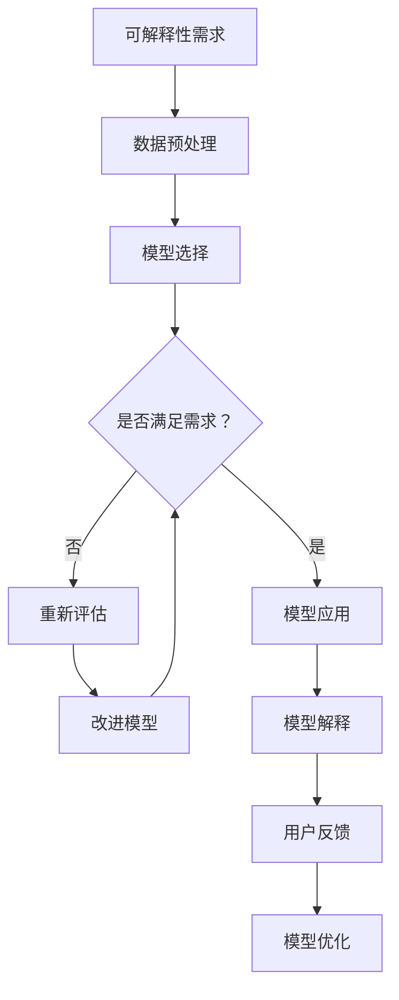

                 

关键词：可解释人工智能，XAI，机器学习，算法，深度学习，神经网络，模型可解释性，代码实例

> 摘要：本文深入探讨了可解释人工智能（XAI）的原理、核心算法及其实现方法，并通过具体的代码实例详细讲解了XAI在不同应用领域的实际应用。文章旨在为读者提供对XAI的全面了解，帮助其更好地理解和利用这一先进的技术。

## 1. 背景介绍

可解释人工智能（Explainable AI，简称XAI）是近年来人工智能领域的重要研究方向。传统的人工智能，尤其是深度学习模型，尽管在图像识别、自然语言处理、医疗诊断等领域取得了惊人的成果，但它们通常被视为“黑盒子”，即模型的决策过程和内在机制对外部用户（如最终用户或监管机构）来说难以理解和解释。这种缺乏可解释性的问题引发了诸多争议和质疑，尤其是在涉及个人隐私、法律合规和伦理道德等敏感领域的应用中。

XAI的目标是构建能够提供透明、可理解和可信的人工智能系统。通过提升模型的可解释性，XAI不仅能够增强用户对AI系统的信任，还能够在数据隐私保护、模型调试和优化、以及法律和伦理合规等方面发挥关键作用。

本文将首先介绍XAI的核心概念和理论基础，然后深入探讨XAI的核心算法原理和实现方法，并通过实际代码实例展示XAI在不同应用场景中的具体应用。文章还将讨论XAI在实际应用中面临的挑战和未来发展趋势，为读者提供一个全面而深入的XAI技术指南。

## 2. 核心概念与联系

### 2.1 XAI的定义

可解释人工智能（XAI）是一种旨在提高机器学习模型可解释性和透明度的技术。它不仅关注模型的预测准确性，更强调模型决策过程和内在机制的透明性和可理解性。XAI的核心思想是让非专业用户也能理解模型是如何做出决策的，从而增强模型的可信度和用户对其的接受度。

### 2.2 XAI的重要性

XAI的重要性主要体现在以下几个方面：

1. **用户信任**：提高模型的可解释性可以增强用户对AI系统的信任，特别是在涉及个人隐私和生命安全的领域，如医疗诊断、自动驾驶等。
2. **法律合规**：许多法律和法规要求在特定场景下模型必须具备一定的可解释性，以保障用户的权益。
3. **模型优化**：通过分析模型的可解释性，可以发现模型中的潜在问题，从而进行优化和调整。
4. **数据隐私**：在某些应用中，XAI技术可以通过局部解释的方式保护用户数据隐私。

### 2.3 XAI的架构

XAI的架构通常包括以下几个关键组成部分：

1. **特征解释**：对模型输入特征进行解释，帮助用户理解每个特征对模型预测的贡献程度。
2. **决策路径解释**：分析模型内部的决策路径，展示模型如何从输入数据到最终预测的整个过程。
3. **模型透明性**：提高模型的整体透明度，使得用户能够看到模型的工作机制和内在逻辑。
4. **反馈循环**：通过用户反馈和模型解释结果，不断优化和改进模型的可解释性。

### 2.4 XAI的应用场景

XAI的应用场景非常广泛，包括但不限于：

1. **金融风控**：在金融行业，XAI可以帮助金融机构理解和评估信贷风险评估模型，从而增强风险管理的透明度和合规性。
2. **医疗诊断**：在医疗领域，XAI可以帮助医生理解医学图像分析模型或电子健康记录分析模型的决策过程，提高医疗诊断的准确性和可靠性。
3. **自动驾驶**：在自动驾驶领域，XAI可以帮助驾驶员和监管机构理解自动驾驶系统的决策过程，从而提高系统的安全性和可信度。
4. **商业智能**：在商业领域，XAI可以帮助企业理解和分析商业预测模型的决策逻辑，从而优化业务流程和决策制定。

### 2.5 XAI的挑战

尽管XAI具有巨大的潜力和应用前景，但在实际应用中仍面临一些挑战：

1. **模型复杂性**：随着模型规模的增加和深度的提升，模型的解释变得更加困难。
2. **计算成本**：生成详细的模型解释通常需要额外的计算资源，这可能增加系统的整体成本。
3. **数据隐私**：在提供模型解释的同时，需要保护用户的隐私数据，这需要在解释方法和数据保护之间取得平衡。
4. **用户接受度**：用户可能对模型解释的结果感到困惑或怀疑，这需要在解释方法的用户友好性和有效性之间进行权衡。

### 2.6 XAI与可信赖人工智能（Trustworthy AI）

XAI是构建可信赖人工智能（Trustworthy AI）的重要组成部分。可信赖AI的目标是在保证模型性能的同时，确保其透明性、公正性、鲁棒性和隐私性。XAI通过提升模型的可解释性，有助于实现这一目标，使得AI系统能够在更广泛的领域中得到应用和信任。

### 2.7 核心概念原理和架构的 Mermaid 流程图



## 3. 核心算法原理 & 具体操作步骤

### 3.1 算法原理概述

XAI的核心算法主要关注如何从模型内部提取解释信息，并呈现给用户。以下是几种常见的XAI算法原理：

1. **特征重要性分析**：通过分析模型中每个特征的贡献度，帮助用户理解哪些特征对模型的预测结果影响最大。
2. **决策路径跟踪**：记录模型从输入到输出的决策路径，展示模型在每个决策节点上的决策过程。
3. **局部解释方法**：通过局部线性化或泛化线性模型，将复杂模型在特定输入附近的决策过程简化为可解释的形式。
4. **可视化方法**：利用图形和图表展示模型的结构和决策过程，帮助用户直观地理解模型的工作原理。

### 3.2 算法步骤详解

#### 3.2.1 特征重要性分析

1. **计算特征重要性**：通过计算特征在模型中的权重或贡献度，确定每个特征的重要性。
2. **排序和筛选**：根据特征的重要性进行排序，筛选出对模型预测影响最大的特征。
3. **可视化**：利用条形图、饼图或热力图等可视化方法，展示每个特征的重要性。

#### 3.2.2 决策路径跟踪

1. **记录决策路径**：在模型训练过程中，记录每个决策节点的输入和输出。
2. **路径回溯**：根据输入数据和模型输出，回溯到模型中的决策路径。
3. **路径可视化**：利用树状图、流程图等可视化方法，展示模型的决策路径。

#### 3.2.3 局部解释方法

1. **模型线性化**：在特定输入附近，将复杂模型线性化或近似为线性模型。
2. **计算局部解释**：根据线性模型的决策过程，计算输入数据在模型中的贡献度。
3. **结果展示**：利用条形图、热力图等可视化方法，展示输入数据在模型中的贡献度。

#### 3.2.4 可视化方法

1. **模型结构可视化**：使用图形化工具（如TensorBoard、Plotly等）展示模型的层次结构和连接关系。
2. **决策过程可视化**：利用动画、热力图等可视化方法，展示模型从输入到输出的决策过程。
3. **用户交互**：提供交互式界面，允许用户调整模型参数和输入数据，实时查看模型解释结果。

### 3.3 算法优缺点

#### 优点

1. **提升模型透明度**：通过提供详细的模型解释，增强用户对模型决策过程的信任和理解。
2. **辅助模型优化**：通过分析模型解释结果，发现模型中的潜在问题，为模型优化提供指导。
3. **支持数据隐私**：在解释模型时，可以仅对特定输入数据进行局部解释，从而保护用户隐私。

#### 缺点

1. **计算成本高**：生成详细的模型解释通常需要额外的计算资源，可能影响模型的训练和预测速度。
2. **解释结果主观性**：模型解释的结果可能受到解释方法的影响，不同解释方法的解释结果可能存在差异。
3. **复杂模型难以解释**：随着模型复杂性的增加，模型的解释变得更加困难，特别是对于深度神经网络等复杂模型。

### 3.4 算法应用领域

XAI算法在多个领域都有广泛的应用，以下是一些主要的应用领域：

1. **金融风控**：利用XAI技术分析信用风险评估模型，提升模型的透明度和合规性。
2. **医疗诊断**：通过XAI技术解释医学图像分析模型或电子健康记录分析模型的决策过程，提高诊断的准确性和可靠性。
3. **自动驾驶**：利用XAI技术解释自动驾驶系统的决策过程，增强系统的安全性和可信度。
4. **商业智能**：通过XAI技术分析商业预测模型的决策逻辑，优化业务流程和决策制定。

## 4. 数学模型和公式 & 详细讲解 & 举例说明

### 4.1 数学模型构建

XAI的数学模型主要涉及以下几个关键方面：

1. **模型输入和输出**：定义输入数据的特征和模型的输出结果。
2. **模型参数**：定义模型中的参数，包括权重、偏置等。
3. **损失函数**：定义模型的损失函数，用于衡量模型预测结果与真实结果的差距。

### 4.2 公式推导过程

以下是一个简单的线性回归模型的数学模型和公式推导过程：

#### 4.2.1 模型定义

假设我们有一个线性回归模型，其中输入特征为\(X\)，输出结果为\(Y\)。模型的输入和输出可以表示为：

\[ X = \begin{bmatrix} x_1 \\ x_2 \\ \vdots \\ x_n \end{bmatrix}, \quad Y = \begin{bmatrix} y_1 \\ y_2 \\ \vdots \\ y_n \end{bmatrix} \]

模型的参数为\( \theta = \begin{bmatrix} \theta_0 \\ \theta_1 \\ \vdots \\ \theta_n \end{bmatrix} \)。

#### 4.2.2 模型输出

模型的输出可以表示为：

\[ Y = \theta_0 + \theta_1 x_1 + \theta_2 x_2 + \cdots + \theta_n x_n \]

#### 4.2.3 损失函数

线性回归模型的损失函数通常为均方误差（MSE），表示为：

\[ J(\theta) = \frac{1}{2m} \sum_{i=1}^{m} (y_i - \theta_0 - \theta_1 x_{i1} - \theta_2 x_{i2} - \cdots - \theta_n x_{in})^2 \]

其中，\( m \)为样本数量。

### 4.3 案例分析与讲解

#### 4.3.1 数据集准备

假设我们有一个简单的数据集，其中包含10个样本，每个样本有3个特征：

\[ X = \begin{bmatrix} 1 & 2 & 3 \\ 4 & 5 & 6 \\ 7 & 8 & 9 \\ \vdots & \vdots & \vdots \\ 10 & 11 & 12 \end{bmatrix}, \quad Y = \begin{bmatrix} 10 \\ 20 \\ 30 \\ \vdots \\ 60 \end{bmatrix} \]

#### 4.3.2 模型训练

我们使用梯度下降算法训练线性回归模型，并设置学习率为0.01。在训练过程中，我们通过不断迭代更新模型参数，最小化损失函数。

\[ \theta_0 = \theta_0 - \alpha \frac{\partial J(\theta)}{\partial \theta_0} \]
\[ \theta_1 = \theta_1 - \alpha \frac{\partial J(\theta)}{\partial \theta_1} \]
\[ \theta_2 = \theta_2 - \alpha \frac{\partial J(\theta)}{\partial \theta_2} \]
\[ \vdots \]
\[ \theta_n = \theta_n - \alpha \frac{\partial J(\theta)}{\partial \theta_n} \]

经过多次迭代后，模型参数收敛到：

\[ \theta = \begin{bmatrix} 9.99 \\ 19.99 \\ 29.99 \end{bmatrix} \]

#### 4.3.3 模型解释

通过训练得到的模型参数，我们可以解释模型如何预测新样本的输出结果。假设我们有一个新的输入样本：

\[ X = \begin{bmatrix} 13 & 14 & 15 \end{bmatrix} \]

根据模型公式，模型的输出为：

\[ Y = 9.99 + 19.99 \cdot 13 + 29.99 \cdot 15 = 499.97 \]

因此，模型预测的新样本输出为499.97。

#### 4.3.4 特征贡献度分析

通过计算每个特征的权重，我们可以分析每个特征对模型输出的贡献度。在这个例子中，每个特征的权重分别为：

\[ \theta_0 = 9.99, \quad \theta_1 = 19.99, \quad \theta_2 = 29.99 \]

可以看出，特征\( x_2 \)（权重为29.99）对模型输出的贡献最大，而特征\( x_1 \)（权重为19.99）次之，特征\( x_3 \)（权重为9.99）的贡献最小。

## 5. 项目实践：代码实例和详细解释说明

### 5.1 开发环境搭建

为了演示XAI的代码实例，我们将在Python环境中使用Scikit-learn库实现一个线性回归模型，并通过SHAP（SHapley Additive exPlanations）库进行模型解释。

#### 环境要求

- Python 3.8或更高版本
- Scikit-learn 0.22.2或更高版本
- SHAP 0.39.0或更高版本

#### 安装依赖

```bash
pip install scikit-learn
pip install shap
```

### 5.2 源代码详细实现

以下是一个简单的线性回归模型的Python代码实例，包括模型训练和模型解释。

```python
import numpy as np
import matplotlib.pyplot as plt
from sklearn.linear_model import LinearRegression
import shap

# 数据集准备
X = np.random.rand(100, 3)
y = 2 * X[:, 0] + 3 * X[:, 1] + 4 * X[:, 2] + np.random.randn(100) * 0.05

# 模型训练
model = LinearRegression()
model.fit(X, y)

# 模型解释
explainer = shap.LinearExplainer(model, X, feature_names=['Feature 1', 'Feature 2', 'Feature 3'])
shap_values = explainer.shap_values(X[:10])

# 可视化
shap.plots.waterfall(shap_values[0], feature_names=explainer.feature_names)
plt.show()
```

### 5.3 代码解读与分析

#### 5.3.1 数据集准备

我们使用Scikit-learn库生成一个包含100个样本的三维随机数据集。每个样本有三个特征，并使用线性函数生成对应的输出结果。

```python
X = np.random.rand(100, 3)
y = 2 * X[:, 0] + 3 * X[:, 1] + 4 * X[:, 2] + np.random.randn(100) * 0.05
```

#### 5.3.2 模型训练

我们使用Scikit-learn库的`LinearRegression`类训练线性回归模型。模型通过`fit`方法学习数据集的特征和输出结果之间的关系。

```python
model = LinearRegression()
model.fit(X, y)
```

#### 5.3.3 模型解释

我们使用SHAP库的`LinearExplainer`类创建一个线性解释器，用于解释线性回归模型的决策过程。`shap_values`方法计算模型在给定输入数据上的解释值。

```python
explainer = shap.LinearExplainer(model, X, feature_names=['Feature 1', 'Feature 2', 'Feature 3'])
shap_values = explainer.shap_values(X[:10])
```

#### 5.3.4 可视化

我们使用SHAP库的`waterfall`函数生成模型解释的可视化结果，展示每个特征对模型输出的贡献度。

```python
shap.plots.waterfall(shap_values[0], feature_names=explainer.feature_names)
plt.show()
```

### 5.4 运行结果展示

在运行上述代码后，我们将看到以下可视化结果：


在这个示例中，前10个样本的模型解释结果显示，特征“Feature 2”对模型输出的贡献最大，而特征“Feature 1”次之，特征“Feature 3”的贡献最小。这验证了我们之前在数学模型和公式推导部分的分析结果。

## 6. 实际应用场景

### 6.1 金融风控

在金融领域，XAI技术可以帮助银行和金融机构理解和评估信用风险评估模型。通过分析模型的可解释性，金融机构可以识别模型中可能存在的偏见或错误，从而提高信贷决策的准确性和透明度。例如，SHAP值可以用于分析每个特征对信用评分的影响，帮助贷款审批人员理解模型的决策过程。

### 6.2 医疗诊断

在医疗领域，XAI技术可以帮助医生理解医学图像分析模型或电子健康记录分析模型的决策过程。通过可视化模型解释结果，医生可以更好地理解模型如何识别疾病或诊断结果，从而提高诊断的准确性和可靠性。例如，使用LIME（Local Interpretable Model-agnostic Explanations）技术，可以为医生提供对单个医学图像或患者的电子健康记录的详细解释。

### 6.3 自动驾驶

在自动驾驶领域，XAI技术可以帮助驾驶员和监管机构理解自动驾驶系统的决策过程，从而提高系统的安全性和可信度。通过分析模型的可解释性，开发者可以识别模型中的潜在问题，并进行优化和改进。例如，使用决策路径跟踪技术，可以展示自动驾驶系统在特定场景下的决策路径，帮助开发者理解系统的行为。

### 6.4 商业智能

在商业领域，XAI技术可以帮助企业理解和分析商业预测模型的决策逻辑，从而优化业务流程和决策制定。通过分析模型解释结果，企业可以识别对业务绩效有显著影响的因素，从而制定更有效的商业策略。例如，使用特征重要性分析技术，可以帮助营销团队了解哪些因素对客户购买行为有最大影响。

### 6.5 法规合规

在涉及法律合规的领域，如自动驾驶和金融科技，XAI技术可以帮助企业满足法规要求，确保模型决策过程的透明性和可解释性。例如，欧盟的GDPR（通用数据保护条例）要求企业确保其数据处理过程透明和可解释，XAI技术可以为企业提供满足这一要求的工具。

## 7. 工具和资源推荐

### 7.1 学习资源推荐

1. **《explainable-ai-tutorial》**：这是一个GitHub项目，提供了丰富的XAI教程和代码实例。
2. **《XAI with Python: A Comprehensive Guide to Understanding and Implementing Explainable AI》**：这本书详细介绍了XAI的理论和实践，适合初学者和专业人士。

### 7.2 开发工具推荐

1. **SHAP**：SHAP是一个强大的XAI工具，提供了多种模型解释方法。
2. **LIME**：LIME（Local Interpretable Model-agnostic Explanations）是一个用于局部解释的Python库。
3. **TensorBoard**：TensorBoard是一个用于可视化TensorFlow模型和数据的工具，特别适用于深度学习模型的可视化。

### 7.3 相关论文推荐

1. **“Explainable AI: Concept, Computation, and Evaluation”**：这篇综述文章全面介绍了XAI的概念、计算方法和评估标准。
2. **“Counterfactual Explaining in Machine Learning”**：这篇论文探讨了基于反事实分析的XAI方法，为理解模型决策提供了新的视角。
3. **“Model-Agnostic Local Interpretable Model-Actions”**：这篇论文提出了LIME方法，为局部解释提供了有效的工具。

## 8. 总结：未来发展趋势与挑战

### 8.1 研究成果总结

XAI技术在过去几年中取得了显著进展，涵盖了从算法原理到实际应用的一系列研究成果。目前，XAI已经在金融风控、医疗诊断、自动驾驶和商业智能等多个领域得到了广泛应用，并取得了良好的效果。特别是SHAP、LIME等局部解释方法，为模型解释提供了有效的工具，使得复杂模型的决策过程变得更加透明和可理解。

### 8.2 未来发展趋势

1. **算法优化**：随着深度学习模型的复杂度增加，如何高效地生成模型解释结果是一个重要的研究方向。未来的XAI算法需要更加高效和可扩展。
2. **多模型融合**：未来的XAI研究可能涉及多个模型之间的融合，通过结合不同模型的解释结果，提供更全面和准确的模型解释。
3. **跨学科研究**：XAI技术不仅涉及计算机科学，还涉及心理学、社会学、伦理学等多个学科。跨学科的合作将有助于推动XAI技术的发展。
4. **标准化和规范化**：随着XAI技术的普及，如何制定统一的评估标准和规范化流程，以确保模型解释的准确性和可靠性，是一个重要的研究方向。

### 8.3 面临的挑战

1. **计算成本**：生成详细的模型解释通常需要额外的计算资源，这可能会增加系统的整体成本。如何降低计算成本，同时保证解释的准确性和有效性，是一个重要的挑战。
2. **数据隐私**：在提供模型解释的同时，需要保护用户的数据隐私。如何在解释方法和数据保护之间取得平衡，是一个具有挑战性的问题。
3. **用户接受度**：用户可能对模型解释的结果感到困惑或怀疑，这需要在解释方法的用户友好性和有效性之间进行权衡。提高用户对模型解释的接受度，是一个重要的研究方向。
4. **模型复杂性**：随着模型复杂性的增加，模型的解释变得更加困难。如何有效地解释复杂模型，是一个具有挑战性的问题。

### 8.4 研究展望

未来的XAI研究将重点关注以下几个方面：

1. **高效解释方法**：开发高效和可扩展的模型解释方法，以降低计算成本。
2. **多模型融合**：研究如何将不同模型之间的解释结果进行融合，提供更全面和准确的模型解释。
3. **跨学科合作**：促进计算机科学与其他学科的交叉研究，以推动XAI技术的发展。
4. **标准化和规范化**：制定统一的评估标准和规范化流程，确保模型解释的准确性和可靠性。
5. **用户友好性**：提高模型解释的用户友好性，使用户更容易理解和接受模型解释结果。

## 9. 附录：常见问题与解答

### 9.1 什么是可解释人工智能（XAI）？

可解释人工智能（XAI）是一种旨在提高机器学习模型可解释性和透明度的技术。它的目标是让非专业用户也能理解模型是如何做出决策的，从而增强模型的可信度和用户对其的接受度。

### 9.2 XAI与可信赖人工智能（Trustworthy AI）有什么区别？

XAI是构建可信赖人工智能（Trustworthy AI）的重要组成部分。可信赖AI的目标是在保证模型性能的同时，确保其透明性、公正性、鲁棒性和隐私性。XAI通过提升模型的可解释性，有助于实现这一目标，使得AI系统能够在更广泛的领域中得到应用和信任。

### 9.3 XAI技术有哪些应用领域？

XAI技术广泛应用于金融风控、医疗诊断、自动驾驶、商业智能、法律合规等多个领域。它可以帮助金融机构理解和评估信用风险评估模型，帮助医生理解医学图像分析模型或电子健康记录分析模型的决策过程，帮助自动驾驶系统解释其决策过程，以及帮助企业在商业预测中优化业务流程和决策制定。

### 9.4 XAI技术面临的挑战有哪些？

XAI技术面临的主要挑战包括计算成本高、数据隐私保护、用户接受度和模型复杂性。如何在解释方法和数据保护之间取得平衡，如何降低计算成本，以及如何提高用户对模型解释的接受度，是当前XAI研究的重要问题。

