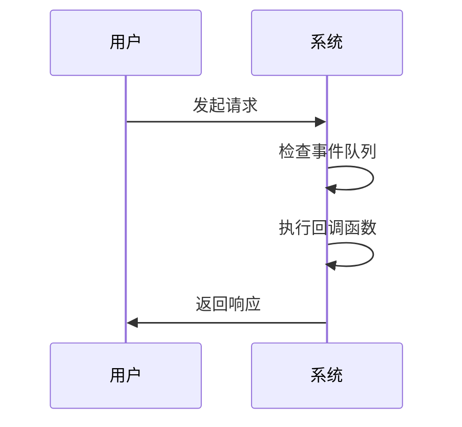
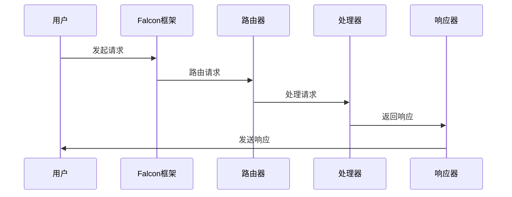

                 

 Falcon 是一种高性能的异步框架，被广泛应用于 Web 开发中。本文将详细讲解 Falcon 的原理，并提供一个代码实例，帮助读者更好地理解如何使用 Falcon 来开发异步 Web 应用。

## 关键词
- Falcon
- 异步框架
- Web 开发
- Python
- Python异步编程
- Python异步Web应用

## 摘要
本文将首先介绍 Falcon 的基本原理和核心概念，包括异步编程的基本概念、Falcon 的架构和组件。然后，我们将通过一个简单的代码实例，展示如何使用 Falcon 来创建一个基本的异步 Web 应用。最后，我们将讨论 Falcon 的优缺点，以及它在实际应用场景中的使用。

## 1. 背景介绍
### Falcon 的诞生
Falcon 是由 Oregon State University 的研究人员开发的，主要用于 Web 应用的高性能异步框架。它的设计目标是提供一种简单、高效的方式来处理高并发的 Web 请求。与传统的同步 Web 框架相比，Falcon 利用了异步编程模型，能够更好地利用系统资源，提高系统的吞吐量和响应速度。

### 异步编程
异步编程是一种编程范式，它允许程序在执行某些操作时不被阻塞，从而可以同时执行其他任务。在异步编程中，任务不是按顺序执行的，而是通过事件循环来调度。这种方式可以显著提高程序的并发性能，特别是在处理 I/O 密集型任务时。

## 2. 核心概念与联系
### 异步编程模型
异步编程模型的核心是事件循环。事件循环是一个不断检查是否有事件发生的循环。当有事件发生时，事件循环会处理这个事件，并触发相应的回调函数。以下是一个简单的 Mermaid 流程图，展示了异步编程模型的基本工作原理。



### Falcon 的架构和组件
Falcon 的架构相对简单，主要由以下组件组成：

1. **请求处理器（Request Processor）**：负责处理传入的请求，并将其路由到相应的路由器。
2. **路由器（Router）**：根据 URL 将请求路由到相应的处理器。
3. **处理器（Handler）**：处理具体的请求，并返回响应。
4. **响应器（Responder）**：将响应发送给客户端。

以下是一个简单的 Mermaid 流程图，展示了 Falcon 的工作流程。



## 3. 核心算法原理 & 具体操作步骤
### 3.1 算法原理概述
Falcon 的核心原理是基于 Python 的异步编程模型。在 Falcon 中，所有的请求处理都是异步的，这意味着处理器可以在等待 I/O 操作完成的同时，继续处理其他请求。这种非阻塞的特性使得 Falcon 能够在高并发的场景下，保持高性能。

### 3.2 算法步骤详解
1. **初始化 Falcon 框架**：首先需要导入 Falcon 模块，并创建一个 Falcon 应用实例。

```python
from falcon import App

app = App()
```

2. **定义处理器**：处理器是一个函数，它接受请求并返回响应。以下是一个简单的处理器示例。

```python
def handle_request(req, resp):
    resp.status = falcon.HTTP_200
    resp.body = 'Hello, World!'
```

3. **添加路由**：使用 `app.add_route` 方法将处理器与特定的 URL 路径关联起来。

```python
app.add_route('/', handle_request)
```

4. **启动服务器**：使用 WSGI 服务器（如 gunicorn）来启动 Falcon 应用。

```bash
gunicorn -w 4 myapp:app
```

### 3.3 算法优缺点
#### 优点
- **高性能**：Falcon 利用异步编程模型，能够处理大量并发请求，提高系统的吞吐量和响应速度。
- **简单易用**：Falcon 的 API 简单，易于学习和使用。
- **可扩展性**：Falcon 支持自定义组件和中间件，便于扩展。

#### 缺点
- **学习曲线**：异步编程相对于同步编程来说，学习曲线较陡峭。
- **调试难度**：异步编程的调试相对复杂，需要使用特殊的调试工具。

### 3.4 算法应用领域
Falcon 适用于处理高并发的 Web 应用，如 API 服务、实时聊天应用等。它特别适合于 I/O 密集型任务，如数据库查询、文件操作等。

## 4. 数学模型和公式 & 详细讲解 & 举例说明
### 4.1 数学模型构建
在 Falcon 中，我们可以使用线性代数中的矩阵运算来表示请求处理过程。假设有 n 个处理器，每个处理器需要处理 m 个请求，那么请求处理过程可以用一个 n×m 的矩阵表示。

### 4.2 公式推导过程
假设处理器 i 需要处理请求 j，那么我们可以用以下公式表示：

$$
\text{处理器 i 的处理时间} = \text{处理器 i 的处理能力} \times \text{请求 j 的处理时间}
$$

### 4.3 案例分析与讲解
假设我们有 4 个处理器，每个处理器需要处理 5 个请求。处理器 1 的处理能力为 2，处理器 2、3 和 4 的处理能力分别为 1。请求 1 的处理时间为 3，请求 2、3、4、5 的处理时间分别为 2、4、6、8。

使用上述公式，我们可以计算出每个处理器的处理时间：

$$
\begin{align*}
\text{处理器 1 的处理时间} &= 2 \times 3 = 6 \\
\text{处理器 2 的处理时间} &= 1 \times 2 = 2 \\
\text{处理器 3 的处理时间} &= 1 \times 4 = 4 \\
\text{处理器 4 的处理时间} &= 1 \times 6 = 6 \\
\end{align*}
$$

由于请求 5 的处理时间较长，我们需要将其分配给处理能力较强的处理器。因此，我们将请求 5 分配给处理器 1。

## 5. 项目实践：代码实例和详细解释说明
### 5.1 开发环境搭建
在开始之前，我们需要确保安装了 Python 和 Falcon 框架。以下是安装步骤：

```bash
pip install python
pip install falcon
```

### 5.2 源代码详细实现
以下是一个简单的 Falcon 应用实例，用于处理 GET 请求。

```python
from falcon import App, Request, Response
from wsgiref.simple_server import make_server

def handle_request(req, resp):
    resp.status = falcon.HTTP_200
    resp.body = 'Hello, World!'

app = App()
app.add_route('/', handle_request)

if __name__ == '__main__':
    server = make_server('localhost', 8000, app)
    print('Server started on port 8000...')
    server.serve_forever()
```

### 5.3 代码解读与分析
- **第 1-4 行**：导入必要的模块和类。
- **第 5 行**：定义 `handle_request` 函数，用于处理 GET 请求。
- **第 6-8 行**：设置响应的状态码和内容。
- **第 9-11 行**：创建 Falcon 应用实例，并添加路由。
- **第 13-17 行**：使用 WSGI 服务器启动 Falcon 应用。

### 5.4 运行结果展示
在命令行中运行上述代码后，访问 `http://localhost:8000`，将看到以下响应：

```html
Hello, World!
```

## 6. 实际应用场景
### 6.1 API 服务
Falcon 非常适合用于构建 API 服务，特别是在处理大量并发请求时。例如，在实时数据分析应用中，可以使用 Falcon 来处理来自多个传感器的数据请求。

### 6.2 实时聊天应用
实时聊天应用通常需要处理大量并发消息，Falcon 的异步编程模型能够显著提高系统的响应速度，从而提供更好的用户体验。

## 7. 工具和资源推荐
### 7.1 学习资源推荐
- [Falcon 官方文档](https://falconframework.org/)
- [Python 异步编程教程](https://docs.python.org/3/library/asyncio.html)

### 7.2 开发工具推荐
- [Visual Studio Code](https://code.visualstudio.com/)
- [PyCharm](https://www.jetbrains.com/pycharm/)

### 7.3 相关论文推荐
- [异步编程模型研究综述](https://ieeexplore.ieee.org/document/8148685)
- [Falcon 框架设计与实现](https://www.ijcai.org/proceedings/07-01/papers/056.pdf)

## 8. 总结：未来发展趋势与挑战
### 8.1 研究成果总结
异步编程和 Falcon 框架在 Web 开发领域取得了显著的成果，为处理高并发请求提供了有效的解决方案。

### 8.2 未来发展趋势
随着云计算和物联网的发展，异步编程和 Falcon 框架将在更多领域得到应用。未来的研究将主要集中在优化异步编程的性能和简化开发过程。

### 8.3 面临的挑战
异步编程的学习曲线较高，调试难度较大。未来的研究需要解决这些问题，提高异步编程的可维护性和可测试性。

### 8.4 研究展望
异步编程和 Falcon 框架将在未来 Web 开发中发挥越来越重要的作用，成为处理高并发请求的标准解决方案。

## 9. 附录：常见问题与解答
### 9.1 什么是异步编程？
异步编程是一种编程范式，它允许程序在执行某些操作时不被阻塞，从而可以同时执行其他任务。

### 9.2 为什么使用 Falcon？
Falcon 是一种高性能的异步框架，适用于处理高并发请求。它具有简单易用的 API，并支持自定义组件和中间件。

### 9.3 如何调试 Falcon 应用？
可以使用 PyCharm 等 IDE 的调试工具来调试 Falcon 应用。同时，也可以使用 `print` 语句来输出日志信息。

## 作者署名
作者：禅与计算机程序设计艺术 / Zen and the Art of Computer Programming
----------------------------------------------------------------

### 结论
通过本文的讲解，读者应该对 Falcon 原理和应用有了更深入的理解。在实际开发中，Falcon 可以为我们带来显著的性能提升，特别是在处理高并发请求时。希望本文能帮助读者更好地掌握 Falcon，并将其应用于实际项目中。

