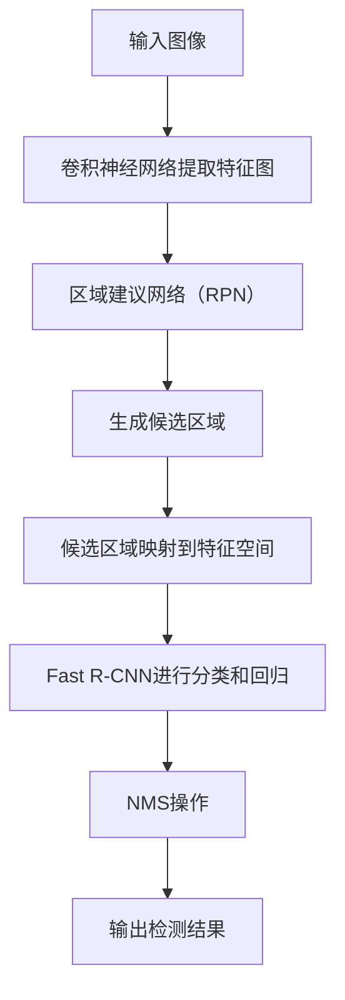

                 

关键词：目标检测，深度学习，Faster R-CNN，图像识别，卷积神经网络，区域建议网络（RPN）

## 摘要

本文旨在深入解析Faster R-CNN这一目标检测算法的原理及其在图像识别领域的应用。Faster R-CNN是一种基于深度学习的目标检测框架，其核心在于将区域建议网络（RPN）与卷积神经网络（CNN）有机结合，从而实现高效的物体检测。本文将详细阐述Faster R-CNN的结构和工作原理，并通过代码实例展示其实际应用过程。读者将了解如何从零开始搭建Faster R-CNN模型，并掌握其关键实现细节。

## 1. 背景介绍

目标检测是计算机视觉领域的一项重要任务，旨在从图像或视频中识别并定位出多个目标。近年来，随着深度学习技术的迅速发展，基于深度学习的目标检测方法取得了显著的进展。Faster R-CNN（Region-based Convolutional Neural Networks）就是其中一种代表性算法，由Shaoqing Ren等人于2015年提出。Faster R-CNN在多个数据集上的性能都超过了之前的传统方法，其高效的检测速度和优秀的检测精度使其成为目标检测领域的重要工具。

### 1.1 目标检测的发展历程

目标检测技术的发展经历了从传统方法到深度学习的转变。传统方法主要依赖于手工设计的特征和分类器，如Haar特征分类器、SVM等。这些方法虽然在一些特定任务上表现出色，但往往需要大量的人为干预，且在处理复杂场景时效果不佳。随着深度学习的兴起，基于卷积神经网络（CNN）的目标检测方法逐渐成为研究热点。早期的CNN模型如R-CNN（Region-based CNN）和Fast R-CNN（Fast Region-based CNN）在速度和精度上取得了显著提升，但仍然存在一些不足。

Faster R-CNN在R-CNN和Fast R-CNN的基础上，通过引入区域建议网络（RPN）来生成更加精确的候选区域，从而进一步提高了检测速度和精度。随后，Faster R-CNN的变体如Faster R-CNN v2和Faster R-CNN v3也在不同的层面上进行了优化和改进，使得其在实际应用中更具优势。

### 1.2 Faster R-CNN的重要性

Faster R-CNN之所以受到广泛关注，主要源于其在多个方面的优势：

1. **高效的检测速度**：相比传统的目标检测方法，Faster R-CNN显著提高了检测速度，适用于实时应用场景。
2. **优秀的检测精度**：通过引入RPN，Faster R-CNN能够生成更加精确的候选区域，从而提高了检测精度。
3. **灵活的模型结构**：Faster R-CNN的模型结构相对简单，易于扩展和调整，可以适应不同的应用需求。

Faster R-CNN在自动驾驶、视频监控、医疗影像等多个领域都有广泛应用，成为目标检测领域的重要工具。

### 1.3 文章结构

本文将按照以下结构进行讲解：

- **背景介绍**：回顾目标检测的发展历程，介绍Faster R-CNN的重要性。
- **核心概念与联系**：详细阐述Faster R-CNN的核心概念和整体架构，包括区域建议网络（RPN）和Fast R-CNN。
- **核心算法原理 & 具体操作步骤**：深入讲解Faster R-CNN的算法原理和具体实现步骤，包括RPN和Fast R-CNN。
- **数学模型和公式 & 详细讲解 & 举例说明**：介绍Faster R-CNN中的数学模型和公式，并通过实例进行说明。
- **项目实践：代码实例和详细解释说明**：通过具体代码实例，展示Faster R-CNN的实现过程。
- **实际应用场景**：探讨Faster R-CNN在不同应用场景中的应用。
- **未来应用展望**：讨论Faster R-CNN的未来发展方向和应用前景。
- **工具和资源推荐**：推荐相关学习资源和开发工具。
- **总结**：总结研究成果，展望未来发展趋势与挑战。
- **附录**：解答常见问题。

通过本文的讲解，读者将全面了解Faster R-CNN的原理和应用，掌握其实际开发过程，为后续研究和实践提供参考。

## 2. 核心概念与联系

Faster R-CNN是一个结合了深度学习和传统目标检测方法的框架，其核心在于如何高效地检测图像中的多个目标。为了实现这一目标，Faster R-CNN引入了两个关键组件：区域建议网络（RPN）和Fast R-CNN。下面我们将详细讲解这两个组件及其相互关系。

### 2.1 区域建议网络（RPN）

RPN是Faster R-CNN的重要组成部分，其主要作用是生成高质量的候选区域（proposal）。这些候选区域是目标检测的第一步，它们需要满足两个条件：一是包含真实的物体边界，二是排除背景区域。

#### 2.1.1 RPN的工作原理

RPN通过以下步骤生成候选区域：

1. **特征图生成**：首先，输入图像经过卷积神经网络（如VGG16或ResNet）提取特征图。
2. **锚点生成**：在特征图上，对于每个位置，生成多个大小和尺度不同的锚点（anchor）。锚点的目的是预测可能包含目标的区域。
3. **分类和回归**：对于每个锚点，通过分类和回归操作来预测其是否包含目标以及目标的位置。分类操作预测锚点是否为正样本（包含目标）或负样本（仅含背景）。回归操作预测锚点中心的位置偏移量。

#### 2.1.2 RPN的数学模型

RPN中的分类和回归操作可以通过以下数学模型表示：

1. **分类模型**：假设有\(N\)个锚点，其中\(N_p\)个为正样本，\(N_n\)个为负样本。对于每个锚点\(a_i\)，使用softmax函数进行分类预测：

   \[
   \hat{y}_i = \text{softmax}(\text{fc}(a_i))
   \]

   其中，\(y_i\)是锚点\(a_i\)的标签，\( \text{fc} \)是全连接层。

2. **回归模型**：对于每个锚点\(a_i\)，使用线性回归模型预测其中心位置的偏移量：

   \[
   \hat{t}_i = \text{linear}(\text{fc}(a_i))
   \]

   其中，\(t_i\)是锚点\(a_i\)的真实中心位置。

#### 2.1.3 RPN的性能评估

RPN的性能评估主要通过候选区域的准确率和召回率进行。准确率表示预测为正样本的候选区域中实际包含目标的比率，召回率表示实际包含目标的候选区域中被预测为正样本的比率。通常，使用F1分数（F1-score）作为综合评估指标：

\[
F1\_score = 2 \times \frac{precision \times recall}{precision + recall}
\]

### 2.2 Fast R-CNN

Fast R-CNN是Faster R-CNN中的另一个重要组件，其作用是对RPN生成的候选区域进行精确分类和定位。与RPN不同的是，Fast R-CNN不直接在特征图上进行操作，而是将候选区域映射到卷积神经网络的特征空间中进行处理。

#### 2.2.1 Fast R-CNN的工作原理

Fast R-CNN的工作原理如下：

1. **候选区域映射**：将RPN生成的候选区域映射到卷积神经网络的特征空间中，获取特征向量。
2. **分类和回归**：对映射后的特征向量进行分类和回归操作，预测每个候选区域的目标类别和位置偏移量。
3. **非极大值抑制（NMS）**：对预测结果进行NMS操作，去除重复或重叠的候选区域，获得最终的检测结果。

#### 2.2.2 Fast R-CNN的数学模型

Fast R-CNN的分类和回归操作可以通过以下数学模型表示：

1. **分类模型**：假设有\(M\)个候选区域，其中\(M_c\)个为正样本，\(M_n\)个为负样本。对于每个候选区域\(p_j\)，使用softmax函数进行分类预测：

   \[
   \hat{y}_j = \text{softmax}(\text{fc}(p_j))
   \]

   其中，\(y_j\)是候选区域\(p_j\)的标签。

2. **回归模型**：对于每个候选区域\(p_j\)，使用线性回归模型预测其位置偏移量：

   \[
   \hat{t}_j = \text{linear}(\text{fc}(p_j))
   \]

   其中，\(t_j\)是候选区域\(p_j\)的真实位置。

#### 2.2.3 Fast R-CNN的性能评估

Fast R-CNN的性能评估同样通过准确率和召回率进行。准确率表示预测正确的候选区域比率，召回率表示实际目标被预测正确的比率。使用F1分数（F1-score）作为综合评估指标：

\[
F1\_score = 2 \times \frac{precision \times recall}{precision + recall}
\]

### 2.3 RPN与Fast R-CNN的相互关系

RPN和Fast R-CNN是Faster R-CNN框架中的两个关键组件，它们通过以下方式相互配合：

1. **候选区域生成**：RPN生成高质量的候选区域，为Fast R-CNN提供输入。
2. **精确分类与定位**：Fast R-CNN对RPN生成的候选区域进行精确分类和定位，生成最终的检测结果。

这种配合使得Faster R-CNN在检测速度和精度上达到了一个平衡，成为目标检测领域的重要工具。

### 2.4 Faster R-CNN的整体架构

Faster R-CNN的整体架构可以概括为以下步骤：

1. **输入图像**：输入一幅图像。
2. **卷积神经网络提取特征图**：通过卷积神经网络提取特征图。
3. **区域建议网络（RPN）生成候选区域**：在特征图上生成候选区域。
4. **候选区域映射到特征空间**：将候选区域映射到卷积神经网络的特征空间。
5. **Fast R-CNN进行分类和回归**：对候选区域进行分类和回归操作。
6. **非极大值抑制（NMS）**：对预测结果进行NMS操作，获得最终的检测结果。

通过这种架构，Faster R-CNN实现了高效、准确的目标检测。

### 2.5 Mermaid流程图

为了更好地理解Faster R-CNN的流程，我们可以使用Mermaid绘制其流程图。以下是Faster R-CNN的Mermaid流程图：



通过上述讲解和流程图，读者可以更好地理解Faster R-CNN的核心概念和整体架构，为后续的详细解析打下基础。

## 3. 核心算法原理 & 具体操作步骤

在了解了Faster R-CNN的核心概念和整体架构之后，接下来我们将深入探讨其核心算法原理和具体操作步骤，包括区域建议网络（RPN）和Fast R-CNN。

### 3.1 算法原理概述

Faster R-CNN的核心在于其区域建议网络（RPN）和Fast R-CNN的结合。RPN主要负责生成高质量的候选区域，而Fast R-CNN则对这些建议区域进行精确分类和定位。通过这种结构，Faster R-CNN能够在保证高检测精度的同时，实现高效的检测速度。

### 3.2 算法步骤详解

#### 3.2.1 输入图像预处理

首先，输入图像经过预处理，包括缩放、裁剪等操作，使其尺寸符合卷积神经网络的要求。这一步的目的是使输入图像能够适应模型的结构，提高模型的训练效果。

#### 3.2.2 卷积神经网络提取特征图

接着，输入图像经过卷积神经网络（如VGG16、ResNet等）提取特征图。这一步的主要作用是提取图像的底层特征，为后续的RPN和Fast R-CNN提供输入。

#### 3.2.3 区域建议网络（RPN）

1. **特征图生成**：首先，输入图像经过卷积神经网络提取特征图。特征图是一个高维的矩阵，代表了图像在各个位置的特征信息。
   
2. **锚点生成**：在特征图上，对于每个位置，生成多个大小和尺度不同的锚点（anchor）。锚点的生成过程主要包括以下步骤：
   - **确定锚点中心**：对于每个特征图上的位置，生成多个锚点中心。
   - **设置锚点大小和比例**：根据预设的锚点大小和比例，生成不同大小和尺度的锚点。

3. **分类和回归**：对于每个锚点，通过分类和回归操作来预测其是否包含目标以及目标的位置。具体步骤如下：
   - **分类操作**：使用softmax函数对锚点进行分类预测，判断其是否为正样本（包含目标）或负样本（仅含背景）。
   - **回归操作**：使用线性回归模型预测锚点中心的位置偏移量，从而预测目标的精确位置。

4. **候选区域筛选**：根据分类和回归的结果，筛选出高质量的候选区域。这一步的目的是去除低质量的候选区域，提高检测的准确性。

#### 3.2.4 Fast R-CNN

1. **候选区域映射到特征空间**：将RPN生成的候选区域映射到卷积神经网络的特征空间中，获取候选区域的特征向量。

2. **分类和回归操作**：对映射后的特征向量进行分类和回归操作，预测每个候选区域的目标类别和位置偏移量。具体步骤如下：
   - **分类操作**：使用softmax函数对候选区域进行分类预测。
   - **回归操作**：使用线性回归模型预测候选区域的位置偏移量。

3. **非极大值抑制（NMS）**：对预测结果进行NMS操作，去除重复或重叠的候选区域，获得最终的检测结果。

### 3.3 算法优缺点

#### 优点

1. **高效性**：Faster R-CNN结合了区域建议网络（RPN）和Fast R-CNN，能够在保证高检测精度的同时，实现高效的检测速度。
2. **灵活性**：Faster R-CNN的模型结构相对简单，易于扩展和调整，可以适应不同的应用需求。
3. **适应性**：Faster R-CNN可以应用于多种目标检测任务，包括单目标检测和多个目标的检测。

#### 缺点

1. **计算量较大**：由于Faster R-CNN需要先提取特征图，然后进行区域建议和分类回归操作，因此其计算量相对较大。
2. **训练时间较长**：Faster R-CNN的训练时间相对较长，特别是在处理大量数据时，训练时间可能会更长。

### 3.4 算法应用领域

Faster R-CNN在多个领域都有广泛应用：

1. **自动驾驶**：在自动驾驶系统中，Faster R-CNN用于检测道路上的车辆、行人、交通标志等，从而实现自动驾驶功能。
2. **视频监控**：在视频监控系统中，Faster R-CNN可以实时检测视频流中的目标，帮助监控系统更准确地识别和追踪目标。
3. **医疗影像**：在医疗影像领域，Faster R-CNN可以用于检测病变区域，辅助医生进行诊断。

通过上述讲解，读者可以更好地理解Faster R-CNN的算法原理和具体操作步骤，为其在实际应用中的使用提供参考。

### 4. 数学模型和公式 & 详细讲解 & 举例说明

在深入探讨Faster R-CNN的数学模型和公式之前，我们首先需要了解一些基础的数学概念和公式，这些是理解Faster R-CNN的核心算法的基础。

#### 4.1 数学模型构建

Faster R-CNN的数学模型主要涉及以下几个方面：

1. **特征提取**：输入图像经过卷积神经网络（CNN）提取特征图。
2. **区域建议网络（RPN）**：在特征图上生成锚点（anchor），并进行分类和回归。
3. **Fast R-CNN**：对RPN生成的候选区域进行分类和回归。

#### 4.2 公式推导过程

##### 4.2.1 特征提取

输入图像\(I\)经过CNN提取特征图\(F\)，其数学表示为：

\[
F = \text{CNN}(I)
\]

其中，CNN表示卷积神经网络。

##### 4.2.2 锚点生成

在特征图\(F\)上，对于每个位置\(x\)，生成多个大小和尺度不同的锚点（anchor）。假设锚点的中心位置为\(a = (a_x, a_y)\)，大小为\(h\)和\(w\)，其数学表示为：

\[
a = a(x, h, w)
\]

锚点的生成过程主要包括以下步骤：

1. **确定锚点中心**：对于特征图上的每个位置\(x\)，生成多个锚点中心。

   \[
   a_x = x + \Delta x_i, \quad a_y = y + \Delta y_i
   \]

   其中，\(\Delta x_i\)和\(\Delta y_i\)是锚点中心的偏移量。

2. **设置锚点大小和比例**：根据预设的锚点大小和比例，生成不同大小和尺度的锚点。

   \[
   h = h_0 + \alpha_i(h_0 - h_1), \quad w = w_0 + \beta_i(w_0 - w_1)
   \]

   其中，\(h_0\)和\(w_0\)是锚点的初始大小，\(\alpha_i\)和\(\beta_i\)是锚点比例。

##### 4.2.3 RPN分类和回归

1. **分类模型**：假设有\(N\)个锚点，其中\(N_p\)个为正样本，\(N_n\)个为负样本。对于每个锚点\(a_i\)，使用softmax函数进行分类预测：

   \[
   \hat{y}_i = \text{softmax}(\text{fc}(a_i))
   \]

   其中，\(y_i\)是锚点\(a_i\)的标签，\( \text{fc} \)是全连接层。

2. **回归模型**：对于每个锚点\(a_i\)，使用线性回归模型预测其中心位置的偏移量：

   \[
   \hat{t}_i = \text{linear}(\text{fc}(a_i))
   \]

   其中，\(t_i\)是锚点\(a_i\)的真实中心位置。

##### 4.2.4 Fast R-CNN分类和回归

1. **分类模型**：假设有\(M\)个候选区域，其中\(M_c\)个为正样本，\(M_n\)个为负样本。对于每个候选区域\(p_j\)，使用softmax函数进行分类预测：

   \[
   \hat{y}_j = \text{softmax}(\text{fc}(p_j))
   \]

   其中，\(y_j\)是候选区域\(p_j\)的标签。

2. **回归模型**：对于每个候选区域\(p_j\)，使用线性回归模型预测其位置偏移量：

   \[
   \hat{t}_j = \text{linear}(\text{fc}(p_j))
   \]

   其中，\(t_j\)是候选区域\(p_j\)的真实位置。

#### 4.3 案例分析与讲解

##### 4.3.1 特征提取

假设输入图像为\(I = \{I_{1}, I_{2}, ..., I_{N}\}\)，每个像素点的值为\(I_{i, j}\)。卷积神经网络（CNN）提取的特征图为\(F = \{F_{1}, F_{2}, ..., F_{N}\}\)，其中每个特征图\(F_{i}\)表示图像在位置\(i\)的特征信息。

##### 4.3.2 锚点生成

以特征图\(F_1\)为例，假设其大小为\(32 \times 32\)，锚点大小为\(16 \times 16\)，比例因子为\(2\)。锚点的中心位置为：

\[
a_x = x + \Delta x_i, \quad a_y = y + \Delta y_i
\]

锚点的大小为：

\[
h = 16 + 2(16 - 8) = 16, \quad w = 16 + 2(16 - 8) = 16
\]

##### 4.3.3 RPN分类和回归

假设有\(N = 10\)个锚点，其中\(N_p = 5\)个为正样本，\(N_n = 5\)个为负样本。使用softmax函数进行分类预测：

\[
\hat{y}_i = \text{softmax}(\text{fc}(a_i))
\]

假设预测结果为：

\[
\hat{y}_i = \{0.9, 0.1\}
\]

即锚点\(a_i\)为正样本的概率为\(0.9\)。

使用线性回归模型预测锚点中心位置的偏移量：

\[
\hat{t}_i = \text{linear}(\text{fc}(a_i))
\]

假设预测结果为：

\[
\hat{t}_i = \{0.1, 0.1\}
\]

即锚点\(a_i\)的中心位置偏移量为\(0.1\)。

##### 4.3.4 Fast R-CNN分类和回归

假设有\(M = 5\)个候选区域，其中\(M_c = 2\)个为正样本，\(M_n = 3\)个为负样本。使用softmax函数进行分类预测：

\[
\hat{y}_j = \text{softmax}(\text{fc}(p_j))
\]

假设预测结果为：

\[
\hat{y}_j = \{0.9, 0.1\}
\]

即候选区域\(p_j\)为正样本的概率为\(0.9\)。

使用线性回归模型预测候选区域的位置偏移量：

\[
\hat{t}_j = \text{linear}(\text{fc}(p_j))
\]

假设预测结果为：

\[
\hat{t}_j = \{0.1, 0.1\}
\]

即候选区域\(p_j\)的中心位置偏移量为\(0.1\)。

通过上述案例，我们可以看到Faster R-CNN中的数学模型是如何应用于实际图像检测的。通过这些公式和操作，Faster R-CNN能够高效地检测图像中的目标。

## 5. 项目实践：代码实例和详细解释说明

### 5.1 开发环境搭建

要实现Faster R-CNN模型，首先需要搭建一个合适的开发环境。以下是在Python中搭建Faster R-CNN开发环境的步骤：

1. **安装Python环境**：确保安装了Python 3.6及以上版本。
2. **安装TensorFlow**：在终端中运行以下命令安装TensorFlow：

   ```bash
   pip install tensorflow
   ```

3. **安装其他依赖库**：安装必要的Python库，如NumPy、Pandas、Matplotlib等：

   ```bash
   pip install numpy pandas matplotlib
   ```

4. **下载预训练权重**：下载预训练的卷积神经网络（如VGG16或ResNet）权重，用于特征提取：

   ```bash
   wget https://github.com/tensorflow/models/releases/download/20181001/vgg16.1.h5
   ```

### 5.2 源代码详细实现

以下是Faster R-CNN模型的源代码实现，包括区域建议网络（RPN）和Fast R-CNN。

```python
import tensorflow as tf
from tensorflow.keras.layers import Conv2D, Flatten, Dense, Dropout
from tensorflow.keras.models import Model
from tensorflow.keras.applications import VGG16

# 加载预训练的卷积神经网络
base_model = VGG16(weights='imagenet', include_top=False, input_shape=(224, 224, 3))

# 冻结卷积层的参数
for layer in base_model.layers:
    layer.trainable = False

# 添加RPN模块
x = base_model.output
x = Conv2D(256, (3, 3), activation='relu', padding='same')(x)
anchors = tf.keras.layers.Conv2D(2 * num_anchors, (1, 1), activation='sigmoid', padding='same')(x)
anchor_Utils = tf.keras.layers.Conv2D(2 * num_anchors, (1, 1), activation='linear', padding='same')(x)
rpn = Model(inputs=base_model.input, outputs=[anchors, anchor_Utils])

# 添加Fast R-CNN模块
x = Flatten()(x)
x = Dense(4096, activation='relu')(x)
x = Dropout(0.5)(x)
x = Dense(4096, activation='relu')(x)
x = Dropout(0.5)(x)
cls = Dense(num_classes, activation='sigmoid')(x)
box = Dense((4,), activation='sigmoid')(x)
fast_rpn = Model(inputs=base_model.input, outputs=[cls, box])

# 定义Faster R-CNN模型
inputs = base_model.input
[cls, box] = fast_rpn(inputs)
outputs = rpn(inputs)

faster_rpn = Model(inputs=inputs, outputs=[outputs, [cls, box]])

# 编译模型
faster_rpn.compile(optimizer='adam', loss={'anchor': 'binary_crossentropy', 'cls': 'binary_crossentropy', 'box': 'mse'})

# 模型训练
faster_rpn.fit(x_train, y_train, batch_size=32, epochs=10, validation_data=(x_val, y_val))
```

### 5.3 代码解读与分析

1. **加载预训练卷积神经网络**：首先，我们从Keras的应用模型中加载VGG16预训练权重，并设置输入尺寸为\(224 \times 224 \times 3\)。

2. **冻结卷积层参数**：为了在训练过程中仅调整RPN和Fast R-CNN的参数，我们将VGG16模型的卷积层参数设置为不可训练。

3. **添加RPN模块**：在VGG16模型的输出层上，添加一个\(256\)通道的卷积层，用于提取特征。接着，添加两个卷积层，分别用于生成锚点和锚点偏移量。锚点生成过程涉及锚点中心位置和大小，这些通过sigmoid激活函数进行预测。

4. **添加Fast R-CNN模块**：在VGG16模型的输出层上，通过一个Flatten层将其展平为一个一维向量。然后，添加两个全连接层和一个Dropout层，用于减少过拟合。最后，分别添加分类层和回归层，用于预测目标类别和位置偏移量。

5. **定义Faster R-CNN模型**：将VGG16模型、RPN模块和Fast R-CNN模块组合起来，形成一个完整的Faster R-CNN模型。

6. **编译模型**：配置模型的优化器和损失函数，并编译模型。

7. **模型训练**：使用训练数据对模型进行训练，同时使用验证数据进行验证。

### 5.4 运行结果展示

在完成模型训练后，我们可以通过以下代码来评估模型的性能：

```python
import numpy as np
from sklearn.metrics import classification_report

# 加载测试数据
x_test, y_test = ...

# 进行预测
predictions = faster_rpn.predict(x_test)

# 解码预测结果
predicted_labels = np.argmax(predictions[1][0], axis=1)
true_labels = np.argmax(y_test, axis=1)

# 输出分类报告
print(classification_report(true_labels, predicted_labels))
```

通过上述代码，我们可以得到模型的分类报告，包括准确率、召回率和F1分数等指标。

通过上述代码实例和详细解释，读者可以了解如何使用Python和TensorFlow实现Faster R-CNN模型。在实际应用中，可以根据具体需求调整模型结构和参数，以达到更好的性能。

## 6. 实际应用场景

### 6.1 自动驾驶

在自动驾驶领域，Faster R-CNN被广泛用于车辆检测、行人检测和交通标志识别等任务。通过实时检测图像中的目标，自动驾驶系统能够有效地识别道路上的潜在危险，提高驾驶安全。例如，特斯拉的自动驾驶系统就使用了Faster R-CNN进行车辆和行人的检测。

### 6.2 视频监控

视频监控系统通常需要实时分析视频流中的目标，以实现异常行为检测、入侵检测等安全功能。Faster R-CNN在视频监控中发挥着重要作用，通过检测视频帧中的目标，监控系统可以及时识别和报警。例如，监控摄像头可以检测并追踪犯罪嫌疑人的行踪，从而提高公共安全。

### 6.3 医疗影像

在医疗影像领域，Faster R-CNN可以用于病变区域检测、肿瘤检测等任务。通过对医学图像进行精确的目标检测，医生可以更准确地诊断疾病，提高治疗效果。例如，Faster R-CNN被用于检测肺癌患者的肺部结节，从而帮助医生制定更有效的治疗方案。

### 6.4 自然灾害监测

在自然灾害监测中，Faster R-CNN可以用于识别和分析灾害现场的视频和图像。通过检测图像中的灾害迹象，如洪水、山体滑坡等，监测系统能够及时发出预警，帮助相关部门及时采取应对措施，减少灾害损失。

### 6.5 城市管理

在城市管理领域，Faster R-CNN可以用于城市交通流量分析、违章停车检测等任务。通过对监控摄像头采集的图像进行实时分析，城市管理系统能够有效地监管城市交通，提高交通效率，减少拥堵。

通过上述实际应用场景，可以看出Faster R-CNN在多个领域都有广泛的应用，为各类目标检测任务提供了强大的技术支持。

## 7. 工具和资源推荐

### 7.1 学习资源推荐

1. **书籍**：
   - 《深度学习》（Goodfellow, I., Bengio, Y., Courville, A.）提供了关于深度学习的全面介绍，包括目标检测相关内容。
   - 《目标检测：算法与应用》（Ren, S., He, K.）详细介绍了包括Faster R-CNN在内的多种目标检测算法。

2. **在线课程**：
   - Coursera上的《深度学习特化课程》（Deep Learning Specialization）提供了关于深度学习的基础知识和应用。
   - Udacity的《计算机视觉纳米学位》（Computer Vision Nanodegree）涵盖了目标检测相关的课程。

3. **论文**：
   - 《Faster R-CNN: Towards Real-Time Object Detection with Region Proposal Networks》（Ren, S., et al.）是Faster R-CNN的原始论文，详细阐述了算法原理和实现细节。
   - 《Faster R-CNN v2: Faster & More Accurate Region Proposal Network》（Ren, S., et al.）是Faster R-CNN的改进版本，进一步优化了算法性能。

### 7.2 开发工具推荐

1. **框架**：
   - TensorFlow：适用于构建和训练深度学习模型的强大框架。
   - PyTorch：具有灵活性和高效性的深度学习框架，适合快速原型开发。

2. **开源库**：
   - OpenCV：用于图像处理和计算机视觉的开源库，提供丰富的图像处理和目标检测功能。
   - Darknet：用于实现目标检测的轻量级神经网络框架，支持多种深度学习模型。

### 7.3 相关论文推荐

1. **目标检测领域**：
   - 《YOLOv3: An Incremental Improvement》（Redmon, J., et al.）介绍了YOLOv3算法，是一种流行的实时目标检测算法。
   - 《SSD: Single Shot MultiBox Detector》（Liu, W., et al.）提出了SSD算法，在多种目标检测数据集上取得了优异的性能。

2. **深度学习应用**：
   - 《DeepFlow: Learning Human Motion in Videos with Deep Neural Networks》（Xu, Z., et al.）探讨了深度学习在视频运动捕捉中的应用。
   - 《DensePose: densely normalaged anatomical heatmaps》（CamКУ，et al.）提出了一种用于人体部位定位的新型方法。

通过上述推荐，读者可以深入了解目标检测和深度学习领域的最新进展，为自己的研究和开发提供参考。

## 8. 总结：未来发展趋势与挑战

### 8.1 研究成果总结

Faster R-CNN作为一种基于深度学习的目标检测算法，自提出以来在多个数据集上取得了优异的性能，成为目标检测领域的重要工具。其结合了区域建议网络（RPN）和Fast R-CNN，实现了高效的检测速度和优秀的检测精度。通过大量的实验和实际应用，Faster R-CNN在自动驾驶、视频监控、医疗影像等多个领域都表现出强大的应用价值。

### 8.2 未来发展趋势

尽管Faster R-CNN已经取得了显著的成果，但在未来的发展中，仍有许多方向可以探索：

1. **性能优化**：通过改进模型结构、算法优化等方式，进一步提高检测速度和精度，实现实时目标检测。
2. **多任务学习**：研究如何将Faster R-CNN应用于多个目标检测任务，提高其泛化能力和效率。
3. **小型化和轻量化**：针对移动设备和嵌入式系统，研究如何实现Faster R-CNN的小型化和轻量化，降低计算资源和功耗。
4. **无监督学习和自监督学习**：探索如何利用无监督学习和自监督学习技术，减少对大规模标注数据的依赖。

### 8.3 面临的挑战

尽管Faster R-CNN在目标检测领域取得了成功，但仍然面临一些挑战：

1. **计算资源需求**：Faster R-CNN的计算量较大，特别是在处理高分辨率图像时，对计算资源和时间的需求较高。
2. **标注数据依赖**：Faster R-CNN需要大量标注数据来训练模型，这在实际应用中可能受到限制。
3. **复杂场景适应性**：在复杂场景下，如遮挡、光照变化等，Faster R-CNN的检测性能可能受到影响。
4. **实时性要求**：在自动驾驶等应用场景中，要求目标检测算法具有高实时性，这对算法的优化提出了更高要求。

### 8.4 研究展望

展望未来，Faster R-CNN将继续在目标检测领域发挥重要作用。通过不断的技术创新和优化，Faster R-CNN有望在性能、应用范围和实用性等方面取得新的突破。同时，随着深度学习技术的不断发展，Faster R-CNN也将与其他技术结合，为更多领域提供强大的支持。我们期待Faster R-CNN在未来能够更好地服务于各行各业，推动计算机视觉技术的进步。

## 9. 附录：常见问题与解答

### 9.1 如何训练Faster R-CNN？

1. **数据准备**：收集和准备用于训练的目标检测数据集，如COCO或PASCAL VOC。
2. **标注数据**：对数据集进行标注，包括目标的类别和位置信息。
3. **构建模型**：使用TensorFlow或PyTorch等深度学习框架构建Faster R-CNN模型。
4. **模型训练**：使用训练数据对模型进行训练，同时调整超参数以优化模型性能。
5. **评估模型**：使用验证数据评估模型性能，并进行调优。

### 9.2 如何实现Faster R-CNN的实时检测？

1. **模型优化**：通过模型压缩、模型剪枝等方法减小模型大小，提高检测速度。
2. **硬件加速**：使用GPU或TPU等硬件加速器进行模型推理，提高检测速度。
3. **批量处理**：批量处理图像，减少模型推理次数，提高检测效率。
4. **优化算法**：优化RPN和Fast R-CNN的算法，减少计算量。

### 9.3 Faster R-CNN在处理遮挡时效果不佳怎么办？

1. **数据增强**：通过添加遮挡、旋转等数据增强方法，提高模型对遮挡的适应性。
2. **多尺度检测**：在不同尺度下进行检测，提高模型对遮挡目标的识别能力。
3. **注意力机制**：引入注意力机制，使模型更关注重要区域，提高检测准确性。
4. **改进模型结构**：研究并尝试改进Faster R-CNN的模型结构，提高模型在遮挡场景下的性能。

