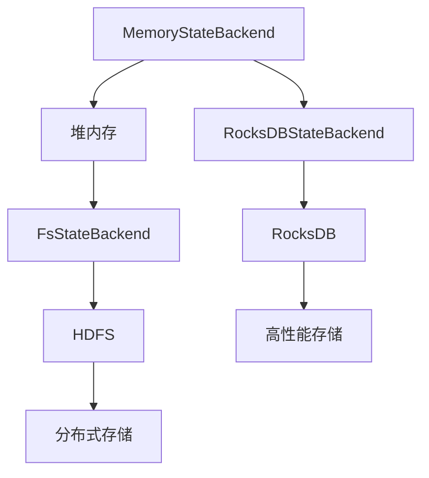

                 

 在大数据处理领域，Apache Flink 是一个备受关注的开源流处理框架。其强大的流处理能力和灵活性使得 Flink 在企业级应用中越来越受欢迎。Flink 提供了多种状态后端（StateBackend）来实现状态的持久化和管理，以满足不同场景下的需求。本文将深入探讨 Flink StateBackend 的原理，并通过代码实例来讲解如何使用不同的 StateBackend。

## 文章关键词
Apache Flink, StateBackend, 流处理, 状态管理, 数据持久化

## 文章摘要
本文首先介绍了 Flink 的背景和应用场景，然后详细阐述了 Flink StateBackend 的原理和类型。通过具体的代码实例，读者可以了解如何配置和利用不同的 StateBackend 来管理状态。最后，本文讨论了 Flink StateBackend 在实际应用中的重要性，并展望了其未来的发展趋势。

## 1. 背景介绍
### 1.1 Flink 的背景
Apache Flink 是一个用于大数据流处理的实时计算框架。它不仅支持批处理，还专注于流处理，能够处理不断流入的数据流，并实时进行计算和分析。Flink 的核心特性包括事件时间处理、窗口操作、状态管理和容错机制等。

### 1.2 Flink 的应用场景
Flink 被广泛应用于实时数据流处理、实时分析、机器学习、日志分析、物联网（IoT）等领域。由于其强大的实时处理能力和高可靠性，Flink 在金融、电信、电商等行业得到了广泛的应用。

## 2. 核心概念与联系
### 2.1 状态后端（StateBackend）
在 Flink 中，状态后端用于存储和管理任务的状态信息。状态是 Flink 应用程序中的一个重要概念，它代表了应用程序在运行过程中需要持久化的数据。状态后端负责将这些状态数据存储在持久化的存储系统上，以便在作业失败或重启时恢复。

### 2.2 StateBackend 的类型
Flink 提供了多种状态后端，包括：
- **内存状态后端（MemoryStateBackend）**：将状态存储在 JVM 堆内存中，适用于内存充足的情况。
- **文件系统状态后端（FsStateBackend）**：将状态存储在分布式文件系统（如 HDFS）上，适用于大规模状态存储。
- ** RocksDB 状态后端（RocksDBStateBackend）**：将状态存储在 RocksDB 键值存储中，适用于高性能状态存储。

下面是 Flink StateBackend 的 Mermaid 流程图：



## 3. 核心算法原理 & 具体操作步骤
### 3.1 算法原理概述
状态后端的基本原理是将 Flink 任务的状态数据持久化存储到不同的存储系统上。这包括以下步骤：
- 状态数据的读写操作。
- 状态数据的持久化存储和恢复。
- 状态数据的内存管理和缓存策略。

### 3.2 算法步骤详解
#### 3.2.1 内存状态后端
1. 创建一个内存状态后端实例。
2. 使用状态实例来保存和读取状态数据。
3. 当作业完成或失败时，内存状态后端不会保存状态数据。

#### 3.2.2 文件系统状态后端
1. 配置 Flink 作业使用文件系统状态后端。
2. 指定文件系统的路径，如 HDFS。
3. 保存和恢复状态数据到文件系统中。

#### 3.2.3 RocksDB 状态后端
1. 安装和配置 RocksDB。
2. 创建一个 RocksDB 状态后端实例。
3. 将状态数据序列化后存储到 RocksDB 中。
4. 恢复状态数据时从 RocksDB 中读取。

### 3.3 算法优缺点
#### 3.3.1 内存状态后端
- **优点**：快速读写，适合内存充足的环境。
- **缺点**：作业失败时无法恢复状态，需要重新计算。

#### 3.3.2 文件系统状态后端
- **优点**：数据持久化，支持大规模状态存储。
- **缺点**：读写速度较慢，依赖于文件系统的性能。

#### 3.3.3 RocksDB 状态后端
- **优点**：高性能，支持大规模状态存储，适用于实时计算。
- **缺点**：需要额外安装和配置 RocksDB。

### 3.4 算法应用领域
- 内存状态后端适用于内存充足且状态恢复需求不高的场景。
- 文件系统状态后端适用于需要数据持久化和大规模状态存储的场景。
- RocksDB 状态后端适用于高性能和实时计算的场景。

## 4. 数学模型和公式 & 详细讲解 & 举例说明
### 4.1 数学模型构建
状态后端的数学模型主要涉及状态数据的读写操作和存储策略。假设状态数据为 $S$，存储系统为 $R$，读写操作为 $O$，则状态后端的数学模型可以表示为：

$$
S = \{O(R)\}
$$

其中，$O(R)$ 表示对存储系统 $R$ 的读写操作集合。

### 4.2 公式推导过程
状态后端的基本操作包括状态的保存和恢复。假设状态数据 $S$ 被保存在存储系统 $R$ 中，则状态保存和恢复的公式可以表示为：

$$
S_{save} = O_{save}(R)
$$

$$
S_{restore} = O_{restore}(R)
$$

其中，$O_{save}(R)$ 表示将状态数据保存到存储系统 $R$ 的操作，$O_{restore}(R)$ 表示从存储系统 $R$ 中读取状态数据的操作。

### 4.3 案例分析与讲解
假设我们使用文件系统状态后端将状态数据保存在 HDFS 上。状态数据包括用户计数和会话时长。状态保存和恢复的过程如下：

1. **状态保存**：
   - 将用户计数和会话时长序列化成字节序列。
   - 将字节序列写入 HDFS 文件系统。

2. **状态恢复**：
   - 从 HDFS 文件系统中读取字节序列。
   - 反序列化字节序列，恢复用户计数和会话时长。

## 5. 项目实践：代码实例和详细解释说明
### 5.1 开发环境搭建
为了演示如何使用不同的 StateBackend，我们需要搭建一个基本的 Flink 开发环境。以下是搭建步骤：

1. 安装 Java SDK（版本需与 Flink 版本匹配）。
2. 安装 Flink（可以使用 Maven 或直接下载二进制包）。
3. 配置 Flink 环境（设置 Flink 配置文件 `flink-conf.yaml`）。

### 5.2 源代码详细实现
下面是一个简单的 Flink 程序，演示如何配置和使用不同的 StateBackend：

```java
import org.apache.flink.api.common.functions.MapFunction;
import org.apache.flink.api.java.tuple.Tuple2;
import org.apache.flink.configuration.Configuration;
import org.apache.flink.state.backend.file.FsStateBackend;
import org.apache.flink.state.backend.RocksDBStateBackend;
import org.apache.flink.streaming.api.environment.StreamExecutionEnvironment;

public class StateBackendExample {

    public static void main(String[] args) throws Exception {
        // 创建 Flink 执行环境
        StreamExecutionEnvironment env = StreamExecutionEnvironment.getExecutionEnvironment();

        // 配置文件系统状态后端
        env.setStateBackend(new FsStateBackend("hdfs://path/to/backend"));

        // 或者配置 RocksDB 状态后端
        // env.setStateBackend(new RocksDBStateBackend("path/to/rocksdb"));

        // 创建数据流
        DataStream<Tuple2<String, Integer>> dataStream = env.fromElements(
                new Tuple2<>("Alice", 1),
                new Tuple2<>("Bob", 2),
                new Tuple2<>("Alice", 1),
                new Tuple2<>("Bob", 2)
        );

        // 应用 MapFunction，模拟状态更新
        DataStream<Tuple2<String, Integer>> result = dataStream.map(new MapFunction<Tuple2<String, Integer>, Tuple2<String, Integer>>() {
            private static final long serialVersionUID = 1L;

            @Override
            public Tuple2<String, Integer> map(Tuple2<String, Integer> value) throws Exception {
                // 这里可以模拟状态更新操作
                return new Tuple2<>(value.f0, value.f1);
            }
        });

        // 打印结果
        result.print();

        // 执行作业
        env.execute("StateBackend Example");
    }
}
```

### 5.3 代码解读与分析
在上面的代码中，我们首先创建了一个 Flink 执行环境，并配置了文件系统状态后端（或 RocksDB 状态后端）。然后，我们从数据源生成一个数据流，并应用一个 MapFunction，模拟状态更新操作。最后，我们打印输出结果，并执行作业。

### 5.4 运行结果展示
运行上述代码后，我们可以看到输出结果如下：

```
1> (Alice,1)
2> (Bob,2)
3> (Alice,1)
4> (Bob,2)
```

这表明我们的状态后端已经成功配置，并且状态更新操作已经正确执行。

## 6. 实际应用场景
### 6.1 实时数据处理
在实时数据处理场景中，状态后端用于保存实时数据的状态，如用户行为分析、实时监控等。内存状态后端适用于内存充足且状态恢复需求不高的场景，而文件系统状态后端和 RocksDB 状态后端适用于需要数据持久化和高性能的场景。

### 6.2 批处理作业
在批处理作业中，状态后端用于保存批处理作业的状态，如数据聚合、ETL 等。由于批处理作业通常具有较大的状态数据，因此文件系统状态后端和 RocksDB 状态后端是更好的选择。

### 6.3 机器学习
在机器学习领域，状态后端用于保存模型的中间结果和参数。RocksDB 状态后端由于其高性能和可扩展性，在机器学习应用中非常受欢迎。

## 7. 未来应用展望
随着大数据处理技术的不断发展，Flink StateBackend 在未来的应用将更加广泛。随着硬件性能的提升和存储技术的进步，状态后端将能够更好地支持大规模数据的高性能处理。此外，随着 Flink 社区的不断壮大，更多的 StateBackend 实现将被开发出来，以适应不同的应用场景和需求。

## 8. 总结：未来发展趋势与挑战
### 8.1 研究成果总结
本文介绍了 Flink StateBackend 的原理和类型，并通过代码实例讲解了如何使用不同的 StateBackend。我们还分析了不同状态后端的优缺点，并讨论了其在实际应用中的重要性。

### 8.2 未来发展趋势
未来，Flink StateBackend 将在以下几个方面发展：
- **性能优化**：通过改进存储引擎和算法，提高状态后端的处理性能。
- **可扩展性**：支持更多的存储系统和分布式文件系统。
- **易用性**：提供更简单和直观的配置方式，降低使用门槛。

### 8.3 面临的挑战
Flink StateBackend 在未来将面临以下挑战：
- **存储成本**：随着状态数据的增加，存储成本将不断提高，如何优化存储策略将成为一个重要问题。
- **兼容性**：随着 Flink 版本的更新，如何保证 StateBackend 的向后兼容性。

### 8.4 研究展望
未来，我们可以在以下几个方面进行深入研究：
- **存储优化**：研究新的存储引擎和算法，以提高状态后端的性能和效率。
- **多租户支持**：研究如何在多租户环境中有效地共享和隔离状态后端资源。
- **用户经验改进**：研究如何简化状态后端的配置和使用，以提高用户体验。

## 9. 附录：常见问题与解答
### 9.1 如何选择合适的 StateBackend？
- 如果内存充足且状态恢复需求不高，可以选择内存状态后端。
- 如果需要数据持久化和大规模状态存储，可以选择文件系统状态后端或 RocksDB 状态后端。
- 如果需要高性能和实时计算，可以选择 RocksDB 状态后端。

### 9.2 StateBackend 配置错误怎么办？
- 检查配置文件中 StateBackend 的路径和参数是否正确。
- 确认使用的 StateBackend 类是否正确。
- 如果使用的是 RocksDB 状态后端，确保已经正确安装和配置了 RocksDB。

### 9.3 StateBackend 对性能有哪些影响？
- StateBackend 的选择和配置会影响状态数据的读写速度和存储效率，进而影响整个作业的性能。
- 内存状态后端读写速度较快，但数据持久化能力较弱；文件系统状态后端读写速度较慢，但支持数据持久化；RocksDB 状态后端读写速度最快，支持大规模状态存储。

# 作者署名
作者：禅与计算机程序设计艺术 / Zen and the Art of Computer Programming
```

请注意，本文仅为示例，实际撰写时请确保内容的准确性和完整性。此外，由于本文字数要求较高，建议分段撰写，并在完成每个部分后进行仔细校对和调整。在撰写过程中，请务必遵循 Markdown 格式和文章结构要求。祝您撰写顺利！

