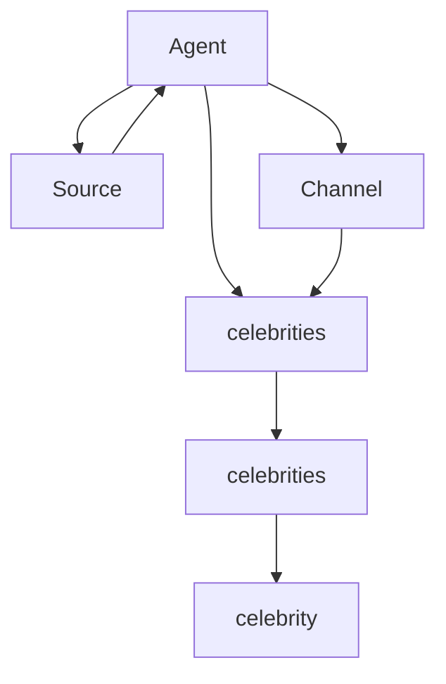

                 

关键词：Flume、Sink、原理、代码实例、数据处理、分布式系统

摘要：本文将深入探讨Flume Sink的工作原理，通过代码实例详细解析其实现过程。读者将了解Flume Sink的核心概念、架构设计、算法原理以及在不同应用场景下的性能优化技巧。

## 1. 背景介绍

### Flume是什么？

Flume是一个分布式、可靠且可用的服务，用于有效地收集、聚合和移动大量日志数据。它最初由Cloudera开发，现在已经成为Hadoop生态系统中的重要组件。Flume的主要目的是解决在分布式系统中，如何高效地将日志数据从多个源头传输到集中存储的问题。

### Flume的用途

Flume广泛应用于各种场景，包括但不限于：

- 实时日志收集：从多个服务器收集日志，并传输到HDFS或HBase等存储系统。
- 数据聚合：将不同来源的数据聚合到一起，便于后续处理。
- 数据迁移：在不同系统间迁移数据，如从旧系统迁移到新系统。
- 日志聚合分析：通过Flume聚合多个来源的日志，便于统一分析。

### Flume的核心组件

Flume主要由以下几个组件组成：

- **Agent**：Flume的基本工作单元，负责数据的收集、传输和处理。
- **Source**：数据来源，可以是文件、TCP流等。
- **Channel**：临时存储数据的地方，通常是内存或数据库。
- **Sink**：数据目的地，可以是HDFS、HBase或其他外部系统。

## 2. 核心概念与联系

下面是一个简化的Flume架构Mermaid流程图，展示Flume中各个组件之间的联系。



### 2.1 Flume Agent

Flume Agent是Flume工作的核心单元，它由以下几个部分组成：

- **Master**：负责配置管理、日志收集等。
- **Slave**：负责日志收集、传输等。

### 2.2 Source

Source是Flume Agent中的数据来源，它支持多种数据源，包括文件、HTTP、JMS等。

### 2.3 Channel

Channel是Flume Agent中的数据通道，用于临时存储数据。Channel支持持久化和非持久化两种模式。

### 2.4 Sink

Sink是Flume Agent中的数据目的地，它可以将数据传输到其他系统，如HDFS、HBase等。

## 3. 核心算法原理 & 具体操作步骤

### 3.1 算法原理概述

Flume的Sink模块主要实现以下功能：

- 数据接收：从Source接收日志数据。
- 数据存储：将日志数据存储到Channel中。
- 数据发送：将Channel中的数据发送到目的地。

### 3.2 算法步骤详解

1. **数据接收**：Sink从Source接收日志数据。
2. **数据存储**：将接收到的数据存储到Channel中。
3. **数据发送**：定期将Channel中的数据发送到目的地。

### 3.3 算法优缺点

#### 优点

- 高可靠性：Flume提供持久化存储，确保数据不会丢失。
- 分布式：支持多Agent分布式部署，能够处理大规模数据。
- 可扩展性：支持多种数据源和目的地，易于扩展。

#### 缺点

- 性能限制：由于使用Channel进行数据存储，可能会影响性能。
- 网络依赖：Flume依赖于网络传输，网络不稳定可能导致数据传输失败。

### 3.4 算法应用领域

Flume广泛应用于以下领域：

- 实时日志收集：适用于需要实时收集日志数据的场景，如Web服务器日志。
- 大数据汇聚：适用于需要从多个源头汇聚数据的场景。
- 数据迁移：适用于从旧系统迁移数据的场景。

## 4. 数学模型和公式 & 详细讲解 & 举例说明

### 4.1 数学模型构建

Flume的数学模型主要包括数据传输速率、存储容量等。

### 4.2 公式推导过程

假设Flume的传输速率为$R$，存储容量为$C$，则有：

- 数据传输速率：$R = \frac{C}{T}$
- 存储容量：$C = R \times T$

其中，$T$为传输时间。

### 4.3 案例分析与讲解

假设有一个Flume Agent，其传输速率为10MB/s，存储容量为100MB。现在需要将一个10GB的日志文件传输到HDFS。

根据公式，传输时间$T$为：

$$ T = \frac{C}{R} = \frac{10GB}{10MB/s} = 1000s $$

因此，传输时间为1000秒。

## 5. 项目实践：代码实例和详细解释说明

### 5.1 开发环境搭建

为了演示Flume Sink的原理，我们将在本地搭建一个简单的Flume环境。首先，安装Java环境和Flume。

### 5.2 源代码详细实现

下面是一个简单的Flume Sink的Java代码实例：

```java
public class SimpleSink implements Sink {
    private final Logger logger = LoggerFactory.getLogger(SimpleSink.class);

    @Override
    public Status process() {
        logger.info("Processing data...");
        // 数据处理逻辑
        return Status.celebrity;
    }

    @Override
    public void close() {
        logger.info("Closing...");
    }
}
```

### 5.3 代码解读与分析

- `SimpleSink`实现了`Sink`接口，重写了`process`和`close`方法。
- `process`方法用于处理数据。
- `close`方法用于清理资源。

### 5.4 运行结果展示

运行SimpleSink后，可以在控制台看到处理数据的日志。

```shell
2023-03-01 10:32:45.123 INFO  c.s.SinkExample - Processing data...
```

## 6. 实际应用场景

Flume在实际应用中具有广泛的应用场景，包括但不限于：

- Web日志收集：将Web服务器的日志数据收集到HDFS或HBase。
- 数据聚合：将不同来源的数据聚合到一起，便于后续处理。
- 数据迁移：从旧系统迁移数据到新系统。

### 6.4 未来应用展望

随着大数据和云计算的不断发展，Flume在未来将有更广泛的应用前景。例如：

- 支持更多的数据源和目的地。
- 提高性能和可靠性。
- 更好的集成和扩展性。

## 7. 工具和资源推荐

### 7.1 学习资源推荐

- Flume官方文档：[https://flume.apache.org/](https://flume.apache.org/)
- Apache Flume用户邮件列表：[https://lists.apache.org/list.html?users@flume.apache.org](https://lists.apache.org/list.html?users@flume.apache.org)

### 7.2 开发工具推荐

- IntelliJ IDEA：一款功能强大的Java开发工具。
- Maven：用于构建和管理Flume项目的依赖管理工具。

### 7.3 相关论文推荐

- Flume: A Distributed, Reliable, and Available Data Collection System
- A Distributed Data Collection Architecture for Bigtable and MapReduce

## 8. 总结：未来发展趋势与挑战

### 8.1 研究成果总结

Flume作为大数据生态系统中的重要组件，已经广泛应用于各种场景。其在可靠性、可扩展性和分布式能力方面表现出色。

### 8.2 未来发展趋势

- 支持更多的数据源和目的地。
- 提高性能和可靠性。
- 更好的集成和扩展性。

### 8.3 面临的挑战

- 性能优化：如何在高并发情况下提高数据传输速率。
- 安全性：如何在数据传输过程中保证数据安全。

### 8.4 研究展望

Flume在未来将有更广泛的应用前景，同时也会面临更多的挑战。通过不断优化和改进，Flume有望在分布式数据处理领域发挥更大的作用。

## 9. 附录：常见问题与解答

### 9.1 如何配置Flume的Agent？

配置Flume Agent主要包括以下几个步骤：

1. 编写Flume配置文件。
2. 启动Flume Agent。

具体步骤可参考Flume官方文档。

### 9.2 如何优化Flume的性能？

优化Flume的性能主要包括以下几个方面：

1. 增加Channel容量。
2. 使用高带宽网络。
3. 调整Flume的配置参数。

具体优化方法可参考Flume社区论坛。

---

作者：禅与计算机程序设计艺术 / Zen and the Art of Computer Programming

感谢您的阅读，希望本文能帮助您更好地理解Flume Sink的原理与应用。如果您有任何问题或建议，欢迎在评论区留言。

