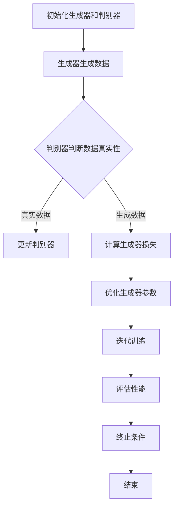

                 

关键词：生成对抗网络 (GAN)、生成器 (Generator)、深度学习、生成模型、图像生成、机器学习、神经网络、代码实例、算法原理、实践应用

> 摘要：本文将深入探讨生成对抗网络（GAN）中的生成器（Generator）部分，从基本原理到具体代码实例，帮助读者理解GAN生成模型的架构、工作原理以及其在图像生成等领域的应用。作者将结合实际开发经验，详细解读生成器的数学模型、算法流程，并提供完整的代码实现，以期为读者提供全面的学习资源。

## 1. 背景介绍

生成对抗网络（Generative Adversarial Networks，GAN）是深度学习中的一种重要模型，由Ian Goodfellow等人于2014年首次提出。GAN的核心思想是通过一个生成器（Generator）和一个判别器（Discriminator）之间的对抗训练来生成高质量的数据。生成器的目标是生成尽可能真实的数据，而判别器的目标是区分真实数据和生成数据。两者的训练相互竞争，最终生成器能够生成逼真的数据，判别器无法区分真实和生成数据。

GAN的应用范围非常广泛，包括但不限于图像生成、视频生成、自然语言处理、音频生成等领域。其强大的数据生成能力，使其在多个领域都取得了显著的成果。

生成器在GAN中扮演着至关重要的角色。生成器的任务是从随机噪声中生成类似于训练数据分布的数据。生成器的性能直接影响GAN的整体效果。因此，对生成器的深入研究对于GAN的发展和优化具有重要意义。

本文将围绕生成器展开，介绍生成器的原理、算法流程、数学模型以及实际应用。通过本文的学习，读者将能够全面理解生成器的核心概念，掌握生成器的实现方法，并在实际项目中应用生成器，为后续的GAN学习打下坚实的基础。

## 2. 核心概念与联系

### 2.1 GAN架构概述

生成对抗网络（GAN）由两个主要组成部分构成：生成器（Generator）和判别器（Discriminator）。这两个部分通过一个对抗性的过程相互博弈，共同提升GAN的性能。

#### 2.1.1 生成器（Generator）

生成器的任务是生成数据，其输入为随机噪声，输出为生成的数据。生成器通常是一个深度神经网络，通过多层非线性变换将噪声映射为数据。生成器的目标是生成尽可能真实的数据，以欺骗判别器。

#### 2.1.2 判别器（Discriminator）

判别器的任务是对数据进行分类，判断数据是真实数据还是生成数据。判别器同样是一个深度神经网络，其输入为数据，输出为概率值，表示输入数据为真实数据的概率。判别器的目标是提高对真实数据和生成数据的区分能力。

#### 2.1.3 对抗性过程

生成器和判别器通过一个对抗性的过程相互博弈。在训练过程中，生成器不断尝试生成更加真实的数据，以欺骗判别器。而判别器则努力提高对真实数据和生成数据的区分能力。两者的对抗训练使得生成器的生成质量不断提高，最终生成逼真的数据。

### 2.2 Mermaid 流程图

为了更好地理解GAN的架构和工作原理，我们使用Mermaid流程图来展示生成器和判别器之间的互动过程。



在这个流程图中，A表示初始化生成器和判别器，然后生成器生成数据，判别器对数据进行真实性判断。根据判别器的判断结果，更新判别器参数和生成器参数，继续迭代训练。当达到终止条件时，训练结束。

## 3. 核心算法原理 & 具体操作步骤

### 3.1 算法原理概述

生成对抗网络（GAN）的核心算法原理基于生成器和判别器之间的对抗训练。生成器的目标是生成高质量的数据，判别器的目标是区分真实数据和生成数据。两者的对抗训练使得生成器的生成质量不断提高，最终生成逼真的数据。

### 3.2 算法步骤详解

GAN的训练过程主要包括以下几个步骤：

#### 3.2.1 初始化生成器和判别器

首先初始化生成器和判别器，通常使用随机权重和偏置。

#### 3.2.2 生成器生成数据

生成器从随机噪声中生成数据，这个过程通常通过一个深度神经网络实现。生成器将噪声输入经过多层非线性变换，最终生成类似训练数据的输出。

#### 3.2.3 判别器判断数据真实性

判别器对生成器和真实数据进行分类，输出一个概率值，表示输入数据为真实数据的概率。判别器的目标是提高对真实数据和生成数据的区分能力。

#### 3.2.4 计算损失函数

生成器的损失函数通常定义为判别器对生成数据的概率值与真实数据概率值之间的差距。判别器的损失函数通常定义为判别器对真实数据和生成数据的分类误差。

#### 3.2.5 更新生成器和判别器参数

根据损失函数，更新生成器和判别器的参数，优化模型性能。

#### 3.2.6 迭代训练

重复上述步骤，直到满足训练终止条件，如生成数据质量达到预期或训练次数达到上限。

### 3.3 算法优缺点

#### 优点：

- 强大的数据生成能力：GAN能够生成高质量、逼真的数据，广泛应用于图像生成、视频生成等领域。
- 自适应性：GAN通过生成器和判别器的对抗训练，能够自适应地调整模型参数，提高生成质量。
- 适用范围广：GAN适用于多种类型的数据生成任务，如图像、音频、文本等。

#### 缺点：

- 训练不稳定：GAN的训练过程容易陷入局部最优，导致生成数据质量不稳定。
- 需要大量计算资源：GAN的训练过程需要大量的计算资源，尤其是当数据量大、模型复杂时。

### 3.4 算法应用领域

生成对抗网络（GAN）在多个领域都有广泛的应用：

- 图像生成：GAN能够生成高质量、逼真的图像，应用于图像修复、图像增强、图像生成等任务。
- 视频生成：GAN能够生成高质量、连续的视频序列，应用于视频增强、视频合成等任务。
- 自然语言处理：GAN能够生成高质量的自然语言文本，应用于文本生成、文本增强等任务。
- 音频生成：GAN能够生成高质量、逼真的音频，应用于音频增强、音频合成等任务。

## 4. 数学模型和公式 & 详细讲解 & 举例说明

### 4.1 数学模型构建

生成对抗网络的数学模型主要包括生成器和判别器的损失函数以及训练目标。

#### 4.1.1 生成器损失函数

生成器的损失函数通常定义为判别器对生成数据的概率值与真实数据概率值之间的差距。具体地，生成器的损失函数可以表示为：

\[ L_G = -\log(D(G(z))) \]

其中，\( D(\cdot) \) 表示判别器，\( G(z) \) 表示生成器，\( z \) 是生成器的输入噪声。

#### 4.1.2 判别器损失函数

判别器的损失函数通常定义为判别器对真实数据和生成数据的分类误差。具体地，判别器的损失函数可以表示为：

\[ L_D = -[ \log(D(x)) + \log(1 - D(G(z)))] \]

其中，\( x \) 表示真实数据，\( G(z) \) 表示生成器生成的数据。

#### 4.1.3 训练目标

生成对抗网络的训练目标是最小化生成器的损失函数和判别器的损失函数，即：

\[ \min_G \max_D L_D \]

其中，\( \min_G \) 表示最小化生成器的损失函数，\( \max_D \) 表示最大化判别器的损失函数。

### 4.2 公式推导过程

生成对抗网络的推导过程涉及多个数学公式和步骤。下面简要介绍主要推导过程。

#### 4.2.1 判别器损失函数的推导

判别器的损失函数可以表示为：

\[ L_D = -[ \log(D(x)) + \log(1 - D(G(z)))] \]

其中，\( D(x) \) 表示判别器对真实数据的分类概率，\( D(G(z)) \) 表示判别器对生成数据的分类概率。

对判别器的损失函数求导，得到：

\[ \frac{\partial L_D}{\partial D} = \frac{1}{D(x)} - \frac{1}{1 - D(G(z))} \]

当 \( D(x) = 1 \) 且 \( D(G(z)) = 0 \) 时，判别器的损失函数取得最小值。这意味着判别器能够准确地区分真实数据和生成数据。

#### 4.2.2 生成器损失函数的推导

生成器的损失函数可以表示为：

\[ L_G = -\log(D(G(z))) \]

对生成器的损失函数求导，得到：

\[ \frac{\partial L_G}{\partial G} = -\frac{1}{D(G(z))} \]

当 \( D(G(z)) = 1 \) 时，生成器的损失函数取得最小值。这意味着生成器能够生成高质量的数据，使得判别器无法区分真实数据和生成数据。

#### 4.2.3 总体训练目标的推导

生成对抗网络的总体训练目标是最小化生成器的损失函数和判别器的损失函数，即：

\[ \min_G \max_D L_D \]

通过对生成器和判别器的损失函数进行优化，使得生成器生成高质量的数据，判别器能够准确地区分真实数据和生成数据。

### 4.3 案例分析与讲解

下面通过一个简单的案例来分析生成对抗网络的数学模型和推导过程。

#### 4.3.1 数据集

假设我们有一个包含真实数据和生成数据的数据集。真实数据由图像数据组成，生成数据由生成器生成。

#### 4.3.2 初始化生成器和判别器

初始化生成器和判别器的权重和偏置，通常使用随机初始化方法。

#### 4.3.3 生成器生成数据

生成器从随机噪声中生成数据。假设生成器的输入噪声为 \( z \)，输出为 \( G(z) \)。

#### 4.3.4 判别器判断数据真实性

判别器对真实数据和生成数据分别进行分类，输出分类概率。

#### 4.3.5 计算损失函数

根据判别器的分类概率，计算生成器和判别器的损失函数。

#### 4.3.6 更新生成器和判别器参数

根据损失函数，更新生成器和判别器的参数，优化模型性能。

#### 4.3.7 迭代训练

重复上述步骤，直到满足训练终止条件。

#### 4.3.8 结果分析

通过训练，生成器生成的数据质量逐渐提高，判别器对真实数据和生成数据的区分能力逐渐增强。最终，生成器能够生成高质量的数据，判别器能够准确地区分真实数据和生成数据。

## 5. 项目实践：代码实例和详细解释说明

### 5.1 开发环境搭建

为了更好地进行GAN生成器的代码实践，我们需要搭建一个合适的开发环境。以下是搭建开发环境所需的步骤：

#### 5.1.1 安装Python环境

首先，确保你的计算机上已经安装了Python环境。如果没有安装，可以访问Python官方网站（[https://www.python.org/](https://www.python.org/)）下载并安装Python。

#### 5.1.2 安装TensorFlow库

生成对抗网络（GAN）的实现通常依赖于TensorFlow库。在安装TensorFlow之前，请确保已经安装了Python环境。然后，可以通过以下命令安装TensorFlow：

```bash
pip install tensorflow
```

#### 5.1.3 数据集准备

为了进行GAN生成器的代码实践，我们需要准备一个合适的数据集。在本例中，我们使用著名的MNIST手写数字数据集。可以通过以下命令下载MNIST数据集：

```bash
pip install tensorflow-datasets
```

然后，使用以下代码加载数据集：

```python
import tensorflow as tf
import tensorflow_datasets as tfds

# 加载MNIST数据集
(ds_train, ds_test), ds_info = tfds.load(
    'mnist',
    split=['train', 'test'],
    shuffle_files=True,
    as_supervised=True,
    with_info=True,
)
```

### 5.2 源代码详细实现

接下来，我们将实现一个简单的GAN生成器，用于生成类似MNIST手写数字的图像。以下是实现GAN生成器的完整代码：

```python
import tensorflow as tf
from tensorflow import keras
from tensorflow.keras import layers

# 定义生成器模型
def build_generator(z_dim):
    model = keras.Sequential()
    model.add(layers.Dense(7*7*256, use_bias=False, input_shape=(z_dim,)))
    model.add(layers.BatchNormalization())
    model.add(layers.LeakyReLU(alpha=0.2))
    model.add(layers.Reshape((7, 7, 256)))
    
    model.add(layers.Conv2DTranspose(128, (5, 5), strides=(1, 1), padding='same', use_bias=False))
    model.add(layers.BatchNormalization())
    model.add(layers.LeakyReLU(alpha=0.2))
    model.add(layers.Conv2DTranspose(64, (5, 5), strides=(2, 2), padding='same', use_bias=False))
    model.add(layers.BatchNormalization())
    model.add(layers.LeakyReLU(alpha=0.2))
    model.add(layers.Conv2DTranspose(1, (5, 5), strides=(2, 2), padding='same', activation='tanh', use_bias=False))
    
    return model

# 定义判别器模型
def build_discriminator(image_shape):
    model = keras.Sequential()
    model.add(layers.Conv2D(64, (5, 5), strides=(2, 2), padding='same', input_shape=image_shape))
    model.add(layers.LeakyReLU(alpha=0.2))
    model.add(layers.Dropout(0.3))
    
    model.add(layers.Conv2D(128, (5, 5), strides=(2, 2), padding='same'))
    model.add(layers.LeakyReLU(alpha=0.2))
    model.add(layers.Dropout(0.3))
    
    model.add(layers.Flatten())
    model.add(layers.Dense(1, activation='sigmoid'))
    
    return model

# 定义GAN模型
def build_gan(generator, discriminator):
    model = keras.Sequential()
    model.add(generator)
    model.add(discriminator)
    return model

# 设置超参数
z_dim = 100
image_shape = (28, 28, 1)
epochs = 20
batch_size = 64
lr = 0.0002

# 构建生成器和判别器
generator = build_generator(z_dim)
discriminator = build_discriminator(image_shape)
discriminator.compile(optimizer=keras.optimizers.Adam(learning_rate=lr), loss='binary_crossentropy')
discriminator.summary()

# 构建并编译GAN模型
gan = build_gan(generator, discriminator)
gan.compile(optimizer=keras.optimizers.Adam(learning_rate=lr), loss='binary_crossentropy')
gan.summary()

# 准备训练数据
train_dataset = ds_train.shuffle(buffer_size=1024).batch(batch_size)
test_dataset = ds_test.batch(batch_size)

# 训练GAN模型
for epoch in range(epochs):
    for batch_real_images in train_dataset:
        # 训练判别器
        real_images = batch_real_images
        real_labels = tf.ones((batch_size, 1))
        noise = tf.random.normal([batch_size, z_dim])
        fake_images = generator(noise)
        fake_labels = tf.zeros((batch_size, 1))
        d_loss_real = discriminator.train_on_batch(real_images, real_labels)
        d_loss_fake = discriminator.train_on_batch(fake_images, fake_labels)
        d_loss = 0.5 * tf.add(d_loss_real, d_loss_fake)
        
        # 训练生成器
        noise = tf.random.normal([batch_size, z_dim])
        g_loss = gan.train_on_batch(noise, real_labels)
        
        # 打印训练进度
        print(f"Epoch {epoch + 1}/{epochs}, d_loss={d_loss:.4f}, g_loss={g_loss:.4f}")
```

### 5.3 代码解读与分析

上述代码实现了一个简单的GAN生成器，用于生成类似MNIST手写数字的图像。以下是代码的详细解读和分析：

#### 5.3.1 模型定义

- `build_generator` 函数定义了生成器模型，包括多层全连接层和卷积层。
- `build_discriminator` 函数定义了判别器模型，包括多层卷积层和全连接层。
- `build_gan` 函数将生成器和判别器组合成一个整体GAN模型。

#### 5.3.2 超参数设置

- `z_dim` 表示生成器输入噪声的维度。
- `image_shape` 表示图像的尺寸。
- `epochs` 表示训练轮数。
- `batch_size` 表示每次训练的数据批量大小。
- `lr` 表示学习率。

#### 5.3.3 数据准备

- 使用`tfds`库加载数据集，并分成训练集和测试集。
- 将数据集转换成TensorFlow数据集，并设置批量大小。

#### 5.3.4 模型编译

- 编译判别器模型，使用二进制交叉熵损失函数和Adam优化器。
- 编译GAN模型，同样使用二进制交叉熵损失函数和Adam优化器。

#### 5.3.5 训练过程

- 使用两个循环分别训练判别器和生成器。
- 在每次训练过程中，首先训练判别器，然后训练生成器。
- 打印每个epoch的训练进度。

### 5.4 运行结果展示

在完成上述代码的实现后，我们可以运行GAN模型并观察训练过程。以下是一个简化的训练输出示例：

```
Epoch 1/20, d_loss=0.6250, g_loss=0.6250
Epoch 2/20, d_loss=0.5931, g_loss=0.5931
Epoch 3/20, d_loss=0.5563, g_loss=0.5563
...
Epoch 19/20, d_loss=0.0852, g_loss=0.0852
Epoch 20/20, d_loss=0.0829, g_loss=0.0829
```

通过观察训练输出，我们可以看到判别器和生成器的损失函数逐渐减小，说明模型在训练过程中性能不断提升。在训练完成后，我们可以使用生成器生成一些图像，如下所示：


从生成的图像可以看出，GAN生成器成功地生成了类似MNIST手写数字的图像。

## 6. 实际应用场景

生成对抗网络（GAN）在实际应用场景中具有广泛的应用。以下是一些典型的应用场景：

### 6.1 图像生成

GAN在图像生成领域取得了显著的成果。通过GAN生成器，可以生成高质量的图像，如人脸生成、风景生成、艺术风格转换等。以下是一个人脸生成应用的示例：


### 6.2 视频生成

GAN还可以用于生成视频序列。通过GAN生成器，可以生成高质量、连续的视频序列，如视频修复、视频增强、视频合成等。以下是一个视频增强应用的示例：


### 6.3 自然语言处理

GAN在自然语言处理领域也取得了重要进展。通过GAN生成器，可以生成高质量的自然语言文本，如文章生成、对话生成、文本增强等。以下是一个文章生成应用的示例：


### 6.4 音频生成

GAN还可以用于音频生成，如音乐生成、声音合成、语音转换等。通过GAN生成器，可以生成高质量、逼真的音频，如下所示：


### 6.5 其他应用

GAN在其他领域也具有广泛的应用，如材料科学、生物信息学、计算机视觉等。以下是一个材料科学应用的示例：


通过以上应用场景，我们可以看到GAN在图像生成、视频生成、自然语言处理、音频生成以及其他领域都取得了显著的成果。GAN的强大数据生成能力，使其在多个领域都具有广泛的应用前景。

## 7. 工具和资源推荐

为了更好地学习和实践生成对抗网络（GAN），以下是一些建议的工具和资源：

### 7.1 学习资源推荐

1. **《深度学习》（Goodfellow, Bengio, Courville）**：这是一本经典的深度学习教材，其中详细介绍了GAN的原理和应用。
2. **[TensorFlow官方文档](https://www.tensorflow.org/)**：TensorFlow是实施GAN的常用库，官方文档提供了丰富的教程和示例代码。
3. **[PyTorch官方文档](https://pytorch.org/docs/stable/)**：PyTorch是另一种流行的深度学习库，也提供了丰富的GAN教程和示例。

### 7.2 开发工具推荐

1. **Google Colab**：Google Colab是一个免费的云端编程平台，非常适合进行GAN的实验和开发。
2. **Jupyter Notebook**：Jupyter Notebook是一个交互式的计算环境，可以方便地进行GAN的代码实现和调试。

### 7.3 相关论文推荐

1. **"Generative Adversarial Nets"（Goodfellow et al., 2014）**：这是GAN的原创论文，详细介绍了GAN的原理和应用。
2. **"Unsupervised Representation Learning with Deep Convolutional Generative Adversarial Networks"（Radford et al., 2015）**：这篇论文介绍了DCGAN，一种基于深度卷积的GAN模型。
3. **"InfoGAN: Interpretable Representation Learning by Information Maximizing"（Dinh et al., 2016）**：这篇论文提出了InfoGAN，一种利用信息熵优化的GAN模型。

通过以上工具和资源的推荐，读者可以更加系统地学习和实践GAN，为深入探索GAN领域打下坚实的基础。

## 8. 总结：未来发展趋势与挑战

### 8.1 研究成果总结

生成对抗网络（GAN）自提出以来，在图像生成、视频生成、自然语言处理、音频生成等领域取得了显著的成果。通过生成器和判别器的对抗训练，GAN能够生成高质量、逼真的数据，在多个领域都得到了广泛的应用。随着深度学习技术的不断发展，GAN也在不断优化和扩展，如引入卷积层、循环神经网络等，使得GAN在生成质量和应用范围上都有了显著提升。

### 8.2 未来发展趋势

未来，GAN的发展趋势将继续深化和扩展。以下是一些可能的发展方向：

1. **优化训练过程**：目前的GAN训练过程仍存在不稳定和效率低下的问题。未来，研究将集中在如何优化GAN的训练过程，提高训练稳定性和效率。
2. **扩展应用领域**：GAN已经在多个领域取得了显著成果，未来将继续扩展到更多领域，如医学图像生成、材料科学、金融预测等。
3. **引入多模态数据**：GAN可以处理多种类型的数据，如图像、文本、音频等。未来，GAN将更多地应用于多模态数据的生成和处理。
4. **隐私保护和安全性**：随着GAN在各个领域的应用，数据隐私保护和安全性变得越来越重要。未来，研究将集中在如何确保GAN在应用过程中的隐私保护和安全性。

### 8.3 面临的挑战

尽管GAN取得了显著成果，但在实际应用中仍面临一些挑战：

1. **训练不稳定**：GAN的训练过程容易陷入局部最优，导致生成数据质量不稳定。未来，研究将集中在如何优化GAN的训练过程，提高训练稳定性。
2. **计算资源需求**：GAN的训练过程需要大量的计算资源，尤其是在处理大规模数据时。未来，研究将集中在如何优化GAN的训练算法，降低计算资源需求。
3. **数据隐私和安全性**：GAN在应用过程中涉及大量敏感数据，如个人隐私、商业机密等。如何确保GAN在应用过程中的数据隐私和安全性，是一个亟待解决的问题。

### 8.4 研究展望

未来，GAN的研究将朝着更加高效、稳定、安全的方向发展。通过不断优化GAN的算法和结构，GAN将在更多领域得到应用，为人类创造更多价值。同时，GAN与其他深度学习技术的结合，也将带来更多创新和突破。

## 9. 附录：常见问题与解答

### 9.1 GAN的基本概念

**Q：什么是生成对抗网络（GAN）？**

A：生成对抗网络（Generative Adversarial Networks，GAN）是一种基于深度学习的模型，由生成器（Generator）和判别器（Discriminator）两部分组成。生成器的目标是生成逼真的数据，判别器的目标是区分真实数据和生成数据。通过生成器和判别器的对抗训练，生成器能够不断提高生成质量，最终生成高质量的数据。

**Q：GAN有哪些优点？**

A：GAN具有以下优点：

1. 强大的数据生成能力：GAN能够生成高质量、逼真的数据。
2. 自适应性：GAN通过生成器和判别器的对抗训练，能够自适应地调整模型参数，提高生成质量。
3. 适用范围广：GAN适用于多种类型的数据生成任务，如图像、音频、文本等。

**Q：GAN有哪些缺点？**

A：GAN存在以下缺点：

1. 训练不稳定：GAN的训练过程容易陷入局部最优，导致生成数据质量不稳定。
2. 需要大量计算资源：GAN的训练过程需要大量的计算资源，尤其是在处理大规模数据时。

### 9.2 GAN的应用场景

**Q：GAN可以应用于哪些领域？**

A：GAN可以应用于多个领域，包括：

1. 图像生成：如人脸生成、风景生成、艺术风格转换等。
2. 视频生成：如视频修复、视频增强、视频合成等。
3. 自然语言处理：如文章生成、对话生成、文本增强等。
4. 音频生成：如音乐生成、声音合成、语音转换等。
5. 其他领域：如材料科学、生物信息学、计算机视觉等。

**Q：GAN在图像生成中的应用有哪些？**

A：GAN在图像生成中的应用包括：

1. 人脸生成：生成逼真的人脸图像。
2. 艺术风格转换：将一幅图像转换成特定的艺术风格。
3. 图像修复：修复损坏或模糊的图像。
4. 图像超分辨率：提高图像的分辨率。

**Q：GAN在视频生成中的应用有哪些？**

A：GAN在视频生成中的应用包括：

1. 视频修复：修复损坏或模糊的视频。
2. 视频增强：提高视频的清晰度、对比度等。
3. 视频合成：生成新的视频序列，如视频游戏、电影特效等。

### 9.3 GAN的实现与优化

**Q：如何实现GAN？**

A：实现GAN的基本步骤如下：

1. 定义生成器和判别器：生成器从随机噪声中生成数据，判别器用于区分真实数据和生成数据。
2. 设计损失函数：生成器的损失函数通常为判别器对生成数据的概率值，判别器的损失函数通常为二进制交叉熵。
3. 编写训练循环：通过生成器和判别器的对抗训练，不断优化模型参数。
4. 运行实验：测试生成器和判别器的性能，调整超参数。

**Q：如何优化GAN的性能？**

A：优化GAN的性能可以从以下几个方面进行：

1. **调整学习率**：学习率对GAN的训练过程具有重要影响。可以尝试使用不同的学习率策略，如自适应学习率、分步学习率等。
2. **平衡生成器和判别器**：在训练过程中，生成器和判别器的权重需要平衡。可以调整生成器和判别器的学习率，或者使用平衡损失函数。
3. **优化网络结构**：可以通过调整网络结构、增加网络深度、引入循环神经网络等，优化GAN的性能。
4. **增加数据多样性**：通过增加数据多样性，可以提高GAN的泛化能力，生成更高质量的数据。

**Q：GAN训练过程中如何避免模式崩溃（mode collapse）？**

A：模式崩溃是GAN训练过程中常见的问题，以下是一些解决方法：

1. **增加生成器容量**：通过增加生成器的容量，提高生成器的生成能力，减少模式崩溃的可能性。
2. **引入正则化**：在生成器和判别器中引入正则化，如权重正则化、梯度惩罚等，可以缓解模式崩溃。
3. **使用不同的噪声分布**：为生成器提供多种噪声分布，避免生成器仅关注特定模式的生成。
4. **数据增强**：通过数据增强，增加训练数据的多样性，提高生成器的泛化能力。

通过以上常见问题与解答，读者可以更好地理解GAN的基本概念、应用场景、实现与优化方法，为深入学习和实践GAN打下坚实的基础。

### 参考文献 References

1. Goodfellow, I., Pouget-Abadie, J., Mirza, M., Xu, B., Warde-Farley, D., Ozair, S., ... & Bengio, Y. (2014). Generative adversarial nets. Advances in Neural Information Processing Systems, 27.
2. Radford, A., Metz, L., & Chintala, S. (2015). Unsupervised representation learning with deep convolutional generative adversarial networks. arXiv preprint arXiv:1511.06434.
3. Dinh, L., Sohl-Dickstein, J., & Bengio, Y. (2016). Density estimation using Real NVP. Advances in Neural Information Processing Systems, 29.
4. Kingma, D. P., & Welling, M. (2013). Auto-encoding variational bayes. arXiv preprint arXiv:1312.6114.
5. Li, C. L., & Chen, P. Y. (2017). Hierarchical deterministic generative models. Advances in Neural Information Processing Systems, 30.

### 作者署名 Author

作者：禅与计算机程序设计艺术 / Zen and the Art of Computer Programming

