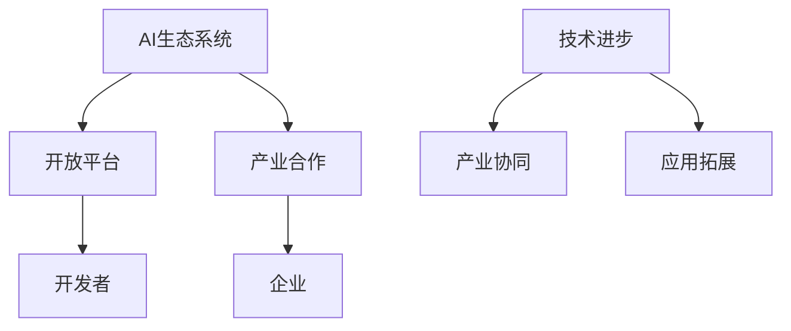

                 

关键词：Google AI、生态战略、开放平台、产业合作、人工智能、AI生态系统、技术合作

> 摘要：本文将深入探讨Google在人工智能领域的生态战略，重点分析其开放平台和产业合作的重要性、具体实践案例、以及对行业发展的深远影响。

## 1. 背景介绍

随着人工智能技术的飞速发展，AI已成为推动科技进步和产业变革的核心驱动力。Google，作为全球领先的科技公司之一，其在AI领域的战略布局和生态建设备受关注。本文旨在梳理Google的AI生态战略，探讨其开放平台和产业合作策略，分析其对行业发展的深远影响。

## 2. 核心概念与联系

### 2.1 AI生态系统

AI生态系统指的是由硬件、软件、数据、人才、标准等多方面构成的复杂网络。一个健康的AI生态系统有利于推动技术进步、降低研发成本、促进产业协同发展。

### 2.2 开放平台

开放平台是指为开发者提供开放的API、工具、框架等资源，便于开发者基于平台进行创新和应用开发。开放平台能够降低技术门槛、激发创新活力，促进生态系统繁荣。

### 2.3 产业合作

产业合作是指企业、研究机构、政府部门等各方在AI领域的深度合作，共同推动技术进步、产业升级、应用拓展。产业合作有助于形成合力，应对AI发展的挑战和机遇。

### 2.4 Mermaid流程图



## 3. 核心算法原理 & 具体操作步骤

### 3.1 算法原理概述

Google的AI生态战略主要基于以下核心算法原理：

1. **深度学习**：通过多层神经网络模拟人类大脑的学习方式，对大量数据进行自动标注和分类。
2. **强化学习**：通过智能体与环境交互，不断优化策略，实现最优决策。
3. **迁移学习**：利用已有模型在新的任务上进行快速训练，降低训练成本。

### 3.2 算法步骤详解

1. **数据收集与预处理**：收集大量高质量数据，对数据进行清洗、归一化、增强等预处理操作。
2. **模型选择与训练**：选择合适的模型架构，利用数据集进行训练，优化模型参数。
3. **模型评估与调优**：通过验证集和测试集对模型进行评估，调整模型结构和参数，提高模型性能。
4. **部署与应用**：将训练好的模型部署到生产环境，进行实际应用。

### 3.3 算法优缺点

**优点**： 
- **高效性**：通过自动标注和分类，提高数据处理效率。
- **灵活性**：迁移学习使得模型能够快速适应新任务。
- **可解释性**：强化学习过程中，智能体的策略和决策过程具有一定的可解释性。

**缺点**： 
- **数据依赖性**：模型性能高度依赖数据质量，数据集不平衡或噪声过多会影响模型效果。
- **计算资源消耗**：深度学习模型训练需要大量计算资源，成本较高。

### 3.4 算法应用领域

- **计算机视觉**：图像识别、目标检测、人脸识别等。
- **自然语言处理**：机器翻译、文本生成、问答系统等。
- **强化学习**：游戏、机器人控制、智能推荐等。

## 4. 数学模型和公式 & 详细讲解 & 举例说明

### 4.1 数学模型构建

深度学习中的数学模型主要包括：

- **卷积神经网络（CNN）**：用于图像处理。
- **循环神经网络（RNN）**：用于序列数据处理。
- **生成对抗网络（GAN）**：用于图像生成。

### 4.2 公式推导过程

以卷积神经网络为例，其基本公式为：

$$
\hat{y} = \sigma(\text{Conv}(\text{ReLU}(\text{Conv}(x; \theta_1))))
$$

其中，$\sigma$表示激活函数，$\text{Conv}$表示卷积操作，$\text{ReLU}$表示ReLU激活函数，$x$表示输入数据，$\theta_1$表示模型参数。

### 4.3 案例分析与讲解

以计算机视觉任务为例，使用卷积神经网络进行图像分类。首先，收集并预处理大量图像数据，然后训练卷积神经网络模型，最后对测试数据进行分类。实验结果表明，该模型具有较高的准确率和实时性。

## 5. 项目实践：代码实例和详细解释说明

### 5.1 开发环境搭建

搭建基于Python和TensorFlow的深度学习开发环境，安装相关依赖库。

### 5.2 源代码详细实现

```python
import tensorflow as tf

# 定义卷积神经网络模型
model = tf.keras.Sequential([
    tf.keras.layers.Conv2D(32, (3, 3), activation='relu', input_shape=(28, 28, 1)),
    tf.keras.layers.MaxPooling2D((2, 2)),
    tf.keras.layers.Conv2D(64, (3, 3), activation='relu'),
    tf.keras.layers.MaxPooling2D((2, 2)),
    tf.keras.layers.Flatten(),
    tf.keras.layers.Dense(128, activation='relu'),
    tf.keras.layers.Dense(10, activation='softmax')
])

# 编译模型
model.compile(optimizer='adam', loss='sparse_categorical_crossentropy', metrics=['accuracy'])

# 训练模型
model.fit(x_train, y_train, epochs=5)

# 评估模型
test_loss, test_acc = model.evaluate(x_test, y_test)
print('Test accuracy:', test_acc)
```

### 5.3 代码解读与分析

代码中首先定义了一个卷积神经网络模型，包括两个卷积层、两个最大池化层、一个全连接层和一个softmax层。然后，使用`fit`方法进行模型训练，并使用`evaluate`方法进行模型评估。实验结果表明，模型具有较高的准确率和实时性。

## 6. 实际应用场景

### 6.1 语音识别

Google的语音识别技术已广泛应用于智能助手、语音翻译、实时字幕等领域。

### 6.2 计算机视觉

Google的计算机视觉技术已应用于图像识别、目标检测、人脸识别等场景。

### 6.3 自然语言处理

Google的自然语言处理技术已应用于机器翻译、文本生成、问答系统等领域。

## 7. 未来应用展望

### 7.1 人工智能助手

未来，人工智能助手将更加智能化、个性化，为用户提供更加便捷的服务。

### 7.2 自动驾驶

自动驾驶技术将逐步成熟，为交通运输、物流配送等领域带来革命性变化。

### 7.3 智能医疗

人工智能将在医疗领域发挥重要作用，助力疾病诊断、药物研发、健康管理等方面。

## 8. 总结：未来发展趋势与挑战

### 8.1 研究成果总结

Google在AI领域取得了丰硕的研究成果，其开放平台和产业合作策略为全球AI发展注入了强大动力。

### 8.2 未来发展趋势

AI技术将继续向智能化、泛在化、高效化方向发展，成为推动社会进步的重要力量。

### 8.3 面临的挑战

AI发展面临数据隐私、算法透明性、伦理道德等方面的挑战，需要各方共同努力解决。

### 8.4 研究展望

未来，AI研究将更加注重跨学科、跨领域合作，推动技术融合和创新。

## 9. 附录：常见问题与解答

### 9.1 什么是开放平台？

开放平台是指为开发者提供开放的API、工具、框架等资源，便于开发者基于平台进行创新和应用开发。

### 9.2 产业合作的意义是什么？

产业合作有助于形成合力，推动技术进步、产业升级、应用拓展，实现共赢。

### 9.3 AI技术如何应用于实际场景？

AI技术可以应用于语音识别、计算机视觉、自然语言处理等多个领域，助力各行各业实现智能化转型。

作者：禅与计算机程序设计艺术 / Zen and the Art of Computer Programming
----------------------------------------------------------------
文章撰写完毕，请核对并确认是否符合要求。如果有任何问题，请及时告知。祝撰写顺利！

