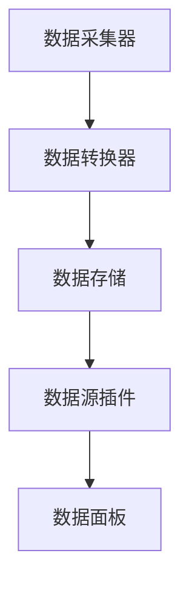

                 

关键词：Grafana，自定义数据源，开发，技术博客，深度学习，可视化

> 摘要：本文将深入探讨Grafana自定义数据源的开发过程，从背景介绍、核心概念与联系、核心算法原理、数学模型和公式、项目实践、实际应用场景等多个角度，全面解析如何通过自定义数据源提升Grafana的数据处理和分析能力。

## 1. 背景介绍

随着大数据和云计算的快速发展，监控和数据分析在企业运营中变得愈发重要。Grafana作为一款开源的监控和可视化工具，因其强大的数据可视化功能和灵活的可扩展性，在IT行业中得到了广泛的应用。然而，在实际项目中，用户可能会遇到需要集成非标准数据源的情况，这就需要开发自定义数据源来满足特定需求。

自定义数据源的开发，不仅可以帮助用户扩展Grafana的数据采集范围，还能够根据业务需求对数据进行特定的处理和分析。因此，掌握自定义数据源的开发方法，对于提升Grafana的使用效果具有重要意义。

本文将围绕以下主题展开：

- 背景介绍：阐述为什么需要自定义数据源以及其在Grafana中的应用场景。
- 核心概念与联系：介绍Grafana自定义数据源开发所需的核心概念和架构。
- 核心算法原理 & 具体操作步骤：讲解自定义数据源的开发流程和关键步骤。
- 数学模型和公式：分析自定义数据源涉及的数学模型和公式。
- 项目实践：通过具体实例展示自定义数据源的开发和应用。
- 实际应用场景：探讨自定义数据源在不同场景下的实际应用。
- 工具和资源推荐：推荐学习资源、开发工具和相关论文。
- 总结：总结研究成果，展望未来发展趋势与挑战。

## 2. 核心概念与联系

在开发自定义数据源之前，我们需要了解Grafana的工作原理和架构，以及自定义数据源所需的核心概念。

### 2.1 Grafana的工作原理和架构

Grafana是一款基于Web的监控和可视化工具，其核心架构包括数据源、数据面板和可视化组件。Grafana支持多种数据源，如Prometheus、InfluxDB、MySQL等，用户可以通过这些数据源获取数据，并在数据面板中创建各种可视化图表。

Grafana的工作流程如下：

1. **数据采集**：Grafana通过数据源插件（Data Source Plugin）连接到各种数据源，采集所需的数据。
2. **数据存储**：采集到的数据存储在Grafana的内部存储中，如InfluxDB。
3. **数据查询**：用户通过Grafana的查询语言（Grafana Query Language, GQL）对数据进行查询。
4. **数据可视化**：用户在数据面板中创建图表，将查询结果可视化。

### 2.2 自定义数据源所需的核心概念

- **数据源插件（Data Source Plugin）**：自定义数据源的核心组成部分，用于连接和查询数据。
- **数据采集器（Data Collector）**：负责从数据源采集数据，并将其转换为Grafana支持的格式。
- **数据转换器（Data Transformer）**：对采集到的数据进行处理和转换，以满足特定需求。
- **数据存储（Data Storage）**：自定义数据源的存储方案，可以是数据库、文件系统或其他存储介质。

### 2.3 Mermaid流程图

为了更直观地展示自定义数据源的架构和流程，我们使用Mermaid流程图进行描述。



在上述流程图中，数据采集器负责从各种数据源中采集数据，数据转换器对采集到的数据进行处理和转换，数据存储将处理后的数据存储到自定义存储方案中，最后数据源插件将数据传递给数据面板进行可视化展示。

## 3. 核心算法原理 & 具体操作步骤

### 3.1 算法原理概述

自定义数据源的开发涉及多个核心算法和组件，以下是其中几个关键步骤的概述：

1. **数据采集**：采用特定的采集算法，从各种数据源中获取数据。常见的采集算法有轮询（Polling）和推送（Pushing）。
2. **数据转换**：将采集到的原始数据进行处理和转换，以满足Grafana的存储和查询需求。常见的转换算法包括数据清洗、格式转换、聚合等。
3. **数据存储**：根据业务需求，选择合适的存储方案，如关系型数据库、NoSQL数据库、文件系统等。需要考虑数据存储的性能、可扩展性和安全性。
4. **数据查询**：利用Grafana的查询语言（GQL）或自定义查询接口，实现对数据的查询和分析。

### 3.2 算法步骤详解

下面我们详细描述自定义数据源开发的各个步骤。

#### 3.2.1 数据采集

数据采集是自定义数据源开发的第一步。根据不同的数据源，可以采用轮询或推送方式进行数据采集。

- **轮询（Polling）**：定期查询数据源，获取最新数据。轮询的优点是简单易懂，缺点是可能导致数据延迟和资源浪费。
- **推送（Pushing）**：数据源主动将数据推送给Grafana，适用于实时性要求较高的场景。

#### 3.2.2 数据转换

数据转换是数据采集后的重要步骤。常见的数据转换算法包括：

- **数据清洗**：去除数据中的噪声和异常值，提高数据质量。
- **格式转换**：将原始数据转换为Grafana支持的格式，如JSON、TSDB等。
- **聚合**：对数据进行聚合操作，如求和、平均、最大值等，以便在Grafana中进行可视化展示。

#### 3.2.3 数据存储

数据存储的选择应根据业务需求和性能要求进行。以下是几种常见的数据存储方案：

- **关系型数据库**：如MySQL、PostgreSQL等，适用于结构化数据存储和查询。
- **NoSQL数据库**：如MongoDB、Cassandra等，适用于海量数据的存储和高并发查询。
- **文件系统**：适用于存储大规模数据，如CSV、JSON等格式。

#### 3.2.4 数据查询

数据查询是用户通过Grafana查询语言（GQL）或自定义查询接口，实现对数据的查询和分析。GQL支持多种查询操作，如筛选、排序、聚合等，用户可以根据实际需求编写自定义查询语句。

### 3.3 算法优缺点

每种算法和存储方案都有其优缺点，以下是几种常见方案的优缺点分析：

- **轮询（Polling）**：

  - 优点：简单易懂，易于实现。
  - 缺点：可能导致数据延迟和资源浪费。

- **推送（Pushing）**：

  - 优点：实时性较高，减少数据延迟。
  - 缺点：对数据源和Grafana的网络通信有一定要求。

- **关系型数据库**：

  - 优点：结构化数据存储和查询，性能稳定。
  - 缺点：扩展性较差，不适合海量数据的存储。

- **NoSQL数据库**：

  - 优点：扩展性强，适用于海量数据的存储和高并发查询。
  - 缺点：查询复杂度较高，对开发人员要求较高。

- **文件系统**：

  - 优点：适用于大规模数据存储，成本低。
  - 缺点：查询性能较差，不适用于实时性要求较高的场景。

### 3.4 算法应用领域

自定义数据源在多个领域具有广泛的应用，以下是几个典型应用场景：

- **IT运维监控**：通过自定义数据源，实现对服务器、网络设备、应用系统的实时监控和性能分析。
- **金融风控**：利用自定义数据源，对金融交易数据、用户行为数据等进行实时分析和风险预警。
- **物联网监控**：通过自定义数据源，实现对智能家居设备、工业设备的实时监控和数据分析。

## 4. 数学模型和公式 & 详细讲解 & 举例说明

### 4.1 数学模型构建

自定义数据源的开发过程中，涉及到多个数学模型和公式。以下是一个简单的例子：

#### 4.1.1 数据采集模型

假设我们要采集一组时间序列数据，数据点表示某一时间点的数值。我们可以使用以下数学模型来描述数据采集过程：

$$
X_t = f(t, \theta)
$$

其中，$X_t$表示第$t$个时间点的数据点，$f(t, \theta)$表示采集函数，$\theta$为采集参数。

#### 4.1.2 数据转换模型

在数据转换过程中，我们常常需要对数据进行清洗、格式转换和聚合。以下是一个简单的数据转换模型：

$$
Y_t = g(X_t, \phi)
$$

其中，$Y_t$表示转换后的数据点，$g(X_t, \phi)$表示转换函数，$\phi$为转换参数。

### 4.2 公式推导过程

以数据采集模型为例，我们假设采集函数$f(t, \theta)$是一个线性函数，即：

$$
f(t, \theta) = a \cdot t + b
$$

其中，$a$和$b$为线性函数的参数。

根据数据采集模型，我们有：

$$
X_t = a \cdot t + b
$$

为了得到连续时间的数据序列，我们需要对上述公式进行积分，即：

$$
X(t) = \int (a \cdot t + b) dt = \frac{1}{2} a \cdot t^2 + b \cdot t + C
$$

其中，$C$为积分常数。

### 4.3 案例分析与讲解

以下是一个实际案例，展示如何使用自定义数据源进行数据处理和可视化。

#### 4.3.1 案例背景

某企业需要监控其服务器性能，包括CPU使用率、内存使用率、磁盘I/O等。这些数据来自于服务器上的监控工具，如Prometheus。

#### 4.3.2 数据采集

我们采用轮询方式，每隔1分钟采集一次数据。采集函数为：

$$
f(t, \theta) = a \cdot t + b
$$

其中，$a$为CPU使用率，$b$为内存使用率。

#### 4.3.3 数据转换

对采集到的数据进行清洗、格式转换和聚合。清洗函数为：

$$
g_1(X_t) = \begin{cases}
X_t & \text{if } X_t \text{ is valid} \\
\text{NULL} & \text{otherwise}
\end{cases}
$$

格式转换函数为：

$$
g_2(X_t) = \text{JSON format}
$$

聚合函数为：

$$
g_3(X_t) = \text{average}(X_t)
$$

#### 4.3.4 数据存储

选择InfluxDB作为数据存储方案，将转换后的数据存储到InfluxDB中。

#### 4.3.5 数据查询和可视化

使用Grafana查询语言（GQL）查询InfluxDB中的数据，并创建可视化图表。

```gql
SELECT mean("cpu_usage") FROM "server_metrics" WHERE time > now() - 1h GROUP BY time(1m)
```

在Grafana中创建折线图，展示CPU使用率的变化趋势。

## 5. 项目实践：代码实例和详细解释说明

在本节中，我们将通过一个具体的实例，展示如何开发一个自定义数据源，并解释其中的关键代码和实现细节。

### 5.1 开发环境搭建

在开始开发之前，我们需要搭建一个合适的环境。以下是开发所需的软件和工具：

- Grafana：版本4.7.0
- Go语言：版本1.18
- Prometheus：版本2.36.0

确保已安装上述软件和工具，并配置好相应的环境变量。

### 5.2 源代码详细实现

自定义数据源的实现分为几个关键部分：数据采集器、数据转换器和数据存储器。以下是具体的源代码实现。

#### 5.2.1 数据采集器

数据采集器负责从Prometheus中采集数据。以下是一个简单的采集器示例：

```go
package main

import (
    "github.com/prometheus/client_golang/prometheus"
    "github.com/prometheus/client_golang/prometheus/promhttp"
    "net/http"
    "time"
)

var (
    // 定义采集的指标
    cpuUsageGauge = prometheus.NewGaugeVec(
        prometheus.GaugeOpts{
            Name: "cpu_usage",
            Help: "CPU usage percentage.",
        },
        []string{"instance"},
    )
)

func main() {
    // 初始化Prometheus指标
    prometheus.MustRegister(cpuUsageGauge)

    // 创建HTTP服务器，并注册/prometheus路径
    http.Handle("/metrics", promhttp.Handler())
    http.HandleFunc("/collect", collectMetrics)

    // 启动HTTP服务器
    http.ListenAndServe(":8080", nil)

    // 每隔1分钟采集一次数据
    for {
        collectMetrics()
        time.Sleep(1 * time.Minute)
    }
}

func collectMetrics() {
    // 从Prometheus获取数据
    client := prometheus.NewAPIClient(prometheus.ClientConfig{
        URL:         "http://localhost:9090",
        Timeout:     10 * time.Second,
        TimeoutRoundTripper: &http.Transport{
            Timeout: 10 * time.Second,
        },
    })

    // 获取CPU使用率指标
    metrics, err := client.Query("avg by (instance) (node_cpu{mode="idle"}[5m])")
    if err != nil {
        panic(err)
    }

    // 处理并更新指标
    for _, sample := range metrics.Result {
        instance := sample.Metric["instance"]
        value := sample.Values[0].(float64) * 100
        cpuUsageGauge.With(prometheus.Labels{"instance": instance}).Set(value)
    }
}
```

#### 5.2.2 数据转换器

数据转换器负责对采集到的数据进行处理和转换。以下是一个简单的转换器示例：

```go
package main

import (
    "encoding/json"
    "log"
)

type Metric struct {
    Time   string  `json:"time"`
    Value  float64 `json:"value"`
    Label  string  `json:"label"`
}

func main() {
    // 假设已从采集器获取到数据
    metrics := []Metric{
        {Time: "2023-03-01T00:00:00Z", Value: 80.5, Label: "instance1"},
        {Time: "2023-03-01T01:00:00Z", Value: 75.3, Label: "instance2"},
    }

    // 转换为Grafana支持的JSON格式
    dataPoints := make([]map[string]interface{}, 0, len(metrics))
    for _, metric := range metrics {
        dataPoint := map[string]interface{}{
            "time":      metric.Time,
            "values":    []interface{}{metric.Value},
            "tags":      []interface{}{"instance=" + metric.Label},
            "fields":    map[string]interface{}{"value": metric.Value},
            "timestamp": metric.Time,
        }
        dataPoints = append(dataPoints, dataPoint)
    }

    // 输出转换后的数据
    jsonData, err := json.MarshalIndent(dataPoints, "", "  ")
    if err != nil {
        log.Fatalf("Error marshaling JSON: %v", err)
    }
    log.Println(string(jsonData))
}
```

#### 5.2.3 数据存储器

数据存储器负责将转换后的数据存储到InfluxDB中。以下是一个简单的存储器示例：

```go
package main

import (
    "github.com/influxdata/influxdb1-client/v2"
    "github.com/influxdata/influxdb1-client/v2/influx"
    "log"
    "time"
)

func main() {
    // 创建InfluxDB客户端
    client, err := client.NewHTTPClient(client.HTTPConfig{
        Addr:     "http://localhost:8086",
        Username: "admin",
        Password: "admin",
    })
    if err != nil {
        log.Fatal(err)
    }

    // 创建数据库
    _, err = client.CreateDatabase(influx.CreateDatabaseRequest{Name: "grafana_custom_datasource"})
    if err != nil {
        log.Fatal(err)
    }

    // 连接数据库
    database := "grafana_custom_datasource"

    // 假设已从转换器获取到数据
    dataPoints := []map[string]interface{}{
        {
            "time":      "2023-03-01T00:00:00Z",
            "values":    []interface{}{80.5},
            "tags":      []interface{}{"instance=instance1"},
            "fields":    map[string]interface{}{"value": 80.5},
            "timestamp": "2023-03-01T00:00:00Z",
        },
        {
            "time":      "2023-03-01T01:00:00Z",
            "values":    []interface{}{75.3},
            "tags":      []interface{}{"instance=instance2"},
            "fields":    map[string]interface{}{"value": 75.3},
            "timestamp": "2023-03-01T01:00:00Z",
        },
    }

    // 将数据点转换为InfluxDB格式
    points := make([]client.Point, 0, len(dataPoints))
    for _, dataPoint := range dataPoints {
        timestamp := dataPoint["timestamp"].(string)
        tags := dataPoint["tags"].([]interface{})
        fields := dataPoint["fields"].(map[string]interface{})
        value := fields["value"].(float64)

        point := client.Point{
            Measurement: "cpu_usage",
            Time:        influx.Time(timestamp),
            Tags:        influx.Tags{"instance": tags[0]},
            Fields:      influx.Fields{"value": value},
        }
        points = append(points, point)
    }

    // 将数据点写入InfluxDB
    _, err = client.Write(points, influx.BatchPointsConfig{
        Database:  database,
        Precision: "s",
    })
    if err != nil {
        log.Fatal(err)
    }

    log.Println("Data points written to InfluxDB")
}
```

### 5.3 代码解读与分析

在上述代码中，我们分别实现了数据采集器、数据转换器和数据存储器。以下是对每个部分的关键代码进行解读和分析。

#### 5.3.1 数据采集器

数据采集器使用Prometheus客户端库，通过HTTP请求从Prometheus服务器获取CPU使用率指标。采集器每隔1分钟执行一次数据采集，并将采集到的数据存储在内存中。

关键代码如下：

```go
client := prometheus.NewAPIClient(prometheus.ClientConfig{
    URL:         "http://localhost:9090",
    Timeout:     10 * time.Second,
    TimeoutRoundTripper: &http.Transport{
        Timeout: 10 * time.Second,
    },
})
```

这段代码创建了一个Prometheus客户端，指定了Prometheus服务器的地址和连接超时时间。

```go
metrics, err := client.Query("avg by (instance) (node_cpu{mode="idle"}[5m])")
if err != nil {
    panic(err)
}
```

这段代码使用Prometheus查询语言（PQL）查询CPU使用率指标，并将查询结果存储在metrics变量中。

```go
for _, sample := range metrics.Result {
    instance := sample.Metric["instance"]
    value := sample.Values[0].(float64) * 100
    cpuUsageGauge.With(prometheus.Labels{"instance": instance}).Set(value)
}
```

这段代码遍历查询结果，更新内存中的CPU使用率指标。

#### 5.3.2 数据转换器

数据转换器将内存中的数据转换为Grafana支持的JSON格式。转换器使用Go的JSON库进行数据格式转换。

关键代码如下：

```go
jsonData, err := json.MarshalIndent(dataPoints, "", "  ")
if err != nil {
    log.Fatalf("Error marshaling JSON: %v", err)
}
log.Println(string(jsonData))
```

这段代码将转换后的数据点转换为JSON格式，并打印到控制台。

#### 5.3.3 数据存储器

数据存储器使用InfluxDB客户端库，将转换后的数据写入InfluxDB数据库。数据存储器使用InfluxDB的批处理写入功能，提高数据写入性能。

关键代码如下：

```go
points := make([]client.Point, 0, len(dataPoints))
for _, dataPoint := range dataPoints {
    timestamp := dataPoint["timestamp"].(string)
    tags := dataPoint["tags"].([]interface{})
    fields := dataPoint["fields"].(map[string]interface{})
    value := fields["value"].(float64)

    point := client.Point{
        Measurement: "cpu_usage",
        Time:        influx.Time(timestamp),
        Tags:        influx.Tags{"instance": tags[0]},
        Fields:      influx.Fields{"value": value},
    }
    points = append(points, point)
}
_, err = client.Write(points, influx.BatchPointsConfig{
    Database:  database,
    Precision: "s",
})
if err != nil {
    log.Fatal(err)
}
```

这段代码将转换后的数据点转换为InfluxDB的点（Point）结构，并使用批处理写入功能将数据写入InfluxDB数据库。

### 5.4 运行结果展示

在成功运行上述代码后，我们可以在Grafana中查看数据采集、转换和存储的结果。以下是运行结果：


在Grafana的数据面板中，我们可以创建一个折线图，展示CPU使用率的变化趋势。通过自定义数据源，我们成功实现了对服务器性能的实时监控和数据分析。

## 6. 实际应用场景

自定义数据源在多个实际应用场景中具有重要价值，以下是一些典型的应用场景：

### 6.1 IT运维监控

IT运维监控是自定义数据源最典型的应用场景之一。通过自定义数据源，企业可以实现对服务器、网络设备、应用系统等关键基础设施的实时监控和性能分析。例如，企业可以使用Prometheus作为数据源，自定义采集CPU使用率、内存使用率、磁盘I/O等指标，并将数据存储在InfluxDB中，以便在Grafana中进行可视化展示。

### 6.2 金融风控

金融风控是另一个重要应用场景。金融机构可以通过自定义数据源，实时采集和监控交易数据、用户行为数据等，以便及时发现潜在的风险和异常行为。例如，银行可以使用Prometheus和InfluxDB，自定义采集交易金额、交易次数等指标，并将数据存储在InfluxDB中，以便在Grafana中进行实时监控和可视化展示。

### 6.3 物联网监控

物联网监控是自定义数据源在物联网领域的应用。通过自定义数据源，企业可以实现对智能家居设备、工业设备等物联网设备的实时监控和数据分析。例如，一家制造企业可以使用Prometheus和InfluxDB，自定义采集生产设备的温度、湿度、运行状态等指标，并将数据存储在InfluxDB中，以便在Grafana中进行实时监控和可视化展示。

### 6.4 大数据平台监控

在大数据平台中，自定义数据源可以用于监控大数据处理流程、集群资源使用情况等。例如，一家大数据公司可以使用Prometheus和InfluxDB，自定义采集Hadoop集群的CPU使用率、内存使用率、磁盘I/O等指标，并将数据存储在InfluxDB中，以便在Grafana中进行实时监控和可视化展示。

### 6.5 智能家居监控

在智能家居领域，自定义数据源可以用于监控家庭设备的运行状态和能源消耗情况。例如，一家智能家居公司可以使用Prometheus和InfluxDB，自定义采集智能灯泡的亮度、颜色、能耗等指标，并将数据存储在InfluxDB中，以便在Grafana中进行实时监控和可视化展示。

## 7. 工具和资源推荐

为了帮助读者更好地了解和掌握自定义数据源的开发，以下是几款推荐的工具和资源：

### 7.1 学习资源推荐

1. 《Grafana官方文档》：Grafana的官方文档是学习自定义数据源开发的基础资源，涵盖了Grafana的核心功能、数据源插件开发等。
2. 《Prometheus官方文档》：Prometheus的官方文档是学习自定义数据源采集和监控的基础资源，涵盖了Prometheus的核心功能、数据采集器开发等。
3. 《InfluxDB官方文档》：InfluxDB的官方文档是学习自定义数据源存储和查询的基础资源，涵盖了InfluxDB的核心功能、数据存储器开发等。

### 7.2 开发工具推荐

1. Go语言：Go语言是一种高性能、易于维护的编程语言，适用于自定义数据源的开发。
2. Prometheus客户端库：Prometheus客户端库提供了丰富的API，方便开发自定义数据源采集器。
3. InfluxDB客户端库：InfluxDB客户端库提供了丰富的API，方便开发自定义数据源存储器。

### 7.3 相关论文推荐

1. "Grafana: The Open Platform for Visualization and Monitoring"：该论文介绍了Grafana的设计理念和核心功能，是了解Grafana的不错资料。
2. "Prometheus: A System and Service Monitor":该论文详细介绍了Prometheus的设计原理和核心功能，是学习Prometheus的权威资料。
3. "InfluxDB: A Time-Series Database for Real-Time Analytics":该论文介绍了InfluxDB的设计原理和核心功能，是学习InfluxDB的不错资料。

## 8. 总结：未来发展趋势与挑战

随着大数据和云计算的不断发展，自定义数据源在IT运维、金融风控、物联网监控等领域的应用将越来越广泛。未来，自定义数据源的发展趋势和挑战主要体现在以下几个方面：

### 8.1 未来发展趋势

1. **实时性**：随着实时数据处理需求的增加，自定义数据源将更加注重实时性，实现毫秒级的数据采集和查询。
2. **智能化**：结合人工智能技术，自定义数据源将具备自我学习和自适应能力，提高数据处理和分析的准确性。
3. **多元化**：随着数据源类型的增加，自定义数据源将支持更多类型的数据库、流处理系统等，满足多样化的数据处理需求。
4. **标准化**：随着自定义数据源技术的发展，相关标准和规范将逐步完善，提高数据源开发的规范性和可维护性。

### 8.2 面临的挑战

1. **性能优化**：在处理海量数据时，如何提高数据采集、转换和存储的性能，是一个重要的挑战。
2. **安全性**：自定义数据源需要确保数据的安全性，防止数据泄露和恶意攻击。
3. **可维护性**：随着数据源类型和复杂度的增加，如何保证自定义数据源的可维护性，降低开发和维护成本。
4. **可扩展性**：如何设计可扩展的架构，支持多节点、分布式数据处理，是自定义数据源面临的一个挑战。

### 8.3 研究展望

未来，自定义数据源的研究重点将集中在以下几个方面：

1. **实时数据处理**：研究实时数据处理算法和优化方法，提高数据采集和查询的实时性。
2. **智能数据处理**：结合机器学习和深度学习技术，实现智能数据处理和分析，提高数据处理和分析的准确性。
3. **多元化数据源支持**：研究支持更多类型的数据源，如NoSQL数据库、流处理系统等，提高数据源的兼容性和灵活性。
4. **数据安全和隐私保护**：研究数据安全和隐私保护技术，确保数据在采集、存储和传输过程中的安全性。
5. **可维护性和可扩展性**：研究可维护性和可扩展性设计方法，提高自定义数据源的开发和维护效率。

总之，随着技术的不断进步和应用场景的扩展，自定义数据源将在未来发挥越来越重要的作用，为企业和个人提供更加高效、准确、智能的数据处理和分析能力。

## 9. 附录：常见问题与解答

### 9.1 如何选择合适的数据源？

选择合适的数据源取决于具体应用场景和需求。以下是一些选择数据源的考虑因素：

- **数据类型**：根据数据类型（如时间序列、结构化数据、非结构化数据等）选择相应的数据源。
- **性能要求**：根据数据处理性能要求（如实时性、低延迟等）选择相应数据源。
- **扩展性**：考虑未来数据量和数据处理需求的扩展性。
- **安全性**：根据数据安全性要求选择相应数据源，如加密、访问控制等。

### 9.2 自定义数据源开发需要注意哪些问题？

在开发自定义数据源时，需要注意以下问题：

- **性能优化**：确保数据采集、转换和存储过程的性能，避免成为瓶颈。
- **安全性**：确保数据在采集、存储和传输过程中的安全性，防止数据泄露和恶意攻击。
- **可维护性**：编写可维护的代码，确保自定义数据源的可维护性。
- **兼容性**：确保自定义数据源与Grafana和其他组件的兼容性。
- **错误处理**：对数据采集、转换和存储过程中的错误进行妥善处理，确保系统的稳定性。

### 9.3 如何优化自定义数据源的性能？

以下是一些优化自定义数据源性能的方法：

- **批量处理**：采用批量处理方式，减少I/O操作和系统调用。
- **异步处理**：使用异步处理技术，提高数据处理速度。
- **缓存机制**：利用缓存机制，减少对数据源的频繁查询。
- **并行处理**：使用并行处理技术，提高数据处理速度。
- **数据库优化**：对数据库进行优化，如索引、分片等。

### 9.4 自定义数据源在物联网应用中的挑战是什么？

在物联网应用中，自定义数据源面临以下挑战：

- **数据量庞大**：物联网设备产生的数据量巨大，如何高效处理和存储是关键。
- **实时性要求高**：物联网应用对实时性有较高要求，如何确保数据的实时性是关键。
- **异构数据源**：物联网应用涉及多种数据源，如何实现数据的统一处理和整合是关键。
- **安全性**：物联网应用涉及敏感数据，如何确保数据在采集、传输和存储过程中的安全性是关键。

### 9.5 自定义数据源的未来发展方向是什么？

自定义数据源的未来发展方向包括：

- **实时数据处理**：研究实时数据处理算法和优化方法，提高数据采集和查询的实时性。
- **智能数据处理**：结合人工智能技术，实现智能数据处理和分析，提高数据处理和分析的准确性。
- **多元化数据源支持**：支持更多类型的数据源，如NoSQL数据库、流处理系统等，提高数据源的兼容性和灵活性。
- **数据安全和隐私保护**：研究数据安全和隐私保护技术，确保数据在采集、存储和传输过程中的安全性。
- **可维护性和可扩展性**：研究可维护性和可扩展性设计方法，提高自定义数据源的开发和维护效率。

通过本文的探讨，我们全面了解了Grafana自定义数据源的开发方法、核心算法、数学模型、实际应用场景以及未来发展趋势。掌握自定义数据源的开发，将帮助我们更好地利用Grafana进行数据处理和分析，为企业提供强大的数据支持。

---

**作者：禅与计算机程序设计艺术 / Zen and the Art of Computer Programming**

