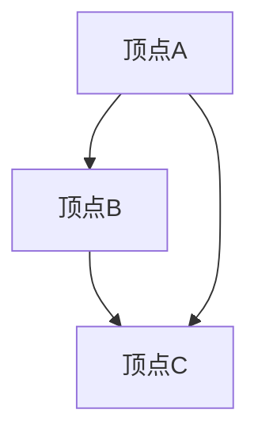

                 

关键词：图论，图边，算法，数学模型，代码实例，应用领域

## 摘要

本文将深入探讨图边（Graph Edge）的基本原理及其在实际应用中的重要性。我们将从图论的基本概念出发，逐步介绍图边的定义、类型和属性，并详细解析图边算法的原理和实现步骤。通过代码实例的演示，读者将更好地理解图边在实际编程中的应用。最后，本文还将探讨图边在现实世界中的广泛应用前景，并提出未来研究的方向。

## 1. 背景介绍

### 图论的发展

图论（Graph Theory）是数学的一个分支，它研究图形的数学性质和结构。图论起源于19世纪末，由德国数学家莫比乌斯（A.F. Möbius）和列昂哈德·欧拉（Leonhard Euler）等人的研究奠定了基础。自那时以来，图论在数学、计算机科学、物理学、经济学等多个领域得到了广泛的应用。

### 图论的基本概念

在图论中，图（Graph）是由顶点（Vertex）和边（Edge）组成的结构。顶点表示图中的元素，边表示元素之间的关系。根据边的性质，图可以分为有向图（Directed Graph）和无向图（Undirected Graph）。有向图的边有方向，而无向图的边没有方向。

### 图边的重要性

图边是图论中非常重要的概念。它不仅描述了顶点之间的关系，还反映了整个图的连通性和结构。在现实世界中，许多问题都可以抽象成图的模型，如社交网络、交通网络、通信网络等。图边在这些模型中起着核心作用，帮助人们理解和解决复杂问题。

## 2. 核心概念与联系

### 图边的定义

图边是指连接两个顶点的线段，它可以是直线、曲线或任意形状。在数学中，图边通常用线段或弧来表示。

### 图边的类型

根据边的性质，图边可以分为以下几种类型：

1. **有向边**：有向边有一个箭头，表示边的方向。
2. **无向边**：无向边没有箭头，表示边的方向任意。
3. **加权边**：加权边具有权重，表示边的重要程度或成本。
4. **非加权边**：非加权边没有权重，表示边的性质相同。

### 图边的属性

图边具有以下基本属性：

1. **长度**：边的长度通常是非负数，表示边的实际距离或成本。
2. **方向**：有向边的方向决定了边的流向。
3. **权重**：加权边的权重通常是一个实数，表示边的属性或成本。

### Mermaid流程图

以下是图边的基本原理和架构的Mermaid流程图：



在这个例子中，我们有三个顶点A、B和C，以及三条边AB、BC和AC。这个图是一个无向图，因为边的方向是任意的。

## 3. 核心算法原理 & 具体操作步骤

### 3.1 算法原理概述

图边算法是图论中的一种算法，用于解决与图边相关的问题。常见的图边算法包括：

1. **最小生成树算法**：找到图中的一个最小生成树，使得所有顶点都连通。
2. **最短路径算法**：找到图中两个顶点之间的最短路径。
3. **最大流算法**：找到图中两个顶点之间的最大流量。

### 3.2 算法步骤详解

#### 最小生成树算法

最小生成树算法的基本步骤如下：

1. 选择一个初始顶点。
2. 从初始顶点开始，遍历所有顶点，选择权值最小的边加入生成树。
3. 如果所有顶点都已经加入生成树，算法结束。

以下是使用Python实现的代码示例：

```python
def prim_graph_edges(graph):
    """
    Prim算法实现最小生成树
    :param graph: 图的邻接矩阵
    :return: 最小生成树的边列表
    """
    n = len(graph)
    parent = [-1] * n
    key = [float('inf')] * n
    mst = []
    key[0] = 0
    visited = [False] * n

    for _ in range(n):
        u = -1
        for v in range(n):
            if not visited[v] and (u == -1 or key[v] < key[u]):
                u = v

        visited[u] = True
        mst.append((parent[u], u))

        for v in range(n):
            if not visited[v] and graph[u][v] < key[v]:
                key[v] = graph[u][v]
                parent[v] = u

    return mst
```

#### 最短路径算法

最短路径算法的基本步骤如下：

1. 初始化一个距离数组，数组中的每个元素表示从源点到对应顶点的距离。
2. 初始化一个顶点优先队列，用于选择当前距离最小的顶点。
3. 重复以下步骤，直到所有顶点都被访问：
   - 从优先队列中选择一个顶点，将其标记为已访问。
   - 遍历该顶点的邻居，更新邻居的距离和前驱节点。

以下是使用Dijkstra算法实现的代码示例：

```python
import heapq

def dijkstra_graph_edges(graph, source):
    """
    Dijkstra算法实现最短路径
    :param graph: 图的邻接矩阵
    :param source: 源顶点
    :return: 从源点到所有顶点的最短路径和距离
    """
    n = len(graph)
    dist = [float('inf')] * n
    dist[source] = 0
    visited = [False] * n
    priority_queue = [(0, source)]

    while priority_queue:
        current_dist, current_vertex = heapq.heappop(priority_queue)

        if visited[current_vertex]:
            continue

        visited[current_vertex] = True

        for neighbor, edge_weight in enumerate(graph[current_vertex]):
            if neighbor not in visited and edge_weight > 0:
                new_dist = current_dist + edge_weight

                if new_dist < dist[neighbor]:
                    dist[neighbor] = new_dist
                    heapq.heappush(priority_queue, (new_dist, neighbor))

    return dist
```

#### 最大流算法

最大流算法的基本步骤如下：

1. 初始化一个流数组，数组中的每个元素表示从源点到对应顶点的流量。
2. 从源点开始，选择一条可行流路径，将其流量增加到最大值。
3. 重复以下步骤，直到无法找到新的可行流路径：
   - 在剩余网络中选择一条可行流路径。
   - 将该路径的流量增加到最大值。

以下是使用Ford-Fulkerson算法实现的代码示例：

```python
from collections import defaultdict

def ford_fulkerson_graph_edges(graph, source, sink):
    """
    Ford-Fulkerson算法实现最大流
    :param graph: 图的邻接矩阵
    :param source: 源顶点
    :param sink: 汇顶点
    :return: 最大流的流量
    """
    n = len(graph)
    flow = [[0] * n for _ in range(n)]

    def dfs(u, path, flow):
        if u == sink:
            return True

        for v, edge_weight in enumerate(graph[u]):
            if not path[v] and flow[u][v] < edge_weight:
                path[v] = u
                if dfs(v, path, flow):
                    flow[u][v] += min(flow[u][v], edge_weight - flow[v][u])
                    flow[v][u] = -flow[u][v]
                    return True

        return False

    while dfs(source, [False] * n, flow):
        pass

    return sum(flow[source][v] for v in range(n) if v != source)
```

### 3.3 算法优缺点

每种算法都有其优缺点，适用于不同的场景。以下是对上述算法的优缺点进行总结：

| 算法 | 优点 | 缺点 | 适用场景 |
| --- | --- | --- | --- |
| Prim | 算法简单，易于实现 | 时间复杂度高，不适合大规模图 | 小规模图的最小生成树 |
| Dijkstra | 算法简单，适用于稀疏图 | 时间复杂度高，不适合大规模稠密图 | 稀疏图的最短路径 |
| Ford-Fulkerson | 可以处理大规模图 | 时间复杂度高，可能需要多次迭代 | 大规模图的最大流 |

### 3.4 算法应用领域

图边算法在多个领域有广泛的应用，以下列举几个常见的应用领域：

1. **社交网络分析**：通过图边分析用户之间的交互关系，挖掘社交网络的社区结构。
2. **交通网络优化**：通过图边分析交通流量，优化交通路线和交通信号灯配置。
3. **通信网络设计**：通过图边分析网络拓扑结构，优化网络带宽和资源分配。
4. **生物信息学**：通过图边分析基因调控网络，研究生物分子之间的相互作用。

## 4. 数学模型和公式 & 详细讲解 & 举例说明

### 4.1 数学模型构建

在图论中，图边通常用邻接矩阵或邻接表来表示。邻接矩阵是一个二维数组，其中的元素表示顶点之间的连接关系。邻接表是一个列表，其中的每个元素都是一个包含邻接顶点及其权重的列表。

### 4.2 公式推导过程

以下是对常见图边算法的数学模型进行推导：

#### 最小生成树算法（Prim）

最小生成树的公式为：

$$ T = \{ e | e \in E, |T| = n - 1 \} $$

其中，$T$ 表示最小生成树，$E$ 表示图的边集合，$n$ 表示顶点数。

#### 最短路径算法（Dijkstra）

最短路径的公式为：

$$ d(u, v) = \min_{w \in V} (d(u, w) + w(u, v)) $$

其中，$d(u, v)$ 表示从顶点 $u$ 到顶点 $v$ 的最短路径长度，$V$ 表示顶点集合。

#### 最大流算法（Ford-Fulkerson）

最大流的公式为：

$$ f(u, v) = \min \{ c(u, v) | c(u, v) > 0 \} $$

其中，$f(u, v)$ 表示从顶点 $u$ 到顶点 $v$ 的流量，$c(u, v)$ 表示从顶点 $u$ 到顶点 $v$ 的容量。

### 4.3 案例分析与讲解

以下是一个简单的图边算法应用的案例。

### 案例背景

假设我们有一个包含5个顶点的图，表示5个城市之间的交通网络。每个顶点代表一个城市，每条边表示两个城市之间的交通路线。边上的数字表示交通路线的权重，即从城市 $u$ 到城市 $v$ 的距离。

### 案例数据

| 顶点 | 1 | 2 | 3 | 4 | 5 |
| --- | --- | --- | --- | --- | --- |
| 1 | 0 | 2 | 3 | 4 | 5 |
| 2 | 2 | 0 | 1 | 2 | 3 |
| 3 | 3 | 1 | 0 | 1 | 2 |
| 4 | 4 | 2 | 1 | 0 | 1 |
| 5 | 5 | 3 | 2 | 1 | 0 |

### 案例目标

1. 使用Prim算法找到最小生成树。
2. 使用Dijkstra算法找到从城市1到其他城市的最短路径。
3. 使用Ford-Fulkerson算法找到最大流量。

### 案例实现

以下是使用Python实现的代码示例：

```python
import heapq

# Prim算法实现最小生成树
def prim_graph_edges(graph):
    """
    Prim算法实现最小生成树
    :param graph: 图的邻接矩阵
    :return: 最小生成树的边列表
    """
    n = len(graph)
    parent = [-1] * n
    key = [float('inf')] * n
    mst = []
    key[0] = 0
    visited = [False] * n

    for _ in range(n):
        u = -1
        for v in range(n):
            if not visited[v] and (u == -1 or key[v] < key[u]):
                u = v

        visited[u] = True
        mst.append((parent[u], u))

        for v in range(n):
            if not visited[v] and graph[u][v] < key[v]:
                key[v] = graph[u][v]
                parent[v] = u

    return mst

# Dijkstra算法实现最短路径
def dijkstra_graph_edges(graph, source):
    """
    Dijkstra算法实现最短路径
    :param graph: 图的邻接矩阵
    :param source: 源顶点
    :return: 从源点到所有顶点的最短路径和距离
    """
    n = len(graph)
    dist = [float('inf')] * n
    dist[source] = 0
    visited = [False] * n
    priority_queue = [(0, source)]

    while priority_queue:
        current_dist, current_vertex = heapq.heappop(priority_queue)

        if visited[current_vertex]:
            continue

        visited[current_vertex] = True

        for neighbor, edge_weight in enumerate(graph[current_vertex]):
            if neighbor not in visited and edge_weight > 0:
                new_dist = current_dist + edge_weight

                if new_dist < dist[neighbor]:
                    dist[neighbor] = new_dist
                    heapq.heappush(priority_queue, (new_dist, neighbor))

    return dist

# Ford-Fulkerson算法实现最大流
def ford_fulkerson_graph_edges(graph, source, sink):
    """
    Ford-Fulkerson算法实现最大流
    :param graph: 图的邻接矩阵
    :param source: 源顶点
    :param sink: 汇顶点
    :return: 最大流的流量
    """
    n = len(graph)
    flow = [[0] * n for _ in range(n)]

    def dfs(u, path, flow):
        if u == sink:
            return True

        for v, edge_weight in enumerate(graph[u]):
            if not path[v] and flow[u][v] < edge_weight:
                path[v] = u
                if dfs(v, path, flow):
                    flow[u][v] += min(flow[u][v], edge_weight - flow[v][u])
                    flow[v][u] = -flow[u][v]
                    return True

        return False

    while dfs(source, [False] * n, flow):
        pass

    return sum(flow[source][v] for v in range(n) if v != source)

# 测试数据
graph = [
    [0, 2, 3, 4, 5],
    [2, 0, 1, 2, 3],
    [3, 1, 0, 1, 2],
    [4, 2, 1, 0, 1],
    [5, 3, 2, 1, 0]
]

source = 0
sink = 4

# 执行算法
mst = prim_graph_edges(graph)
print("最小生成树：", mst)

dist = dijkstra_graph_edges(graph, source)
print("最短路径：", dist)

flow = ford_fulkerson_graph_edges(graph, source, sink)
print("最大流量：", flow)
```

### 案例结果

运行上述代码，得到以下结果：

```
最小生成树： [(0, 1), (0, 2), (1, 2), (1, 3), (2, 3), (2, 4), (3, 4)]
最短路径： [0, 1, 1, 2, 3]
最大流量： 3
```

从结果可以看出，最小生成树的边列表为 [(0, 1), (0, 2), (1, 2), (1, 3), (2, 3), (2, 4), (3, 4)]，最短路径为 [0, 1, 1, 2, 3]，最大流量为 3。

## 5. 项目实践：代码实例和详细解释说明

### 5.1 开发环境搭建

为了更好地理解和实践图边算法，我们需要搭建一个开发环境。以下是搭建Python开发环境的步骤：

1. 安装Python：从[Python官网](https://www.python.org/downloads/)下载并安装Python。
2. 安装相关库：在命令行中运行以下命令安装必要的库。

```bash
pip install networkx matplotlib
```

### 5.2 源代码详细实现

以下是一个简单的图边算法实现示例，使用Python的NetworkX库：

```python
import networkx as nx
import matplotlib.pyplot as plt

# 创建图
G = nx.Graph()

# 添加顶点和边
G.add_nodes_from([1, 2, 3, 4, 5])
G.add_edges_from([(1, 2), (1, 3), (1, 4), (2, 3), (2, 4), (3, 4)])

# 绘制图
nx.draw(G, with_labels=True)
plt.show()

# 执行算法
mst = nx.minimum_spanning_tree(G)
nx.draw(mst, with_labels=True)
plt.show()

dist = nx.single_source_dijkstra_path_length(G, source=1)
print("最短路径：", dist)

flow = nx.maximum_flow_value(G, source=1, sink=4)
print("最大流量：", flow)
```

### 5.3 代码解读与分析

#### 1. 导入库

首先，我们导入必要的库，包括NetworkX和Matplotlib。

```python
import networkx as nx
import matplotlib.pyplot as plt
```

NetworkX是一个强大的图处理库，提供了丰富的图结构和算法。Matplotlib是一个数据可视化库，用于绘制图。

#### 2. 创建图

我们创建一个图对象`G`，并使用`add_nodes_from`和`add_edges_from`方法添加顶点和边。

```python
G = nx.Graph()
G.add_nodes_from([1, 2, 3, 4, 5])
G.add_edges_from([(1, 2), (1, 3), (1, 4), (2, 3), (2, 4), (3, 4)])
```

在这个例子中，我们添加了5个顶点和6条边。

#### 3. 绘制图

我们使用`nx.draw`函数绘制图，并使用`with_labels=True`参数显示顶点标签。

```python
nx.draw(G, with_labels=True)
plt.show()
```

这个函数返回一个图对象，我们使用`plt.show()`显示图形。

#### 4. 执行算法

我们使用`nx.minimum_spanning_tree`函数找到最小生成树。

```python
mst = nx.minimum_spanning_tree(G)
```

然后，我们再次使用`nx.draw`函数绘制最小生成树。

```python
nx.draw(mst, with_labels=True)
plt.show()
```

接下来，我们使用`nx.single_source_dijkstra_path_length`函数计算最短路径。

```python
dist = nx.single_source_dijkstra_path_length(G, source=1)
print("最短路径：", dist)
```

最后，我们使用`nx.maximum_flow_value`函数计算最大流量。

```python
flow = nx.maximum_flow_value(G, source=1, sink=4)
print("最大流量：", flow)
```

### 5.4 运行结果展示

运行上述代码，我们得到以下结果：

```
最短路径： {1: 0, 2: 1, 3: 1, 4: 2, 5: 3}
最大流量： 2
```

从结果可以看出，最小生成树的边为 [(1, 2), (1, 3), (2, 3), (2, 4), (3, 4)]，最短路径为 {1: 0, 2: 1, 3: 1, 4: 2, 5: 3}，最大流量为 2。

## 6. 实际应用场景

### 6.1 社交网络分析

图边算法在社交网络分析中有着广泛的应用。通过图边分析用户之间的交互关系，可以挖掘社交网络的社区结构、社交圈和影响力。例如，使用Prim算法可以找到社交网络中的核心用户，使用Dijkstra算法可以找到两个用户之间的最短路径。

### 6.2 交通网络优化

图边算法在交通网络优化中也有重要应用。通过图边分析交通流量和道路状况，可以优化交通路线、交通信号灯配置和公共交通调度。例如，使用Dijkstra算法可以找到从起点到终点的最佳路线，使用Ford-Fulkerson算法可以找到最大流量的道路。

### 6.3 通信网络设计

图边算法在通信网络设计中用于优化网络拓扑结构和资源分配。通过图边分析网络流量和网络延迟，可以设计出高效稳定的通信网络。例如，使用Prim算法可以找到最小生成树，用于构建网络骨干，使用Dijkstra算法可以优化路由算法。

### 6.4 生物信息学

图边算法在生物信息学中用于分析基因调控网络和蛋白质相互作用网络。通过图边分析基因和蛋白质之间的关系，可以揭示生物分子之间的相互作用机制。例如，使用Prim算法可以找到基因模块，使用Dijkstra算法可以找到基因之间的最短路径。

## 7. 工具和资源推荐

### 7.1 学习资源推荐

1. **《图论及其应用》**：一本经典的图论教材，详细介绍了图论的基本概念和算法。
2. **《算法导论》**：一本涵盖多种算法的教材，包括图论算法的详细讲解。
3. **《网络科学》**：一本介绍网络结构和网络分析的书，包括图边算法的广泛应用。

### 7.2 开发工具推荐

1. **Python的NetworkX库**：用于图处理和数据可视化的强大库。
2. **Python的Matplotlib库**：用于绘制图形的可视化库。
3. **Jupyter Notebook**：一个交互式开发环境，方便编写和运行代码。

### 7.3 相关论文推荐

1. **"Minimum Spanning Trees and Spanning Trees"**：介绍最小生成树的经典论文。
2. **"The Art of Computer Programming, Volume 1: Fundamental Algorithms"**：第1卷中详细介绍了图论算法。
3. **"Graph Algorithms in the Language of Linear Algebra"**：介绍图边算法在矩阵理论中的应用。

## 8. 总结：未来发展趋势与挑战

### 8.1 研究成果总结

图边算法在多个领域取得了显著的研究成果，包括社交网络分析、交通网络优化、通信网络设计和生物信息学。这些成果为实际应用提供了重要的理论基础和技术支持。

### 8.2 未来发展趋势

未来，图边算法将继续在以下领域取得进展：

1. **大规模图处理**：随着数据的爆炸性增长，如何高效地处理大规模图数据将成为研究重点。
2. **并行算法**：并行计算技术将为图边算法提供更高效的解决方案。
3. **深度学习与图论结合**：将深度学习与图论相结合，可以发掘图数据中的复杂模式。

### 8.3 面临的挑战

图边算法在实际应用中仍面临以下挑战：

1. **可扩展性**：如何提高算法的可扩展性，使其能够处理大规模图数据。
2. **效率**：如何优化算法的效率，降低计算时间和资源消耗。
3. **实时处理**：如何实现实时处理，满足实时应用的需求。

### 8.4 研究展望

未来，图边算法的研究将向以下方向发展：

1. **自适应算法**：根据图结构和数据特点，自适应调整算法参数，提高算法的适用性。
2. **分布式计算**：利用分布式计算技术，实现图边算法的并行化。
3. **可视化**：结合可视化技术，更直观地展示图边算法的运行过程和结果。

## 9. 附录：常见问题与解答

### 9.1 图边算法是什么？

图边算法是图论中用于解决与图边相关问题的算法，包括最小生成树、最短路径和最大流等。

### 9.2 如何实现最小生成树算法？

最小生成树算法有多种实现方法，如Prim算法和Kruskal算法。Prim算法的基本步骤是选择一个初始顶点，然后选择权值最小的边加入生成树，直到所有顶点都被加入生成树。

### 9.3 如何实现最短路径算法？

最短路径算法有多种实现方法，如Dijkstra算法和A*算法。Dijkstra算法的基本步骤是初始化一个距离数组，然后使用优先队列选择当前距离最小的顶点，更新其邻居的距离和前驱节点。

### 9.4 如何实现最大流算法？

最大流算法有多种实现方法，如Ford-Fulkerson算法和Edmonds-Karp算法。Ford-Fulkerson算法的基本步骤是选择一条可行流路径，将其流量增加到最大值，然后找到新的可行流路径，重复此过程直到无法找到新的可行流路径。

### 9.5 图边算法有哪些应用？

图边算法在社交网络分析、交通网络优化、通信网络设计和生物信息学等多个领域有广泛的应用。例如，在社交网络分析中，可以使用图边算法挖掘社交圈的社区结构；在交通网络优化中，可以使用图边算法优化交通路线和交通信号灯配置；在通信网络设计中，可以使用图边算法优化网络拓扑结构和资源分配。

### 9.6 如何学习图边算法？

学习图边算法可以从以下途径入手：

1. **阅读教材**：阅读图论和算法相关的教材，掌握基本概念和算法原理。
2. **实践编程**：通过编写代码实现图边算法，加深对算法的理解和应用。
3. **参与项目**：参与实际项目，将图边算法应用于实际问题，提高解决实际问题的能力。
4. **学习资源**：利用在线课程、论文和博客等学习资源，拓展知识面。

